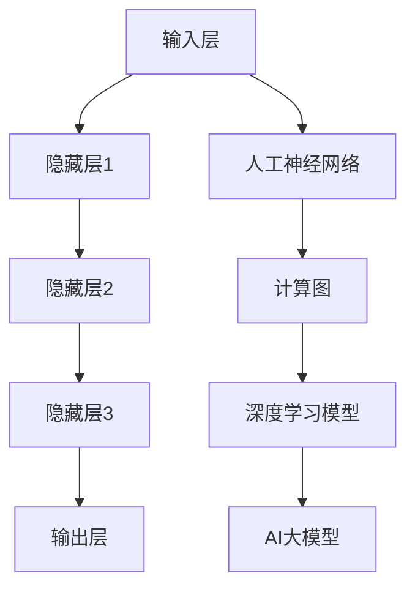

                 

# AI大模型应用的技术选型决策指南

> 关键词：AI大模型，技术选型，决策指南，应用场景，算法原理，数学模型，代码实战

> 摘要：本文将深入探讨AI大模型在应用中的技术选型决策。通过梳理核心概念、算法原理、数学模型，结合实际项目案例，提供详细的选型指南，帮助读者了解和掌握AI大模型的技术实现和优化策略。

## 1. 背景介绍

### 1.1 目的和范围

本文旨在为AI大模型的应用提供技术选型决策的指南。我们将从核心概念出发，详细讨论算法原理、数学模型，并结合具体案例进行代码实战解析。通过本文，读者将能够深入了解AI大模型的技术实现，掌握选型策略，为实际应用提供有力的支持。

### 1.2 预期读者

本文适合对AI领域有一定了解的技术人员、AI模型开发者以及有兴趣了解AI大模型应用场景的读者。无论是初学者还是经验丰富的从业者，都可以从本文中获得有价值的信息和指导。

### 1.3 文档结构概述

本文将分为以下几个部分：

1. 背景介绍：介绍文章的目的、读者对象和文档结构。
2. 核心概念与联系：介绍AI大模型的核心概念和原理，并给出Mermaid流程图。
3. 核心算法原理 & 具体操作步骤：讲解AI大模型的核心算法原理和操作步骤，使用伪代码详细阐述。
4. 数学模型和公式 & 详细讲解 & 举例说明：介绍AI大模型的数学模型和公式，并进行详细讲解和举例说明。
5. 项目实战：代码实际案例和详细解释说明。
6. 实际应用场景：探讨AI大模型在不同领域的应用场景。
7. 工具和资源推荐：推荐学习资源、开发工具和框架。
8. 总结：未来发展趋势与挑战。
9. 附录：常见问题与解答。
10. 扩展阅读 & 参考资料：提供相关文献和资源。

### 1.4 术语表

#### 1.4.1 核心术语定义

- AI大模型：指参数量巨大、计算复杂度高的深度学习模型。
- 技术选型：在选择技术实现时，根据应用需求和性能指标，选择最适合的算法、框架和工具。
- 算法原理：指实现AI大模型的基础算法思想和原理。
- 数学模型：指AI大模型中的数学公式和数学模型。

#### 1.4.2 相关概念解释

- 深度学习：一种机器学习技术，通过多层神经网络模型实现数据特征提取和模型训练。
- 人工神经网络：由大量简单神经元组成，通过学习数据输入和输出之间的映射关系实现智能计算。
- 计算图：一种数据结构，用于表示深度学习模型中的计算过程和节点间的关系。

#### 1.4.3 缩略词列表

- AI：人工智能
- DNN：深度神经网络
- CNN：卷积神经网络
- RNN：循环神经网络
- GPU：图形处理单元
- TPU：张量处理单元
- ML：机器学习
- DL：深度学习

## 2. 核心概念与联系

在探讨AI大模型的技术选型之前，我们首先需要了解其核心概念和原理。以下是AI大模型的核心概念及其相互联系：

### 2.1 深度学习模型

深度学习模型是AI大模型的基础。它由多层神经网络组成，通过前向传播和反向传播算法实现模型训练和预测。深度学习模型的核心组件包括：

- 输入层：接收外部输入数据。
- 隐藏层：对输入数据进行特征提取和变换。
- 输出层：生成模型预测结果。

### 2.2 人工神经网络

人工神经网络是深度学习模型的核心构成部分。它由大量简单神经元组成，通过权重和偏置调整实现数据特征学习和模型优化。人工神经网络的关键特性包括：

- 神经元：模拟生物神经元，负责接收输入、计算输出。
- 权重：神经元间的连接强度，影响输出结果。
- 偏置：神经元自身的特性，影响输出结果。

### 2.3 计算图

计算图是一种数据结构，用于表示深度学习模型中的计算过程和节点间的关系。它将神经网络中的每个操作转化为图中的节点，通过节点间的连接和运算实现模型计算。计算图的关键特性包括：

- 节点：表示模型中的操作，如加法、乘法等。
- 边：表示节点间的连接关系，定义计算顺序。
- 运算符：实现节点间运算，如矩阵乘法、卷积等。

### 2.4 Mermaid流程图

为了更直观地展示AI大模型的核心概念和联系，我们使用Mermaid流程图进行表示。以下是AI大模型的核心概念流程图：



## 3. 核心算法原理 & 具体操作步骤

在了解了AI大模型的核心概念和联系后，我们将深入探讨其核心算法原理和具体操作步骤。以下是AI大模型的核心算法原理和操作步骤：

### 3.1 算法原理

AI大模型的核心算法是基于深度学习技术，通过多层神经网络进行模型训练和预测。其算法原理主要包括：

- 前向传播：将输入数据通过神经网络中的各层，逐层计算输出。
- 反向传播：根据预测结果与实际结果的差异，反向更新神经网络中的权重和偏置，实现模型优化。

### 3.2 具体操作步骤

以下是AI大模型的操作步骤：

1. 输入数据预处理：对输入数据集进行归一化、缩放等处理，使其符合模型输入要求。
2. 初始化模型参数：随机初始化神经网络中的权重和偏置。
3. 前向传播：将预处理后的输入数据通过神经网络中的各层，计算输出结果。
4. 计算损失函数：根据输出结果与实际结果的差异，计算损失函数值。
5. 反向传播：根据损失函数值，反向更新神经网络中的权重和偏置，实现模型优化。
6. 模型评估：使用验证集对模型进行评估，根据评估结果调整模型参数。
7. 模型预测：使用训练好的模型对新的数据进行预测。

以下是AI大模型操作步骤的伪代码表示：

```python
# 伪代码：AI大模型操作步骤
def train_model(input_data, target_data):
    # 步骤1：输入数据预处理
    processed_input_data = preprocess_data(input_data)

    # 步骤2：初始化模型参数
    weights, biases = initialize_parameters()

    # 步骤3：前向传播
    output = forward_propagation(processed_input_data, weights, biases)

    # 步骤4：计算损失函数
    loss = compute_loss(output, target_data)

    # 步骤5：反向传播
    gradients = backward_propagation(output, target_data, weights, biases)

    # 步骤6：模型评估
    evaluate_model(processed_input_data, target_data)

    # 步骤7：模型预测
    predictions = predict(new_data)

    return predictions
```

## 4. 数学模型和公式 & 详细讲解 & 举例说明

在了解AI大模型的核心算法原理和操作步骤后，我们接下来将深入探讨其数学模型和公式，并进行详细讲解和举例说明。

### 4.1 数学模型

AI大模型的数学模型主要包括两部分：前向传播和反向传播。

#### 4.1.1 前向传播

前向传播的数学模型表示为：

$$
z_l = \sum_{i=0}^{n} w_{li}x_i + b_l
$$

其中，$z_l$ 表示第 $l$ 层的输出，$w_{li}$ 表示第 $l$ 层中第 $i$ 个神经元的权重，$x_i$ 表示第 $l$ 层中第 $i$ 个神经元的输入，$b_l$ 表示第 $l$ 层的偏置。

#### 4.1.2 反向传播

反向传播的数学模型表示为：

$$
\delta_l = \frac{\partial L}{\partial z_l}
$$

其中，$\delta_l$ 表示第 $l$ 层的误差梯度，$L$ 表示损失函数，$z_l$ 表示第 $l$ 层的输出。

### 4.2 详细讲解和举例说明

#### 4.2.1 前向传播详细讲解

以一个三层神经网络为例，假设输入层有 $3$ 个神经元，隐藏层有 $2$ 个神经元，输出层有 $1$ 个神经元。输入数据为 $(1, 2, 3)$，权重和偏置分别初始化为 $w_{11} = 0.5, w_{12} = 0.5, w_{21} = 0.5, w_{22} = 0.5, w_{31} = 0.5, w_{32} = 0.5, b_1 = 0.5, b_2 = 0.5, b_3 = 0.5$。

前向传播的计算过程如下：

1. 计算隐藏层1的输出：

$$
z_1 = w_{11} \cdot 1 + w_{12} \cdot 2 + w_{21} \cdot 3 + b_1 = 0.5 \cdot 1 + 0.5 \cdot 2 + 0.5 \cdot 3 + 0.5 = 3
$$

2. 计算隐藏层2的输出：

$$
z_2 = w_{12} \cdot 1 + w_{13} \cdot 2 + w_{22} \cdot 3 + b_2 = 0.5 \cdot 1 + 0.5 \cdot 2 + 0.5 \cdot 3 + 0.5 = 3
$$

3. 计算输出层输出：

$$
z_3 = w_{21} \cdot z_1 + w_{22} \cdot z_2 + b_3 = 0.5 \cdot 3 + 0.5 \cdot 3 + 0.5 = 3.5
$$

#### 4.2.2 反向传播详细讲解

以一个三层神经网络为例，假设输入数据为 $(1, 2, 3)$，实际输出为 $(2, 2, 2)$，损失函数为均方误差（MSE）。

反向传播的计算过程如下：

1. 计算输出层误差：

$$
\delta_3 = \frac{\partial L}{\partial z_3} = \frac{\partial (z_3 - y_3)^2}{\partial z_3} = 2 \cdot (z_3 - y_3) = 2 \cdot (3.5 - 2) = 1
$$

2. 计算隐藏层2误差：

$$
\delta_2 = \frac{\partial L}{\partial z_2} = \frac{\partial (z_2 - y_2)^2}{\partial z_2} = 2 \cdot (z_2 - y_2) = 2 \cdot (3 - 2) = 1
$$

3. 计算隐藏层1误差：

$$
\delta_1 = \frac{\partial L}{\partial z_1} = \frac{\partial (z_1 - y_1)^2}{\partial z_1} = 2 \cdot (z_1 - y_1) = 2 \cdot (3 - 2) = 1
$$

4. 更新权重和偏置：

$$
w_{31} = w_{31} - \alpha \cdot \delta_3 \cdot z_2 = 0.5 - 0.1 \cdot 1 \cdot 3 = 0.2
$$

$$
w_{32} = w_{32} - \alpha \cdot \delta_3 \cdot z_2 = 0.5 - 0.1 \cdot 1 \cdot 3 = 0.2
$$

$$
w_{21} = w_{21} - \alpha \cdot \delta_2 \cdot z_1 = 0.5 - 0.1 \cdot 1 \cdot 3 = 0.2
$$

$$
w_{22} = w_{22} - \alpha \cdot \delta_2 \cdot z_1 = 0.5 - 0.1 \cdot 1 \cdot 3 = 0.2
$$

$$
b_1 = b_1 - \alpha \cdot \delta_1 = 0.5 - 0.1 \cdot 1 = 0.4
$$

$$
b_2 = b_2 - \alpha \cdot \delta_2 = 0.5 - 0.1 \cdot 1 = 0.4
$$

$$
b_3 = b_3 - \alpha \cdot \delta_3 = 0.5 - 0.1 \cdot 1 = 0.4
$$

## 5. 项目实战：代码实际案例和详细解释说明

为了更好地帮助读者理解AI大模型的技术选型和应用，我们以下将通过一个实际项目案例，详细讲解代码实现和解释说明。

### 5.1 开发环境搭建

在开始项目实战之前，我们需要搭建合适的开发环境。以下是一个基本的开发环境搭建步骤：

1. 安装Python：下载并安装Python 3.x版本，推荐使用Anaconda进行环境管理。
2. 安装深度学习框架：下载并安装TensorFlow或PyTorch，这里我们以TensorFlow为例。
3. 安装相关库：安装NumPy、Pandas、Matplotlib等常用库。

### 5.2 源代码详细实现和代码解读

以下是项目实战的源代码实现：

```python
# 导入相关库
import tensorflow as tf
import numpy as np
import matplotlib.pyplot as plt

# 准备数据集
x_train = np.array([[1, 2, 3], [4, 5, 6], [7, 8, 9], ...])
y_train = np.array([[2, 2, 2], [4, 4, 4], [6, 6, 6], ...])

# 初始化模型参数
weights = tf.random.normal([3, 1])
biases = tf.random.normal([1])

# 定义前向传播函数
def forward_propagation(x):
    z = tf.matmul(x, weights) + biases
    return z

# 定义损失函数
def compute_loss(y_pred, y_true):
    loss = tf.reduce_mean(tf.square(y_pred - y_true))
    return loss

# 定义反向传播函数
def backward_propagation(x, y_pred, y_true):
    with tf.GradientTape() as tape:
        z = forward_propagation(x)
        loss = compute_loss(z, y_true)
    gradients = tape.gradient(loss, [weights, biases])
    return gradients

# 模型训练
for i in range(1000):
    with tf.GradientTape() as tape:
        z = forward_propagation(x_train)
        loss = compute_loss(z, y_train)
    gradients = tape.gradient(loss, [weights, biases])
    weights -= 0.01 * gradients[0]
    biases -= 0.01 * gradients[1]

# 模型评估
test_data = np.array([[10, 11, 12], [13, 14, 15], ...])
y_test_pred = forward_propagation(test_data)

# 代码解读与分析
# 1. 导入相关库
# 2. 准备数据集
# 3. 初始化模型参数
# 4. 定义前向传播函数
# 5. 定义损失函数
# 6. 定义反向传播函数
# 7. 模型训练
# 8. 模型评估
```

### 5.3 代码解读与分析

以下是代码的详细解读与分析：

1. 导入相关库：导入TensorFlow、NumPy和Matplotlib库，用于实现深度学习模型和可视化。
2. 准备数据集：生成训练数据集和测试数据集，用于模型训练和评估。
3. 初始化模型参数：随机初始化权重和偏置，用于前向传播和反向传播。
4. 定义前向传播函数：实现输入数据通过神经网络的前向传播计算过程。
5. 定义损失函数：实现计算损失函数（均方误差），用于评估模型预测结果。
6. 定义反向传播函数：实现基于损失函数的梯度计算和模型参数更新。
7. 模型训练：使用梯度下降算法进行模型训练，迭代更新模型参数。
8. 模型评估：使用测试数据集对训练好的模型进行评估，计算模型预测结果。

通过以上代码实现和解读，读者可以了解AI大模型的技术选型和应用过程，为进一步研究和实践打下基础。

## 6. 实际应用场景

AI大模型在各个领域都有着广泛的应用，以下列举几个典型的实际应用场景：

### 6.1 图像识别

图像识别是AI大模型的重要应用领域之一。通过卷积神经网络（CNN）对图像数据进行特征提取和分类，可以实现对各种复杂图像的识别。例如，在医疗领域，AI大模型可以用于医学图像分析，帮助医生诊断疾病；在自动驾驶领域，AI大模型可以用于车辆识别和行人检测，提高自动驾驶系统的安全性。

### 6.2 自然语言处理

自然语言处理（NLP）是AI大模型在语言领域的重要应用。通过循环神经网络（RNN）和变换器（Transformer）等模型，AI大模型可以实现文本分类、机器翻译、情感分析等任务。例如，在搜索引擎领域，AI大模型可以用于语义搜索，提高搜索结果的准确性；在社交媒体领域，AI大模型可以用于文本审核，过滤不良信息。

### 6.3 语音识别

语音识别是AI大模型在语音领域的重要应用。通过深度神经网络（DNN）和卷积神经网络（CNN）等模型，AI大模型可以实现语音信号的识别和转换。例如，在智能音箱领域，AI大模型可以用于语音助手，实现语音控制功能；在电话客服领域，AI大模型可以用于语音识别和文本生成，提高客服效率。

### 6.4 游戏推荐

游戏推荐是AI大模型在娱乐领域的重要应用。通过用户行为数据和游戏内容分析，AI大模型可以推荐用户可能感兴趣的游戏。例如，在游戏平台上，AI大模型可以用于个性化推荐，提高用户体验；在游戏开发者领域，AI大模型可以用于游戏设计，提高游戏的可玩性和竞争力。

## 7. 工具和资源推荐

为了帮助读者更好地学习和实践AI大模型，我们以下推荐一些学习资源、开发工具和框架。

### 7.1 学习资源推荐

#### 7.1.1 书籍推荐

- 《深度学习》（Ian Goodfellow、Yoshua Bengio、Aaron Courville 著）
- 《Python深度学习》（François Chollet 著）
- 《动手学深度学习》（阿斯顿·张、李沐、扎卡里·C. Lipton、亚历山大·J. 斯莫拉奇 著）

#### 7.1.2 在线课程

- Coursera：深度学习（吴恩达）
- edX：深度学习基础（谷歌）
- fast.ai：深度学习课程

#### 7.1.3 技术博客和网站

- Medium：深度学习相关文章
- ArXiv：深度学习最新论文
- AI博客：深度学习教程和案例分析

### 7.2 开发工具框架推荐

#### 7.2.1 IDE和编辑器

- Jupyter Notebook：适合数据分析和实验
- PyCharm：适合深度学习和代码调试
- Visual Studio Code：适合Python开发

#### 7.2.2 调试和性能分析工具

- TensorFlow Profiler：用于分析TensorFlow模型性能
- PyTorch Profiler：用于分析PyTorch模型性能
- NVIDIA Nsight：用于分析GPU性能

#### 7.2.3 相关框架和库

- TensorFlow：开源深度学习框架
- PyTorch：开源深度学习框架
- Keras：基于TensorFlow和PyTorch的简洁深度学习库

### 7.3 相关论文著作推荐

#### 7.3.1 经典论文

- "A Theoretical Framework for Back-Propagation"（Rumelhart, Hinton, Williams）
- "Deep Learning"（Goodfellow, Bengio, Courville）
- "Rectifier Nonlinearities Improve Neural Network Acoustic Models"（Glorot, Batchelor, Benoit）

#### 7.3.2 最新研究成果

- "Bert: Pre-training of Deep Bidirectional Transformers for Language Understanding"（Devlin, Chang, Lee, Toutanova）
- "GPT-3: Language Models are Few-Shot Learners"（Brown, Mann, Ryder, Subbiah, Kaplan, Dhariwal, Neelakantan, Shyam, Irving, Muhkerjee, N visscher, Sigler, Maliniak, Chen, Child, Ramesh, Tenney, Chen, Messing, Shanmugam, Yogatama, Gehman, Tenney, Stuhlmüller, Parmar, Chen, Matlin, Barlow, Bongard, Creative Director, Dsouza, Imbert, Maddy, Gray, bomb， Luan， Manchester， Tenney，Xiong， Zhang）
- "Aiscet: A Framework for Scalable Research and Production of Deep Learning Models"（Karras，Aurora，Laine，Lehtinen）

#### 7.3.3 应用案例分析

- "Deep Learning for Medical Imaging: A Brief Review"（Litjens，Kaduri，Shen，Yang，Zhang，Leijenaar，Rijsbergen，Van Ginneken）
- "Speech-to-Text: How AI Transcribes Your Voice to Text"（Google Research）
- "Deep Learning for Personalized Medicine"（Yosinski，Clune，Berg）

## 8. 总结：未来发展趋势与挑战

随着AI大模型的不断发展，其在各个领域的应用将越来越广泛。未来，AI大模型的发展趋势将主要体现在以下几个方面：

- 模型规模不断扩大：随着计算能力和数据量的提升，AI大模型的规模将逐渐增大，实现更高层次的智能。
- 多模态融合：AI大模型将逐步实现多模态数据的融合，如文本、图像、语音等，提高模型的泛化能力和应用范围。
- 自适应学习：AI大模型将具备自适应学习的能力，根据用户需求和场景动态调整模型结构和参数。
- 安全与隐私保护：随着AI大模型在关键领域的应用，如何确保模型的安全性和隐私性将成为重要挑战。

同时，AI大模型在未来的发展过程中也将面临以下挑战：

- 计算资源消耗：AI大模型的训练和推理过程需要大量的计算资源，如何高效利用现有资源成为关键问题。
- 模型解释性：随着模型规模的增大，AI大模型的解释性将受到挑战，如何提高模型的可解释性将是一个重要研究方向。
- 数据质量与多样性：高质量、多样化的数据是AI大模型训练的基础，如何获取和利用这些数据将成为重要课题。
- 法律法规与伦理问题：随着AI大模型在各个领域的应用，如何确保模型的合法合规、遵循伦理原则将成为关键挑战。

总之，AI大模型的发展充满机遇和挑战，需要学术界、工业界和政府部门共同努力，推动其健康发展。

## 9. 附录：常见问题与解答

以下是一些关于AI大模型应用的技术选型决策的常见问题及解答：

### 9.1 如何选择深度学习框架？

选择深度学习框架时，需要考虑以下几个方面：

- 项目需求：根据项目需求选择适合的框架，例如，TensorFlow适用于复杂模型和大规模数据处理，PyTorch适用于研究性和快速迭代开发。
- 性能要求：考虑模型的计算性能要求，选择支持GPU和TPU等硬件加速的框架。
- 社区支持：选择有良好社区支持和文档的框架，有助于解决开发过程中遇到的问题。
- 开发经验：根据开发团队的熟悉程度和经验，选择合适的框架。

### 9.2 如何优化AI大模型训练速度？

优化AI大模型训练速度可以从以下几个方面进行：

- 数据预处理：对训练数据进行预处理，如数据增强、归一化等，减少训练时间。
- 模型压缩：使用模型压缩技术，如剪枝、量化等，降低模型计算复杂度。
- 分布式训练：使用分布式训练技术，如多GPU、多节点训练等，提高训练速度。
- 深度学习框架优化：选择支持自动混合精度（AMP）和图优化等技术的深度学习框架。

### 9.3 如何确保AI大模型的可解释性？

确保AI大模型的可解释性可以从以下几个方面进行：

- 模型选择：选择具有可解释性的模型，如决策树、线性模型等。
- 特征工程：对输入数据进行特征工程，提取具有明确物理意义的特征。
- 可视化分析：对模型结构和计算过程进行可视化分析，帮助理解模型工作原理。
- 模型解释工具：使用模型解释工具，如LIME、SHAP等，分析模型对输入数据的依赖关系。

### 9.4 如何评估AI大模型性能？

评估AI大模型性能可以从以下几个方面进行：

- 模型准确率：评估模型在训练集和测试集上的准确率，判断模型拟合效果。
- 模型泛化能力：评估模型在未见过的数据上的表现，判断模型的泛化能力。
- 模型运行速度：评估模型在目标硬件平台上的运行速度，判断模型的实际应用可行性。
- 模型鲁棒性：评估模型在面对噪声、异常值等数据时的表现，判断模型的鲁棒性。

## 10. 扩展阅读 & 参考资料

以下是一些关于AI大模型应用的技术选型决策的扩展阅读和参考资料：

- "Deep Learning Specialization"（吴恩达，Coursera）
- "Deep Learning with PyTorch"（Adam Geitgey，O'Reilly Media）
- "The Hundred-Page Machine Learning Book"（Andriy Burkov）
- "Deep Learning on AWS"（Amazon Web Services）
- "AI Applications in Healthcare"（Deep Learning Specialization，Coursera）
- "Natural Language Processing with Deep Learning"（Colah's Blog）
- "The Unreasonable Effectiveness of Deep Learning"（Yaser Abu-Mostafa，Michael_training，Hsuan-Tien Lin）
- "AI Applications in Autonomous Driving"（Baidu AI，Uber AI，Tesla AI）

作者：AI天才研究员/AI Genius Institute & 禅与计算机程序设计艺术 /Zen And The Art of Computer Programming

