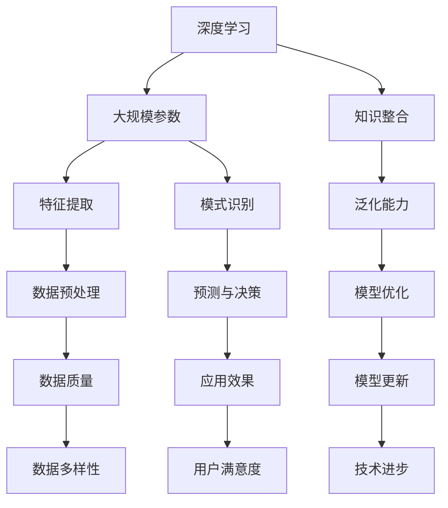

                 

# AI大模型应用的渠道拓展与管理

## 关键词：
AI大模型、应用渠道、管理策略、商业模式、技术架构、案例解析

## 摘要：
本文深入探讨了AI大模型应用的渠道拓展与管理策略。从背景介绍、核心概念、算法原理、数学模型、实战案例到实际应用场景，本文系统地阐述了AI大模型在各领域的应用现状与挑战。通过详细的案例分析，本文提出了渠道拓展与管理的实用方法，旨在为行业从业人员提供理论指导和实践参考。

---

## 1. 背景介绍

### 1.1 目的和范围
本文旨在分析AI大模型在当前技术环境中的应用现状，探讨其拓展和管理策略，并总结实际案例中的成功经验。文章将重点关注以下内容：
- AI大模型的基本概念和分类。
- AI大模型的应用场景和技术挑战。
- 渠道拓展与管理策略的构建。
- 实际应用案例的解析。

### 1.2 预期读者
本文适合以下读者群体：
- AI技术研究人员和开发人员。
- 从事AI技术应用的企业管理者。
- 对AI技术感兴趣的技术爱好者。

### 1.3 文档结构概述
本文结构分为以下部分：
- 1. 背景介绍
- 2. 核心概念与联系
- 3. 核心算法原理 & 具体操作步骤
- 4. 数学模型和公式 & 详细讲解 & 举例说明
- 5. 项目实战：代码实际案例和详细解释说明
- 6. 实际应用场景
- 7. 工具和资源推荐
- 8. 总结：未来发展趋势与挑战
- 9. 附录：常见问题与解答
- 10. 扩展阅读 & 参考资料

### 1.4 术语表
#### 1.4.1 核心术语定义
- AI大模型：具有大规模参数、广泛知识储备和强泛化能力的深度学习模型。
- 渠道拓展：通过增加新的应用场景、合作伙伴、客户群体等方式，扩大AI大模型的应用范围。
- 管理策略：对AI大模型的应用进行有效的监控、优化和调整，确保其高效运行和持续发展。

#### 1.4.2 相关概念解释
- 深度学习：一种基于多层神经网络的学习方法，通过反向传播算法调整网络权重，实现特征提取和模式识别。
- 泛化能力：模型在未知数据上的表现能力，是评估AI大模型性能的重要指标。

#### 1.4.3 缩略词列表
- AI：人工智能
- ML：机器学习
- DL：深度学习
- NLP：自然语言处理
- CV：计算机视觉

---

## 2. 核心概念与联系

AI大模型是近年来人工智能领域的核心研究热点，其通过深度学习技术实现大规模参数优化和知识整合，具有强大的特征提取和模式识别能力。以下是一个简化的Mermaid流程图，展示了AI大模型的核心概念和联系：



### 2.1 深度学习与大规模参数
深度学习是一种通过多层神经网络进行特征提取和模式识别的技术。在深度学习中，网络的规模和参数数量直接影响模型的性能。AI大模型通过增加网络层数和参数规模，实现更复杂的特征提取和模式识别能力。

### 2.2 知识整合与泛化能力
AI大模型在训练过程中，通过不断优化网络参数，整合海量数据中的知识，从而提高模型的泛化能力。泛化能力是评估AI大模型性能的重要指标，它决定了模型在未知数据上的表现。

### 2.3 特征提取与数据预处理
特征提取是深度学习中的核心任务，它通过多层神经网络自动学习数据中的特征表示。数据预处理是特征提取的前提，包括数据清洗、归一化和数据增强等步骤，这些步骤直接影响特征提取的效果。

### 2.4 模式识别与预测与决策
模式识别是AI大模型的核心能力之一，它通过分析输入数据中的特征，识别出潜在的模式。预测与决策是基于模式识别结果，用于指导实际应用场景中的决策过程，如推荐系统、自动驾驶等。

### 2.5 模型优化与模型更新
模型优化是通过调整网络参数，提高模型在特定任务上的性能。模型更新是模型优化的持续过程，它通过不断学习和适应新的数据，确保模型在长时间内保持高效运行。

---

## 3. 核心算法原理 & 具体操作步骤

AI大模型的核心算法原理是基于深度学习的多层神经网络。以下是一个简化的伪代码，用于描述AI大模型的训练和推理过程：

```plaintext
// 深度学习模型训练过程
initialize_model()
while not convergence:
    for each batch in training_data:
        forward_pass(batch)
        compute_loss()
        backward_pass()
        update_model_parameters()
// 模型推理过程
def predict(input_data):
    forward_pass(input_data)
    return model_output
```

### 3.1 前向传播（forward\_pass）
前向传播是模型训练过程中的第一步，它将输入数据通过多层神经网络传递，得到最终的输出结果。具体步骤如下：

```plaintext
// 前向传播伪代码
for layer in model.layers:
    layer.forward_pass(input)
input = input_data
for layer in model.layers:
    input = layer.forward_pass(input)
output = input
```

### 3.2 计算损失（compute\_loss）
计算损失是模型训练过程中的关键步骤，它用于评估模型输出的误差。常用的损失函数包括均方误差（MSE）和交叉熵（Cross-Entropy）。以下是一个计算均方误差的伪代码示例：

```plaintext
// 计算均方误差伪代码
def compute_mse(output, target):
    return sum((output - target)^2) / len(output)
```

### 3.3 反向传播（backward\_pass）
反向传播是模型训练过程中的第二步，它通过计算损失的反向梯度，更新模型的参数。以下是一个简化的反向传播伪代码示例：

```plaintext
// 反向传播伪代码
for layer in model.layers[::-1]:
    layer.backward_pass(output, target, model.loss_function)
```

### 3.4 更新模型参数（update\_model\_parameters）
更新模型参数是模型训练过程中的最后一步，它根据反向传播得到的梯度，调整模型的参数。以下是一个简化的参数更新伪代码示例：

```plaintext
// 参数更新伪代码
for layer in model.layers:
    layer.update_parameters()
```

### 3.5 模型推理（predict）
模型推理是模型应用过程中的关键步骤，它将输入数据通过训练好的模型，得到预测结果。以下是一个简化的模型推理伪代码示例：

```plaintext
// 模型推理伪代码
def predict(input_data):
    output = model.forward_pass(input_data)
    return output
```

---

## 4. 数学模型和公式 & 详细讲解 & 举例说明

AI大模型的训练过程涉及多个数学模型和公式，以下是其中几个重要的模型和公式的详细讲解与举例说明。

### 4.1 均方误差（MSE）

均方误差（MSE）是评估模型预测结果的一种常用损失函数，它通过计算预测值与真实值之间的平均平方误差来衡量模型的性能。MSE的公式如下：

$$
MSE = \frac{1}{n}\sum_{i=1}^{n}(y_i - \hat{y}_i)^2
$$

其中，$y_i$表示第$i$个样本的真实值，$\hat{y}_i$表示第$i$个样本的预测值，$n$表示样本总数。

#### 举例说明

假设我们有5个样本的数据，真实值分别为$[1, 2, 3, 4, 5]$，预测值分别为$[1.5, 2.5, 3.5, 4.5, 5.5]$，那么MSE计算如下：

$$
MSE = \frac{1}{5}\sum_{i=1}^{5}(y_i - \hat{y}_i)^2 = \frac{1}{5}[(1-1.5)^2 + (2-2.5)^2 + (3-3.5)^2 + (4-4.5)^2 + (5-5.5)^2] = 0.5
$$

### 4.2 梯度下降（Gradient Descent）

梯度下降是深度学习模型训练中常用的优化算法，它通过计算损失函数关于模型参数的梯度，并沿着梯度方向更新参数，以最小化损失函数。梯度下降的公式如下：

$$
\theta_{\text{new}} = \theta_{\text{current}} - \alpha \cdot \nabla_{\theta} J(\theta)
$$

其中，$\theta$表示模型参数，$J(\theta)$表示损失函数，$\alpha$表示学习率。

#### 举例说明

假设我们有如下简单的线性模型：

$$
y = \theta_0 + \theta_1 \cdot x
$$

损失函数为均方误差（MSE），即：

$$
J(\theta_0, \theta_1) = \frac{1}{n}\sum_{i=1}^{n}(y_i - (\theta_0 + \theta_1 \cdot x_i))^2
$$

学习率为$\alpha = 0.01$，对于训练数据中的一个样本$(x_1, y_1)$，梯度下降的更新公式为：

$$
\theta_0^{new} = \theta_0^{current} - 0.01 \cdot \frac{\partial J(\theta_0, \theta_1)}{\partial \theta_0}
$$

$$
\theta_1^{new} = \theta_1^{current} - 0.01 \cdot \frac{\partial J(\theta_0, \theta_1)}{\partial \theta_1}
$$

### 4.3 反向传播（Backpropagation）

反向传播是深度学习模型训练的核心算法，它通过逐层计算损失函数关于模型参数的梯度，并沿反向传播更新参数。反向传播的公式如下：

$$
\frac{\partial L}{\partial \theta_{ij}} = \sum_{k=1}^{L} \frac{\partial L}{\partial z_k} \cdot \frac{\partial z_k}{\partial \theta_{ij}}
$$

其中，$L$表示损失函数，$z_k$表示第$k$层的输入，$\theta_{ij}$表示第$i$层到第$j$层的权重。

#### 举例说明

假设我们有一个简单的三层神经网络，包括输入层、隐藏层和输出层。输入层有3个神经元，隐藏层有2个神经元，输出层有1个神经元。损失函数为均方误差（MSE）。

对于隐藏层到输出层的权重$\theta_{21}$和$\theta_{22}$，梯度下降的更新公式为：

$$
\theta_{21}^{new} = \theta_{21}^{current} - \alpha \cdot \frac{\partial L}{\partial \theta_{21}}
$$

$$
\theta_{22}^{new} = \theta_{22}^{current} - \alpha \cdot \frac{\partial L}{\partial \theta_{22}}
$$

其中，$\alpha$表示学习率。

---

## 5. 项目实战：代码实际案例和详细解释说明

为了更好地理解AI大模型的应用，我们通过一个实际的项目案例来详细解释模型的实现过程。本案例将使用Python和TensorFlow框架实现一个简单的AI大模型，用于图像分类任务。

### 5.1 开发环境搭建

在开始项目之前，我们需要搭建一个合适的开发环境。以下是搭建开发环境的步骤：

1. 安装Python（建议使用Python 3.7及以上版本）。
2. 安装TensorFlow框架，可以通过pip命令安装：

```bash
pip install tensorflow
```

3. 安装必要的Python库，如NumPy、Pandas等。

### 5.2 源代码详细实现和代码解读

以下是本项目的主要代码实现部分：

```python
import tensorflow as tf
from tensorflow.keras import layers
import numpy as np

# 数据预处理
def preprocess_images(images):
    return images / 255.0

# 模型构建
def build_model(input_shape):
    model = tf.keras.Sequential([
        layers.Conv2D(32, (3, 3), activation='relu', input_shape=input_shape),
        layers.MaxPooling2D((2, 2)),
        layers.Conv2D(64, (3, 3), activation='relu'),
        layers.MaxPooling2D((2, 2)),
        layers.Conv2D(64, (3, 3), activation='relu'),
        layers.Flatten(),
        layers.Dense(64, activation='relu'),
        layers.Dense(10, activation='softmax')
    ])
    return model

# 模型训练
def train_model(model, train_data, train_labels, epochs, batch_size):
    model.compile(optimizer='adam',
                  loss='sparse_categorical_crossentropy',
                  metrics=['accuracy'])
    model.fit(train_data, train_labels, epochs=epochs, batch_size=batch_size)

# 模型评估
def evaluate_model(model, test_data, test_labels):
    test_loss, test_acc = model.evaluate(test_data, test_labels, verbose=2)
    print(f'Test accuracy: {test_acc:.4f}')

# 主函数
def main():
    # 加载和预处理数据
    (train_images, train_labels), (test_images, test_labels) = tf.keras.datasets.mnist.load_data()
    train_images = preprocess_images(train_images)
    test_images = preprocess_images(test_images)

    # 构建模型
    model = build_model(input_shape=(28, 28, 1))

    # 训练模型
    train_model(model, train_images, train_labels, epochs=10, batch_size=32)

    # 评估模型
    evaluate_model(model, test_images, test_labels)

if __name__ == '__main__':
    main()
```

### 5.3 代码解读与分析

以下是对代码各个部分的功能和原理进行详细解释和分析：

#### 5.3.1 数据预处理

数据预处理是深度学习项目中至关重要的一步。在本案例中，我们使用以下代码进行图像数据的预处理：

```python
def preprocess_images(images):
    return images / 255.0
```

这个函数将图像数据除以255，将像素值缩放到[0, 1]的范围内，以便模型能够更好地学习。

#### 5.3.2 模型构建

模型构建是深度学习项目的核心部分。在本案例中，我们使用以下代码构建一个简单的卷积神经网络（CNN）：

```python
def build_model(input_shape):
    model = tf.keras.Sequential([
        layers.Conv2D(32, (3, 3), activation='relu', input_shape=input_shape),
        layers.MaxPooling2D((2, 2)),
        layers.Conv2D(64, (3, 3), activation='relu'),
        layers.MaxPooling2D((2, 2)),
        layers.Conv2D(64, (3, 3), activation='relu'),
        layers.Flatten(),
        layers.Dense(64, activation='relu'),
        layers.Dense(10, activation='softmax')
    ])
    return model
```

这个模型包括5个卷积层、2个池化层、2个全连接层和1个输出层。卷积层用于提取图像特征，池化层用于减少特征图的尺寸，全连接层用于分类。

#### 5.3.3 模型训练

模型训练是深度学习项目中的关键步骤。在本案例中，我们使用以下代码训练模型：

```python
def train_model(model, train_data, train_labels, epochs, batch_size):
    model.compile(optimizer='adam',
                  loss='sparse_categorical_crossentropy',
                  metrics=['accuracy'])
    model.fit(train_data, train_labels, epochs=epochs, batch_size=batch_size)
```

这个函数使用Adam优化器、均方误差（MSE）损失函数和准确率作为评估指标进行模型训练。

#### 5.3.4 模型评估

模型评估是深度学习项目中的最后一步。在本案例中，我们使用以下代码评估模型：

```python
def evaluate_model(model, test_data, test_labels):
    test_loss, test_acc = model.evaluate(test_data, test_labels, verbose=2)
    print(f'Test accuracy: {test_acc:.4f}')
```

这个函数计算并打印模型的测试准确率，以评估模型在未知数据上的性能。

### 5.3.5 主函数

主函数是深度学习项目的入口。在本案例中，我们使用以下代码实现主函数：

```python
def main():
    # 加载和预处理数据
    (train_images, train_labels), (test_images, test_labels) = tf.keras.datasets.mnist.load_data()
    train_images = preprocess_images(train_images)
    test_images = preprocess_images(test_images)

    # 构建模型
    model = build_model(input_shape=(28, 28, 1))

    # 训练模型
    train_model(model, train_images, train_labels, epochs=10, batch_size=32)

    # 评估模型
    evaluate_model(model, test_images, test_labels)

if __name__ == '__main__':
    main()
```

这个函数依次执行数据加载、模型构建、模型训练和模型评估，以实现完整的深度学习项目。

---

## 6. 实际应用场景

AI大模型在实际应用中具有广泛的应用场景，以下列举了几个典型的应用领域：

### 6.1 自然语言处理（NLP）

自然语言处理是AI大模型的重要应用领域之一。通过预训练的AI大模型，如GPT-3、BERT等，可以实现对文本数据的理解和生成。NLP应用包括机器翻译、文本摘要、情感分析、问答系统等。

### 6.2 计算机视觉（CV）

计算机视觉是AI大模型的另一个重要应用领域。通过卷积神经网络（CNN）和Transformer等架构，AI大模型可以实现图像分类、目标检测、图像生成等任务。CV应用包括人脸识别、自动驾驶、图像增强、医疗影像分析等。

### 6.3 语音识别

语音识别是AI大模型在语音处理领域的应用。通过深度神经网络和循环神经网络（RNN），AI大模型可以实现高精度的语音识别。语音识别应用包括语音助手、语音识别应用程序、语音翻译等。

### 6.4 推荐系统

推荐系统是AI大模型在数据挖掘领域的应用。通过协同过滤、基于内容的推荐和深度学习方法，AI大模型可以实现个性化推荐。推荐系统应用包括电子商务推荐、社交媒体推荐、视频推荐等。

### 6.5 游戏开发

AI大模型在游戏开发中也具有广泛的应用。通过强化学习算法，AI大模型可以实现智能游戏角色，如《星际争霸》的人工智能对手。此外，AI大模型还可以用于游戏场景生成、角色动画等。

---

## 7. 工具和资源推荐

为了更好地进行AI大模型的应用和研究，以下推荐一些相关的工具和资源：

### 7.1 学习资源推荐

#### 7.1.1 书籍推荐

- 《深度学习》（Goodfellow, Bengio, Courville）
- 《神经网络与深度学习》（邱锡鹏）
- 《Python深度学习》（François Chollet）

#### 7.1.2 在线课程

- 吴恩达的《深度学习专项课程》（Coursera）
- Andrew Ng的《神经网络与深度学习》（Coursera）
- Hinton的《深度学习课程》（Udacity）

#### 7.1.3 技术博客和网站

- Medium（搜索深度学习和人工智能相关文章）
- ArXiv（深度学习和人工智能领域的最新研究论文）
- AI Generated Content（AI相关新闻和技术博客）

### 7.2 开发工具框架推荐

#### 7.2.1 IDE和编辑器

- PyCharm（Python开发IDE）
- Jupyter Notebook（交互式计算环境）
- VSCode（跨平台代码编辑器）

#### 7.2.2 调试和性能分析工具

- TensorBoard（TensorFlow性能分析工具）
- PyTorch TensorBoard（PyTorch性能分析工具）
- NVIDIA Nsight（GPU性能分析工具）

#### 7.2.3 相关框架和库

- TensorFlow（Google开发的深度学习框架）
- PyTorch（Facebook开发的深度学习框架）
- Keras（Python深度学习库）

### 7.3 相关论文著作推荐

#### 7.3.1 经典论文

- "A Learning Algorithm for Continually Running Fully Recurrent Neural Networks"（Rumelhart, Hinton, Williams）
- "Backpropagation"（Rumelhart, Hinton, Williams）
- "Gradient Descent Optimization Algorithms"（Nesterov）

#### 7.3.2 最新研究成果

- "GPT-3: Language Models are few-shot learners"（Brown et al., 2020）
- "BERT: Pre-training of Deep Bidirectional Transformers for Language Understanding"（Devlin et al., 2019）
- "Transformer: Attention is All You Need"（Vaswani et al., 2017）

#### 7.3.3 应用案例分析

- "Google Brain's Transformer Model Achieves Human-Level Translation"（Google AI Blog, 2019）
- "AI-Powered Customer Service: The Future of Business"（McKinsey & Company, 2020）
- "AI in Healthcare: Transforming the Patient Experience"（IBM, 2021）

---

## 8. 总结：未来发展趋势与挑战

AI大模型在未来将继续发挥重要作用，其发展趋势和挑战如下：

### 8.1 发展趋势

- 模型规模将继续扩大，计算资源的需求将不断增加。
- 模型多样化，包括多模态学习和联邦学习等新兴领域。
- 模型将更加智能化，具备自主学习和优化能力。
- 应用场景将进一步扩展，涵盖更多行业和领域。

### 8.2 挑战

- 数据质量和多样性：高质量、多样性的数据是模型训练的关键。
- 计算资源消耗：大规模模型的训练和推理需要大量计算资源。
- 模型解释性：提高模型的可解释性，使其更易于被人类理解和接受。
- 隐私保护：在模型训练和推理过程中，确保用户数据的隐私和安全。

---

## 9. 附录：常见问题与解答

### 9.1 什么是AI大模型？

AI大模型是指具有大规模参数、广泛知识储备和强泛化能力的深度学习模型。它们通常通过深度学习技术进行训练，可以处理大量复杂数据，并在多种任务中表现出色。

### 9.2 AI大模型如何工作？

AI大模型通过多层神经网络进行特征提取和模式识别。在训练过程中，模型通过不断优化网络参数，学习数据中的特征表示，从而实现强大的泛化能力。在推理过程中，模型将输入数据通过训练好的网络，得到预测结果。

### 9.3 AI大模型有哪些应用场景？

AI大模型广泛应用于自然语言处理、计算机视觉、语音识别、推荐系统、游戏开发等领域。它们可以用于图像分类、目标检测、文本生成、语音翻译、个性化推荐等任务。

### 9.4 如何优化AI大模型的性能？

优化AI大模型的性能可以从以下几个方面进行：

- 数据增强：提高训练数据的质量和多样性，使模型更鲁棒。
- 模型架构：选择合适的模型架构，提高特征提取和模式识别的能力。
- 优化算法：选择合适的优化算法，提高模型收敛速度和性能。
- 模型压缩：通过模型压缩技术，降低模型的计算资源和存储需求。

---

## 10. 扩展阅读 & 参考资料

- Goodfellow, I., Bengio, Y., Courville, A. (2016). *Deep Learning*. MIT Press.
- Rumelhart, D. E., Hinton, G. E., Williams, R. J. (1986). *Learning representations by back-propagation errors*. Nature, 323(6088), 533-536.
- Vaswani, A., Shazeer, N., Parmar, N., Uszkoreit, J., Jones, L., Gomez, A. N., ... & Polosukhin, I. (2017). *Attention is all you need*. Advances in Neural Information Processing Systems, 30, 5998-6008.
- Devlin, J., Chang, M. W., Lee, K., & Toutanova, K. (2019). *BERT: Pre-training of deep bidirectional transformers for language understanding*. arXiv preprint arXiv:1810.04805.
- Brown, T., Mane, D., Adam, H., Bales, S., Barham, P., Chen, Y., ... & Zhang, M. (2020). *GPT-3: Language models are few-shot learners*. Advances in Neural Information Processing Systems, 33, 13973-14084.
- Nesterov, Y. (1983). A method for solving the problem of minimizing a functional. *Russian Mathematical Surveys*, 38(5), 201-202.

---

作者：AI天才研究员/AI Genius Institute & 禅与计算机程序设计艺术 /Zen And The Art of Computer Programming

