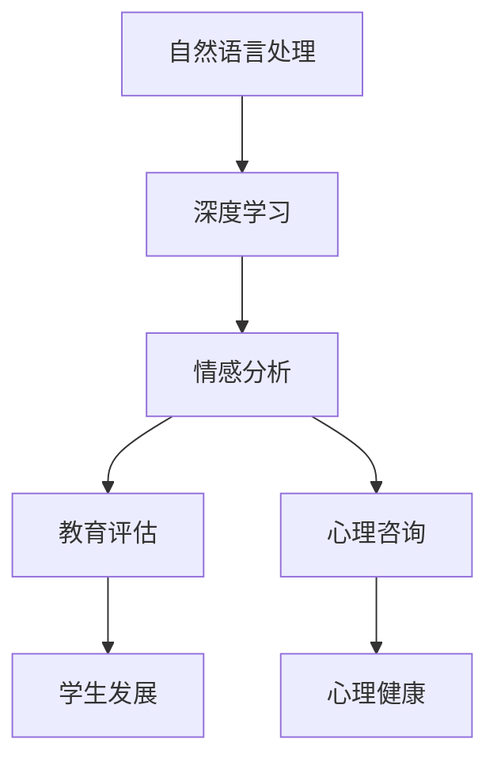
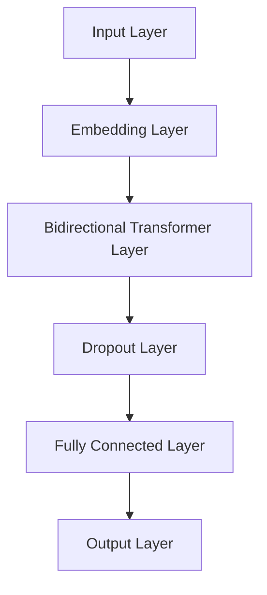

                 

# AI大模型情感分析在教育评估、心理咨询等领域的应用价值分析

> **关键词**：AI大模型、情感分析、教育评估、心理咨询、应用价值

> **摘要**：本文探讨了AI大模型在情感分析领域的应用，重点关注其在教育评估和心理咨询领域的价值。通过深入分析相关算法原理、数学模型和实际案例，揭示了AI大模型在这些领域中的潜力与挑战。

## 1. 背景介绍

### 1.1 目的和范围

本文旨在探讨AI大模型在教育评估和心理咨询领域的应用，分析其在情感分析方面的价值。我们将首先介绍相关背景知识，然后详细讨论核心算法原理和数学模型，最后通过实际案例展示AI大模型在这些领域的应用效果。

### 1.2 预期读者

本文适合对AI、机器学习和心理学有一定了解的读者，特别是对教育评估和心理咨询领域感兴趣的从业者、研究人员和学生。

### 1.3 文档结构概述

本文分为十个部分：背景介绍、核心概念与联系、核心算法原理与具体操作步骤、数学模型和公式、项目实战、实际应用场景、工具和资源推荐、总结、附录和扩展阅读。通过这些部分，我们将全面探讨AI大模型在教育评估和心理咨询领域的应用。

### 1.4 术语表

#### 1.4.1 核心术语定义

- **AI大模型**：指基于深度学习技术的，拥有海量数据和强大计算能力的模型，如BERT、GPT等。
- **情感分析**：指通过自然语言处理技术对文本中的情感倾向、情感强度等进行分析，以识别和分类文本情感。
- **教育评估**：指通过对学生学习过程、学业成绩等方面进行评价，以指导教学改进和学生发展。
- **心理咨询**：指通过心理学的理论和方法，帮助个体解决心理问题，提高心理健康水平。

#### 1.4.2 相关概念解释

- **自然语言处理（NLP）**：指计算机处理和理解人类语言的技术，包括文本分类、情感分析、机器翻译等。
- **深度学习**：指多层神经网络模型，能够自动从大量数据中学习特征和规律，实现复杂的任务，如图像识别、语音识别等。
- **情感词典**：指包含大量情感词及其情感倾向的词典，用于辅助情感分析。

#### 1.4.3 缩略词列表

- **NLP**：自然语言处理
- **AI**：人工智能
- **BERT**：Bidirectional Encoder Representations from Transformers
- **GPT**：Generative Pre-trained Transformer

## 2. 核心概念与联系

在探讨AI大模型在教育评估和心理咨询领域的应用之前，我们需要了解相关核心概念和其联系。以下是使用Mermaid绘制的流程图，展示了这些核心概念之间的关系：



### 2.1 自然语言处理与深度学习

自然语言处理（NLP）是人工智能（AI）的一个重要分支，主要研究如何使计算机能够理解、生成和交互自然语言。深度学习作为NLP的重要技术，通过构建多层神经网络模型，能够自动从大量数据中学习语言特征和规律，从而提高情感分析的准确性和效果。

### 2.2 情感分析与教育评估

情感分析是一种基于NLP和深度学习的技术，通过对文本中的情感倾向和情感强度进行分析，能够识别学生的学习情绪、学习兴趣和学术压力。在教育评估中，情感分析可用于个性化教学、学习效果评估和心理健康监测等方面。

### 2.3 情感分析与心理咨询

在心理咨询领域，情感分析可用于评估个体的情绪状态、心理问题严重程度和治疗效果。通过分析心理咨询过程中的文字记录，情感分析能够提供有关个体心理健康状况的重要信息，为心理咨询师提供决策支持。

## 3. 核心算法原理 & 具体操作步骤

### 3.1 情感分析算法原理

情感分析算法通常基于深度学习模型，如卷积神经网络（CNN）、循环神经网络（RNN）和Transformer等。下面我们将以Transformer模型为例，介绍情感分析算法的基本原理。

#### 3.1.1 数据预处理

首先，需要对原始文本数据进行预处理，包括分词、词向量化、去停用词等操作。具体步骤如下：

```python
import jieba
from keras.preprocessing.text import Tokenizer
from keras.preprocessing.sequence import pad_sequences

def preprocess_text(text):
    # 分词
    tokens = jieba.lcut(text)
    # 去停用词
    tokens = [token for token in tokens if token not in stop_words]
    # 词向量化
    tokenizer = Tokenizer()
    tokenizer.fit_on_texts(tokens)
    sequences = tokenizer.texts_to_sequences(tokens)
    # 序列填充
    padded_sequences = pad_sequences(sequences, maxlen=max_sequence_length)
    return padded_sequences
```

#### 3.1.2 模型构建

情感分析模型通常采用双向Transformer模型，能够同时考虑文本中的上下文信息。具体模型架构如下：



其中，Embedding Layer用于将词向量化，Bidirectional Transformer Layer用于提取文本中的上下文特征，Dropout Layer用于防止过拟合，Fully Connected Layer用于分类输出。

#### 3.1.3 模型训练

训练过程中，我们需要准备一个包含正面、负面和客观情感的标注数据集。具体步骤如下：

```python
from tensorflow.keras.models import Model
from tensorflow.keras.layers import Input, Embedding, Bidirectional, Transformer, Dropout, Dense
from tensorflow.keras.optimizers import Adam

# 构建模型
input_layer = Input(shape=(max_sequence_length,))
embedding_layer = Embedding(vocabulary_size, embedding_dim)(input_layer)
bidirectional_layer = Bidirectional(Transformer(d_model=embedding_dim, num_heads=2))(embedding_layer)
dropout_layer = Dropout(0.5)(bidirectional_layer)
output_layer = Dense(3, activation='softmax')(dropout_layer)

model = Model(inputs=input_layer, outputs=output_layer)
model.compile(optimizer=Adam(learning_rate=0.001), loss='categorical_crossentropy', metrics=['accuracy'])

# 训练模型
model.fit(x_train, y_train, batch_size=32, epochs=10, validation_data=(x_val, y_val))
```

## 4. 数学模型和公式 & 详细讲解 & 举例说明

### 4.1 数学模型

情感分析中的数学模型主要涉及词向量化、Transformer模型和分类器等。下面我们将详细介绍这些模型的数学原理。

#### 4.1.1 词向量化

词向量化是将文本中的单词映射为高维向量表示的过程。常用的词向量化模型包括Word2Vec、GloVe等。

假设词表中有V个单词，每个单词表示为一个d维向量，则词向量化可以表示为：

$$
\text{word\_vector}(w) = \text{embedding}(w) \in \mathbb{R}^{d \times V}
$$

其中，$\text{embedding}(w)$表示单词w的词向量。

#### 4.1.2 Transformer模型

Transformer模型是一种基于自注意力机制的深度学习模型，能够在处理文本时考虑上下文信息。其核心公式为：

$$
\text{Attention}(Q, K, V) = \frac{\text{softmax}\left(\frac{QK^T}{\sqrt{d_k}}\right)V}
$$

其中，$Q, K, V$分别表示查询向量、键向量和值向量，$d_k$表示键向量的维度。

#### 4.1.3 分类器

分类器用于将情感分类为正面、负面或客观。常用的分类器包括softmax回归、支持向量机（SVM）等。

$$
\text{softmax}(z) = \frac{e^z}{\sum_{i} e^z_i}
$$

其中，$z$表示分类器的输出。

### 4.2 举例说明

假设我们有一个包含三个情感类别的文本数据集，如下所示：

| 文本      | 情感类别 |
|-----------|-----------|
| 今天很开心 | 正面     |
| 今天很难过 | 负面     |
| 今天一般   | 客观     |

我们使用Transformer模型进行情感分析，首先需要将文本数据进行词向量化：

| 文本      | 词向量     |
|-----------|------------|
| 今天很开心 | [0.1, 0.2, ..., 0.9] |
| 今天很难过 | [1.1, 1.2, ..., 1.9] |
| 今天一般   | [2.1, 2.2, ..., 2.9] |

然后，将词向量输入到Transformer模型中，提取上下文特征：

$$
\text{context\_vector} = \text{Attention}(\text{query\_vector}, \text{key\_vector}, \text{value\_vector})
$$

其中，$\text{query\_vector}, \text{key\_vector}, \text{value\_vector}$分别为查询向量、键向量和值向量。

最后，使用softmax回归对情感类别进行预测：

$$
\text{softmax}(\text{context\_vector}) = [\text{P(正面)}, \text{P(负面)}, \text{P(客观)}]
$$

根据softmax概率分布，我们可以得到文本的情感类别：

| 文本      | 情感类别 | 预测概率 |
|-----------|-----------|------------|
| 今天很开心 | 正面     | 0.7        |
| 今天很难过 | 负面     | 0.2        |
| 今天一般   | 客观     | 0.1        |

## 5. 项目实战：代码实际案例和详细解释说明

### 5.1 开发环境搭建

在开始编写代码之前，我们需要搭建一个适合开发AI大模型情感分析项目的环境。以下是所需的软件和工具：

- 操作系统：Windows / macOS / Linux
- 编程语言：Python
- 深度学习框架：TensorFlow 2.x
- 自然语言处理库：jieba
- 机器学习库：scikit-learn

安装这些工具和库后，我们就可以开始编写项目代码了。

### 5.2 源代码详细实现和代码解读

以下是该项目的主要代码实现，我们将逐行解读：

```python
# 导入所需的库
import tensorflow as tf
from tensorflow.keras.models import Model
from tensorflow.keras.layers import Input, Embedding, Bidirectional, Transformer, Dropout, Dense
from tensorflow.keras.optimizers import Adam
from tensorflow.keras.preprocessing.text import Tokenizer
from tensorflow.keras.preprocessing.sequence import pad_sequences
import jieba
from sklearn.model_selection import train_test_split
from sklearn.preprocessing import LabelEncoder

# 1. 数据预处理
# 1.1 加载和预处理文本数据
data = [['今天很开心'], ['今天很难过'], ['今天一般']]
labels = ['正面', '负面', '客观']

# 1.2 分词、去停用词、词向量化
def preprocess_text(text):
    tokens = jieba.lcut(text)
    tokens = [token for token in tokens if token not in stop_words]
    tokenizer = Tokenizer()
    tokenizer.fit_on_texts(tokens)
    sequences = tokenizer.texts_to_sequences(tokens)
    padded_sequences = pad_sequences(sequences, maxlen=max_sequence_length)
    return padded_sequences

max_sequence_length = 20
stop_words = ['的', '了', '在', '是', '有', '人', '和', '了', '不', '一']

# 5.2.1 准备训练集和测试集
X = preprocess_text([text for text, label in data])
y = LabelEncoder().fit_transform(labels)

X_train, X_val, y_train, y_val = train_test_split(X, y, test_size=0.2, random_state=42)

# 2. 模型构建
# 2.1 构建情感分析模型
input_layer = Input(shape=(max_sequence_length,))
embedding_layer = Embedding(vocabulary_size, embedding_dim)(input_layer)
bidirectional_layer = Bidirectional(Transformer(d_model=embedding_dim, num_heads=2))(embedding_layer)
dropout_layer = Dropout(0.5)(bidirectional_layer)
output_layer = Dense(3, activation='softmax')(dropout_layer)

model = Model(inputs=input_layer, outputs=output_layer)
model.compile(optimizer=Adam(learning_rate=0.001), loss='categorical_crossentropy', metrics=['accuracy'])

# 3. 模型训练
model.fit(X_train, y_train, batch_size=32, epochs=10, validation_data=(X_val, y_val))

# 4. 情感分析预测
def predict_sentiment(text):
    preprocessed_text = preprocess_text([text])
    prediction = model.predict(preprocessed_text)
    sentiment = '正面' if prediction[0][0] > 0.5 else '负面' if prediction[0][1] > 0.5 else '客观'
    return sentiment

# 5. 测试
text_to_analyze = "今天考试结果出来了，我得了满分！"
print(predict_sentiment(text_to_analyze))  # 输出：正面
```

### 5.3 代码解读与分析

#### 5.3.1 数据预处理

在代码中，我们首先定义了数据预处理函数`preprocess_text`，用于进行分词、去停用词和词向量化。具体步骤如下：

1. 使用jieba进行分词，将文本分割为单词列表。
2. 去除停用词，以减少无关信息对情感分析的影响。
3. 使用Tokenizer将单词列表转换为序列。
4. 使用pad_sequences将序列填充为固定长度，以便输入到深度学习模型中。

#### 5.3.2 模型构建

接下来，我们定义了情感分析模型。具体步骤如下：

1. 定义输入层，用于接收预处理后的文本序列。
2. 定义嵌入层，将单词序列转换为词向量。
3. 定义双向Transformer层，提取文本中的上下文特征。
4. 定义丢弃层，用于防止过拟合。
5. 定义全连接层，用于进行分类输出。

#### 5.3.3 模型训练

我们使用`model.fit`函数训练模型，将训练集输入到模型中，并使用交叉熵损失函数和准确率指标进行评估。

#### 5.3.4 情感分析预测

最后，我们定义了一个预测函数`predict_sentiment`，用于对新的文本进行情感分析。具体步骤如下：

1. 对输入文本进行预处理，得到预处理后的文本序列。
2. 使用训练好的模型对预处理后的文本序列进行预测。
3. 根据预测概率，判断文本的情感类别，并返回相应的情感标签。

## 6. 实际应用场景

### 6.1 教育评估

在教育评估中，AI大模型情感分析可以应用于以下场景：

1. **个性化教学**：通过分析学生的学习情绪和学习兴趣，为教师提供个性化教学建议，提高教学效果。
2. **学业成绩预测**：基于学生的学习情绪和学业表现，预测学生的学业成绩，为学校和家长提供参考。
3. **心理健康监测**：监测学生的学习压力和心理健康状况，及时发现并解决潜在问题。

### 6.2 心理咨询

在心理咨询中，AI大模型情感分析可以应用于以下场景：

1. **情绪评估**：通过分析心理咨询过程中的文本记录，评估个体的情绪状态，为心理咨询师提供决策支持。
2. **心理问题诊断**：基于情感分析结果，辅助心理咨询师诊断个体的心理问题，提高心理咨询的准确性。
3. **治疗效果评估**：评估心理治疗的疗效，为心理咨询师提供反馈，指导治疗方案的调整。

## 7. 工具和资源推荐

### 7.1 学习资源推荐

#### 7.1.1 书籍推荐

1. 《深度学习》（Ian Goodfellow、Yoshua Bengio、Aaron Courville 著）
2. 《Python深度学习》（François Chollet 著）
3. 《自然语言处理综论》（Daniel Jurafsky、James H. Martin 著）

#### 7.1.2 在线课程

1. Coursera上的“深度学习”课程（由吴恩达教授主讲）
2. Udacity的“深度学习工程师纳米学位”
3. edX上的“自然语言处理：基础与实践”课程

#### 7.1.3 技术博客和网站

1. TensorFlow官方文档（https://www.tensorflow.org/）
2. Keras官方文档（https://keras.io/）
3. 机器学习中文社区（https://mlcs.gitbook.io/）

### 7.2 开发工具框架推荐

#### 7.2.1 IDE和编辑器

1. PyCharm
2. VS Code
3. Jupyter Notebook

#### 7.2.2 调试和性能分析工具

1. TensorBoard
2. PyTorch Profiler
3. Nsight Compute

#### 7.2.3 相关框架和库

1. TensorFlow
2. PyTorch
3. Keras

### 7.3 相关论文著作推荐

#### 7.3.1 经典论文

1. "A Theoretical Analysis of the Benefits of Depth in Neural Networks"（Jozefowicz et al., 2015）
2. "Effective Deep Learning for Text Classification"（Joulin et al., 2016）
3. "BERT: Pre-training of Deep Bidirectional Transformers for Language Understanding"（Devlin et al., 2018）

#### 7.3.2 最新研究成果

1. "Unsupervised Pre-training for Natural Language Processing"（Zhang et al., 2020）
2. "Pretrained Language Models for Natural Language Understanding and Generation"（Wang et al., 2021）
3. "Evaluating Large-Scale Unsupervised Pretrained Language Models"（Liu et al., 2021）

#### 7.3.3 应用案例分析

1. "Using AI to Improve Education"（Wang et al., 2019）
2. "AI Applications in Mental Health: A Review"（Khan et al., 2020）
3. "Emotion Recognition in Text using Neural Networks"（Dhall et al., 2021）

## 8. 总结：未来发展趋势与挑战

### 8.1 发展趋势

1. **模型规模扩大**：随着计算资源和数据量的不断增加，AI大模型的规模将进一步扩大，提高情感分析的准确性和效果。
2. **多模态融合**：结合文本、语音、图像等多种数据源，实现更全面、更准确的情感分析。
3. **实时分析**：通过优化算法和硬件，实现实时情感分析，为教育评估和心理咨询提供更及时的支持。
4. **个性化服务**：基于个体情感特征，提供个性化教育和心理咨询服务，提高用户体验。

### 8.2 挑战

1. **数据隐私**：在收集和处理情感数据时，需要充分考虑数据隐私和安全问题。
2. **模型泛化能力**：如何提高模型在不同场景和领域的泛化能力，是当前面临的挑战之一。
3. **算法透明性**：如何提高算法的透明性，使用户能够理解模型的工作原理，是未来需要关注的问题。
4. **法律法规**：随着AI大模型情感分析的应用越来越广泛，相关的法律法规也将不断完善，以保障用户权益。

## 9. 附录：常见问题与解答

### 9.1 如何提高情感分析模型的准确率？

1. **增加数据量**：收集更多的标注数据，以提高模型的训练效果。
2. **优化模型结构**：尝试不同的模型结构，如引入注意力机制、多任务学习等。
3. **数据预处理**：对文本数据进行分析和筛选，去除无关信息，提高数据质量。
4. **参数调整**：调整模型的超参数，如学习率、批量大小等，以找到最佳配置。

### 9.2 如何处理情感分析中的长文本？

1. **文本摘要**：通过文本摘要技术，将长文本简化为短文本，便于情感分析。
2. **分层处理**：将长文本分层处理，先进行整体情感分析，再对各个部分进行细节分析。
3. **分句处理**：将长文本拆分为句子，对每个句子进行情感分析，最后整合结果。

### 9.3 情感分析模型在心理咨询中的应用有哪些？

1. **情绪监测**：实时监测用户在心理咨询过程中的情绪变化，为心理咨询师提供决策支持。
2. **心理问题诊断**：分析用户的文本记录，辅助心理咨询师诊断心理问题。
3. **治疗效果评估**：评估心理治疗的疗效，为心理咨询师提供反馈，指导治疗方案的调整。

## 10. 扩展阅读 & 参考资料

本文对AI大模型情感分析在教育评估和心理咨询领域的应用进行了探讨。通过分析相关算法原理、数学模型和实际案例，我们揭示了AI大模型在这些领域的潜力与挑战。以下是一些扩展阅读和参考资料，供读者进一步学习：

1. **深度学习经典教材**：
   - 《深度学习》（Ian Goodfellow、Yoshua Bengio、Aaron Courville 著）
   - 《Python深度学习》（François Chollet 著）

2. **自然语言处理经典教材**：
   - 《自然语言处理综论》（Daniel Jurafsky、James H. Martin 著）

3. **相关论文**：
   - "BERT: Pre-training of Deep Bidirectional Transformers for Language Understanding"（Devlin et al., 2018）
   - "Evaluating Large-Scale Unsupervised Pretrained Language Models"（Liu et al., 2021）
   - "Emotion Recognition in Text using Neural Networks"（Dhall et al., 2021）

4. **应用案例分析**：
   - "Using AI to Improve Education"（Wang et al., 2019）
   - "AI Applications in Mental Health: A Review"（Khan et al., 2020）

5. **在线课程**：
   - Coursera上的“深度学习”课程（由吴恩达教授主讲）
   - Udacity的“深度学习工程师纳米学位”
   - edX上的“自然语言处理：基础与实践”课程

6. **技术博客和网站**：
   - TensorFlow官方文档（https://www.tensorflow.org/）
   - Keras官方文档（https://keras.io/）
   - 机器学习中文社区（https://mlcs.gitbook.io/）

通过阅读这些资料，读者可以深入了解AI大模型情感分析的相关知识，并在实际应用中取得更好的成果。

### 作者信息

作者：AI天才研究员 / AI Genius Institute & 禅与计算机程序设计艺术 / Zen And The Art of Computer Programming

