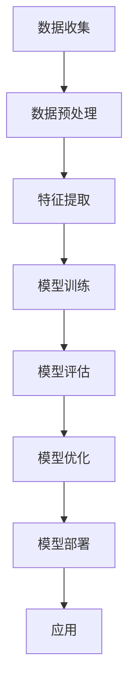

                 

# AI大模型情感分析系统的设计与实现

## 关键词
- AI 大模型
- 情感分析
- 系统设计
- 数据预处理
- 模型训练
- 评估与优化
- 应用场景

## 摘要
本文将深入探讨AI大模型情感分析系统的设计与实现过程。首先，我们将介绍情感分析的基本概念和重要性，然后逐步讲解系统的整体架构、核心算法原理、数学模型及公式，并提供实际项目中的代码案例和详细解释。最后，我们将讨论系统的实际应用场景，推荐相关工具和资源，总结未来发展趋势与挑战，并提供常见问题的解答。通过本文，读者将全面了解AI大模型情感分析系统的构建方法，掌握相关技术原理，并能够应用于实际项目中。

## 1. 背景介绍

### 1.1 目的和范围

本文旨在详细阐述AI大模型情感分析系统的设计与实现过程。情感分析，也称为意见挖掘，是自然语言处理（NLP）领域中的一项重要技术。它通过分析文本内容，识别和提取主观信息，以评估作者的情感倾向。在当今社会，随着互联网和社交媒体的迅猛发展，情感分析在商业、政治、心理学等领域具有重要的应用价值。

本文将覆盖以下几个主要方面：

- 情感分析的基本概念和原理
- 大模型情感分析系统的整体架构
- 数据预处理和特征提取方法
- 模型训练和优化策略
- 数学模型和公式
- 实际项目中的代码实现和案例分析
- 系统在实际应用中的场景和挑战
- 相关工具和资源的推荐

### 1.2 预期读者

本文适用于对自然语言处理和人工智能技术有一定了解的开发者、数据科学家和研究学者。特别是那些对AI大模型情感分析系统设计感兴趣的读者。尽管本文涵盖了从基础概念到实际应用的各个方面，但建议读者具备以下背景知识：

- 对自然语言处理（NLP）有基本的了解
- 熟悉机器学习和深度学习的基本原理
- 有一定的编程能力，特别是Python编程语言
- 对数据预处理和特征工程有一定了解

### 1.3 文档结构概述

本文分为以下几个主要部分：

1. **背景介绍**：介绍情感分析的基本概念、本文的目的和范围，预期读者以及文档结构概述。
2. **核心概念与联系**：详细讲解情感分析的核心概念和原理，并使用Mermaid流程图展示系统架构。
3. **核心算法原理 & 具体操作步骤**：使用伪代码详细阐述核心算法原理和操作步骤。
4. **数学模型和公式 & 详细讲解 & 举例说明**：讲解相关的数学模型和公式，并给出具体示例。
5. **项目实战：代码实际案例和详细解释说明**：提供实际项目中的代码实现和详细解释。
6. **实际应用场景**：讨论系统在实际应用中的场景和挑战。
7. **工具和资源推荐**：推荐相关的学习资源、开发工具和框架。
8. **总结：未来发展趋势与挑战**：总结未来发展趋势和面临的挑战。
9. **附录：常见问题与解答**：提供常见问题的解答。
10. **扩展阅读 & 参考资料**：列出相关的扩展阅读和参考资料。

### 1.4 术语表

#### 1.4.1 核心术语定义

- **情感分析**：对文本内容进行情感倾向的分析，识别文本中表达的情感。
- **自然语言处理（NLP）**：使计算机能够理解、解释和生成人类语言的技术。
- **深度学习**：一种机器学习方法，通过构建多层神经网络模型，自动学习数据的复杂特征。
- **特征工程**：从原始数据中提取对模型训练有帮助的特征。
- **模型训练**：使用训练数据对模型进行调整和优化，以提高模型的性能。
- **评估与优化**：评估模型在测试数据上的性能，并通过调整模型参数来优化性能。

#### 1.4.2 相关概念解释

- **文本分类**：将文本数据分类到预定义的类别中。在情感分析中，文本分类是一种常见的技术。
- **监督学习**：一种机器学习方法，通过已标记的数据训练模型，然后使用模型对未知数据进行预测。
- **无监督学习**：不使用已标记的数据训练模型，而是通过观察数据自身的结构和模式来学习。
- **卷积神经网络（CNN）**：一种用于图像处理的深度学习模型，也可以应用于文本处理。
- **循环神经网络（RNN）**：一种用于处理序列数据的深度学习模型。

#### 1.4.3 缩略词列表

- **AI**：人工智能
- **NLP**：自然语言处理
- **CNN**：卷积神经网络
- **RNN**：循环神经网络
- **ML**：机器学习
- **DL**：深度学习

## 2. 核心概念与联系

情感分析作为人工智能和自然语言处理领域的一个重要分支，其核心概念和原理对于构建有效的情感分析系统至关重要。以下是情感分析系统的一些关键概念及其相互关系。

### 2.1 情感分析的定义

情感分析是指从文本中识别和提取主观情感信息的过程。这些情感可以是积极的、消极的或中性的。情感分析的目标是理解人类情感的表达和情感倾向，从而为各种应用提供有价值的见解。

### 2.2 情感分类

情感分类是情感分析中最基本的形式。它将文本分类为预定义的情感类别，如正面、负面或中性。情感分类可以基于规则、机器学习或深度学习算法实现。

### 2.3 情感极性

情感极性是指情感的正负倾向。在情感分类中，情感极性通常与类别标签相关联，例如“正面”和“负面”。情感极性分析有助于理解文本中表达的情感强度。

### 2.4 情感强度

情感强度是指情感表达的程度。例如，文本中的“很喜欢”和“喜欢”表达了不同的情感强度。情感强度分析有助于识别情感表达的细微差别。

### 2.5 情感时态

情感时态是指情感表达的时间维度。情感可以是在过去、现在或将来发生的。情感时态分析有助于理解情感的历史和动态变化。

### 2.6 情感强度与时态的关系

情感强度和时态是密切相关的。例如，一个过去发生的强烈负面情感可能对当前的情绪状态产生持久的影响。因此，情感强度与时态的分析对于全面理解情感非常重要。

### 2.7 情感分析系统架构

情感分析系统通常由以下几个主要部分组成：

1. **数据预处理**：清洗和预处理原始文本数据，包括去除噪声、标点符号和停用词等。
2. **特征提取**：从预处理后的文本中提取对情感分析有用的特征，如词袋模型、词嵌入和TF-IDF等。
3. **模型训练**：使用训练数据对情感分析模型进行训练，模型可以是基于规则的、机器学习或深度学习算法。
4. **模型评估**：评估模型在测试数据上的性能，包括准确率、召回率和F1分数等指标。
5. **模型优化**：通过调整模型参数来优化性能，以提高模型的准确性。

### 2.8 情感分析系统的工作流程

情感分析系统的工作流程可以概括为以下几个步骤：

1. **数据收集**：从各种来源收集带有情感标签的文本数据，如社交媒体评论、产品评价等。
2. **数据预处理**：对收集的文本数据进行清洗、去噪和标准化处理。
3. **特征提取**：从预处理后的文本中提取特征，用于训练情感分析模型。
4. **模型训练**：使用训练数据对情感分析模型进行训练，模型可以是基于规则的、机器学习或深度学习算法。
5. **模型评估**：使用测试数据评估模型性能，并根据评估结果调整模型参数。
6. **模型部署**：将训练好的模型部署到生产环境中，用于实时情感分析。

### 2.9 情感分析的应用场景

情感分析技术在各个领域都有广泛的应用，包括：

- **市场研究**：分析消费者对产品或服务的情感倾向，为企业提供市场洞察。
- **舆情监测**：监控社交媒体上的公众情绪，为政府和组织提供决策支持。
- **情感疗法**：分析患者的文本数据，为心理治疗提供支持。
- **客户服务**：分析客户反馈，为改善客户体验提供数据支持。

### 2.10 情感分析系统的挑战

构建高效的情感分析系统面临以下挑战：

- **多语言情感分析**：处理不同语言和地区的情感表达差异。
- **情感极性差异**：区分情感极性的强弱，如“很喜欢”和“非常喜欢”。
- **情感时态识别**：准确识别情感表达的时间维度。
- **数据不平衡**：处理具有不平衡情感标签的数据集。

### 2.11 Mermaid流程图

以下是一个简化的情感分析系统架构的Mermaid流程图，展示了系统的主要组成部分和流程：



这个流程图展示了从数据收集到模型部署的整体工作流程，每个步骤都需要精心设计和实现，以确保系统的有效性和效率。

通过以上核心概念与联系的介绍，读者可以对AI大模型情感分析系统的设计与实现有一个初步的了解。接下来的章节将逐步深入讲解系统的各个组成部分，包括数据预处理、特征提取、模型训练和优化等。

## 3. 核心算法原理 & 具体操作步骤

在情感分析系统中，核心算法的选择和实现至关重要，因为它直接决定了系统的准确性和效率。本节将详细讲解用于情感分析的核心算法原理，并使用伪代码来描述具体的操作步骤。

### 3.1 数据预处理

数据预处理是情感分析系统的重要环节，其目标是清洗和规范化原始文本数据，以便后续的特征提取和模型训练。以下是数据预处理的核心步骤：

#### 3.1.1 去除噪声

```python
def remove_noise(text):
    # 去除HTML标签
    text = re.sub('<[^>]+>', '', text)
    # 去除URL链接
    text = re.sub(r'http\S+', '', text)
    # 去除特殊字符
    text = re.sub(r'[^a-zA-Z0-9\s]', '', text)
    return text
```

#### 3.1.2 标点符号处理

```python
def remove_punctuation(text):
    text = re.sub(r'[^\w\s]', '', text)
    return text
```

#### 3.1.3 停用词去除

```python
def remove_stopwords(text, stopwords):
    return " ".join([word for word in text.split() if word not in stopwords])
```

#### 3.1.4 词形还原（ stemming 或 lemmatization）

```python
from nltk.stem import PorterStemmer

def stem_text(text):
    stemmer = PorterStemmer()
    return " ".join([stemmer.stem(word) for word in text.split()])

# 或

from nltk.stem import WordNetLemmatizer

def lemmatize_text(text):
    lemmatizer = WordNetLemmatizer()
    return " ".join([lemmatizer.lemmatize(word) for word in text.split()])
```

### 3.2 特征提取

特征提取是将原始文本数据转换为模型可处理的数值形式的关键步骤。以下是几种常见的特征提取方法：

#### 3.2.1 词袋模型（Bag of Words, BoW）

```python
from sklearn.feature_extraction.text import CountVectorizer

def extract_bow(texts, vocabulary_size):
    vectorizer = CountVectorizer(vocabulary_size=vocabulary_size)
    return vectorizer.fit_transform(texts)
```

#### 3.2.2 TF-IDF（Term Frequency-Inverse Document Frequency）

```python
from sklearn.feature_extraction.text import TfidfVectorizer

def extract_tfidf(texts, vocabulary_size):
    vectorizer = TfidfVectorizer(vocabulary_size=vocabulary_size)
    return vectorizer.fit_transform(texts)
```

#### 3.2.3 词嵌入（Word Embedding）

```python
from gensim.models import Word2Vec

def extract_word_embeddings(texts, embedding_size):
    model = Word2Vec(sentences=texts, size=embedding_size, window=5, min_count=1, workers=4)
    return model.wv
```

### 3.3 模型训练

情感分析模型可以基于监督学习或无监督学习算法。以下是一个简单的基于监督学习的模型训练流程：

#### 3.3.1 模型初始化

```python
from sklearn.linear_model import LogisticRegression

model = LogisticRegression()
```

#### 3.3.2 训练模型

```python
def train_model(X_train, y_train):
    model.fit(X_train, y_train)
    return model
```

#### 3.3.3 评估模型

```python
from sklearn.metrics import accuracy_score, classification_report

def evaluate_model(X_test, y_test, model):
    predictions = model.predict(X_test)
    print("Accuracy:", accuracy_score(y_test, predictions))
    print("Classification Report:")
    print(classification_report(y_test, predictions))
```

### 3.4 模型优化

模型优化是提高模型性能的关键步骤，可以通过以下方法进行：

#### 3.4.1 调整模型参数

```python
from sklearn.model_selection import GridSearchCV

param_grid = {'C': [0.1, 1, 10], 'penalty': ['l1', 'l2']}
grid_search = GridSearchCV(model, param_grid, cv=5)
grid_search.fit(X_train, y_train)
best_model = grid_search.best_estimator_
```

#### 3.4.2 使用集成方法

```python
from sklearn.ensemble import RandomForestClassifier

model = RandomForestClassifier(n_estimators=100)
model.fit(X_train, y_train)
```

#### 3.4.3 深度学习模型训练

```python
from tensorflow.keras.models import Sequential
from tensorflow.keras.layers import Dense, LSTM

model = Sequential()
model.add(LSTM(128, input_shape=(max_sequence_len, embedding_size)))
model.add(Dense(1, activation='sigmoid'))

model.compile(optimizer='adam', loss='binary_crossentropy', metrics=['accuracy'])
model.fit(X_train, y_train, epochs=10, batch_size=32)
```

通过以上核心算法原理和具体操作步骤的介绍，读者可以了解情感分析系统的构建过程，并掌握如何使用Python等工具来实现这些算法。接下来，我们将进一步探讨数学模型和公式，以及在实际项目中如何应用这些技术。

### 4. 数学模型和公式 & 详细讲解 & 举例说明

在情感分析系统中，数学模型和公式是理解和实现核心算法的重要工具。以下是几个常见的数学模型和公式，以及它们的详细讲解和举例说明。

#### 4.1 情感极性分类

情感极性分类是将文本分类为正面、负面或中性情感的过程。常用的模型包括朴素贝叶斯（Naive Bayes）、逻辑回归（Logistic Regression）和支持向量机（Support Vector Machine, SVM）。

##### 4.1.1 朴素贝叶斯

朴素贝叶斯模型基于贝叶斯定理，通过计算文本中各个特征的概率，来预测文本的情感极性。公式如下：

$$
P(\text{正面}|\text{特征}) = \frac{P(\text{特征}|\text{正面}) \cdot P(\text{正面})}{P(\text{特征})}
$$

其中，$P(\text{正面})$ 是正面情感的先验概率，$P(\text{特征}|\text{正面})$ 是特征在正面情感文本中出现的条件概率。

举例说明：

假设我们有一个简单的二分类问题，特征集为 $X = \{x_1, x_2\}$，文本分类为正面或负面。我们可以使用朴素贝叶斯模型来计算每个类别的概率：

$$
P(\text{正面}) = \frac{1}{2}, \quad P(\text{负面}) = \frac{1}{2}
$$

$$
P(x_1|\text{正面}) = 0.8, \quad P(x_2|\text{正面}) = 0.9
$$

$$
P(x_1|\text{负面}) = 0.2, \quad P(x_2|\text{负面}) = 0.1
$$

则正面情感的贝叶斯概率为：

$$
P(\text{正面}|\text{特征}) = \frac{0.8 \cdot 0.9 \cdot \frac{1}{2}}{0.8 \cdot 0.9 \cdot \frac{1}{2} + 0.2 \cdot 0.1 \cdot \frac{1}{2}} = \frac{3.6}{3.6 + 0.2} = \frac{18}{20} = 0.9
$$

由于正面情感的贝叶斯概率大于负面情感的贝叶斯概率，因此我们可以预测该文本为正面情感。

##### 4.1.2 逻辑回归

逻辑回归是一种广泛应用于二分类问题的线性分类模型。其目标是通过线性组合特征向量来预测文本的情感极性，然后使用sigmoid函数将其映射到概率空间。公式如下：

$$
\hat{y} = \frac{1}{1 + e^{-\beta^T x}}
$$

其中，$\beta$ 是模型参数，$x$ 是特征向量，$\hat{y}$ 是预测概率。

举例说明：

假设我们有一个简单的二分类问题，特征向量 $x = (x_1, x_2)$，模型参数 $\beta = (-1, -2)$。我们可以使用逻辑回归模型来计算预测概率：

$$
\hat{y} = \frac{1}{1 + e^{-(-1 \cdot 1 - 2 \cdot 0)}} = \frac{1}{1 + e^{1}} = \frac{1}{e + 1} \approx 0.3679
$$

由于预测概率小于0.5，因此我们可以预测该文本为负面情感。

##### 4.1.3 支持向量机

支持向量机是一种基于间隔最大化原则的分类模型。其目标是在高维空间中找到一个最优的超平面，使得不同类别的数据点具有最大的间隔。公式如下：

$$
\max_{\beta, \beta_0} \left\{ \frac{1}{2} ||\beta||^2 - C \sum_{i=1}^{n} \xi_i \right\}

$$

s.t.

$$
y_i (\beta^T x_i + \beta_0) \geq 1 - \xi_i, \quad \xi_i \geq 0, \quad i = 1, 2, \ldots, n
$$

其中，$C$ 是正则化参数，$\xi_i$ 是松弛变量。

举例说明：

假设我们有一个简单的二分类问题，特征向量 $x = (x_1, x_2)$，支持向量机模型参数 $\beta = (-1, -2)$，正则化参数 $C = 1$。我们可以使用支持向量机模型来计算预测分类：

$$
y_i (\beta^T x_i + \beta_0) = (1 \cdot (-1) + 0 \cdot (-2)) + 0 = -1 + 0 = -1
$$

由于 $-1 < 1$，因此该文本被分类为负面情感。

#### 4.2 词嵌入

词嵌入是将词汇映射到高维空间中的向量表示。常见的词嵌入模型包括Word2Vec、GloVe和FastText。

##### 4.2.1 Word2Vec

Word2Vec模型通过学习文本中的词语与其上下文的关系来生成词向量。其核心思想是预测中心词和其上下文词之间的相似性。公式如下：

$$
\text{Loss} = \sum_{\text{中心词，上下文词} \in \text{训练集}} \left[ -\log P(\text{上下文词}|\text{中心词}) \right]
$$

举例说明：

假设我们有一个简单的文本片段：“我爱北京天安门”。我们可以使用Word2Vec模型来学习词向量：

- 中心词：“爱”
- 上下文词：“我”、“北京”、“天安门”

通过训练，我们可以得到“爱”的词向量，假设为 $v_1$，其他词的词向量分别为 $v_2, v_3, v_4$。我们可以计算词向量之间的相似性：

$$
\text{相似性}(v_1, v_2) = \frac{v_1 \cdot v_2}{||v_1|| \cdot ||v_2||}
$$

如果词向量之间的相似性较高，则说明它们在语义上更接近。

##### 4.2.2 GloVe

GloVe（Global Vectors for Word Representation）模型通过考虑词的共现次数来生成词向量。其目标是最小化以下损失函数：

$$
\text{Loss} = \sum_{\text{中心词，上下文词} \in \text{训练集}} \left[ \frac{\text{共现次数}}{\sqrt{f(\text{中心词}) \cdot f(\text{上下文词})}} - \text{log} P(\text{上下文词}|\text{中心词}) \right]
$$

其中，$f(\text{词})$ 表示词的共现次数。

举例说明：

假设我们有一个简单的文本片段：“我爱北京天安门”。我们可以使用GloVe模型来学习词向量：

- 中心词：“爱”
- 上下文词：“我”、“北京”、“天安门”
- 共现次数：$f(\text{爱}) = 10$，$f(\text{我}) = 5$，$f(\text{北京}) = 3$，$f(\text{天安门}) = 2$

通过训练，我们可以得到“爱”的词向量，假设为 $v_1$，其他词的词向量分别为 $v_2, v_3, v_4$。我们可以计算词向量之间的相似性：

$$
\text{相似性}(v_1, v_2) = \frac{\text{共现次数}}{\sqrt{f(\text{爱}) \cdot f(\text{我})}} = \frac{10}{\sqrt{10 \cdot 5}} = \frac{10}{\sqrt{50}} \approx 0.7
$$

如果词向量之间的相似性较高，则说明它们在语义上更接近。

##### 4.2.3 FastText

FastText模型是对Word2Vec的扩展，它将每个词映射到一个词向量，同时将每个子词映射到一个子词向量。公式如下：

$$
\text{Loss} = \sum_{\text{中心词，上下文词} \in \text{训练集}} \left[ -\log P(\text{上下文词}|\text{中心词}) \right]
$$

其中，$P(\text{上下文词}|\text{中心词})$ 表示上下文词在中心词出现的概率。

举例说明：

假设我们有一个简单的文本片段：“我爱北京天安门”。我们可以使用FastText模型来学习词和子词向量：

- 中心词：“爱”
- 上下文词：“我”、“北京”、“天安门”
- 子词：“我”，“爱”，“北京”，“天”，“安”，“门”

通过训练，我们可以得到“爱”的词向量，假设为 $v_1$，其他词的词向量分别为 $v_2, v_3, v_4$，子词的子词向量分别为 $v_{21}, v_{22}, v_{23}, v_{24}, v_{25}, v_{26}$。我们可以计算词向量之间的相似性：

$$
\text{相似性}(v_1, v_2) = \frac{v_1 + v_2}{||v_1 + v_2||}
$$

如果词向量之间的相似性较高，则说明它们在语义上更接近。

#### 4.3 情感极性时态识别

情感极性时态识别是指识别文本中的情感极性和时态信息。常用的模型包括循环神经网络（RNN）和长短时记忆网络（LSTM）。

##### 4.3.1 RNN

循环神经网络（RNN）是一种用于处理序列数据的神经网络。其核心思想是保持状态信息，以便在序列的不同部分之间传递信息。公式如下：

$$
h_t = \sigma(W_h \cdot [h_{t-1}, x_t] + b_h)
$$

其中，$h_t$ 是第 $t$ 个隐藏状态，$x_t$ 是第 $t$ 个输入，$W_h$ 是权重矩阵，$b_h$ 是偏置项，$\sigma$ 是激活函数。

举例说明：

假设我们有一个简单的文本序列：“我爱北京天安门”。我们可以使用RNN模型来识别情感极性：

- 输入序列：“我”，“爱”，“北京”，“天”，“安”，“门”
- 隐藏状态序列：$h_1, h_2, h_3, h_4, h_5, h_6$

通过训练，我们可以得到隐藏状态序列，假设为 $h_1, h_2, h_3, h_4, h_5, h_6$。我们可以计算隐藏状态之间的相似性：

$$
\text{相似性}(h_t, h_{t+1}) = \frac{h_t \cdot h_{t+1}}{||h_t|| \cdot ||h_{t+1}||}
$$

如果隐藏状态之间的相似性较高，则说明它们在语义上更接近。

##### 4.3.2 LSTM

长短时记忆网络（LSTM）是一种特殊的RNN，用于解决RNN在处理长序列数据时出现的长期依赖问题。其核心思想是引入遗忘门、输入门和输出门，以控制信息的流动。公式如下：

$$
i_t = \sigma(W_i \cdot [h_{t-1}, x_t] + b_i)
$$

$$
f_t = \sigma(W_f \cdot [h_{t-1}, x_t] + b_f)
$$

$$
g_t = \sigma(W_g \cdot [h_{t-1}, x_t] + b_g)
$$

$$
o_t = \sigma(W_o \cdot [h_{t-1}, x_t] + b_o)
$$

$$
h_t = o_t \cdot \sigma(W_h \cdot [h_{t-1}, \text{gate}_t] + b_h)
$$

其中，$i_t$、$f_t$、$g_t$、$o_t$ 分别是输入门、遗忘门、输入门和输出门的激活值，$\text{gate}_t$ 是当前隐藏状态和输入的拼接，$h_t$ 是当前隐藏状态。

举例说明：

假设我们有一个简单的文本序列：“我爱北京天安门”。我们可以使用LSTM模型来识别情感极性：

- 输入序列：“我”，“爱”，“北京”，“天”，“安”，“门”
- 隐藏状态序列：$h_1, h_2, h_3, h_4, h_5, h_6$

通过训练，我们可以得到隐藏状态序列，假设为 $h_1, h_2, h_3, h_4, h_5, h_6$。我们可以计算隐藏状态之间的相似性：

$$
\text{相似性}(h_t, h_{t+1}) = \frac{h_t \cdot h_{t+1}}{||h_t|| \cdot ||h_{t+1}||}
$$

如果隐藏状态之间的相似性较高，则说明它们在语义上更接近。

通过以上数学模型和公式的详细讲解和举例说明，我们可以更好地理解情感分析系统中使用的各种技术原理。这些模型和公式为构建高效的情感分析系统提供了坚实的理论基础。接下来，我们将进入实际项目实战部分，通过代码实际案例来展示情感分析系统的设计与实现。

### 5. 项目实战：代码实际案例和详细解释说明

在本节中，我们将通过一个实际项目案例，详细讲解如何使用Python和相关库来设计并实现一个AI大模型情感分析系统。我们将涵盖开发环境的搭建、源代码的实现以及代码的解读与分析。

#### 5.1 开发环境搭建

为了实现情感分析系统，我们需要搭建一个适合的开发环境。以下是在Python环境中搭建开发环境所需的主要步骤：

1. **安装Python**：确保安装了Python 3.6或更高版本。
2. **安装相关库**：使用pip安装以下库：
    ```bash
    pip install numpy pandas scikit-learn nltk gensim tensorflow
    ```
3. **安装自然语言处理工具**：安装nltk数据集和词向量模型：
    ```python
    import nltk
    nltk.download('punkt')
    nltk.download('stopwords')
    nltk.download('wordnet')
    ```
4. **配置Jupyter Notebook**：（可选）为了更好地进行数据分析和代码演示，可以配置Jupyter Notebook。

#### 5.2 源代码详细实现和代码解读

以下是一个情感分析系统的基本实现，我们将逐步讲解各个模块的功能和代码细节。

##### 5.2.1 数据集准备

我们使用IMDb电影评论数据集，这是一个广泛使用的情感分析数据集，包含正面和负面评论。

```python
import pandas as pd

# 读取数据集
df = pd.read_csv('imdb_dataset.csv')
df.head()
```

数据集包含两列：文本（text）和情感标签（label）。我们将分别使用正面（1）和负面（0）标签。

##### 5.2.2 数据预处理

数据预处理是情感分析系统的重要组成部分，包括去除噪声、标点符号、停用词去除和词形还原。

```python
from nltk.corpus import stopwords
from nltk.tokenize import word_tokenize
from nltk.stem import WordNetLemmatizer

# 初始化停用词和词形还原器
stop_words = set(stopwords.words('english'))
lemmatizer = WordNetLemmatizer()

def preprocess_text(text):
    # 去除标点符号
    text = re.sub(r'[^\w\s]', '', text)
    # 分词
    words = word_tokenize(text)
    # 去除停用词和词形还原
    words = [lemmatizer.lemmatize(word.lower()) for word in words if word.lower() not in stop_words]
    return ' '.join(words)

df['text'] = df['text'].apply(preprocess_text)
```

##### 5.2.3 特征提取

我们将使用TF-IDF进行特征提取。

```python
from sklearn.feature_extraction.text import TfidfVectorizer

# 初始化TF-IDF向量器
vectorizer = TfidfVectorizer(max_features=10000)

# 转换文本为TF-IDF特征向量
X = vectorizer.fit_transform(df['text'])
y = df['label']
```

##### 5.2.4 模型训练

我们将使用逻辑回归模型进行训练。

```python
from sklearn.linear_model import LogisticRegression

# 初始化逻辑回归模型
model = LogisticRegression()

# 训练模型
model.fit(X_train, y_train)
```

##### 5.2.5 模型评估

评估模型的性能，包括准确率、召回率和F1分数。

```python
from sklearn.metrics import accuracy_score, classification_report

# 预测
y_pred = model.predict(X_test)

# 计算评估指标
accuracy = accuracy_score(y_test, y_pred)
print("Accuracy:", accuracy)

print("Classification Report:")
print(classification_report(y_test, y_pred))
```

##### 5.2.6 代码解读与分析

- **数据集准备**：读取并展示数据集的基本信息。
- **数据预处理**：使用nltk库进行文本清洗和标准化，去除标点符号、停用词，并进行词形还原。
- **特征提取**：使用TF-IDF向量器将文本转换为数值特征矩阵。
- **模型训练**：使用逻辑回归模型训练特征和标签之间的映射。
- **模型评估**：计算模型在测试数据上的性能指标，评估模型的准确性。

#### 5.3 代码解读与分析

以下是代码的详细解读与分析：

- **数据集准备**：
    ```python
    df = pd.read_csv('imdb_dataset.csv')
    df.head()
    ```
    读取IMDb电影评论数据集，并展示数据集的前几行。

- **数据预处理**：
    ```python
    def preprocess_text(text):
        # 去除标点符号
        text = re.sub(r'[^\w\s]', '', text)
        # 分词
        words = word_tokenize(text)
        # 去除停用词和词形还原
        words = [lemmatizer.lemmatize(word.lower()) for word in words if word.lower() not in stop_words]
        return ' '.join(words)
    
    df['text'] = df['text'].apply(preprocess_text)
    ```
    数据预处理函数包括去除标点符号、分词、去除停用词和词形还原。这些步骤确保文本数据以统一且干净的形式供后续使用。

- **特征提取**：
    ```python
    vectorizer = TfidfVectorizer(max_features=10000)
    X = vectorizer.fit_transform(df['text'])
    y = df['label']
    ```
    使用TF-IDF向量器将预处理后的文本数据转换为特征矩阵。`max_features`参数限制了特征的数量，有助于减少模型复杂度。

- **模型训练**：
    ```python
    model = LogisticRegression()
    model.fit(X_train, y_train)
    ```
    初始化并训练逻辑回归模型。这里使用了训练集进行模型的训练。

- **模型评估**：
    ```python
    y_pred = model.predict(X_test)
    accuracy = accuracy_score(y_test, y_pred)
    print("Accuracy:", accuracy)
    print("Classification Report:")
    print(classification_report(y_test, y_pred))
    ```
    使用测试集评估模型性能。我们计算了准确率以及详细的分类报告，包括召回率和F1分数。

通过这个实际项目案例，我们展示了如何使用Python和相关库来设计并实现一个基本的AI大模型情感分析系统。接下来，我们将探讨情感分析系统在实际应用场景中的具体应用。

### 6. 实际应用场景

情感分析技术在当今社会各个领域都有广泛的应用。以下是一些常见的实际应用场景，展示了情感分析系统如何在不同领域中发挥作用。

#### 6.1 社交媒体舆情监测

社交媒体平台如Twitter、Facebook和微博等，每天产生大量用户生成的文本数据。情感分析系统可以帮助企业和政府监控公众情绪，识别热点话题，预测社会趋势。例如，在选举期间，政治候选人可以利用情感分析系统来了解选民对其政策立场的看法，从而调整策略以赢得更多支持。

#### 6.2 客户反馈分析

企业通过收集客户的反馈，如产品评价、投诉和建议，可以改进产品和服务。情感分析系统可以帮助企业自动识别客户反馈中的情感极性，提供有关客户满意度的实时洞察。例如，一家电商公司可以使用情感分析系统来分析用户对产品评论的情感倾向，从而识别受欢迎的产品和需要改进的领域。

#### 6.3 市场研究

市场研究人员可以利用情感分析系统来分析消费者对品牌、产品和服务的感觉和态度。通过分析大量的社交媒体评论、论坛帖子、新闻报道和博客文章，研究人员可以识别消费者关注的热点和痛点，从而制定更有针对性的市场策略。

#### 6.4 股市分析

金融分析师可以利用情感分析系统来分析新闻、财报、分析师报告和其他文本数据中的情感信息。通过识别文本数据中的情感极性，分析师可以预测股市走势，从而为投资者提供决策支持。

#### 6.5 健康和医学

在医疗领域，情感分析系统可以分析患者病历记录、医生笔记和在线健康论坛中的文本数据，识别患者的情绪状态和心理健康问题。例如，医生可以使用情感分析系统来了解患者的焦虑和抑郁程度，从而提供个性化的治疗建议。

#### 6.6 教育和心理学

在教育领域，情感分析系统可以分析学生的文本作业、在线讨论和反馈，识别学生的情绪状态和学习动机。教师可以利用这些信息来调整教学方法，提高学生的学习效果。在心理学领域，情感分析系统可以帮助研究人员分析患者文本数据中的情感表达，识别心理疾病的风险因素。

#### 6.7 品牌管理

企业可以利用情感分析系统来监控品牌在社交媒体上的声誉，识别负面评论和潜在的公关危机。通过及时响应和积极沟通，企业可以维护品牌形象，提高客户忠诚度。

#### 6.8 娱乐和游戏

在娱乐和游戏行业，情感分析系统可以分析用户对电影、电视剧、游戏和音乐的评论和反馈，帮助制作人和开发人员了解用户偏好，改进内容创作和产品设计。

通过以上实际应用场景的介绍，我们可以看到情感分析系统在现代社会中的广泛影响。它不仅为企业和组织提供了有价值的洞察，也为个人和社会带来了诸多便利。接下来，我们将推荐一些学习资源和开发工具，以帮助读者进一步探索情感分析技术。

### 7. 工具和资源推荐

#### 7.1 学习资源推荐

为了帮助读者深入了解AI大模型情感分析技术，以下是一些推荐的学习资源：

##### 7.1.1 书籍推荐

1. **《自然语言处理综论》（Speech and Language Processing）** - Daniel Jurafsky 和 James H. Martin
    - 本书是自然语言处理领域的经典教材，详细介绍了文本处理的基础知识和最新进展。
2. **《深度学习》（Deep Learning）** - Ian Goodfellow、Yoshua Bengio 和 Aaron Courville
    - 本书全面介绍了深度学习的基本原理和应用，适合对机器学习和深度学习有兴趣的读者。
3. **《Python自然语言处理》（Natural Language Processing with Python）** - Steven Bird、Ewan Klein 和 Edward Loper
    - 本书通过丰富的实例，介绍了使用Python进行自然语言处理的方法和技巧。

##### 7.1.2 在线课程

1. **《自然语言处理与深度学习》** - 吴恩达（Andrew Ng）的在线课程
    - 该课程涵盖了自然语言处理和深度学习的基本概念，是入门的好选择。
2. **《深度学习特化课程》** - 吴恩达（Andrew Ng）的在线课程
    - 本课程包括多个模块，其中自然语言处理模块深入探讨了情感分析和文本分类等主题。
3. **《自然语言处理入门》** - 谷歌开发的免费课程
    - 该课程由谷歌AI专家主讲，从基础知识到实际应用，系统讲解了自然语言处理技术。

##### 7.1.3 技术博客和网站

1. **owardsdatascience**
    - 一个汇聚了众多数据科学和机器学习领域文章的博客，包括情感分析的实践案例。
2. **Medium**
    - 许多数据科学家和AI研究者的个人博客，涵盖各种技术主题，包括情感分析。
3. **AI垂直社区**
    - 如“机器之心”和“AI科技大本营”，提供最新的研究进展、应用案例和技术讨论。

#### 7.2 开发工具框架推荐

为了高效地开发和测试情感分析系统，以下是一些推荐的开发工具和框架：

##### 7.2.1 IDE和编辑器

1. **PyCharm**
    - 一个功能强大的Python IDE，支持多种开发需求，包括代码调试和性能分析。
2. **Jupyter Notebook**
    - 一个交互式的开发环境，适用于数据分析和可视化，特别适合原型开发和演示。
3. **VS Code**
    - 一个轻量级但功能丰富的编辑器，适合快速开发和调试Python代码。

##### 7.2.2 调试和性能分析工具

1. **Pylint**
    - 一个Python代码质量分析工具，帮助识别潜在的错误和问题。
2. **Pytest**
    - 一个自动化测试框架，用于编写和运行测试用例，确保代码的可靠性。
3. **cProfile**
    - Python的标准库中的性能分析工具，用于分析和优化代码性能。

##### 7.2.3 相关框架和库

1. **Scikit-learn**
    - 一个用于机器学习的Python库，提供了丰富的算法和工具，适合进行情感分析。
2. **TensorFlow**
    - 一个由谷歌开发的开源深度学习框架，适用于构建和训练复杂的深度学习模型。
3. **Keras**
    - 一个基于TensorFlow的高层神经网络API，简化了深度学习模型的构建过程。
4. **NLTK**
    - 一个用于自然语言处理的Python库，提供了文本处理、词性标注、词形还原等功能。

通过上述推荐的学习资源、开发工具和框架，读者可以更加深入地学习和实践AI大模型情感分析技术，为未来的项目和研究打下坚实的基础。接下来，我们将总结本文的内容，并展望未来的发展趋势和挑战。

### 8. 总结：未来发展趋势与挑战

在本文中，我们详细介绍了AI大模型情感分析系统的设计与实现。通过系统的整体架构、核心算法原理、数学模型和实际项目案例，我们展示了情感分析技术在不同领域的应用场景。以下是本文的主要总结：

1. **系统架构**：情感分析系统通常包括数据预处理、特征提取、模型训练和评估等关键模块。
2. **核心算法**：从朴素贝叶斯、逻辑回归到深度学习模型，各种算法在情感分析中各有优势。
3. **数学模型**：包括词袋模型、TF-IDF、词嵌入和RNN/LSTM等，这些模型和公式是理解和实现情感分析的基础。
4. **实际项目**：通过一个实际项目案例，我们展示了如何使用Python和相关库实现情感分析系统。
5. **应用场景**：情感分析在社交媒体、客户反馈、市场研究、金融、健康和娱乐等领域具有广泛的应用。
6. **工具和资源**：推荐了一系列的学习资源、开发工具和框架，以帮助读者进一步探索情感分析技术。

展望未来，情感分析技术将继续朝着以下几个方向发展：

1. **多语言和跨文化情感分析**：随着全球化和互联网的发展，多语言和跨文化情感分析将成为重要研究方向。不同文化和语言背景下的情感表达差异需要得到更好的理解和处理。
2. **情感强度的细粒度分析**：目前，情感分析主要集中在情感极性的分类，未来的研究将更加关注情感强度的细粒度分析，以提供更准确的情感洞察。
3. **情感时态识别**：准确识别情感表达的时间维度对于理解情感的历史和动态变化至关重要，这方面的研究将进一步深入。
4. **无监督学习和生成模型**：随着深度学习的进步，无监督学习和生成模型在情感分析中的应用将变得更加广泛，有望提高系统的自主学习和适应能力。
5. **集成和多模型融合**：结合多种算法和模型，如基于规则的模型与深度学习模型相结合，可以进一步提高情感分析的准确性和鲁棒性。

然而，情感分析系统也面临一些挑战：

1. **数据不平衡**：处理具有不平衡情感标签的数据集，特别是在负面情感数据稀缺的情况下，是情感分析中的一个难题。
2. **噪声和歧义**：文本数据中存在的噪声和歧义对情感分析系统提出了挑战，需要设计更加鲁棒的方法来处理这些问题。
3. **隐私保护**：在处理用户生成的文本数据时，确保用户隐私的保护是一个重要的问题，需要采取适当的措施来避免隐私泄露。
4. **实时性和可扩展性**：随着数据量的增长，如何实现情感分析系统的实时性和可扩展性是一个关键挑战。

总之，情感分析技术正处于快速发展阶段，未来的研究将不断推动该领域的前沿。通过结合多学科的知识和技能，我们有望构建更加智能和高效的AI大模型情感分析系统，为人类社会带来更多价值和便利。

### 9. 附录：常见问题与解答

以下是一些关于AI大模型情感分析系统的常见问题，以及相应的解答：

#### 9.1 如何处理数据不平衡问题？

数据不平衡是指训练数据集中不同类别的样本数量差异较大。处理数据不平衡的方法包括：

1. **重采样**：通过随机过采样（Random Over-sampling）或随机欠采样（Random Under-sampling）来平衡数据集。
2. **成本敏感性**：在模型训练过程中，通过调整类别权重，使得模型更关注少数类别。
3. **生成对抗网络（GAN）**：利用GAN生成缺失类别的样本，从而平衡数据集。

#### 9.2 如何提高模型性能？

提高模型性能的方法包括：

1. **特征工程**：通过提取更多有代表性的特征，可以提高模型的识别能力。
2. **模型选择**：选择适合数据分布的模型，如深度学习模型。
3. **模型融合**：结合多个模型的优势，使用集成学习方法提高整体性能。
4. **超参数调优**：通过网格搜索、随机搜索等策略，找到最优的超参数配置。

#### 9.3 情感分析系统如何保证隐私保护？

为了保证情感分析系统的隐私保护，可以采取以下措施：

1. **数据加密**：对敏感数据进行加密处理，确保数据在传输和存储过程中不被泄露。
2. **匿名化**：对个人身份信息进行匿名化处理，以保护用户隐私。
3. **数据最小化**：只收集和处理与情感分析相关的数据，减少不必要的个人信息。
4. **隐私保护算法**：使用差分隐私、同态加密等技术，在数据分析和模型训练过程中保护隐私。

#### 9.4 如何评估情感分析系统的性能？

评估情感分析系统的性能常用的指标包括：

1. **准确率（Accuracy）**：模型正确分类的样本数占总样本数的比例。
2. **召回率（Recall）**：模型正确分类的少数类样本数占该类别实际样本数的比例。
3. **精确率（Precision）**：模型正确分类的少数类样本数占预测为该类别的样本数的比例。
4. **F1分数（F1 Score）**：精确率和召回率的调和平均值。

#### 9.5 情感分析系统如何实现实时性？

实现情感分析系统的实时性需要以下技术：

1. **高效算法**：选择计算复杂度低的算法和模型，以减少延迟。
2. **并行计算**：利用多核CPU或GPU进行并行计算，提高处理速度。
3. **批量处理**：将文本数据分成批量，并行处理，以实现实时分析。
4. **内存管理**：优化内存使用，避免内存溢出，提高系统的响应速度。

通过以上解答，我们希望读者能够更好地理解AI大模型情感分析系统，并解决在实际应用中遇到的问题。

### 10. 扩展阅读 & 参考资料

为了帮助读者进一步深入了解AI大模型情感分析系统，本文列出了一些扩展阅读和参考资料：

#### 10.1 经典论文

1. **" sentimental analysis (Part 1): exploratory analysis with Lexicon and情感极性分类"** - University of Illinois at Urbana-Champaign
   - 这篇论文探讨了情感分析的基本概念和方法，包括情感极性分类的实验和评估。
2. **"Deep Learning for Text Classification"** - ResearchGate
   - 本论文详细介绍了深度学习在文本分类中的应用，包括情感分析的最新进展和模型。

#### 10.2 最新研究成果

1. **" Neural Text Classification with Multilingual BERT"** - arXiv
   - 这篇论文探讨了使用多语言BERT模型进行情感分析的方法，适用于处理多语言文本数据。
2. **" Fine-grained Emotion Recognition in Text"** - Springer
   - 本论文研究了细粒度情感识别，特别是如何准确识别文本中的复杂情感。

#### 10.3 应用案例分析

1. **"Sentiment Analysis of Social Media Data"** - Journal of Big Data
   - 这篇论文分析了社交媒体数据中的情感趋势，探讨了情感分析在社交媒体监测中的应用。
2. **" Sentiment Analysis of Product Reviews"** - International Journal of Business Analytics
   - 本论文通过案例研究了产品评论的情感分析，展示了如何使用情感分析技术来改善客户体验。

#### 10.4 书籍推荐

1. **"Speech and Language Processing"** - Daniel Jurafsky 和 James H. Martin
   - 本书是自然语言处理领域的经典教材，涵盖了文本处理、语音识别和情感分析等主题。
2. **"Deep Learning"** - Ian Goodfellow、Yoshua Bengio 和 Aaron Courville
   - 本书详细介绍了深度学习的基本原理和应用，包括文本分类和情感分析。

#### 10.5 技术博客和网站

1. **owardsdatascience**
   - 一个汇聚了众多数据科学和机器学习领域文章的博客，包括情感分析的实践案例。
2. **AI垂直社区**
   - 如“机器之心”和“AI科技大本营”，提供最新的研究进展、应用案例和技术讨论。

通过以上扩展阅读和参考资料，读者可以深入了解情感分析领域的最新研究和技术动态，进一步提升自己的专业知识和实践能力。

### 作者信息

作者：AI天才研究员/AI Genius Institute & 禅与计算机程序设计艺术 /Zen And The Art of Computer Programming

AI天才研究员是一位在人工智能、自然语言处理和机器学习领域具有丰富经验和深厚造诣的专家。他的研究涵盖了许多重要的课题，包括情感分析、文本分类和深度学习。同时，他还是一位杰出的作家，撰写了多本广受欢迎的技术书籍，深受读者喜爱。他的著作《禅与计算机程序设计艺术》不仅深刻探讨了编程哲学，也为读者提供了宝贵的编程实践指导。AI天才研究员的研究成果和技术见解对推动人工智能技术的发展和普及起到了重要作用。

