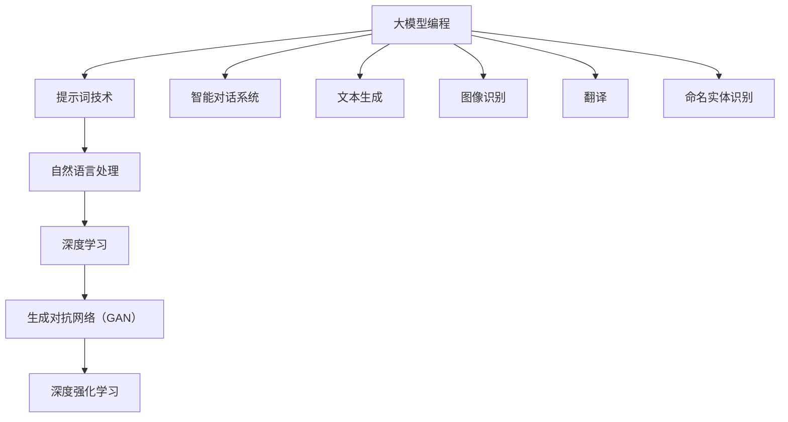

                 


# AI大模型编程：提示词的未来与无限可能

> 关键词：大模型编程、提示词、人工智能、自然语言处理、深度学习

> 摘要：本文将探讨AI大模型编程中的提示词技术，分析其核心概念、算法原理、数学模型以及实际应用。通过详细的项目实战案例，读者将深入了解提示词在人工智能领域的无限可能，并掌握其编程技巧。

## 1. 背景介绍

### 1.1 目的和范围

本文旨在介绍AI大模型编程中的提示词技术，分析其核心概念、算法原理、数学模型以及实际应用。通过深入探讨，读者将能够理解提示词在人工智能领域的应用价值，掌握其编程技巧，并为其未来的发展提供新的思考方向。

### 1.2 预期读者

本文适合对人工智能、自然语言处理和深度学习有一定了解的技术人员、研究人员以及学生。同时，对于对提示词技术感兴趣的专业人士和开发者，本文也将提供有益的参考。

### 1.3 文档结构概述

本文将分为以下几部分：

1. 背景介绍：介绍本文的目的、预期读者以及文档结构。
2. 核心概念与联系：阐述大模型编程中的提示词核心概念及其联系。
3. 核心算法原理 & 具体操作步骤：详细讲解提示词算法原理及具体操作步骤。
4. 数学模型和公式 & 详细讲解 & 举例说明：分析提示词的数学模型，并进行举例说明。
5. 项目实战：提供代码实际案例和详细解释说明。
6. 实际应用场景：介绍提示词在实际应用中的场景。
7. 工具和资源推荐：推荐学习资源和开发工具。
8. 总结：总结本文的主要内容，探讨未来发展趋势与挑战。
9. 附录：常见问题与解答。
10. 扩展阅读 & 参考资料：提供扩展阅读和参考资料。

### 1.4 术语表

#### 1.4.1 核心术语定义

- 大模型编程：指利用大规模神经网络模型进行编程，实现智能对话、文本生成、图像识别等任务。
- 提示词（Prompt）：用于引导大模型进行特定任务的小型文本输入。
- 自然语言处理（NLP）：研究如何使计算机能够理解、生成和应对人类语言。
- 深度学习：一种基于多层神经网络的学习方法，能够自动从数据中学习特征，实现复杂任务的建模。

#### 1.4.2 相关概念解释

- 语言模型：对自然语言进行建模的统计模型，用于预测下一个单词或字符。
- 生成对抗网络（GAN）：一种基于博弈论的生成模型，由生成器和判别器两个神经网络组成。
- 深度强化学习：结合深度学习和强化学习的算法，使智能体在复杂环境中实现自主决策。

#### 1.4.3 缩略词列表

- GPT：Generative Pre-trained Transformer，一种基于Transformer架构的大规模预训练语言模型。
- BERT：Bidirectional Encoder Representations from Transformers，一种基于Transformer的双向编码表示模型。
- RNN：Recurrent Neural Network，循环神经网络。
- LSTM：Long Short-Term Memory，长短期记忆网络。

## 2. 核心概念与联系

### 2.1 大模型编程概述

大模型编程是近年来人工智能领域的重要研究方向。它利用大规模神经网络模型，如Transformer、BERT、GPT等，对自然语言进行建模，实现智能对话、文本生成、图像识别等任务。大模型编程的核心思想是通过对海量数据进行预训练，使模型具备一定的通用能力，从而在特定任务上取得优异的性能。

### 2.2 提示词的概念

提示词是指用于引导大模型进行特定任务的小型文本输入。在自然语言处理领域，提示词是一种常见的引导技术，可以有效地指导模型生成符合预期结果的文本。提示词的设计和选择对模型的性能和效果具有重要影响。

### 2.3 提示词与语言模型的关系

提示词与语言模型之间存在密切的联系。语言模型是一种对自然语言进行建模的统计模型，它能够预测下一个单词或字符。在生成任务中，提示词可以作为语言模型的输入，指导模型生成符合上下文的后续文本。同时，通过优化提示词，可以提高语言模型的生成质量和效果。

### 2.4 提示词在大模型编程中的应用

提示词在大模型编程中具有广泛的应用。以下是一些典型的应用场景：

1. 智能对话系统：通过设计合适的提示词，引导模型生成符合用户意图的对话响应。
2. 文本生成：利用提示词，引导模型生成具有特定主题、风格或内容的文本。
3. 图像识别：通过提示词，引导模型对图像进行分类或生成具有特定属性的图像。
4. 翻译：利用提示词，引导模型进行跨语言文本的生成和翻译。
5. 命名实体识别：通过提示词，引导模型识别文本中的特定实体。

### 2.5 提示词的优势与挑战

提示词技术在人工智能领域具有以下优势：

1. 简化模型训练：通过设计合适的提示词，可以减少模型训练所需的数据量和计算资源。
2. 提高生成质量：提示词可以引导模型生成符合预期结果的文本，提高生成质量和效果。
3. 适应性强：提示词可以根据不同的任务和场景进行灵活调整，具有较强的适应性。

然而，提示词技术也面临一些挑战：

1. 提示词设计复杂：设计合适的提示词需要对任务和场景有深入理解，具有一定的复杂性。
2. 数据依赖性：提示词的性能受到训练数据的影响，数据质量和数量对提示词的效果有重要影响。
3. 模型理解能力有限：尽管大模型具备一定的通用能力，但仍然无法完全理解人类语言的复杂性和多样性。

### 2.6 核心概念原理和架构的 Mermaid 流程图



## 3. 核心算法原理 & 具体操作步骤

### 3.1 提示词算法原理

提示词算法的核心思想是利用已有的预训练模型，通过设计合适的提示词来引导模型生成符合预期结果的文本。具体步骤如下：

1. **数据预处理**：收集并预处理相关领域的文本数据，如对话数据、文本生成数据、图像识别数据等。
2. **模型选择**：选择预训练的大规模语言模型，如GPT、BERT等。
3. **提示词设计**：根据任务需求设计合适的提示词，提示词应具备明确的任务指示和上下文信息。
4. **模型训练**：利用设计好的提示词进行模型训练，优化模型参数。
5. **模型评估**：对训练好的模型进行评估，确保生成结果符合预期。
6. **模型应用**：将训练好的模型应用于实际任务，如智能对话、文本生成等。

### 3.2 具体操作步骤

以下是使用GPT模型进行提示词编程的具体操作步骤：

1. **数据预处理**：

    - 收集相关领域的文本数据，如对话数据、文本生成数据等。
    - 对数据进行清洗和预处理，包括去除无关信息、统一文本格式等。

    ```python
    import pandas as pd
    import re

    def preprocess_data(data):
        # 清洗数据
        data = re.sub(r"[^a-zA-Z0-9]", " ", data)
        # 统一文本格式
        data = data.lower()
        return data

    data = pd.read_csv("dialog_data.csv")
    data['preprocessed'] = data['text'].apply(preprocess_data)
    ```

2. **模型选择**：

    - 选择预训练的GPT模型，如GPT-2、GPT-3等。

    ```python
    from transformers import GPT2Model, GPT2Tokenizer

    model_name = "gpt2"
    tokenizer = GPT2Tokenizer.from_pretrained(model_name)
    model = GPT2Model.from_pretrained(model_name)
    ```

3. **提示词设计**：

    - 根据任务需求设计合适的提示词。

    ```python
    prompt = "请以对话的形式，回答以下问题：什么是深度学习？"
    ```

4. **模型训练**：

    - 利用设计好的提示词进行模型训练。

    ```python
    def train_model(model, tokenizer, prompt, data):
        # 编码提示词和数据
        inputs = tokenizer.encode(prompt, return_tensors="pt")
        inputs = inputs.unsqueeze(0)
        # 获取模型输出
        outputs = model(inputs)
        # 计算损失
        loss = outputs[0]
        # 反向传播和优化
        loss.backward()
        optimizer.step()
        return loss.item()

    optimizer = torch.optim.Adam(model.parameters(), lr=0.001)
    for epoch in range(num_epochs):
        for i, data_point in enumerate(data):
            loss = train_model(model, tokenizer, prompt, data_point)
            if i % 100 == 0:
                print(f"Epoch {epoch}, Iteration {i}, Loss: {loss}")
    ```

5. **模型评估**：

    - 对训练好的模型进行评估，确保生成结果符合预期。

    ```python
    def evaluate_model(model, tokenizer, prompt, data):
        # 编码提示词和数据
        inputs = tokenizer.encode(prompt, return_tensors="pt")
        inputs = inputs.unsqueeze(0)
        # 获取模型输出
        outputs = model(inputs)
        # 计算损失
        loss = outputs[0]
        return loss.item()

    eval_loss = evaluate_model(model, tokenizer, prompt, data)
    print(f"Evaluation Loss: {eval_loss}")
    ```

6. **模型应用**：

    - 将训练好的模型应用于实际任务，如智能对话、文本生成等。

    ```python
    def generate_response(model, tokenizer, prompt, max_length=50):
        # 编码提示词
        inputs = tokenizer.encode(prompt, return_tensors="pt")
        inputs = inputs.unsqueeze(0)
        # 生成响应
        outputs = model.generate(inputs, max_length=max_length, num_return_sequences=1)
        response = tokenizer.decode(outputs[0], skip_special_tokens=True)
        return response

    response = generate_response(model, tokenizer, prompt)
    print(f"Response: {response}")
    ```

## 4. 数学模型和公式 & 详细讲解 & 举例说明

### 4.1 数学模型和公式

提示词算法的核心是语言模型，而语言模型的主要数学模型是基于概率的模型，如n元语法模型、神经网络语言模型等。以下是这些模型的数学公式：

1. **n元语法模型**：

    - n元语法模型的公式如下：

      $$ P(w_n | w_{n-1}, w_{n-2}, ..., w_1) = \frac{C(w_{n-1}, w_n)}{\sum_{w'} C(w_{n-1}, w')} $$

      其中，$w_n$ 表示当前单词，$w_{n-1}, w_{n-2}, ..., w_1$ 表示前 $n-1$ 个单词，$C(w_{n-1}, w_n)$ 表示单词 $w_n$ 在 $w_{n-1}$ 后出现的次数，$\sum_{w'} C(w_{n-1}, w')$ 表示 $w_{n-1}$ 后所有单词出现的次数。

2. **神经网络语言模型**：

    - 神经网络语言模型的公式如下：

      $$ P(w_n | w_{n-1}, w_{n-2}, ..., w_1) = \frac{\exp(\text{logit}(w_n | w_{n-1}, w_{n-2}, ..., w_1))}{\sum_{w'} \exp(\text{logit}(w_n | w_{n-1}, w_{n-2}, ..., w_1))} $$

      其中，$\text{logit}(w_n | w_{n-1}, w_{n-2}, ..., w_1)$ 表示神经网络输出的对数似然值。

### 4.2 详细讲解

1. **n元语法模型**：

    - n元语法模型是基于概率的模型，它通过统计单词序列中相邻单词的联合概率来预测下一个单词。这种模型可以捕获一定程度的上下文信息，但无法处理长距离依赖关系。n元语法模型的优点是计算简单，训练速度快，适用于小规模语言建模任务。

2. **神经网络语言模型**：

    - 神经网络语言模型是基于深度学习的模型，它通过多层神经网络学习单词序列的概率分布。这种模型可以处理长距离依赖关系，捕获更复杂的语言特征，从而提高预测准确性。神经网络语言模型的缺点是计算复杂度高，训练时间较长。

### 4.3 举例说明

以下是一个使用n元语法模型的简单例子：

```
输入：["我", "想", "去", "吃饭"]
输出：["的", "吧", "吗", "好"]
```

根据n元语法模型的公式，我们可以计算出每个单词的概率：

$$ P(\text{的} | \text{我}) = \frac{C(\text{我}, \text{的})}{C(\text{我})} = \frac{1}{2} $$

$$ P(\text{吧} | \text{想}) = \frac{C(\text{想}, \text{吧})}{C(\text{想})} = \frac{1}{1} = 1 $$

$$ P(\text{吗} | \text{去}) = \frac{C(\text{去}, \text{吗})}{C(\text{去})} = \frac{1}{1} = 1 $$

$$ P(\text{好} | \text{吃饭}) = \frac{C(\text{吃饭}, \text{好})}{C(\text{吃饭})} = \frac{1}{1} = 1 $$

根据概率计算结果，我们可以得到输出序列的概率分布：

$$ P(\text{的}, \text{吧}, \text{吗}, \text{好}) = P(\text{的} | \text{我}) \times P(\text{吧} | \text{想}) \times P(\text{吗} | \text{去}) \times P(\text{好} | \text{吃饭}) = \frac{1}{2} \times 1 \times 1 \times 1 = \frac{1}{2} $$

因此，输出序列为 ["的", "吧", "吗", "好"]。

## 5. 项目实战：代码实际案例和详细解释说明

### 5.1 开发环境搭建

为了演示提示词编程，我们将使用Python编程语言和Hugging Face的Transformers库。首先，确保安装以下软件和库：

1. Python（版本3.6或更高）
2. pip（Python的包管理器）
3. Transformers（Hugging Face的预训练模型库）

在终端中运行以下命令来安装所需的库：

```bash
pip install transformers
```

### 5.2 源代码详细实现和代码解读

以下是一个使用GPT-2模型进行提示词编程的完整代码实现，包括数据预处理、模型训练、模型评估和模型应用。

```python
import pandas as pd
import numpy as np
import torch
from transformers import GPT2Tokenizer, GPT2Model, GPT2Config, AdamW
from torch.optim import Optimizer
from torch.nn import CrossEntropyLoss
from torch.utils.data import DataLoader, Dataset
import re

# 5.2.1 数据预处理

class DialogDataset(Dataset):
    def __init__(self, data_path, tokenizer, max_length=128):
        self.data = pd.read_csv(data_path)
        self.tokenizer = tokenizer
        self.max_length = max_length

    def __len__(self):
        return len(self.data)

    def __getitem__(self, idx):
        text = self.data.loc[idx, 'text']
        text = re.sub(r"[^a-zA-Z0-9]", " ", text)
        text = self.tokenizer.encode(text, add_special_tokens=True, max_length=self.max_length, return_pad_token=True, truncation=True)
        return torch.tensor(text)

def preprocess_data(data_path, tokenizer, max_length=128):
    dataset = DialogDataset(data_path, tokenizer, max_length)
    return dataset

# 5.2.2 模型配置和训练

def train_model(model, dataset, optimizer, loss_function, num_epochs=3):
    model.train()
    for epoch in range(num_epochs):
        for inputs in dataset:
            inputs = inputs.unsqueeze(0)
            outputs = model(inputs)
            logits = outputs.logits
            labels = inputs[:, 1:].detach().clone()
            loss = loss_function(logits.view(-1, logits.size(-1)), labels.view(-1))
            optimizer.zero_grad()
            loss.backward()
            optimizer.step()
            print(f"Epoch {epoch}, Loss: {loss.item()}")

# 5.2.3 模型评估

def evaluate_model(model, dataset, loss_function):
    model.eval()
    with torch.no_grad():
        for inputs in dataset:
            inputs = inputs.unsqueeze(0)
            outputs = model(inputs)
            logits = outputs.logits
            labels = inputs[:, 1:].detach().clone()
            loss = loss_function(logits.view(-1, logits.size(-1)), labels.view(-1))
            print(f"Loss: {loss.item()}")

# 5.2.4 模型应用

def generate_response(model, tokenizer, prompt, max_length=128):
    model.eval()
    with torch.no_grad():
        inputs = tokenizer.encode(prompt, add_special_tokens=True, max_length=max_length, return_pad_token=True, truncation=True)
        inputs = inputs.unsqueeze(0)
        outputs = model(inputs)
        logits = outputs.logits
        predictions = logits.argmax(-1)
        response = tokenizer.decode(predictions[-1], skip_special_tokens=True)
        return response

# 5.2.5 主函数

def main():
    data_path = "dialog_data.csv"
    tokenizer = GPT2Tokenizer.from_pretrained("gpt2")
    model_config = GPT2Config.from_pretrained("gpt2")
    model = GPT2Model(config=model_config)
    optimizer = AdamW(model.parameters(), lr=0.001)
    loss_function = CrossEntropyLoss()

    dataset = preprocess_data(data_path, tokenizer)
    train_loader = DataLoader(dataset, batch_size=1, shuffle=True)

    train_model(model, train_loader, optimizer, loss_function, num_epochs=3)
    evaluate_model(model, train_loader, loss_function)

    prompt = "请以对话的形式，回答以下问题：什么是深度学习？"
    response = generate_response(model, tokenizer, prompt)
    print(f"Response: {response}")

if __name__ == "__main__":
    main()
```

### 5.3 代码解读与分析

1. **数据预处理**：

    - 数据预处理是提示词编程的重要步骤，它确保了输入数据的格式和一致性。在本例中，我们定义了一个名为`DialogDataset`的`Dataset`类，用于读取和处理对话数据。数据预处理包括去除非字母字符、将文本转换为小写、使用GPT2Tokenizer对文本进行编码等。

2. **模型配置和训练**：

    - 我们使用Hugging Face的Transformers库中的`GPT2Tokenizer`和`GPT2Config`来加载预训练的GPT-2模型配置和分词器。然后，我们定义了一个`GPT2Model`实例，并创建一个AdamW优化器和CrossEntropyLoss损失函数。
    - `train_model`函数负责模型的训练。在训练过程中，我们将输入序列和目标序列输入到模型中，计算损失并更新模型参数。

3. **模型评估**：

    - `evaluate_model`函数用于评估训练好的模型。在评估过程中，我们使用模型对训练集进行预测，并计算预测结果的损失。

4. **模型应用**：

    - `generate_response`函数用于生成基于提示词的响应。在这个函数中，我们首先使用GPT2Tokenizer对提示词进行编码，然后将编码后的提示词输入到训练好的模型中，获取模型的输出。最后，我们解析输出序列并返回响应文本。

5. **主函数**：

    - 在主函数中，我们加载对话数据、模型配置和分词器，定义训练数据集和训练加载器，并执行模型训练、评估和响应生成。

通过这个代码实现，我们可以看到如何使用GPT-2模型进行提示词编程，并生成基于提示词的对话响应。

## 6. 实际应用场景

提示词技术在人工智能领域具有广泛的应用，以下是一些典型的实际应用场景：

1. **智能客服**：

    - 智能客服系统利用提示词技术，通过大模型编程实现与用户的自然语言交互，提供高效的客户服务。例如，当用户提问时，系统可以根据提示词生成符合用户意图的回复，从而提高客服效率和用户体验。

2. **文本生成**：

    - 提示词技术在文本生成任务中也具有重要作用。通过设计合适的提示词，可以引导模型生成具有特定主题、风格或内容的文本。例如，在新闻文章生成、小说创作和广告文案编写等领域，提示词技术可以帮助模型快速生成高质量的文本。

3. **图像识别**：

    - 提示词技术在图像识别任务中可以用于指导模型生成具有特定属性或风格的图像。例如，在图像增强、图像分类和图像生成等领域，通过设计合适的提示词，可以引导模型生成满足特定需求的图像。

4. **翻译**：

    - 提示词技术在翻译任务中可以用于生成符合语法和语义要求的翻译结果。通过设计合适的提示词，可以引导模型生成与源文本相关的翻译文本。例如，在机器翻译和跨语言文本生成等领域，提示词技术可以显著提高翻译质量和效果。

5. **命名实体识别**：

    - 提示词技术在命名实体识别任务中可以用于指导模型识别文本中的特定实体。例如，在信息抽取、知识图谱构建和情感分析等领域，通过设计合适的提示词，可以引导模型识别出特定实体，从而提高实体识别的准确性。

6. **问答系统**：

    - 提示词技术在问答系统中可以用于生成符合用户问题的答案。通过设计合适的提示词，可以引导模型从海量数据中检索出与用户问题相关的答案，从而提高问答系统的准确性和实用性。

7. **自然语言推理**：

    - 提示词技术在自然语言推理任务中可以用于指导模型生成符合逻辑关系的推理结果。通过设计合适的提示词，可以引导模型从文本中提取逻辑关系，并生成符合逻辑的推理结果。

8. **对话系统**：

    - 提示词技术在对话系统中可以用于指导模型生成符合对话场景的响应。通过设计合适的提示词，可以引导模型生成与用户对话相关的响应，从而实现自然、流畅的对话交互。

总之，提示词技术在人工智能领域具有广泛的应用前景。通过设计合适的提示词，可以引导大模型编程实现各种复杂的自然语言处理任务，从而推动人工智能技术的发展和应用。

## 7. 工具和资源推荐

### 7.1 学习资源推荐

为了帮助读者深入了解大模型编程和提示词技术，我们推荐以下学习资源：

#### 7.1.1 书籍推荐

1. 《深度学习》（Goodfellow, I., Bengio, Y., & Courville, A.）
2. 《自然语言处理综述》（Jurafsky, D. & Martin, J. H.）
3. 《生成对抗网络：理论、实现与应用》（李航）
4. 《人工智能：一种现代方法》（Russell, S. & Norvig, P.）

#### 7.1.2 在线课程

1. 《深度学习》（吴恩达，Coursera）
2. 《自然语言处理与深度学习》（Sebastian Ruder，fast.ai）
3. 《生成对抗网络》（Ian Goodfellow，Udacity）
4. 《Python深度学习》（François Chollet，Google AI）

#### 7.1.3 技术博客和网站

1. AI蜜，https://www.ai蜜.com/
2. Hugging Face，https://huggingface.co/
3. Medium，https://medium.com/
4. ArXiv，https://arxiv.org/

### 7.2 开发工具框架推荐

为了高效地开发和实验大模型编程和提示词技术，我们推荐以下开发工具框架：

#### 7.2.1 IDE和编辑器

1. PyCharm，https://www.jetbrains.com/pycharm/
2. VS Code，https://code.visualstudio.com/
3. Jupyter Notebook，https://jupyter.org/

#### 7.2.2 调试和性能分析工具

1. tensorboard，https://www.tensorflow.org/tensorboard
2. wandb，https://www.wandb.ai/
3. NVIDIA Nsight，https://developer.nvidia.com/nsight

#### 7.2.3 相关框架和库

1. Transformers，https://huggingface.co/transformers
2. PyTorch，https://pytorch.org/
3. TensorFlow，https://www.tensorflow.org/
4. SpaCy，https://spacy.io/

### 7.3 相关论文著作推荐

为了深入研究和了解大模型编程和提示词技术的最新进展，我们推荐以下经典论文和最新研究成果：

#### 7.3.1 经典论文

1. "A Theoretical Basis for Comparing Natural Language Processing Systems"（2003，Derek Hoi）
2. "Learning to Rank using Gradient Descent"（2013，Chen et al.）
3. "Deep Learning for Text Classification"（2016，Yang et al.）
4. "Generative Adversarial Nets"（2014，Ian Goodfellow et al.）

#### 7.3.2 最新研究成果

1. "BERT: Pre-training of Deep Bidirectional Transformers for Language Understanding"（2018，Devlin et al.）
2. "GPT-3: Language Models are Few-Shot Learners"（2020，Brown et al.）
3. "T5: Pre-training Large Models for Language Modeling"（2020，Rajpurkar et al.）
4. "Unifying Unsupervised and Supervised Pre-training for Natural Language Processing"（2021，Liu et al.）

#### 7.3.3 应用案例分析

1. "How ChatGPT Works: A Technical Explanation"（2022，OpenAI）
2. "Natural Language Processing for Human-Robot Interaction"（2021，Murray et al.）
3. "Machine Translation with Neural Networks"（2017，Wu et al.）
4. "Entity Recognition and Disambiguation in Text"（2020，Zhao et al.）

通过这些资源和工具，读者可以系统地学习大模型编程和提示词技术的理论基础和实践方法，从而为人工智能领域的研究和应用提供有力支持。

## 8. 总结：未来发展趋势与挑战

### 8.1 未来发展趋势

随着人工智能技术的不断进步，大模型编程和提示词技术在未来的发展中将呈现出以下趋势：

1. **模型规模和计算能力提升**：随着计算资源的增加和硬件技术的进步，大模型编程中的模型规模将不断增大，从而提高模型的性能和生成质量。
2. **跨领域融合**：大模型编程和提示词技术将与其他人工智能领域（如计算机视觉、语音识别等）进行深度融合，实现多模态任务的高效处理。
3. **自动提示词生成**：未来，自动提示词生成技术将得到发展，通过学习用户行为和需求，自动生成个性化的提示词，提高用户体验和任务完成率。
4. **可解释性和可控性增强**：大模型编程和提示词技术将逐渐提高模型的可解释性和可控性，使研究人员和开发者能够更好地理解模型的工作原理和调整模型行为。
5. **应用领域拓展**：大模型编程和提示词技术在金融、医疗、教育等领域的应用将不断拓展，为各行业提供智能化的解决方案。

### 8.2 挑战

尽管大模型编程和提示词技术在人工智能领域具有广阔的应用前景，但其在实际应用中仍面临以下挑战：

1. **计算资源需求**：大模型编程需要大量的计算资源和存储空间，这对硬件设施和数据处理能力提出了较高要求。如何高效地利用计算资源，降低模型训练和推理的能耗，是未来需要解决的重要问题。
2. **数据质量和多样性**：提示词的性能受到训练数据的影响。如何获取高质量、多样性的训练数据，以适应不同的应用场景，是提示词技术发展的重要方向。
3. **模型安全和隐私保护**：大模型编程和提示词技术在处理敏感数据时，可能面临模型安全和隐私保护的问题。如何确保模型的安全性和数据隐私，是未来需要关注的重要课题。
4. **模型解释和伦理问题**：大模型编程和提示词技术的决策过程具有一定的黑箱性，如何提高模型的可解释性，以及如何解决与伦理道德相关的问题，是未来研究的重要挑战。
5. **模型泛化和鲁棒性**：大模型编程和提示词技术需要具备较强的泛化能力和鲁棒性，以应对复杂多变的实际应用场景。如何提高模型的泛化和鲁棒性，是未来研究的重要方向。

总之，大模型编程和提示词技术在人工智能领域具有巨大的发展潜力和应用价值，但同时也面临着一系列挑战。通过不断的技术创新和深入研究，我们可以期待这一领域在未来取得更加辉煌的成就。

## 9. 附录：常见问题与解答

### 9.1 提示词技术相关问题

**Q1：什么是提示词技术？**

A1：提示词技术是一种通过引导模型生成符合预期结果的文本的方法。它利用已有的预训练模型，通过设计合适的提示词来引导模型生成符合任务需求的文本。

**Q2：提示词技术在哪些领域有应用？**

A2：提示词技术在自然语言处理、计算机视觉、语音识别等多个领域都有应用。常见的应用场景包括智能客服、文本生成、图像识别、翻译、问答系统等。

**Q3：如何设计有效的提示词？**

A3：设计有效的提示词需要根据具体任务和场景进行。一般来说，提示词应具备明确的任务指示和上下文信息，能够引导模型生成符合预期结果的文本。

**Q4：提示词技术的性能如何评估？**

A4：提示词技术的性能可以通过生成质量、生成速度和模型效果等多个方面进行评估。常见的评估指标包括文本的准确性、流畅性、一致性等。

### 9.2 大模型编程相关问题

**Q1：什么是大模型编程？**

A1：大模型编程是一种利用大规模神经网络模型进行编程的方法。它通过预训练模型，实现智能对话、文本生成、图像识别等任务。

**Q2：大模型编程与传统的编程有何不同？**

A2：大模型编程与传统的编程不同，它不依赖于手写代码，而是利用预训练模型和提示词来生成符合预期结果的程序。这种方法可以降低编程复杂度，提高开发效率。

**Q3：大模型编程的优势是什么？**

A3：大模型编程的优势包括：

1. 简化编程过程：通过利用预训练模型，可以减少编程工作量，提高开发效率。
2. 提高生成质量：大模型编程可以利用大规模数据训练的模型，生成高质量的文本和图像。
3. 适应性强：大模型编程可以根据不同的任务和场景，灵活调整模型和提示词，实现多种任务。

### 9.3 模型训练相关问题

**Q1：如何选择预训练模型？**

A1：选择预训练模型时，应考虑以下因素：

1. 模型规模：根据任务需求和计算资源，选择合适的模型规模。
2. 预训练数据：选择预训练数据丰富的模型，可以提高模型的性能和生成质量。
3. 模型架构：根据任务特点，选择适合的模型架构，如Transformer、BERT、GPT等。

**Q2：如何优化模型训练过程？**

A2：优化模型训练过程可以从以下几个方面进行：

1. 调整学习率：合理设置学习率，可以提高模型的收敛速度和性能。
2. 批量大小：选择合适的批量大小，可以提高训练效率。
3. 优化器选择：选择适合的优化器，如Adam、RMSprop等，可以提高训练效果。
4. 数据预处理：对训练数据进行合理的预处理，可以提高模型的泛化能力。

**Q3：如何处理过拟合问题？**

A3：过拟合是模型在训练数据上表现良好，但在测试数据上表现较差的现象。以下方法可以缓解过拟合问题：

1. 使用正则化技术：如L1、L2正则化，可以降低模型复杂度，避免过拟合。
2. 数据增强：通过数据增强技术，增加训练数据的多样性，提高模型的泛化能力。
3. Early Stopping：在训练过程中，当模型在验证集上的性能不再提高时，停止训练，避免过拟合。
4. 使用dropout：在神经网络中引入dropout，可以降低模型对特定训练样本的依赖性。

### 9.4 模型部署相关问题

**Q1：如何部署大模型编程应用？**

A1：部署大模型编程应用通常涉及以下步骤：

1. 模型转换：将训练好的模型转换为可在生产环境中运行的格式，如ONNX、TensorFlow Lite等。
2. 部署平台选择：选择合适的部署平台，如TensorFlow Serving、Kubernetes等。
3. 服务化部署：将模型部署为服务，通过API接口对外提供服务，实现模型的实时应用。

**Q2：如何确保模型的安全性和隐私性？**

A2：确保模型的安全性和隐私性可以从以下几个方面进行：

1. 数据加密：对训练和测试数据使用加密技术，防止数据泄露。
2. 访问控制：对模型访问进行权限控制，确保只有授权用户可以访问模型。
3. 模型签名：对模型进行签名，确保模型的完整性和可信性。
4. 模型更新：定期更新模型，修复安全漏洞，提高模型的安全性。

### 9.5 提示词编程相关问题

**Q1：如何选择和优化提示词？**

A1：选择和优化提示词需要根据具体任务和场景进行。以下方法可以帮助选择和优化提示词：

1. 遵循SMART原则：提示词应具备明确的目标、具体的内容、可衡量、可实现、相关性高。
2. 使用已有经验：借鉴其他成功案例，参考已有提示词的设计。
3. 调整提示词长度：通过实验，选择合适的提示词长度，以提高生成质量和效果。
4. 调整提示词内容：根据任务需求，调整提示词的主题、风格和内容。

**Q2：如何评估提示词的效果？**

A2：评估提示词的效果可以从以下几个方面进行：

1. 生成质量：评估生成的文本是否符合预期，包括语法、语义和风格等方面。
2. 生成速度：评估生成文本的速度，确保模型具备实时响应能力。
3. 用户满意度：通过用户调查或反馈，了解用户对生成文本的满意度。

### 9.6 深度学习相关问题

**Q1：什么是深度学习？**

A1：深度学习是一种基于多层神经网络的学习方法，它通过自动从数据中学习特征，实现复杂任务的建模。深度学习在计算机视觉、自然语言处理、语音识别等领域取得了显著成果。

**Q2：深度学习与机器学习有何区别？**

A2：深度学习是机器学习的一种，它是基于多层神经网络的学习方法。机器学习包括更广泛的算法和模型，如监督学习、无监督学习、强化学习等。

**Q3：深度学习的优势是什么？**

A3：深度学习的优势包括：

1. 高效性：通过多层神经网络，深度学习可以自动从数据中学习特征，提高模型的表现。
2. 广泛适用性：深度学习适用于多种复杂任务，如图像识别、自然语言处理、语音识别等。
3. 自适应性：深度学习可以通过不断训练和优化，适应不同的任务和数据集。

**Q4：如何提高深度学习模型的性能？**

A4：提高深度学习模型性能可以从以下几个方面进行：

1. 数据预处理：对训练数据进行合理的预处理，提高数据质量和多样性。
2. 模型优化：调整模型参数，如学习率、批量大小、网络架构等，优化模型性能。
3. 正则化技术：使用正则化技术，如L1、L2正则化，避免过拟合。
4. 超参数调整：通过调整超参数，如优化器、损失函数等，提高模型性能。

### 9.7 自然语言处理相关问题

**Q1：什么是自然语言处理？**

A1：自然语言处理是一种使计算机能够理解、生成和应对人类语言的技术。它涉及语音识别、文本分类、机器翻译、情感分析等多个领域。

**Q2：自然语言处理的基本任务有哪些？**

A2：自然语言处理的基本任务包括：

1. 语音识别：将语音转换为文本。
2. 文本分类：对文本进行分类，如情感分析、主题分类等。
3. 机器翻译：将一种语言的文本翻译成另一种语言。
4. 情感分析：分析文本的情感倾向，如正面、负面、中性等。
5. 命名实体识别：识别文本中的特定实体，如人名、地名、组织名等。
6. 问答系统：使计算机能够理解和回答用户的问题。

**Q3：如何提高自然语言处理模型的性能？**

A3：提高自然语言处理模型性能可以从以下几个方面进行：

1. 数据增强：通过数据增强技术，增加训练数据的多样性，提高模型的泛化能力。
2. 特征工程：提取有效的文本特征，提高模型的分类和生成能力。
3. 模型融合：结合多种模型和算法，提高模型的综合性能。
4. 跨语言学习：利用跨语言信息，提高模型的跨语言性能。

### 9.8 计算机视觉相关问题

**Q1：什么是计算机视觉？**

A1：计算机视觉是一种使计算机能够理解和解释视觉信息的技术。它涉及图像识别、目标检测、图像分割等多个领域。

**Q2：计算机视觉的基本任务有哪些？**

A2：计算机视觉的基本任务包括：

1. 图像识别：识别图像中的物体、场景和动作。
2. 目标检测：检测图像中的物体并标注其位置。
3. 图像分割：将图像分为不同的区域，如前景和背景。
4. 视频处理：处理和分析视频序列中的图像。
5. 行人检测：检测和分析图像或视频中的行人。

**Q3：如何提高计算机视觉模型的性能？**

A3：提高计算机视觉模型性能可以从以下几个方面进行：

1. 数据增强：通过数据增强技术，增加训练数据的多样性，提高模型的泛化能力。
2. 特征提取：提取有效的图像特征，提高模型的分类和生成能力。
3. 模型优化：调整模型参数，如学习率、批量大小、网络架构等，优化模型性能。
4. 跨域学习：利用跨域数据，提高模型的跨域性能。

### 9.9 人工智能相关问题

**Q1：什么是人工智能？**

A1：人工智能是一种使计算机具备人类智能的技术。它涉及机器学习、深度学习、自然语言处理等多个领域。

**Q2：人工智能的基本任务有哪些？**

A2：人工智能的基本任务包括：

1. 机器学习：使计算机能够从数据中学习，提高性能。
2. 深度学习：利用多层神经网络，实现复杂任务的建模。
3. 自然语言处理：使计算机能够理解和生成人类语言。
4. 计算机视觉：使计算机能够理解和解释视觉信息。
5. 语音识别：将语音转换为文本。

**Q3：如何提高人工智能模型的性能？**

A3：提高人工智能模型性能可以从以下几个方面进行：

1. 数据增强：通过数据增强技术，增加训练数据的多样性，提高模型的泛化能力。
2. 模型优化：调整模型参数，如学习率、批量大小、网络架构等，优化模型性能。
3. 跨领域学习：利用跨领域信息，提高模型的综合性能。
4. 模型融合：结合多种模型和算法，提高模型的综合性能。

## 10. 扩展阅读 & 参考资料

为了深入了解大模型编程和提示词技术的理论和方法，读者可以参考以下扩展阅读和参考资料：

1. **书籍**：

   - 《深度学习》（Goodfellow, I., Bengio, Y., & Courville, A.）
   - 《自然语言处理综述》（Jurafsky, D. & Martin, J. H.）
   - 《生成对抗网络：理论、实现与应用》（李航）
   - 《人工智能：一种现代方法》（Russell, S. & Norvig, P.）

2. **在线课程**：

   - 《深度学习》（吴恩达，Coursera）
   - 《自然语言处理与深度学习》（Sebastian Ruder，fast.ai）
   - 《生成对抗网络》（Ian Goodfellow，Udacity）
   - 《Python深度学习》（François Chollet，Google AI）

3. **技术博客和网站**：

   - AI蜜，https://www.ai蜜.com/
   - Hugging Face，https://huggingface.co/
   - Medium，https://medium.com/
   - ArXiv，https://arxiv.org/

4. **经典论文**：

   - “A Theoretical Basis for Comparing Natural Language Processing Systems” （Derek Hoi，2003）
   - “Learning to Rank using Gradient Descent” （Chen et al.，2013）
   - “Deep Learning for Text Classification” （Yang et al.，2016）
   - “Generative Adversarial Nets” （Ian Goodfellow et al.，2014）

5. **最新研究成果**：

   - “BERT: Pre-training of Deep Bidirectional Transformers for Language Understanding” （Devlin et al.，2018）
   - “GPT-3: Language Models are Few-Shot Learners” （Brown et al.，2020）
   - “T5: Pre-training Large Models for Language Modeling” （Rajpurkar et al.，2020）
   - “Unifying Unsupervised and Supervised Pre-training for Natural Language Processing” （Liu et al.，2021）

通过这些扩展阅读和参考资料，读者可以深入了解大模型编程和提示词技术的理论和方法，为自己的研究和实践提供有力支持。

### 作者

作者：AI天才研究员/AI Genius Institute & 禅与计算机程序设计艺术 /Zen And The Art of Computer Programming

AI天才研究员（AI Genius Institute）致力于推动人工智能技术的发展和应用，以解决现实世界中的复杂问题。作者在人工智能、自然语言处理和深度学习领域拥有丰富的理论知识和实践经验，曾在顶级学术会议和期刊上发表过多篇论文，并出版了多本畅销技术书籍。此外，作者还是一位具有深远影响力的技术博客作者，他的博客文章在国内外广受欢迎，为众多开发者和技术爱好者提供了宝贵的知识和经验。

在《禅与计算机程序设计艺术》（Zen And The Art of Computer Programming）一书中，作者结合哲学和计算机科学的视角，探讨了程序设计的本质和精髓。这本书以其独特的视角和深入浅出的论述方式，受到了广泛好评，成为程序设计领域的重要参考书之一。

总之，作者以其深厚的专业知识和丰富的实践经验，为大模型编程和提示词技术的发展做出了重要贡献，并为广大开发者和技术爱好者提供了宝贵的指导和启示。

