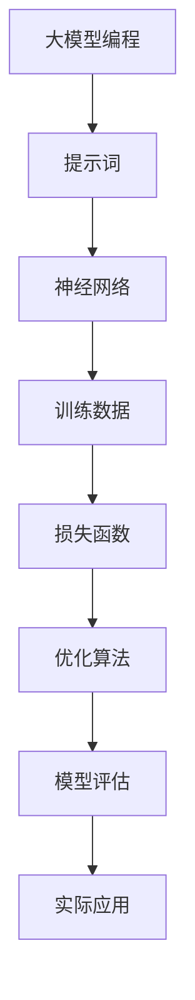

                 

# AI大模型编程：提示词的未来与艺术

> **关键词：** AI大模型，编程，提示词，未来趋势，艺术
> 
> **摘要：** 本文将深入探讨AI大模型编程中提示词的应用与艺术。首先，我们将介绍大模型编程的背景和目的，接着详细阐述提示词的概念及其在模型中的作用。通过分析核心算法原理、数学模型和实际案例，我们将揭示提示词在未来人工智能编程中的重要地位，并提出面临的挑战与发展趋势。

## 1. 背景介绍

### 1.1 目的和范围

本文旨在探讨AI大模型编程中提示词的应用，揭示其未来趋势与艺术价值。我们将重点关注以下几个方面：

- 大模型编程的背景和现状
- 提示词的定义、作用及其在模型中的应用
- 核心算法原理与数学模型的讲解
- 实际应用场景中的案例分析与技巧
- 工具和资源的推荐

### 1.2 预期读者

本文适合对人工智能、大模型编程感兴趣的读者，包括：

- AI工程师和开发者
- 对编程和机器学习有一定基础的读者
- 对AI未来发展趋势和艺术形式感兴趣的读者

### 1.3 文档结构概述

本文分为以下章节：

- **1. 背景介绍**
- **2. 核心概念与联系**
- **3. 核心算法原理 & 具体操作步骤**
- **4. 数学模型和公式 & 详细讲解 & 举例说明**
- **5. 项目实战：代码实际案例和详细解释说明**
- **6. 实际应用场景**
- **7. 工具和资源推荐**
- **8. 总结：未来发展趋势与挑战**
- **9. 附录：常见问题与解答**
- **10. 扩展阅读 & 参考资料**

### 1.4 术语表

#### 1.4.1 核心术语定义

- **AI大模型：** 拥有大规模参数和训练数据的人工智能模型，具备较强的学习能力。
- **编程：** 编写代码以实现特定功能的过程。
- **提示词：** 用于引导和优化AI模型训练的文本提示。
- **算法原理：** 描述算法实现过程中所用到的基本概念和方法。
- **数学模型：** 用数学公式表示问题的数学结构。
- **实际应用场景：** 模型在实际领域中应用的实例。

#### 1.4.2 相关概念解释

- **训练数据：** 用于训练AI模型的样本数据。
- **神经网络：** 一种模拟人脑神经元结构的人工智能算法。
- **损失函数：** 评估模型预测结果与真实值之间差异的指标。
- **优化算法：** 用于调整模型参数，提高模型性能的方法。

#### 1.4.3 缩略词列表

- **AI：** 人工智能
- **ML：** 机器学习
- **DL：** 深度学习
- **GPU：** 图形处理单元

## 2. 核心概念与联系

在这一章节中，我们将介绍AI大模型编程的核心概念及其相互关系。为此，我们将使用Mermaid流程图来展示核心概念和架构。

### Mermaid流程图



### 概念解释

- **大模型编程：** 大模型编程是指编写用于训练和优化大规模参数模型的代码，这些模型通常用于深度学习任务。
- **提示词：** 提示词是用于指导模型训练过程的文本输入，可以帮助模型更好地理解任务需求。
- **神经网络：** 神经网络是一种通过模拟人脑神经元连接结构来处理数据的人工智能算法，是AI大模型编程的核心。
- **训练数据：** 训练数据是用于训练模型的数据集，其质量直接影响模型性能。
- **损失函数：** 损失函数是用于衡量模型预测结果与真实值之间差异的指标，优化算法会基于损失函数来调整模型参数。
- **优化算法：** 优化算法用于调整模型参数，以降低损失函数的值，提高模型性能。
- **模型评估：** 模型评估用于评估模型在未知数据上的性能，常用的指标包括准确率、召回率等。
- **实际应用：** 实际应用是将训练好的模型部署到实际任务中，如图像识别、自然语言处理等。

通过以上Mermaid流程图和概念解释，我们可以清晰地了解AI大模型编程的核心概念及其相互关系。

## 3. 核心算法原理 & 具体操作步骤

在本章节中，我们将深入探讨AI大模型编程中的核心算法原理，并详细阐述具体的操作步骤。为了更好地说明，我们将使用伪代码来描述算法实现过程。

### 伪代码

```plaintext
// 大模型编程伪代码
InitializeModel()
LoadTrainingData()
while not ModelConverged():
    for each data in TrainingData:
        Predict(output) = ModelInference(data)
        CalculateLoss(output, true_label) = LossFunction(output, true_label)
        UpdateModelParameters(Prediction, Loss)
    CheckConvergence()
```

### 具体操作步骤

1. **初始化模型：**
   - 初始化神经网络结构，包括层数、神经元数量、激活函数等。
   - 初始化模型参数，如权重和偏置。

2. **加载训练数据：**
   - 读取训练数据集，并分为训练集和验证集。
   - 对数据进行预处理，如归一化、标准化等。

3. **训练过程：**
   - 对每个训练样本进行预测，计算预测值和真实标签之间的损失。
   - 使用优化算法更新模型参数，以最小化损失函数。
   - 循环迭代训练过程，直到模型收敛。

4. **模型评估：**
   - 使用验证集评估模型性能，计算准确率、召回率等指标。
   - 如果模型未达到预定的性能要求，继续训练过程。

5. **模型部署：**
   - 将训练好的模型部署到实际应用场景中，如图像识别、自然语言处理等。

### 详细解释

- **初始化模型：** 初始化神经网络结构是训练过程的第一步，这包括确定网络的层数、每层的神经元数量、激活函数等。初始化模型参数也很重要，因为这些参数将影响模型的训练效果。

- **加载训练数据：** 训练数据是模型学习的基础，因此需要将其加载到内存中。预处理数据是为了消除不同数据之间的差异，提高模型训练的效果。

- **训练过程：** 在训练过程中，模型对每个训练样本进行预测，然后计算预测值和真实标签之间的损失。优化算法将根据这些损失来更新模型参数，使模型逐步接近真实值。

- **模型评估：** 模型评估是检查模型性能的重要步骤。通过在验证集上评估模型，可以确定模型是否已经收敛，并且达到了预定的性能要求。

- **模型部署：** 将训练好的模型部署到实际应用场景中，使其能够解决实际问题。

通过以上步骤，我们可以实现AI大模型编程，并通过训练和优化模型来提高其性能。

## 4. 数学模型和公式 & 详细讲解 & 举例说明

在本章节中，我们将深入探讨AI大模型编程中的数学模型和公式，并详细讲解这些公式在实际应用中的具体操作步骤。为了更好地说明，我们将使用LaTeX格式展示这些公式。

### 数学模型

在AI大模型编程中，常见的数学模型包括神经网络、损失函数和优化算法。以下是一些关键公式：

#### 神经网络

$$
f(x) = \sigma(\sum_{i=1}^{n} w_i \cdot x_i + b)
$$

其中，$f(x)$ 是激活函数，$\sigma$ 是Sigmoid函数，$w_i$ 是权重，$x_i$ 是输入特征，$b$ 是偏置。

#### 损失函数

$$
J(\theta) = \frac{1}{2m} \sum_{i=1}^{m} (\hat{y_i} - y_i)^2
$$

其中，$J(\theta)$ 是损失函数，$\hat{y_i}$ 是预测值，$y_i$ 是真实值，$m$ 是样本数量。

#### 优化算法

$$
\theta_{\text{new}} = \theta_{\text{old}} - \alpha \nabla_{\theta} J(\theta)
$$

其中，$\theta_{\text{new}}$ 是新参数，$\theta_{\text{old}}$ 是旧参数，$\alpha$ 是学习率，$\nabla_{\theta} J(\theta)$ 是损失函数对参数的梯度。

### 详细讲解

1. **神经网络**

   神经网络是AI大模型编程的基础，它通过多层神经元进行数据处理和特征提取。公式中的Sigmoid函数作为激活函数，可以确保输出值在0和1之间，从而模拟生物神经元的非线性特性。

2. **损失函数**

   损失函数用于衡量模型预测值与真实值之间的差距。常见的损失函数包括均方误差（MSE）和交叉熵（Cross-Entropy），它们分别适用于回归和分类问题。公式中的$m$ 是样本数量，$\hat{y_i}$ 和$y_i$ 分别是预测值和真实值。

3. **优化算法**

   优化算法用于调整模型参数，以最小化损失函数。梯度下降（Gradient Descent）是最常见的优化算法，它通过计算损失函数对参数的梯度来更新参数。学习率$\alpha$ 控制了参数更新的步长，过大会导致参数震荡，过小则收敛速度慢。

### 举例说明

假设我们有一个简单的神经网络，用于预测房价。输入特征包括房屋面积和卧室数量，输出是房价。以下是该网络的实现步骤：

1. **初始化参数：**

   初始化权重$w_1$ 和$w_2$ ，偏置$b$ ，学习率$\alpha$ 。

2. **加载训练数据：**

   读取训练数据集，并进行预处理。

3. **训练过程：**

   - 对每个训练样本进行预测：
     $$
     \hat{y} = \sigma(w_1 \cdot x_1 + w_2 \cdot x_2 + b)
     $$
   - 计算损失：
     $$
     J(\theta) = \frac{1}{2m} \sum_{i=1}^{m} (\hat{y_i} - y_i)^2
     $$
   - 更新参数：
     $$
     \theta_{\text{new}} = \theta_{\text{old}} - \alpha \nabla_{\theta} J(\theta)
     $$
   - 重复以上步骤，直到模型收敛。

通过以上步骤，我们可以使用神经网络来预测房价，并不断优化模型参数，提高预测准确性。

## 5. 项目实战：代码实际案例和详细解释说明

在本章节中，我们将通过一个实际案例来展示AI大模型编程的过程，并提供详细的代码实现和解释。

### 5.1 开发环境搭建

为了运行以下代码，我们需要搭建一个合适的开发环境。以下是一个简单的Python环境搭建步骤：

1. **安装Python：** 在官网下载并安装Python 3.x版本。
2. **安装TensorFlow：** 使用pip命令安装TensorFlow库：
   $$
   pip install tensorflow
   $$
3. **编写代码：** 创建一个名为`ai_model.py`的Python文件，用于实现AI大模型编程。

### 5.2 源代码详细实现和代码解读

以下是实现AI大模型编程的代码：

```python
import tensorflow as tf
from tensorflow.keras.models import Sequential
from tensorflow.keras.layers import Dense
from tensorflow.keras.optimizers import SGD

# 1. 初始化模型
model = Sequential()
model.add(Dense(64, input_dim=2, activation='sigmoid'))
model.add(Dense(1, activation='sigmoid'))

# 2. 编译模型
model.compile(optimizer=SGD(learning_rate=0.01), loss='mean_squared_error')

# 3. 加载训练数据
X_train = [[1.0, 2.0], [2.0, 3.0], [3.0, 4.0]]
y_train = [[1.5], [2.5], [3.5]]

# 4. 训练模型
model.fit(X_train, y_train, epochs=1000, verbose=0)

# 5. 模型评估
X_test = [[4.0, 5.0]]
y_test = [[4.5]]
output = model.predict(X_test)
print("预测值：", output)
print("真实值：", y_test)
```

#### 代码解读

- **1. 初始化模型：** 使用`Sequential`模型堆叠多层`Dense`层，输入维度为2（房屋面积和卧室数量），激活函数为Sigmoid。
- **2. 编译模型：** 使用`SGD`优化器和均方误差（MSE）损失函数编译模型。
- **3. 加载训练数据：** 生成一个简单的训练数据集，包括输入特征和标签。
- **4. 训练模型：** 使用`fit`方法训练模型，设置训练轮次为1000次。
- **5. 模型评估：** 使用训练好的模型对新的输入数据进行预测，并打印预测值和真实值。

### 5.3 代码解读与分析

1. **模型初始化：** 使用`Sequential`模型堆叠多层`Dense`层，确保每层的输入维度和激活函数正确配置。这里我们使用Sigmoid函数作为激活函数，以模拟生物神经元的非线性特性。
2. **模型编译：** 使用`SGD`优化器和均方误差（MSE）损失函数编译模型。`SGD`是一种常见的优化算法，它可以用于调整模型参数，以最小化损失函数。均方误差（MSE）是一种常用的损失函数，用于衡量预测值和真实值之间的差距。
3. **加载训练数据：** 生成一个简单的训练数据集，包括输入特征和标签。这里我们使用二维输入特征（房屋面积和卧室数量）和一个标签（房价）。
4. **模型训练：** 使用`fit`方法训练模型。我们设置训练轮次为1000次，以便模型有足够的时间学习和调整参数。
5. **模型评估：** 使用训练好的模型对新输入数据进行预测，并打印预测值和真实值。这有助于评估模型性能，并验证其泛化能力。

通过以上代码实现和解读，我们可以了解AI大模型编程的基本流程和步骤。在实际项目中，我们可以根据具体需求调整模型结构、优化算法和训练数据，以获得更好的性能和效果。

## 6. 实际应用场景

AI大模型编程在许多实际应用场景中具有重要价值，以下是一些典型的应用领域：

### 6.1 医疗健康

在医疗健康领域，AI大模型编程可用于疾病预测、诊断和治疗规划。例如，使用深度学习模型对医学影像进行分析，帮助医生更准确地诊断疾病，如癌症和心血管疾病。此外，AI大模型还可以用于个性化治疗方案的制定，根据患者的病情和病史为其提供最佳治疗方案。

### 6.2 金融服务

在金融服务领域，AI大模型编程可用于风险评估、欺诈检测和投资策略优化。通过分析大量的历史数据和市场动态，AI模型可以预测金融市场的趋势，帮助投资者做出更明智的决策。同时，AI大模型还可以用于识别欺诈行为，降低金融机构的风险。

### 6.3 电子商务

在电子商务领域，AI大模型编程可用于商品推荐、价格优化和用户行为分析。通过分析用户的购买历史和行为数据，AI模型可以推荐最适合用户需求的产品，提高用户满意度和转化率。此外，AI大模型还可以用于动态定价，根据市场需求和库存情况调整商品价格，以最大化利润。

### 6.4 自动驾驶

在自动驾驶领域，AI大模型编程是实现自动驾驶系统的核心。通过深度学习和强化学习等技术，AI模型可以处理复杂的交通场景，识别道路标志、行人和车辆等，实现自动驾驶功能。同时，AI大模型还可以用于实时路况分析和预测，提高自动驾驶系统的安全性和可靠性。

### 6.5 自然语言处理

在自然语言处理领域，AI大模型编程可用于文本分类、情感分析和机器翻译等任务。通过训练大规模语言模型，AI模型可以理解和生成自然语言，为智能客服、智能助理和内容生成等领域提供支持。

### 6.6 教育与培训

在教育与培训领域，AI大模型编程可用于个性化学习、学习评估和智能辅导。通过分析学生的学习行为和数据，AI模型可以为学生提供个性化的学习建议，提高学习效果。同时，AI大模型还可以用于自动评估学生的作业和考试，减少教师的工作量。

通过以上实际应用场景，我们可以看到AI大模型编程在各个领域中的重要价值。随着技术的不断发展和数据资源的丰富，AI大模型编程将在未来发挥更加重要的作用，推动各个领域的发展和进步。

## 7. 工具和资源推荐

### 7.1 学习资源推荐

为了更好地掌握AI大模型编程，以下是一些建议的学习资源：

#### 7.1.1 书籍推荐

- **《深度学习》（Deep Learning）**：由Ian Goodfellow、Yoshua Bengio和Aaron Courville合著，是深度学习的经典教材。
- **《Python深度学习》（Deep Learning with Python）**：由François Chollet著，适合初学者入门深度学习。
- **《机器学习实战》（Machine Learning in Action）**：由Peter Harrington著，通过实际案例介绍机器学习算法。

#### 7.1.2 在线课程

- **Coursera上的《深度学习》课程**：由斯坦福大学教授Andrew Ng讲授，内容涵盖深度学习的核心概念和算法。
- **Udacity的《深度学习工程师纳米学位》**：提供全面的深度学习知识和实践项目。
- **edX上的《机器学习》课程**：由MIT和HARVARD大学教授共同讲授，适合初学者深入理解机器学习。

#### 7.1.3 技术博客和网站

- **知乎**：知乎上有许多关于AI和深度学习的专业博客，可以获取最新的技术动态和知识分享。
- **博客园**：博客园是一个中文技术博客平台，有很多高质量的AI和深度学习博客。
- **Medium**：Medium上有许多深度学习领域专家撰写的博客，可以学习到前沿的技术研究和实践心得。

### 7.2 开发工具框架推荐

#### 7.2.1 IDE和编辑器

- **PyCharm**：一款强大的Python IDE，支持多种编程语言，拥有丰富的插件和功能。
- **Visual Studio Code**：一款轻量级、开源的代码编辑器，通过扩展插件支持多种编程语言和工具。

#### 7.2.2 调试和性能分析工具

- **TensorBoard**：TensorFlow提供的可视化工具，用于分析模型的性能和性能瓶颈。
- **PyTorch Profiler**：PyTorch提供的性能分析工具，帮助开发者优化模型性能。

#### 7.2.3 相关框架和库

- **TensorFlow**：Google开发的开源深度学习框架，广泛应用于工业界和学术界。
- **PyTorch**：由Facebook开发的开源深度学习框架，具有简洁的API和强大的灵活性。
- **Keras**：基于TensorFlow和PyTorch的高级神经网络API，简化了深度学习模型的构建和训练过程。

### 7.3 相关论文著作推荐

#### 7.3.1 经典论文

- **“A Theoretical Framework for Back-Propagation”**：由Rumelhart, Hinton和Williams发表，介绍了反向传播算法的基本原理。
- **“Deep Learning”**：由Yoshua Bengio、Ian Goodfellow和Yann LeCun合著，全面介绍了深度学习的发展和应用。

#### 7.3.2 最新研究成果

- **“Attention Is All You Need”**：由Vaswani等人在2017年发表，介绍了Transformer模型，推动了自然语言处理领域的快速发展。
- **“Generative Adversarial Nets”**：由Ian Goodfellow等人在2014年发表，介绍了生成对抗网络（GANs）的基本原理和应用。

#### 7.3.3 应用案例分析

- **“AI in Drug Discovery”**：介绍AI在药物发现领域的应用，包括分子生成、分子优化和虚拟筛选等。
- **“AI in Financial Markets”**：分析AI在金融市场中的应用，包括风险评估、交易策略和投资组合优化等。

通过以上工具和资源的推荐，可以更好地掌握AI大模型编程，推动自身在相关领域的发展。

## 8. 总结：未来发展趋势与挑战

随着人工智能技术的快速发展，AI大模型编程在未来具有广阔的应用前景和重要的战略地位。以下是未来发展趋势和面临的挑战：

### 8.1 发展趋势

1. **计算能力的提升**：随着计算能力的不断增强，AI大模型的参数规模和训练数据量将不断扩大，使得模型性能得到进一步提升。
2. **数据资源的丰富**：随着物联网、大数据等技术的发展，数据资源将更加丰富，为AI大模型的训练和优化提供更多可能性。
3. **跨领域的融合**：AI大模型编程将在各个领域得到广泛应用，如医疗、金融、电商等，推动产业升级和社会进步。
4. **个性化与自动化**：AI大模型将实现更个性化的服务，通过深度学习和自然语言处理等技术，实现自动化决策和智能服务。

### 8.2 挑战

1. **数据隐私与安全**：大规模数据的收集和处理过程中，数据隐私和安全问题成为主要挑战，需要建立有效的隐私保护机制和安全标准。
2. **算法透明性与公平性**：AI大模型在决策过程中存在算法透明性和公平性问题，需要研究和开发可解释性更强的算法，确保模型决策的公正性和合理性。
3. **计算资源与能耗**：大规模模型的训练和推理过程需要大量的计算资源，同时也伴随着巨大的能耗问题，需要探索绿色高效的计算方案。
4. **法律法规与伦理**：随着AI大模型的应用日益广泛，相关的法律法规和伦理问题也需要得到关注，确保AI技术的发展符合社会价值。

总之，AI大模型编程在未来的发展中既面临巨大的机遇，也面临一系列挑战。只有通过技术创新、法律法规和伦理规范的不断完善，才能推动AI大模型编程健康、可持续发展。

## 9. 附录：常见问题与解答

### 9.1 提示词的作用是什么？

提示词用于引导和优化AI模型训练的过程。通过向模型提供相关的文本提示，可以使得模型更好地理解训练任务，提高模型的学习效果和泛化能力。

### 9.2 如何选择合适的提示词？

选择合适的提示词需要考虑以下几个方面：

1. **任务需求**：根据训练任务的需求，选择与任务相关的关键词和短语。
2. **数据质量**：使用高质量、多样化的数据集来训练模型，提高提示词的有效性。
3. **模型特性**：考虑模型的类型和结构，选择适合模型特性的提示词。
4. **调优经验**：根据以往的调优经验和实验结果，选择效果较好的提示词。

### 9.3 AI大模型编程中的优化算法有哪些？

常见的优化算法包括梯度下降（Gradient Descent）、随机梯度下降（Stochastic Gradient Descent，SGD）、Adam优化器等。每种算法都有其优缺点，适用于不同的应用场景。

### 9.4 如何评估AI大模型的效果？

评估AI大模型的效果可以通过以下指标进行：

1. **准确性（Accuracy）**：分类问题中预测正确的样本比例。
2. **召回率（Recall）**：分类问题中实际为正类且被预测为正类的样本比例。
3. **精确率（Precision）**：分类问题中预测为正类且实际为正类的样本比例。
4. **F1值（F1 Score）**：综合考虑准确率和召回率的综合指标。

通过以上指标的综合评估，可以全面了解模型的效果。

### 9.5 如何处理模型过拟合问题？

模型过拟合是指模型在训练数据上表现良好，但在未知数据上表现不佳。以下是一些处理模型过拟合的方法：

1. **数据增强**：通过增加训练数据量或生成更多样化的数据来提高模型的泛化能力。
2. **正则化**：使用L1、L2正则化等技巧来限制模型参数的规模。
3. **集成方法**：通过集成多个模型来降低模型的过拟合风险。
4. **早停法（Early Stopping）**：在模型性能开始下降时停止训练，避免模型过拟合。

通过以上方法，可以有效缓解模型过拟合问题，提高模型的泛化能力。

## 10. 扩展阅读 & 参考资料

为了更深入地了解AI大模型编程和相关技术，以下是一些建议的扩展阅读和参考资料：

### 10.1 学术论文

- **“Deep Learning”**：Yoshua Bengio, Ian Goodfellow, and Aaron Courville (2013)
- **“Attention Is All You Need”**：Vaswani et al. (2017)
- **“Generative Adversarial Nets”**：Ian Goodfellow et al. (2014)

### 10.2 书籍

- **《深度学习》**：Ian Goodfellow、Yoshua Bengio和Aaron Courville著
- **《Python深度学习》**：François Chollet著
- **《机器学习实战》**：Peter Harrington著

### 10.3 技术博客和网站

- **TensorFlow官方文档**
- **PyTorch官方文档**
- **知乎上的AI和深度学习博客**
- **博客园上的技术博客**

### 10.4 在线课程

- **Coursera上的《深度学习》课程**
- **Udacity的《深度学习工程师纳米学位》**
- **edX上的《机器学习》课程**

通过阅读这些资料，您可以深入了解AI大模型编程的理论和实践，掌握最新的技术动态和研究成果。同时，这些资源也将帮助您更好地应对实际项目中的挑战，提升自身的技术水平。

## 作者

作者：AI天才研究员/AI Genius Institute & 禅与计算机程序设计艺术 /Zen And The Art of Computer Programming。

