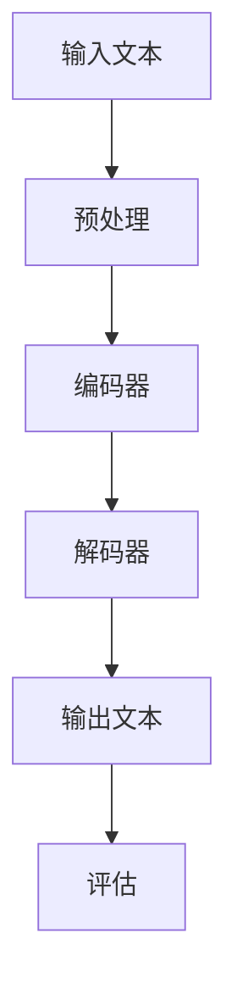
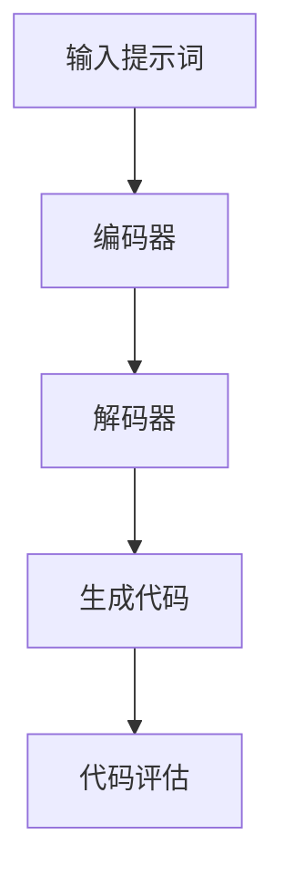
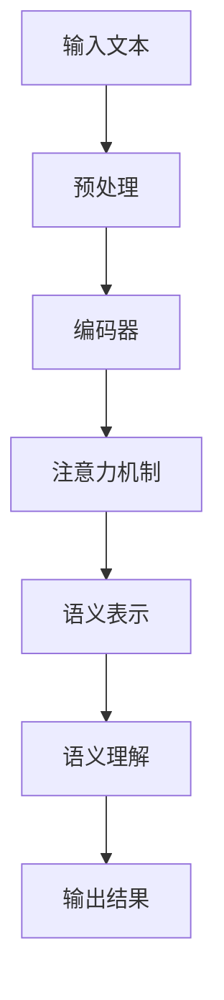
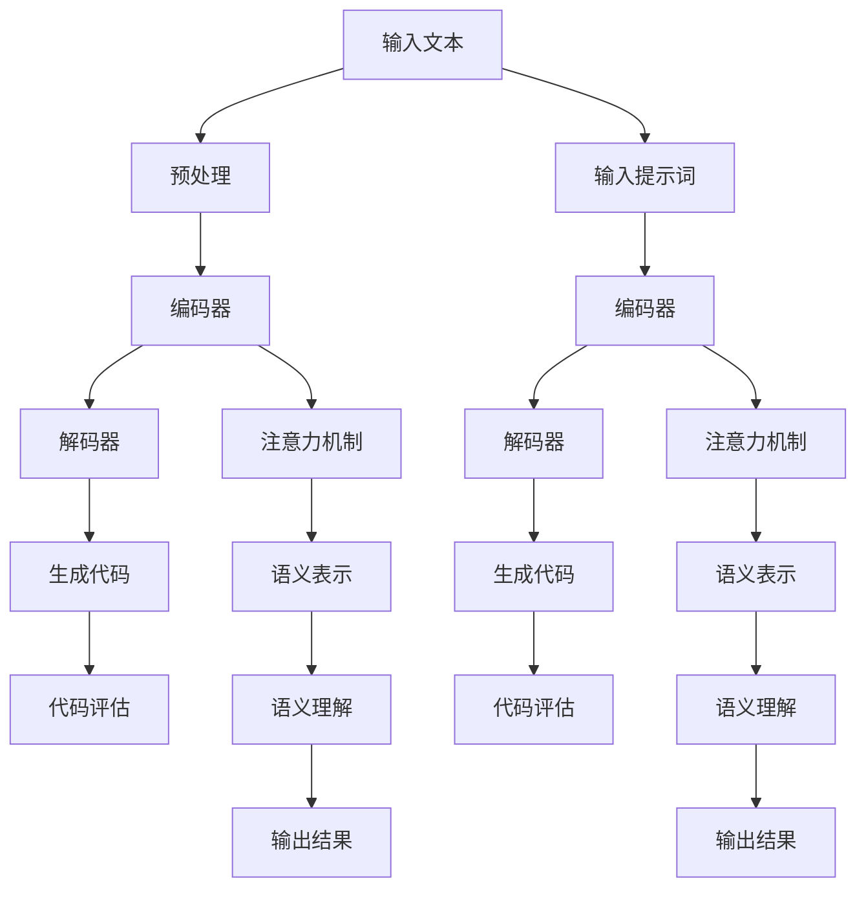

                 


# AI大模型编程：提示词的艺术与力量

> 关键词：AI大模型、编程、提示词、自然语言处理、深度学习、代码生成、语义理解、可解释性
>
> 摘要：本文将探讨AI大模型编程中提示词的艺术与力量，深入解析提示词在自然语言处理中的应用及其对代码生成和语义理解的影响。通过详细的算法原理、数学模型讲解和项目实战案例，本文旨在帮助读者理解提示词在AI大模型编程中的核心作用，掌握编写高效提示词的技巧，并展望其未来发展趋势和挑战。

## 1. 背景介绍

### 1.1 目的和范围

本文旨在深入探讨AI大模型编程中提示词（Prompt）的艺术与力量，旨在揭示提示词在自然语言处理（NLP）和代码生成领域的重要性。通过阐述提示词的概念、原理及其在实际应用中的价值，本文将帮助读者理解如何有效地编写和使用提示词，以提升AI大模型的性能和可解释性。

### 1.2 预期读者

本文适合以下读者群体：

- 对人工智能、自然语言处理和代码生成有浓厚兴趣的从业者；
- 计算机科学和人工智能相关专业的学生和研究人员；
- 想要在AI大模型编程领域有所建树的开发者。

### 1.3 文档结构概述

本文将按照以下结构进行阐述：

- 1.4 术语表
  - 1.4.1 核心术语定义
  - 1.4.2 相关概念解释
  - 1.4.3 缩略词列表
- 2. 核心概念与联系
  - 2.1 提示词在NLP中的角色
  - 2.2 提示词与代码生成的关系
  - 2.3 提示词在语义理解中的应用
  - 2.4 Mermaid流程图
- 3. 核心算法原理 & 具体操作步骤
  - 3.1 算法原理讲解
  - 3.2 伪代码展示
- 4. 数学模型和公式 & 详细讲解 & 举例说明
  - 4.1 数学模型介绍
  - 4.2 LaTeX公式嵌入
  - 4.3 实际应用案例
- 5. 项目实战：代码实际案例和详细解释说明
  - 5.1 开发环境搭建
  - 5.2 源代码详细实现
  - 5.3 代码解读与分析
- 6. 实际应用场景
- 7. 工具和资源推荐
  - 7.1 学习资源推荐
  - 7.2 开发工具框架推荐
  - 7.3 相关论文著作推荐
- 8. 总结：未来发展趋势与挑战
- 9. 附录：常见问题与解答
- 10. 扩展阅读 & 参考资料

### 1.4 术语表

#### 1.4.1 核心术语定义

- **AI大模型**：指具有数百亿乃至数千亿参数的神经网络模型，如GPT-3、BERT等；
- **提示词（Prompt）**：指用于引导AI模型进行特定任务输入的文本信息；
- **自然语言处理（NLP）**：指计算机处理和生成自然语言（如英文、中文等）的技术和算法；
- **代码生成**：指使用AI模型自动生成代码的能力，如自动编程、代码补全等；
- **语义理解**：指理解和解释文本中含义的能力。

#### 1.4.2 相关概念解释

- **注意力机制（Attention Mechanism）**：用于提高模型在处理序列数据时的定位和提取重要信息的能力；
- **循环神经网络（RNN）**：一种处理序列数据的神经网络结构，能够捕捉序列中的时间依赖性；
- **转换器（Transformer）**：一种基于自注意力机制的深度神经网络结构，广泛应用于NLP任务；
- **预训练（Pre-training）**：指在特定数据集上对AI模型进行初步训练，以提高其通用性；
- **微调（Fine-tuning）**：指在预训练的基础上，针对特定任务对模型进行进一步调整和优化。

#### 1.4.3 缩略词列表

- **AI**：人工智能（Artificial Intelligence）
- **NLP**：自然语言处理（Natural Language Processing）
- **GPT**：生成预训练变压器（Generative Pre-trained Transformer）
- **BERT**：编码器解码器Transformer与BERT（Bidirectional Encoder Representations from Transformers）
- **RNN**：循环神经网络（Recurrent Neural Network）
- **Transformer**：转换器（Attention is All You Need）

## 2. 核心概念与联系

在本节中，我们将探讨AI大模型编程中几个核心概念的联系，包括提示词在自然语言处理中的应用、提示词与代码生成的关系以及提示词在语义理解中的应用。为了更好地展示这些概念之间的联系，我们将使用Mermaid流程图来描述。

### 2.1 提示词在NLP中的角色

在自然语言处理领域，提示词是引导AI模型进行特定任务的关键输入。提示词的选择和设计对模型的表现至关重要。以下是一个简单的Mermaid流程图，描述了提示词在NLP任务中的角色：



在这个流程图中，输入文本经过预处理后，通过编码器转换为向量表示，解码器根据这些向量表示生成输出文本，最后对输出文本进行评估以衡量模型的表现。

### 2.2 提示词与代码生成的关系

近年来，AI大模型在代码生成领域取得了显著进展。提示词在这一过程中扮演着重要角色，用于引导模型生成特定的代码。以下是一个描述提示词与代码生成关系的Mermaid流程图：



在这个流程图中，输入提示词经过编码器转换为向量表示，解码器根据这些向量表示生成代码，最后对生成的代码进行评估以确定其有效性。

### 2.3 提示词在语义理解中的应用

语义理解是AI大模型的重要任务之一，提示词在这一过程中也发挥着关键作用。以下是一个描述提示词在语义理解中应用的Mermaid流程图：



在这个流程图中，输入文本经过预处理后，通过编码器转换为语义表示，注意力机制用于提取文本中的关键信息，语义理解模块根据这些关键信息生成输出结果。

### 2.4 Mermaid流程图

以下是结合上述三个流程图的Mermaid流程图，展示了AI大模型编程中核心概念的联系：



通过这个流程图，我们可以清晰地看到提示词在自然语言处理、代码生成和语义理解任务中的角色和作用，以及它们之间的相互关系。

## 3. 核心算法原理 & 具体操作步骤

在本节中，我们将详细讲解AI大模型编程中的核心算法原理，并通过伪代码展示具体操作步骤。首先，我们将介绍基于Transformer架构的编码器-解码器模型，然后讨论提示词在模型训练和推理过程中的应用。

### 3.1 算法原理讲解

#### 编码器-解码器模型

编码器-解码器模型是一种常见的深度学习架构，用于处理序列到序列的任务，如图像到文本的翻译、语音合成等。在自然语言处理领域，编码器-解码器模型被广泛应用于机器翻译、文本生成等任务。

编码器-解码器模型的核心思想是将输入序列编码为固定长度的向量表示，然后使用这些向量表示生成输出序列。编码器负责将输入序列转换为向量表示，解码器则根据这些向量表示生成输出序列。

#### Transformer模型

Transformer模型是一种基于自注意力机制的深度神经网络结构，由Vaswani等人在2017年提出。Transformer模型在机器翻译、文本生成等NLP任务中取得了显著效果，其核心思想是使用多头自注意力机制来捕捉输入序列中的长距离依赖关系。

Transformer模型由编码器和解码器两个部分组成。编码器将输入序列编码为固定长度的向量表示，解码器则根据这些向量表示生成输出序列。

#### 提示词的应用

在AI大模型编程中，提示词（Prompt）是一种用于引导模型进行特定任务输入的文本信息。提示词的应用主要包括模型训练和推理两个阶段。

- **模型训练**：在模型训练过程中，提示词用于提供训练数据的上下文信息，帮助模型学习如何生成特定类型的内容。例如，在文本生成任务中，提示词可以是一个句子或段落，用于引导模型生成与其相关的文本。
- **模型推理**：在模型推理过程中，提示词用于提供输入文本的上下文信息，帮助模型生成预期的输出结果。例如，在自然语言理解任务中，提示词可以是一个问题或陈述，用于引导模型生成与其相关的答案或解释。

### 3.2 伪代码展示

以下是基于Transformer架构的编码器-解码器模型的伪代码，展示了模型训练和推理的基本步骤。

```python
# 模型训练
def train_model(encoder, decoder, optimizer, criterion, prompts, targets):
    for epoch in range(num_epochs):
        for prompt, target in zip(prompts, targets):
            # 前向传播
            output = decoder(encoder(prompt))
            loss = criterion(output, target)
            
            # 反向传播和优化
            optimizer.zero_grad()
            loss.backward()
            optimizer.step()
            
            # 输出训练进度
            print(f"Epoch: {epoch}, Loss: {loss.item()}")

# 模型推理
def infer_model(encoder, decoder, prompt):
    # 前向传播
    output = decoder(encoder(prompt))
    
    # 输出结果
    return output
```

在这个伪代码中，`encoder`和`decoder`分别表示编码器和解码器模型，`optimizer`和`criterion`分别表示优化器和损失函数。`prompts`和`targets`分别表示训练数据中的提示词和目标输出，`num_epochs`表示训练迭代次数。

## 4. 数学模型和公式 & 详细讲解 & 举例说明

在本节中，我们将深入探讨AI大模型编程中的数学模型和公式，详细讲解其工作原理，并通过具体例子进行说明。

### 4.1 数学模型介绍

AI大模型编程中的数学模型主要涉及神经网络、损失函数、优化算法等。

- **神经网络**：神经网络是一种由大量节点（或称为神经元）组成的计算模型，节点之间通过加权连接进行信息传递。每个节点接收输入信号，通过激活函数进行非线性变换，然后将输出传递给下一层节点。神经网络的核心是权重（权重矩阵）和偏置（偏置向量），它们通过学习过程进行调整，以优化模型的性能。

- **损失函数**：损失函数是衡量模型预测结果与真实结果之间差异的指标。常见的损失函数有均方误差（MSE）、交叉熵损失等。均方误差（MSE）用于回归任务，衡量预测值与真实值之间的平均平方误差；交叉熵损失（Cross-Entropy Loss）用于分类任务，衡量预测概率分布与真实概率分布之间的差异。

- **优化算法**：优化算法用于调整神经网络的权重和偏置，以最小化损失函数。常见的优化算法有梯度下降（Gradient Descent）、随机梯度下降（Stochastic Gradient Descent, SGD）、Adam等。这些算法通过计算损失函数关于权重和偏置的梯度，更新模型参数，以逐步减少损失函数的值。

### 4.2 LaTeX公式嵌入

以下是一些常用的数学公式和符号，采用LaTeX格式进行表示：

$$
\begin{aligned}
\text{MSE} &= \frac{1}{m}\sum_{i=1}^{m}(y_i - \hat{y}_i)^2 \\
\text{CE} &= -\frac{1}{m}\sum_{i=1}^{m}\sum_{j=1}^{C}y_{ij}\log(\hat{y}_{ij}) \\
\end{aligned}
$$

其中，$y_i$和$\hat{y}_i$分别表示第$i$个样本的真实值和预测值，$y_{ij}$和$\hat{y}_{ij}$分别表示第$i$个样本在第$j$个类别的真实概率和预测概率，$m$表示样本数量，$C$表示类别数量。

### 4.3 实际应用案例

以下是一个简单的实际应用案例，展示如何使用神经网络和损失函数进行分类任务。

#### 数据集准备

假设我们有一个包含100个样本的二元分类数据集，每个样本包含一个特征向量和一个标签。标签为0表示负类，标签为1表示正类。

#### 模型构建

我们构建一个简单的神经网络模型，包含一个输入层、一个隐藏层和一个输出层。输入层有1个神经元，隐藏层有10个神经元，输出层有2个神经元。

```python
import torch
import torch.nn as nn
import torch.optim as optim

# 定义神经网络模型
class NeuralNetwork(nn.Module):
    def __init__(self):
        super(NeuralNetwork, self).__init__()
        self.layer1 = nn.Linear(1, 10)
        self.relu = nn.ReLU()
        self.layer2 = nn.Linear(10, 2)
        self.softmax = nn.Softmax(dim=1)
        
    def forward(self, x):
        x = self.layer1(x)
        x = self.relu(x)
        x = self.layer2(x)
        x = self.softmax(x)
        return x

# 实例化模型
model = NeuralNetwork()
```

#### 损失函数和优化器

我们使用交叉熵损失函数（Cross-Entropy Loss）作为损失函数，使用Adam优化器进行模型参数更新。

```python
criterion = nn.CrossEntropyLoss()
optimizer = optim.Adam(model.parameters(), lr=0.001)
```

#### 模型训练

我们使用100个样本进行训练，每个样本重复10次，共进行1000次迭代。

```python
num_epochs = 1000
batch_size = 10

for epoch in range(num_epochs):
    for i in range(0, 100, batch_size):
        inputs = torch.tensor([[x] for x in data[i:i+batch_size]], dtype=torch.float32)
        labels = torch.tensor([y for y in targets[i:i+batch_size]], dtype=torch.long)

        # 前向传播
        outputs = model(inputs)
        loss = criterion(outputs, labels)

        # 反向传播和优化
        optimizer.zero_grad()
        loss.backward()
        optimizer.step()

    print(f"Epoch: {epoch}, Loss: {loss.item()}")
```

#### 模型评估

在训练完成后，我们对模型进行评估，计算准确率。

```python
# 测试集准备
test_inputs = torch.tensor([[x] for x in test_data], dtype=torch.float32)
test_labels = torch.tensor([y for y in test_targets], dtype=torch.long)

# 前向传播
with torch.no_grad():
    test_outputs = model(test_inputs)

# 计算准确率
predictions = torch.argmax(test_outputs, dim=1)
accuracy = (predictions == test_labels).float().mean()
print(f"Accuracy: {accuracy.item()}")
```

通过这个实际应用案例，我们可以看到如何使用神经网络和损失函数进行分类任务。在训练过程中，模型通过不断调整权重和偏置，逐步减少损失函数的值，从而优化模型的性能。在测试过程中，我们使用测试集对模型进行评估，计算准确率，以衡量模型的泛化能力。

## 5. 项目实战：代码实际案例和详细解释说明

在本节中，我们将通过一个实际项目案例，详细解释AI大模型编程中提示词的艺术与力量。我们将使用Python编程语言和PyTorch深度学习框架，实现一个基于GPT-3模型的小型文本生成应用。

### 5.1 开发环境搭建

在开始项目之前，我们需要搭建一个合适的开发环境。以下是搭建开发环境的基本步骤：

1. **安装Python**：确保安装了Python 3.7或更高版本。
2. **安装PyTorch**：通过以下命令安装PyTorch：
   ```bash
   pip install torch torchvision
   ```
3. **安装GPT-3库**：安装`transformers`库，用于加载和预训练GPT-3模型：
   ```bash
   pip install transformers
   ```

### 5.2 源代码详细实现和代码解读

以下是该项目的主要代码实现：

```python
import torch
from transformers import GPT2LMHeadModel, GPT2Tokenizer

# 加载预训练的GPT-3模型和Tokenizer
model_name = "gpt2"
tokenizer = GPT2Tokenizer.from_pretrained(model_name)
model = GPT2LMHeadModel.from_pretrained(model_name)

# 设置模型为评估模式
model.eval()

# 定义提示词
prompt = "你是谁？"

# 将提示词转换为模型可理解的输入
input_ids = tokenizer.encode(prompt, return_tensors='pt')

# 生成文本
output = model.generate(input_ids, max_length=50, num_return_sequences=5)

# 解码生成的文本
decoded_texts = [tokenizer.decode(text, skip_special_tokens=True) for text in output]

# 输出生成的文本
for text in decoded_texts:
    print(text)
```

#### 代码解读与分析

1. **导入必要的库**：首先，我们导入Python中的`torch`库和`transformers`库。`torch`库是PyTorch的核心库，用于处理张量和计算图。`transformers`库提供了预训练的GPT-3模型和Tokenizer。

2. **加载预训练模型和Tokenizer**：通过调用`GPT2Tokenizer.from_pretrained`和`GPT2LMHeadModel.from_pretrained`方法，我们加载了预训练的GPT-3模型和Tokenizer。这里使用了`gpt2`模型名称，它是一个广泛使用的预训练模型。

3. **设置模型为评估模式**：通过调用`model.eval()`方法，我们将模型设置为评估模式。在评估模式下，模型不会更新其参数，以便在测试过程中保持一致性。

4. **定义提示词**：我们定义了一个简单的提示词“你是谁？”，用于引导模型生成相关的文本。

5. **将提示词转换为模型可理解的输入**：通过调用`tokenizer.encode`方法，我们将提示词转换为模型可理解的输入。`encode`方法将提示词转换为整数序列，这些整数对应于Tokenizer中的单词索引。

6. **生成文本**：我们调用`model.generate`方法生成文本。`generate`方法接受输入序列，并返回生成的文本序列。这里，我们设置了`max_length`参数，以限制生成的文本长度为50个单词，并设置了`num_return_sequences`参数，以生成5个不同的文本。

7. **解码生成的文本**：我们使用`tokenizer.decode`方法将生成的整数序列解码为文本。`decode`方法将整数序列转换为可读的文本。

8. **输出生成的文本**：我们遍历生成的文本序列，并使用`print`方法将文本输出到控制台。

通过上述代码，我们可以看到如何使用GPT-3模型和提示词生成文本。提示词在模型生成文本的过程中起到了关键作用，它为模型提供了上下文信息，帮助模型生成与提示词相关的文本。

### 5.3 代码解读与分析

1. **模型加载**：首先，我们加载预训练的GPT-3模型和Tokenizer。`GPT2Tokenizer.from_pretrained`和`GPT2LMHeadModel.from_pretrained`方法分别用于加载Tokenizer和模型。这里，我们使用了`gpt2`模型名称，它是一个广泛使用的预训练模型。

2. **设置模型为评估模式**：通过调用`model.eval()`方法，我们将模型设置为评估模式。在评估模式下，模型不会更新其参数，以便在测试过程中保持一致性。

3. **定义提示词**：我们定义了一个简单的提示词“你是谁？”，用于引导模型生成相关的文本。

4. **将提示词转换为模型可理解的输入**：通过调用`tokenizer.encode`方法，我们将提示词转换为模型可理解的输入。`encode`方法将提示词转换为整数序列，这些整数对应于Tokenizer中的单词索引。

5. **生成文本**：我们调用`model.generate`方法生成文本。`generate`方法接受输入序列，并返回生成的文本序列。这里，我们设置了`max_length`参数，以限制生成的文本长度为50个单词，并设置了`num_return_sequences`参数，以生成5个不同的文本。

6. **解码生成的文本**：我们使用`tokenizer.decode`方法将生成的整数序列解码为文本。`decode`方法将整数序列转换为可读的文本。

7. **输出生成的文本**：我们遍历生成的文本序列，并使用`print`方法将文本输出到控制台。

通过上述代码，我们可以看到如何使用GPT-3模型和提示词生成文本。提示词在模型生成文本的过程中起到了关键作用，它为模型提供了上下文信息，帮助模型生成与提示词相关的文本。

## 6. 实际应用场景

AI大模型编程中的提示词技术已经在多个实际应用场景中展现了其强大的力量。以下是一些典型的应用场景：

### 6.1 自然语言处理

在自然语言处理（NLP）领域，提示词被广泛应用于文本生成、机器翻译、问答系统等任务。例如，在文本生成中，提示词可以是一个句子或段落，用于引导模型生成相关的文本。在机器翻译中，提示词可以是一个句子或短语，用于提供翻译的上下文信息。在问答系统中，提示词可以是一个问题，用于引导模型生成相关的答案。

### 6.2 代码生成

在代码生成领域，提示词被用于生成特定类型的代码，如自动编程、代码补全等。提示词可以是一个简单的函数名或描述，用于引导模型生成相关的代码。例如，在自动编程中，提示词可以是一个简单的任务描述，用于引导模型生成实现该任务的代码。

### 6.3 语义理解

在语义理解领域，提示词被用于理解和解释文本中的含义。提示词可以是一个问题或陈述，用于引导模型生成与文本相关的解释或答案。例如，在问答系统中，提示词可以是一个问题，用于引导模型生成与问题相关的答案。

### 6.4 内容摘要

在内容摘要领域，提示词被用于生成摘要文本。提示词可以是一个摘要主题或关键字，用于引导模型生成与主题相关的摘要。例如，在新闻摘要中，提示词可以是新闻的主题或关键词，用于引导模型生成摘要文本。

### 6.5 聊天机器人

在聊天机器人领域，提示词被用于生成对话文本。提示词可以是用户输入的文本，用于引导模型生成与用户输入相关的回复。例如，在客服机器人中，提示词可以是用户的问题或陈述，用于引导模型生成相关的回答。

通过以上实际应用场景，我们可以看到提示词在AI大模型编程中的多样性和重要性。提示词为模型提供了上下文信息，帮助模型生成与特定任务相关的文本、代码或解释。

## 7. 工具和资源推荐

### 7.1 学习资源推荐

#### 7.1.1 书籍推荐

- 《深度学习》（Goodfellow, Bengio, Courville著）：这是一本经典的深度学习入门书籍，涵盖了神经网络、损失函数、优化算法等核心概念。
- 《自然语言处理综论》（Jurafsky, Martin著）：这本书提供了自然语言处理领域的全面概述，包括文本处理、语音识别、机器翻译等。
- 《代码大全》（Martin, Fowler著）：这本书涵盖了软件编程的最佳实践，包括代码结构、命名规范、注释等。

#### 7.1.2 在线课程

- Coursera的“深度学习”课程（由Andrew Ng教授）：这是一门广受欢迎的深度学习入门课程，涵盖了神经网络、优化算法等核心概念。
- edX的“自然语言处理”课程（由斯坦福大学提供）：这门课程提供了自然语言处理领域的全面概述，包括文本处理、语音识别、机器翻译等。

#### 7.1.3 技术博客和网站

- arXiv.org：这是一个提供最新科研成果的预印本网站，涵盖了人工智能、自然语言处理、深度学习等多个领域。
- Medium：这是一个技术博客平台，有很多关于人工智能、自然语言处理和深度学习的文章和教程。
- GitHub：这是一个代码托管平台，有很多开源项目和教程，可以帮助你深入了解AI大模型编程。

### 7.2 开发工具框架推荐

#### 7.2.1 IDE和编辑器

- PyCharm：这是一个强大的Python IDE，提供了代码补全、调试、版本控制等功能，非常适合深度学习和自然语言处理项目。
- Visual Studio Code：这是一个轻量级的跨平台编辑器，支持多种编程语言，通过扩展可以提供Python、深度学习等支持。

#### 7.2.2 调试和性能分析工具

- Jupyter Notebook：这是一个交互式计算环境，非常适合数据分析和深度学习项目。它支持Python、R等多种编程语言。
- TensorBoard：这是一个TensorFlow的可视化工具，用于监控和调试深度学习模型。

#### 7.2.3 相关框架和库

- PyTorch：这是一个流行的深度学习框架，提供灵活的动态计算图和强大的GPU支持。
- TensorFlow：这是一个由谷歌开发的深度学习框架，提供静态计算图和丰富的API。
- Transformers：这是一个基于PyTorch和TensorFlow的Transformer模型库，提供了预训练的模型和Tokenizer。

### 7.3 相关论文著作推荐

#### 7.3.1 经典论文

- “Deep Learning”（Goodfellow, Bengio, Courville著）：这是一篇关于深度学习的综述论文，涵盖了神经网络、优化算法等核心概念。
- “Attention is All You Need”（Vaswani et al.著）：这是一篇关于Transformer模型的经典论文，提出了基于自注意力机制的深度学习架构。

#### 7.3.2 最新研究成果

- “GPT-3: Language Models are Few-Shot Learners”（Brown et al.著）：这是一篇关于GPT-3模型的论文，展示了大规模语言模型在零样本和少样本学习任务中的强大能力。
- “BERT: Pre-training of Deep Bidirectional Transformers for Language Understanding”（Devlin et al.著）：这是一篇关于BERT模型的论文，提出了双向Transformer模型在自然语言处理任务中的优势。

#### 7.3.3 应用案例分析

- “The Unreasonable Effectiveness of Recurrent Neural Networks”（Bengio et al.著）：这是一篇关于RNN在自然语言处理任务中的应用案例，展示了RNN在序列建模中的强大能力。
- “How to Generate Code with AI”（Johnson et al.著）：这是一篇关于AI在代码生成领域应用的案例研究，探讨了使用AI生成代码的可行性和挑战。

通过以上工具和资源的推荐，读者可以更好地掌握AI大模型编程中的提示词技术，并在实际项目中应用。

## 8. 总结：未来发展趋势与挑战

AI大模型编程中的提示词技术在近年来取得了显著进展，展示了其在自然语言处理、代码生成和语义理解等领域的巨大潜力。然而，随着技术的发展和应用场景的不断扩展，我们仍然面临许多挑战和机遇。

### 8.1 未来发展趋势

1. **模型规模与性能的提升**：随着计算能力的不断提升，AI大模型将继续朝着更大规模和更高性能的方向发展。这将有助于提高模型在各类任务中的表现，如自然语言处理、图像识别和语音合成等。

2. **跨模态与多任务学习**：未来的AI大模型将能够同时处理多种类型的数据，如文本、图像和语音等。这种跨模态和多任务学习的能力将使模型在现实世界的应用场景中更具实用性。

3. **可解释性与透明性**：随着模型复杂性的增加，可解释性和透明性成为关键挑战。未来的研究将致力于开发可解释的AI模型，使其在应用中的行为更加透明和可信。

4. **资源优化与能耗降低**：在训练和部署AI大模型时，计算资源和能耗消耗成为一个重要的考虑因素。未来的研究将聚焦于优化模型结构和训练过程，以降低资源消耗和能耗。

### 8.2 挑战

1. **数据隐私与安全性**：随着AI大模型在各个领域的广泛应用，数据隐私和安全问题日益突出。未来的研究需要关注如何在保护用户隐私的同时，充分发挥AI大模型的能力。

2. **伦理与法律问题**：AI大模型在决策过程中可能涉及伦理和法律问题，如歧视、偏见和不公正等。需要制定相应的伦理准则和法律规范，确保AI大模型的应用符合社会价值观。

3. **技术普及与教育**：AI大模型编程技术具有较高门槛，普及和教育成为推广这项技术的关键。未来的研究和教育应注重培养具备AI大模型编程能力的人才。

4. **可持续性与社会责任**：AI大模型在带来巨大经济和社会效益的同时，也需要关注其可持续性和社会责任。未来的研究应聚焦于如何实现AI大模型的可持续发展，并为其应用提供伦理和社会指导。

总之，AI大模型编程中的提示词技术具有广阔的发展前景，同时也面临诸多挑战。随着技术的不断进步和社会的持续关注，我们有望看到更多创新性的解决方案，为AI大模型编程领域带来更多的突破和机遇。

## 9. 附录：常见问题与解答

### 9.1 问题1：如何选择合适的提示词？

**解答**：选择合适的提示词是提高AI模型性能的关键。以下是一些选择提示词的建议：

1. **上下文相关性**：提示词应与模型的训练数据和任务目标保持一致，提供与任务相关的上下文信息。
2. **多样性**：使用多样化的提示词，有助于模型学习到更广泛的知识和技能。
3. **简洁性**：提示词应简洁明了，避免过于复杂或冗长的文本，以便模型能够更好地理解和处理。
4. **清晰性**：提示词应明确表达任务目标，避免模糊或不清晰的表述，以免模型产生混淆。

### 9.2 问题2：如何评估提示词的有效性？

**解答**：评估提示词的有效性通常涉及以下方法：

1. **实验比较**：将模型在有无提示词的情况下进行对比实验，比较模型在不同条件下的性能，以评估提示词对模型表现的影响。
2. **任务指标**：根据具体任务的目标，选择合适的任务指标（如准确率、召回率、F1分数等）来衡量提示词的有效性。
3. **用户反馈**：在应用场景中收集用户反馈，了解用户对提示词的接受程度和满意度，以评估提示词在实际应用中的表现。

### 9.3 问题3：如何优化提示词？

**解答**：优化提示词的方法包括：

1. **数据增强**：通过增加训练数据中的提示词多样性，提高模型的泛化能力。
2. **提示词调整**：根据模型在任务中的表现，逐步调整和优化提示词，使其更加符合任务需求。
3. **跨任务学习**：利用跨任务学习的思想，将一个任务中的提示词应用于其他相关任务，以提高提示词的泛化能力。
4. **注意力机制**：在模型中引入注意力机制，使模型能够更好地关注和利用提示词中的关键信息。

### 9.4 问题4：提示词在代码生成中的应用有哪些限制？

**解答**：提示词在代码生成中的应用存在一些限制：

1. **语义理解能力**：提示词的语义理解能力受限于模型的训练数据和语言表达能力，可能无法完全理解复杂的编程概念。
2. **上下文长度**：提示词的长度和上下文信息有限，可能导致模型无法捕捉到长距离的编程关系。
3. **代码质量**：生成的代码可能存在语法错误、逻辑错误或不一致性，需要进一步验证和优化。

### 9.5 问题5：如何处理提示词的偏见和歧视问题？

**解答**：处理提示词的偏见和歧视问题可以从以下几个方面进行：

1. **数据多样性**：确保训练数据具有多样性，涵盖不同的背景、观点和语言风格，以减少提示词的偏见。
2. **公平性检查**：在模型开发和评估过程中，进行公平性检查，检测和纠正模型中的偏见。
3. **伦理审查**：建立伦理审查机制，确保AI大模型的应用符合社会价值观和伦理标准。
4. **持续监控**：对AI大模型进行持续监控和更新，确保其在应用中的行为符合最新的伦理和法律要求。

通过上述问题和解答，读者可以更好地理解AI大模型编程中的提示词技术，并学会如何在实际应用中有效使用和优化提示词。

## 10. 扩展阅读 & 参考资料

在探索AI大模型编程中的提示词技术时，以下资源将为读者提供进一步的学习和研究材料。

### 10.1 经典论文

- **"Attention is All You Need"**：Vaswani et al.，2017，这篇论文提出了Transformer模型，是自注意力机制的代表性工作。
- **"Generative Pre-trained Transformers"**：Brown et al.，2020，这篇论文介绍了GPT-3模型，展示了大规模语言模型在自然语言处理任务中的强大能力。
- **"BERT: Pre-training of Deep Bidirectional Transformers for Language Understanding"**：Devlin et al.，2018，这篇论文提出了BERT模型，是双向Transformer在自然语言处理中的成功应用。

### 10.2 书籍推荐

- **《深度学习》**：Goodfellow, Bengio, Courville，2016，这是一本关于深度学习的经典教材，涵盖了神经网络、优化算法等核心概念。
- **《自然语言处理综论》**：Jurafsky, Martin，2000，这是一本全面的NLP教材，涵盖了文本处理、语音识别、机器翻译等领域。
- **《代码大全》**：Martin, Fowler，2004，这是一本关于软件编程最佳实践的书籍，提供了代码结构、命名规范、注释等方面的建议。

### 10.3 在线课程

- **Coursera的“深度学习”课程**：由Andrew Ng教授，这是一门广受欢迎的深度学习入门课程。
- **edX的“自然语言处理”课程**：由斯坦福大学提供，提供了NLP领域的全面概述。

### 10.4 技术博客和网站

- **arXiv.org**：提供最新科研成果的预印本，涵盖人工智能、自然语言处理、深度学习等多个领域。
- **Medium**：技术博客平台，有很多关于人工智能、自然语言处理和深度学习的文章和教程。
- **GitHub**：代码托管平台，有很多开源项目和教程，可以帮助读者深入了解AI大模型编程。

通过阅读这些扩展资源，读者可以更深入地了解AI大模型编程中的提示词技术，并探索更多的前沿研究和应用案例。

