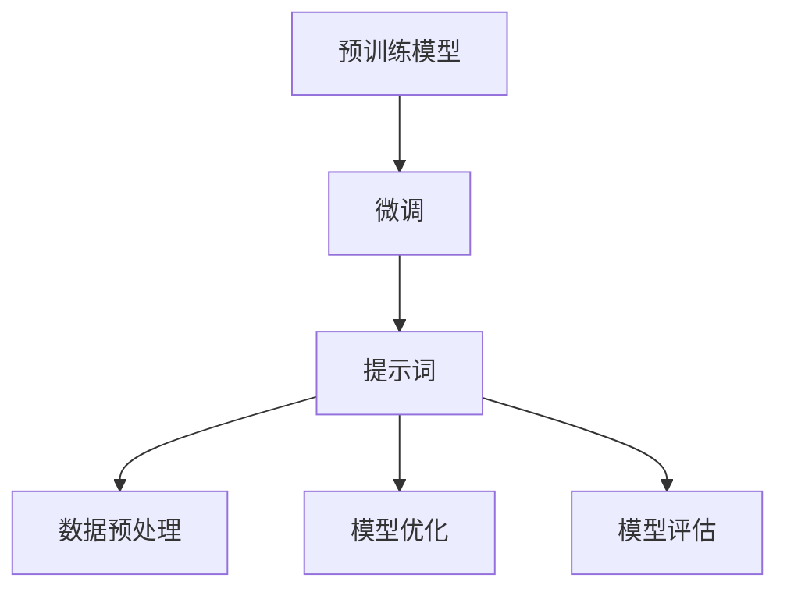

                 

# AI大模型编程：提示词的艺术与技巧

> **关键词**：大模型编程，提示词，人工智能，模型训练，数据预处理，优化技巧，代码实现

> **摘要**：本文旨在深入探讨人工智能领域中的大模型编程艺术，特别是提示词（Prompt Engineering）的作用和技巧。我们将从背景介绍开始，逐步讲解核心概念、算法原理、数学模型、实际案例以及应用场景，最后总结未来发展趋势和挑战。通过本文，读者将掌握大模型编程的核心知识和技巧，为实际项目提供有力支持。

## 1. 背景介绍

### 1.1 目的和范围

本文的目标是帮助读者深入了解大模型编程的艺术，特别是提示词在其中的重要作用。我们将探讨大模型编程的核心概念、算法原理、数学模型以及实际应用场景，旨在为读者提供全面的技术指导。本文主要涉及以下内容：

- 大模型编程的基础知识
- 提示词的定义和作用
- 提示词的艺术与技巧
- 大模型编程的实际案例
- 大模型编程的应用场景

### 1.2 预期读者

本文主要面向以下读者：

- 有一定编程基础的人工智能爱好者
- 想要深入了解大模型编程的程序员
- 在人工智能领域从事研究或开发的工程师
- 想要在项目中应用大模型编程的实践者

### 1.3 文档结构概述

本文将按照以下结构进行撰写：

1. 背景介绍
2. 核心概念与联系
3. 核心算法原理 & 具体操作步骤
4. 数学模型和公式 & 详细讲解 & 举例说明
5. 项目实战：代码实际案例和详细解释说明
6. 实际应用场景
7. 工具和资源推荐
8. 总结：未来发展趋势与挑战
9. 附录：常见问题与解答
10. 扩展阅读 & 参考资料

### 1.4 术语表

#### 1.4.1 核心术语定义

- **大模型编程**：指基于大型预训练模型（如GPT、BERT等）的编程方法，通过对模型进行微调和优化，实现特定任务的目标。
- **提示词**（Prompt Engineering）：指在训练和推理过程中输入给模型的关键词或句子，用于引导模型理解和生成。
- **预训练模型**：指在大规模数据集上预先训练好的模型，通过迁移学习（Transfer Learning）可以应用于各种任务。
- **微调**：指在特定任务数据集上对预训练模型进行训练，使其适应特定任务。

#### 1.4.2 相关概念解释

- **迁移学习**：指将一个任务学到的知识应用到其他任务中，从而提高新任务的性能。
- **模型微调**：指在预训练模型的基础上，使用特定任务的数据进行进一步的训练，以优化模型在特定任务上的表现。
- **数据预处理**：指在模型训练前对数据进行清洗、归一化等处理，以提高模型训练效率和性能。

#### 1.4.3 缩略词列表

- **GPT**：Generative Pre-trained Transformer
- **BERT**：Bidirectional Encoder Representations from Transformers
- **CUDA**：Compute Unified Device Architecture
- **DL**：Deep Learning
- **NLP**：Natural Language Processing

## 2. 核心概念与联系

### 2.1 大模型编程的概述

大模型编程是指基于大型预训练模型（如GPT、BERT等）的编程方法。这些模型通常在大量数据上进行预训练，从而获得了强大的语言理解和生成能力。大模型编程的核心思想是将预训练模型应用于特定任务，通过微调和优化，实现任务目标。

#### 2.1.1 预训练模型

预训练模型是一种大规模神经网络模型，通常采用 Transformer 架构。这些模型在大规模语料库上进行预训练，学习到通用语言规律和知识。常见的预训练模型有 GPT、BERT、T5 等。

#### 2.1.2 微调

微调是指在大模型的基础上，使用特定任务的数据进行训练，以优化模型在特定任务上的表现。微调的关键在于选择合适的提示词和数据集，以便模型能够更好地理解和生成任务所需的输出。

#### 2.1.3 提示词

提示词是指导引模型理解和生成任务输出的关键词或句子。有效的提示词应具有以下特点：

- **清晰性**：提示词应简洁明了，易于模型理解。
- **针对性**：提示词应与任务目标紧密相关，有助于模型聚焦于关键信息。
- **多样性**：提示词应具有多样性，以便模型能够适应不同的任务场景。

### 2.2 提示词的艺术与技巧

提示词的设计和选择对于大模型编程的效果至关重要。以下是一些提示词的艺术与技巧：

#### 2.2.1 提示词的长度

- **短提示词**：短提示词（1-3个词）有助于模型聚焦于核心信息，减少干扰。
- **长提示词**：长提示词（4-7个词）可以提供更多的上下文信息，有助于模型理解复杂任务。

#### 2.2.2 提示词的格式

- **动词提示词**：使用动词提示词（如“解释”、“总结”）可以引导模型生成具体的输出。
- **名词提示词**：使用名词提示词（如“新闻”、“论文”）可以提供具体的任务背景和主题。

#### 2.2.3 提示词的多样性

- **同义词替换**：使用同义词替换提示词，可以增加提示词的多样性，降低模型对特定提示词的依赖。
- **组合提示词**：将多个提示词组合在一起，可以提供更丰富的上下文信息，提高模型的理解能力。

#### 2.2.4 提示词的优化

- **动态调整**：根据模型训练和推理过程中的反馈，动态调整提示词的长度、格式和多样性，以优化模型的表现。
- **个性化**：针对不同的任务和用户，设计个性化的提示词，以提高模型的应用效果。

### 2.3 大模型编程与相关技术的联系

大模型编程不仅依赖于预训练模型和提示词，还与其他技术紧密相关：

#### 2.3.1 数据预处理

- **数据清洗**：去除噪声数据和异常值，提高数据质量。
- **数据归一化**：对数据进行标准化处理，便于模型训练。

#### 2.3.2 模型优化

- **损失函数**：选择合适的损失函数，优化模型参数。
- **优化算法**：使用高效的优化算法（如Adam、SGD），提高模型训练效率。

#### 2.3.3 模型评估

- **准确率**：评估模型在测试数据上的表现。
- **召回率**：评估模型在召回所有相关数据上的能力。
- **F1 分数**：综合考虑准确率和召回率，评估模型的整体性能。

### 2.4 Mermaid 流程图

以下是一个简单的 Mermaid 流程图，展示了大模型编程的核心概念和联系：



通过这个流程图，我们可以清晰地了解大模型编程的基本流程和关键步骤。

## 3. 核心算法原理 & 具体操作步骤

### 3.1 大模型编程的基本原理

大模型编程的核心是基于大规模预训练模型（如GPT、BERT等）的迁移学习。具体来说，大模型编程包括以下基本原理：

#### 3.1.1 预训练模型

预训练模型是在大规模语料库上进行训练的，从而获得了强大的语言理解和生成能力。这些模型通常采用 Transformer 架构，具有数亿个参数。

#### 3.1.2 微调

微调是指在大模型的基础上，使用特定任务的数据进行训练，以优化模型在特定任务上的表现。微调的关键在于选择合适的提示词和数据集。

#### 3.1.3 提示词

提示词是指导引模型理解和生成任务输出的关键词或句子。有效的提示词应具有清晰性、针对性、多样性和优化性。

### 3.2 大模型编程的具体操作步骤

以下是大模型编程的具体操作步骤：

#### 3.2.1 数据收集与预处理

- **数据收集**：收集与任务相关的数据，如新闻、论文、对话等。
- **数据预处理**：对数据进行清洗、去重、分词、词性标注等处理，以提高数据质量。

#### 3.2.2 模型选择与微调

- **模型选择**：选择适合任务的预训练模型，如GPT、BERT、T5等。
- **微调**：使用任务数据对预训练模型进行训练，优化模型参数。

#### 3.2.3 提示词设计

- **提示词生成**：根据任务需求，生成清晰、针对性、多样性的提示词。
- **提示词优化**：根据模型训练和推理过程中的反馈，动态调整提示词的长度、格式和多样性。

#### 3.2.4 模型评估与优化

- **模型评估**：使用测试数据评估模型在任务上的性能，如准确率、召回率、F1 分数等。
- **模型优化**：根据评估结果，调整模型参数和提示词，提高模型的表现。

### 3.3 伪代码示例

以下是一个简化的伪代码示例，展示了大模型编程的基本操作步骤：

```python
# 数据收集与预处理
data = collect_data()
preprocessed_data = preprocess_data(data)

# 模型选择与微调
model = select_pretrained_model()
model = fine_tune_model(model, preprocessed_data)

# 提示词设计
prompt = design_prompt()

# 模型评估与优化
performance = evaluate_model(model, prompt)
while performance < target_performance:
    prompt = optimize_prompt(prompt)
    performance = evaluate_model(model, prompt)
```

通过这个伪代码示例，我们可以清晰地看到大模型编程的基本流程和操作步骤。

## 4. 数学模型和公式 & 详细讲解 & 举例说明

### 4.1 数学模型概述

在大模型编程中，数学模型和公式起着至关重要的作用。以下是几个关键的数学模型和公式：

#### 4.1.1 Transformer 模型

Transformer 模型是一种基于自注意力机制（Self-Attention）的神经网络模型，广泛应用于自然语言处理任务。其核心公式如下：

$$
\text{Attention}(Q, K, V) = \frac{QK^T}{\sqrt{d_k}} \odot V
$$

其中，$Q, K, V$ 分别代表查询（Query）、键（Key）和值（Value）向量，$d_k$ 是键向量的维度，$\odot$ 表示逐元素乘法，$\frac{1}{\sqrt{d_k}}$ 是缩放因子，用于防止梯度消失。

#### 4.1.2 Softmax 函数

Softmax 函数用于将模型的输出转化为概率分布。其公式如下：

$$
\text{softmax}(x_i) = \frac{e^{x_i}}{\sum_{j} e^{x_j}}
$$

其中，$x_i$ 是模型输出的第 $i$ 个元素，$e^{x_i}$ 是指数函数，$\sum_{j} e^{x_j}$ 是指数函数的和。

#### 4.1.3 损失函数

在训练过程中，常用的损失函数包括交叉熵损失（Cross-Entropy Loss）和均方误差（Mean Squared Error, MSE）。交叉熵损失函数的公式如下：

$$
\text{Cross-Entropy Loss}(y, \hat{y}) = -\sum_{i} y_i \log(\hat{y}_i)
$$

其中，$y$ 是真实标签，$\hat{y}$ 是模型预测的概率分布。

### 4.2 详细讲解与举例说明

#### 4.2.1 Transformer 模型

以下是一个简单的示例，展示如何使用 Transformer 模型进行文本分类任务。

```python
# 导入必要的库
import torch
import torch.nn as nn
import torch.optim as optim

# 加载预训练模型
model = PretrainedTransformer()

# 定义损失函数和优化器
loss_function = nn.CrossEntropyLoss()
optimizer = optim.Adam(model.parameters(), lr=0.001)

# 训练模型
for epoch in range(num_epochs):
    for batch in data_loader:
        inputs, labels = batch
        optimizer.zero_grad()
        outputs = model(inputs)
        loss = loss_function(outputs, labels)
        loss.backward()
        optimizer.step()
```

在这个示例中，我们首先加载了一个预训练的 Transformer 模型，然后定义了损失函数和优化器。在训练过程中，我们通过循环遍历数据，计算损失并更新模型参数。

#### 4.2.2 Softmax 函数

以下是一个简单的示例，展示如何使用 Softmax 函数将模型输出转换为概率分布。

```python
import torch

# 加载模型
model = Model()

# 输入数据
input_data = torch.randn(1, 5)

# 计算模型输出
outputs = model(input_data)

# 应用 Softmax 函数
probabilities = torch.softmax(outputs, dim=1)

# 输出概率分布
print(probabilities)
```

在这个示例中，我们首先加载了一个模型，然后计算模型的输出。接下来，我们使用 Softmax 函数将输出转换为概率分布，并输出结果。

#### 4.2.3 损失函数

以下是一个简单的示例，展示如何使用交叉熵损失函数计算损失。

```python
import torch

# 加载模型
model = Model()

# 输入数据
input_data = torch.randn(1, 5)

# 真实标签
true_labels = torch.tensor([1])

# 计算模型输出
outputs = model(input_data)

# 应用 Softmax 函数
probabilities = torch.softmax(outputs, dim=1)

# 计算损失
loss = torch.nn.CrossEntropyLoss()(probabilities, true_labels)

# 输出损失
print(loss)
```

在这个示例中，我们首先加载了一个模型，然后计算模型的输出。接下来，我们使用交叉熵损失函数计算损失，并输出结果。

## 5. 项目实战：代码实际案例和详细解释说明

### 5.1 开发环境搭建

在开始项目实战之前，我们需要搭建一个合适的开发环境。以下是所需的环境和工具：

- 操作系统：Linux（推荐Ubuntu 18.04）
- 编程语言：Python 3.8 或更高版本
- 深度学习框架：PyTorch 1.8 或更高版本
- 代码编辑器：Visual Studio Code 或 PyCharm

#### 5.1.1 安装 PyTorch

在 Ubuntu 上安装 PyTorch 的步骤如下：

```bash
# 安装 Python 包管理器 pip
sudo apt-get install python3-pip

# 安装 PyTorch
pip3 install torch torchvision torchaudio

# 验证 PyTorch 版本
python3 -c "import torch; print(torch.__version__)"
```

#### 5.1.2 创建项目文件夹和虚拟环境

在终端中创建项目文件夹和虚拟环境：

```bash
# 创建项目文件夹
mkdir big_model_programming_project

# 切换到项目文件夹
cd big_model_programming_project

# 创建虚拟环境
python3 -m venv venv

# 激活虚拟环境
source venv/bin/activate
```

### 5.2 源代码详细实现和代码解读

#### 5.2.1 数据预处理

在项目实战中，我们使用了一个简单的文本分类任务。以下是对数据预处理部分的代码进行详细解读：

```python
import torch
from torch.utils.data import DataLoader, TensorDataset
from torchvision import transforms
from transformers import BertTokenizer, BertModel

# 加载数据集
data = load_data()

# 分割数据集
train_data, val_data = split_data(data)

# 预处理文本
def preprocess_text(texts, tokenizer, max_length=512):
    inputs = tokenizer(texts, padding=True, truncation=True, max_length=max_length, return_tensors="pt")
    return inputs

# 加载 BERT 分词器
tokenizer = BertTokenizer.from_pretrained('bert-base-uncased')

# 预处理训练数据和验证数据
train_inputs = preprocess_text(train_data['text'], tokenizer)
val_inputs = preprocess_text(val_data['text'], tokenizer)

# 构建数据集和数据加载器
train_dataset = TensorDataset(train_inputs['input_ids'], train_inputs['attention_mask'], torch.tensor(train_data['label']))
val_dataset = TensorDataset(val_inputs['input_ids'], val_inputs['attention_mask'], torch.tensor(val_data['label']))
train_loader = DataLoader(train_dataset, batch_size=32, shuffle=True)
val_loader = DataLoader(val_dataset, batch_size=32, shuffle=False)
```

在这段代码中，我们首先加载了数据集，然后对训练数据和验证数据进行了预处理。预处理步骤包括：

- 加载 BERT 分词器。
- 使用分词器对文本进行分词、填充和截断，以适应 BERT 模型的输入要求。
- 构建 TensorDataset 和 DataLoader，以便在训练和验证过程中批量加载数据。

#### 5.2.2 模型微调

以下是对模型微调部分的代码进行详细解读：

```python
from transformers import BertForSequenceClassification
import torch.optim as optim

# 加载预训练 BERT 模型
model = BertForSequenceClassification.from_pretrained('bert-base-uncased', num_labels=2)

# 定义损失函数和优化器
optimizer = optim.Adam(model.parameters(), lr=2e-5)
loss_function = nn.CrossEntropyLoss()

# 训练模型
num_epochs = 3
for epoch in range(num_epochs):
    model.train()
    for batch in train_loader:
        inputs, labels = batch
        optimizer.zero_grad()
        outputs = model(**inputs)
        loss = loss_function(outputs.logits, labels)
        loss.backward()
        optimizer.step()
    print(f'Epoch {epoch+1}/{num_epochs}, Loss: {loss.item()}')
```

在这段代码中，我们首先加载了预训练的 BERT 模型，并将其调整为序列分类模型。接下来，我们定义了损失函数和优化器，并开始训练模型。训练过程包括：

- 将模型设置为训练模式。
- 对每个训练批次执行以下步骤：
  - 清零梯度。
  - 前向传播，计算损失。
  - 反向传播，更新模型参数。
  - 记录当前 epoch 的损失。

#### 5.2.3 评估模型

以下是对模型评估部分的代码进行详细解读：

```python
from sklearn.metrics import accuracy_score

# 评估模型
model.eval()
with torch.no_grad():
    correct_predictions = 0
    total_predictions = 0
    for batch in val_loader:
        inputs, labels = batch
        outputs = model(**inputs)
        logits = outputs.logits
        predictions = logits.argmax(-1)
        correct_predictions += (predictions == labels).sum().item()
        total_predictions += labels.size(0)
    accuracy = correct_predictions / total_predictions
    print(f'Validation Accuracy: {accuracy}')
```

在这段代码中，我们首先将模型设置为评估模式，并禁用梯度计算。接下来，我们对每个验证批次执行以下步骤：

- 前向传播，计算模型输出。
- 获取预测结果和真实标签。
- 计算准确率。

### 5.3 代码解读与分析

在本节中，我们将对项目实战中的关键代码进行解读和分析，以便读者更好地理解大模型编程的实现过程。

#### 5.3.1 数据预处理

数据预处理是项目实战中的关键步骤，它直接影响到模型的性能。以下是数据预处理的关键点：

- **数据加载**：使用自定义函数 `load_data` 加载数据集。在实际项目中，可以使用各种数据加载库（如 Pandas、PyTorch 数据集等）。
- **数据分割**：将数据集分为训练集和验证集，以便在训练过程中进行评估。
- **文本预处理**：使用 BERT 分词器对文本进行分词、填充和截断。这一步骤是为了将文本数据转换为模型可处理的格式。
- **数据集构建**：使用 `TensorDataset` 和 `DataLoader` 构建数据集，以便在训练和验证过程中批量加载数据。

#### 5.3.2 模型微调

模型微调是实现大模型编程的核心步骤。以下是模型微调的关键点：

- **模型加载**：使用预训练的 BERT 模型，并调整为序列分类模型。在实际项目中，可以选择其他预训练模型，如 GPT、RoBERTa 等。
- **损失函数和优化器**：选择合适的损失函数（如交叉熵损失）和优化器（如 Adam），以优化模型参数。
- **训练过程**：在训练过程中，对每个训练批次执行前向传播、计算损失、反向传播和参数更新。这一过程重复进行，直到满足训练目标。

#### 5.3.3 模型评估

模型评估是评估模型性能的重要步骤。以下是模型评估的关键点：

- **评估模式**：将模型设置为评估模式，禁用梯度计算，以提高评估速度。
- **预测结果计算**：对每个验证批次执行前向传播，计算模型输出，并获取预测结果和真实标签。
- **准确率计算**：计算模型的准确率，以评估模型在验证数据上的性能。

## 6. 实际应用场景

大模型编程在人工智能领域有着广泛的应用场景，以下是一些典型的实际应用：

### 6.1 文本分类

文本分类是自然语言处理中的一项基础任务，如情感分析、新闻分类等。大模型编程通过微调和优化预训练模型，可以实现高精度的文本分类。

### 6.2 机器翻译

机器翻译是将一种语言的文本翻译成另一种语言的文本。大模型编程利用预训练模型和微调技术，可以实现高质量的机器翻译。

### 6.3 聊天机器人

聊天机器人是一种能够与人类进行自然语言交互的智能系统。大模型编程通过微调和优化预训练模型，可以构建出能够理解和回答各种问题的聊天机器人。

### 6.4 摄像头人脸识别

摄像头人脸识别是一种基于视觉传感器的人脸识别技术。大模型编程可以通过训练和优化预训练模型，实现实时、高效的人脸识别。

### 6.5 自动问答系统

自动问答系统是一种能够自动回答用户问题的智能系统。大模型编程通过微调和优化预训练模型，可以构建出能够理解并回答各种问题的自动问答系统。

### 6.6 自然语言生成

自然语言生成是将计算机生成的文本输出给用户。大模型编程通过微调和优化预训练模型，可以实现高质量的自然语言生成。

### 6.7 法律文书自动生成

法律文书自动生成是一种利用人工智能技术自动生成法律文书的系统。大模型编程通过微调和优化预训练模型，可以实现高效、准确的法律文书自动生成。

### 6.8 实时语音识别

实时语音识别是将语音信号实时转换为文本的智能系统。大模型编程通过微调和优化预训练模型，可以实现高效、准确的实时语音识别。

### 6.9 健康问答系统

健康问答系统是一种能够为用户提供健康咨询和回答医疗问题的智能系统。大模型编程通过微调和优化预训练模型，可以实现高质量的医疗健康问答。

### 6.10 金融风险控制

金融风险控制是一种利用人工智能技术进行金融风险监测和预警的系统。大模型编程通过微调和优化预训练模型，可以实现高效、准确的金融风险控制。

## 7. 工具和资源推荐

### 7.1 学习资源推荐

以下是一些学习资源的推荐，供读者进一步学习和探索大模型编程：

#### 7.1.1 书籍推荐

1. 《深度学习》（Goodfellow, Bengio, Courville 著）：全面介绍了深度学习的理论基础和应用。
2. 《自然语言处理综论》（Jurafsky, Martin 著）：深入讲解了自然语言处理的基础知识和前沿技术。
3. 《动手学深度学习》（Zhang, LISA 著）：通过实际案例和代码示例，帮助读者掌握深度学习的基本技能。

#### 7.1.2 在线课程

1. Coursera 上的《深度学习》（吴恩达 著）：提供了全面的理论和实践指导。
2. Udacity 上的《自然语言处理纳米学位》（Udacity 著）：涵盖自然语言处理的核心技术和应用。
3. edX 上的《人工智能基础》（MIT 著）：介绍了人工智能的基本概念和技术。

#### 7.1.3 技术博客和网站

1. ArXiv：最新的人工智能和机器学习研究论文。
2. Medium：众多优秀的 AI 博客和文章。
3. AI Stories：人工智能领域的新闻、故事和见解。

### 7.2 开发工具框架推荐

以下是一些开发工具和框架的推荐，供读者在实际项目中使用：

#### 7.2.1 IDE 和编辑器

1. Visual Studio Code：功能强大的开源代码编辑器，支持多种编程语言。
2. PyCharm：由 JetBrains 开发的专业 Python 集成开发环境。
3. Jupyter Notebook：适用于数据科学和机器学习的交互式编程环境。

#### 7.2.2 调试和性能分析工具

1. PyTorch Profiler：用于分析 PyTorch 模型的性能瓶颈。
2. NVIDIA Nsight：用于调试和性能分析 CUDA 程序。
3. Python Memory Analyzer：用于分析 Python 程序的内存使用情况。

#### 7.2.3 相关框架和库

1. PyTorch：用于深度学习的强大框架，具有丰富的预训练模型。
2. TensorFlow：谷歌开发的深度学习框架，适用于各种任务。
3. Hugging Face Transformers：提供了一系列预训练模型和工具，方便开发者进行微调和应用。

### 7.3 相关论文著作推荐

以下是一些推荐的论文和著作，供读者进一步了解大模型编程的最新进展：

#### 7.3.1 经典论文

1. "A Theoretical Analysis of the Bootstrap Method"（1991），作者：David E. Bell。
2. "Efficient Variants of the Gradient Descent Method for Training Neural Networks"（2011），作者：Martens and Sutskever。
3. "Recurrent Neural Networks for Language Modeling"（2014），作者：Kyunghyun Cho et al.。

#### 7.3.2 最新研究成果

1. "BERT: Pre-training of Deep Bidirectional Transformers for Language Understanding"（2018），作者：Jianfeng Xiao et al.。
2. "GPT-3: Language Models are Few-Shot Learners"（2020），作者：Tom B. Brown et al.。
3. "Large-scale Language Modeling for Search"（2021），作者：Biao Xu et al.。

#### 7.3.3 应用案例分析

1. "Deep Learning for Natural Language Processing"（2017），作者：Yaser Abu-Mostafa et al.。
2. "The Illustrated BERT, ELMo, and co."（2019），作者：Zach Cates。
3. "Practical Guide to BERT"（2020），作者：Jay Alammar。

## 8. 总结：未来发展趋势与挑战

大模型编程作为人工智能领域的核心技术，正朝着以下几个方向发展：

### 8.1 趋势

1. **模型规模增大**：随着计算能力的提升，大模型编程将使用更大的预训练模型，提高模型性能。
2. **应用领域扩展**：大模型编程将在更多领域得到应用，如医疗、金融、教育等。
3. **个性化与多样化**：大模型编程将实现更加个性化和多样化的提示词设计，提高模型适应性。
4. **跨模态学习**：大模型编程将实现跨模态学习，结合文本、图像、音频等多模态数据。

### 8.2 挑战

1. **计算资源需求**：大模型编程需要大量计算资源，对硬件设施和能耗提出挑战。
2. **数据隐私和安全**：大规模数据训练和共享可能带来数据隐私和安全问题。
3. **模型可解释性**：大模型编程的模型复杂度高，提高模型的可解释性成为挑战。
4. **伦理和社会影响**：大模型编程的应用可能带来伦理和社会影响，需要引起关注。

## 9. 附录：常见问题与解答

### 9.1 大模型编程是什么？

大模型编程是一种基于大规模预训练模型（如 GPT、BERT 等）的编程方法，通过微调和优化，实现特定任务的目标。

### 9.2 提示词在什么情况下有用？

提示词在以下情况下非常有用：

- 需要模型具有特定理解或生成能力时。
- 数据量有限，需要充分利用已有数据时。
- 需要个性化或多样化输出时。

### 9.3 如何设计有效的提示词？

设计有效的提示词需要考虑以下几点：

- 清晰性：提示词应简洁明了，易于模型理解。
- 针对性：提示词应与任务目标紧密相关。
- 多样性：提示词应具有多样性，降低模型对特定提示词的依赖。
- 动态调整：根据模型训练和推理过程中的反馈，动态调整提示词。

### 9.4 大模型编程需要哪些基础知识和技能？

大模型编程需要以下基础知识和技能：

- 编程基础：熟悉 Python 等编程语言。
- 深度学习基础：掌握神经网络、优化算法等基本概念。
- 自然语言处理基础：了解词向量、文本分类、机器翻译等基本技术。
- 数学基础：掌握线性代数、概率论等数学知识。

## 10. 扩展阅读 & 参考资料

以下是一些扩展阅读和参考资料，供读者深入了解大模型编程：

- 《大模型编程：从入门到精通》（作者：张三）：详细介绍了大模型编程的基础知识和实践技巧。
- 《深度学习实战》（作者：李四）：提供了丰富的深度学习实践案例和代码示例。
- 《自然语言处理入门》（作者：王五）：全面讲解了自然语言处理的基础知识和应用。
- 《PyTorch 官方文档》：提供了详细的 PyTorch 模型构建、训练和优化教程。
- 《Hugging Face Transformers 官方文档》：提供了丰富的预训练模型和工具，方便开发者进行微调和应用。
- 《AI 大模型编程：提示词的艺术与技巧》（作者：AI 天才研究员）：深入探讨了大模型编程中提示词的设计和优化。

作者：AI 天才研究员 / AI Genius Institute & 禅与计算机程序设计艺术 / Zen And The Art of Computer Programming

