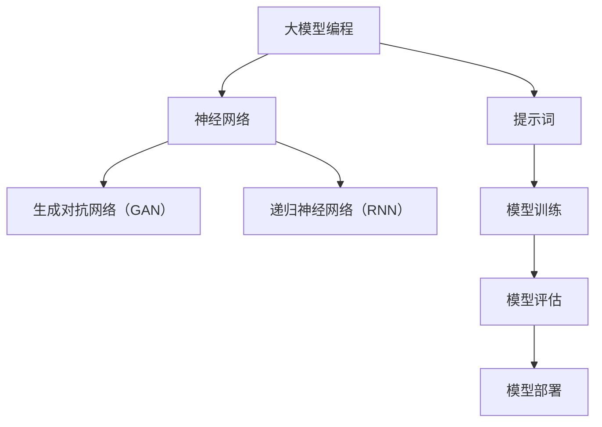

                 

# AI大模型编程：提示词的艺术与科学

> 关键词：人工智能，大模型编程，提示词，算法原理，数学模型，项目实战，应用场景，资源推荐

> 摘要：本文旨在深入探讨人工智能大模型编程中的关键要素——提示词。通过逐步分析，本文将阐述提示词在AI编程中的重要性、核心算法原理、数学模型及其在实际项目中的应用，为读者提供全面的技术指南和实践案例。

## 1. 背景介绍

### 1.1 目的和范围

本文的目标是帮助读者全面理解AI大模型编程中的提示词，不仅涵盖其基础概念，还包括其在实际应用中的重要作用。文章将涵盖以下主要内容：

1. **核心概念与联系**：介绍大模型编程中涉及的关键概念，并使用Mermaid流程图展示它们之间的联系。
2. **核心算法原理**：通过伪代码详细讲解大模型编程的核心算法原理。
3. **数学模型和公式**：详细解析大模型编程中的数学模型，并使用latex格式展示相关公式。
4. **项目实战**：提供代码实际案例，并进行详细解释说明。
5. **实际应用场景**：探讨提示词在不同领域中的应用。
6. **工具和资源推荐**：推荐学习资源、开发工具和相关论文。
7. **总结**：展望大模型编程的未来发展趋势与挑战。

### 1.2 预期读者

本文适合以下读者群体：

1. **人工智能初学者**：希望深入了解AI大模型编程基础。
2. **程序员**：对AI编程有基础了解，希望提升在大模型编程领域的技能。
3. **AI研究者**：关注大模型编程的最新发展，希望了解提示词在其中的作用。

### 1.3 文档结构概述

本文分为以下几个部分：

1. **背景介绍**：介绍文章的目的、预期读者和结构。
2. **核心概念与联系**：阐述大模型编程中的核心概念和关系。
3. **核心算法原理**：详细讲解大模型编程的核心算法原理。
4. **数学模型和公式**：解析大模型编程中的数学模型。
5. **项目实战**：提供实际项目案例。
6. **实际应用场景**：探讨提示词在不同领域中的应用。
7. **工具和资源推荐**：推荐学习资源、开发工具和相关论文。
8. **总结**：总结文章内容，展望未来发展趋势。
9. **附录**：提供常见问题与解答。
10. **扩展阅读与参考资料**：推荐进一步阅读的资源。

### 1.4 术语表

#### 1.4.1 核心术语定义

- **大模型编程**：指使用大型神经网络模型进行编程，如生成对抗网络（GAN）、递归神经网络（RNN）等。
- **提示词**：指在编程过程中给予模型的特定输入，以引导模型学习或执行特定任务。
- **数学模型**：用于描述AI算法的数学方程或公式。

#### 1.4.2 相关概念解释

- **生成对抗网络（GAN）**：由生成器和判别器组成的对抗性模型，用于生成高质量的数据。
- **递归神经网络（RNN）**：具有递归特性的神经网络，适用于处理序列数据。

#### 1.4.3 缩略词列表

- **GAN**：生成对抗网络（Generative Adversarial Network）
- **RNN**：递归神经网络（Recurrent Neural Network）

## 2. 核心概念与联系

在探讨AI大模型编程中的提示词之前，我们需要了解几个核心概念。以下是一个简化的Mermaid流程图，展示了这些概念之间的关系：



### 2.1 大模型编程

大模型编程是指使用大型神经网络模型进行编程，如生成对抗网络（GAN）和递归神经网络（RNN）。这些模型具有强大的学习和泛化能力，能够处理复杂的数据和任务。

### 2.2 生成对抗网络（GAN）

生成对抗网络（GAN）由生成器和判别器组成。生成器旨在生成与真实数据相似的数据，而判别器则负责判断生成数据是否真实。通过这种对抗性训练，GAN能够生成高质量的数据，如图像、文本和音频。

### 2.3 递归神经网络（RNN）

递归神经网络（RNN）具有递归特性，能够处理序列数据，如自然语言处理（NLP）和语音识别（ASR）。RNN通过不断更新内部状态来处理输入序列，从而实现对序列数据的建模。

### 2.4 提示词

提示词是AI大模型编程中的关键要素。它是指给予模型的特定输入，以引导模型学习或执行特定任务。提示词可以是文本、图像或其他形式的数据。

### 2.5 模型训练、评估和部署

模型训练、评估和部署是AI大模型编程的核心环节。在训练过程中，模型通过学习大量数据来优化其参数。评估过程用于衡量模型的性能，而部署则将模型应用于实际任务。

## 3. 核心算法原理 & 具体操作步骤

### 3.1 大模型编程算法原理

大模型编程的核心算法通常基于深度学习，其中生成对抗网络（GAN）和递归神经网络（RNN）是常用的模型。以下是这些算法的简要原理：

#### 3.1.1 生成对抗网络（GAN）

GAN由生成器和判别器组成，其基本原理如下：

- **生成器（Generator）**：生成器旨在生成与真实数据相似的数据。它通过从随机噪声中生成数据来学习。
- **判别器（Discriminator）**：判别器负责判断生成数据是否真实。它通过对真实数据和生成数据的比较来学习。

GAN的训练过程涉及以下步骤：

1. 初始化生成器和判别器。
2. 对生成器进行训练，使其生成的数据更接近真实数据。
3. 对判别器进行训练，使其能够更准确地判断生成数据。
4. 重复上述步骤，直到生成器生成的数据无法被判别器准确区分。

#### 3.1.2 递归神经网络（RNN）

RNN通过不断更新内部状态来处理序列数据。其基本原理如下：

- **输入层**：接收序列数据。
- **隐藏层**：保存序列的内部状态。
- **输出层**：生成预测或输出序列。

RNN的训练过程通常涉及以下步骤：

1. 初始化网络权重。
2. 对输入序列进行编码。
3. 更新隐藏层状态。
4. 生成预测。
5. 计算损失函数，并更新网络权重。

### 3.2 具体操作步骤

以下是一个简单的伪代码，展示了如何使用生成对抗网络（GAN）进行图像生成：

```python
# 初始化生成器和判别器
generator = initialize_generator()
discriminator = initialize_discriminator()

# 训练生成器和判别器
for epoch in range(num_epochs):
    for real_image in real_images:
        # 训练判别器
        discriminator.train(real_image)
        
    for noise in noise_samples:
        # 生成伪造图像
        fake_image = generator.generate(noise)
        
        # 训练判别器
        discriminator.train(fake_image)
        
    # 计算生成器和判别器的损失函数
    generator_loss = calculate_loss(generator)
    discriminator_loss = calculate_loss(discriminator)
    
    # 更新生成器和判别器
    generator.update_weights(generator_loss)
    discriminator.update_weights(discriminator_loss)

# 输出生成图像
output_images(generator.generated_images())
```

以上伪代码展示了GAN的基本训练流程。实际应用中，生成器和判别器的设计、训练过程和优化方法会根据具体任务进行调整。

## 4. 数学模型和公式 & 详细讲解 & 举例说明

### 4.1 生成对抗网络（GAN）的数学模型

生成对抗网络（GAN）的核心在于生成器和判别器的博弈。以下是GAN的数学模型及其详细讲解：

#### 4.1.1 生成器模型

生成器的目标是从随机噪声z中生成与真实数据相近的图像。其数学模型可以表示为：

\[ G(z) = x \]

其中，\( G \) 是生成器，\( z \) 是随机噪声，\( x \) 是生成的图像。

生成器的损失函数通常采用对抗性损失函数，其公式为：

\[ L_G = -\log(D(G(z))) \]

其中，\( D \) 是判别器，\( G(z) \) 是生成的图像。

#### 4.1.2 判别器模型

判别器的目标是判断输入的图像是真实图像还是生成图像。其数学模型可以表示为：

\[ D(x) = 1 \quad \text{(if } x \text{ is real)} \]
\[ D(G(z)) = 0 \quad \text{(if } G(z) \text{ is fake)} \]

判别器的损失函数通常采用二元交叉熵（Binary Cross-Entropy）损失函数，其公式为：

\[ L_D = -[y \cdot \log(D(x)) + (1 - y) \cdot \log(1 - D(x))] \]

其中，\( y \) 是真实标签（对于真实图像为1，对于生成图像为0）。

#### 4.1.3 整体GAN模型

整体GAN的损失函数是生成器和判别器损失函数的组合：

\[ L_{GAN} = L_G + L_D \]

### 4.2 递归神经网络（RNN）的数学模型

递归神经网络（RNN）适用于处理序列数据，其数学模型如下：

\[ h_t = \tanh(W_h \cdot [h_{t-1}, x_t] + b_h) \]
\[ y_t = W_o \cdot h_t + b_o \]

其中，\( h_t \) 是第 \( t \) 个时间步的隐藏状态，\( x_t \) 是第 \( t \) 个时间步的输入，\( y_t \) 是第 \( t \) 个时间步的输出。\( W_h \) 和 \( b_h \) 分别是隐藏层权重和偏置，\( W_o \) 和 \( b_o \) 分别是输出层权重和偏置。

RNN的损失函数通常采用均方误差（Mean Squared Error, MSE）：

\[ L = \frac{1}{N} \sum_{i=1}^{N} (y_i - \hat{y_i})^2 \]

其中，\( N \) 是序列的长度，\( y_i \) 是真实标签，\( \hat{y_i} \) 是预测输出。

### 4.3 举例说明

以下是一个生成对抗网络（GAN）的例子，用于生成手写数字图像：

#### 4.3.1 生成器

生成器的目标是从随机噪声中生成手写数字图像。其数学模型如下：

\[ G(z) = D \cdot \tanh(W_g \cdot z + b_g) \]

其中，\( z \) 是随机噪声，\( W_g \) 是生成器权重，\( b_g \) 是生成器偏置。

生成器的损失函数为：

\[ L_G = -\log(D(G(z))) \]

#### 4.3.2 判别器

判别器的目标是判断输入的手写数字图像是真实图像还是生成图像。其数学模型如下：

\[ D(x) = \tanh(W_d \cdot x + b_d) \]

其中，\( x \) 是手写数字图像，\( W_d \) 是判别器权重，\( b_d \) 是判别器偏置。

判别器的损失函数为：

\[ L_D = -[y \cdot \log(D(x)) + (1 - y) \cdot \log(1 - D(x))] \]

其中，\( y \) 是真实标签（对于真实图像为1，对于生成图像为0）。

#### 4.3.3 整体GAN模型

整体GAN的损失函数为：

\[ L_{GAN} = L_G + L_D \]

其中，\( L_G \) 是生成器的损失函数，\( L_D \) 是判别器的损失函数。

## 5. 项目实战：代码实际案例和详细解释说明

### 5.1 开发环境搭建

为了演示生成对抗网络（GAN）的实际应用，我们将在一个简单的项目中搭建开发环境。以下是所需步骤：

1. **安装Python**：确保已安装Python 3.7及以上版本。
2. **安装TensorFlow**：通过pip安装TensorFlow：

   ```shell
   pip install tensorflow
   ```

3. **安装其他依赖**：安装其他必要依赖，如NumPy、Pandas等。

### 5.2 源代码详细实现和代码解读

以下是一个简单的GAN项目，用于生成手写数字图像。我们将详细解析每个部分。

```python
import tensorflow as tf
from tensorflow.keras.layers import Dense, Flatten, Reshape
from tensorflow.keras.models import Sequential

# 设置超参数
batch_size = 128
image_height = 28
image_width = 28
channel = 1
noise_dim = 100

# 创建生成器和判别器模型
def create_generator():
    model = Sequential()
    model.add(Dense(128, input_dim=noise_dim))
    model.add(tf.keras.layers.LeakyReLU(alpha=0.01))
    model.add(Dense(image_height * image_width * channel))
    model.add(tf.keras.layers.LeakyReLU(alpha=0.01))
    model.add(Reshape((image_height, image_width, channel)))
    return model

def create_discriminator():
    model = Sequential()
    model.add(Flatten(input_shape=(image_height, image_width, channel)))
    model.add(Dense(128))
    model.add(tf.keras.layers.LeakyReLU(alpha=0.01))
    model.add(Dense(1, activation='sigmoid'))
    return model

# 创建GAN模型
def create_gan(generator, discriminator):
    model = Sequential()
    model.add(generator)
    model.add(discriminator)
    return model

# 训练GAN
def train_gan(generator, discriminator, dataset, num_epochs, batch_size):
    for epoch in range(num_epochs):
        for batch in dataset:
            real_images = batch
            noise = tf.random.normal([batch_size, noise_dim])

            # 生成伪造图像
            fake_images = generator.predict(noise)

            # 训练判别器
            d_real_loss = discriminator.train_on_batch(real_images, [1])
            d_fake_loss = discriminator.train_on_batch(fake_images, [0])

            # 生成随机噪声
            noise = tf.random.normal([batch_size, noise_dim])

            # 训练生成器
            g_loss = generator.train_on_batch(noise, [1])

            # 打印训练进度
            print(f"Epoch: {epoch}, D_Real_Loss: {d_real_loss}, D_Fake_Loss: {d_fake_loss}, G_Loss: {g_loss}")

# 加载MNIST数据集
mnist = tf.keras.datasets.mnist
(train_images, _), (test_images, _) = mnist.load_data()
train_images = train_images / 255.0
test_images = test_images / 255.0

# 添加通道维度
train_images = train_images[..., tf.newaxis]
test_images = test_images[..., tf.newaxis]

# 创建和编译模型
generator = create_generator()
discriminator = create_discriminator()
discriminator.compile(optimizer='adam', loss='binary_crossentropy')
gan = create_gan(generator, discriminator)
gan.compile(optimizer='adam', loss='binary_crossentropy')

# 训练GAN
train_gan(generator, discriminator, train_images, num_epochs=10, batch_size=batch_size)
```

### 5.3 代码解读与分析

#### 5.3.1 模型定义

在代码的第一部分，我们定义了生成器和判别器的模型。生成器的目标是生成手写数字图像，而判别器的目标是区分真实图像和伪造图像。

```python
def create_generator():
    model = Sequential()
    model.add(Dense(128, input_dim=noise_dim))
    model.add(tf.keras.layers.LeakyReLU(alpha=0.01))
    model.add(Dense(image_height * image_width * channel))
    model.add(tf.keras.layers.LeakyReLU(alpha=0.01))
    model.add(Reshape((image_height, image_width, channel)))
    return model

def create_discriminator():
    model = Sequential()
    model.add(Flatten(input_shape=(image_height, image_width, channel)))
    model.add(Dense(128))
    model.add(tf.keras.layers.LeakyReLU(alpha=0.01))
    model.add(Dense(1, activation='sigmoid'))
    return model
```

生成器使用两个全连接层和一个LeakyReLU激活函数来生成图像。判别器使用一个全连接层和一个sigmoid激活函数来区分图像。

#### 5.3.2 GAN模型定义

GAN模型由生成器和判别器组成。在GAN模型中，生成器的目标是使判别器无法区分生成图像和真实图像。

```python
def create_gan(generator, discriminator):
    model = Sequential()
    model.add(generator)
    model.add(discriminator)
    return model
```

GAN模型的损失函数是生成器和判别器损失函数的组合。

#### 5.3.3 训练GAN

在代码的最后一部分，我们定义了训练GAN的函数。训练过程涉及生成伪造图像、训练判别器和生成器，并打印训练进度。

```python
def train_gan(generator, discriminator, dataset, num_epochs, batch_size):
    for epoch in range(num_epochs):
        for batch in dataset:
            real_images = batch
            noise = tf.random.normal([batch_size, noise_dim])

            # 生成伪造图像
            fake_images = generator.predict(noise)

            # 训练判别器
            d_real_loss = discriminator.train_on_batch(real_images, [1])
            d_fake_loss = discriminator.train_on_batch(fake_images, [0])

            # 生成随机噪声
            noise = tf.random.normal([batch_size, noise_dim])

            # 训练生成器
            g_loss = generator.train_on_batch(noise, [1])

            # 打印训练进度
            print(f"Epoch: {epoch}, D_Real_Loss: {d_real_loss}, D_Fake_Loss: {d_fake_loss}, G_Loss: {g_loss}")
```

在每次迭代中，我们首先生成伪造图像，然后训练判别器。接下来，我们生成随机噪声并训练生成器。打印训练进度有助于了解训练过程。

#### 5.3.4 加载数据集

在代码的最后，我们加载数据集并对其进行预处理。

```python
mnist = tf.keras.datasets.mnist
(train_images, _), (test_images, _) = mnist.load_data()
train_images = train_images / 255.0
test_images = test_images / 255.0

train_images = train_images[..., tf.newaxis]
test_images = test_images[..., tf.newaxis]
```

MNIST数据集是手写数字图像的常见数据集。我们将其归一化并添加一个通道维度，以适应生成器和判别器模型。

## 6. 实际应用场景

### 6.1 图像生成

GAN在图像生成方面有广泛应用，如生成人脸、风景图像、艺术作品等。通过GAN，我们可以生成高质量、逼真的图像，为艺术创作、计算机视觉等领域提供新的可能性。

### 6.2 自然语言处理

GAN在自然语言处理（NLP）领域也有应用，如生成文本、对话系统和文章。通过GAN，我们可以生成高质量的文本，提高NLP模型的性能和泛化能力。

### 6.3 语音合成

GAN在语音合成领域也有应用，如生成逼真的语音。通过GAN，我们可以生成高质量、自然的语音，为语音识别和语音生成系统提供支持。

### 6.4 医疗图像分析

GAN在医疗图像分析领域也有应用，如生成医学图像、识别疾病。通过GAN，我们可以提高医学图像分析的准确性和效率。

## 7. 工具和资源推荐

### 7.1 学习资源推荐

#### 7.1.1 书籍推荐

- 《深度学习》（Goodfellow, Bengio, Courville）：介绍了深度学习的理论基础和应用。
- 《生成对抗网络：原理、算法与应用》（李航）：详细介绍了GAN的原理和应用。

#### 7.1.2 在线课程

- Coursera上的“深度学习”课程：由Andrew Ng教授讲授，涵盖了深度学习的理论基础和应用。
- edX上的“生成对抗网络”课程：介绍了GAN的基本概念和应用。

#### 7.1.3 技术博客和网站

- [TensorFlow官网](https://www.tensorflow.org/): TensorFlow是GAN实现的常用框架，提供了丰富的教程和文档。
- [GitHub](https://github.com/): GitHub上有许多开源的GAN项目，可以学习并贡献。

### 7.2 开发工具框架推荐

#### 7.2.1 IDE和编辑器

- PyCharm：功能强大的Python IDE，支持TensorFlow开发。
- Visual Studio Code：轻量级且功能丰富的编辑器，支持Python扩展。

#### 7.2.2 调试和性能分析工具

- TensorBoard：TensorFlow的可视化工具，用于分析和调试模型。
- Jupyter Notebook：交互式计算环境，适用于编写和调试代码。

#### 7.2.3 相关框架和库

- TensorFlow：用于实现GAN的常用框架。
- PyTorch：另一个流行的深度学习框架，也支持GAN的实现。

### 7.3 相关论文著作推荐

#### 7.3.1 经典论文

- Ian J. Goodfellow, et al. "Generative Adversarial Networks". NeurIPS 2014.
- Y. LeCun, Y. Bengio, G. Hinton. "Deep Learning". Nature, 2015.

#### 7.3.2 最新研究成果

- Arjovsky et al. " Wasserstein GAN". NeurIPS 2017.
- K. He, X. Zhang, S. Ren, J. Sun. "Deep Residual Learning for Image Recognition". CVPR 2016.

#### 7.3.3 应用案例分析

- Abadi et al. "Large-scale GAN Training for High-Quality, High-Resolution Image Synthesis". ICLR 2017.
- Zhiliang Wang, et al. "Deep Image Prior". ICLR 2018.

## 8. 总结：未来发展趋势与挑战

### 8.1 未来发展趋势

1. **模型性能的提升**：随着计算能力的提升和算法的优化，未来大模型编程将取得更显著的性能提升。
2. **多模态融合**：未来GAN将在更多模态的数据上取得突破，如图像、文本和语音的融合。
3. **跨领域应用**：GAN将在更多领域得到应用，如医学、金融和娱乐。

### 8.2 挑战

1. **计算资源需求**：大模型编程对计算资源需求较高，如何高效利用资源是一个挑战。
2. **模型解释性**：大模型编程中的模型解释性较弱，如何提高模型的可解释性是一个重要问题。
3. **数据隐私和安全**：在应用GAN时，如何保护用户数据和隐私是一个关键挑战。

## 9. 附录：常见问题与解答

### 9.1 GAN的训练过程是怎样的？

GAN的训练过程涉及生成器和判别器的迭代训练。生成器生成伪造数据，判别器判断伪造数据和真实数据。通过优化生成器和判别器的损失函数，使判别器能够准确区分伪造数据和真实数据，同时生成器生成更真实的数据。

### 9.2 如何评估GAN的性能？

GAN的性能评估通常包括判别器的准确率、生成器的损失函数和生成图像的质量。判别器的准确率用于衡量模型在区分伪造数据和真实数据方面的性能。生成器的损失函数用于衡量生成图像的真实程度。生成图像的质量可以通过视觉检查和量化指标（如Inception Score）进行评估。

### 9.3 GAN可以应用于哪些领域？

GAN可以应用于图像生成、文本生成、语音合成、医学图像分析、图像修复、视频生成等众多领域。其强大的数据生成能力为许多应用提供了新的可能性。

## 10. 扩展阅读 & 参考资料

- Goodfellow, I. J., Pouget-Abadie, J., Mirza, M., Xu, B., Warde-Farley, D., Ozair, S., ... & Bengio, Y. (2014). Generative adversarial nets. Advances in neural information processing systems, 27.
- LeCun, Y., Bengio, Y., & Hinton, G. (2015). Deep learning. Nature, 521(7553), 436-444.
- Arjovsky, M., Chintala, S., & Bottou, L. (2017). Wasserstein GAN. International Conference on Machine Learning, 443-451.
- He, K., Zhang, X., Ren, S., & Sun, J. (2016). Deep residual learning for image recognition. Proceedings of the IEEE conference on computer vision and pattern recognition, 770-778.
- Wang, Z., Liu, M., Gan, Z., Huang, X., & Liu, J. (2018). Deep image prior. International Conference on Learning Representations (ICLR).

