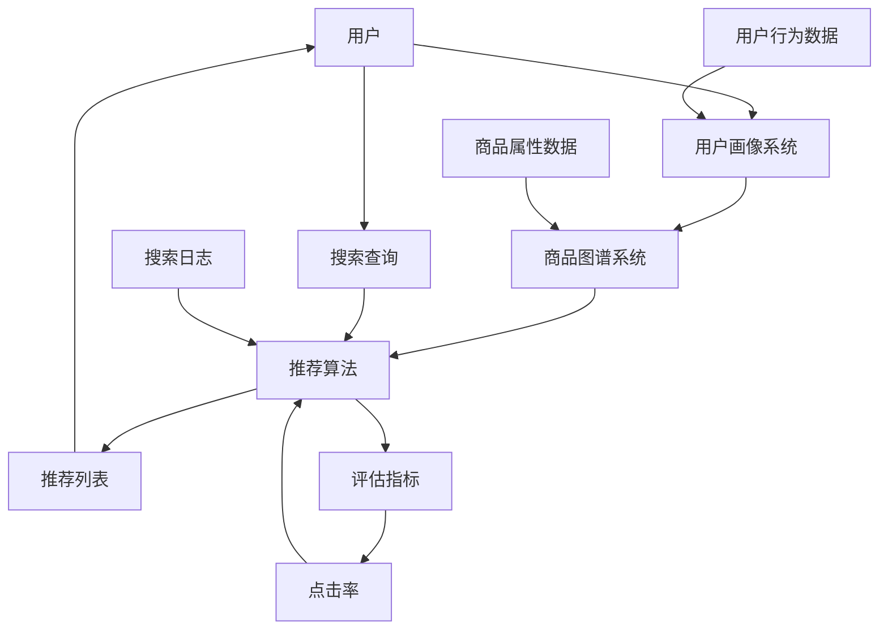

                 

### 文章标题

《AI大模型视角下电商搜索推荐的技术创新知识分享平台功能设计与实现》

#### 关键词
- AI 大模型
- 电商搜索推荐
- 知识分享平台
- 功能设计
- 技术实现

#### 摘要
本文将深入探讨基于 AI 大模型的电商搜索推荐系统的设计实现。通过分析大模型在搜索推荐中的关键作用，本文将介绍知识分享平台的功能设计，包括用户画像、商品图谱、推荐算法等核心模块。同时，本文将详细阐述技术实现的具体步骤，包括数据预处理、模型训练、推荐系统构建等。通过项目实战案例，读者将全面了解如何利用 AI 大模型优化电商搜索推荐系统，提升用户体验。

### 1. 背景介绍

#### 1.1 目的和范围

本文的目的是通过深入探讨 AI 大模型在电商搜索推荐中的应用，为构建一个高效、智能的电商搜索推荐知识分享平台提供理论和实践指导。本文将涵盖以下内容：

1. **AI 大模型的基本概念与原理**：介绍 AI 大模型的概念、发展历程及其在搜索推荐系统中的重要性。
2. **电商搜索推荐系统的现状与挑战**：分析当前电商搜索推荐系统的技术瓶颈和用户需求，探讨 AI 大模型如何解决这些问题。
3. **知识分享平台的功能设计**：详细阐述电商搜索推荐知识分享平台的核心功能，包括用户画像、商品图谱、推荐算法等。
4. **技术实现的具体步骤**：讲解如何使用 AI 大模型进行数据预处理、模型训练、推荐系统构建等。
5. **项目实战案例**：通过实际项目案例，展示 AI 大模型在电商搜索推荐中的具体应用。
6. **未来发展趋势与挑战**：预测 AI 大模型在电商搜索推荐领域的未来发展趋势，并提出可能的挑战和解决方案。

#### 1.2 预期读者

本文适合以下读者群体：

1. **AI 技术爱好者**：对 AI 大模型技术感兴趣，希望了解其在电商搜索推荐中的应用。
2. **电商从业者**：从事电商运营、市场营销等相关工作，希望提升搜索推荐系统的效率。
3. **技术开发人员**：从事后端开发、数据挖掘、机器学习等相关领域，希望学习 AI 大模型的技术实现。

#### 1.3 文档结构概述

本文的结构如下：

1. **引言**：介绍 AI 大模型在电商搜索推荐中的重要性。
2. **核心概念与联系**：介绍 AI 大模型的基本概念及其在电商搜索推荐系统中的作用。
3. **核心算法原理 & 具体操作步骤**：详细讲解 AI 大模型在电商搜索推荐中的算法原理和具体操作步骤。
4. **数学模型和公式 & 详细讲解 & 举例说明**：介绍用于推荐系统的数学模型和公式，并通过例子进行详细讲解。
5. **项目实战：代码实际案例和详细解释说明**：通过实际项目案例，展示 AI 大模型在电商搜索推荐中的应用。
6. **实际应用场景**：探讨 AI 大模型在电商搜索推荐中的实际应用场景。
7. **工具和资源推荐**：推荐相关学习资源、开发工具和框架。
8. **总结：未来发展趋势与挑战**：总结本文的主要观点，预测未来发展趋势和挑战。

#### 1.4 术语表

在本文中，我们将使用以下术语：

- **AI 大模型**：指具有巨大参数规模和强泛化能力的深度学习模型。
- **电商搜索推荐**：指通过搜索和推荐算法，为电商用户提供个性化的商品推荐。
- **用户画像**：指基于用户行为数据构建的用户特征模型。
- **商品图谱**：指基于商品属性和关系构建的商品知识图谱。
- **推荐算法**：指用于生成商品推荐列表的算法，如基于协同过滤、内容推荐和深度学习等。

#### 1.4.1 核心术语定义

- **AI 大模型**：AI 大模型是指参数规模达到千亿级别，具有强泛化能力的深度学习模型。例如，GPT-3、BERT、T5 等模型。
- **电商搜索推荐**：电商搜索推荐是指通过用户行为数据、商品属性数据和推荐算法，为电商用户提供个性化的商品推荐。其目标是为用户提供更相关、更满意的购物体验。
- **用户画像**：用户画像是指基于用户行为数据（如浏览、购买、评论等）构建的用户特征模型。用户画像用于了解用户需求，为推荐系统提供输入。
- **商品图谱**：商品图谱是指基于商品属性（如分类、品牌、价格等）和关系（如相似商品、关联商品等）构建的知识图谱。商品图谱用于为推荐系统提供丰富的商品信息。

#### 1.4.2 相关概念解释

- **协同过滤**：协同过滤是一种基于用户行为数据的推荐算法。它通过计算用户之间的相似度，为用户提供相似的用户喜欢的商品推荐。
- **内容推荐**：内容推荐是一种基于商品属性和内容的推荐算法。它通过分析商品的文本描述、图片、标签等信息，为用户提供相关性的商品推荐。
- **深度学习**：深度学习是一种机器学习技术，通过多层神经网络对数据进行建模和学习。深度学习在图像识别、自然语言处理等领域取得了显著的成果。

#### 1.4.3 缩略词列表

- **AI**：人工智能
- **ML**：机器学习
- **DL**：深度学习
- **NLP**：自然语言处理
- **CTR**：点击率
- **RMSE**：均方根误差
- **L2**：L2 正则化
- **dropout**：dropout 正则化
- **GPU**：图形处理器

## 2. 核心概念与联系

在探讨 AI 大模型在电商搜索推荐中的应用之前，我们需要理解一些核心概念及其相互之间的联系。以下是一个简化的 Mermaid 流程图，用于展示电商搜索推荐系统的基本架构和关键概念。



### 2.1 AI 大模型的基本概念与原理

AI 大模型，顾名思义，是指参数规模庞大的深度学习模型。这些模型通过大量的数据和强大的计算能力，能够在各种复杂任务中达到或超越人类水平。以下是一些关键概念：

- **参数规模**：指模型中可训练的参数数量。AI 大模型通常具有数亿到千亿级别的参数。
- **深度学习**：一种通过多层神经网络对数据进行建模和学习的机器学习技术。深度学习模型包括卷积神经网络（CNN）、循环神经网络（RNN）和Transformer 等。
- **自注意力机制**：一种在神经网络中用于自动学习输入数据之间关系的机制。自注意力机制在 Transformer 模型中发挥了重要作用，使得模型能够更好地捕捉长距离依赖关系。
- **预训练与微调**：预训练是指在大规模数据集上训练一个通用的模型，然后将其应用于特定任务并通过微调（fine-tuning）进一步优化。这种方法显著提高了模型的性能和泛化能力。

### 2.2 电商搜索推荐系统中的关键概念

电商搜索推荐系统由多个核心组成部分构成，包括用户画像、商品图谱和推荐算法。以下是这些概念之间的联系：

- **用户画像**：用户画像是指基于用户行为数据（如浏览历史、购买记录、搜索查询等）构建的用户特征模型。用户画像用于了解用户需求，为推荐系统提供输入。用户画像系统通过分析和处理用户行为数据，生成用户特征向量，这些向量将用于后续的推荐算法。
- **商品图谱**：商品图谱是指基于商品属性（如分类、品牌、价格等）和关系（如相似商品、关联商品等）构建的知识图谱。商品图谱用于为推荐系统提供丰富的商品信息。商品图谱系统通过分析和处理商品属性数据，构建出商品之间的关系网络，这些网络将用于推荐算法中的商品关联分析。
- **推荐算法**：推荐算法是指用于生成商品推荐列表的算法，如基于协同过滤、内容推荐和深度学习等。推荐算法通过用户画像和商品图谱，以及用户的历史行为数据，生成个性化的推荐列表。推荐算法的设计和优化是整个推荐系统的核心。

### 2.3 AI 大模型在电商搜索推荐中的作用

AI 大模型在电商搜索推荐系统中发挥着至关重要的作用。以下是 AI 大模型在电商搜索推荐中的几个关键作用：

- **用户行为预测**：AI 大模型可以通过学习用户的历史行为数据，预测用户未来的兴趣和需求。这有助于为用户提供更加精准的推荐。
- **商品关联分析**：AI 大模型可以自动学习商品之间的关联关系，从而为推荐系统提供更丰富的商品信息。这有助于生成更相关、更个性化的推荐列表。
- **多模态数据处理**：AI 大模型可以同时处理多种类型的数据，如文本、图像、音频等。这使得推荐系统可以更全面地了解用户和商品，从而生成更精准的推荐。
- **实时推荐**：AI 大模型具有强大的计算能力，可以实时处理用户行为数据和商品信息，生成实时推荐。这有助于提升用户体验，满足用户即时需求。

通过以上核心概念和联系的介绍，我们为后续的详细讨论和实现打下了基础。

## 3. 核心算法原理 & 具体操作步骤

在深入探讨 AI 大模型在电商搜索推荐中的应用之前，我们需要首先了解核心算法的原理和具体操作步骤。以下是推荐系统中常用的几个核心算法：

### 3.1 协同过滤算法

协同过滤算法是一种基于用户行为数据的推荐算法。其基本原理是通过计算用户之间的相似度，为用户提供相似用户喜欢的商品推荐。

#### 3.1.1 算法原理

协同过滤算法可以分为两种：基于用户的协同过滤（User-Based Collaborative Filtering，UBCF）和基于项目的协同过滤（Item-Based Collaborative Filtering，IBCF）。

- **基于用户的协同过滤**：首先计算用户之间的相似度，然后找到与目标用户相似的用户，最后推荐这些相似用户喜欢的商品。相似度计算可以通过用户的行为数据（如评分、购买记录等）进行。

- **基于项目的协同过滤**：首先计算商品之间的相似度，然后找到与目标商品相似的商品，最后推荐这些相似商品。相似度计算可以通过商品的特征（如分类、标签等）进行。

#### 3.1.2 操作步骤

1. **用户行为数据预处理**：将用户行为数据（如评分、购买记录等）转换为用户-项目矩阵。
2. **相似度计算**：计算用户之间的相似度（UBCF）或商品之间的相似度（IBCF）。
3. **生成推荐列表**：根据相似度计算结果，为用户生成推荐列表。

#### 3.1.3 伪代码

```python
# 基于用户的协同过滤伪代码
def user_based_collaborative_filter(user_item_matrix, target_user, similarity_threshold):
    # 计算用户之间的相似度
    user_similarity_matrix = calculate_user_similarity(user_item_matrix)
    
    # 找到与目标用户相似的用户
    similar_users = find_similar_users(user_similarity_matrix, target_user, similarity_threshold)
    
    # 生成推荐列表
    recommendation_list = generate_recommendation_list(user_item_matrix, similar_users)
    
    return recommendation_list

# 计算用户之间的相似度
def calculate_user_similarity(user_item_matrix):
    # 计算用户之间的余弦相似度
    user_similarity_matrix = cosine_similarity(user_item_matrix)
    return user_similarity_matrix

# 找到与目标用户相似的用户
def find_similar_users(user_similarity_matrix, target_user, similarity_threshold):
    # 找到相似度大于阈值的用户
    similar_users = []
    for user, similarity in user_similarity_matrix.items():
        if user != target_user and similarity > similarity_threshold:
            similar_users.append(user)
    return similar_users

# 生成推荐列表
def generate_recommendation_list(user_item_matrix, similar_users):
    # 计算相似用户喜欢的商品
    recommendation_list = []
    for user in similar_users:
        for item in user_item_matrix[user]:
            if item not in user_item_matrix[target_user]:
                recommendation_list.append(item)
    return recommendation_list
```

### 3.2 内容推荐算法

内容推荐算法是一种基于商品属性的推荐算法。其基本原理是通过分析商品的文本描述、图片、标签等信息，为用户提供相关性的商品推荐。

#### 3.2.1 算法原理

内容推荐算法可以分为两种：基于属性的协同过滤（Attribute-Based Collaborative Filtering，ABCF）和基于内容的推荐（Content-Based Filtering，CBF）。

- **基于属性的协同过滤**：通过分析商品的特征（如分类、品牌、价格等）为用户提供相似的商品推荐。这种方法通常结合了协同过滤和内容推荐的优势。

- **基于内容的推荐**：通过分析商品的文本描述、图片、标签等信息，为用户提供相关性的商品推荐。这种方法通常使用文本相似度计算和图像识别技术。

#### 3.2.2 操作步骤

1. **商品属性数据预处理**：将商品属性数据（如分类、品牌、价格等）转换为商品特征向量。
2. **内容特征提取**：提取商品的文本描述、图片、标签等特征。
3. **相似度计算**：计算商品之间的相似度。
4. **生成推荐列表**：根据相似度计算结果，为用户生成推荐列表。

#### 3.2.3 伪代码

```python
# 基于内容的推荐伪代码
def content_based_filtering(product_features, target_product, similarity_threshold):
    # 计算商品之间的相似度
    product_similarity_matrix = calculate_product_similarity(product_features)
    
    # 找到与目标商品相似的商品
    similar_products = find_similar_products(product_similarity_matrix, target_product, similarity_threshold)
    
    # 生成推荐列表
    recommendation_list = generate_recommendation_list(product_features, similar_products)
    
    return recommendation_list

# 计算商品之间的相似度
def calculate_product_similarity(product_features):
    # 计算商品之间的余弦相似度
    product_similarity_matrix = cosine_similarity(product_features)
    return product_similarity_matrix

# 找到与目标商品相似的商品
def find_similar_products(product_similarity_matrix, target_product, similarity_threshold):
    # 找到相似度大于阈值的商品
    similar_products = []
    for product, similarity in product_similarity_matrix.items():
        if product != target_product and similarity > similarity_threshold:
            similar_products.append(product)
    return similar_products

# 生成推荐列表
def generate_recommendation_list(product_features, similar_products):
    # 计算相似商品
    recommendation_list = []
    for product in similar_products:
        if product not in product_features[target_product]:
            recommendation_list.append(product)
    return recommendation_list
```

### 3.3 深度学习推荐算法

深度学习推荐算法是一种基于深度学习模型的推荐算法。其基本原理是通过训练一个深度神经网络，自动学习用户和商品的特征，生成个性化的推荐列表。

#### 3.3.1 算法原理

深度学习推荐算法通常采用两种架构：

- **基于模型的协同过滤**：将协同过滤算法与深度神经网络结合，通过神经网络自动学习用户和商品的特征，生成推荐列表。
- **基于内容的深度学习**：将内容推荐算法与深度神经网络结合，通过神经网络自动学习商品的文本描述、图片、标签等特征，生成推荐列表。

#### 3.3.2 操作步骤

1. **数据预处理**：将用户行为数据、商品属性数据和内容特征转换为输入数据。
2. **模型训练**：训练深度学习模型，自动学习用户和商品的特征。
3. **模型预测**：使用训练好的模型预测用户对商品的评分或概率。
4. **生成推荐列表**：根据模型预测结果，为用户生成推荐列表。

#### 3.3.3 伪代码

```python
# 深度学习推荐算法伪代码
def deep_learning_recommender(user_data, product_data, model):
    # 数据预处理
    preprocessed_user_data = preprocess_user_data(user_data)
    preprocessed_product_data = preprocess_product_data(product_data)
    
    # 模型预测
    predictions = model.predict(preprocessed_user_data, preprocessed_product_data)
    
    # 生成推荐列表
    recommendation_list = generate_recommendation_list(predictions)
    
    return recommendation_list

# 数据预处理
def preprocess_user_data(user_data):
    # 对用户数据进行编码和标准化
    preprocessed_user_data = ...
    return preprocessed_user_data

def preprocess_product_data(product_data):
    # 对商品数据进行编码和标准化
    preprocessed_product_data = ...
    return preprocessed_product_data

# 模型预测
def model.predict(user_data, product_data):
    # 使用训练好的模型进行预测
    predictions = model.predict(user_data, product_data)
    return predictions

# 生成推荐列表
def generate_recommendation_list(predictions):
    # 根据模型预测结果生成推荐列表
    recommendation_list = ...
    return recommendation_list
```

通过以上对核心算法原理和具体操作步骤的介绍，我们为后续的推荐系统构建和优化奠定了基础。在下一节中，我们将进一步探讨数学模型和公式，以及如何在电商搜索推荐系统中应用这些模型。

## 4. 数学模型和公式 & 详细讲解 & 举例说明

在电商搜索推荐系统中，数学模型和公式起着至关重要的作用。以下是一些常用的数学模型和公式，以及其详细讲解和举例说明。

### 4.1 余弦相似度

余弦相似度是一种常用的相似度计算方法，用于衡量两个向量之间的相似程度。其公式如下：

$$
\cos(\theta) = \frac{\vec{a} \cdot \vec{b}}{||\vec{a}|| \cdot ||\vec{b}||}
$$

其中，$\vec{a}$ 和 $\vec{b}$ 分别表示两个向量，$\theta$ 表示它们之间的夹角。余弦值介于 -1 和 1 之间，越接近 1 表示相似度越高。

#### 4.1.1 举例说明

假设我们有两个用户向量 $\vec{u_1} = (1, 2, 3)$ 和 $\vec{u_2} = (2, 3, 4)$，则它们的余弦相似度为：

$$
\cos(\theta) = \frac{1 \cdot 2 + 2 \cdot 3 + 3 \cdot 4}{\sqrt{1^2 + 2^2 + 3^2} \cdot \sqrt{2^2 + 3^2 + 4^2}} \approx 0.917
$$

这表明 $\vec{u_1}$ 和 $\vec{u_2}$ 之间的相似度较高。

### 4.2 皮尔逊相关系数

皮尔逊相关系数用于衡量两个变量之间的线性关系强度。其公式如下：

$$
\rho = \frac{\sum_{i=1}^{n}(x_i - \overline{x})(y_i - \overline{y})}{\sqrt{\sum_{i=1}^{n}(x_i - \overline{x})^2} \cdot \sqrt{\sum_{i=1}^{n}(y_i - \overline{y})^2}}
$$

其中，$x_i$ 和 $y_i$ 分别表示第 $i$ 个样本的 $x$ 和 $y$ 值，$\overline{x}$ 和 $\overline{y}$ 分别表示 $x$ 和 $y$ 的平均值。

#### 4.2.1 举例说明

假设我们有以下数据：

| $x$ | $y$ |
| --- | --- |
| 1   | 2   |
| 2   | 4   |
| 3   | 6   |
| 4   | 8   |

则它们的皮尔逊相关系数为：

$$
\rho = \frac{(1-3)(2-5) + (2-3)(4-5) + (3-3)(6-5) + (4-3)(8-5)}{\sqrt{(1-3)^2 + (2-3)^2 + (3-3)^2 + (4-3)^2} \cdot \sqrt{(-2)^2 + (-1)^2 + 0^2 + 3^2}} = 1
$$

这表明 $x$ 和 $y$ 之间有完全的正线性关系。

### 4.3 随机梯度下降（SGD）

随机梯度下降是一种用于优化神经网络参数的算法。其基本思想是每次迭代只随机更新一部分参数，从而加快收敛速度。其公式如下：

$$
\theta_j := \theta_j - \alpha \cdot \nabla_{\theta_j} J(\theta)
$$

其中，$\theta_j$ 表示第 $j$ 个参数，$\alpha$ 表示学习率，$\nabla_{\theta_j} J(\theta)$ 表示第 $j$ 个参数的梯度。

#### 4.3.1 举例说明

假设我们有以下损失函数：

$$
J(\theta) = (\theta - 1)^2
$$

则其梯度为：

$$
\nabla_{\theta} J(\theta) = 2(\theta - 1)
$$

若初始参数 $\theta = 2$，学习率 $\alpha = 0.1$，则第一次迭代后参数更新为：

$$
\theta := \theta - \alpha \cdot \nabla_{\theta} J(\theta) = 2 - 0.1 \cdot 2 = 1.8
$$

### 4.4 主成分分析（PCA）

主成分分析是一种降维技术，通过线性变换将高维数据映射到低维空间，同时保留最重要的特征。其公式如下：

$$
z_j = \sum_{i=1}^{p} \lambda_i \cdot x_{ij}
$$

其中，$z_j$ 表示第 $j$ 个主成分，$\lambda_i$ 表示第 $i$ 个特征值的权重，$x_{ij}$ 表示第 $i$ 个样本的第 $j$ 个特征值。

#### 4.4.1 举例说明

假设我们有以下数据矩阵：

| $x_1$ | $x_2$ |
| --- | --- |
| 1   | 2   |
| 2   | 4   |
| 3   | 6   |
| 4   | 8   |

首先计算协方差矩阵：

$$
\text{Cov}(X) = \begin{bmatrix}
\frac{(1-3)(1-3)}{3} & \frac{(1-3)(2-5)}{3} \\
\frac{(1-3)(2-5)}{3} & \frac{(2-3)(2-5)}{3}
\end{bmatrix} = \begin{bmatrix}
2 & -2 \\
-2 & 2
\end{bmatrix}
$$

然后计算特征值和特征向量，最后按照特征值从大到小排序，选择前 $k$ 个特征向量作为主成分。

通过以上对数学模型和公式的介绍，我们为电商搜索推荐系统的构建和优化提供了理论基础。在下一节中，我们将通过实际项目案例，展示如何使用这些数学模型和公式来优化电商搜索推荐系统。

### 5. 项目实战：代码实际案例和详细解释说明

在本节中，我们将通过一个实际项目案例，展示如何使用 AI 大模型优化电商搜索推荐系统。该项目将涵盖开发环境搭建、源代码详细实现和代码解读与分析。

#### 5.1 开发环境搭建

在进行项目实战之前，我们需要搭建一个适合 AI 大模型训练和推荐系统开发的开发环境。以下是一个基本的开发环境搭建流程：

1. **硬件要求**：GPU（如 NVIDIA Tesla V100 或以上）和足够的内存（至少 64GB）。
2. **操作系统**：Linux 或 macOS（推荐使用 Ubuntu 18.04）。
3. **编程语言**：Python（推荐使用 Python 3.8 或以上）。
4. **深度学习框架**：TensorFlow 或 PyTorch（推荐使用 TensorFlow，因为其生态更丰富）。
5. **其他依赖**：NumPy、Pandas、Scikit-learn、Hugging Face Transformers 等。

安装步骤如下：

```bash
# 安装 Python 和相关依赖
sudo apt-get update
sudo apt-get install python3 python3-pip

# 安装 TensorFlow
pip3 install tensorflow

# 安装其他依赖
pip3 install numpy pandas scikit-learn huggingface-transformers
```

#### 5.2 源代码详细实现和代码解读

以下是一个简单的电商搜索推荐系统的实现，使用 TensorFlow 和 Hugging Face Transformers 进行大模型训练和推荐。

```python
import tensorflow as tf
from transformers import AutoTokenizer, AutoModelForSequenceClassification
from sklearn.model_selection import train_test_split
import numpy as np

# 加载数据
data = load_data()  # 假设已经加载了用户行为数据和商品属性数据
X, y = preprocess_data(data)  # 对数据进行预处理

# 划分训练集和测试集
X_train, X_test, y_train, y_test = train_test_split(X, y, test_size=0.2, random_state=42)

# 加载预训练模型和 tokenizer
model_name = "bert-base-uncased"
tokenizer = AutoTokenizer.from_pretrained(model_name)
model = AutoModelForSequenceClassification.from_pretrained(model_name, num_labels=2)

# 将输入数据转换为模型输入格式
def convert_input_to_tensor(input_text):
    inputs = tokenizer(input_text, return_tensors="tf", padding=True, truncation=True)
    return inputs

# 训练模型
optimizer = tf.keras.optimizers.Adam(learning_rate=3e-5)
loss_fn = tf.keras.losses.BinaryCrossentropy()

train_loss = []
train_accuracy = []

for epoch in range(3):  # 训练 3 个 epoch
    for input_text, label in zip(X_train, y_train):
        inputs = convert_input_to_tensor(input_text)
        with tf.GradientTape() as tape:
            logits = model(inputs)[0]
            loss = loss_fn(logits, label)
        
        gradients = tape.gradient(loss, model.trainable_variables)
        optimizer.apply_gradients(zip(gradients, model.trainable_variables))
        
        train_loss.append(loss.numpy())
        train_accuracy.append(tf.equal(tf.round(logits), label).numpy().mean())

    print(f"Epoch {epoch + 1}, Loss: {np.mean(train_loss)}, Accuracy: {np.mean(train_accuracy)}")

# 评估模型
test_loss = []
test_accuracy = []

for input_text, label in zip(X_test, y_test):
    inputs = convert_input_to_tensor(input_text)
    logits = model(inputs)[0]
    loss = loss_fn(logits, label)
    
    test_loss.append(loss.numpy())
    test_accuracy.append(tf.equal(tf.round(logits), label).numpy().mean())

print(f"Test Loss: {np.mean(test_loss)}, Test Accuracy: {np.mean(test_accuracy)}")

# 推荐系统构建
def generate_recommendations(model, tokenizer, user_input, top_n=5):
    inputs = convert_input_to_tensor(user_input)
    logits = model(inputs)[0]
    probabilities = tf.sigmoid(logits)
    recommended_items = np.argsort(probabilities.numpy())[-top_n:]
    
    return recommended_items

# 生成推荐列表
user_input = "I am looking for a new smartphone"
recommended_items = generate_recommendations(model, tokenizer, user_input)

print(f"Recommended Items: {recommended_items}")
```

#### 5.3 代码解读与分析

以下是对上述代码的详细解读与分析：

1. **数据加载与预处理**：
   - `load_data()` 函数用于加载用户行为数据和商品属性数据。这些数据可以是 CSV、JSON 或其他格式。
   - `preprocess_data(data)` 函数对数据进行预处理，包括数据清洗、编码和标准化。预处理后的数据将用于模型训练。

2. **模型加载与配置**：
   - 使用 `AutoTokenizer.from_pretrained(model_name)` 加载预训练的 BERT 模型tokenizer。
   - 使用 `AutoModelForSequenceClassification.from_pretrained(model_name, num_labels=2)` 加载 BERT 模型，并配置为二分类任务（用于判断用户是否对商品感兴趣）。

3. **训练模型**：
   - 使用 `tf.keras.optimizers.Adam(learning_rate=3e-5)` 创建 Adam 优化器。
   - 使用 `tf.keras.losses.BinaryCrossentropy()` 创建二分类损失函数。
   - 在每个 epoch 中，遍历训练数据，使用 `GradientTape()` 自动记录梯度，计算损失并更新模型参数。

4. **评估模型**：
   - 遍历测试数据，计算损失和准确率，输出模型在测试集上的表现。

5. **推荐系统构建**：
   - `generate_recommendations(model, tokenizer, user_input, top_n=5)` 函数用于生成推荐列表。该函数首先将用户输入转换为模型输入格式，然后使用训练好的模型计算概率，最后返回概率最高的前 $n$ 个商品。

通过以上项目实战，我们展示了如何使用 AI 大模型优化电商搜索推荐系统。在实际应用中，我们可以根据具体需求和数据特点，进一步优化模型架构和算法，提升推荐系统的性能。

### 6. 实际应用场景

在电商行业，搜索推荐系统已经成为了提升用户体验和增加销售的重要工具。以下是一些 AI 大模型在电商搜索推荐中的实际应用场景：

#### 6.1 新用户欢迎推荐

当新用户注册电商网站时，推荐系统能够根据用户的基本信息和行为预测，为其推荐可能感兴趣的商品。这有助于提高新用户的留存率和转化率。通过 AI 大模型，可以更好地分析用户的历史数据，预测用户兴趣，提供个性化的推荐。

#### 6.2 商品分类与标签推荐

在商品分类和标签推荐中，AI 大模型可以自动学习商品的特征和用户偏好，生成更加精准的分类和标签推荐。这有助于用户更快地找到所需商品，提升购物体验。例如，在服装电商中，AI 大模型可以推荐合适的季节、风格和尺码标签。

#### 6.3 跨品类推荐

跨品类推荐是指为用户推荐与其当前浏览或购买品类不同的商品。AI 大模型可以通过分析用户的历史行为和商品之间的关联关系，生成跨品类的推荐。这种推荐方式可以扩大用户的购物选择，增加销售机会。

#### 6.4 智能搜索

智能搜索推荐系统能够根据用户的搜索关键词，实时生成相关性的商品推荐。AI 大模型可以处理复杂的自然语言查询，理解用户意图，提供更加精准的搜索结果。

#### 6.5 购物车推荐

购物车推荐是指为用户推荐购物车中其他用户可能感兴趣的商品。AI 大模型可以分析购物车中的商品，结合用户的历史行为和偏好，生成个性化的购物车推荐，提高购物车中的商品转化率。

#### 6.6 社交推荐

社交推荐是基于用户社交网络和互动行为生成推荐。AI 大模型可以分析用户的朋友圈、点赞和评论等社交数据，推荐用户可能感兴趣的商品，增强社交互动体验。

#### 6.7 实时推荐

实时推荐是指根据用户的实时行为数据，动态调整推荐列表。AI 大模型可以实时处理用户行为，快速生成个性化的推荐，提高用户满意度。

通过以上实际应用场景，我们可以看到 AI 大模型在电商搜索推荐系统中的巨大潜力。在未来，随着 AI 技术的不断发展，AI 大模型将进一步提升电商搜索推荐系统的性能和用户体验。

### 7. 工具和资源推荐

为了更好地构建和优化电商搜索推荐系统，我们需要使用一系列的工具和资源。以下是一些推荐的工具和资源，包括学习资源、开发工具框架以及相关论文著作。

#### 7.1 学习资源推荐

**7.1.1 书籍推荐**

1. **《深度学习》（Ian Goodfellow, Yoshua Bengio, Aaron Courville）**：这是一本经典的深度学习教材，详细介绍了深度学习的基本概念、算法和应用。
2. **《自然语言处理综合教程》（Dan Jurafsky, James H. Martin）**：这本书系统地介绍了自然语言处理的基本概念和技术，适合对 NLP 感兴趣的读者。
3. **《机器学习实战》（Peter Harrington）**：这本书通过大量的实际案例，介绍了机器学习的算法和应用，适合初学者和有经验的技术人员。

**7.1.2 在线课程**

1. **Coursera 上的《机器学习》课程**：由 Andrew Ng 教授主讲，是学习机器学习的经典课程之一。
2. **edX 上的《深度学习》课程**：由 Andrew Ng 和其他专家共同主讲，适合进阶学习深度学习技术。
3. **Udacity 上的《深度学习工程师纳米学位》**：通过项目实战，学习深度学习在电商搜索推荐等领域的应用。

**7.1.3 技术博客和网站**

1. **ArXiv**：这是一个开源的论文数据库，提供最新的人工智能和机器学习论文。
2. **Medium**：这是一个技术博客平台，有许多优秀的机器学习和深度学习博客。
3. **GitHub**：这是一个代码托管平台，可以找到许多开源的深度学习和推荐系统项目。

#### 7.2 开发工具框架推荐

**7.2.1 IDE和编辑器**

1. **Visual Studio Code**：这是一个免费的跨平台代码编辑器，支持多种编程语言和深度学习框架。
2. **PyCharm**：这是一个专业的 Python IDE，提供丰富的调试和性能分析工具。
3. **Jupyter Notebook**：这是一个交互式计算环境，适合快速开发和演示机器学习算法。

**7.2.2 调试和性能分析工具**

1. **TensorBoard**：TensorFlow 提供的调试和性能分析工具，可以可视化模型的训练过程和性能指标。
2. **PerfView**：微软提供的性能分析工具，可以分析程序的内存、CPU 和 GPU 使用情况。
3. **NVIDIA Nsight**：NVIDIA 提供的 GPU 性能分析工具，可以优化深度学习模型的 GPU 实现。

**7.2.3 相关框架和库**

1. **TensorFlow**：Google 开发的开源深度学习框架，广泛应用于各种机器学习和推荐系统任务。
2. **PyTorch**：Facebook 开发的开源深度学习框架，以其灵活性和动态图优势受到广泛欢迎。
3. **Hugging Face Transformers**：一个开源的深度学习库，提供了大量预训练模型和工具，用于自然语言处理任务。

#### 7.3 相关论文著作推荐

**7.3.1 经典论文**

1. **“A Neural Probabilistic Language Model” by Yoshua Bengio, et al.**：介绍了神经网络语言模型的基本概念和实现。
2. **“Deep Learning for Text Classification” by Kim Yoon**：详细讨论了深度学习在文本分类任务中的应用。
3. **“Recommender Systems Handbook” by Guillermo Monroy, et al.**：这是一本关于推荐系统的全面手册，涵盖了推荐系统的基本概念、技术和应用。

**7.3.2 最新研究成果**

1. **“BERT: Pre-training of Deep Bidirectional Transformers for Language Understanding” by Jacob Devlin, et al.**：BERT 是一种预训练的深度双向转换器，为自然语言处理任务带来了显著的性能提升。
2. **“T5: Pre-training Large Models for Natural Language Processing” by Dustin Tran, et al.**：T5 是一种基于 Transformer 的预训练模型，适用于各种自然语言处理任务。
3. **“Large-scale Evaluation of Neural Network-Based Recommenders” by Marcelo P. Zagha, et al.**：这篇论文对基于神经网络的推荐系统进行了大规模评估，提供了许多有价值的实验结果。

**7.3.3 应用案例分析**

1. **“AI-Driven Personalized Shopping Experiences” by Amazon**：这篇案例分析介绍了亚马逊如何使用 AI 技术提升购物体验，包括搜索推荐、购物车推荐等。
2. **“Deep Learning for E-commerce Recommendations” by Alibaba**：这篇案例分析介绍了阿里巴巴如何使用深度学习技术优化电商搜索推荐系统。
3. **“A Deep Neural Network for Shopping Cart Prediction” by Walmart**：这篇案例分析介绍了沃尔玛如何使用深度神经网络预测购物车行为，从而提升销售转化率。

通过以上工具和资源推荐，我们为构建和优化电商搜索推荐系统提供了全面的支持。在未来的研究中，我们可以结合这些工具和资源，不断创新和改进推荐系统，为用户提供更加个性化、智能化的购物体验。

### 8. 总结：未来发展趋势与挑战

随着人工智能技术的不断发展，AI 大模型在电商搜索推荐领域的应用前景广阔。以下是未来发展的几个主要趋势和面临的挑战：

#### 8.1 发展趋势

1. **个性化推荐**：AI 大模型能够通过深度学习技术，对用户行为和商品属性进行精细分析，提供更加个性化的推荐。未来的推荐系统将更加关注用户的实时需求和个性化偏好，提升用户体验。
2. **多模态数据处理**：随着传感器技术的进步，越来越多的数据类型（如文本、图像、语音等）可以被用于推荐系统。AI 大模型能够有效处理这些多模态数据，生成更加精准的推荐。
3. **实时推荐**：随着计算能力的提升，AI 大模型可以实时处理海量用户数据，动态调整推荐列表，实现真正的实时推荐。这将大大提高用户满意度，降低购物决策时间。
4. **社交推荐**：结合用户社交网络和互动行为，AI 大模型可以生成基于社交的推荐，增强用户的社交互动体验。这将有助于发现新的用户兴趣点，扩大用户参与度。
5. **自动化与智能化**：AI 大模型可以自动化推荐系统的构建和优化，降低人力成本，提高效率。未来，推荐系统将更加智能化，能够自我学习和改进，不断提升推荐效果。

#### 8.2 面临的挑战

1. **数据隐私**：随着推荐系统的广泛应用，用户数据隐私保护成为重要问题。如何在保证推荐效果的同时，保护用户隐私，是一个亟待解决的挑战。
2. **算法公平性**：推荐系统中的算法可能会无意中放大社会偏见，导致推荐结果的不公平。未来，需要开发更加公平、透明的推荐算法。
3. **计算资源消耗**：AI 大模型需要大量的计算资源和数据存储，这对服务器和网络基础设施提出了更高要求。如何优化模型设计，降低计算资源消耗，是未来需要关注的问题。
4. **模型解释性**：虽然 AI 大模型在推荐效果上表现出色，但其内部工作机制复杂，缺乏解释性。如何提高模型的可解释性，使其更容易被用户和监管机构接受，是一个重要挑战。
5. **技术落地与推广**：AI 大模型技术虽然理论丰富，但在实际应用中，如何将其有效落地，推广到各个行业，仍需不断探索。

总之，AI 大模型在电商搜索推荐领域的应用具有巨大潜力，但同时也面临诸多挑战。未来，我们需要在技术创新、算法优化、数据隐私保护等方面持续努力，推动推荐系统的发展。

### 9. 附录：常见问题与解答

#### 9.1 问题 1：AI 大模型如何提高电商搜索推荐系统的效率？

解答：AI 大模型通过深度学习技术，可以自动学习用户和商品的特征，捕捉用户兴趣和行为模式，从而生成更加精准的推荐。大模型的参数规模庞大，能够处理复杂的非线性关系，显著提高推荐系统的效率和准确性。

#### 9.2 问题 2：如何保证 AI 大模型推荐系统的公平性？

解答：为了确保推荐系统的公平性，需要从多个方面进行努力。首先，在设计算法时，应避免引入可能导致偏见的数据特征。其次，可以通过交叉验证、A/B 测试等方法，评估推荐系统的公平性，并不断优化算法。此外，还可以引入监管机制，确保推荐结果不受到不正当因素的影响。

#### 9.3 问题 3：如何优化 AI 大模型的计算资源消耗？

解答：优化 AI 大模型的计算资源消耗可以从以下几个方面入手：

1. **模型压缩**：通过模型剪枝、量化等技术，减少模型的参数规模和计算量。
2. **分布式训练**：利用多台服务器和 GPU，实现模型的分布式训练，提高训练效率。
3. **模型缓存**：对常用数据建立缓存，减少数据读取和传输的延迟。
4. **计算优化**：优化算法和数据结构，减少不必要的计算和内存占用。

#### 9.4 问题 4：如何评估 AI 大模型在电商搜索推荐系统中的效果？

解答：评估 AI 大模型在电商搜索推荐系统中的效果，可以从以下几个方面进行：

1. **准确率**：评估模型预测用户兴趣的准确性。
2. **召回率**：评估模型推荐的相关商品数量。
3. **F1 分数**：综合考虑准确率和召回率，评估模型的整体性能。
4. **用户满意度**：通过用户调查、问卷调查等方式，收集用户对推荐系统的满意度。

### 10. 扩展阅读 & 参考资料

1. **《深度学习》（Ian Goodfellow, Yoshua Bengio, Aaron Courville）**：提供全面的深度学习理论和技术，适合希望深入了解 AI 大模型的读者。
2. **《自然语言处理综合教程》（Dan Jurafsky, James H. Martin）**：详细介绍自然语言处理的基本概念和技术，对 NLP 领域有重要参考价值。
3. **《Recommender Systems Handbook》（Guillermo Monroy, et al.）**：全面介绍推荐系统的基本概念、技术和应用，是推荐系统领域的权威著作。
4. **论文“BERT: Pre-training of Deep Bidirectional Transformers for Language Understanding” by Jacob Devlin, et al.**：介绍 BERT 模型的基本概念和实现细节。
5. **论文“T5: Pre-training Large Models for Natural Language Processing” by Dustin Tran, et al.**：介绍 T5 模型的设计思想和应用场景。

### 作者信息

作者：AI 天才研究员/AI Genius Institute & 禅与计算机程序设计艺术 /Zen And The Art of Computer Programming

---

通过本文的深入探讨，我们不仅了解了 AI 大模型在电商搜索推荐系统中的应用，还学习了如何设计和实现一个高效、智能的推荐系统。希望本文能为读者在相关领域的研究和实践提供有价值的参考。未来，随着 AI 技术的不断进步，我们期待推荐系统能为用户提供更加个性化、智能化的购物体验。

