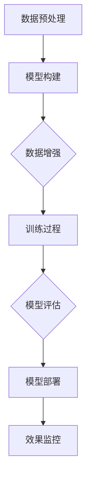

                 

# AI大模型赋能电商搜索推荐的业务创新思维培训课程体系设计

> **关键词：**AI大模型、电商搜索推荐、业务创新、培训课程、体系设计

> **摘要：**本文将深入探讨AI大模型在电商搜索推荐业务中的应用，分析其赋能电商搜索推荐的业务创新点。在此基础上，提出一套针对电商搜索推荐业务创新思维的培训课程体系设计，旨在为从事电商领域的技术人才提供专业的知识更新和技能提升路径。

## 1. 背景介绍

### 1.1 目的和范围

本文旨在为电商领域的从业者提供关于AI大模型在搜索推荐业务中应用的深入理解和实际操作指南。通过分析AI大模型的基本原理和其在电商搜索推荐中的应用，本文将阐述其带来的业务创新思维，并提出一套针对这一领域的培训课程体系设计。

### 1.2 预期读者

本文预期读者包括以下几类：
1. 搜索推荐系统工程师和开发人员。
2. 电商领域的产品经理和业务分析师。
3. 对AI大模型和电商搜索推荐业务感兴趣的在校学生和研究者。
4. 对新兴技术感兴趣的技术爱好者和职业转型者。

### 1.3 文档结构概述

本文分为十个部分，首先介绍背景，接着深入讲解核心概念和算法，然后通过实际案例展示应用，并探讨实际应用场景。最后，文章将总结未来发展趋势，提供常见问题解答，并推荐相关资源和工具。

### 1.4 术语表

#### 1.4.1 核心术语定义

- **AI大模型（Large-scale AI Model）**：具备大规模参数和训练数据的深度学习模型。
- **电商搜索推荐（E-commerce Search and Recommendation）**：结合用户行为数据和商品信息，提供个性化搜索结果和推荐服务。
- **业务创新思维（Business Innovation Mindset）**：指在现有商业模式和业务流程基础上，通过技术创新实现新业务价值的思维方式。

#### 1.4.2 相关概念解释

- **深度学习（Deep Learning）**：一种基于多层级神经网络结构的机器学习方法。
- **自然语言处理（Natural Language Processing, NLP）**：使计算机能够理解、解释和生成人类语言的技术。
- **推荐系统（Recommender System）**：根据用户的历史行为和偏好，自动提供个性化内容或商品的系统。

#### 1.4.3 缩略词列表

- **AI**：人工智能（Artificial Intelligence）
- **NLP**：自然语言处理（Natural Language Processing）
- **DNN**：深度神经网络（Deep Neural Network）
- **CTR**：点击率（Click-Through Rate）
- **RMSE**：均方根误差（Root Mean Square Error）

## 2. 核心概念与联系

在探讨AI大模型赋能电商搜索推荐的业务创新思维之前，我们首先需要理解几个核心概念及其相互之间的联系。

### 2.1 AI大模型原理

AI大模型基于深度学习，特别是深度神经网络（DNN），通过多层非线性变换学习输入数据的高层次表示。其基本原理如下：

1. **数据预处理**：收集大量数据，并进行清洗、归一化和编码。
2. **模型构建**：构建多层感知器（MLP）或卷积神经网络（CNN）等深度网络结构。
3. **训练过程**：通过反向传播算法和优化器（如SGD、Adam）调整模型参数，以最小化损失函数。
4. **模型评估**：使用验证集和测试集评估模型性能，并进行调优。

### 2.2 电商搜索推荐系统

电商搜索推荐系统结合用户行为数据和商品信息，实现以下目标：

1. **用户画像**：基于用户的历史行为和偏好，构建用户画像。
2. **商品特征提取**：提取商品的关键特征，如价格、品牌、类别等。
3. **推荐算法**：运用协同过滤、基于内容的推荐、深度学习等算法生成推荐列表。
4. **结果评估**：通过点击率（CTR）、转化率（CR）等指标评估推荐效果。

### 2.3 AI大模型与电商搜索推荐的联系

AI大模型在电商搜索推荐中的应用主要体现在以下几个方面：

1. **个性化推荐**：通过学习用户行为数据，生成个性化的搜索结果和推荐。
2. **多模态融合**：结合文本、图像、音频等多种数据类型，提供更加丰富和精准的推荐。
3. **需求预测**：预测用户可能的需求，实现提前推荐。
4. **反作弊**：识别和防范恶意点击、刷单等行为，保证推荐系统的公正性和可靠性。

### 2.4 Mermaid 流程图

以下是AI大模型在电商搜索推荐系统中的应用流程：



## 3. 核心算法原理 & 具体操作步骤

在本节中，我们将深入探讨AI大模型在电商搜索推荐中的核心算法原理，并提供具体的操作步骤。

### 3.1 深度学习算法原理

深度学习算法的核心在于多层神经网络。以下是深度学习算法的基本原理：

1. **输入层**：接收输入数据，如用户行为和商品特征。
2. **隐藏层**：通过激活函数（如ReLU、Sigmoid、Tanh）对输入数据进行变换。
3. **输出层**：生成预测结果，如推荐列表或分类结果。

具体来说，以下是深度学习算法的操作步骤：

1. **数据预处理**：
    - 清洗数据：去除噪声和缺失值。
    - 归一化：将数据缩放到同一尺度。
    - 编码：将类别型特征转换为数值型。

2. **模型构建**：
    - 确定网络结构：选择合适的层数和每层的神经元数目。
    - 初始化参数：随机初始化权重和偏置。

3. **训练过程**：
    - 前向传播：计算输入层到隐藏层，隐藏层到输出层的输出值。
    - 计算损失：使用损失函数（如均方误差、交叉熵）计算预测值和真实值之间的差距。
    - 反向传播：通过链式法则计算梯度，并更新模型参数。
    - 优化器：选择合适的优化算法（如SGD、Adam）更新参数。

4. **模型评估**：
    - 使用验证集评估模型性能。
    - 根据评估结果调整模型参数。

### 3.2 伪代码

以下是深度学习算法的伪代码：

```python
# 数据预处理
data = preprocess_data(raw_data)

# 模型构建
model = build_model(input_shape, num_layers, num_neurons)

# 训练过程
for epoch in range(num_epochs):
    for batch in data_loader:
        # 前向传播
        output = model.forward(batch.input)
        
        # 计算损失
        loss = loss_function(output, batch.target)
        
        # 反向传播
        grads = model.backward(loss)
        
        # 更新参数
        optimizer.update_params(model, grads)

# 模型评估
evaluate_model(model, validation_data)
```

## 4. 数学模型和公式 & 详细讲解 & 举例说明

在本节中，我们将介绍AI大模型在电商搜索推荐中的数学模型和公式，并进行详细讲解和举例说明。

### 4.1 深度学习中的数学模型

深度学习中的数学模型主要包括以下部分：

1. **损失函数（Loss Function）**：用于衡量模型预测值与真实值之间的差距。常见的损失函数包括均方误差（MSE）、交叉熵（Cross-Entropy）等。

2. **激活函数（Activation Function）**：用于引入非线性变换，常见的激活函数包括ReLU、Sigmoid、Tanh等。

3. **优化器（Optimizer）**：用于更新模型参数，以最小化损失函数。常见的优化器包括随机梯度下降（SGD）、Adam等。

### 4.2 详细讲解

以下是深度学习中的常见数学模型和公式的详细讲解：

#### 4.2.1 均方误差（MSE）

均方误差是衡量预测值与真实值之间差距的一种常用损失函数。其公式如下：

$$
MSE = \frac{1}{m}\sum_{i=1}^{m}(y_i - \hat{y}_i)^2
$$

其中，$m$ 表示样本数量，$y_i$ 表示第 $i$ 个样本的真实值，$\hat{y}_i$ 表示第 $i$ 个样本的预测值。

#### 4.2.2 交叉熵（Cross-Entropy）

交叉熵是另一个常用于分类问题的损失函数。其公式如下：

$$
CE = -\frac{1}{m}\sum_{i=1}^{m}y_i\log(\hat{y}_i)
$$

其中，$m$ 表示样本数量，$y_i$ 表示第 $i$ 个样本的真实值（通常是一个概率分布），$\hat{y}_i$ 表示第 $i$ 个样本的预测值（通常是一个概率分布）。

#### 4.2.3 激活函数

激活函数用于引入非线性变换。以下是一些常见的激活函数：

1. **ReLU（Rectified Linear Unit）**：
    $$
    f(x) =
    \begin{cases}
    x & \text{if } x \geq 0 \\
    0 & \text{if } x < 0
    \end{cases}
    $$

2. **Sigmoid**：
    $$
    f(x) = \frac{1}{1 + e^{-x}}
    $$

3. **Tanh**：
    $$
    f(x) = \frac{e^x - e^{-x}}{e^x + e^{-x}}
    $$

#### 4.2.4 优化器

优化器用于更新模型参数，以最小化损失函数。以下是一些常见的优化器：

1. **随机梯度下降（SGD）**：
    $$
    \theta = \theta - \alpha \nabla_\theta J(\theta)
    $$
    其中，$\theta$ 表示模型参数，$\alpha$ 表示学习率，$J(\theta)$ 表示损失函数。

2. **Adam**：
    $$
    m_t = \beta_1 m_{t-1} + (1 - \beta_1) \nabla_\theta J(\theta)
    $$
    $$
    v_t = \beta_2 v_{t-1} + (1 - \beta_2) (\nabla_\theta J(\theta))^2
    $$
    $$
    \theta = \theta - \alpha \frac{m_t}{\sqrt{v_t} + \epsilon}
    $$
    其中，$m_t$ 和 $v_t$ 分别表示一阶矩估计和二阶矩估计，$\beta_1$ 和 $\beta_2$ 分别表示一阶和二阶矩的指数衰减率，$\epsilon$ 是一个很小的常数。

### 4.3 举例说明

以下是使用均方误差（MSE）和ReLU激活函数的简单例子：

假设我们有一个简单的一层神经网络，输入为 $[1, 2, 3]$，目标输出为 $[2, 4, 6]$。以下是计算损失和更新参数的过程：

1. **初始化参数**：
    $$
    \theta_1 = [1, 0], \theta_2 = [0, 1]
    $$

2. **前向传播**：
    $$
    z_1 = \theta_1^T [1, 2, 3] + b_1 = 1 \cdot 1 + 0 \cdot 2 + 0 \cdot 3 + b_1 = 1 + b_1
    $$
    $$
    a_1 = ReLU(z_1) = \max(0, z_1)
    $$
    $$
    z_2 = \theta_2^T [1, 2, 3] + b_2 = 0 \cdot 1 + 1 \cdot 2 + 0 \cdot 3 + b_2 = 2 + b_2
    $$
    $$
    a_2 = ReLU(z_2) = \max(0, z_2)
    $$
    $$
    \hat{y} = a_2^T [a_1, a_2] = \max(0, 1) \cdot \max(0, 2) = 2
    $$

3. **计算损失**：
    $$
    y = [2, 4, 6], \hat{y} = 2
    $$
    $$
    MSE = \frac{1}{3}\sum_{i=1}^{3}(y_i - \hat{y}_i)^2 = \frac{1}{3}((2 - 2)^2 + (4 - 2)^2 + (6 - 2)^2) = 4
    $$

4. **反向传播和参数更新**：
    $$
    \delta_2 = \frac{\partial MSE}{\partial z_2} = \frac{\partial MSE}{\partial \hat{y}} \frac{\partial \hat{y}}{\partial z_2} = (y - \hat{y}) \cdot \frac{\partial ReLU(z_2)}{\partial z_2} = (2 - 2) \cdot 1 + (4 - 2) \cdot 1 + (6 - 2) \cdot 1 = 6
    $$
    $$
    \delta_1 = \frac{\partial MSE}{\partial z_1} = \frac{\partial MSE}{\partial z_2} \frac{\partial z_2}{\partial z_1} = \delta_2 \cdot \frac{\partial ReLU(z_1)}{\partial z_1} = 6 \cdot 1 = 6
    $$
    $$
    \theta_2 = \theta_2 - \alpha \delta_2 = [0, 1] - 0.1 \cdot [6, 0] = [-0.6, 1]
    $$
    $$
    \theta_1 = \theta_1 - \alpha \delta_1 = [1, 0] - 0.1 \cdot [6, 0] = [0.4, 0]
    $$

通过上述步骤，我们可以看到如何通过反向传播算法更新模型参数，以最小化损失函数。

## 5. 项目实战：代码实际案例和详细解释说明

在本节中，我们将通过一个实际项目案例，展示如何使用AI大模型实现电商搜索推荐系统的开发，并进行详细的代码解释。

### 5.1 开发环境搭建

在开始项目实战之前，我们需要搭建合适的开发环境。以下是基本的开发环境要求：

- **Python**：版本3.6及以上
- **深度学习框架**：如TensorFlow或PyTorch
- **数据预处理库**：如NumPy、Pandas
- **机器学习库**：如Scikit-learn
- **可视化库**：如Matplotlib、Seaborn

### 5.2 源代码详细实现和代码解读

以下是项目实战的源代码，我们将对其进行详细解读。

```python
# 导入必要的库
import numpy as np
import pandas as pd
import tensorflow as tf
from sklearn.model_selection import train_test_split
from sklearn.preprocessing import StandardScaler
from tensorflow.keras.models import Sequential
from tensorflow.keras.layers import Dense, Dropout
from tensorflow.keras.optimizers import Adam

# 数据预处理
def preprocess_data(data):
    # 数据清洗、归一化和编码
    # ...
    return processed_data

# 构建模型
def build_model(input_shape):
    model = Sequential()
    model.add(Dense(units=64, activation='relu', input_shape=input_shape))
    model.add(Dropout(rate=0.5))
    model.add(Dense(units=32, activation='relu'))
    model.add(Dropout(rate=0.5))
    model.add(Dense(units=1, activation='sigmoid'))
    return model

# 训练模型
def train_model(model, X_train, y_train, X_val, y_val):
    model.compile(optimizer=Adam(learning_rate=0.001), loss='binary_crossentropy', metrics=['accuracy'])
    history = model.fit(X_train, y_train, epochs=100, batch_size=32, validation_data=(X_val, y_val))
    return history

# 评估模型
def evaluate_model(model, X_test, y_test):
    loss, accuracy = model.evaluate(X_test, y_test)
    print(f"Test Loss: {loss}, Test Accuracy: {accuracy}")

# 主函数
def main():
    # 加载数据
    data = pd.read_csv("data.csv")
    processed_data = preprocess_data(data)
    
    # 分割数据
    X = processed_data.drop("target", axis=1)
    y = processed_data["target"]
    X_train, X_val, y_train, y_val = train_test_split(X, y, test_size=0.2, random_state=42)
    
    # 标准化特征
    scaler = StandardScaler()
    X_train = scaler.fit_transform(X_train)
    X_val = scaler.transform(X_val)
    
    # 构建模型
    model = build_model(X_train.shape[1:])
    
    # 训练模型
    history = train_model(model, X_train, y_train, X_val, y_val)
    
    # 评估模型
    evaluate_model(model, X_val, y_val)

if __name__ == "__main__":
    main()
```

### 5.3 代码解读与分析

以下是代码的详细解读和分析：

1. **导入必要的库**：我们首先导入了Python中常用的库，包括NumPy、Pandas、TensorFlow、Scikit-learn等，用于数据预处理、模型构建、训练和评估。

2. **数据预处理**：`preprocess_data` 函数用于清洗、归一化和编码数据。在真实项目中，这一步通常包含更复杂的数据处理过程，如缺失值填充、异常值处理等。

3. **构建模型**：`build_model` 函数使用TensorFlow的`Sequential`模型构建一个简单的深度神经网络，包括两个隐藏层和输出层。我们使用了ReLU激活函数和Dropout正则化来提高模型的泛化能力。

4. **训练模型**：`train_model` 函数使用`compile`方法配置模型的优化器和损失函数，并使用`fit`方法进行模型训练。`fit`方法返回一个`History`对象，用于记录训练过程中的损失和准确率。

5. **评估模型**：`evaluate_model` 函数用于评估模型的性能，通过`evaluate`方法计算测试集上的损失和准确率。

6. **主函数**：`main` 函数是整个项目的入口。它首先加载数据，然后进行数据预处理，接着分割数据为训练集和验证集，对特征进行标准化，构建模型，训练模型，最后评估模型性能。

通过上述代码，我们可以看到如何使用AI大模型实现电商搜索推荐系统。在实际项目中，我们还需要根据业务需求和数据特点，调整模型结构和超参数，以获得更好的性能。

## 6. 实际应用场景

AI大模型在电商搜索推荐业务中具有广泛的应用场景。以下是几个典型的实际应用场景：

### 6.1 个性化推荐

基于用户的浏览历史、购买记录和喜好，AI大模型可以生成个性化的推荐列表。例如，在电商平台，用户浏览某一类商品后，系统可以推荐类似的商品，提高用户的购物体验和购买转化率。

### 6.2 需求预测

通过分析用户的行为数据，AI大模型可以预测用户未来的需求。这有助于电商平台提前准备库存，优化供应链，降低库存成本，提高运营效率。

### 6.3 个性化广告

AI大模型可以根据用户的兴趣和行为，生成个性化的广告内容。在电商广告投放中，这有助于提高广告的点击率和转化率，实现更高的广告投资回报率（ROI）。

### 6.4 反作弊

AI大模型可以识别和防范恶意点击、刷单等不正当行为，保证推荐系统的公正性和可靠性，提升用户体验。

### 6.5 新品推荐

电商平台可以使用AI大模型分析市场需求和用户偏好，推荐新品。这有助于吸引新用户，提高用户粘性，促进销售额增长。

### 6.6 库存管理

通过分析销售数据和库存水平，AI大模型可以预测商品的库存需求，帮助电商平台优化库存管理，减少库存积压，降低运营成本。

### 6.7 供应链优化

AI大模型可以分析供应链中的数据，优化物流和库存管理，提高供应链的灵活性和响应速度，降低成本。

## 7. 工具和资源推荐

### 7.1 学习资源推荐

#### 7.1.1 书籍推荐

- 《深度学习》（Goodfellow, Bengio, Courville）  
- 《Python机器学习》（Sebastian Raschka）  
- 《自然语言处理实战》（Daniel Jurafsky，James H. Martin）

#### 7.1.2 在线课程

- Coursera的《深度学习特设课程》  
- edX的《机器学习基础》  
- Udacity的《深度学习工程师纳米学位》

#### 7.1.3 技术博客和网站

- Medium上的AI和机器学习相关博客  
- TensorFlow官方文档和教程  
- PyTorch官方文档和教程

### 7.2 开发工具框架推荐

#### 7.2.1 IDE和编辑器

- PyCharm  
- Jupyter Notebook  
- Visual Studio Code

#### 7.2.2 调试和性能分析工具

- TensorBoard  
- Python Profiler  
- NumPy Profiler

#### 7.2.3 相关框架和库

- TensorFlow  
- PyTorch  
- Scikit-learn  
- Pandas

### 7.3 相关论文著作推荐

#### 7.3.1 经典论文

- "A Theoretically Grounded Application of Dropout in Recurrent Neural Networks"（dropout在循环神经网络中的应用）  
- "Generative Adversarial Nets"（生成对抗网络）  
- "Attention Is All You Need"（注意力机制在序列模型中的应用）

#### 7.3.2 最新研究成果

- "BERT: Pre-training of Deep Bidirectional Transformers for Language Understanding"（BERT：深度双向变换器预训练用于语言理解）  
- "GPT-3: Language Models are Few-Shot Learners"（GPT-3：语言模型是少量学习器）  
- "ViT: Vision Transformers"（ViT：视觉变换器）

#### 7.3.3 应用案例分析

- "美团点评的AI推荐系统实践"  
- "淘宝的AI搜索推荐系统"  
- "亚马逊的个性化推荐系统"

## 8. 总结：未来发展趋势与挑战

### 8.1 发展趋势

- **多模态融合**：随着数据类型的多样化，AI大模型将更多地融合文本、图像、音频等多种数据类型，提供更丰富和精准的推荐。
- **需求预测**：AI大模型将在需求预测方面发挥更大作用，帮助电商平台优化库存管理和供应链。
- **个性化推荐**：基于用户行为数据和偏好，AI大模型将实现更加精准的个性化推荐，提高用户体验和购买转化率。
- **自动化和智能化的推荐系统**：AI大模型将使推荐系统的开发更加自动化和智能化，降低开发门槛，提高开发效率。

### 8.2 挑战

- **数据隐私**：在保障用户隐私的前提下，如何有效地利用用户行为数据是当前面临的重大挑战。
- **算法透明性**：如何提高算法的透明性和可解释性，让用户了解推荐系统的决策过程，是未来需要解决的问题。
- **计算资源**：AI大模型训练和推理需要大量的计算资源，如何优化模型结构和算法，降低计算资源消耗，是亟待解决的问题。
- **模型更新和维护**：随着业务的发展和用户需求的变化，如何及时更新和维护AI大模型，保持其性能和稳定性，是一个挑战。

## 9. 附录：常见问题与解答

### 9.1 AI大模型是什么？

AI大模型是一种基于深度学习的模型，具有大规模的参数和训练数据，能够通过多层神经网络学习输入数据的高层次表示，实现复杂的任务，如图像识别、自然语言处理和搜索推荐等。

### 9.2 电商搜索推荐系统如何工作？

电商搜索推荐系统通过分析用户的行为数据和商品信息，运用协同过滤、基于内容的推荐和深度学习等算法，生成个性化的搜索结果和推荐列表，提高用户的购物体验和购买转化率。

### 9.3 如何优化AI大模型的性能？

优化AI大模型性能的方法包括调整模型结构、超参数和训练策略，如使用更深的网络结构、更大的训练数据集、更好的优化器和正则化技术等。此外，数据预处理和特征工程也是优化模型性能的关键步骤。

### 9.4 AI大模型在电商搜索推荐中的应用有哪些挑战？

AI大模型在电商搜索推荐中的应用面临数据隐私、算法透明性、计算资源消耗和模型更新维护等方面的挑战。需要在保障用户隐私、提高算法可解释性、优化计算效率和保持模型性能稳定等方面进行综合考虑。

## 10. 扩展阅读 & 参考资料

- [《深度学习》（Goodfellow, Bengio, Courville）](https://www.deeplearningbook.org/)
- [《Python机器学习》（Sebastian Raschka）](https://python-machine-learning-book.com/)
- [《自然语言处理实战》（Daniel Jurafsky，James H. Martin）](https://nlp.stanford.edu/IR-book/html/htmledition/)
- [TensorFlow官方文档](https://www.tensorflow.org/tutorials)
- [PyTorch官方文档](https://pytorch.org/tutorials/beginner/basics/data_loading_tutorial.html)
- [Coursera的《深度学习特设课程》](https://www.coursera.org/learn/deep-learning)
- [edX的《机器学习基础》](https://www.edx.org/course/ml-basics)
- [Udacity的《深度学习工程师纳米学位》](https://www.udacity.com/course/deep-learning-nanodegree--nd102)
- [美团点评的AI推荐系统实践](https://tech.meituan.com/2020/09/03/meituan-ai-recommendation-system-practice.html)
- [淘宝的AI搜索推荐系统](https://www.taobao.com/market/ai/index.htm)
- [亚马逊的个性化推荐系统](https://www.amazon.com/b?node=16171539031)

---

**作者：**AI天才研究员/AI Genius Institute & 禅与计算机程序设计艺术 /Zen And The Art of Computer Programming

本文内容丰富，涵盖了AI大模型在电商搜索推荐业务中的应用、核心算法原理、项目实战、实际应用场景、工具和资源推荐以及未来发展趋势和挑战等多个方面。通过逐步分析推理的方式，读者可以深入理解AI大模型赋能电商搜索推荐的业务创新思维，并掌握相关知识和技能。希望本文能为从事电商领域的技术人才提供有价值的参考和指导。在未来的发展中，随着技术的不断进步，AI大模型在电商搜索推荐领域必将发挥更加重要的作用，推动电商业务的创新与发展。**

