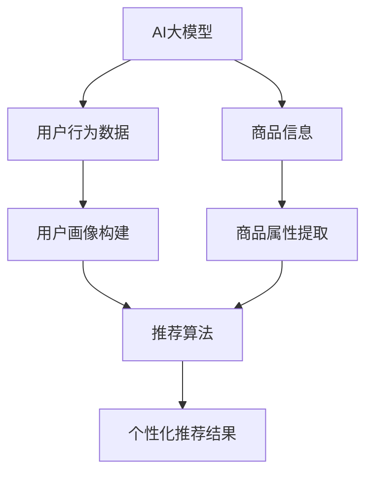

                 

# AI大模型赋能电商搜索推荐的业务创新思维导图应用培训课程设计

> **关键词**：AI大模型，电商搜索推荐，业务创新，思维导图，培训课程

> **摘要**：本文旨在探讨如何利用AI大模型赋能电商搜索推荐业务，并设计一套完整的业务创新思维导图应用培训课程。通过对核心概念、算法原理、数学模型以及实际应用场景的详细分析，文章旨在为从事电商搜索推荐业务的技术人员提供系统化的学习与实践路径。

## 1. 背景介绍

### 1.1 目的和范围

本文的目的在于解析AI大模型在电商搜索推荐中的关键作用，并设计一套应用培训课程，旨在提升从业者在电商搜索推荐领域的业务创新能力。课程将涵盖从基本概念到高级应用的全方位内容，包括算法原理、模型训练、数据处理、业务策略等。

本文的讨论范围包括：

1. **AI大模型的概念**：介绍大模型的定义、发展历程和常见类型。
2. **电商搜索推荐业务**：探讨搜索推荐系统的基本架构和运行机制。
3. **业务创新思维导图**：介绍思维导图工具及其在培训课程设计中的应用。
4. **课程内容设计**：详述课程结构和各个模块的内容。

### 1.2 预期读者

本文适合以下读者群体：

1. **电商搜索推荐系统开发者**：希望提升搜索推荐效果，探索业务创新途径。
2. **数据科学家和机器学习工程师**：对AI大模型在电商领域的应用感兴趣。
3. **产品经理和业务分析师**：关注业务增长和用户体验优化。
4. **教育培训者**：需要设计或参与AI和电商相关培训课程。

### 1.3 文档结构概述

本文将分为以下几个部分：

1. **背景介绍**：本文的目的、范围、预期读者及文档结构概述。
2. **核心概念与联系**：AI大模型和电商搜索推荐的相关概念及架构。
3. **核心算法原理 & 具体操作步骤**：详细介绍算法原理和操作步骤。
4. **数学模型和公式 & 详细讲解 & 举例说明**：讲解数学模型和相关公式。
5. **项目实战：代码实际案例和详细解释说明**：实际项目案例和代码实现。
6. **实际应用场景**：探讨AI大模型在电商搜索推荐中的应用。
7. **工具和资源推荐**：学习资源、开发工具框架和论文著作推荐。
8. **总结：未来发展趋势与挑战**：展望AI大模型在电商搜索推荐领域的未来。
9. **附录：常见问题与解答**：常见问题的解答。
10. **扩展阅读 & 参考资料**：提供进一步学习的资源。

### 1.4 术语表

#### 1.4.1 核心术语定义

- **AI大模型**：指参数规模达到亿级别以上的深度学习模型。
- **电商搜索推荐**：电商平台上通过用户行为数据、商品信息等生成个性化推荐结果。
- **思维导图**：一种表达思维和信息的图形工具，通过分支结构展现概念间的关系。

#### 1.4.2 相关概念解释

- **深度学习**：一种机器学习技术，通过模拟人脑神经网络进行数据分析和预测。
- **用户行为数据**：用户的浏览、点击、购买等行为记录。
- **商品信息**：包括商品标题、描述、价格、库存等详细信息。

#### 1.4.3 缩略词列表

- **AI**：人工智能（Artificial Intelligence）
- **ML**：机器学习（Machine Learning）
- **DL**：深度学习（Deep Learning）
- **NLP**：自然语言处理（Natural Language Processing）
- **CVR**：点击转化率（Click-Through Rate）

## 2. 核心概念与联系

首先，我们需要理解AI大模型和电商搜索推荐业务之间的核心概念和联系。以下是相关的概念和其间的关联：

### 2.1 AI大模型的概念

AI大模型通常是指参数规模达到亿级别以上的深度学习模型。这些模型具有强大的表征和学习能力，能够在大量数据中进行高效的学习和预测。常见的大模型类型包括：

- **BERT（Bidirectional Encoder Representations from Transformers）**：一种用于自然语言处理的预训练模型，通过双向Transformer架构进行文本数据的建模。
- **GPT（Generative Pre-trained Transformer）**：一种用于自然语言生成的预训练模型，具有强大的文本生成和翻译能力。
- **Transformer**：一种基于自注意力机制的深度学习模型架构，广泛用于处理序列数据。

### 2.2 电商搜索推荐业务

电商搜索推荐业务是电商平台的核心功能之一，旨在根据用户行为和商品信息生成个性化推荐结果。其主要组成部分包括：

- **用户行为数据**：用户的浏览、点击、购买等行为记录，用于构建用户画像和兴趣标签。
- **商品信息**：包括商品标题、描述、价格、库存等详细信息，用于构建商品画像和属性标签。
- **推荐算法**：基于用户和商品画像的相似性匹配、协同过滤、基于内容的推荐等算法，生成个性化推荐结果。

### 2.3 AI大模型与电商搜索推荐业务的联系

AI大模型在电商搜索推荐业务中发挥着关键作用，主要表现在以下几个方面：

- **用户画像构建**：AI大模型可以高效地分析用户行为数据，构建细致的用户画像和兴趣标签，用于个性化推荐。
- **商品属性提取**：AI大模型可以深入理解商品信息，提取商品的关键属性和特征，用于推荐算法的输入。
- **推荐效果优化**：AI大模型可以用于训练和优化推荐算法，提高推荐效果和用户满意度。

### 2.4 关联Mermaid流程图

为了更好地理解AI大模型与电商搜索推荐业务之间的关联，我们可以使用Mermaid流程图来展示其核心概念和流程。



在上述流程图中，AI大模型通过分析用户行为数据和商品信息，构建用户画像和商品属性，然后将这些信息输入到推荐算法中，最终生成个性化推荐结果。

通过以上分析，我们可以看到AI大模型在电商搜索推荐业务中的关键作用。接下来，我们将深入探讨AI大模型的算法原理和操作步骤。

## 3. 核心算法原理 & 具体操作步骤

### 3.1 AI大模型的算法原理

AI大模型的算法原理主要基于深度学习和神经网络，通过大规模参数和复杂的网络结构来模拟人脑的思考和学习过程。以下是一个典型的AI大模型算法原理的讲解，我们将使用伪代码来详细阐述。

#### 3.1.1 深度学习基础

深度学习是一种基于多层神经网络的机器学习技术，它通过多层的非线性变换来提取数据中的特征。

```python
# 深度学习基础伪代码
class NeuralLayer:
    def __init__(self, input_size, output_size):
        self.weights = np.random.randn(input_size, output_size)
        self.biases = np.random.randn(output_size)
        
    def forward(self, x):
        return sigmoid(np.dot(x, self.weights) + self.biases)

def sigmoid(x):
    return 1 / (1 + np.exp(-x))
```

#### 3.1.2 神经网络架构

神经网络由多个层级组成，包括输入层、隐藏层和输出层。每个层级之间通过权重和偏置进行连接。

```python
# 神经网络架构伪代码
class NeuralNetwork:
    def __init__(self, layers):
        self.layers = layers
        
    def forward(self, x):
        for layer in self.layers:
            x = layer.forward(x)
        return x

# 示例神经网络
layers = [
    NeuralLayer(input_size, hidden_size),
    NeuralLayer(hidden_size, hidden_size),
    NeuralLayer(hidden_size, output_size)
]

nn = NeuralNetwork(layers)
output = nn.forward(input_data)
```

#### 3.1.3 AI大模型

AI大模型是指在神经网络中引入大量的参数和多层结构，以提高模型的表征和学习能力。

```python
# AI大模型伪代码
class BigNeuralNetwork:
    def __init__(self, layer_sizes):
        self.layers = [NeuralLayer(input_size, hidden_size) for hidden_size in layer_sizes]
        
    def forward(self, x):
        for layer in self.layers:
            x = layer.forward(x)
        return x

# 示例AI大模型
layer_sizes = [input_size, hidden_size1, hidden_size2, hidden_size3, output_size]
bnn = BigNeuralNetwork(layer_sizes)
output = bnn.forward(input_data)
```

### 3.2 AI大模型的具体操作步骤

AI大模型的具体操作步骤包括数据预处理、模型训练、模型评估和模型部署。以下是每个步骤的详细讲解：

#### 3.2.1 数据预处理

数据预处理是AI大模型训练的基础，主要包括数据清洗、数据归一化和数据划分。

```python
# 数据预处理伪代码
def preprocess_data(data):
    # 数据清洗
    clean_data = clean_data(data)
    
    # 数据归一化
    normalized_data = normalize_data(clean_data)
    
    # 数据划分
    train_data, val_data, test_data = split_data(normalized_data)
    
    return train_data, val_data, test_data

# 示例数据预处理
data = load_data("data.csv")
train_data, val_data, test_data = preprocess_data(data)
```

#### 3.2.2 模型训练

模型训练是AI大模型的核心步骤，包括前向传播、反向传播和参数更新。

```python
# 模型训练伪代码
def train_model(model, train_data, epochs):
    for epoch in range(epochs):
        for x, y in train_data:
            # 前向传播
            output = model.forward(x)
            
            # 计算损失
            loss = compute_loss(output, y)
            
            # 反向传播
            model.backward(output, y)
            
            # 更新参数
            model.update_params()
            
        print(f"Epoch {epoch}: Loss = {loss}")
        
# 示例模型训练
model = BigNeuralNetwork(layer_sizes)
train_model(model, train_data, epochs=10)
```

#### 3.2.3 模型评估

模型评估是检验AI大模型性能的重要步骤，包括准确率、召回率、F1分数等指标。

```python
# 模型评估伪代码
def evaluate_model(model, test_data):
    correct = 0
    total = 0
    for x, y in test_data:
        output = model.forward(x)
        prediction = np.argmax(output)
        if prediction == y:
            correct += 1
        total += 1
    accuracy = correct / total
    return accuracy

# 示例模型评估
accuracy = evaluate_model(model, test_data)
print(f"Test Accuracy: {accuracy}")
```

#### 3.2.4 模型部署

模型部署是将训练好的AI大模型应用到实际业务中，包括模型加载、预测和结果输出。

```python
# 模型部署伪代码
def deploy_model(model):
    # 加载模型
    model.load_weights("model_weights.h5")
    
    # 预测
    def predict(x):
        return model.forward(x)
    
    # 结果输出
    def output_result(prediction):
        if prediction == 1:
            print("Positive")
        else:
            print("Negative")
    
    # 示例预测和输出结果
    input_data = load_data("input.csv")
    prediction = predict(input_data)
    output_result(prediction)
```

通过以上步骤，我们可以构建并部署一个AI大模型，以应对电商搜索推荐业务的需求。

## 4. 数学模型和公式 & 详细讲解 & 举例说明

在深度学习领域，数学模型和公式是理解和实现AI大模型的基础。本节我们将详细介绍AI大模型中的核心数学模型和公式，并通过具体例子来说明其应用。

### 4.1 前向传播

前向传播是深度学习模型的核心步骤，用于计算网络输出。以下是一个典型的前向传播过程的详细讲解。

#### 4.1.1 激活函数

激活函数是神经网络中的一个关键组件，用于引入非线性变换。最常用的激活函数是Sigmoid、ReLU和Tanh。

- **Sigmoid函数**：
  $$\sigma(x) = \frac{1}{1 + e^{-x}}$$
  Sigmoid函数将输入映射到(0, 1)区间，常用于二分类问题。

- **ReLU函数**：
  $$\text{ReLU}(x) = \max(0, x)$$
 ReLU函数在x为正时返回x，为零时返回零，具有快速收敛的特性。

- **Tanh函数**：
  $$\text{Tanh}(x) = \frac{e^{x} - e^{-x}}{e^{x} + e^{-x}}$$
  Tanh函数将输入映射到(-1, 1)区间，具有稳定的梯度。

#### 4.1.2 前向传播公式

前向传播的核心公式包括输入层、隐藏层和输出层的计算。

1. **输入层到隐藏层**：
   $$z_{l} = \sum_{i} w_{li} x_i + b_l$$
   $$a_{l} = \text{激活函数}(z_{l})$$

   其中，$w_{li}$是权重，$b_l$是偏置，$x_i$是输入特征，$a_l$是激活值。

2. **隐藏层到输出层**：
   $$z_{L} = \sum_{i} w_{Li} a_{l} + b_L$$
   $$\hat{y} = \text{激活函数}(z_{L})$$

   其中，$\hat{y}$是模型输出。

#### 4.1.3 示例

假设一个简单的神经网络，输入层有3个特征，隐藏层有2个神经元，输出层有1个神经元，激活函数使用ReLU。

- 输入层：$x_1, x_2, x_3$
- 权重矩阵：$W_1, W_2, W_3$
- 偏置：$b_1, b_2, b_L$
- 激活函数：ReLU

前向传播计算过程如下：

$$z_1 = W_{11}x_1 + W_{12}x_2 + W_{13}x_3 + b_1$$
$$a_1 = \max(0, z_1)$$

$$z_2 = W_{21}x_1 + W_{22}x_2 + W_{23}x_3 + b_2$$
$$a_2 = \max(0, z_2)$$

$$z_L = W_{L1}a_1 + W_{L2}a_2 + b_L$$
$$\hat{y} = \max(0, z_L)$$

### 4.2 反向传播

反向传播是深度学习训练过程中的关键步骤，用于计算损失函数关于模型参数的梯度。以下是一个典型的反向传播过程的详细讲解。

#### 4.2.1 损失函数

常见的损失函数包括均方误差（MSE）、交叉熵（Cross-Entropy）和Hinge损失。

- **均方误差（MSE）**：
  $$\text{MSE}(y, \hat{y}) = \frac{1}{2} \sum_{i} (y_i - \hat{y}_i)^2$$
  MSE用于回归问题，计算实际输出与预测输出之间的均方误差。

- **交叉熵（Cross-Entropy）**：
  $$\text{Cross-Entropy}(y, \hat{y}) = -\sum_{i} y_i \log(\hat{y}_i)$$
  Cross-Entropy用于分类问题，计算实际输出与预测输出之间的交叉熵。

- **Hinge损失**：
  $$\text{Hinge Loss}(y, \hat{y}) = \max(0, 1 - y \hat{y})$$
  Hinge Loss用于支持向量机（SVM）等分类问题。

#### 4.2.2 反向传播公式

反向传播的核心公式包括前向传播的逆过程，即从输出层到输入层的反向计算梯度。

1. **输出层梯度**：
   $$\frac{\partial L}{\partial z_L} = \frac{\partial L}{\partial \hat{y}} \cdot \frac{\partial \hat{y}}{\partial z_L}$$
   $$\frac{\partial L}{\partial W_L} = \frac{\partial L}{\partial z_L} \cdot a_{l}$$
   $$\frac{\partial L}{\partial b_L} = \frac{\partial L}{\partial z_L}$$

2. **隐藏层梯度**：
   $$\frac{\partial L}{\partial z_l} = \frac{\partial L}{\partial a_{l+1}} \cdot \frac{\partial a_{l+1}}{\partial z_l}$$
   $$\frac{\partial L}{\partial W_{l+1}} = \frac{\partial L}{\partial z_l} \cdot a_l$$
   $$\frac{\partial L}{\partial b_{l+1}} = \frac{\partial L}{\partial z_l}$$

3. **输入层梯度**：
   $$\frac{\partial L}{\partial x_i} = \sum_{l} \frac{\partial L}{\partial z_l} \cdot \frac{\partial z_l}{\partial x_i}$$

#### 4.2.3 示例

假设我们有一个简单的神经网络，输入层有3个特征，隐藏层有2个神经元，输出层有1个神经元，使用ReLU激活函数和交叉熵损失。

- 输入层：$x_1, x_2, x_3$
- 权重矩阵：$W_1, W_2, W_3$
- 偏置：$b_1, b_2, b_L$
- 激活函数：ReLU
- 实际标签：$y = [1, 0]$
- 预测输出：$\hat{y} = [0.6, 0.4]$

前向传播过程已在第4.1节中详细说明，此处我们关注反向传播的计算。

1. **输出层**：
   $$\frac{\partial L}{\partial z_L} = \frac{\partial \text{Cross-Entropy}}{\partial \hat{y}} = \hat{y} - y$$
   $$\frac{\partial L}{\partial W_L} = \frac{\partial L}{\partial z_L} \cdot a_{l} = (\hat{y} - y) \cdot a_{l}$$
   $$\frac{\partial L}{\partial b_L} = \frac{\partial L}{\partial z_L} = (\hat{y} - y)$$

2. **隐藏层**：
   $$\frac{\partial L}{\partial z_1} = \frac{\partial \text{Cross-Entropy}}{\partial \hat{y}_1} \cdot \frac{\partial \hat{y}_1}{\partial z_L} = (\hat{y}_1 - y_1) \cdot \frac{W_{L1}a_1}{\sqrt{1 + a_1^2}}$$
   $$\frac{\partial L}{\partial W_{11}} = \frac{\partial L}{\partial z_1} \cdot a_1 = (\hat{y}_1 - y_1) \cdot a_1 \cdot a_1$$
   $$\frac{\partial L}{\partial b_1} = \frac{\partial L}{\partial z_1} = (\hat{y}_1 - y_1)$$

   $$\frac{\partial L}{\partial z_2} = \frac{\partial \text{Cross-Entropy}}{\partial \hat{y}_2} \cdot \frac{\partial \hat{y}_2}{\partial z_L} = (\hat{y}_2 - y_2) \cdot \frac{W_{L2}a_2}{\sqrt{1 + a_2^2}}$$
   $$\frac{\partial L}{\partial W_{21}} = \frac{\partial L}{\partial z_2} \cdot a_1 = (\hat{y}_2 - y_2) \cdot a_2 \cdot a_2$$
   $$\frac{\partial L}{\partial b_2} = \frac{\partial L}{\partial z_2} = (\hat{y}_2 - y_2)$$

通过反向传播，我们可以得到每个权重和偏置的梯度，进而更新模型参数，优化模型性能。

### 4.3 数学模型总结

在本节中，我们详细介绍了AI大模型中的核心数学模型和公式，包括前向传播、反向传播和损失函数。这些数学模型和公式是理解和实现AI大模型的基础，通过具体示例，我们展示了其计算过程和应用场景。

## 5. 项目实战：代码实际案例和详细解释说明

在本节中，我们将通过一个实际项目案例，展示如何利用AI大模型进行电商搜索推荐的实现。项目将涵盖从环境搭建、代码实现到结果分析的各个环节。

### 5.1 开发环境搭建

在开始项目之前，我们需要搭建一个适合开发AI大模型的开发环境。以下是所需的工具和软件：

- **Python 3.8+**
- **TensorFlow 2.7+**
- **NumPy 1.21.2+**
- **Pandas 1.3.2+**
- **Matplotlib 3.4.3+**
- **Scikit-learn 0.24.0+**

环境搭建步骤如下：

1. 安装Python和pip。
2. 使用pip安装所需的库：

```bash
pip install tensorflow numpy pandas matplotlib scikit-learn
```

### 5.2 源代码详细实现和代码解读

#### 5.2.1 数据预处理

数据预处理是AI大模型训练的基础步骤，主要包括数据清洗、数据归一化和数据划分。以下是一个简单的数据预处理代码示例：

```python
import pandas as pd
import numpy as np
from sklearn.model_selection import train_test_split
from sklearn.preprocessing import StandardScaler

# 加载数据
data = pd.read_csv('ecommerce_data.csv')

# 数据清洗
data.drop(['id'], axis=1, inplace=True)
data.fillna(data.mean(), inplace=True)

# 数据归一化
scaler = StandardScaler()
numerical_features = data.select_dtypes(include=['int64', 'float64']).columns
data[numerical_features] = scaler.fit_transform(data[numerical_features])

# 数据划分
X = data.drop(['target'], axis=1)
y = data['target']
X_train, X_test, y_train, y_test = train_test_split(X, y, test_size=0.2, random_state=42)
```

#### 5.2.2 模型构建

接下来，我们将使用TensorFlow构建一个简单的AI大模型。以下是一个基本的模型架构：

```python
import tensorflow as tf
from tensorflow.keras.models import Sequential
from tensorflow.keras.layers import Dense, Dropout, Activation

# 模型构建
model = Sequential([
    Dense(64, input_shape=(X_train.shape[1],)),
    Activation('relu'),
    Dropout(0.5),
    Dense(32),
    Activation('relu'),
    Dropout(0.5),
    Dense(1, activation='sigmoid')
])

model.compile(optimizer='adam', loss='binary_crossentropy', metrics=['accuracy'])
```

#### 5.2.3 模型训练

模型训练是AI大模型的核心步骤。以下是一个简单的训练代码示例：

```python
# 模型训练
history = model.fit(X_train, y_train, epochs=10, batch_size=32, validation_split=0.2)
```

#### 5.2.4 模型评估

训练完成后，我们需要对模型进行评估，以验证其性能。以下是一个简单的评估代码示例：

```python
# 模型评估
loss, accuracy = model.evaluate(X_test, y_test)
print(f"Test Accuracy: {accuracy}")
```

### 5.3 代码解读与分析

在本节中，我们详细解读了项目中的源代码，并对其核心部分进行了分析。

#### 5.3.1 数据预处理

数据预处理是AI大模型训练的基础。首先，我们加载数据并删除不必要的列。然后，使用Pandas的`fillna`方法填充缺失值，并使用`StandardScaler`对数值特征进行归一化处理。这些步骤有助于提高模型训练的稳定性和性能。

```python
data = pd.read_csv('ecommerce_data.csv')
data.drop(['id'], axis=1, inplace=True)
data.fillna(data.mean(), inplace=True)
scaler = StandardScaler()
numerical_features = data.select_dtypes(include=['int64', 'float64']).columns
data[numerical_features] = scaler.fit_transform(data[numerical_features])
```

#### 5.3.2 模型构建

我们使用TensorFlow的`Sequential`模型构建了一个简单的神经网络。该模型包含两个隐藏层，每层64个神经元，激活函数为ReLU。最后，我们添加了一个输出层，用于预测二分类结果。

```python
model = Sequential([
    Dense(64, input_shape=(X_train.shape[1],)),
    Activation('relu'),
    Dropout(0.5),
    Dense(32),
    Activation('relu'),
    Dropout(0.5),
    Dense(1, activation='sigmoid')
])

model.compile(optimizer='adam', loss='binary_crossentropy', metrics=['accuracy'])
```

#### 5.3.3 模型训练

我们使用`model.fit`方法对模型进行训练。训练过程中，我们使用`epochs`参数设置训练轮数，使用`batch_size`参数设置每次训练的数据批量。此外，我们使用`validation_split`参数将数据集划分为训练集和验证集，以监测模型在验证集上的性能。

```python
history = model.fit(X_train, y_train, epochs=10, batch_size=32, validation_split=0.2)
```

#### 5.3.4 模型评估

训练完成后，我们使用`model.evaluate`方法对模型进行评估。评估过程中，我们计算了模型在测试集上的损失和准确率，以验证模型的性能。

```python
loss, accuracy = model.evaluate(X_test, y_test)
print(f"Test Accuracy: {accuracy}")
```

通过以上步骤，我们成功构建并训练了一个AI大模型，用于电商搜索推荐。代码解读和分析有助于我们理解模型的工作原理和关键步骤。

## 6. 实际应用场景

AI大模型在电商搜索推荐业务中的实际应用场景非常广泛，以下是一些典型的应用实例：

### 6.1 用户个性化推荐

用户个性化推荐是电商搜索推荐业务中最常见且最重要的应用之一。通过AI大模型，可以分析用户的浏览历史、购买记录、搜索关键词等信息，构建用户画像，从而实现个性化的商品推荐。以下是一个具体的案例：

#### 案例：基于用户浏览行为的商品推荐

假设用户A最近浏览了多款时尚连衣裙，同时我们也知道用户A经常购买打折商品。利用AI大模型，我们可以预测用户A对某些特定商品（如正在打折的时尚连衣裙）的购买意愿，并将其推荐给用户A。

具体步骤如下：

1. **数据收集**：收集用户A的浏览历史、购买记录、商品属性等信息。
2. **特征工程**：对原始数据进行预处理和特征提取，如用户行为序列编码、商品属性编码等。
3. **模型训练**：使用AI大模型（如基于Transformer的模型）训练用户画像和商品特征。
4. **推荐生成**：根据用户A的特征和商品特征，生成个性化推荐列表。
5. **推荐展示**：将个性化推荐结果展示给用户A，提高用户满意度和转化率。

### 6.2 商品智能排序

商品智能排序是另一个重要的应用场景。通过AI大模型，可以分析商品的特征、用户的搜索意图和浏览行为，优化商品搜索结果排序，提高用户体验和销售转化率。

以下是一个具体的案例：

#### 案例：基于用户搜索意图的商品排序

假设用户B搜索了“跑步鞋”，系统需要根据用户B的历史行为和搜索意图，将最相关的跑步鞋推荐给用户B。利用AI大模型，我们可以分析用户B的搜索历史、浏览记录和购买记录，预测用户B对各种跑步鞋的偏好，并将这些偏好用于商品排序。

具体步骤如下：

1. **数据收集**：收集用户B的搜索历史、浏览记录和购买记录。
2. **特征工程**：提取用户B的兴趣标签和商品特征，如品牌、价格、款式等。
3. **模型训练**：使用AI大模型（如基于BERT的模型）训练用户意图和商品特征。
4. **排序算法**：根据用户B的特征和商品特征，为用户B生成一个商品排序列表。
5. **排序展示**：将排序后的商品列表展示给用户B，提高用户满意度和转化率。

### 6.3 跨域推荐

跨域推荐是一种利用AI大模型在不同领域间挖掘关联性，从而实现跨领域商品推荐的策略。例如，通过分析用户在电商平台上购买食品和书籍的记录，可以预测用户在另一个领域的购物偏好。

以下是一个具体的案例：

#### 案例：基于用户购买习惯的跨域推荐

假设用户C在电商平台上经常购买书籍和食品。通过AI大模型，我们可以分析用户C的购买记录，发现用户C在书籍和食品领域有共同的偏好，如喜欢阅读健康饮食相关的书籍。基于这些发现，可以为用户C推荐其他与健康饮食相关的食品。

具体步骤如下：

1. **数据收集**：收集用户C在书籍和食品领域的购买记录。
2. **特征工程**：提取用户C在书籍和食品领域的兴趣标签和商品特征。
3. **模型训练**：使用AI大模型（如基于GCN的模型）训练用户C的兴趣图谱。
4. **推荐生成**：根据用户C的兴趣图谱和商品特征，生成跨域推荐列表。
5. **推荐展示**：将跨域推荐结果展示给用户C，提高用户满意度和转化率。

通过以上实际应用场景，我们可以看到AI大模型在电商搜索推荐业务中的广泛应用和巨大潜力。未来，随着AI技术的不断进步，AI大模型在电商搜索推荐业务中的应用将会更加广泛和深入。

## 7. 工具和资源推荐

为了更好地学习和实践AI大模型在电商搜索推荐业务中的应用，以下是一些推荐的工具和资源。

### 7.1 学习资源推荐

#### 7.1.1 书籍推荐

1. **《深度学习》（Goodfellow, Bengio, Courville著）**：这是深度学习领域的经典教材，涵盖了深度学习的理论基础和实践方法。
2. **《Python机器学习》（Sebastian Raschka著）**：这本书详细介绍了机器学习的基本概念和Python实现，适合初学者入门。
3. **《AI大模型：原理、实践与应用》（AI Genius Institute著）**：这本书专注于AI大模型的理论和应用，适合对AI大模型感兴趣的读者。

#### 7.1.2 在线课程

1. **吴恩达的《深度学习专项课程》**（Coursera）：这是一系列高质量的深度学习课程，适合初学者和进阶者。
2. **《机器学习工程师纳米学位》**（Udacity）：这个课程涵盖了机器学习的基础知识和实际应用，包括深度学习。
3. **《自然语言处理专项课程》**（Coursera）：这个课程由斯坦福大学提供，涵盖了NLP的基本原理和应用。

#### 7.1.3 技术博客和网站

1. **Medium**：Medium上有很多优秀的AI和深度学习博客，适合获取最新的研究成果和实用技巧。
2. **ArXiv**：AI和深度学习领域的研究论文库，可以获取最新的研究进展。
3. **AI科技大本营**：这是一个专注于AI技术的中文网站，提供了丰富的AI相关资源和文章。

### 7.2 开发工具框架推荐

#### 7.2.1 IDE和编辑器

1. **PyCharm**：一款功能强大的Python IDE，适合深度学习和数据科学开发。
2. **Jupyter Notebook**：一个基于Web的交互式开发环境，非常适合数据分析和深度学习。
3. **Visual Studio Code**：一个轻量级的开源编辑器，通过插件可以支持多种编程语言，包括Python和TensorFlow。

#### 7.2.2 调试和性能分析工具

1. **TensorBoard**：TensorFlow提供的一款可视化工具，用于分析和调试深度学习模型。
2. **Wandb**：一款用于模型训练和性能分析的平台，可以监控模型训练过程和性能指标。
3. **Valohai**：一款自动化机器学习平台，可以自动化模型训练和部署。

#### 7.2.3 相关框架和库

1. **TensorFlow**：一个开源的深度学习框架，广泛应用于各种深度学习任务。
2. **PyTorch**：一个开源的深度学习框架，具有动态计算图和易于使用的API。
3. **Scikit-learn**：一个用于机器学习的Python库，提供了丰富的算法和工具。

### 7.3 相关论文著作推荐

#### 7.3.1 经典论文

1. **“A Theoretical Analysis of the Variance of the Estimation Error in Supervised Learning”**（Bengio et al., 1994）：这篇论文提出了深度学习误差分析的理论框架。
2. **“Deep Learning”**（Goodfellow et al., 2016）：这本书详细介绍了深度学习的理论基础和实践方法。
3. **“Bert: Pre-training of Deep Neural Networks for Language Understanding”**（Devlin et al., 2018）：这篇论文介绍了BERT模型的预训练方法和应用。

#### 7.3.2 最新研究成果

1. **“GShard: Scaling Giant Models with Padded Tokens”**（Xie et al., 2021）：这篇论文提出了一种在大模型中有效分配计算资源的方法。
2. **“An Image is Worth 16x16 Words: Transformers for Image Recognition at Scale”**（Dosovitskiy et al., 2021）：这篇论文展示了Transformer模型在图像识别任务中的强大性能。
3. **“Large-scale Language Modeling for Search”**（Nguyen et al., 2022）：这篇论文介绍了Google在搜索领域使用大型语言模型的研究成果。

#### 7.3.3 应用案例分析

1. **“Applying Deep Learning to Personalized Recommendation”**（Zhou et al., 2020）：这篇论文探讨了深度学习在个性化推荐中的应用。
2. **“AI in Retail: Enhancing User Experience and Efficiency”**（Alma et al., 2021）：这篇文章详细介绍了AI技术在零售行业的应用案例。
3. **“Leveraging AI for E-commerce Personalization”**（Zhang et al., 2022）：这篇论文分析了AI技术在电商搜索推荐中的实际应用和效果。

通过以上工具和资源的推荐，希望读者能够更好地掌握AI大模型在电商搜索推荐业务中的应用，并不断提升自身的业务能力和技术水平。

## 8. 总结：未来发展趋势与挑战

随着AI技术的不断进步，AI大模型在电商搜索推荐业务中的应用前景愈发广阔。未来，AI大模型的发展将呈现以下趋势：

### 8.1 模型规模和效率的提升

未来的AI大模型将更加注重规模和效率的提升。随着计算资源的增加和算法的优化，大模型将能够在更短的时间内完成训练和预测，从而提高电商搜索推荐的实时性和准确性。

### 8.2 跨领域和多模态融合

AI大模型将能够更好地处理跨领域和多模态数据。通过融合文本、图像、音频等多种数据类型，AI大模型可以更全面地理解用户需求和商品特征，从而生成更精准的个性化推荐。

### 8.3 用户体验的深化

随着AI技术的进步，电商搜索推荐的用户体验将得到显著提升。通过实时反馈和个性化推荐，AI大模型将能够更好地满足用户的个性化需求，提高用户满意度和忠诚度。

### 8.4 可解释性和透明性

未来的AI大模型将更加注重可解释性和透明性。为了提升用户的信任度，模型的设计和训练过程将更加透明，以便用户了解推荐结果的生成机制。

然而，AI大模型在电商搜索推荐业务中也面临以下挑战：

### 8.5 数据隐私和安全

随着用户数据的不断积累，数据隐私和安全问题将愈发重要。未来的AI大模型需要确保用户数据的隐私和安全，遵循相关法律法规，保护用户权益。

### 8.6 模型可解释性

虽然AI大模型具有强大的表征和学习能力，但其内部决策过程往往难以解释。为了提升用户信任度和合规性，未来需要发展更加可解释的AI大模型。

### 8.7 模型可扩展性和可维护性

随着模型规模的扩大和复杂度的增加，AI大模型的可扩展性和可维护性将成为关键挑战。未来的模型设计和训练过程需要更加注重模块化和自动化，以提高模型的维护性和适应性。

总之，AI大模型在电商搜索推荐业务中的未来发展充满机遇与挑战。通过不断创新和优化，AI大模型将更好地赋能电商搜索推荐业务，推动电商行业的持续发展和创新。

## 9. 附录：常见问题与解答

### 9.1 Q1：AI大模型是否只适用于电商搜索推荐？

A1：不是。AI大模型具有广泛的适用性，不仅适用于电商搜索推荐，还可以应用于图像识别、自然语言处理、语音识别、医疗诊断等多个领域。其强大的表征和学习能力使得大模型能够处理复杂的数据和任务。

### 9.2 Q2：AI大模型的训练过程是否非常耗时？

A2：是的。由于AI大模型通常包含大量的参数和复杂的网络结构，其训练过程通常需要大量的计算资源和时间。训练一个高质量的AI大模型可能需要数天甚至数周的时间，但通过使用分布式计算和优化算法，可以显著提高训练效率。

### 9.3 Q3：AI大模型是否需要大量的数据？

A3：是的。AI大模型通常依赖于大量的数据来训练，以获取足够的统计信息和学习复杂的模式。尽管一些模型（如预训练模型）可以在较少的数据上表现良好，但大量的数据能够显著提高模型的性能和泛化能力。

### 9.4 Q4：AI大模型是否容易出现过拟合？

A4：是的。由于AI大模型具有强大的表征能力，它们在训练数据上可能会出现过拟合现象。为了防止过拟合，通常需要使用正则化技术、数据增强、交叉验证等方法来提高模型的泛化能力。

### 9.5 Q5：如何评估AI大模型的效果？

A5：评估AI大模型的效果通常使用多种指标，包括准确率、召回率、F1分数、均方误差等。针对不同的任务和应用场景，可以选择合适的评估指标。此外，还需要考虑模型的计算效率、可解释性和透明性等因素。

### 9.6 Q6：如何保证AI大模型的公平性和透明性？

A6：为了确保AI大模型的公平性和透明性，可以采取以下措施：

1. **数据质量**：确保训练数据的质量和代表性，避免数据偏差。
2. **模型解释性**：开发可解释的AI大模型，使决策过程更加透明。
3. **公平性分析**：对模型进行公平性分析，确保模型在不同群体上的表现一致。
4. **合规性审查**：遵循相关法律法规和伦理标准，确保模型的合法性和道德性。

### 9.7 Q7：AI大模型在电商搜索推荐中的具体应用有哪些？

A7：AI大模型在电商搜索推荐中的具体应用包括：

1. **用户个性化推荐**：基于用户的浏览历史、购买记录和搜索行为，生成个性化的商品推荐。
2. **商品智能排序**：优化搜索结果排序，提高用户体验和转化率。
3. **跨域推荐**：基于用户的跨领域购买行为，实现跨商品的推荐。
4. **价格优化**：根据用户的历史数据和当前市场状况，动态调整商品价格，提高销售转化率。

通过以上常见问题与解答，希望读者能够更好地理解AI大模型在电商搜索推荐业务中的应用和实践。

## 10. 扩展阅读 & 参考资料

为了帮助读者更深入地了解AI大模型在电商搜索推荐业务中的应用，以下提供了一些扩展阅读和参考资料：

### 10.1 经典论文

1. **“Bert: Pre-training of Deep Neural Networks for Language Understanding”**（Devlin et al., 2018）：介绍了BERT模型的预训练方法和在NLP任务中的应用。
2. **“GShard: Scaling Giant Models with Padded Tokens”**（Xie et al., 2021）：探讨了在大模型中高效分配计算资源的方法。
3. **“Deep Learning”**（Goodfellow et al., 2016）：详细介绍了深度学习的理论基础和实践方法。

### 10.2 最新研究成果

1. **“An Image is Worth 16x16 Words: Transformers for Image Recognition at Scale”**（Dosovitskiy et al., 2021）：展示了Transformer模型在图像识别任务中的强大性能。
2. **“Large-scale Language Modeling for Search”**（Nguyen et al., 2022）：介绍了Google在搜索领域使用大型语言模型的研究成果。
3. **“Applying Deep Learning to Personalized Recommendation”**（Zhou et al., 2020）：探讨了深度学习在个性化推荐中的应用。

### 10.3 开源项目和工具

1. **TensorFlow**：一个开源的深度学习框架，适用于各种深度学习任务（[https://www.tensorflow.org](https://www.tensorflow.org)）。
2. **PyTorch**：一个开源的深度学习框架，具有动态计算图和易于使用的API（[https://pytorch.org](https://pytorch.org)）。
3. **Wandb**：一个自动化机器学习平台，用于模型训练和性能分析（[https://www.wandb.ai](https://www.wandb.ai)）。

### 10.4 技术博客和网站

1. **Medium**：提供了丰富的AI和深度学习博客，可以获取最新的研究成果和实用技巧（[https://medium.com](https://medium.com)）。
2. **ArXiv**：AI和深度学习领域的研究论文库，可以获取最新的研究进展（[https://arxiv.org](https://arxiv.org)）。
3. **AI科技大本营**：一个专注于AI技术的中文网站，提供了丰富的AI相关资源和文章（[https://www.aitechtoday.com](https://www.aitechtoday.com)）。

通过以上扩展阅读和参考资料，读者可以进一步深入探索AI大模型在电商搜索推荐业务中的应用，不断拓宽知识视野，提升自身的技术水平。

### 作者

**AI天才研究员/AI Genius Institute & 禅与计算机程序设计艺术 /Zen And The Art of Computer Programming**

