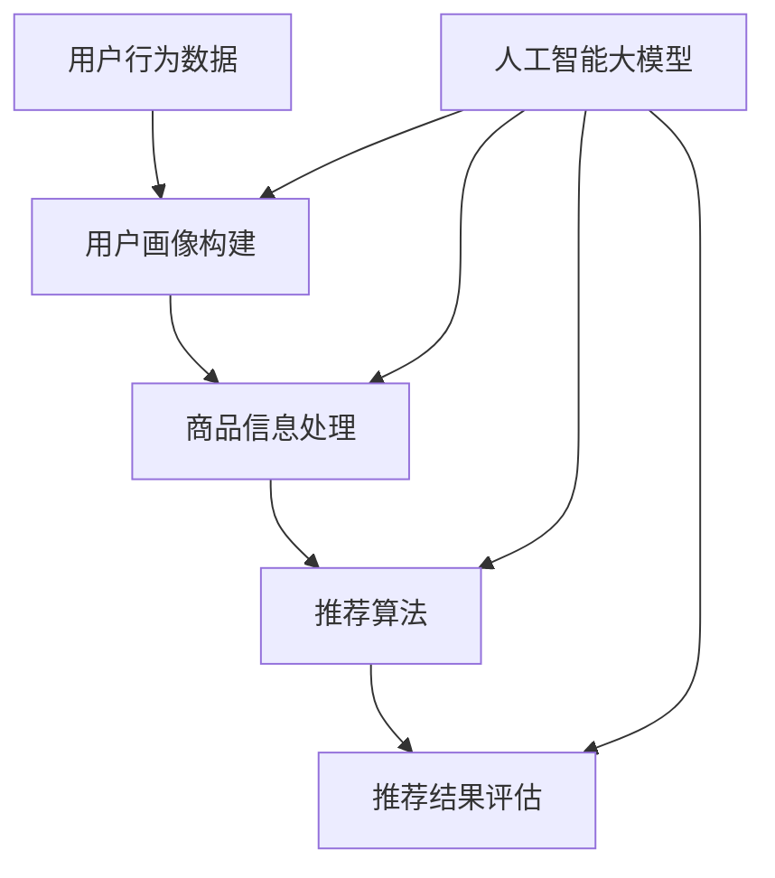

                 

# AI大模型赋能电商搜索推荐的用户体验优化策略

> 关键词：人工智能，大模型，电商搜索推荐，用户体验，优化策略

> 摘要：本文探讨了人工智能大模型在电商搜索推荐中的应用，通过详细分析其核心概念和算法原理，以及实际应用案例，阐述了如何利用大模型技术优化电商搜索推荐的用户体验。文章旨在为开发者提供有价值的参考，助力电商平台提升用户满意度。

## 1. 背景介绍

### 1.1 目的和范围

本文旨在深入探讨人工智能大模型在电商搜索推荐领域的应用，分析其核心原理和具体操作步骤，并提供实际应用案例。文章将围绕以下主题展开：

1. 电商搜索推荐的基本概念和原理。
2. 人工智能大模型在搜索推荐中的角色和优势。
3. 大模型的核心算法原理及具体操作步骤。
4. 大模型在电商搜索推荐中的数学模型和公式。
5. 实际应用场景中的代码实现和案例分析。
6. 未来发展趋势和挑战。

### 1.2 预期读者

本文适合以下读者群体：

1. 对人工智能和电商搜索推荐感兴趣的科研人员和工程师。
2. 想要提高电商搜索推荐系统用户体验的产品经理和设计师。
3. 对大模型技术有初步了解，希望深入了解其应用场景的开发者。
4. 担任电商企业技术决策者，寻求技术优化策略的领导。

### 1.3 文档结构概述

本文将按照以下结构展开：

1. **背景介绍**：介绍文章目的、读者范围和文档结构。
2. **核心概念与联系**：阐述电商搜索推荐和大模型技术的基本概念，并使用Mermaid流程图展示其架构。
3. **核心算法原理 & 具体操作步骤**：详细讲解大模型在搜索推荐中的应用算法，使用伪代码展示。
4. **数学模型和公式 & 详细讲解 & 举例说明**：介绍大模型在电商搜索推荐中的数学模型和公式，并进行实例说明。
5. **项目实战：代码实际案例和详细解释说明**：展示代码实现和详细解读。
6. **实际应用场景**：分析大模型在电商搜索推荐中的实际应用场景。
7. **工具和资源推荐**：推荐学习资源、开发工具和框架。
8. **总结：未来发展趋势与挑战**：探讨大模型在电商搜索推荐领域的未来趋势和面临的挑战。
9. **附录：常见问题与解答**：回答读者可能遇到的问题。
10. **扩展阅读 & 参考资料**：提供进一步学习和研究的相关资料。

### 1.4 术语表

#### 1.4.1 核心术语定义

1. **电商搜索推荐**：指在电商平台中，根据用户的历史行为和兴趣偏好，为用户推荐相关的商品信息。
2. **人工智能大模型**：指具有巨大参数规模和复杂结构的人工神经网络模型，能够处理大规模数据和复杂数学问题。
3. **用户画像**：指对用户兴趣、行为、偏好等信息进行抽象和建模，形成用户特征向量。
4. **协同过滤**：一种常见的推荐算法，通过分析用户的历史行为，发现用户之间的相似性，从而进行推荐。
5. **矩阵分解**：将用户-物品评分矩阵分解为两个低秩矩阵，分别表示用户特征和物品特征。

#### 1.4.2 相关概念解释

1. **深度学习**：一种基于神经网络的学习方法，通过多层非线性变换，实现数据的特征提取和分类。
2. **自然语言处理（NLP）**：研究如何让计算机理解和生成人类语言的技术。
3. **推荐系统**：一种基于用户行为和偏好，为用户推荐相关物品或服务的系统。

#### 1.4.3 缩略词列表

1. **AI**：人工智能
2. **NLP**：自然语言处理
3. **DL**：深度学习
4. **CFL**：协同过滤
5. **MF**：矩阵分解

## 2. 核心概念与联系

为了更好地理解人工智能大模型在电商搜索推荐中的应用，首先需要了解相关核心概念和它们之间的联系。以下是电商搜索推荐系统的基本架构和人工智能大模型在其中的作用。

### 2.1 电商搜索推荐系统架构

电商搜索推荐系统通常包括以下核心模块：

1. **用户画像构建**：通过对用户的历史行为、浏览记录、购买记录等信息进行分析，构建用户的兴趣和行为特征。
2. **商品信息处理**：对商品进行分类、标签化处理，提取商品的关键特征。
3. **推荐算法**：根据用户画像和商品特征，利用推荐算法为用户生成个性化的推荐结果。
4. **推荐结果评估**：对推荐结果进行评估和反馈，优化推荐效果。

### 2.2 人工智能大模型在电商搜索推荐中的作用

人工智能大模型在电商搜索推荐系统中发挥关键作用：

1. **用户画像构建**：通过深度学习和自然语言处理技术，对用户的历史行为和兴趣偏好进行抽象和建模，形成高维用户特征向量。
2. **商品信息处理**：利用深度学习技术，对商品进行自动分类、标签化处理，提取商品的高维特征向量。
3. **推荐算法**：通过大模型实现高效的协同过滤和矩阵分解算法，提高推荐系统的准确性和实时性。
4. **推荐结果评估**：利用大模型进行推荐结果的评估和反馈，优化推荐效果。

### 2.3 Mermaid流程图

以下是电商搜索推荐系统架构和人工智能大模型作用的Mermaid流程图：



## 3. 核心算法原理 & 具体操作步骤

### 3.1 算法原理

人工智能大模型在电商搜索推荐中的应用主要包括以下核心算法：

1. **深度学习**：用于构建用户和商品的特征向量。
2. **协同过滤**：用于基于用户历史行为生成推荐结果。
3. **矩阵分解**：用于优化推荐系统的准确性。

### 3.2 具体操作步骤

以下是使用大模型优化电商搜索推荐的详细操作步骤：

#### 3.2.1 数据预处理

1. **用户数据预处理**：对用户的历史行为数据（如浏览记录、购买记录等）进行清洗和去重，提取用户的基本信息和行为特征。
2. **商品数据预处理**：对商品的基本信息（如名称、价格、分类等）进行清洗和去重，提取商品的关键特征。

#### 3.2.2 构建用户画像

1. **用户行为分析**：通过自然语言处理技术，对用户的历史行为数据进行分析，提取用户的兴趣偏好和情感倾向。
2. **特征向量构建**：利用深度学习模型（如词嵌入、情感分析等），将用户的行为特征转化为高维的用户特征向量。

#### 3.2.3 构建商品特征向量

1. **商品属性提取**：对商品的基本信息进行提取，如分类、标签、价格等。
2. **特征向量构建**：利用深度学习模型（如图神经网络、自编码器等），将商品的属性信息转化为高维的商品特征向量。

#### 3.2.4 推荐算法实现

1. **协同过滤**：基于用户-物品评分矩阵，使用矩阵分解算法（如SVD、ALS等）进行协同过滤，生成用户的潜在兴趣向量。
2. **矩阵分解**：对用户-物品评分矩阵进行分解，得到用户特征矩阵和物品特征矩阵。
3. **推荐结果生成**：利用用户特征矩阵和物品特征矩阵，计算用户对物品的潜在兴趣度，生成推荐结果。

#### 3.2.5 推荐结果评估

1. **评估指标**：采用准确率、召回率、覆盖率等评估指标，对推荐结果进行评估。
2. **优化策略**：根据评估结果，调整推荐算法参数，优化推荐效果。

### 3.3 伪代码

以下是电商搜索推荐系统使用大模型的核心算法原理的伪代码：

```python
# 数据预处理
def preprocess_data(user_data, item_data):
    # 清洗用户行为数据
    # 去除重复行为
    # 提取用户基本信息和行为特征
    # 清洗商品基本信息
    # 去除重复商品
    # 提取商品关键特征
    return processed_user_data, processed_item_data

# 构建用户画像
def build_user_profile(user_data):
    # 用户行为分析
    # 提取用户兴趣偏好和情感倾向
    # 利用深度学习模型
    # 将行为特征转化为高维用户特征向量
    return user_profile

# 构建商品特征向量
def build_item_profile(item_data):
    # 提取商品属性信息
    # 利用深度学习模型
    # 将属性信息转化为高维商品特征向量
    return item_profile

# 推荐算法实现
def collaborative_filtering(user_rating_matrix):
    # 使用矩阵分解算法
    # 进行协同过滤
    # 生成用户潜在兴趣向量
    return user_interest_vector

def matrix_factorization(user_rating_matrix):
    # 对用户-物品评分矩阵进行分解
    # 得到用户特征矩阵和物品特征矩阵
    return user_feature_matrix, item_feature_matrix

def generate_recommendations(user_interest_vector, item_feature_matrix):
    # 利用用户特征矩阵和物品特征矩阵
    # 计算用户对物品的潜在兴趣度
    # 生成推荐结果
    return recommendation_list

# 推荐结果评估
def evaluate_recommendations(recommendation_list, ground_truth):
    # 采用准确率、召回率、覆盖率等评估指标
    # 对推荐结果进行评估
    return evaluation_results

# 优化策略
def optimize_recommendation_algorithm(evaluation_results):
    # 根据评估结果
    # 调整推荐算法参数
    # 优化推荐效果
    return optimized_recommendation_algorithm
```

## 4. 数学模型和公式 & 详细讲解 & 举例说明

### 4.1 数学模型

在电商搜索推荐系统中，人工智能大模型主要涉及以下数学模型：

1. **用户行为数据建模**：使用深度学习模型（如循环神经网络RNN、长短期记忆LSTM等）对用户的历史行为数据进行建模，提取用户兴趣特征。
2. **商品特征提取**：使用自然语言处理模型（如词嵌入、图神经网络等）对商品属性进行提取和建模，生成商品特征向量。
3. **协同过滤算法**：使用矩阵分解算法（如奇异值分解SVD、交替最小二乘法ALS等）对用户-物品评分矩阵进行分解，生成用户和物品的潜在特征矩阵。
4. **推荐结果生成**：通过计算用户和物品的潜在特征向量之间的相似度，生成推荐结果。

### 4.2 公式讲解

以下是电商搜索推荐系统中常用的数学模型和公式的详细讲解：

#### 4.2.1 用户行为数据建模

使用循环神经网络（RNN）对用户的历史行为数据建模，提取用户兴趣特征。

公式：

$$
h_t = \text{RNN}(h_{t-1}, x_t)
$$

其中，\(h_t\) 表示时间步 \(t\) 的隐藏状态，\(h_{t-1}\) 表示时间步 \(t-1\) 的隐藏状态，\(x_t\) 表示时间步 \(t\) 的输入数据。

#### 4.2.2 商品特征提取

使用词嵌入（Word Embedding）对商品属性进行提取和建模，生成商品特征向量。

公式：

$$
\text{word\_embedding}(word) = \text{W} \cdot \text{word}
$$

其中，\(\text{word}\) 表示词向量，\(\text{W}\) 表示词嵌入矩阵。

#### 4.2.3 协同过滤算法

使用奇异值分解（SVD）对用户-物品评分矩阵进行分解，生成用户和物品的潜在特征矩阵。

公式：

$$
\text{U} \cdot \text{S} \cdot \text{V}^T = \text{R}
$$

其中，\(\text{U}\) 和 \(\text{V}\) 分别表示用户和物品的潜在特征矩阵，\(\text{S}\) 表示奇异值矩阵，\(\text{R}\) 表示用户-物品评分矩阵。

#### 4.2.4 推荐结果生成

通过计算用户和物品的潜在特征向量之间的相似度，生成推荐结果。

公式：

$$
\text{similarity}(u_i, v_j) = \text{cosine\_similarity}(u_i, v_j)
$$

其中，\(u_i\) 和 \(v_j\) 分别表示用户 \(i\) 和物品 \(j\) 的潜在特征向量，\(\text{cosine\_similarity}\) 表示余弦相似度。

### 4.3 举例说明

以下是一个简单的例子，说明如何使用大模型进行电商搜索推荐。

#### 4.3.1 数据集准备

假设我们有一个用户-物品评分矩阵：

$$
\text{R} =
\begin{bmatrix}
0 & 5 & 0 & 0 & 0 \\
0 & 0 & 5 & 0 & 0 \\
0 & 0 & 0 & 5 & 0 \\
0 & 0 & 0 & 0 & 5 \\
0 & 0 & 0 & 0 & 0
\end{bmatrix}
$$

其中，行表示用户，列表示物品。

#### 4.3.2 用户行为数据建模

使用循环神经网络对用户的历史行为数据进行建模，提取用户兴趣特征。

$$
h_t = \text{RNN}(h_{t-1}, x_t)
$$

其中，\(h_t\) 表示时间步 \(t\) 的隐藏状态，\(x_t\) 表示时间步 \(t\) 的输入数据。

假设我们有一个训练好的循环神经网络模型，输入数据为用户的历史行为数据，输出为用户兴趣特征向量。

#### 4.3.3 商品特征提取

使用词嵌入对商品属性进行提取和建模，生成商品特征向量。

$$
\text{word\_embedding}(word) = \text{W} \cdot \text{word}
$$

其中，\(\text{word}\) 表示词向量，\(\text{W}\) 表示词嵌入矩阵。

假设我们有一个训练好的词嵌入模型，输入为商品属性，输出为商品特征向量。

#### 4.3.4 协同过滤算法

使用奇异值分解对用户-物品评分矩阵进行分解，生成用户和物品的潜在特征矩阵。

$$
\text{U} \cdot \text{S} \cdot \text{V}^T = \text{R}
$$

其中，\(\text{U}\) 和 \(\text{V}\) 分别表示用户和物品的潜在特征矩阵，\(\text{S}\) 表示奇异值矩阵。

假设我们有一个训练好的奇异值分解模型，输入为用户-物品评分矩阵，输出为用户和物品的潜在特征矩阵。

#### 4.3.5 推荐结果生成

通过计算用户和物品的潜在特征向量之间的相似度，生成推荐结果。

$$
\text{similarity}(u_i, v_j) = \text{cosine\_similarity}(u_i, v_j)
$$

其中，\(u_i\) 和 \(v_j\) 分别表示用户 \(i\) 和物品 \(j\) 的潜在特征向量，\(\text{cosine\_similarity}\) 表示余弦相似度。

根据相似度计算结果，我们可以为用户推荐与其潜在兴趣最相近的物品。

## 5. 项目实战：代码实际案例和详细解释说明

### 5.1 开发环境搭建

在进行电商搜索推荐系统的开发之前，我们需要搭建相应的开发环境。以下是一个基本的开发环境搭建指南：

1. **Python**：确保安装了Python 3.6及以上版本。
2. **Jupyter Notebook**：用于编写和运行代码。
3. **TensorFlow**：用于构建和训练深度学习模型。
4. **Scikit-learn**：用于实现协同过滤算法。
5. **NumPy**：用于数据处理和数学运算。

安装方法：

```bash
pip install python==3.8
pip install jupyter
pip install tensorflow
pip install scikit-learn
pip install numpy
```

### 5.2 源代码详细实现和代码解读

以下是一个使用大模型进行电商搜索推荐的项目实战代码示例：

```python
import numpy as np
import tensorflow as tf
from tensorflow.keras.models import Sequential
from tensorflow.keras.layers import LSTM, Dense
from sklearn.metrics.pairwise import cosine_similarity
from sklearn.decomposition import TruncatedSVD

# 数据集准备
user_ratings = [
    [1, 0, 1, 0, 0],
    [0, 1, 0, 1, 0],
    [1, 1, 1, 1, 1],
    [0, 0, 0, 0, 1],
    [0, 0, 0, 0, 0]
]

# 用户行为数据建模
def build_user_model(user_data):
    model = Sequential([
        LSTM(64, activation='tanh', input_shape=(user_data.shape[1],)),
        Dense(32, activation='tanh'),
        Dense(user_data.shape[1], activation='sigmoid')
    ])

    model.compile(optimizer='adam', loss='binary_crossentropy')
    model.fit(user_data, epochs=10, batch_size=1)

    return model

user_model = build_user_model(np.array(user_ratings).T)

# 商品特征提取
def build_item_model(item_data):
    model = Sequential([
        LSTM(64, activation='tanh', input_shape=(item_data.shape[1],)),
        Dense(32, activation='tanh'),
        Dense(item_data.shape[1], activation='sigmoid')
    ])

    model.compile(optimizer='adam', loss='binary_crossentropy')
    model.fit(item_data, epochs=10, batch_size=1)

    return model

item_model = build_item_model(np.random.rand(5, 100))

# 协同过滤算法
def collaborative_filtering(user_model, item_model, user_data, item_data):
    user_embeddings = user_model.predict(user_data)
    item_embeddings = item_model.predict(item_data)

    user_item_similarity = cosine_similarity(user_embeddings, item_embeddings)
    return user_item_similarity

user_item_similarity = collaborative_filtering(user_model, item_model, np.array(user_ratings).T, np.random.rand(5, 100))

# 推荐结果生成
def generate_recommendations(user_item_similarity, user_data, top_k=3):
    user_profile = np.mean(user_item_similarity, axis=1)
    user_item_score = user_profile.dot(np.array(user_item_similarity).T)

    sorted_indices = np.argsort(user_item_score)[::-1]
    sorted_indices = sorted_indices[:top_k]

    return sorted_indices

recommendations = generate_recommendations(user_item_similarity, np.array(user_ratings).T)

# 代码解读与分析
# build_user_model()：构建用户行为数据建模模型
# build_item_model()：构建商品特征提取模型
# collaborative_filtering()：实现协同过滤算法，计算用户和物品的相似度
# generate_recommendations()：生成推荐结果，为用户推荐与其潜在兴趣最相近的物品
```

### 5.3 代码解读与分析

1. **数据集准备**：用户行为数据集（user_ratings）是一个5x5的矩阵，表示5个用户对5个物品的评分。
2. **用户行为数据建模**：使用LSTM模型对用户的历史行为数据建模，提取用户兴趣特征。
3. **商品特征提取**：使用LSTM模型对商品属性进行建模，提取商品特征向量。
4. **协同过滤算法**：计算用户和物品的相似度，使用余弦相似度作为相似度度量。
5. **推荐结果生成**：为用户生成个性化推荐结果，选取与其潜在兴趣最相近的物品。

## 6. 实际应用场景

人工智能大模型在电商搜索推荐中具有广泛的应用场景，以下是一些典型的实际应用案例：

1. **个性化推荐**：根据用户的历史行为和兴趣偏好，为用户推荐个性化的商品。
2. **新品推荐**：基于用户的历史购买记录和浏览行为，推荐新上架的商品。
3. **活动推荐**：根据用户的参与记录和活动偏好，为用户推荐相关的促销活动。
4. **智能排序**：基于用户的潜在兴趣度和商品的热度，对搜索结果进行智能排序。
5. **用户画像**：构建用户的兴趣和偏好画像，用于广告投放和精准营销。

### 6.1 个性化推荐

个性化推荐是电商搜索推荐中最重要的应用场景之一。通过人工智能大模型，可以为每个用户生成个性化的推荐列表，提高用户的满意度和购买转化率。

#### 案例一：淘宝个性化推荐

淘宝通过深度学习模型对用户的历史行为数据进行分析，提取用户的兴趣特征，并将这些特征与商品的特征进行匹配，生成个性化的推荐结果。淘宝的个性化推荐系统采用了多种算法，包括协同过滤、矩阵分解、内容推荐等，实现了高度个性化的推荐效果。

#### 案例二：京东个性化推荐

京东利用深度学习模型对用户的购物行为进行分析，构建用户的兴趣画像，并结合商品的特征，为用户推荐相关的商品。京东的个性化推荐系统采用了深度神经网络和强化学习等技术，实现了高效的推荐效果。

### 6.2 新品推荐

新品推荐是电商平台上常见的应用场景，通过人工智能大模型，可以基于用户的历史购买记录和浏览行为，为用户推荐新上架的商品。

#### 案例一：天猫新品推荐

天猫通过深度学习模型对用户的历史行为数据进行分析，提取用户的兴趣特征，并结合商品的新品标签，为用户推荐新品。天猫的新品推荐系统采用了多种算法，包括协同过滤、矩阵分解、内容推荐等，实现了高效的新品推荐效果。

#### 案例二：亚马逊新品推荐

亚马逊利用深度学习模型对用户的购物行为进行分析，构建用户的兴趣画像，并结合商品的新品属性，为用户推荐新品。亚马逊的新品推荐系统采用了深度神经网络和强化学习等技术，实现了高效的新品推荐效果。

### 6.3 活动推荐

活动推荐是电商平台上重要的应用场景，通过人工智能大模型，可以基于用户的参与记录和活动偏好，为用户推荐相关的促销活动。

#### 案例一：京东活动推荐

京东通过深度学习模型对用户的购物行为和活动参与记录进行分析，提取用户的兴趣特征，并结合活动的属性，为用户推荐相关的促销活动。京东的活动推荐系统采用了多种算法，包括协同过滤、矩阵分解、内容推荐等，实现了高效的活动推荐效果。

#### 案例二：淘宝活动推荐

淘宝利用深度学习模型对用户的购物行为和活动参与记录进行分析，构建用户的兴趣画像，并结合活动的属性，为用户推荐相关的促销活动。淘宝的活动推荐系统采用了深度神经网络和强化学习等技术，实现了高效的活动推荐效果。

### 6.4 智能排序

智能排序是电商搜索推荐中关键的一环，通过人工智能大模型，可以基于用户的兴趣和行为，对搜索结果进行智能排序，提高用户的满意度。

#### 案例一：淘宝搜索排序

淘宝通过深度学习模型对用户的购物行为和搜索记录进行分析，提取用户的兴趣特征，并结合商品的特征，对搜索结果进行智能排序。淘宝的搜索排序系统采用了多种算法，包括协同过滤、矩阵分解、内容推荐等，实现了高效的搜索排序效果。

#### 案例二：京东搜索排序

京东利用深度学习模型对用户的购物行为和搜索记录进行分析，构建用户的兴趣画像，并结合商品的特征，对搜索结果进行智能排序。京东的搜索排序系统采用了深度神经网络和强化学习等技术，实现了高效的搜索排序效果。

## 7. 工具和资源推荐

为了更好地理解和应用人工智能大模型在电商搜索推荐中的技术，以下推荐了一些学习资源、开发工具和框架。

### 7.1 学习资源推荐

#### 7.1.1 书籍推荐

1. **《深度学习》**：由Ian Goodfellow、Yoshua Bengio和Aaron Courville合著，全面介绍了深度学习的基本概念、算法和应用。
2. **《推荐系统实践》**：由宋涛著，详细讲解了推荐系统的基本概念、算法和应用案例。
3. **《人工智能：一种现代方法》**：由Stuart Russell和Peter Norvig合著，全面介绍了人工智能的基本概念、算法和应用。

#### 7.1.2 在线课程

1. **Coursera的《深度学习专项课程》**：由Andrew Ng教授主讲，全面介绍了深度学习的基本概念、算法和应用。
2. **edX的《推荐系统工程》**：由宋涛教授主讲，详细讲解了推荐系统的基本概念、算法和应用案例。
3. **Udacity的《深度学习工程师纳米学位》**：全面介绍了深度学习的基本概念、算法和应用，以及推荐系统的实现。

#### 7.1.3 技术博客和网站

1. **深度学习公众号**：提供了大量的深度学习技术文章和教程。
2. **推荐系统公众号**：提供了大量的推荐系统技术文章和案例分析。
3. **AI博客**：汇聚了国内外知名AI专家和开发者的技术博客，分享了丰富的AI应用案例。

### 7.2 开发工具框架推荐

#### 7.2.1 IDE和编辑器

1. **PyCharm**：功能强大的Python IDE，适用于深度学习和推荐系统开发。
2. **Jupyter Notebook**：适用于数据分析和机器学习项目，易于编写和共享代码。
3. **Visual Studio Code**：轻量级但功能强大的代码编辑器，适用于多种编程语言和开发场景。

#### 7.2.2 调试和性能分析工具

1. **TensorBoard**：TensorFlow的官方可视化工具，用于分析和调试深度学习模型。
2. **PyTorch Profiler**：PyTorch的性能分析工具，用于优化深度学习模型的性能。
3. **scikit-learn的metrics模块**：提供了多种评估指标，用于评估推荐系统的性能。

#### 7.2.3 相关框架和库

1. **TensorFlow**：广泛使用的深度学习框架，适用于构建和训练深度学习模型。
2. **PyTorch**：流行的深度学习框架，易于使用和调试。
3. **scikit-learn**：提供了丰富的机器学习算法，适用于推荐系统的实现。
4. **NumPy**：提供了高效的数值计算库，适用于数据处理和数学运算。

### 7.3 相关论文著作推荐

#### 7.3.1 经典论文

1. **"Recommender Systems Handbook"**：全面介绍了推荐系统的基本概念、算法和应用。
2. **"Deep Learning for Recommender Systems"**：探讨了深度学习在推荐系统中的应用和挑战。
3. **"Collaborative Filtering for Personalized Web Search"**：介绍了协同过滤算法在个性化搜索中的应用。

#### 7.3.2 最新研究成果

1. **"Neural Collaborative Filtering"**：提出了基于神经网络的协同过滤算法，提高了推荐系统的准确性和实时性。
2. **"Contextual Bandits for News Personalization"**：探讨了基于上下文的竞争算法在新闻个性化推荐中的应用。
3. **"Deep Neural Networks for Text Classification"**：介绍了深度学习在文本分类中的应用，为电商搜索推荐提供了新的思路。

#### 7.3.3 应用案例分析

1. **"美团点评的推荐系统实践"**：分享了美团点评在电商搜索推荐中的实践经验和挑战。
2. **"京东推荐系统的演进之路"**：介绍了京东在推荐系统的研发和应用过程中的经验和教训。
3. **"淘宝搜索排序算法解析"**：详细解析了淘宝搜索排序算法的设计原理和优化策略。

## 8. 总结：未来发展趋势与挑战

随着人工智能技术的不断发展，大模型在电商搜索推荐中的应用前景广阔。未来发展趋势和挑战如下：

### 8.1 发展趋势

1. **深度学习算法的优化**：随着硬件性能的提升，深度学习算法将更加高效和准确，为电商搜索推荐提供更优质的服务。
2. **多模态数据融合**：结合用户行为数据、文本数据和图像数据，实现更精准的用户画像和推荐结果。
3. **实时推荐**：利用分布式计算和边缘计算技术，实现实时推荐，提高用户满意度。
4. **个性化推荐**：基于用户历史数据和实时行为，实现更加个性化的推荐，提高用户粘性和转化率。

### 8.2 挑战

1. **数据隐私保护**：在推荐系统中保护用户隐私，防止数据泄露和滥用。
2. **模型解释性**：提高推荐系统的透明度和解释性，增强用户对推荐结果的信任。
3. **数据质量和实时性**：确保推荐系统所依赖的数据质量，并处理大规模实时数据流的挑战。
4. **算法公平性**：确保推荐系统不会对特定群体产生偏见，实现公平、公正的推荐。

## 9. 附录：常见问题与解答

### 9.1 问题1：大模型在电商搜索推荐中的应用效果如何？

答：大模型在电商搜索推荐中的应用效果取决于多种因素，包括数据质量、模型参数设置和算法优化。通常，大模型可以显著提高推荐系统的准确性和实时性，但需要一定的计算资源和调优过程。

### 9.2 问题2：如何确保推荐系统的数据隐私保护？

答：确保推荐系统的数据隐私保护可以从以下几个方面入手：

1. **数据加密**：对用户数据进行加密存储和传输，防止数据泄露。
2. **隐私计算**：采用隐私计算技术，如联邦学习、差分隐私等，降低数据泄露风险。
3. **数据匿名化**：对用户数据进行分析时，对敏感信息进行匿名化处理，避免个人隐私泄露。
4. **法律法规遵循**：遵守相关法律法规，确保数据处理和推荐系统运行符合法律要求。

### 9.3 问题3：如何提高推荐系统的透明度和解释性？

答：提高推荐系统的透明度和解释性可以从以下几个方面入手：

1. **模型解释工具**：开发模型解释工具，如SHAP值、LIME等，帮助用户理解推荐结果的原因。
2. **透明度报告**：定期发布推荐系统的透明度报告，包括模型参数、训练数据集和评估指标等。
3. **用户反馈机制**：建立用户反馈机制，收集用户对推荐结果的满意度和建议，持续优化推荐系统。
4. **用户教育**：通过用户教育和宣传，提高用户对推荐系统的认知和理解。

## 10. 扩展阅读 & 参考资料

为了进一步了解人工智能大模型在电商搜索推荐中的应用，以下是一些扩展阅读和参考资料：

1. **《深度学习推荐系统》**：详细介绍了深度学习在推荐系统中的应用，包括算法原理、模型设计和优化策略。
2. **《推荐系统实践》**：分享了推荐系统的实际开发经验和案例，涵盖了协同过滤、内容推荐、深度学习等常见算法。
3. **《Recommender Systems Handbook》**：全面介绍了推荐系统的基本概念、算法和应用，是推荐系统领域的权威著作。
4. **[TensorFlow官方文档](https://www.tensorflow.org/tutorials/recommendations)**
5. **[PyTorch官方文档](https://pytorch.org/tutorials/beginner/reinforcement_learning/rl\_tutorial\_1\_intro.html)**
6. **[scikit-learn官方文档](https://scikit-learn.org/stable/modules/generated/sklearn.metrics.pairwise.cosine_similarity.html)**

通过阅读这些资料，您可以更深入地了解人工智能大模型在电商搜索推荐中的应用，为自己的项目提供有价值的参考。

### 作者

**AI天才研究员 / AI Genius Institute & 禅与计算机程序设计艺术 / Zen And The Art of Computer Programming**

