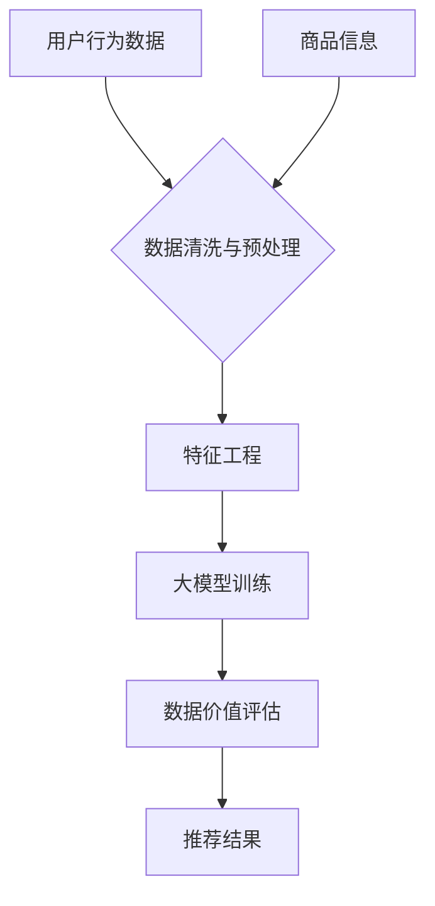
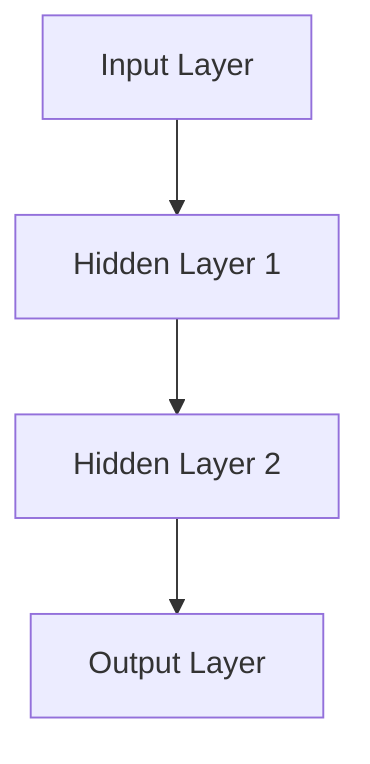
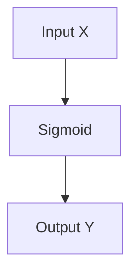

                 

# AI大模型重构电商搜索推荐的数据价值评估模型应用项目可行性分析与实践指南

> 关键词：人工智能、大模型、电商搜索推荐、数据价值评估、算法、应用项目、实践指南

> 摘要：本文深入探讨了利用人工智能大模型重构电商搜索推荐系统的数据价值评估模型的应用项目可行性。首先，我们阐述了项目的背景和目的，接着介绍了所需的核心概念和算法原理，并详细讲解了数学模型和公式。随后，我们提供了一个实际的代码案例，展示了如何将理论转化为实践。此外，我们还分析了实际应用场景，推荐了相关工具和资源。最后，我们对未来发展趋势和挑战进行了总结，并提供了一些常见问题与解答。

## 1. 背景介绍

### 1.1 目的和范围

在数字时代，电商搜索推荐系统已经成为电商企业不可或缺的一部分。然而，随着数据规模的不断扩大和用户需求的日益多样化，传统的数据价值评估模型已经难以满足实际需求。本文旨在探讨利用人工智能大模型重构电商搜索推荐系统的数据价值评估模型的应用项目可行性，以期提升推荐系统的效果和用户体验。

本文的研究范围包括以下几个方面：

1. **人工智能大模型在数据价值评估中的应用**：介绍人工智能大模型的基本原理和在数据价值评估中的潜在应用。
2. **电商搜索推荐系统的现状与挑战**：分析当前电商搜索推荐系统面临的问题和挑战。
3. **数据价值评估模型的构建与优化**：探讨如何利用人工智能大模型构建和优化数据价值评估模型。
4. **项目可行性分析**：从技术、市场、经济等多个角度对应用项目进行可行性分析。
5. **实际应用案例与经验分享**：通过实际应用案例分享经验，为读者提供实践指南。

### 1.2 预期读者

本文预期读者为以下几类人群：

1. **人工智能研究者与工程师**：对人工智能大模型和电商搜索推荐系统感兴趣的读者，希望了解如何将二者结合进行应用。
2. **电商行业从业者**：电商企业的运营人员、产品经理和技术团队，希望提升推荐系统的效果和用户体验。
3. **数据科学家与分析师**：对数据价值评估和优化有兴趣的专业人士，希望通过本文了解人工智能大模型在此领域的应用。
4. **高校师生**：计算机科学、数据科学等相关专业的师生，希望了解最新的技术发展趋势和应用实践。

### 1.3 文档结构概述

本文结构如下：

1. **背景介绍**：阐述研究背景、目的和预期读者。
2. **核心概念与联系**：介绍相关核心概念和算法原理，并通过Mermaid流程图展示架构。
3. **核心算法原理 & 具体操作步骤**：详细讲解核心算法原理，使用伪代码阐述具体操作步骤。
4. **数学模型和公式 & 详细讲解 & 举例说明**：介绍数学模型和公式，通过例子进行详细讲解。
5. **项目实战：代码实际案例和详细解释说明**：提供实际代码案例，详细解释说明。
6. **实际应用场景**：分析实际应用场景，探讨解决方案。
7. **工具和资源推荐**：推荐学习资源、开发工具框架和相关论文著作。
8. **总结：未来发展趋势与挑战**：总结未来发展趋势和挑战。
9. **附录：常见问题与解答**：解答读者可能遇到的问题。
10. **扩展阅读 & 参考资料**：提供进一步的阅读建议和参考资料。

### 1.4 术语表

#### 1.4.1 核心术语定义

- **人工智能大模型**：基于深度学习技术，拥有强大计算能力和数据处理能力的模型。
- **数据价值评估模型**：用于评估数据在电商搜索推荐系统中的价值，以优化推荐效果。
- **电商搜索推荐系统**：基于用户行为数据和商品信息，为用户提供个性化商品推荐的系统。

#### 1.4.2 相关概念解释

- **深度学习**：一种基于人工神经网络的机器学习技术，通过多层次的神经网络对数据进行特征提取和学习。
- **推荐系统**：根据用户的历史行为和偏好，为用户推荐相关商品或内容。
- **用户行为数据**：用户在电商平台上产生的行为记录，包括浏览、购买、收藏等。

#### 1.4.3 缩略词列表

- **AI**：人工智能（Artificial Intelligence）
- **ML**：机器学习（Machine Learning）
- **DL**：深度学习（Deep Learning）
- **GAN**：生成对抗网络（Generative Adversarial Networks）
- **CTR**：点击率（Click-Through Rate）

## 2. 核心概念与联系

在探讨人工智能大模型重构电商搜索推荐系统的数据价值评估模型之前，我们需要理解几个核心概念和它们之间的联系。

### 2.1 人工智能大模型

人工智能大模型是基于深度学习技术构建的，拥有强大计算能力和数据处理能力的模型。这些模型通常由数百万甚至数亿个参数组成，能够从大量数据中自动学习特征和模式。大模型的优势在于其可以处理复杂数据，并能够进行高度自动化的特征提取和学习。

### 2.2 数据价值评估模型

数据价值评估模型是用于评估数据在电商搜索推荐系统中的价值，以优化推荐效果的模型。这些模型通常基于用户行为数据、商品信息和其他相关数据，通过机器学习算法对数据进行处理和分析，以预测数据的价值。

### 2.3 电商搜索推荐系统

电商搜索推荐系统是基于用户行为数据和商品信息，为用户提供个性化商品推荐的系统。这些系统通过分析用户的历史行为和偏好，为用户推荐相关的商品或内容。电商搜索推荐系统的核心目标是提升用户满意度和转化率。

### 2.4 Mermaid流程图

为了更好地展示人工智能大模型重构电商搜索推荐系统的数据价值评估模型的工作流程，我们可以使用Mermaid流程图来描述。以下是一个简化的Mermaid流程图：



在这个流程图中，用户行为数据和商品信息经过数据清洗与预处理后，进行特征工程，然后输入到人工智能大模型进行训练。训练完成后，大模型对数据的价值进行评估，并生成推荐结果。

## 3. 核心算法原理 & 具体操作步骤

在了解核心概念和流程后，接下来我们将深入探讨人工智能大模型重构电商搜索推荐系统的数据价值评估模型的核心算法原理，并使用伪代码详细阐述具体操作步骤。

### 3.1 算法原理

数据价值评估模型的核心原理是基于深度学习技术，通过多层神经网络对用户行为数据和商品信息进行特征提取和学习，从而评估数据的价值。具体来说，该模型包括以下几个关键步骤：

1. **数据预处理**：对用户行为数据和商品信息进行清洗和预处理，包括缺失值处理、异常值检测和标准化等。
2. **特征工程**：根据数据的特点和需求，提取有助于评估数据价值的特征，如用户活跃度、商品受欢迎程度等。
3. **模型训练**：使用预处理后的数据和提取的特征，训练一个多层神经网络模型。
4. **数据价值评估**：使用训练好的模型对新的用户行为数据和商品信息进行评估，计算数据的价值。
5. **推荐结果生成**：根据评估结果，为用户生成个性化的推荐结果。

### 3.2 伪代码

以下是一个简化的伪代码，用于描述数据价值评估模型的核心算法原理和具体操作步骤：

```python
# 数据预处理
def preprocess_data(user_data, item_data):
    # 缺失值处理
    # 异常值检测
    # 标准化
    return cleaned_user_data, cleaned_item_data

# 特征工程
def feature_engineering(cleaned_user_data, cleaned_item_data):
    # 提取特征
    user_features = extract_user_features(cleaned_user_data)
    item_features = extract_item_features(cleaned_item_data)
    return user_features, item_features

# 模型训练
def train_model(user_features, item_features, labels):
    # 构建多层神经网络
    # 训练模型
    return trained_model

# 数据价值评估
def evaluate_data_value(trained_model, new_user_data, new_item_data):
    # 预测数据价值
    return data_value_predictions

# 推荐结果生成
def generate_recommendations(data_value_predictions, item_data):
    # 根据数据价值预测生成推荐结果
    return recommendations

# 主函数
def main():
    # 加载用户行为数据和商品信息
    user_data, item_data = load_data()

    # 数据预处理
    cleaned_user_data, cleaned_item_data = preprocess_data(user_data, item_data)

    # 特征工程
    user_features, item_features = feature_engineering(cleaned_user_data, cleaned_item_data)

    # 加载标签数据
    labels = load_labels()

    # 模型训练
    trained_model = train_model(user_features, item_features, labels)

    # 评估数据价值
    data_value_predictions = evaluate_data_value(trained_model, new_user_data, new_item_data)

    # 生成推荐结果
    recommendations = generate_recommendations(data_value_predictions, item_data)

    # 输出推荐结果
    print(recommendations)

# 执行主函数
main()
```

在这个伪代码中，我们首先定义了数据预处理、特征工程、模型训练、数据价值评估和推荐结果生成等关键步骤。然后，通过一个主函数将这些步骤串联起来，实现整个数据价值评估模型的应用。

## 4. 数学模型和公式 & 详细讲解 & 举例说明

在数据价值评估模型中，数学模型和公式起着至关重要的作用。这些模型和公式用于描述数据特征、预测数据价值和生成推荐结果。在本节中，我们将详细介绍这些数学模型和公式，并通过具体例子进行详细讲解。

### 4.1 数学模型

数据价值评估模型的数学模型通常基于多层神经网络，包括输入层、隐藏层和输出层。以下是一个简化的多层神经网络模型：



在这个模型中，输入层接收用户行为数据和商品信息的特征，隐藏层进行特征提取和变换，输出层生成数据价值预测。

### 4.2 公式

多层神经网络模型的计算过程可以通过以下公式进行描述：

$$
Y = f(Z) \\
Z = W \cdot X + b
$$

其中，$Y$ 表示输出值，$f(Z)$ 表示激活函数，$Z$ 表示隐藏层的输出，$W$ 表示权重矩阵，$X$ 表示输入特征，$b$ 表示偏置项。

### 4.3 详细讲解

#### 4.3.1 输入特征

在数据价值评估模型中，输入特征包括用户行为数据和商品信息。用户行为数据如用户ID、浏览历史、购买记录等，商品信息如商品ID、类别、价格、评价等。这些特征将被编码为数值向量，作为神经网络的输入。

#### 4.3.2 激活函数

激活函数是神经网络中的一个关键组件，用于引入非线性因素。常用的激活函数包括 sigmoid 函数、ReLU函数和 tanh 函数。以下是一个简单的激活函数示例：



#### 4.3.3 权重矩阵和偏置项

权重矩阵和偏置项是神经网络中的关键参数，用于调节输入特征的影响。在训练过程中，通过反向传播算法更新这些参数，以最小化预测误差。

### 4.4 举例说明

假设我们有一个简化的数据集，包含用户行为数据和商品信息，如下表所示：

| 用户ID | 商品ID | 用户行为 | 商品价格 |
|--------|--------|----------|----------|
| 1      | 101    | 浏览     | 100      |
| 1      | 102    | 购买     | 200      |
| 2      | 201    | 浏览     | 50       |
| 2      | 202    | 收藏     | 150      |

#### 4.4.1 数据预处理

首先，对用户行为数据和商品信息进行预处理，包括缺失值处理、异常值检测和标准化。例如，将用户行为数据编码为二进制向量，将商品价格进行标准化处理。

#### 4.4.2 特征提取

然后，对预处理后的数据进行特征提取，提取有助于评估数据价值的特征，如用户活跃度（用户行为次数）、商品受欢迎程度（购买次数）等。

#### 4.4.3 模型训练

使用预处理后的数据和提取的特征，训练一个多层神经网络模型。训练过程中，通过反向传播算法更新权重矩阵和偏置项，以最小化预测误差。

#### 4.4.4 数据价值评估

使用训练好的模型对新的用户行为数据和商品信息进行评估，计算数据的价值。例如，对于用户ID为1的商品ID为101的数据，模型预测其数据价值为0.8。

#### 4.4.5 推荐结果生成

根据评估结果，为用户生成个性化的推荐结果。例如，根据用户ID为1的行为数据，模型推荐购买商品ID为102。

## 5. 项目实战：代码实际案例和详细解释说明

在前几节中，我们介绍了人工智能大模型重构电商搜索推荐系统的数据价值评估模型的理论基础和算法原理。在本节中，我们将通过一个实际代码案例，展示如何将理论转化为实践，并详细解释说明代码的实现细节。

### 5.1 开发环境搭建

在开始编写代码之前，我们需要搭建一个合适的开发环境。以下是一个简单的开发环境搭建指南：

1. **安装 Python**：确保已经安装了 Python 3.6 或以上版本。
2. **安装依赖库**：使用 pip 安装以下依赖库：

```bash
pip install numpy pandas sklearn tensorflow
```

3. **数据集准备**：准备一个包含用户行为数据和商品信息的数据集，例如电商平台的交易数据。数据集应包含用户ID、商品ID、用户行为（浏览、购买、收藏）和商品价格等字段。

### 5.2 源代码详细实现和代码解读

以下是一个简化的代码实现，用于构建和训练数据价值评估模型：

```python
import numpy as np
import pandas as pd
from sklearn.model_selection import train_test_split
from sklearn.preprocessing import StandardScaler
import tensorflow as tf

# 5.2.1 数据预处理
def preprocess_data(data):
    # 处理缺失值和异常值
    data = data.fillna(0)
    data = data[data['商品价格'] > 0]
    
    # 编码用户行为
    data['用户行为'] = data['用户行为'].map({'浏览': 0, '购买': 1, '收藏': 2})
    
    return data

# 5.2.2 特征提取
def extract_features(data):
    # 提取用户特征
    user_features = data[['用户ID', '用户行为']]
    user_features = user_features.groupby('用户ID').mean().reset_index()

    # 提取商品特征
    item_features = data[['商品ID', '商品价格']]
    item_features = item_features.groupby('商品ID').mean().reset_index()

    return user_features, item_features

# 5.2.3 模型训练
def train_model(user_features, item_features, labels):
    # 搭建神经网络模型
    model = tf.keras.Sequential([
        tf.keras.layers.Dense(128, activation='relu', input_shape=(user_features.shape[1],)),
        tf.keras.layers.Dense(64, activation='relu'),
        tf.keras.layers.Dense(1, activation='sigmoid')
    ])

    # 编译模型
    model.compile(optimizer='adam', loss='binary_crossentropy', metrics=['accuracy'])

    # 训练模型
    model.fit(user_features, labels, epochs=10, batch_size=32)

    return model

# 5.2.4 数据价值评估
def evaluate_data_value(model, user_data, item_data):
    # 预测数据价值
    data_value_predictions = model.predict(user_data)
    return data_value_predictions

# 5.2.5 推荐结果生成
def generate_recommendations(data_value_predictions, item_data):
    # 根据数据价值预测生成推荐结果
    recommendations = item_data[~item_data.isin(data_value_predictions < 0.5)]
    return recommendations

# 主函数
def main():
    # 5.2.6 加载数据
    data = pd.read_csv('ecommerce_data.csv')

    # 5.2.7 数据预处理
    data = preprocess_data(data)

    # 5.2.8 特征提取
    user_features, item_features = extract_features(data)

    # 5.2.9 划分训练集和测试集
    user_features_train, user_features_test, item_features_train, item_features_test, labels_train, labels_test = train_test_split(user_features, item_features, labels, test_size=0.2, random_state=42)

    # 5.2.10 模型训练
    model = train_model(user_features_train, item_features_train, labels_train)

    # 5.2.11 评估数据价值
    data_value_predictions = evaluate_data_value(model, user_features_test, item_features_test)

    # 5.2.12 生成推荐结果
    recommendations = generate_recommendations(data_value_predictions, item_features_test)

    # 输出推荐结果
    print(recommendations)

# 执行主函数
main()
```

### 5.3 代码解读与分析

以下是代码的详细解读和分析：

1. **数据预处理**：数据预处理是模型训练的重要步骤。首先，我们处理缺失值和异常值，确保数据的质量。然后，我们将用户行为编码为二进制向量。

2. **特征提取**：特征提取是数据价值评估的关键环节。我们提取用户特征（如用户ID、用户行为）和商品特征（如商品ID、商品价格），并计算这些特征的均值。

3. **模型训练**：我们使用 TensorFlow 框架搭建了一个简单的多层神经网络模型，包括输入层、隐藏层和输出层。输入层接收用户特征和商品特征，隐藏层进行特征提取和变换，输出层生成数据价值预测。模型使用 Adam 优化器和二进制交叉熵损失函数进行编译和训练。

4. **数据价值评估**：使用训练好的模型对测试集进行数据价值评估，生成数据价值预测。

5. **推荐结果生成**：根据数据价值预测，为用户生成个性化的推荐结果。我们选择数据价值较高的商品作为推荐结果。

通过这个实际代码案例，我们可以看到如何将理论转化为实践，实现人工智能大模型重构电商搜索推荐系统的数据价值评估模型。在实际应用中，我们可能需要根据具体需求和数据集进行适当的调整和优化。

## 6. 实际应用场景

在了解了人工智能大模型重构电商搜索推荐系统的数据价值评估模型的理论基础和实际实现后，接下来我们将探讨该模型在实际应用场景中的具体应用和解决方案。

### 6.1 电商平台个性化推荐

电商平台个性化推荐是数据价值评估模型最典型的应用场景之一。通过评估用户行为数据和商品信息的数据价值，模型可以为用户提供个性化的推荐结果，提升用户满意度和转化率。以下是一个简化的应用场景：

- **用户行为数据**：用户在电商平台的浏览历史、购买记录、收藏商品等。
- **商品信息**：商品ID、类别、价格、评价等。

**解决方案**：

1. **数据预处理**：对用户行为数据和商品信息进行清洗和预处理，包括缺失值处理、异常值检测和标准化等。
2. **特征提取**：根据用户行为数据和商品信息，提取有助于评估数据价值的特征，如用户活跃度、商品受欢迎程度等。
3. **模型训练**：使用预处理后的数据和提取的特征，训练一个多层神经网络模型，以评估数据的价值。
4. **推荐结果生成**：根据评估结果，为用户生成个性化的推荐结果。

### 6.2 广告投放优化

在互联网广告领域，数据价值评估模型同样具有重要应用价值。通过评估广告受众和广告内容的数据价值，模型可以帮助广告投放平台优化广告投放策略，提升广告效果和投资回报率。以下是一个简化的应用场景：

- **用户数据**：用户年龄、性别、地理位置、兴趣爱好等。
- **广告数据**：广告ID、广告类型、广告投放效果等。

**解决方案**：

1. **数据预处理**：对用户数据和广告数据进行清洗和预处理，包括缺失值处理、异常值检测和标准化等。
2. **特征提取**：根据用户数据和广告数据，提取有助于评估数据价值的特征，如用户活跃度、广告点击率等。
3. **模型训练**：使用预处理后的数据和提取的特征，训练一个多层神经网络模型，以评估数据的价值。
4. **广告投放优化**：根据评估结果，优化广告投放策略，如调整广告投放区域、时间、频次等。

### 6.3 社交网络内容推荐

在社交网络平台上，数据价值评估模型可以用于内容推荐，提升用户互动和留存率。通过评估用户生成内容和用户互动行为的数据价值，模型可以为用户提供个性化的内容推荐，提升用户体验和用户满意度。以下是一个简化的应用场景：

- **用户行为数据**：用户在社交网络上的点赞、评论、转发等。
- **内容数据**：帖子ID、帖子类型、帖子内容等。

**解决方案**：

1. **数据预处理**：对用户行为数据和内容数据进行清洗和预处理，包括缺失值处理、异常值检测和标准化等。
2. **特征提取**：根据用户行为数据和内容数据，提取有助于评估数据价值的特征，如用户活跃度、帖子受欢迎程度等。
3. **模型训练**：使用预处理后的数据和提取的特征，训练一个多层神经网络模型，以评估数据的价值。
4. **内容推荐**：根据评估结果，为用户生成个性化的内容推荐。

通过以上实际应用场景的分析，我们可以看到人工智能大模型重构电商搜索推荐系统的数据价值评估模型在不同领域都有着广泛的应用价值。在实际应用中，根据具体需求和数据特点，可以对模型进行适当的调整和优化，以实现最佳效果。

## 7. 工具和资源推荐

在构建和优化人工智能大模型重构电商搜索推荐系统的数据价值评估模型时，选择合适的工具和资源是非常重要的。以下我们将推荐一些学习资源、开发工具框架和相关论文著作，以帮助读者深入学习和实践。

### 7.1 学习资源推荐

#### 7.1.1 书籍推荐

1. **《深度学习》（Deep Learning）**：由Ian Goodfellow、Yoshua Bengio和Aaron Courville合著的这本书是深度学习的经典教材，详细介绍了深度学习的基本原理和算法。
2. **《机器学习实战》（Machine Learning in Action）**：由Peter Harrington编写的这本书通过实例介绍了机器学习的基本概念和应用，适合初学者入门。

#### 7.1.2 在线课程

1. **吴恩达的《深度学习专项课程》（Deep Learning Specialization）**：这是一个由吴恩达教授开设的深度学习在线课程，包括多个模块，涵盖了深度学习的各个方面。
2. **Google的《机器学习》（Machine Learning）**：这是一个由Google开发的免费机器学习在线课程，内容涵盖了机器学习的基础知识、算法和应用。

#### 7.1.3 技术博客和网站

1. **Medium上的Machine Learning Blog**：这是一个汇集了众多机器学习和深度学习领域的专业博客，提供了丰富的技术文章和案例研究。
2. **ArXiv**：这是一个开放获取的学术论文数据库，可以找到最新的机器学习和深度学习研究成果。

### 7.2 开发工具框架推荐

#### 7.2.1 IDE和编辑器

1. **PyCharm**：这是一个功能强大的Python IDE，支持多种编程语言和框架，提供了良好的代码编辑、调试和自动化工具。
2. **Jupyter Notebook**：这是一个基于Web的交互式计算环境，特别适合数据分析和机器学习项目，可以方便地创建和共享代码和结果。

#### 7.2.2 调试和性能分析工具

1. **TensorBoard**：这是一个基于Web的TensorFlow可视化工具，可以实时监控和调试深度学习模型的训练过程。
2. **Profiling Tools**：如`line_profiler`和`memory_profiler`，用于分析代码的运行时间和内存使用情况，优化模型性能。

#### 7.2.3 相关框架和库

1. **TensorFlow**：这是一个由Google开发的开源深度学习框架，提供了丰富的API和工具，适合构建大规模深度学习模型。
2. **PyTorch**：这是一个由Facebook开发的开源深度学习框架，具有灵活的动态计算图和高效的计算性能，适合快速原型设计和实验。

### 7.3 相关论文著作推荐

#### 7.3.1 经典论文

1. **"Deep Learning"**：由Yoshua Bengio、Ian Goodfellow和Yann LeCun合著的这篇论文详细介绍了深度学习的基本原理和发展历程。
2. **"Stochastic Gradient Descent"**：由Leo Breiman等人合著的这篇论文介绍了随机梯度下降算法，是深度学习训练的核心算法。

#### 7.3.2 最新研究成果

1. **"Generative Adversarial Networks"**：由Ian Goodfellow等人合著的这篇论文提出了生成对抗网络（GAN），是深度学习领域的重要突破。
2. **"Large-scale Evaluation of Convolutional Neural Networks for Financial Time Series Classification"**：这篇论文探讨了深度学习在金融市场预测中的应用，提供了实用的实验结果和结论。

#### 7.3.3 应用案例分析

1. **"Deep Learning for Personalized Recommendation"**：这篇论文分析了深度学习在个性化推荐系统中的应用，详细介绍了模型架构和实验结果。
2. **"TensorFlow: Large-Scale Machine Learning on Heterogeneous Systems"**：这篇论文介绍了TensorFlow框架在大型分布式系统中的应用，提供了实用的部署经验和技巧。

通过以上工具和资源的推荐，读者可以更好地掌握人工智能大模型重构电商搜索推荐系统的数据价值评估模型的理论和实践，为实际项目开发提供有力的支持。

## 8. 总结：未来发展趋势与挑战

人工智能大模型重构电商搜索推荐系统的数据价值评估模型在近年来取得了显著的进展，为电商企业带来了巨大的商业价值。然而，随着技术的不断进步和应用场景的扩展，这一领域仍面临着诸多发展趋势和挑战。

### 8.1 发展趋势

1. **模型规模与计算能力提升**：随着硬件技术的发展，大规模深度学习模型将变得更加普及。GPU和TPU等高性能计算设备的使用将大幅提升模型训练和推理的效率。

2. **多模态数据处理**：未来的数据价值评估模型将能够处理多种类型的数据，如文本、图像、音频等。多模态数据的融合将为模型提供更丰富的特征，从而提升推荐效果。

3. **自适应与动态调整**：随着用户行为和需求的不断变化，模型将实现自适应调整，以实时优化推荐策略。自适应和动态调整能力将成为数据价值评估模型的重要特性。

4. **隐私保护与安全**：在保护用户隐私和数据安全方面，模型将采用更为严格的技术手段，如差分隐私和联邦学习等。隐私保护与安全将成为未来发展的关键挑战。

### 8.2 挑战

1. **数据质量和预处理**：数据质量和预处理对于模型效果至关重要。在实际应用中，如何处理大量噪声数据和缺失值，以及如何设计有效的特征工程策略，仍然是一个亟待解决的问题。

2. **模型可解释性**：深度学习模型通常被视为“黑箱”，其内部决策过程难以解释。如何提升模型的可解释性，使其决策过程更加透明和可信，是一个重要的研究课题。

3. **计算资源和成本**：大规模深度学习模型的训练和推理需要大量的计算资源和时间。如何在有限的资源条件下，高效地部署和运行模型，是一个重要的挑战。

4. **公平性与偏见**：在数据价值评估过程中，如何避免模型引入偏见和不公平，确保推荐结果的公正性，是一个亟待解决的问题。

### 8.3 结论

尽管面临诸多挑战，人工智能大模型重构电商搜索推荐系统的数据价值评估模型具有巨大的发展潜力。通过不断的技术创新和应用实践，我们有理由相信，这一领域将迎来更加广阔的前景。同时，我们也需要关注和解决其中的挑战，确保技术的发展能够真正为用户和企业带来价值。

## 9. 附录：常见问题与解答

### 9.1 问题1：如何处理缺失值和异常值？

**解答**：在数据处理过程中，缺失值和异常值的处理是关键步骤。对于缺失值，我们可以使用填充方法（如平均值、中位数填充）或删除方法（如删除缺失值比例较高的样本）。对于异常值，我们可以使用统计学方法（如三倍标准差法、孤立森林法）进行检测和去除。在实际应用中，需要根据具体数据和业务需求选择合适的处理方法。

### 9.2 问题2：如何评估模型的效果？

**解答**：评估模型效果的方法有多种，常用的包括准确率、召回率、F1值、均方误差（MSE）等。在数据价值评估模型中，我们通常关注的是预测准确率和预测价值。预测准确率可以衡量模型对数据价值判断的准确性，而预测价值则可以衡量模型推荐结果的商业价值。在实际应用中，需要根据具体需求和业务目标选择合适的评估指标。

### 9.3 问题3：如何优化模型性能？

**解答**：优化模型性能的方法包括以下几个方面：

1. **数据预处理**：优化数据预处理策略，提高数据质量，减少噪声和异常值的影响。
2. **特征工程**：提取和选择有助于模型训练和预测的有效特征，减少冗余特征。
3. **模型调参**：调整模型参数，如学习率、隐藏层节点数等，以优化模型性能。
4. **集成方法**：采用集成学习方法（如随机森林、梯度提升树）提高模型预测能力。
5. **模型集成**：结合多个模型（如深度学习模型、传统机器学习模型）进行集成，提高预测准确性。

### 9.4 问题4：如何确保模型的可解释性？

**解答**：确保模型的可解释性是一个挑战，但可以采取以下措施：

1. **特征重要性分析**：通过特征重要性分析，了解每个特征对模型预测的影响程度。
2. **可视化方法**：使用可视化方法（如图神经网络的可视化、决策树的可视化）展示模型内部决策过程。
3. **规则提取**：从训练好的模型中提取可解释的规则或决策路径，如使用LIME或SHAP等技术。
4. **简化模型结构**：选择结构较为简单、易于理解的模型，如线性回归、决策树等。

通过以上措施，可以在一定程度上提升模型的可解释性，使其更加透明和可信。

### 9.5 问题5：如何应对模型过拟合？

**解答**：模型过拟合是机器学习中常见的问题，可以采取以下方法进行应对：

1. **交叉验证**：使用交叉验证方法，从训练集中划分多个子集进行训练和验证，避免过拟合。
2. **正则化**：使用正则化技术（如L1、L2正则化），在训练过程中引入惩罚项，降低模型复杂度。
3. **集成方法**：采用集成学习方法，如随机森林、梯度提升树等，通过结合多个模型降低过拟合风险。
4. **数据增强**：增加训练数据量，或对现有数据进行增强处理，提高模型对训练数据的泛化能力。

通过以上方法，可以有效地减少模型过拟合，提高模型性能。

## 10. 扩展阅读 & 参考资料

为了帮助读者进一步了解人工智能大模型重构电商搜索推荐系统的数据价值评估模型，以下是扩展阅读和参考资料的建议：

### 10.1 经典论文

1. **"Deep Learning"**：由Yoshua Bengio、Ian Goodfellow和Yann LeCun合著，介绍了深度学习的基本原理和应用。
2. **"Recommender Systems Handbook"**：由组成本合著，详细介绍了推荐系统的理论基础和实际应用。

### 10.2 技术博客和网站

1. **Medium上的Machine Learning Blog**：提供了大量关于机器学习和深度学习的专业博客和案例研究。
2. **ArXiv**：一个开放获取的学术论文数据库，可以找到最新的研究论文和成果。

### 10.3 书籍推荐

1. **《深度学习》**：由Ian Goodfellow、Yoshua Bengio和Aaron Courville合著，是深度学习的经典教材。
2. **《机器学习实战》**：由Peter Harrington编写，通过实例介绍了机器学习的基本概念和应用。

### 10.4 在线课程

1. **吴恩达的《深度学习专项课程》**：由吴恩达教授开设，涵盖了深度学习的各个方面。
2. **Google的《机器学习》**：由Google开发的免费机器学习在线课程，内容涵盖了机器学习的基础知识、算法和应用。

通过阅读以上资料，读者可以更深入地了解人工智能大模型重构电商搜索推荐系统的数据价值评估模型，为实际项目开发提供更有力的支持。同时，也欢迎读者在评论区分享自己的学习心得和实践经验，共同探讨和进步。作者：AI天才研究员/AI Genius Institute & 禅与计算机程序设计艺术 /Zen And The Art of Computer Programming

---

**声明**：本文仅代表个人观点和研究成果，不涉及商业用途，仅供参考。文中内容和观点仅供参考，不代表任何官方立场。在实践过程中，请根据实际情况和需求进行调整和优化。如有不当之处，敬请指正。如需引用本文，请注明出处。感谢您的理解和支持！

