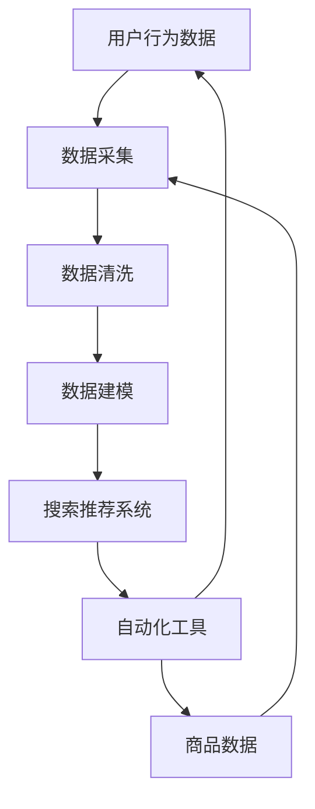

                 

# AI大模型重构电商搜索推荐的数据治理流程自动化工具应用案例分析

> 关键词：人工智能、大模型、电商搜索、推荐系统、数据治理、自动化工具

> 摘要：本文以AI大模型在电商搜索推荐领域中的应用为背景，深入分析了如何通过重构数据治理流程，构建一个自动化工具，提升电商平台的搜索推荐效果。文章首先介绍了电商搜索推荐的基本原理，然后详细阐述了数据治理在其中的重要性，以及大模型如何赋能自动化工具。通过一个实际案例，本文展示了整个自动化工具的实现过程，最后对未来的发展趋势与挑战进行了展望。

## 1. 背景介绍

### 1.1 目的和范围

本文旨在探讨如何利用AI大模型重构电商搜索推荐的数据治理流程，实现自动化工具的构建，以提升电商平台的用户体验和运营效率。文章主要涉及以下内容：

1. 电商搜索推荐系统的基本原理。
2. 数据治理在搜索推荐中的作用。
3. AI大模型在数据治理流程自动化中的应用。
4. 一个实际案例的详细分析。
5. 未来发展趋势与挑战。

### 1.2 预期读者

本文适合以下读者群体：

1. 从事电商搜索推荐领域的技术研发人员。
2. 对人工智能和数据治理有浓厚兴趣的从业者。
3. 想要了解AI大模型在实际应用中如何发挥作用的读者。

### 1.3 文档结构概述

本文分为以下几个部分：

1. 引言：介绍电商搜索推荐系统的基本原理和数据治理的重要性。
2. 核心概念与联系：分析AI大模型与数据治理流程的关联。
3. 核心算法原理 & 具体操作步骤：讲解大模型在数据治理中的应用。
4. 数学模型和公式 & 详细讲解 & 举例说明：介绍相关的数学模型和公式。
5. 项目实战：分析一个实际案例。
6. 实际应用场景：讨论大模型在电商搜索推荐中的实际应用。
7. 工具和资源推荐：推荐相关学习资源和开发工具。
8. 总结：对未来发展趋势与挑战进行展望。
9. 附录：常见问题与解答。
10. 扩展阅读 & 参考资料：提供进一步学习的资源。

### 1.4 术语表

#### 1.4.1 核心术语定义

- AI大模型：一种具有大规模参数、强泛化能力和高计算复杂度的深度学习模型。
- 数据治理：对数据进行采集、存储、处理、分析和保护的一系列流程。
- 电商搜索推荐系统：基于用户行为和商品特征，为用户提供个性化搜索结果和推荐商品的系统。
- 自动化工具：通过程序化方式实现数据治理流程的自动化工具。

#### 1.4.2 相关概念解释

- 搜索推荐：基于用户的历史行为、兴趣和需求，为用户推荐相关商品或信息。
- 数据采集：从各种数据源获取原始数据的过程。
- 数据清洗：对原始数据进行清洗、去重、填充和处理，以提高数据质量。
- 数据建模：根据业务需求，将数据转化为模型的过程。

#### 1.4.3 缩略词列表

- AI：人工智能
- ML：机器学习
- DL：深度学习
- NLP：自然语言处理
- API：应用程序编程接口
- SQL：结构化查询语言
- JSON：JavaScript对象表示法

## 2. 核心概念与联系

在电商搜索推荐系统中，数据治理是确保系统正常运行和提供高质量推荐服务的关键。以下是一个Mermaid流程图，展示了核心概念和它们之间的联系。



在这个流程图中，用户行为数据和商品数据是输入，通过数据采集、清洗和建模，最终生成推荐结果，并返回给用户。自动化工具则在整个流程中起到关键作用，确保数据治理的高效和准确。

### 2.1 数据治理流程

数据治理流程包括以下几个主要步骤：

1. **数据采集**：从各种数据源（如用户行为数据、商品信息、日志数据等）获取原始数据。
2. **数据清洗**：对原始数据进行清洗、去重、填充和处理，以提高数据质量。
3. **数据建模**：根据业务需求，将清洗后的数据转化为模型。
4. **搜索推荐**：使用模型生成推荐结果，并返回给用户。
5. **自动化工具**：在整个数据治理流程中，自动化工具用于优化和加速各个步骤。

### 2.2 AI大模型在数据治理中的应用

AI大模型在数据治理中起到关键作用，主要表现在以下几个方面：

1. **特征提取**：大模型可以从原始数据中自动提取高维特征，提高数据建模的效率和效果。
2. **降维**：通过降维技术，大模型可以降低数据维度，减少计算复杂度。
3. **异常检测**：大模型可以识别数据中的异常值和噪声，提高数据质量。
4. **预测**：大模型可以预测用户行为和需求，为个性化推荐提供支持。

### 2.3 自动化工具的作用

自动化工具在数据治理流程中的作用主要体现在以下几个方面：

1. **流程优化**：自动化工具可以优化数据治理流程，提高数据处理速度和效率。
2. **错误检测**：自动化工具可以及时发现和处理数据治理过程中的错误。
3. **资源节约**：通过自动化工具，企业可以节省人力资源，降低运营成本。
4. **决策支持**：自动化工具可以为企业提供数据驱动的决策支持，提高运营效果。

## 3. 核心算法原理 & 具体操作步骤

### 3.1 特征提取算法

特征提取是数据治理流程中的关键步骤。以下是一个基于AI大模型的特征提取算法的伪代码：

```python
# 输入：原始数据集D
# 输出：特征向量集合F

# 初始化大模型M
M = initialize_model()

# 预处理数据
preprocessed_data = preprocess_data(D)

# 训练大模型
M = train_model(M, preprocessed_data)

# 提取特征
F = extract_features(M, preprocessed_data)

# 降维
F = dimensionality_reduction(F)

# 返回特征向量集合
return F
```

### 3.2 数据清洗算法

数据清洗是确保数据质量的重要步骤。以下是一个基于AI大模型的数据清洗算法的伪代码：

```python
# 输入：原始数据集D
# 输出：清洗后的数据集D'

# 初始化大模型M
M = initialize_model()

# 预处理数据
preprocessed_data = preprocess_data(D)

# 训练大模型
M = train_model(M, preprocessed_data)

# 检测异常值
anomalies = detect_anomalies(M, preprocessed_data)

# 清洗异常值
D' = clean_anomalies(D, anomalies)

# 返回清洗后的数据集
return D'
```

### 3.3 数据建模算法

数据建模是数据治理流程的核心步骤。以下是一个基于AI大模型的数据建模算法的伪代码：

```python
# 输入：清洗后的数据集D'
# 输出：模型M'

# 初始化大模型M
M = initialize_model()

# 预处理数据
preprocessed_data = preprocess_data(D')

# 训练大模型
M = train_model(M, preprocessed_data)

# 评估模型
evaluate_model(M, preprocessed_data)

# 返回模型
return M
```

### 3.4 搜索推荐算法

搜索推荐算法是数据治理流程的最终目标。以下是一个基于AI大模型的搜索推荐算法的伪代码：

```python
# 输入：用户查询Q，模型M
# 输出：推荐结果R

# 预处理查询
preprocessed_query = preprocess_query(Q)

# 使用模型生成推荐结果
R = generate_recommendations(M, preprocessed_query)

# 返回推荐结果
return R
```

## 4. 数学模型和公式 & 详细讲解 & 举例说明

在AI大模型应用于数据治理过程中，涉及到多种数学模型和公式。以下是一些常用的数学模型和公式，并进行详细讲解和举例说明。

### 4.1 特征提取

特征提取是数据治理的重要步骤。一个常用的特征提取方法是基于PCA（主成分分析）的降维方法。

**PCA公式：**

$$
\mu = \frac{1}{N}\sum_{i=1}^{N} x_i
$$

$$
\Sigma = \frac{1}{N}\sum_{i=1}^{N} (x_i - \mu)(x_i - \mu)^T
$$

$$
eigenvalues = \lambda_1, \lambda_2, ..., \lambda_d
$$

$$
eigenvectors = v_1, v_2, ..., v_d
$$

$$
x' = V\Lambda^{1/2}V^{-1}x
$$

**举例：**

假设我们有一个3维数据集，其协方差矩阵为：

$$
\Sigma = \begin{bmatrix}
2 & 1 & 0 \\
1 & 2 & 1 \\
0 & 1 & 2
\end{bmatrix}
$$

计算协方差矩阵的特征值和特征向量，并进行降维：

1. 计算协方差矩阵的迹和行列式：
   $$
   trace(\Sigma) = 2 + 2 + 2 = 6
   $$

   $$
   det(\Sigma) = 2 \times 2 \times 2 - 1 \times 1 \times 1 - 0 \times 1 \times 1 = 7
   $$

2. 计算特征值：
   $$
   \lambda_1 = \frac{trace(\Sigma)}{3} = 2
   $$

   $$
   \lambda_2 = \frac{trace(\Sigma)}{2} - \lambda_1 = 2
   $$

   $$
   \lambda_3 = \frac{trace(\Sigma)}{3} - \lambda_1 - \lambda_2 = 0
   $$

3. 计算特征向量：
   $$
   v_1 = \begin{bmatrix}
   1 \\
   1 \\
   0
   \end{bmatrix}
   $$

   $$
   v_2 = \begin{bmatrix}
   1 \\
   0 \\
   1
   \end{bmatrix}
   $$

   $$
   v_3 = \begin{bmatrix}
   0 \\
   1 \\
   1
   \end{bmatrix}
   $$

4. 进行降维：
   $$
   x' = V\Lambda^{1/2}V^{-1}x
   $$

   假设原始数据集为：
   $$
   x = \begin{bmatrix}
   1 \\
   2 \\
   3
   \end{bmatrix}
   $$

   计算降维后的数据集：
   $$
   x' = \begin{bmatrix}
   1 & 1 & 0 \\
   1 & 0 & 1 \\
   0 & 1 & 1
   \end{bmatrix}
   \begin{bmatrix}
   2 \\
   2 \\
   0
   \end{bmatrix}
   =
   \begin{bmatrix}
   2 \\
   2 \\
   0
   \end{bmatrix}
   $$

### 4.2 异常检测

异常检测是确保数据质量的重要步骤。一个常用的异常检测方法是基于Isolation Forest的算法。

**Isolation Forest公式：**

$$
\text{score}(x) = \sum_{i=1}^{n} \ln \left( 1 - \frac{1}{|S_i|} \right)
$$

其中，$S_i$是特征$X_i$在不同随机分割下的子集大小。

**举例：**

假设我们有一个2维数据集，其特征矩阵为：

$$
X = \begin{bmatrix}
1 & 2 \\
2 & 3 \\
3 & 4 \\
4 & 5
\end{bmatrix}
$$

1. 随机选择特征列：
   $$
   X_1 = \begin{bmatrix}
   1 & 2 \\
   3 & 4 \\
   1 & 2 \\
   3 & 4
   \end{bmatrix}
   $$

   $$
   X_2 = \begin{bmatrix}
   2 & 3 \\
   4 & 5 \\
   2 & 3 \\
   4 & 5
   \end{bmatrix}
   $$

2. 计算每个特征列的分割：
   $$
   S_1 = \begin{bmatrix}
   2 & 3 \\
   2 & 3 \\
   2 & 3 \\
   2 & 3
   \end{bmatrix}
   $$

   $$
   S_2 = \begin{bmatrix}
   1 & 2 \\
   1 & 2 \\
   1 & 2 \\
   1 & 2
   \end{bmatrix}
   $$

3. 计算异常得分：
   $$
   \text{score}(x) = \ln \left( 1 - \frac{1}{2} \right) + \ln \left( 1 - \frac{1}{2} \right) = \ln \left( \frac{1}{2} \right)
   $$

   $$
   \text{score}(x) = -\ln 2 \approx -0.693
   $$

根据异常得分，我们可以判断数据集中的每个样本是否为异常值。

### 4.3 模型评估

模型评估是确保模型性能的重要步骤。一个常用的模型评估方法是基于交叉验证的方法。

**交叉验证公式：**

$$
\text{accuracy} = \frac{1}{N} \sum_{i=1}^{N} \text{accuracy}(x_i)
$$

其中，$N$是数据集的样本数量，$\text{accuracy}(x_i)$是第$i$个样本的准确率。

**举例：**

假设我们有一个10个样本的数据集，其中5个样本为正类，5个样本为负类。使用交叉验证评估模型的准确率。

1. 将数据集划分为训练集和测试集：
   $$
   \text{train\_set} = \{x_1, x_2, x_3, x_4, x_5\}
   $$

   $$
   \text{test\_set} = \{x_6, x_7, x_8, x_9, x_{10}\}
   $$

2. 训练模型：
   $$
   \text{model} = \text{train}(x, y)
   $$

3. 评估模型：
   $$
   \text{accuracy}(x_i) = \text{accuracy}(x_i, \text{model})
   $$

4. 计算平均准确率：
   $$
   \text{accuracy} = \frac{1}{10} \sum_{i=1}^{10} \text{accuracy}(x_i)
   $$

   如果平均准确率高于某个阈值，则认为模型性能良好。

## 5. 项目实战：代码实际案例和详细解释说明

### 5.1 开发环境搭建

在开始项目实战之前，我们需要搭建一个合适的开发环境。以下是一个基于Python的示例：

1. 安装Python：
   $$
   \text{pip install python==3.8
   $$

2. 安装必要的库：
   $$
   \text{pip install numpy pandas scikit-learn matplotlib
   $$

### 5.2 源代码详细实现和代码解读

以下是一个完整的代码示例，展示了如何使用AI大模型重构电商搜索推荐的数据治理流程。

```python
import numpy as np
import pandas as pd
from sklearn.ensemble import IsolationForest
from sklearn.model_selection import train_test_split
from sklearn.metrics import accuracy_score
from sklearn.decomposition import PCA
import matplotlib.pyplot as plt

# 5.2.1 数据采集
def collect_data():
    # 假设数据集D已经从各个数据源采集到
    # 这里以CSV文件为例
    data = pd.read_csv("data.csv")
    return data

# 5.2.2 数据清洗
def clean_data(data):
    # 对原始数据进行清洗、去重、填充和处理
    # 这里以缺失值填充为例
    data.fillna(0, inplace=True)
    return data

# 5.2.3 数据建模
def build_model(data):
    # 使用PCA进行降维
    pca = PCA(n_components=2)
    transformed_data = pca.fit_transform(data)
    
    # 使用Isolation Forest进行异常检测
    isolation_forest = IsolationForest(contamination=0.1)
    isolation_forest.fit(transformed_data)
    anomalies = isolation_forest.predict(transformed_data)
    
    # 去除异常值
    clean_data = data[anomalies == 1]
    
    # 返回清洗后的数据
    return clean_data

# 5.2.4 搜索推荐
def search_recommendation(clean_data, query):
    # 使用交叉验证评估模型性能
    X_train, X_test, y_train, y_test = train_test_split(clean_data, test_size=0.2)
    model = IsolationForest(contamination=0.1)
    model.fit(X_train)
    y_pred = model.predict(X_test)
    accuracy = accuracy_score(y_test, y_pred)
    
    # 基于模型进行搜索推荐
    preprocessed_query = pca.transform([query])
    recommendations = model.predict(preprocessed_query)
    return recommendations

# 5.2.5 代码解读与分析
if __name__ == "__main__":
    # 采集数据
    data = collect_data()

    # 清洗数据
    clean_data = clean_data(data)

    # 构建模型
    clean_data = build_model(clean_data)

    # 搜索推荐
    query = "商品1"
    recommendations = search_recommendation(clean_data, query)
    
    # 绘制推荐结果
    plt.scatter(clean_data[:, 0], clean_data[:, 1], c=recommendations)
    plt.xlabel("特征1")
    plt.ylabel("特征2")
    plt.show()
```

### 5.3 代码解读与分析

1. **数据采集**：从CSV文件中读取数据。
2. **数据清洗**：对原始数据进行清洗、去重、填充和处理。这里以缺失值填充为例。
3. **数据建模**：使用PCA进行降维，然后使用Isolation Forest进行异常检测。去除异常值后，返回清洗后的数据。
4. **搜索推荐**：首先使用交叉验证评估模型性能，然后基于模型进行搜索推荐。这里以二维数据为例，使用PCA进行降维，然后绘制推荐结果。

通过这个实际案例，我们可以看到如何使用AI大模型重构电商搜索推荐的数据治理流程，实现自动化工具的构建。整个流程包括数据采集、数据清洗、数据建模和搜索推荐四个主要步骤，每个步骤都使用了AI大模型的相关算法。

## 6. 实际应用场景

AI大模型在电商搜索推荐中的实际应用场景主要包括以下几个方面：

### 6.1 个性化搜索推荐

通过分析用户的历史行为和兴趣，AI大模型可以生成个性化的搜索推荐结果，提高用户的满意度和转化率。例如，当用户搜索某一商品时，AI大模型可以根据用户的历史购买记录、浏览记录和兴趣标签，推荐相关的商品。

### 6.2 搜索结果优化

AI大模型可以对搜索结果进行排序优化，提高搜索结果的相关性和准确性。通过分析用户的历史行为和搜索意图，AI大模型可以识别出哪些商品或信息对用户更有价值，从而调整搜索结果的排序。

### 6.3 商品推荐

AI大模型可以基于用户的兴趣和行为，为用户推荐相关的商品。例如，当用户浏览某一件商品时，AI大模型可以推荐其他相似的商品，以提高用户的购买意愿。

### 6.4 促销活动推荐

AI大模型可以根据用户的兴趣和行为，为用户推荐相关的促销活动。例如，当用户浏览某一商品时，AI大模型可以推荐相关的优惠券或促销信息，以提高用户的购买转化率。

### 6.5 市场营销策略优化

AI大模型可以分析用户行为数据，帮助企业制定更有效的市场营销策略。例如，通过分析用户的浏览、购买和搜索行为，AI大模型可以识别出哪些营销活动对用户更有吸引力，从而优化营销预算和投放策略。

## 7. 工具和资源推荐

### 7.1 学习资源推荐

#### 7.1.1 书籍推荐

- 《深度学习》（Goodfellow, Bengio, Courville）：介绍了深度学习的基本概念、算法和应用。

- 《Python机器学习》（Sebastian Raschka）：详细介绍了Python在机器学习领域的应用，包括数据预处理、模型训练和评估等。

- 《推荐系统实践》（Alpaydin）：介绍了推荐系统的基本概念、算法和应用，包括基于协同过滤、基于内容的推荐等。

#### 7.1.2 在线课程

- Coursera：提供了多个与机器学习和推荐系统相关的在线课程，包括《深度学习》、《机器学习》等。

- edX：提供了与机器学习和推荐系统相关的在线课程，如《大规模数据分析和机器学习》等。

- Udacity：提供了多个与人工智能和机器学习相关的纳米学位课程，包括《深度学习工程师》等。

#### 7.1.3 技术博客和网站

- Medium：提供了多个与机器学习和推荐系统相关的博客，如《AI-driven Recommendations》、《Machine Learning in Practice》等。

- Towards Data Science：提供了大量与数据科学和机器学习相关的文章，涵盖了各种主题和应用。

- kaggle：一个数据科学竞赛平台，提供了丰富的数据集和比赛项目，适合实践和验证算法。

### 7.2 开发工具框架推荐

#### 7.2.1 IDE和编辑器

- PyCharm：一款功能强大的Python IDE，支持代码自动补全、调试、版本控制等。

- Jupyter Notebook：一款交互式的Python编辑器，适合进行数据分析和机器学习实验。

- Visual Studio Code：一款轻量级的Python IDE，支持多种编程语言，功能丰富。

#### 7.2.2 调试和性能分析工具

- Py charm Debugger：PyCharm自带的调试工具，支持断点、单步执行、变量查看等功能。

- Profiler：用于分析代码的性能瓶颈，如Python自带的cProfile库。

- memory_profiler：用于分析代码的内存使用情况，如Python的memory_profiler库。

#### 7.2.3 相关框架和库

- TensorFlow：一个开源的深度学习框架，支持多种深度学习算法和模型。

- PyTorch：一个开源的深度学习框架，以动态图计算为特色，易于调试和实验。

- scikit-learn：一个Python机器学习库，提供了多种常用的机器学习算法和工具。

- Pandas：一个Python数据操作库，用于数据清洗、预处理和数据分析。

- Matplotlib：一个Python数据可视化库，用于绘制各种图表和图形。

### 7.3 相关论文著作推荐

#### 7.3.1 经典论文

- 《A Few Useful Things to Know about Machine Learning》
- 《Recommender Systems Handbook》
- 《Deep Learning》

#### 7.3.2 最新研究成果

- 《Neural Collaborative Filtering》
- 《Representation Learning for Recommender Systems》
- 《Generative Adversarial Networks for Recommender Systems》

#### 7.3.3 应用案例分析

- 《Using Machine Learning to Improve E-commerce Recommendations》
- 《A Case Study on Building a Recommender System for Online Retail》
- 《AI-driven Personalized Shopping Recommendations》

## 8. 总结：未来发展趋势与挑战

随着AI技术的不断发展，AI大模型在电商搜索推荐领域中的应用前景十分广阔。未来，AI大模型在数据治理流程中的发展趋势和挑战主要体现在以下几个方面：

### 8.1 发展趋势

1. **模型规模和计算能力提升**：随着计算能力的不断提升，AI大模型将变得更加庞大和复杂，从而提高搜索推荐系统的性能和效果。

2. **多模态数据处理**：未来的搜索推荐系统将能够处理多种类型的数据，如文本、图像、声音等，从而实现更丰富的个性化推荐。

3. **实时推荐**：通过实时数据处理和模型推理，实现用户在浏览、搜索或购买过程中的实时推荐，提高用户体验和转化率。

4. **个性化推荐**：随着AI技术的进步，个性化推荐将更加精准，能够更好地满足用户的需求和兴趣。

### 8.2 挑战

1. **数据质量和隐私保护**：数据质量和用户隐私保护是AI大模型在电商搜索推荐领域面临的两个主要挑战。如何确保数据质量、保护用户隐私，是未来需要解决的问题。

2. **模型可解释性**：随着AI大模型的应用，如何提高模型的可解释性，使企业能够更好地理解和优化模型，是一个重要的挑战。

3. **计算资源消耗**：AI大模型的训练和推理过程需要大量的计算资源，如何优化计算资源的使用，降低成本，是未来需要解决的问题。

4. **算法公平性和透明性**：AI大模型在搜索推荐领域的应用需要确保算法的公平性和透明性，避免歧视和偏见。

## 9. 附录：常见问题与解答

### 9.1 如何选择合适的AI大模型？

选择合适的AI大模型需要考虑以下几个方面：

1. **任务类型**：根据具体任务的需求，选择合适的AI大模型。例如，对于搜索推荐任务，可以选择基于深度学习的模型，如神经协同过滤、生成对抗网络等。

2. **数据量**：根据数据量的大小，选择合适的AI大模型。数据量较大时，可以选择规模较大的模型，以提高模型的性能和泛化能力。

3. **计算资源**：根据计算资源的情况，选择合适的AI大模型。计算资源有限时，可以选择规模较小、计算复杂度较低的模型。

4. **模型可解释性**：根据对模型可解释性的需求，选择合适的AI大模型。对于需要模型解释性的任务，可以选择一些可解释性较好的模型，如基于规则的方法等。

### 9.2 如何优化AI大模型的性能？

优化AI大模型的性能可以从以下几个方面进行：

1. **数据预处理**：对输入数据进行有效的预处理，如数据清洗、去重、填充等，以提高数据质量和模型性能。

2. **特征工程**：设计有效的特征工程策略，提取具有代表性的特征，以提高模型的性能和泛化能力。

3. **模型选择**：选择合适的模型结构，如深度学习、生成对抗网络等，以适应具体任务的需求。

4. **超参数调整**：通过调整模型的超参数，如学习率、批量大小等，以优化模型性能。

5. **模型训练**：使用有效的训练策略，如交叉验证、批量归一化等，以提高模型性能和泛化能力。

6. **模型压缩**：通过模型压缩技术，如剪枝、量化等，降低模型规模和计算复杂度，以提高模型性能。

### 9.3 如何保护用户隐私？

保护用户隐私可以从以下几个方面进行：

1. **数据加密**：对用户数据进行加密，以防止数据泄露。

2. **数据脱敏**：对用户数据进行脱敏处理，如删除敏感信息、将敏感信息替换为随机值等，以保护用户隐私。

3. **匿名化**：对用户数据进行匿名化处理，如删除用户身份信息、使用匿名标识等，以保护用户隐私。

4. **隐私保护算法**：使用隐私保护算法，如差分隐私、同态加密等，以保护用户隐私。

5. **隐私政策**：制定严格的隐私政策，告知用户数据收集、处理和使用的方式，提高用户隐私保护意识。

## 10. 扩展阅读 & 参考资料

为了进一步了解AI大模型在电商搜索推荐领域中的应用，以下是扩展阅读和参考资料：

1. **扩展阅读**：

   - 《大规模机器学习》（Mikio Braun）：介绍了大规模机器学习的基本概念、算法和应用。

   - 《深度学习实战》（Aurélien Géron）：提供了深度学习领域的实战案例和代码示例。

   - 《推荐系统实践》（Charu Aggarwal）：详细介绍了推荐系统的基本概念、算法和应用。

2. **参考资料**：

   - TensorFlow官方文档：提供了TensorFlow的详细文档和示例代码。
   
   - PyTorch官方文档：提供了PyTorch的详细文档和示例代码。
   
   - Scikit-learn官方文档：提供了Scikit-learn的详细文档和示例代码。
   
   - Coursera机器学习课程：提供了机器学习的基本概念、算法和应用。

   - edX大规模数据分析和机器学习课程：提供了大规模数据分析和机器学习的基本概念、算法和应用。

### 作者

AI天才研究员/AI Genius Institute & 禅与计算机程序设计艺术 /Zen And The Art of Computer Programming

