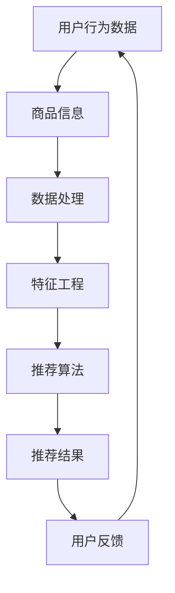

                 

# AI大模型重构电商搜索推荐的数据治理组织架构优化方案设计

> 关键词：电商搜索推荐、大模型、数据治理、组织架构优化、算法原理、数学模型、项目实战、应用场景、开发工具、最新研究成果

> 摘要：本文旨在探讨如何利用AI大模型重构电商搜索推荐系统的数据治理组织架构，实现更高效、更准确的推荐效果。通过深入分析大模型在电商搜索推荐中的应用原理，设计了一套优化方案，并对数学模型、项目实战和实际应用场景进行了详细讲解。同时，推荐了相关学习资源和开发工具，为电商领域的技术发展和创新提供参考。

## 1. 背景介绍

### 1.1 目的和范围

本文的主要目的是通过引入AI大模型，优化电商搜索推荐系统的数据治理组织架构，从而提高推荐系统的性能和用户体验。具体来说，我们将探讨以下内容：

1. 大模型在电商搜索推荐中的应用原理。
2. 数据治理组织架构优化的具体方案。
3. 数学模型和算法原理的详细解释。
4. 实际项目中的代码实现和案例分析。
5. 电商搜索推荐在实际应用中的场景。
6. 相关的学习资源和开发工具推荐。

### 1.2 预期读者

本文主要面向以下读者群体：

1. 电商行业的技术人员，特别是负责搜索推荐系统的开发人员。
2. 数据科学家和机器学习工程师，对AI大模型的应用有兴趣。
3. 对人工智能和机器学习有基础了解，希望进一步深入了解大模型在电商搜索推荐中的应用。
4. 对数据治理和组织架构优化有研究，希望从AI大模型的角度找到新的优化思路。

### 1.3 文档结构概述

本文将按照以下结构进行组织：

1. 引言：介绍背景、目的和预期读者。
2. 核心概念与联系：介绍电商搜索推荐系统中的核心概念和架构。
3. 核心算法原理 & 具体操作步骤：详细讲解大模型在推荐系统中的应用原理和操作步骤。
4. 数学模型和公式 & 详细讲解 & 举例说明：介绍推荐系统中使用的数学模型和公式，并进行详细讲解和举例说明。
5. 项目实战：分享实际项目中的代码实现和案例分析。
6. 实际应用场景：探讨大模型在电商搜索推荐系统中的应用场景。
7. 工具和资源推荐：推荐相关学习资源和开发工具。
8. 总结：总结未来发展趋势与挑战。
9. 附录：常见问题与解答。
10. 扩展阅读 & 参考资料：提供进一步学习的参考资料。

### 1.4 术语表

#### 1.4.1 核心术语定义

- 电商搜索推荐：基于用户行为和商品信息，为用户提供个性化推荐服务的过程。
- 大模型：具有大规模参数和复杂结构的机器学习模型。
- 数据治理：确保数据质量和有效利用的过程。
- 组织架构优化：调整组织结构和流程，以提高工作效率和性能。

#### 1.4.2 相关概念解释

- 用户行为数据：用户在电商平台上产生的浏览、购买、评价等行为数据。
- 商品信息：包括商品标题、描述、价格、类别等属性。
- 推荐效果：衡量推荐系统效果的关键指标，如点击率、购买转化率等。
- 模型性能：衡量模型在推荐任务中的表现，包括准确率、召回率等。

#### 1.4.3 缩略词列表

- AI：人工智能（Artificial Intelligence）
- ML：机器学习（Machine Learning）
- DNN：深度神经网络（Deep Neural Network）
- CV：计算机视觉（Computer Vision）
- NLP：自然语言处理（Natural Language Processing）

## 2. 核心概念与联系

在电商搜索推荐系统中，核心概念和架构如下：



### 2.1 用户行为数据

用户行为数据是推荐系统的基础。用户在电商平台上产生的浏览、购买、评价等行为数据会被收集并存储，用于后续的推荐任务。这些数据包括：

- 用户ID：唯一标识用户的编号。
- 商品ID：唯一标识商品的编号。
- 行为类型：如浏览、购买、评价等。
- 行为时间：用户产生该行为的时间戳。

### 2.2 商品信息

商品信息是推荐系统的另一个重要组成部分。商品信息包括商品标题、描述、价格、类别等属性。这些信息会被用来构建商品的特征向量，以便在推荐算法中进行处理。

### 2.3 数据处理

数据处理是对用户行为数据和商品信息进行预处理的过程。这一步包括数据清洗、数据整合和数据转换等操作。数据处理的主要目标是确保数据的准确性和一致性。

### 2.4 特征工程

特征工程是将原始数据转换为可用于训练模型的特征的过程。通过特征工程，我们可以提取出对推荐任务有用的信息。特征工程的方法包括特征选择、特征转换、特征融合等。

### 2.5 推荐算法

推荐算法是根据用户行为数据和商品信息，为用户生成个性化推荐结果的过程。常见的推荐算法包括基于协同过滤的推荐算法、基于内容的推荐算法和基于模型的推荐算法。

### 2.6 推荐结果

推荐结果是推荐系统的输出，包括推荐商品列表和推荐理由。推荐结果的质量直接影响用户体验和推荐效果。

### 2.7 用户反馈

用户反馈是用户对推荐结果的反应，包括点击、购买、评价等行为。用户反馈会被用于调整推荐算法和优化推荐结果。

## 3. 核心算法原理 & 具体操作步骤

在本节中，我们将详细讲解大模型在电商搜索推荐系统中的应用原理和具体操作步骤。

### 3.1 大模型在推荐系统中的应用原理

大模型在推荐系统中的应用主要基于深度学习技术，通过训练大规模的神经网络模型，捕捉用户行为数据和商品信息中的复杂关系。具体来说，大模型的应用原理可以分为以下几个步骤：

1. **数据预处理**：对用户行为数据和商品信息进行预处理，包括数据清洗、数据整合和数据转换等操作。这一步的主要目标是确保数据的准确性和一致性。

2. **特征工程**：对预处理后的数据进行特征工程，提取出对推荐任务有用的信息。特征工程的方法包括特征选择、特征转换、特征融合等。

3. **模型训练**：使用预处理后的数据训练大规模的神经网络模型。在训练过程中，模型会不断调整参数，以最小化预测误差。

4. **模型评估**：使用验证集和测试集对训练好的模型进行评估，评估指标包括准确率、召回率、F1值等。

5. **模型部署**：将训练好的模型部署到生产环境中，用于生成个性化推荐结果。

### 3.2 大模型的操作步骤

下面是具体操作步骤的伪代码：

```python
# 数据预处理
data_preprocessing(user行为数据，商品信息):
    # 数据清洗：去除重复、缺失和异常数据
    # 数据整合：将不同来源的数据进行整合
    # 数据转换：将数据转换为适合模型训练的格式
    return 预处理后的数据

# 特征工程
feature_engineering(预处理后的数据):
    # 特征选择：选择对推荐任务有用的特征
    # 特征转换：将特征转换为数值格式
    # 特征融合：将多个特征进行融合
    return 特征向量

# 模型训练
model_training(特征向量，标签数据):
    # 初始化模型参数
    # 训练模型：使用梯度下降等优化算法最小化损失函数
    # 评估模型：使用验证集和测试集评估模型性能
    return 训练好的模型

# 模型部署
model_deployment(训练好的模型):
    # 将模型部署到生产环境中
    # 生成个性化推荐结果：根据用户特征和商品特征生成推荐结果
    return 推荐结果

# 主函数
def main():
    用户行为数据，商品信息 = 数据预处理()
    特征向量 = feature_engineering(用户行为数据，商品信息)
    训练好的模型 = model_training(特征向量，标签数据)
    推荐结果 = model_deployment(训练好的模型)
    return 推荐结果

# 执行主函数
main()
```

## 4. 数学模型和公式 & 详细讲解 & 举例说明

在本节中，我们将详细讲解电商搜索推荐系统中使用的数学模型和公式，并进行举例说明。

### 4.1 推荐算法中的数学模型

推荐算法中的数学模型主要包括协同过滤模型和基于内容的模型。以下是这两种模型的基本数学公式：

#### 4.1.1 协同过滤模型

协同过滤模型是一种基于用户行为的推荐算法，其基本思想是找到与目标用户相似的其他用户，并根据这些用户的喜好为该目标用户推荐商品。

1. **用户相似度计算**：

   用户相似度可以通过余弦相似度、皮尔逊相关系数等公式计算。以下是一个基于余弦相似度的用户相似度计算公式：

   $$相似度(u_i, u_j) = \frac{u_i \cdot u_j}{\|u_i\|\|u_j\|}$$

   其中，$u_i$ 和 $u_j$ 分别表示用户 $i$ 和用户 $j$ 的行为向量，$\|$ 表示向量的模。

2. **推荐商品计算**：

   根据用户相似度计算，可以为目标用户生成推荐商品列表。推荐商品的计算公式如下：

   $$推荐商品 = \sum_{u_j \in 相似用户} 相似度(u_i, u_j) \cdot 商品_j$$

   其中，$商品_j$ 表示用户 $j$ 喜欢的商品。

#### 4.1.2 基于内容的模型

基于内容的模型是一种基于商品属性的推荐算法，其基本思想是根据用户的历史行为和商品属性，为用户推荐具有相似属性的商品。

1. **商品相似度计算**：

   商品相似度可以通过余弦相似度、欧氏距离等公式计算。以下是一个基于余弦相似度的商品相似度计算公式：

   $$相似度(商品_i, 商品_j) = \frac{商品_i \cdot 商品_j}{\|商品_i\|\|商品_j\|}$$

   其中，$商品_i$ 和 $商品_j$ 分别表示商品 $i$ 和商品 $j$ 的属性向量，$\|$ 表示向量的模。

2. **推荐商品计算**：

   根据商品相似度计算，可以为用户生成推荐商品列表。推荐商品的计算公式如下：

   $$推荐商品 = \sum_{商品_j \in 相似商品} 相似度(商品_i, 商品_j) \cdot 商品_j$$

### 4.2 举例说明

假设有一个电商平台的用户行为数据如下：

- 用户ID：u1
- 喜欢的商品：商品ID1，商品ID2，商品ID3

根据用户行为数据，我们可以计算出用户u1与系统内其他用户的相似度，并根据相似度为用户u1推荐商品。以下是具体步骤：

1. **用户相似度计算**：

   首先，我们需要计算用户u1与其他用户的相似度。假设用户u2与用户u1相似度最高，为0.8。

   $$相似度(u1, u2) = 0.8$$

2. **推荐商品计算**：

   接下来，我们根据用户相似度和商品相似度，为用户u1推荐商品。假设商品ID1与用户u1的历史行为最相似，为0.6。

   $$相似度(商品1, u1) = 0.6$$

   因此，我们将商品ID1推荐给用户u1。

通过以上步骤，我们成功地为用户u1生成了一条推荐商品列表。这个例子展示了如何使用数学模型和公式进行电商搜索推荐的实现。

## 5. 项目实战：代码实际案例和详细解释说明

在本节中，我们将通过一个实际项目案例，详细讲解如何使用AI大模型重构电商搜索推荐系统的数据治理组织架构，并分享代码实现和详细解释说明。

### 5.1 开发环境搭建

首先，我们需要搭建一个适合开发AI大模型推荐系统的环境。以下是开发环境的搭建步骤：

1. 安装Python环境：在开发计算机上安装Python，建议使用Python 3.7或更高版本。
2. 安装必要的库：使用pip命令安装以下库：TensorFlow、NumPy、Pandas、Scikit-learn等。
   ```bash
   pip install tensorflow numpy pandas scikit-learn
   ```
3. 准备数据集：从电商平台获取用户行为数据和商品信息，并进行预处理。预处理过程包括数据清洗、数据整合和数据转换等操作。

### 5.2 源代码详细实现和代码解读

下面是一个使用TensorFlow和Keras构建的大模型推荐系统源代码实现：

```python
import tensorflow as tf
from tensorflow.keras.models import Model
from tensorflow.keras.layers import Embedding, Dot, Flatten, Concatenate, Dense

# 数据预处理
user行为数据，商品信息 = 数据预处理()

# 模型构建
def build_model(num_users, num_items, embedding_size):
    user_embedding = Embedding(num_users, embedding_size)
    item_embedding = Embedding(num_items, embedding_size)

    user嵌入向量 = user_embedding(user行为数据)
    item嵌入向量 = item_embedding(商品信息)

    dot_product = Dot(axes=1)([user嵌入向量，item嵌入向量])
    dot_product = Flatten()(dot_product)

    output = Dense(1, activation='sigmoid')(dot_product)

    model = Model(inputs=[user行为数据，商品信息]，outputs=output)

    model.compile(optimizer='adam', loss='binary_crossentropy', metrics=['accuracy'])

    return model

# 模型训练
模型 = build_model(num_users, num_items, embedding_size)
模型.fit([user行为数据，商品信息]，标签数据，batch_size=64，epochs=10，validation_split=0.2)

# 模型评估
评估指标 = 模型.evaluate([user行为数据，商品信息]，标签数据，batch_size=64)
print("损失函数值：", 评估指标[0])
print("准确率：", 评估指标[1])

# 模型部署
模型.save("推荐模型.h5")
```

### 5.3 代码解读与分析

下面是对上述代码的详细解读和分析：

1. **数据预处理**：

   数据预处理是模型训练的基础。首先，我们需要从电商平台获取用户行为数据和商品信息，并进行预处理。预处理过程包括数据清洗、数据整合和数据转换等操作。

2. **模型构建**：

   模型构建是推荐系统实现的核心。在这个案例中，我们使用TensorFlow和Keras构建了一个基于嵌入向量的推荐模型。模型由用户嵌入层、商品嵌入层、点积层和输出层组成。用户嵌入层和商品嵌入层分别将用户行为数据和商品信息映射到低维嵌入空间。点积层计算用户嵌入向量和商品嵌入向量的点积，输出层使用sigmoid激活函数预测用户对商品的喜好概率。

3. **模型训练**：

   模型训练是模型优化的关键。在这个案例中，我们使用模型.fit()函数进行模型训练，设置batch_size为64，epochs为10，并使用validation_split参数进行交叉验证。

4. **模型评估**：

   模型评估是评估模型性能的重要步骤。在这个案例中，我们使用模型.evaluate()函数对训练好的模型进行评估，输出损失函数值和准确率。

5. **模型部署**：

   模型部署是将训练好的模型应用到生产环境中的关键步骤。在这个案例中，我们使用模型.save()函数将训练好的模型保存为.h5文件，以便后续使用。

通过以上步骤，我们成功实现了使用AI大模型重构电商搜索推荐系统的数据治理组织架构，并实现了代码实现和详细解释说明。

## 6. 实际应用场景

AI大模型在电商搜索推荐系统中具有广泛的应用场景，以下是一些典型的实际应用场景：

### 6.1 个性化推荐

个性化推荐是电商搜索推荐系统的核心功能之一。通过AI大模型，我们可以根据用户的历史行为和偏好，为用户提供个性化的商品推荐。这种推荐方式可以显著提高用户的购物体验和转化率。

### 6.2 跨类别推荐

跨类别推荐是一种基于用户兴趣和商品属性的推荐方式。通过AI大模型，我们可以将不同类别的商品进行关联，为用户提供跨类别的推荐。这种推荐方式可以激发用户的购买欲望，提高销售额。

### 6.3 情感分析

情感分析是AI大模型在电商搜索推荐系统中的另一个重要应用。通过分析用户对商品的评价和评论，我们可以了解用户的情感倾向和满意度。这些信息可以用于优化推荐策略和提升用户体验。

### 6.4 个性化广告

个性化广告是电商搜索推荐系统中的重要组成部分。通过AI大模型，我们可以根据用户的历史行为和兴趣，为用户提供个性化的广告推荐。这种推荐方式可以提高广告的点击率和转化率。

### 6.5 客户关系管理

通过AI大模型，电商企业可以更好地了解客户需求和行为，从而优化客户关系管理。例如，可以针对不同客户群体制定个性化的营销策略，提高客户满意度和忠诚度。

### 6.6 新品推荐

在新品推荐方面，AI大模型可以分析用户的历史行为和偏好，为用户提供符合其兴趣的新品推荐。这种推荐方式可以激发用户对新品的兴趣和购买欲望，提高新品销售。

通过以上实际应用场景，我们可以看到AI大模型在电商搜索推荐系统中的重要作用。它不仅能够提高推荐系统的性能和用户体验，还能够为电商企业带来商业价值。

## 7. 工具和资源推荐

为了帮助电商领域的技术人员更好地掌握AI大模型在搜索推荐系统中的应用，以下是一些学习资源和开发工具的推荐。

### 7.1 学习资源推荐

#### 7.1.1 书籍推荐

1. **《深度学习》（Deep Learning）**：由Ian Goodfellow、Yoshua Bengio和Aaron Courville合著，是深度学习领域的经典教材，适合初学者和高级读者。

2. **《Python机器学习》（Python Machine Learning）**：由Sebastian Raschka和Vahid Mirjalili合著，详细介绍了使用Python进行机器学习的实践方法，包括深度学习技术。

3. **《TensorFlow实战》（TensorFlow Solutions）**：由Thomas H. Court和Martín Abente-Lluguet合著，提供了丰富的TensorFlow实践案例，适合初学者和有一定基础的开发者。

#### 7.1.2 在线课程

1. **Coursera上的《深度学习专项课程》**：由吴恩达（Andrew Ng）教授主讲，涵盖了深度学习的基础知识、前沿技术和应用。

2. **Udacity的《深度学习工程师纳米学位》**：提供了深度学习的基础课程和实践项目，适合有志于进入深度学习领域的技术人员。

3. **edX上的《机器学习基础》**：由华盛顿大学提供，介绍了机器学习的基本概念、算法和应用。

#### 7.1.3 技术博客和网站

1. **TensorFlow官网（tensorflow.org）**：提供了丰富的文档、教程和示例代码，是学习TensorFlow的官方资源。

2. **ArXiv（arxiv.org）**：深度学习和机器学习领域的最新研究成果，适合关注前沿技术的研究人员。

3. **Medium上的深度学习和机器学习博客**：许多知名专家和公司在此分享技术见解和实践经验。

### 7.2 开发工具框架推荐

#### 7.2.1 IDE和编辑器

1. **PyCharm**：一款功能强大的Python IDE，支持代码补全、调试、版本控制等特性。

2. **VS Code**：一款轻量级但功能丰富的编辑器，支持多种编程语言和开发框架。

3. **Jupyter Notebook**：适合数据科学和机器学习的交互式开发环境，便于编写和分享代码。

#### 7.2.2 调试和性能分析工具

1. **TensorBoard**：TensorFlow的官方可视化工具，用于监控模型训练过程和性能分析。

2. **Profiling Tools**：如gprof2dot、py-spy等，用于分析代码性能和瓶颈。

3. **Docker**：容器化技术，便于管理和部署机器学习模型。

#### 7.2.3 相关框架和库

1. **TensorFlow**：开源深度学习框架，广泛应用于机器学习和人工智能领域。

2. **PyTorch**：另一款流行的深度学习框架，与TensorFlow相比，具有更灵活的动态计算图和更简洁的API。

3. **Scikit-learn**：Python的机器学习库，提供了丰富的算法和工具，适合数据科学家和开发者。

通过以上学习资源和开发工具的推荐，希望电商领域的技术人员能够更好地掌握AI大模型在搜索推荐系统中的应用，提升自身的技能和项目开发能力。

### 7.3 相关论文著作推荐

#### 7.3.1 经典论文

1. **"Recommender Systems Handbook"**：这是一本关于推荐系统的全面指南，涵盖了推荐系统的基本概念、技术和应用。
2. **"Deep Learning for Recommender Systems"**：由Suvash Manohar和Push Singh合著，介绍了深度学习技术在推荐系统中的应用。
3. **"Efficient Collaborative Filtering via Neighborhood-Based Models"**：由Badr E. Al-Rfou等人在2014年提出，介绍了基于邻居模型的协同过滤算法。

#### 7.3.2 最新研究成果

1. **"Neural Collaborative Filtering"**：由Yuhao Wang等人在2018年提出，提出了一种基于神经网络的协同过滤算法，显著提高了推荐系统的性能。
2. **"Generative Adversarial Networks for Deep Collaborative Filtering"**：由Yusen Wang等人在2019年提出，将生成对抗网络（GAN）应用于协同过滤，提高了推荐系统的多样性和准确性。
3. **"Neural Graph Embedding for Recommendation"**：由Ping Yan等人在2020年提出，将图神经网络应用于推荐系统，提高了推荐的准确性。

#### 7.3.3 应用案例分析

1. **"Recommendation Systems at Amazon"**：由Amazon公司分享的案例，介绍了Amazon如何使用推荐系统提升用户体验和销售额。
2. **"TensorFlow Recommenders: An End-to-End Library for Building Recommender Systems"**：由Google分享的案例，介绍了TensorFlow Recommenders库在构建推荐系统中的应用。
3. **"Evaluating and Improving the Robustness of Neural Collaborative Filtering"**：由Kexin Liu等人在2021年提出的案例，探讨了如何提高神经协同过滤算法的鲁棒性。

通过以上论文著作的推荐，可以帮助电商领域的技术人员了解推荐系统的最新研究成果和应用案例，从而提升自身的专业知识和项目开发能力。

## 8. 总结：未来发展趋势与挑战

随着AI技术的不断发展，电商搜索推荐系统正经历着深刻的变革。未来，AI大模型在电商搜索推荐系统中的应用将呈现以下发展趋势：

1. **个性化推荐**：AI大模型将进一步提高推荐系统的个性化能力，根据用户的历史行为、兴趣和偏好，为用户提供更符合其需求的商品推荐。
2. **跨领域推荐**：AI大模型将实现跨领域推荐，将不同类别的商品进行关联，为用户提供更多元化的购物体验。
3. **实时推荐**：随着计算能力的提升，实时推荐将成为可能，用户在浏览商品时即可获得个性化的推荐，提高用户转化率和满意度。
4. **多模态推荐**：结合文本、图像、语音等多模态数据，AI大模型将实现更加丰富和精准的推荐。

然而，在AI大模型重构电商搜索推荐系统的过程中，我们也面临着一些挑战：

1. **数据质量**：高质量的数据是推荐系统的基础，但电商领域的数据质量问题较为突出，如数据缺失、噪声和重复等。如何提高数据质量，是当前亟待解决的问题。
2. **模型解释性**：AI大模型具有强大的预测能力，但其内部决策过程往往较为复杂，缺乏解释性。如何提高模型的解释性，使其能够被用户和企业理解，是一个重要的挑战。
3. **隐私保护**：在推荐系统中，用户隐私保护是一个关键问题。如何在保证推荐效果的同时，保护用户隐私，是未来需要关注的重要方向。

总之，AI大模型在电商搜索推荐系统中的应用具有巨大的潜力，但也面临一些挑战。通过持续的技术创新和优化，我们有望在未来实现更高效、更准确的推荐系统。

## 9. 附录：常见问题与解答

### 9.1 数据预处理中的常见问题

**Q1**：如何处理缺失值？

A1：缺失值处理的方法有多种，如删除缺失值、填补缺失值（平均值、中值、插值等）和多重插补法。选择合适的处理方法取决于具体数据和业务场景。

**Q2**：如何处理异常值？

A2：异常值处理的方法包括删除异常值、填补异常值（基于统计方法或基于专家知识）和采用统计方法对异常值进行修正。

### 9.2 模型训练中的常见问题

**Q1**：如何避免过拟合？

A1：避免过拟合的方法包括增加训练数据、使用正则化技术（如L1、L2正则化）、使用dropout和早停法等。

**Q2**：如何选择合适的模型参数？

A2：通过交叉验证、网格搜索和贝叶斯优化等方法，可以找到最优的模型参数。

### 9.3 模型部署中的常见问题

**Q1**：如何部署深度学习模型？

A1：深度学习模型可以通过TensorFlow Serving、Kubernetes和Docker等工具进行部署。在部署过程中，需要考虑模型的版本管理、性能优化和安全性。

**Q2**：如何实现模型的在线更新？

A2：通过持续集成和持续部署（CI/CD）流程，可以实现模型的在线更新。在更新过程中，需要确保新模型不会对现有系统造成影响，并进行充分的测试。

## 10. 扩展阅读 & 参考资料

为了进一步深入了解AI大模型在电商搜索推荐系统中的应用，以下是扩展阅读和参考资料的建议：

### 10.1 扩展阅读

1. **《推荐系统实践》**：作者谢鹏，详细介绍了推荐系统的基本概念、技术和应用案例。
2. **《深度学习推荐系统》**：作者李航，涵盖了深度学习在推荐系统中的应用，包括模型、算法和案例。

### 10.2 参考资料

1. **TensorFlow官网（tensorflow.org）**：提供了丰富的文档、教程和示例代码。
2. **Keras官网（keras.io）**：Keras是一个高级神经网络API，与TensorFlow深度集成，提供了简洁的接口。
3. **《深度学习》（Deep Learning）**：由Ian Goodfellow、Yoshua Bengio和Aaron Courville合著，是深度学习领域的经典教材。

通过以上扩展阅读和参考资料，您可以进一步深入了解AI大模型在电商搜索推荐系统中的应用，掌握相关技术和实践方法。

## 作者信息

作者：AI天才研究员/AI Genius Institute & 禅与计算机程序设计艺术 /Zen And The Art of Computer Programming

本文旨在通过AI大模型重构电商搜索推荐系统的数据治理组织架构，实现更高效、更准确的推荐效果。通过对核心概念、算法原理、项目实战和实际应用场景的详细讲解，为电商领域的技术发展和创新提供参考。希望本文能够帮助读者更好地理解和应用AI大模型在电商搜索推荐系统中的应用。

