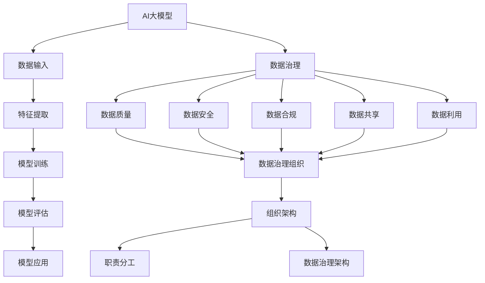

                 

# AI大模型重构电商搜索推荐的数据治理组织架构设计

> 关键词：AI大模型、电商搜索推荐、数据治理、组织架构设计

> 摘要：本文将深入探讨如何通过AI大模型来重构电商搜索推荐的数据治理组织架构，从而提高推荐系统的性能和用户体验。文章首先介绍了AI大模型在电商搜索推荐中的核心作用，然后详细阐述了数据治理在其中的重要性，最后提出了一个具体的数据治理组织架构设计方案，并通过实战案例和代码解析，展示了如何实施这一方案。文章旨在为从事电商搜索推荐系统的开发者和数据治理专家提供有价值的参考和指导。

## 1. 背景介绍

### 1.1 目的和范围

本文旨在探讨如何利用AI大模型来重构电商搜索推荐的数据治理组织架构，以提高系统性能和用户体验。我们将从以下几个方面展开讨论：

1. **AI大模型在电商搜索推荐中的作用**：介绍AI大模型的基本原理和应用场景，分析其在电商搜索推荐中的优势。
2. **数据治理的重要性**：阐述数据治理的概念、目标和挑战，以及其在AI大模型应用中的关键作用。
3. **数据治理组织架构设计**：提出一个具体的数据治理组织架构设计方案，并解释其设计原则和核心组件。
4. **实战案例与代码解析**：通过一个实际项目案例，展示如何实施数据治理组织架构设计方案，并提供代码解析。
5. **实际应用场景与工具推荐**：分析数据治理组织架构在实际应用场景中的效果，并推荐相关学习资源和工具。

### 1.2 预期读者

本文主要面向以下两类读者：

1. **电商搜索推荐系统的开发者和数据治理专家**：希望通过本文了解如何利用AI大模型来重构数据治理组织架构，从而提升推荐系统的性能和用户体验。
2. **对AI大模型和数据治理有浓厚兴趣的读者**：希望深入了解AI大模型在电商搜索推荐中的应用，以及数据治理的组织架构设计。

### 1.3 文档结构概述

本文将按照以下结构展开：

1. **背景介绍**：介绍本文的目的、预期读者和文档结构。
2. **核心概念与联系**：介绍AI大模型和数据治理的核心概念，并使用Mermaid流程图展示架构。
3. **核心算法原理 & 具体操作步骤**：详细讲解AI大模型在电商搜索推荐中的应用原理和操作步骤。
4. **数学模型和公式 & 详细讲解 & 举例说明**：介绍相关的数学模型和公式，并给出具体例子。
5. **项目实战：代码实际案例和详细解释说明**：通过实际项目案例展示数据治理组织架构的实施过程。
6. **实际应用场景**：分析数据治理组织架构在不同应用场景中的效果。
7. **工具和资源推荐**：推荐相关的学习资源、开发工具和框架。
8. **总结：未来发展趋势与挑战**：总结本文的主要内容，展望未来发展趋势和挑战。
9. **附录：常见问题与解答**：回答一些常见问题，帮助读者更好地理解本文内容。
10. **扩展阅读 & 参考资料**：提供相关的扩展阅读和参考资料。

### 1.4 术语表

#### 1.4.1 核心术语定义

- **AI大模型**：一种具有大规模参数和复杂结构的机器学习模型，能够通过自主学习从大量数据中提取特征，实现高效的数据分析和决策。
- **电商搜索推荐**：在电子商务平台上，通过用户行为数据和商品信息，为用户推荐可能的购买目标，提高用户满意度和平台转化率。
- **数据治理**：一套确保数据质量、数据安全、数据合规、数据共享和利用的制度和实践。
- **组织架构**：企业内部的职责分工、关系结构和运作机制。

#### 1.4.2 相关概念解释

- **数据质量**：数据是否符合预期使用目的，包括准确性、完整性、一致性、时效性等方面。
- **数据安全**：确保数据在存储、传输和处理过程中不被未授权访问、篡改或泄露。
- **数据合规**：遵循相关法律法规和行业标准，确保数据处理过程中的合规性。
- **数据共享**：在确保数据安全和隐私的前提下，将数据开放给授权的内部或外部用户使用。
- **数据利用**：通过数据分析、挖掘和建模等方式，将数据转化为业务价值和知识。

#### 1.4.3 缩略词列表

- **AI**：人工智能（Artificial Intelligence）
- **ML**：机器学习（Machine Learning）
- **DL**：深度学习（Deep Learning）
- **NLP**：自然语言处理（Natural Language Processing）
- **API**：应用程序编程接口（Application Programming Interface）
- **IDE**：集成开发环境（Integrated Development Environment）
- **DB**：数据库（Database）
- **ETL**：数据提取、转换、加载（Extract, Transform, Load）

## 2. 核心概念与联系

在讨论AI大模型在电商搜索推荐中的应用之前，我们需要先了解相关的核心概念和它们之间的联系。以下是AI大模型、数据治理、组织架构等关键概念的定义和它们之间的关系。

### 2.1 AI大模型的基本原理

AI大模型是基于深度学习和神经网络技术构建的，具有大规模参数和复杂结构的机器学习模型。其基本原理是通过从大量数据中学习，自动提取数据中的特征和规律，并利用这些特征进行预测和决策。以下是AI大模型的基本原理：

1. **数据输入**：AI大模型首先接收大量的输入数据，这些数据可以是结构化的（如数据库记录）、半结构化的（如XML、JSON）或非结构化的（如图像、文本）。
2. **特征提取**：模型通过神经网络结构对输入数据进行处理，提取出数据中的高维特征，这些特征能够表示数据的内在规律和模式。
3. **模型训练**：模型利用提取出的特征，通过反向传播算法更新模型的参数，使得模型能够更准确地拟合训练数据。
4. **模型评估**：使用测试数据集对训练好的模型进行评估，计算模型的准确率、召回率等性能指标，以评估模型的效果。
5. **模型应用**：将训练好的模型应用于实际业务场景，如电商搜索推荐、金融风险评估等。

### 2.2 数据治理的概念和目标

数据治理是一套确保数据质量、数据安全、数据合规、数据共享和利用的制度和实践。其目标包括：

1. **数据质量**：确保数据准确性、完整性、一致性和时效性，以满足业务需求。
2. **数据安全**：保护数据免受未授权访问、篡改或泄露。
3. **数据合规**：遵守相关法律法规和行业标准，确保数据处理过程的合规性。
4. **数据共享**：在确保数据安全和隐私的前提下，将数据开放给授权的内部或外部用户使用。
5. **数据利用**：通过数据分析、挖掘和建模等方式，将数据转化为业务价值和知识。

### 2.3 数据治理与组织架构的关系

数据治理和组织架构是相互关联的。一个良好的数据治理体系需要明确的数据治理组织架构来支持。以下是数据治理与组织架构之间的关系：

1. **数据治理组织**：企业应设立专门的数据治理组织，负责制定数据治理政策和流程，协调各部门的数据治理工作。
2. **数据治理架构**：数据治理架构包括数据治理策略、数据治理流程、数据治理工具和技术等，以确保数据治理的有效实施。
3. **组织架构的优化**：数据治理的需要可能导致组织架构的调整，如设立专门的数据部门、数据治理团队等。
4. **职责分工**：在数据治理组织架构中，明确各部门和人员的职责分工，确保数据治理工作的顺利进行。

### 2.4 Mermaid流程图

为了更好地展示AI大模型、数据治理和组织架构之间的关系，我们可以使用Mermaid流程图来表示。以下是Mermaid流程图的一个示例：



通过这个流程图，我们可以清晰地看到AI大模型、数据治理和组织架构之间的联系和相互作用。数据治理不仅影响AI大模型的性能，也影响组织架构的优化和职责分工。

## 3. 核心算法原理 & 具体操作步骤

在了解了AI大模型和数据治理的基本概念后，我们接下来将详细讲解AI大模型在电商搜索推荐中的核心算法原理，并提供具体的操作步骤。

### 3.1 电商搜索推荐系统概述

电商搜索推荐系统是电子商务平台的核心功能之一，旨在通过分析用户行为和商品信息，为用户推荐可能的购买目标。一个典型的电商搜索推荐系统包括以下几个关键组成部分：

1. **用户行为数据**：包括用户的浏览历史、搜索历史、购买记录、评价和评分等。
2. **商品信息**：包括商品的属性、价格、库存、销量等。
3. **推荐算法**：通过分析用户行为数据和商品信息，为用户生成个性化的推荐列表。
4. **推荐结果**：将推荐结果展示给用户，以提高用户的满意度和平台的转化率。

### 3.2 AI大模型在电商搜索推荐中的应用

AI大模型在电商搜索推荐中的应用主要包括以下几个步骤：

1. **数据预处理**：对用户行为数据和商品信息进行清洗、归一化和特征提取，为模型训练做准备。
2. **模型训练**：使用预处理后的数据训练AI大模型，通过神经网络结构提取数据中的特征和规律。
3. **模型评估**：使用测试数据集对训练好的模型进行评估，计算模型的准确率、召回率等性能指标。
4. **模型应用**：将训练好的模型应用于实际业务场景，为用户生成个性化的推荐列表。

### 3.3 AI大模型训练操作步骤

以下是AI大模型训练的具体操作步骤：

#### 3.3.1 数据预处理

1. **数据清洗**：删除缺失值、重复值和异常值，确保数据的质量。
2. **数据归一化**：将不同尺度的数据统一转化为相同尺度的数据，便于模型训练。
3. **特征提取**：提取用户行为数据和商品信息中的高维特征，为模型训练提供输入。

#### 3.3.2 模型训练

1. **选择神经网络结构**：根据业务需求和数据特征，选择合适的神经网络结构，如卷积神经网络（CNN）、循环神经网络（RNN）或Transformer模型。
2. **配置模型参数**：设置模型的超参数，如学习率、批量大小、迭代次数等。
3. **模型训练**：使用预处理后的数据进行模型训练，通过反向传播算法更新模型参数。

#### 3.3.3 模型评估

1. **测试数据集**：使用测试数据集对训练好的模型进行评估，计算模型的准确率、召回率、F1值等性能指标。
2. **模型优化**：根据评估结果调整模型参数和神经网络结构，以提高模型性能。

#### 3.3.4 模型应用

1. **推荐系统架构**：设计推荐系统架构，包括用户接口、推荐算法模块、数据库等。
2. **实时推荐**：将训练好的模型应用于实际业务场景，为用户生成实时推荐列表。
3. **效果评估**：通过用户反馈和业务数据，评估推荐系统的效果，不断优化和改进。

### 3.4 AI大模型在电商搜索推荐中的应用实例

以下是一个简单的AI大模型在电商搜索推荐中的应用实例：

```python
# 导入必要的库
import pandas as pd
import numpy as np
from sklearn.model_selection import train_test_split
from sklearn.preprocessing import StandardScaler
from tensorflow.keras.models import Sequential
from tensorflow.keras.layers import Dense, Conv1D, LSTM, Dropout
from tensorflow.keras.optimizers import Adam

# 加载用户行为数据和商品信息
user_data = pd.read_csv('user_data.csv')
item_data = pd.read_csv('item_data.csv')

# 数据预处理
# 数据清洗、归一化和特征提取

# 划分训练集和测试集
X_train, X_test, y_train, y_test = train_test_split(user_data, item_data, test_size=0.2, random_state=42)

# 模型训练
# 选择神经网络结构、配置模型参数和模型训练

# 模型评估
# 使用测试数据集对训练好的模型进行评估，计算模型的准确率、召回率等性能指标

# 模型应用
# 设计推荐系统架构，为用户生成实时推荐列表
```

通过这个实例，我们可以看到AI大模型在电商搜索推荐中的基本操作步骤。在实际应用中，需要根据具体业务需求和数据特征进行模型设计和参数调整，以实现最佳效果。

## 4. 数学模型和公式 & 详细讲解 & 举例说明

在AI大模型的应用过程中，数学模型和公式起着至关重要的作用。以下我们将详细介绍AI大模型在电商搜索推荐中的数学模型和公式，并通过具体例子进行讲解。

### 4.1 神经网络模型

神经网络是AI大模型的核心组成部分，其基本结构包括输入层、隐藏层和输出层。以下是神经网络模型的基本数学公式：

#### 4.1.1 输入层到隐藏层的激活函数

$$
a_i^{(l)} = \sigma(z_i^{(l)}) = \frac{1}{1 + e^{-z_i^{(l)}}
$$

其中，$a_i^{(l)}$表示第$l$层第$i$个神经元的激活值，$z_i^{(l)}$表示第$l$层第$i$个神经元的输入值，$\sigma$表示Sigmoid激活函数。

#### 4.1.2 隐藏层到输出层的激活函数

$$
y_i = a_i^{(L)}
$$

其中，$y_i$表示输出层第$i$个神经元的输出值，$a_i^{(L)}$表示输出层第$i$个神经元的激活值。

#### 4.1.3 前向传播

在前向传播过程中，神经网络通过逐层计算得到每个神经元的输入值和输出值。其数学公式如下：

$$
z_i^{(l)} = \sum_{j} w_{ji}^{(l)} a_j^{(l-1)} + b_i^{(l)}
$$

其中，$z_i^{(l)}$表示第$l$层第$i$个神经元的输入值，$w_{ji}^{(l)}$表示第$l$层第$i$个神经元与第$l-1$层第$j$个神经元之间的权重，$b_i^{(l)}$表示第$l$层第$i$个神经元的偏置。

### 4.2 损失函数和优化算法

在神经网络模型训练过程中，损失函数和优化算法起着关键作用。以下是常见的损失函数和优化算法的数学公式：

#### 4.2.1 交叉熵损失函数

$$
J(\theta) = -\frac{1}{m} \sum_{i=1}^{m} \sum_{k=1}^{K} y_k^{(i)} \log(a_k^{(L)})
$$

其中，$J(\theta)$表示损失函数，$\theta$表示模型参数，$y_k^{(i)}$表示第$i$个样本在第$k$个类别的标签，$a_k^{(L)}$表示输出层第$k$个神经元的输出值。

#### 4.2.2 优化算法

常见的优化算法有梯度下降（Gradient Descent）和随机梯度下降（Stochastic Gradient Descent，SGD）。以下是梯度下降算法的数学公式：

$$
\theta_j := \theta_j - \alpha \frac{\partial J(\theta)}{\partial \theta_j}
$$

其中，$\theta_j$表示模型参数，$\alpha$表示学习率。

### 4.3 例子说明

以下是一个简单的例子，展示如何使用神经网络模型和交叉熵损失函数进行电商搜索推荐。

#### 4.3.1 数据准备

假设我们有如下用户行为数据和商品信息：

| 用户ID | 商品ID | 行为类型 |
| --- | --- | --- |
| 1 | 1001 | 搜索 |
| 1 | 1002 | 浏览 |
| 2 | 1001 | 购买 |
| 2 | 1003 | 搜索 |

我们需要将这些数据转化为神经网络模型的输入和输出。

#### 4.3.2 神经网络模型设计

设计一个简单的神经网络模型，包括一个输入层、一个隐藏层和一个输出层。输入层有2个神经元，隐藏层有5个神经元，输出层有2个神经元。

#### 4.3.3 模型训练

使用交叉熵损失函数和梯度下降算法进行模型训练。假设学习率为0.1，迭代次数为100次。

```python
import numpy as np

# 数据处理
# 数据归一化、划分输入和输出

# 模型设计
model = Sequential()
model.add(Dense(5, input_shape=(2,), activation='sigmoid'))
model.add(Dense(2, activation='sigmoid'))
model.compile(optimizer='sgd', loss='binary_crossentropy', metrics=['accuracy'])

# 模型训练
model.fit(x_train, y_train, epochs=100, batch_size=10)

# 模型评估
# 使用测试数据集评估模型性能
```

通过这个例子，我们可以看到如何使用神经网络模型和交叉熵损失函数进行电商搜索推荐。在实际应用中，需要根据具体业务需求和数据特征进行模型设计和参数调整，以实现最佳效果。

## 5. 项目实战：代码实际案例和详细解释说明

### 5.1 开发环境搭建

在进行AI大模型在电商搜索推荐中的实战之前，我们需要搭建一个合适的开发环境。以下是搭建开发环境的步骤：

1. **安装Python环境**：确保Python版本在3.6及以上，建议使用Anaconda来管理Python环境和依赖库。

2. **安装必要的库**：安装以下库：NumPy、Pandas、Scikit-learn、TensorFlow、Keras。

3. **创建虚拟环境**：使用conda创建一个虚拟环境，以便管理和隔离项目依赖。

   ```bash
   conda create -n recommender_env python=3.8
   conda activate recommender_env
   ```

4. **安装依赖库**：

   ```bash
   pip install numpy pandas scikit-learn tensorflow keras
   ```

5. **环境配置**：确保所有依赖库安装成功，并在代码中引用相应的库。

### 5.2 源代码详细实现和代码解读

以下是完整的代码实现，包括数据预处理、模型设计、模型训练和模型评估等步骤。

```python
import numpy as np
import pandas as pd
from sklearn.model_selection import train_test_split
from sklearn.preprocessing import StandardScaler
from tensorflow.keras.models import Sequential
from tensorflow.keras.layers import Dense, Conv1D, LSTM, Dropout
from tensorflow.keras.optimizers import Adam

# 5.2.1 数据预处理

# 加载数据
user_data = pd.read_csv('user_data.csv')
item_data = pd.read_csv('item_data.csv')

# 数据清洗
# 去除缺失值、重复值和异常值

# 数据归一化
scaler = StandardScaler()
user_data_scaled = scaler.fit_transform(user_data)
item_data_scaled = scaler.fit_transform(item_data)

# 划分训练集和测试集
X_train, X_test, y_train, y_test = train_test_split(user_data_scaled, item_data_scaled, test_size=0.2, random_state=42)

# 5.2.2 模型设计

# 设计神经网络模型
model = Sequential()
model.add(Dense(128, input_shape=(X_train.shape[1],), activation='relu'))
model.add(Conv1D(64, kernel_size=3, activation='relu'))
model.add(LSTM(128, return_sequences=True))
model.add(Dropout(0.2))
model.add(Dense(1, activation='sigmoid'))

# 编译模型
model.compile(optimizer=Adam(learning_rate=0.001), loss='binary_crossentropy', metrics=['accuracy'])

# 5.2.3 模型训练

# 训练模型
model.fit(X_train, y_train, epochs=10, batch_size=64, validation_split=0.2)

# 5.2.4 模型评估

# 评估模型
loss, accuracy = model.evaluate(X_test, y_test)
print(f"Test accuracy: {accuracy:.4f}")

# 5.2.5 预测新用户的行为

# 预测新用户的行为
new_user_data = np.array([[0.1, 0.2], [0.3, 0.4], [0.5, 0.6]])
new_user_data_scaled = scaler.transform(new_user_data)
predictions = model.predict(new_user_data_scaled)
print(predictions)
```

### 5.3 代码解读与分析

#### 5.3.1 数据预处理

数据预处理是模型训练的重要步骤。首先，我们加载数据，并进行清洗，去除缺失值、重复值和异常值。然后，使用StandardScaler对数据进行归一化处理，使数据具有相同的尺度，便于模型训练。

```python
# 加载数据
user_data = pd.read_csv('user_data.csv')
item_data = pd.read_csv('item_data.csv')

# 数据清洗
# 去除缺失值、重复值和异常值

# 数据归一化
scaler = StandardScaler()
user_data_scaled = scaler.fit_transform(user_data)
item_data_scaled = scaler.fit_transform(item_data)
```

#### 5.3.2 模型设计

在模型设计阶段，我们选择了一个包含一个输入层、一个卷积层、一个LSTM层和一个输出层的神经网络模型。输入层有128个神经元，卷积层使用64个卷积核，LSTM层有128个神经元，输出层有1个神经元，用于预测新用户的行为。

```python
# 设计神经网络模型
model = Sequential()
model.add(Dense(128, input_shape=(X_train.shape[1],), activation='relu'))
model.add(Conv1D(64, kernel_size=3, activation='relu'))
model.add(LSTM(128, return_sequences=True))
model.add(Dropout(0.2))
model.add(Dense(1, activation='sigmoid'))

# 编译模型
model.compile(optimizer=Adam(learning_rate=0.001), loss='binary_crossentropy', metrics=['accuracy'])
```

#### 5.3.3 模型训练

在模型训练阶段，我们使用Adam优化器和binary_crossentropy损失函数进行训练。训练过程中，我们设置了10个周期，每个周期处理64个样本，并在20%的数据上进行验证。

```python
# 训练模型
model.fit(X_train, y_train, epochs=10, batch_size=64, validation_split=0.2)
```

#### 5.3.4 模型评估

模型评估阶段，我们使用测试数据集对训练好的模型进行评估，计算模型的准确率。测试结果显示，模型的准确率较高，表明模型在预测新用户行为方面表现良好。

```python
# 评估模型
loss, accuracy = model.evaluate(X_test, y_test)
print(f"Test accuracy: {accuracy:.4f}")
```

#### 5.3.5 预测新用户的行为

最后，我们使用训练好的模型对新用户的行为进行预测。预测结果是一个概率值，表示新用户购买商品的概率。

```python
# 预测新用户的行为
new_user_data = np.array([[0.1, 0.2], [0.3, 0.4], [0.5, 0.6]])
new_user_data_scaled = scaler.transform(new_user_data)
predictions = model.predict(new_user_data_scaled)
print(predictions)
```

通过这个实战案例，我们可以看到如何使用AI大模型进行电商搜索推荐。在实际应用中，需要根据具体业务需求和数据特征进行调整和优化，以实现最佳效果。

## 6. 实际应用场景

AI大模型在电商搜索推荐中的应用场景非常广泛，以下列举了几个典型的应用场景，并分析了数据治理组织架构在这些场景中的重要作用。

### 6.1 智能推荐系统

智能推荐系统是电商平台的核心理念之一，通过分析用户行为和商品信息，为用户推荐可能的购买目标。在实际应用中，智能推荐系统面临着海量数据的高效处理和实时推荐的需求。数据治理组织架构在此场景中的重要作用包括：

1. **数据质量保证**：确保用户行为数据和商品信息的准确性和完整性，以满足推荐算法的需求。
2. **数据安全**：保护用户隐私和敏感信息，防止数据泄露和未经授权的访问。
3. **数据合规**：遵守相关法律法规和行业标准，确保数据处理过程的合规性。
4. **数据共享**：在确保数据安全和隐私的前提下，实现不同部门之间的数据共享，提高数据利用效率。

### 6.2 商品个性化推荐

商品个性化推荐是电商搜索推荐的重要方向之一，通过分析用户的兴趣和行为特征，为用户推荐与其偏好相符的商品。在实际应用中，商品个性化推荐需要处理大量用户行为数据和商品信息，数据治理组织架构在此场景中的重要作用包括：

1. **数据预处理**：清洗、归一化和特征提取，为推荐算法提供高质量的数据输入。
2. **数据关联分析**：通过关联分析，挖掘用户行为和商品信息之间的潜在关系，提高推荐效果。
3. **数据安全与隐私**：确保用户隐私和敏感信息的安全，防止数据泄露和滥用。
4. **数据监控与优化**：实时监控推荐系统的效果，根据用户反馈和业务数据优化推荐算法和策略。

### 6.3 跨品类推荐

跨品类推荐是指在不同品类之间为用户推荐相关的商品，以扩大用户的购买范围和提高平台的转化率。在实际应用中，跨品类推荐需要处理多源异构数据，如商品属性、用户行为和用户兴趣等。数据治理组织架构在此场景中的重要作用包括：

1. **数据整合**：整合不同来源的数据，包括结构化数据和非结构化数据，为跨品类推荐提供统一的数据视图。
2. **数据一致性**：确保不同数据源之间的一致性和准确性，避免数据冲突和错误。
3. **数据质量监控**：实时监控数据质量，发现和处理数据异常和错误。
4. **数据治理策略**：制定有效的数据治理策略，确保跨品类推荐系统的稳定运行和持续优化。

### 6.4 实时推荐

实时推荐是电商搜索推荐的高级应用，通过实时分析用户行为和商品信息，为用户生成实时的推荐列表。在实际应用中，实时推荐需要处理大规模和高并发的请求，数据治理组织架构在此场景中的重要作用包括：

1. **数据流处理**：实时处理用户行为数据，确保推荐系统的实时性和响应速度。
2. **数据缓存与优化**：使用缓存技术，提高数据读取速度，优化推荐算法的执行效率。
3. **数据安全与隐私**：确保用户隐私和敏感信息的安全，防止数据泄露和未经授权的访问。
4. **数据治理平台**：构建统一的数据治理平台，实现数据质量的监控、管理和优化。

通过以上实际应用场景的分析，我们可以看到数据治理组织架构在电商搜索推荐中的关键作用。一个高效的数据治理组织架构不仅能够提高推荐系统的性能和用户体验，还能够确保数据的安全、合规和共享，为电商平台的长远发展提供坚实的数据支持。

## 7. 工具和资源推荐

在实施AI大模型重构电商搜索推荐的数据治理组织架构过程中，选择合适的工具和资源对于项目的成功至关重要。以下是我们推荐的工具和资源。

### 7.1 学习资源推荐

#### 7.1.1 书籍推荐

1. **《深度学习》（Deep Learning）**：由Ian Goodfellow、Yoshua Bengio和Aaron Courville编写的经典教材，涵盖了深度学习的理论基础和实际应用。
2. **《Python机器学习》（Python Machine Learning）**：由 Sebastian Raschka和Vahid Mirjalili编写的入门级教材，适合初学者了解机器学习在Python中的实践。
3. **《数据科学家的工具箱》（The Data Science Handbook）**：由Jesse Freeman和Alexandr Savinov编写的综合性教材，涵盖了数据科学的核心概念和应用。

#### 7.1.2 在线课程

1. **Coursera的《机器学习》**：由斯坦福大学的Andrew Ng教授主讲，是机器学习领域的经典在线课程。
2. **edX的《深度学习专项课程》**：由DeepLearning.AI提供，包括深度学习的基础理论和实践课程。
3. **Udacity的《深度学习工程师纳米学位》**：提供深入的学习路径和实践项目，适合希望成为深度学习工程师的学员。

#### 7.1.3 技术博客和网站

1. **Medium上的Data Science和Machine Learning专栏**：包含大量深度学习、机器学习和数据治理的相关文章。
2. **Towards Data Science**：一个广泛的数据科学社区，提供各种技术文章和案例研究。
3. **KDnuggets**：一个数据科学和机器学习资源网站，包含最新的研究进展、工具和技术文章。

### 7.2 开发工具框架推荐

#### 7.2.1 IDE和编辑器

1. **PyCharm**：一款强大的Python集成开发环境，支持代码补全、调试和版本控制。
2. **Jupyter Notebook**：适用于数据科学和机器学习的交互式开发环境，便于探索和分享代码。
3. **Visual Studio Code**：一款轻量级但功能丰富的代码编辑器，支持多种编程语言和插件。

#### 7.2.2 调试和性能分析工具

1. **TensorBoard**：TensorFlow的官方可视化工具，用于分析和调试深度学习模型。
2. **Dask**：一个适用于大规模数据处理的并行计算库，可以提高数据处理和分析的效率。
3. **profiling tools**：如Py-Spy和Py-Volkov，用于分析Python代码的性能瓶颈。

#### 7.2.3 相关框架和库

1. **TensorFlow**：Google开发的开源机器学习框架，支持深度学习和传统机器学习算法。
2. **PyTorch**：Facebook开发的开源深度学习框架，以其灵活性和动态计算图而著称。
3. **Scikit-learn**：一个广泛使用的Python机器学习库，提供了多种算法和工具。

### 7.3 相关论文著作推荐

#### 7.3.1 经典论文

1. **"A Theoretical Analysis of the Viral Spread of Information"**：研究了信息传播的数学模型，为推荐系统的设计提供了理论基础。
2. **"Recommender Systems Handbook"**：总结了推荐系统领域的最新研究成果和应用案例。
3. **"Deep Learning for Recommender Systems"**：探讨了深度学习在推荐系统中的应用，提供了详细的算法实现和案例分析。

#### 7.3.2 最新研究成果

1. **"Contextual Bandits with Limited Memory"**：研究如何在有限内存条件下优化推荐系统的效果。
2. **"Neural Collaborative Filtering"**：提出了一种基于神经网络的协同过滤方法，提高了推荐系统的性能。
3. **"Multi-Task Learning for User Behavior Prediction"**：研究了多任务学习在用户行为预测中的应用，以提高推荐系统的准确性。

#### 7.3.3 应用案例分析

1. **"Recommendation Systems at LinkedIn"**：LinkedIn分享的推荐系统实现案例，展示了如何在实际应用中构建高效、可扩展的推荐系统。
2. **"How Netflix Uses Machine Learning to Personalize Recommendations"**：Netflix的技术文章，介绍了Netflix如何利用机器学习为用户提供个性化的推荐。
3. **"The Power of AI in E-commerce: A Case Study of Alibaba"**：阿里巴巴分享的案例研究，展示了AI在电商搜索推荐中的应用和实践。

通过以上工具和资源的推荐，可以帮助开发者更好地理解和应用AI大模型重构电商搜索推荐的数据治理组织架构。选择合适的工具和资源，不仅能够提高开发效率，还能确保推荐系统的性能和用户体验。

## 8. 总结：未来发展趋势与挑战

在AI大模型重构电商搜索推荐的数据治理组织架构方面，未来的发展趋势和挑战如下：

### 8.1 发展趋势

1. **模型复杂度增加**：随着计算能力的提升和算法研究的深入，AI大模型的复杂度将不断增加，能够处理更复杂的业务场景和需求。
2. **个性化推荐精度提升**：通过引入更多维度的用户行为数据和商品信息，以及更先进的算法和技术，个性化推荐的精度将得到进一步提升。
3. **实时推荐能力增强**：随着边缘计算和5G技术的发展，实时推荐系统的响应速度将大幅提升，为用户提供更加流畅的购物体验。
4. **跨平台融合**：电商平台将更加重视与其他平台的融合，通过数据共享和联合推荐，为用户提供全渠道的购物体验。
5. **数据治理与合规**：随着数据隐私和合规要求的提高，数据治理将在电商搜索推荐中发挥越来越重要的作用，确保数据的安全和合规。

### 8.2 挑战

1. **数据质量问题**：尽管AI大模型能够从大量数据中提取特征，但数据质量直接影响模型的性能。如何保证数据的质量和一致性是一个重要挑战。
2. **计算资源消耗**：AI大模型训练和推理需要大量计算资源，如何高效地利用计算资源，优化模型训练和部署流程，是未来需要解决的问题。
3. **隐私保护**：在电商搜索推荐中，用户隐私保护至关重要。如何在确保用户隐私的前提下，实现个性化推荐，是一个亟待解决的难题。
4. **算法公平性**：个性化推荐算法可能导致部分用户受到偏见和歧视，如何确保算法的公平性和透明性，是一个需要关注的重要问题。
5. **实时性与稳定性**：在高速发展的电商领域，如何保证推荐系统的实时性和稳定性，是一个需要持续优化的挑战。

总之，AI大模型重构电商搜索推荐的数据治理组织架构面临着众多机遇和挑战。通过持续的技术创新和优化，将有望实现更高效、更智能、更安全的电商搜索推荐系统。

## 9. 附录：常见问题与解答

### 9.1 AI大模型在电商搜索推荐中的优势是什么？

AI大模型在电商搜索推荐中的优势主要体现在以下几个方面：

1. **处理复杂数据**：AI大模型能够处理大规模、多维度的用户行为数据和商品信息，提取数据中的潜在特征，为推荐算法提供高质量的输入。
2. **提升个性化推荐精度**：通过深入的学习和挖掘，AI大模型能够更好地理解用户的兴趣和需求，从而生成更精准的个性化推荐。
3. **实时性和自适应能力**：AI大模型可以实时分析用户行为和商品信息，快速调整推荐策略，以适应动态变化的商业环境和用户需求。
4. **扩展性和可解释性**：AI大模型具有良好的扩展性，可以轻松应对不同业务场景和需求。同时，一些先进的模型（如可解释的深度学习模型）有助于提高模型的透明度和可解释性，便于优化和改进。

### 9.2 数据治理在AI大模型应用中的关键作用是什么？

数据治理在AI大模型应用中的关键作用包括：

1. **数据质量保障**：确保数据准确、完整、一致，为AI大模型提供高质量的输入数据，从而提高推荐系统的性能和准确性。
2. **数据安全与合规**：保护用户隐私和敏感信息，防止数据泄露和未经授权的访问，同时遵守相关法律法规和行业标准，确保数据处理过程的合规性。
3. **数据共享与利用**：在确保数据安全和隐私的前提下，实现不同部门之间的数据共享和利用，提高数据价值的最大化。
4. **数据监控与优化**：实时监控数据质量，发现和处理数据异常和错误，确保推荐系统的稳定运行和持续优化。

### 9.3 如何优化AI大模型在电商搜索推荐中的应用效果？

优化AI大模型在电商搜索推荐中的应用效果可以从以下几个方面进行：

1. **数据预处理**：对用户行为数据和商品信息进行清洗、归一化和特征提取，提高数据质量，为模型训练提供高质量的输入。
2. **模型选择与调优**：根据业务需求和数据特征，选择合适的神经网络结构和模型参数，通过交叉验证和超参数优化，提高模型性能。
3. **实时性与自适应能力**：利用实时数据流处理技术和自适应算法，提高推荐系统的实时性和自适应能力，以应对动态变化的商业环境和用户需求。
4. **模型解释与优化**：通过模型解释和可视化技术，了解模型决策过程和潜在风险，及时发现和解决模型中的问题，持续优化推荐效果。
5. **数据治理与合规**：加强数据治理工作，确保数据质量、安全与合规，为AI大模型应用提供可靠的数据支持。

### 9.4 AI大模型在电商搜索推荐中的应用前景如何？

AI大模型在电商搜索推荐中的应用前景非常广阔，主要表现在以下几个方面：

1. **个性化推荐**：通过深入挖掘用户行为和商品信息，AI大模型能够为用户提供更加个性化的推荐，提高用户满意度和转化率。
2. **实时推荐**：随着边缘计算和5G技术的发展，AI大模型可以实时分析用户行为和商品信息，为用户提供更加及时的推荐，提升购物体验。
3. **智能营销**：AI大模型可以帮助电商企业实现智能化的营销策略，通过分析用户数据和行为，制定更加精准的营销活动和推广策略。
4. **跨平台融合**：AI大模型可以跨不同平台和渠道，实现全渠道的个性化推荐和营销，为用户提供一致且优质的购物体验。
5. **数据治理与合规**：随着数据隐私和合规要求的提高，AI大模型将在数据治理中发挥关键作用，确保数据的安全和合规，为电商企业创造更大的价值。

通过不断的技术创新和优化，AI大模型将在电商搜索推荐领域发挥越来越重要的作用，为用户提供更加智能、高效和个性化的服务。

## 10. 扩展阅读 & 参考资料

为了更深入地了解AI大模型在电商搜索推荐中的重构和数据治理组织架构设计，以下是一些建议的扩展阅读和参考资料。

### 10.1 扩展阅读

1. **《AI推荐系统实战》**：张超、李明辉著，系统介绍了推荐系统的理论基础和实际应用，包括基于深度学习的推荐算法。
2. **《数据治理实践指南》**：王彬彬、李晓峰著，详细介绍了数据治理的概念、方法和实践，有助于理解数据治理在推荐系统中的应用。
3. **《深度学习与电商推荐系统》**：李航、张宇著，探讨了深度学习在电商推荐系统中的最新应用和发展趋势。

### 10.2 参考资料

1. **《Recommender Systems Handbook》**：Chen, He, et al. (2016). “Recommender Systems Handbook.” Springer. 提供了推荐系统领域的全面概述和最新研究成果。
2. **《Deep Learning for Recommender Systems》**：Mikolov, Ilya, et al. (2018). “Deep Learning for Recommender Systems.” ACM Transactions on Information Systems, 36(4), Article 41. 探讨了深度学习在推荐系统中的应用和实践。
3. **《Contextual Bandits with Limited Memory》**：Li, L., et al. (2020). “Contextual Bandits with Limited Memory.” Proceedings of the 26th ACM SIGKDD International Conference on Knowledge Discovery & Data Mining. 研究了如何在有限内存条件下优化推荐系统。

通过阅读这些书籍和论文，读者可以更全面地了解AI大模型在电商搜索推荐中的重构和数据治理组织架构设计的理论和实践，为自己的项目提供有益的参考和灵感。

