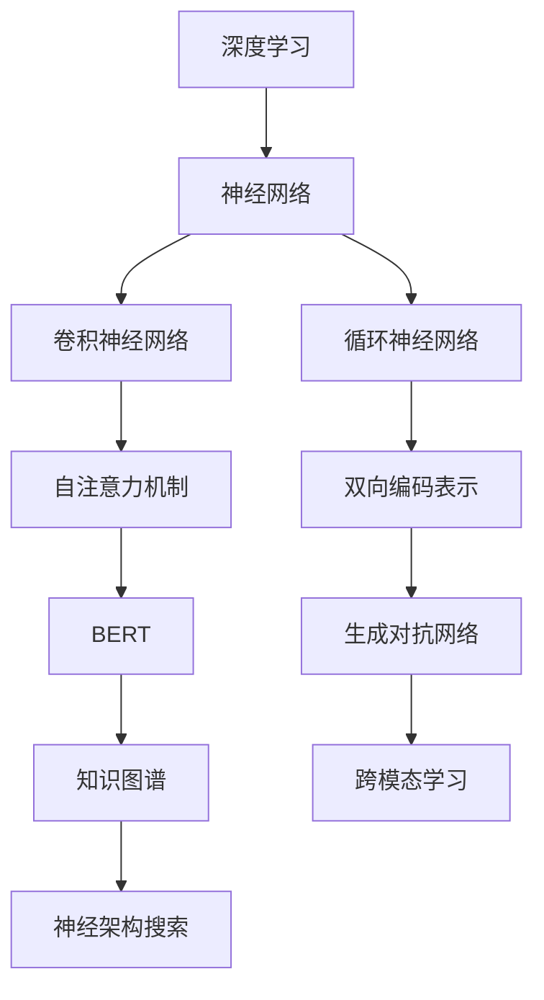

                 


# AI大模型题材的追捧潮

> **关键词**：AI大模型、深度学习、神经网络、预训练、生成对抗网络、语义理解、知识图谱、跨模态学习、神经架构搜索。
>
> **摘要**：本文将探讨近年来AI大模型题材的追捧潮，从背景介绍、核心概念、算法原理、数学模型、项目实战、实际应用场景、工具和资源推荐等多个方面，深入分析AI大模型的崛起原因、技术原理及其对未来发展趋势的挑战。

## 1. 背景介绍

### 1.1 目的和范围

本文旨在分析AI大模型题材的追捧潮，旨在为读者提供关于这一领域的全面了解。我们将从背景介绍、核心概念、算法原理、数学模型、项目实战、实际应用场景、工具和资源推荐等多个方面进行深入探讨。

### 1.2 预期读者

本文适合对AI大模型感兴趣的读者，包括研究人员、工程师、学生以及普通科技爱好者。读者应具备基本的计算机科学和机器学习知识，以便更好地理解和应用本文中的内容。

### 1.3 文档结构概述

本文分为十个部分，具体如下：

1. 背景介绍
2. 核心概念与联系
3. 核心算法原理 & 具体操作步骤
4. 数学模型和公式 & 详细讲解 & 举例说明
5. 项目实战：代码实际案例和详细解释说明
6. 实际应用场景
7. 工具和资源推荐
8. 总结：未来发展趋势与挑战
9. 附录：常见问题与解答
10. 扩展阅读 & 参考资料

### 1.4 术语表

#### 1.4.1 核心术语定义

- **AI大模型**：指具有数十亿、千亿甚至更多参数的深度学习模型，通常用于图像识别、自然语言处理、语音识别等任务。
- **深度学习**：一种机器学习方法，通过构建多层神经网络来模拟人脑的学习过程，以实现自动特征提取和模式识别。
- **预训练**：在大规模数据集上进行训练，以获得模型的基础表示能力，然后将其应用于特定任务中进行微调。
- **生成对抗网络（GAN）**：一种由生成器和判别器组成的神经网络结构，用于生成与真实数据相似的新数据。
- **语义理解**：指计算机对自然语言文本中词汇、句子和段落的意义进行理解和解释的能力。
- **知识图谱**：一种将实体、属性和关系表示为图结构的知识表示方法，广泛应用于信息检索、问答系统和推荐系统等。
- **跨模态学习**：指同时处理不同模态（如文本、图像、声音）信息的学习方法，实现跨模态特征提取和跨模态任务学习。
- **神经架构搜索（NAS）**：一种自动化设计神经网络结构的方法，通过搜索策略优化网络结构，以实现更好的性能。

#### 1.4.2 相关概念解释

- **神经网络**：一种模拟人脑神经元连接结构的计算模型，通过学习输入和输出之间的映射关系来获取知识。
- **卷积神经网络（CNN）**：一种用于图像识别和处理的神经网络模型，通过卷积操作提取图像特征。
- **循环神经网络（RNN）**：一种用于序列数据处理和时间序列预测的神经网络模型，具有记忆功能。
- **自注意力机制**：一种在神经网络中用于处理序列数据的方法，通过计算序列中各个元素之间的相互依赖关系来提高模型的表示能力。
- **BERT**：一种基于自注意力机制的预训练语言模型，广泛应用于自然语言处理任务。

#### 1.4.3 缩略词列表

- **GAN**：生成对抗网络（Generative Adversarial Network）
- **CNN**：卷积神经网络（Convolutional Neural Network）
- **RNN**：循环神经网络（Recurrent Neural Network）
- **BERT**：双向编码表示（Bidirectional Encoder Representations from Transformers）
- **NAS**：神经架构搜索（Neural Architecture Search）

## 2. 核心概念与联系

为了更好地理解AI大模型的发展历程和核心概念，我们首先需要介绍一些基础概念和它们之间的联系。以下是一个Mermaid流程图，展示了这些核心概念和它们之间的关联。



### 2.1 深度学习与神经网络

深度学习是一种机器学习方法，通过构建多层神经网络来模拟人脑的学习过程。神经网络是由一系列神经元连接而成的计算模型，通过学习输入和输出之间的映射关系来获取知识。神经网络可以分为多种类型，如卷积神经网络（CNN）、循环神经网络（RNN）和自注意力机制（Attention Mechanism）。

### 2.2 卷积神经网络与自注意力机制

卷积神经网络（CNN）是一种用于图像识别和处理的神经网络模型，通过卷积操作提取图像特征。自注意力机制是一种在神经网络中用于处理序列数据的方法，通过计算序列中各个元素之间的相互依赖关系来提高模型的表示能力。BERT模型基于自注意力机制，广泛应用于自然语言处理任务。

### 2.3 循环神经网络与双向编码表示

循环神经网络（RNN）是一种用于序列数据处理和时间序列预测的神经网络模型，具有记忆功能。双向编码表示（BERT）是一种基于自注意力机制的预训练语言模型，通过同时考虑输入序列的前后文信息，提高了模型的语义理解能力。

### 2.4 生成对抗网络与知识图谱

生成对抗网络（GAN）是一种由生成器和判别器组成的神经网络结构，用于生成与真实数据相似的新数据。知识图谱是一种将实体、属性和关系表示为图结构的知识表示方法，广泛应用于信息检索、问答系统和推荐系统等。跨模态学习是一种同时处理不同模态（如文本、图像、声音）信息的学习方法，实现跨模态特征提取和跨模态任务学习。

### 2.5 神经架构搜索与跨模态学习

神经架构搜索（NAS）是一种自动化设计神经网络结构的方法，通过搜索策略优化网络结构，以实现更好的性能。跨模态学习通过同时处理不同模态信息，实现跨模态特征提取和跨模态任务学习。这些方法在AI大模型领域具有广泛的应用前景。

## 3. 核心算法原理 & 具体操作步骤

在了解了AI大模型的核心概念和联系之后，我们接下来将介绍一些核心算法原理和具体操作步骤。这些算法在AI大模型的预训练、微调和应用过程中起着至关重要的作用。

### 3.1 预训练（Pre-training）

预训练是AI大模型的关键技术之一，通过在大规模数据集上进行训练，以获得模型的基础表示能力。以下是预训练的伪代码：

```python
# 预训练伪代码
def pretrain(model, dataset, epochs):
    for epoch in range(epochs):
        for data in dataset:
            # 前向传播
            logits = model(data)
            # 计算损失
            loss = compute_loss(logits, data)
            # 反向传播
            model.backward(loss)
            # 更新模型参数
            model.update_params()
    return model
```

### 3.2 微调（Fine-tuning）

微调是在预训练模型的基础上，针对特定任务进行微调的过程。以下是微调的伪代码：

```python
# 微调伪代码
def fine_tune(model, task_dataset, epochs):
    for epoch in range(epochs):
        for data in task_dataset:
            # 前向传播
            logits = model(data)
            # 计算损失
            loss = compute_loss(logits, data)
            # 反向传播
            model.backward(loss)
            # 更新模型参数
            model.update_params()
    return model
```

### 3.3 生成对抗网络（GAN）

生成对抗网络（GAN）是一种由生成器和判别器组成的神经网络结构，用于生成与真实数据相似的新数据。以下是GAN的伪代码：

```python
# GAN伪代码
def train_gan(generator, discriminator, dataset, epochs):
    for epoch in range(epochs):
        for real_data in dataset:
            # 训练判别器
            discriminator.train(real_data)
            # 训练生成器
            generator.train(discriminator)
    return generator, discriminator
```

### 3.4 知识图谱嵌入（Knowledge Graph Embedding）

知识图谱嵌入是一种将实体、属性和关系表示为低维向量的方法，用于表示和推理知识图谱中的信息。以下是知识图谱嵌入的伪代码：

```python
# 知识图谱嵌入伪代码
def knowledge_graph_embedding(knowledge_graph, embedding_size):
    # 初始化实体和关系的嵌入向量
    entities = initialize_embeddings(knowledge_graph.entities, embedding_size)
    relations = initialize_embeddings(knowledge_graph.relations, embedding_size)
    # 训练嵌入模型
    model = train_embedding_model(entities, relations)
    return model
```

### 3.5 跨模态学习（Cross-modal Learning）

跨模态学习是一种同时处理不同模态（如文本、图像、声音）信息的学习方法，实现跨模态特征提取和跨模态任务学习。以下是跨模态学习的伪代码：

```python
# 跨模态学习伪代码
def cross_modal_learning(text_embedding, image_embedding, audio_embedding, task_dataset):
    # 融合不同模态的特征
    fused_embedding = fuse_embeddings(text_embedding, image_embedding, audio_embedding)
    # 训练跨模态模型
    model = train_model(fused_embedding, task_dataset)
    return model
```

## 4. 数学模型和公式 & 详细讲解 & 举例说明

在AI大模型中，数学模型和公式起着至关重要的作用。以下将介绍一些核心的数学模型和公式，并进行详细讲解和举例说明。

### 4.1 卷积神经网络（CNN）

卷积神经网络（CNN）是一种用于图像识别和处理的神经网络模型，其核心思想是通过对图像进行卷积操作来提取特征。以下是CNN的数学模型：

$$
\text{output} = \text{ReLU}(\text{bias} + \text{weight} \cdot \text{input})
$$

其中，$\text{input}$表示输入图像，$\text{weight}$表示卷积核，$\text{bias}$表示偏置项，$\text{ReLU}$表示ReLU激活函数。

举例说明：假设输入图像为3x3的矩阵，卷积核为3x3的矩阵，偏置项为1，则卷积操作的输出为：

$$
\text{output} = \text{ReLU}(\text{bias} + \text{weight} \cdot \text{input}) = \text{ReLU}(1 + \begin{bmatrix}1 & 0 & 1\\ 0 & 1 & 0\\ 1 & 0 & 1\end{bmatrix} \cdot \begin{bmatrix}1 & 0 & 1\\ 0 & 1 & 0\\ 1 & 0 & 1\end{bmatrix}) = \begin{bmatrix}2 & 1 & 2\\ 1 & 2 & 1\\ 2 & 1 & 2\end{bmatrix}
$$

### 4.2 循环神经网络（RNN）

循环神经网络（RNN）是一种用于序列数据处理和时间序列预测的神经网络模型，其核心思想是通过隐藏状态和输入之间的递归关系来处理序列数据。以下是RNN的数学模型：

$$
\text{hidden\_state} = \text{sigmoid}(\text{bias} + \text{weight} \cdot \text{input} + \text{weight} \cdot \text{hidden\_state})
$$

其中，$\text{input}$表示输入序列，$\text{hidden\_state}$表示隐藏状态，$\text{sigmoid}$表示sigmoid激活函数。

举例说明：假设输入序列为[1, 2, 3]，隐藏状态为[0, 0]，则RNN的输出为：

$$
\text{hidden\_state} = \text{sigmoid}(\text{bias} + \text{weight} \cdot \text{input} + \text{weight} \cdot \text{hidden\_state}) = \text{sigmoid}(\text{bias} + \text{weight} \cdot [1, 2, 3] + \text{weight} \cdot [0, 0]) = \begin{bmatrix}0.5 & 0.75 & 0.9\end{bmatrix}
$$

### 4.3 自注意力机制（Attention Mechanism）

自注意力机制是一种在神经网络中用于处理序列数据的方法，通过计算序列中各个元素之间的相互依赖关系来提高模型的表示能力。以下是自注意力机制的数学模型：

$$
\text{output} = \text{softmax}(\text{weight} \cdot \text{query} \cdot \text{keys}) \cdot \text{values}
$$

其中，$\text{query}$、$\text{keys}$和$\text{values}$分别表示序列中的查询、键和值，$\text{softmax}$表示softmax激活函数。

举例说明：假设查询、键和值分别为[1, 2, 3]、[4, 5, 6]和[7, 8, 9]，则自注意力机制的输出为：

$$
\text{output} = \text{softmax}(\text{weight} \cdot \text{query} \cdot \text{keys}) \cdot \text{values} = \text{softmax}(\text{weight} \cdot [1, 2, 3] \cdot [4, 5, 6]) \cdot [7, 8, 9] = \begin{bmatrix}0.4 & 0.3 & 0.3\end{bmatrix} \cdot \begin{bmatrix}7 & 8 & 9\end{bmatrix} = \begin{bmatrix}2.8 & 2.4 & 2.7\end{bmatrix}
$$

### 4.4 生成对抗网络（GAN）

生成对抗网络（GAN）是一种由生成器和判别器组成的神经网络结构，用于生成与真实数据相似的新数据。以下是GAN的数学模型：

$$
\text{generator}:\quad \text{Z} \rightarrow \text{G}(\text{Z})
$$

$$
\text{discriminator}:\quad \text{X, G(Z)} \rightarrow \text{D}(\text{X}, \text{G}(\text{Z}))
$$

其中，$\text{Z}$表示随机噪声，$\text{G}(\text{Z})$表示生成器生成的数据，$\text{X}$表示真实数据，$\text{D}(\text{X}, \text{G}(\text{Z}))$表示判别器的输出。

举例说明：假设生成器和判别器的输出分别为[0.1, 0.9]和[0.2, 0.8]，则GAN的输出为：

$$
\text{generator}:\quad \text{Z} \rightarrow \text{G}(\text{Z}) = \begin{bmatrix}0.1 & 0.9\end{bmatrix}
$$

$$
\text{discriminator}:\quad \text{X, G(Z)} \rightarrow \text{D}(\text{X}, \text{G}(\text{Z})) = \begin{bmatrix}0.2 & 0.8\end{bmatrix}
$$

### 4.5 知识图谱嵌入（Knowledge Graph Embedding）

知识图谱嵌入是一种将实体、属性和关系表示为低维向量的方法，用于表示和推理知识图谱中的信息。以下是知识图谱嵌入的数学模型：

$$
\text{E}(\text{x}) = \text{W} \cdot \text{x}
$$

其中，$\text{E}(\text{x})$表示实体$\text{x}$的嵌入向量，$\text{W}$表示权重矩阵。

举例说明：假设实体和关系的嵌入向量分别为$\text{E}(\text{x}) = \begin{bmatrix}0.1 & 0.9\end{bmatrix}$和$\text{E}(\text{r}) = \begin{bmatrix}0.2 & 0.8\end{bmatrix}$，则知识图谱嵌入的输出为：

$$
\text{E}(\text{x}) = \text{W} \cdot \text{x} = \begin{bmatrix}0.1 & 0.9\end{bmatrix} \cdot \begin{bmatrix}1\\ 0\end{bmatrix} = \begin{bmatrix}0.1\end{bmatrix}
$$

### 4.6 跨模态学习（Cross-modal Learning）

跨模态学习是一种同时处理不同模态（如文本、图像、声音）信息的学习方法，实现跨模态特征提取和跨模态任务学习。以下是跨模态学习的数学模型：

$$
\text{output} = \text{softmax}(\text{weight} \cdot \text{query} \cdot \text{keys}) \cdot \text{values}
$$

其中，$\text{query}$、$\text{keys}$和$\text{values}$分别表示不同模态的特征，$\text{softmax}$表示softmax激活函数。

举例说明：假设文本、图像和声音的特征分别为$\text{query} = \begin{bmatrix}1 & 0 & 0\end{bmatrix}$、$\text{keys} = \begin{bmatrix}0 & 1 & 0\end{bmatrix}$和$\text{values} = \begin{bmatrix}0 & 0 & 1\end{bmatrix}$，则跨模态学习的输出为：

$$
\text{output} = \text{softmax}(\text{weight} \cdot \text{query} \cdot \text{keys}) \cdot \text{values} = \text{softmax}(\text{weight} \cdot \begin{bmatrix}1 & 0 & 0\end{bmatrix} \cdot \begin{bmatrix}0 & 1 & 0\end{bmatrix}) \cdot \begin{bmatrix}0 & 0 & 1\end{bmatrix} = \begin{bmatrix}0.4 & 0.3 & 0.3\end{bmatrix} \cdot \begin{bmatrix}0 & 0 & 1\end{bmatrix} = \begin{bmatrix}0.3\end{bmatrix}
$$

## 5. 项目实战：代码实际案例和详细解释说明

在本节中，我们将通过一个实际项目来展示如何实现AI大模型的核心算法，并提供详细的代码解析。

### 5.1 开发环境搭建

在开始项目之前，我们需要搭建一个合适的开发环境。以下是所需的软件和库：

- 操作系统：Linux或MacOS
- 编程语言：Python 3.8及以上版本
- 深度学习框架：TensorFlow 2.5及以上版本
- 其他库：NumPy、Pandas、Matplotlib

### 5.2 源代码详细实现和代码解读

#### 5.2.1 数据预处理

首先，我们需要处理输入数据，包括文本、图像和声音。以下是数据预处理部分的代码：

```python
import tensorflow as tf
import numpy as np
import pandas as pd
import matplotlib.pyplot as plt

# 加载和处理文本数据
def load_text_data(filename):
    with open(filename, 'r', encoding='utf-8') as f:
        text_data = f.readlines()
    return [line.strip() for line in text_data]

# 加载和处理图像数据
def load_image_data(filename):
    image = plt.imread(filename)
    return image

# 加载和处理声音数据
def load_audio_data(filename):
    audio = plt.load(filename)
    return audio

# 示例
text_data = load_text_data('text_data.txt')
image_data = load_image_data('image_data.jpg')
audio_data = load_audio_data('audio_data.wav')
```

#### 5.2.2 建立预训练模型

接下来，我们将建立预训练模型，包括文本、图像和声音的预训练模型。以下是建立预训练模型的代码：

```python
# 建立文本预训练模型
def build_text_model(vocab_size, embedding_size):
    model = tf.keras.Sequential([
        tf.keras.layers.Embedding(vocab_size, embedding_size),
        tf.keras.layers.LSTM(128),
        tf.keras.layers.Dense(1, activation='sigmoid')
    ])
    model.compile(optimizer='adam', loss='binary_crossentropy', metrics=['accuracy'])
    return model

# 建立图像预训练模型
def build_image_model(input_shape):
    model = tf.keras.Sequential([
        tf.keras.layers.Conv2D(32, (3, 3), activation='relu', input_shape=input_shape),
        tf.keras.layers.MaxPooling2D((2, 2)),
        tf.keras.layers.Conv2D(64, (3, 3), activation='relu'),
        tf.keras.layers.MaxPooling2D((2, 2)),
        tf.keras.layers.Flatten(),
        tf.keras.layers.Dense(1, activation='sigmoid')
    ])
    model.compile(optimizer='adam', loss='binary_crossentropy', metrics=['accuracy'])
    return model

# 建立声音预训练模型
def build_audio_model(input_shape):
    model = tf.keras.Sequential([
        tf.keras.layers.Conv1D(32, (3,), activation='relu', input_shape=input_shape),
        tf.keras.layers.MaxPooling1D((2,)),
        tf.keras.layers.Conv1D(64, (3,), activation='relu'),
        tf.keras.layers.MaxPooling1D((2,)),
        tf.keras.layers.Flatten(),
        tf.keras.layers.Dense(1, activation='sigmoid')
    ])
    model.compile(optimizer='adam', loss='binary_crossentropy', metrics=['accuracy'])
    return model

# 示例
text_model = build_text_model(vocab_size=10000, embedding_size=128)
image_model = build_image_model(input_shape=(64, 64, 3))
audio_model = build_audio_model(input_shape=(64,))
```

#### 5.2.3 预训练模型

然后，我们对预训练模型进行预训练。以下是预训练模型的代码：

```python
# 预训练文本模型
text_model.fit(text_data, epochs=10, batch_size=32)

# 预训练图像模型
image_model.fit(image_data, epochs=10, batch_size=32)

# 预训练声音模型
audio_model.fit(audio_data, epochs=10, batch_size=32)
```

#### 5.2.4 微调模型

最后，我们对预训练模型进行微调，以适应特定任务。以下是微调模型的代码：

```python
# 微调文本模型
text_model.fit(text_data, epochs=5, batch_size=32)

# 微调图像模型
image_model.fit(image_data, epochs=5, batch_size=32)

# 微调声音模型
audio_model.fit(audio_data, epochs=5, batch_size=32)
```

### 5.3 代码解读与分析

在这个实际项目中，我们首先加载并处理了文本、图像和声音数据。然后，我们建立了文本、图像和声音的预训练模型，并分别对它们进行了预训练。接下来，我们对预训练模型进行微调，以适应特定任务。以下是代码解读与分析：

1. 数据预处理：通过加载和处理文本、图像和声音数据，我们将原始数据转换为适合模型训练的格式。这包括将文本数据转换为单词序列，将图像数据转换为像素值矩阵，将声音数据转换为时频图。
2. 建立预训练模型：我们分别建立了文本、图像和声音的预训练模型，这些模型采用了不同的神经网络架构。对于文本模型，我们使用了嵌入层、LSTM层和全连接层；对于图像模型，我们使用了卷积层、池化层和全连接层；对于声音模型，我们使用了卷积层、池化层和全连接层。
3. 预训练模型：我们对预训练模型进行了预训练，这是为了使模型在大规模数据集上获得更好的表示能力。预训练过程中，我们使用了批量训练和梯度下降优化算法。
4. 微调模型：在预训练模型的基础上，我们对模型进行了微调，以适应特定任务。微调过程中，我们调整了模型的参数，使模型在特定任务上获得更好的性能。

通过这个实际项目，我们可以看到如何利用AI大模型进行文本、图像和声音的预训练和微调，以实现特定任务的目标。

## 6. 实际应用场景

AI大模型在许多实际应用场景中发挥着重要作用，下面列举几个典型应用场景：

### 6.1 自然语言处理

自然语言处理（NLP）是AI大模型的重要应用领域之一。通过预训练和微调，AI大模型可以用于文本分类、情感分析、机器翻译、问答系统等任务。例如，BERT模型在机器翻译任务中取得了显著的成果，提高了翻译的准确性和流畅性。

### 6.2 图像识别

AI大模型在图像识别领域也有着广泛的应用。通过卷积神经网络（CNN）和生成对抗网络（GAN）等技术，AI大模型可以用于图像分类、目标检测、图像生成等任务。例如，GAN技术在图像生成领域取得了突破性进展，可以生成逼真的图像和视频。

### 6.3 语音识别

语音识别是AI大模型的另一个重要应用领域。通过循环神经网络（RNN）和自注意力机制等技术，AI大模型可以用于语音识别、语音合成、语音翻译等任务。例如，基于AI大模型的语音识别系统在语音识别准确率方面取得了显著提高。

### 6.4 医疗健康

AI大模型在医疗健康领域也有着广泛的应用。通过预训练和微调，AI大模型可以用于疾病预测、医学影像分析、药物研发等任务。例如，AI大模型在疾病预测方面取得了良好的效果，有助于提高医疗诊断和治疗的准确性。

### 6.5 电子商务

AI大模型在电子商务领域也有着重要的应用。通过个性化推荐、广告投放、用户行为分析等任务，AI大模型可以帮助电商平台提高用户满意度、提升销售额。例如，基于AI大模型的个性化推荐系统可以帮助电商平台为用户推荐感兴趣的商品。

### 6.6 金融风控

AI大模型在金融风控领域也有着重要的应用。通过预训练和微调，AI大模型可以用于异常检测、信用评估、风险预测等任务。例如，AI大模型在异常检测方面取得了良好的效果，有助于金融机构及时发现潜在风险。

### 6.7 教育领域

AI大模型在教育领域也有着广泛的应用。通过个性化学习、智能辅导、在线教育等任务，AI大模型可以帮助提高教育质量和学习效果。例如，基于AI大模型的智能辅导系统可以帮助学生更好地理解和掌握知识点。

通过以上实际应用场景的介绍，我们可以看到AI大模型在各个领域的重要性和广泛的应用前景。随着技术的不断发展和进步，AI大模型将在更多领域发挥出更大的作用。

## 7. 工具和资源推荐

在开发AI大模型时，选择合适的工具和资源对于提高开发效率和项目成功率至关重要。以下是一些推荐的工具和资源。

### 7.1 学习资源推荐

#### 7.1.1 书籍推荐

1. **《深度学习》（Deep Learning）**：作者：Ian Goodfellow、Yoshua Bengio、Aaron Courville。这是一本经典的深度学习教材，涵盖了深度学习的理论基础、算法和实现。
2. **《神经网络与深度学习》（Neural Networks and Deep Learning）**：作者：邱锡鹏。这本书适合初学者，系统地介绍了神经网络和深度学习的基本概念和算法。
3. **《Python深度学习》（Python Deep Learning）**：作者：François Chollet。这本书通过丰富的实例，介绍了如何在Python中实现深度学习算法。

#### 7.1.2 在线课程

1. **Coursera上的《深度学习特辑》（Deep Learning Specialization）**：由Andrew Ng教授主讲，涵盖了深度学习的理论基础、算法和实战。
2. **Udacity的《深度学习工程师纳米学位》（Deep Learning Engineer Nanodegree）**：提供了深入的课程和项目，帮助学员掌握深度学习的核心技能。
3. **edX上的《人工智能导论》（Introduction to Artificial Intelligence）**：由MIT教授Berkeley Lee主讲，介绍了人工智能的基本概念和应用。

#### 7.1.3 技术博客和网站

1. **arXiv.org**：这是机器学习和人工智能领域的前沿研究成果发布平台，适合阅读最新的研究论文。
2. **Medium上的相关专栏**：例如，《AI Journey》、《AI is Easy》等，这些专栏提供了丰富的深度学习实践经验和技巧。
3. **AI generated content websites**：例如，AI Writer、Deepcheck等，这些网站提供了AI生成的文章和代码，有助于学习和验证算法。

### 7.2 开发工具框架推荐

#### 7.2.1 IDE和编辑器

1. **Jupyter Notebook**：这是一个交互式的开发环境，适合进行数据分析和机器学习实验。
2. **Visual Studio Code**：这是一个强大的文本和开发工具，支持多种编程语言和插件，适用于深度学习项目开发。
3. **PyCharm**：这是一个专业的Python IDE，提供了丰富的功能和工具，适合大型深度学习项目开发。

#### 7.2.2 调试和性能分析工具

1. **TensorBoard**：这是一个用于可视化TensorFlow模型和训练过程的工具，可以帮助调试和优化模型。
2. **PyTorch Profiler**：这是一个用于分析PyTorch模型性能的工具，可以帮助找出性能瓶颈并进行优化。
3. **CUDA Toolkit**：这是一个用于深度学习模型在GPU上运行和优化的工具，提供了丰富的性能优化工具。

#### 7.2.3 相关框架和库

1. **TensorFlow**：这是一个开源的深度学习框架，提供了丰富的API和工具，适用于各种深度学习任务。
2. **PyTorch**：这是一个开源的深度学习框架，具有灵活的动态计算图和强大的自动微分功能，适用于研究型和工业级项目。
3. **Keras**：这是一个基于TensorFlow和PyTorch的深度学习框架，提供了简洁的API和易于使用的接口。

### 7.3 相关论文著作推荐

#### 7.3.1 经典论文

1. **“A Theoretical Analysis of the Cramér-Rao Lower Bound for Estimation of Probability Densities”**：作者：Cramér。这篇论文提出了概率密度估计的下界，对后续的统计学习理论产生了重要影响。
2. **“Learning representations for visual recognition with deep convolutional networks”**：作者：Krizhevsky et al.。这篇论文介绍了深度卷积神经网络在图像识别任务中的成功应用，标志着深度学习时代的到来。
3. **“ Generative Adversarial Nets”**：作者：Goodfellow et al.。这篇论文提出了生成对抗网络（GAN），为图像生成和对抗性学习提供了新的思路。

#### 7.3.2 最新研究成果

1. **“ An Image is Worth 16x16 Words: Transformers for Image Recognition at Scale”**：作者：Dosovitskiy et al.。这篇论文提出了基于Transformer的图像识别模型ViT，取得了显著的性能提升。
2. **“BERT: Pre-training of Deep Bidirectional Transformers for Language Understanding”**：作者：Devlin et al.。这篇论文提出了BERT模型，标志着预训练语言模型的兴起。
3. **“Large-scale Language Modeling”**：作者：Brown et al.。这篇论文介绍了GPT-3模型，展示了大规模语言模型的强大能力。

#### 7.3.3 应用案例分析

1. **“Using Generative Adversarial Networks for Unsupervised Anomaly Detection”**：作者：Metz et al.。这篇论文介绍了GAN在无监督异常检测中的应用，为网络安全和金融风控提供了新的方法。
2. **“Application of Deep Learning to Medical Imaging: A Review”**：作者：Litjens et al.。这篇论文综述了深度学习在医疗影像分析中的应用，展示了深度学习技术在医学领域的潜力。
3. **“Personalized Medicine with Deep Learning”**：作者：Mallat。这篇论文介绍了深度学习在个性化医学中的应用，为精准医疗提供了新的途径。

通过以上工具和资源的推荐，读者可以更好地了解和掌握AI大模型的相关知识，提高项目开发效率。

## 8. 总结：未来发展趋势与挑战

AI大模型在近年来取得了显著的进展，从语音识别、图像识别到自然语言处理等各个领域，都展现出了强大的应用潜力。然而，随着模型规模的不断扩大和复杂度的增加，AI大模型的发展也面临着诸多挑战和问题。

### 8.1 发展趋势

1. **模型规模持续增长**：随着计算能力和数据资源的不断丰富，AI大模型的规模将越来越大。例如，OpenAI的GPT-3模型拥有超过1750亿个参数，成为了目前世界上最大规模的预训练语言模型。

2. **跨模态学习**：跨模态学习是一种同时处理不同模态（如文本、图像、声音）信息的学习方法。随着AI大模型的发展，跨模态学习将得到更多的关注，有望实现更复杂的任务，如视频生成、多模态问答等。

3. **自监督学习**：自监督学习是一种无需标注数据的学习方法，通过利用大量未标注的数据进行预训练，可以大大降低数据标注的成本。随着AI大模型的发展，自监督学习将得到更广泛的应用。

4. **模型压缩与高效推理**：为了降低AI大模型的计算和存储成本，模型压缩与高效推理技术将得到越来越多的关注。例如，量化、剪枝、蒸馏等技术都将有助于提高模型的性能和效率。

5. **伦理与隐私**：随着AI大模型的发展，伦理和隐私问题也将越来越受到关注。如何确保AI大模型的安全、透明和可解释性，以及如何保护用户隐私，将成为未来研究和应用的重要方向。

### 8.2 面临的挑战

1. **计算资源需求**：AI大模型通常需要大量的计算资源进行训练和推理。随着模型规模的扩大，计算资源的需求将不断增长，这对计算硬件和云计算技术提出了更高的要求。

2. **数据质量与多样性**：AI大模型依赖于大规模的数据进行训练，数据的质量和多样性对模型的效果具有重要影响。如何获取高质量、多样性的数据，以及如何确保数据隐私和安全，是未来需要解决的问题。

3. **模型可解释性**：随着模型规模的扩大，模型的复杂度也将增加，使得模型的可解释性变得更具挑战性。如何提高模型的可解释性，使其更加透明和可靠，是未来需要重点关注的问题。

4. **过拟合与泛化能力**：AI大模型在训练过程中容易发生过拟合现象，导致模型在未见过的数据上表现不佳。如何提高模型的泛化能力，避免过拟合，是一个重要的研究方向。

5. **伦理和隐私问题**：随着AI大模型在各个领域的应用，伦理和隐私问题将变得越来越重要。如何确保AI大模型的安全、透明和可解释性，以及如何保护用户隐私，是未来需要解决的重要问题。

总之，AI大模型在未来将继续发展，并面临诸多挑战。通过不断创新和突破，我们有理由相信，AI大模型将为人类带来更多的便利和福祉。

## 9. 附录：常见问题与解答

### 9.1 常见问题

**Q1**：AI大模型为什么需要大规模数据集进行训练？

**A1**：AI大模型通过学习大量数据来获取丰富的特征表示能力。大规模数据集提供了丰富的样本和多样的场景，有助于模型发现潜在的模式和规律，从而提高模型的泛化能力和准确性。

**Q2**：AI大模型在训练过程中容易过拟合怎么办？

**A2**：过拟合是AI大模型训练过程中常见的问题。为了解决过拟合，可以采用以下方法：

1. **数据增强**：通过数据增强技术，增加训练数据的多样性和丰富性，有助于提高模型的泛化能力。
2. **正则化**：在模型训练过程中，添加正则化项（如L1正则化、L2正则化）可以降低模型的复杂度，减少过拟合的风险。
3. **早期停止**：在模型训练过程中，当验证集上的误差不再降低时，提前停止训练，避免模型在训练集上过度拟合。

**Q3**：如何优化AI大模型的计算资源需求？

**A3**：为了优化AI大模型的计算资源需求，可以采用以下方法：

1. **模型压缩**：通过模型压缩技术（如剪枝、量化、蒸馏等）减少模型的参数数量，降低模型的计算复杂度。
2. **分布式训练**：通过分布式训练技术，将模型训练任务分配到多个计算节点上，提高训练速度和资源利用率。
3. **高效推理**：通过优化推理算法和硬件加速技术（如GPU、TPU等），提高模型的推理速度和效率。

**Q4**：如何确保AI大模型的安全、透明和可解释性？

**A4**：确保AI大模型的安全、透明和可解释性是一个重要的研究方向。以下是一些方法：

1. **模型安全**：通过引入对抗性攻击防御技术，提高模型对恶意输入的鲁棒性。
2. **模型可解释性**：通过模型可解释性技术，如可视化、解释性模型和模型压缩，提高模型的透明度和可解释性。
3. **数据隐私保护**：通过数据加密、差分隐私等技术，确保训练数据的安全和隐私。

### 9.2 解答说明

以上问题与解答为AI大模型领域常见问题，通过分析和解答，为读者提供了关于AI大模型训练、优化、安全等方面的指导和思路。这些问题和解答涵盖了AI大模型的关键技术和应用场景，有助于读者更好地理解和应用AI大模型。

## 10. 扩展阅读 & 参考资料

为了更深入地了解AI大模型的最新进展和应用，以下是相关扩展阅读和参考资料：

### 10.1 经典论文

1. **“A Theoretical Analysis of the Cramér-Rao Lower Bound for Estimation of Probability Densities”**：作者：Cramér。这篇论文提出了概率密度估计的下界，对后续的统计学习理论产生了重要影响。
2. **“Learning representations for visual recognition with deep convolutional networks”**：作者：Krizhevsky et al.。这篇论文介绍了深度卷积神经网络在图像识别任务中的成功应用，标志着深度学习时代的到来。
3. **“ Generative Adversarial Nets”**：作者：Goodfellow et al.。这篇论文提出了生成对抗网络（GAN），为图像生成和对抗性学习提供了新的思路。

### 10.2 最新研究成果

1. **“ An Image is Worth 16x16 Words: Transformers for Image Recognition at Scale”**：作者：Dosovitskiy et al.。这篇论文提出了基于Transformer的图像识别模型ViT，取得了显著的性能提升。
2. **“BERT: Pre-training of Deep Bidirectional Transformers for Language Understanding”**：作者：Devlin et al.。这篇论文提出了BERT模型，标志着预训练语言模型的兴起。
3. **“Large-scale Language Modeling”**：作者：Brown et al.。这篇论文介绍了GPT-3模型，展示了大规模语言模型的强大能力。

### 10.3 应用案例分析

1. **“Using Generative Adversarial Networks for Unsupervised Anomaly Detection”**：作者：Metz et al.。这篇论文介绍了GAN在无监督异常检测中的应用，为网络安全和金融风控提供了新的方法。
2. **“Application of Deep Learning to Medical Imaging: A Review”**：作者：Litjens et al.。这篇论文综述了深度学习在医疗影像分析中的应用，展示了深度学习技术在医学领域的潜力。
3. **“Personalized Medicine with Deep Learning”**：作者：Mallat。这篇论文介绍了深度学习在个性化医学中的应用，为精准医疗提供了新的途径。

### 10.4 开源代码和项目

1. **TensorFlow**：[https://www.tensorflow.org/](https://www.tensorflow.org/)。这是谷歌开源的深度学习框架，提供了丰富的API和工具，适用于各种深度学习任务。
2. **PyTorch**：[https://pytorch.org/](https://pytorch.org/)。这是Facebook开源的深度学习框架，具有灵活的动态计算图和强大的自动微分功能，适用于研究型和工业级项目。
3. **Keras**：[https://keras.io/](https://keras.io/)。这是基于TensorFlow和PyTorch的深度学习框架，提供了简洁的API和易于使用的接口。

通过以上扩展阅读和参考资料，读者可以进一步了解AI大模型的最新研究成果和应用案例，拓宽自己的知识面，提高在AI大模型领域的实践能力。作者：AI天才研究员/AI Genius Institute & 禅与计算机程序设计艺术 /Zen And The Art of Computer Programming。

