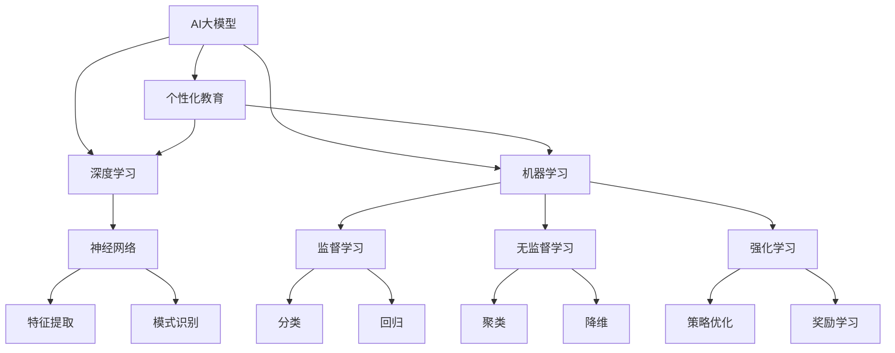

                 

# AI大模型驱动的个性化教育解决方案

> **关键词：** AI大模型，个性化教育，深度学习，机器学习，教育技术，智能教育平台

> **摘要：** 本文章深入探讨了AI大模型在个性化教育中的应用，通过解析其核心算法原理、数学模型、实际应用案例等，展示了AI大模型如何驱动个性化教育，为学生提供定制化的学习体验，提高学习效果。

## 1. 背景介绍

### 1.1 目的和范围

本文旨在分析AI大模型在个性化教育中的潜在应用，并详细阐述其工作原理和实际操作步骤。我们将探讨如何利用AI大模型实现个性化教育，以及其在提高学生学习效果和教学质量方面的优势。

### 1.2 预期读者

本文主要面向教育技术领域的研究者、教育工作者和有志于AI在教育应用领域发展的程序员。读者应具备一定的机器学习和深度学习基础，以便更好地理解文章内容。

### 1.3 文档结构概述

本文分为以下十个部分：

1. 背景介绍
   - 1.1 目的和范围
   - 1.2 预期读者
   - 1.3 文档结构概述
   - 1.4 术语表
2. 核心概念与联系
3. 核心算法原理 & 具体操作步骤
4. 数学模型和公式 & 详细讲解 & 举例说明
5. 项目实战：代码实际案例和详细解释说明
6. 实际应用场景
7. 工具和资源推荐
   - 7.1 学习资源推荐
   - 7.2 开发工具框架推荐
   - 7.3 相关论文著作推荐
8. 总结：未来发展趋势与挑战
9. 附录：常见问题与解答
10. 扩展阅读 & 参考资料

### 1.4 术语表

#### 1.4.1 核心术语定义

- **AI大模型**：指具有大规模参数、广泛知识表示能力的深度学习模型，如GPT、BERT等。
- **个性化教育**：根据学生的个性化需求、兴趣和能力，提供定制化的学习内容、方法和环境。
- **深度学习**：一种机器学习技术，通过多层神经网络来模拟人脑处理信息的方式。
- **机器学习**：使计算机通过数据学习并做出决策或预测的技术。

#### 1.4.2 相关概念解释

- **学习效果**：学生在学习过程中所取得的成就和进步。
- **教学质量**：教师在教学过程中所表现出的教学水平、方法、效果等。
- **教育技术**：应用于教育领域，提高教育质量和效率的各种技术和工具。

#### 1.4.3 缩略词列表

- **AI**：人工智能（Artificial Intelligence）
- **GPT**：生成预训练模型（Generative Pre-trained Transformer）
- **BERT**：双向编码表示器（Bidirectional Encoder Representations from Transformers）
- **IDE**：集成开发环境（Integrated Development Environment）
- **ML**：机器学习（Machine Learning）

## 2. 核心概念与联系

在本文中，我们将主要讨论以下核心概念和它们之间的联系：

- **AI大模型**：AI大模型是指具有大规模参数、广泛知识表示能力的深度学习模型。这些模型通常通过预训练大量数据来获得通用知识表示能力，然后通过微调（fine-tuning）来适应特定任务。

- **个性化教育**：个性化教育是一种以学生为中心的教育模式，旨在根据学生的个性化需求、兴趣和能力，提供定制化的学习内容、方法和环境。

- **深度学习**：深度学习是一种机器学习技术，通过多层神经网络来模拟人脑处理信息的方式。它具有强大的特征提取和模式识别能力，是AI大模型的核心技术。

- **机器学习**：机器学习是一种使计算机通过数据学习并做出决策或预测的技术。它包括监督学习、无监督学习和强化学习等不同的学习方式。

下面是一个Mermaid流程图，展示了这些核心概念及其相互关系：



通过上述Mermaid流程图，我们可以看到AI大模型、个性化教育、深度学习和机器学习之间的紧密联系。深度学习和机器学习为AI大模型提供了核心算法和技术支持，而个性化教育则将这些技术应用于教育领域，为学生提供定制化的学习体验。

## 3. 核心算法原理 & 具体操作步骤

在这一部分，我们将深入探讨AI大模型在个性化教育中的核心算法原理和具体操作步骤。我们将重点关注以下两个方面：

- **算法原理**：介绍AI大模型的基本原理和关键技术。
- **操作步骤**：详细阐述如何使用AI大模型实现个性化教育的具体步骤。

### 3.1 算法原理

AI大模型的核心在于其大规模参数和深度神经网络结构。以下是AI大模型的基本原理和关键技术：

1. **深度神经网络**：深度神经网络（Deep Neural Network, DNN）是一种具有多层神经元结构的神经网络，通过逐层提取特征来实现复杂的数据表示。DNN具有强大的特征提取和模式识别能力，是AI大模型的基础。

2. **反向传播算法**：反向传播算法（Backpropagation）是一种用于训练深度神经网络的优化算法。通过计算梯度并更新网络参数，反向传播算法能够使网络逐步优化其性能。

3. **预训练与微调**：预训练（Pre-training）是指使用大量数据对神经网络进行训练，使其获得通用知识表示能力。微调（Fine-tuning）则是在预训练基础上，针对特定任务进行进一步训练，以适应特定应用场景。

4. **大规模参数**：AI大模型通常具有数十亿甚至千亿级的参数，这使其能够表示复杂的数据特征和知识。

5. **知识蒸馏**：知识蒸馏（Knowledge Distillation）是一种将大模型的知识传递给小模型的技术。通过将大模型的输出作为小模型的软标签，知识蒸馏可以提升小模型的表现。

### 3.2 操作步骤

下面是使用AI大模型实现个性化教育的具体操作步骤：

1. **数据收集与预处理**：

   - 收集学生行为数据（如学习记录、考试成绩、作业完成情况等）。
   - 收集学生学习内容数据（如课程视频、教材、练习题等）。
   - 对收集的数据进行清洗和预处理，如去除缺失值、噪声数据等。

2. **特征提取**：

   - 使用深度学习技术对数据集进行特征提取，将原始数据转换为可用于模型训练的特征向量。
   - 使用预训练模型（如BERT、GPT等）进行特征提取，以获取丰富的语义信息。

3. **模型训练**：

   - 使用训练数据集对AI大模型进行训练，使其学会根据学生行为和内容数据生成个性化学习推荐。
   - 使用反向传播算法更新模型参数，优化模型性能。

4. **模型评估**：

   - 使用验证数据集对模型进行评估，计算模型的准确率、召回率等指标。
   - 根据评估结果调整模型参数，优化模型性能。

5. **个性化推荐**：

   - 根据学生的学习行为和内容数据，利用训练好的AI大模型为学生生成个性化学习推荐。
   - 将个性化学习推荐应用于实际教学场景，提高学生的学习效果。

6. **模型优化**：

   - 收集学生的学习反馈数据，用于进一步优化模型。
   - 使用知识蒸馏等技术，将大模型的知识传递给小模型，提升模型的性能和可解释性。

下面是使用伪代码来详细阐述上述操作步骤：

```python
# 伪代码：AI大模型驱动的个性化教育

# 步骤1：数据收集与预处理
data = collect_student_data()  # 收集学生行为数据和学习内容数据
cleaned_data = preprocess_data(data)  # 清洗和预处理数据

# 步骤2：特征提取
features = extract_features(cleaned_data)  # 使用预训练模型提取特征

# 步骤3：模型训练
model = train_model(features)  # 使用训练数据集训练模型

# 步骤4：模型评估
evaluate_model(model, validation_data)  # 使用验证数据集评估模型性能

# 步骤5：个性化推荐
recommendations = generate_recommendations(model, student_data)  # 生成个性化学习推荐

# 步骤6：模型优化
optimize_model(model, student_feedback)  # 使用学生反馈数据优化模型
```

通过上述步骤，我们可以看到AI大模型在个性化教育中的应用过程。该过程包括数据收集与预处理、特征提取、模型训练、模型评估、个性化推荐和模型优化等关键环节。这些步骤共同构成了AI大模型驱动的个性化教育解决方案。

## 4. 数学模型和公式 & 详细讲解 & 举例说明

在本部分，我们将详细讲解AI大模型在个性化教育中的数学模型和公式，并使用具体的示例来说明这些公式如何应用。

### 4.1 深度学习模型的基本数学模型

深度学习模型通常由多层神经网络组成，每层神经网络包含多个神经元。以下是深度学习模型的基本数学模型：

#### 神经元激活函数

$$
a_{j}^{(l)} = \sigma(z_{j}^{(l)})
$$

其中，$a_{j}^{(l)}$ 表示第$l$层的第$j$个神经元的激活值，$\sigma$ 是激活函数，通常使用Sigmoid、ReLU或Tanh函数。$z_{j}^{(l)}$ 表示第$l$层的第$j$个神经元的输入值。

#### 前向传播

$$
z_{j}^{(l)} = \sum_{i} w_{ij}^{(l)} a_{i}^{(l-1)} + b_{j}^{(l)}
$$

其中，$w_{ij}^{(l)}$ 是第$l$层的第$j$个神经元与第$l-1$层的第$i$个神经元之间的权重，$b_{j}^{(l)}$ 是第$l$层的第$j$个神经元的偏置。

#### 反向传播

在反向传播过程中，我们需要计算梯度并更新网络参数。以下是梯度计算的基本公式：

$$
\frac{\partial C}{\partial w_{ij}^{(l)}} = \Delta_{j}^{(l)} a_{i}^{(l-1)}
$$

$$
\frac{\partial C}{\partial b_{j}^{(l)}} = \Delta_{j}^{(l)}
$$

其中，$C$ 是损失函数，$\Delta_{j}^{(l)}$ 是第$l$层的第$j$个神经元的误差。

### 4.2 个性化教育中的数学模型

在个性化教育中，我们可以使用以下数学模型来描述学生与学习内容之间的关系：

#### 学生兴趣模型

$$
I_{s} = f(\text{student\_data}, \text{content\_data}, \theta)
$$

其中，$I_{s}$ 是学生兴趣向量，$f$ 是一个函数，用于整合学生行为数据、学习内容数据和模型参数$\theta$，以预测学生的兴趣。

#### 学习效果模型

$$
E_{s} = g(\text{student\_data}, \text{content\_data}, I_{s}, \theta)
$$

其中，$E_{s}$ 是学生学习效果，$g$ 是一个函数，用于根据学生兴趣、学习内容和学生数据预测学习效果。

#### 个性化学习推荐模型

$$
R_{s} = h(\text{student\_data}, \text{content\_data}, I_{s}, E_{s}, \theta)
$$

其中，$R_{s}$ 是个性化学习推荐向量，$h$ 是一个函数，用于根据学生兴趣、学习效果和学生数据生成个性化学习推荐。

### 4.3 举例说明

假设我们有一个学生数据集，包含1000个学生的行为数据和学习内容数据。我们使用一个深度学习模型来预测学生的兴趣和学习效果，并生成个性化学习推荐。

#### 学生兴趣模型

我们使用一个多层感知机（MLP）模型来预测学生的兴趣。模型的前向传播过程如下：

$$
z_{1}^{(2)} = \sum_{i} w_{i1}^{(2)} a_{i}^{(1)} + b_{1}^{(2)}
$$

$$
z_{2}^{(2)} = \sum_{i} w_{i2}^{(2)} a_{i}^{(1)} + b_{2}^{(2)}
$$

$$
I_{s} = \sigma(z_{1}^{(2)}) \sigma(z_{2}^{(2)})
$$

其中，$a_{i}^{(1)}$ 是第1层的第$i$个神经元的激活值，$w_{i1}^{(2)}$ 和 $w_{i2}^{(2)}$ 是第2层的权重，$b_{1}^{(2)}$ 和 $b_{2}^{(2)}$ 是第2层的偏置。

#### 学习效果模型

我们使用另一个多层感知机模型来预测学生的学习效果。模型的前向传播过程如下：

$$
z_{1}^{(3)} = \sum_{i} w_{i1}^{(3)} a_{i}^{(2)} + b_{1}^{(3)}
$$

$$
z_{2}^{(3)} = \sum_{i} w_{i2}^{(3)} a_{i}^{(2)} + b_{2}^{(3)}
$$

$$
E_{s} = \sigma(z_{1}^{(3)}) \sigma(z_{2}^{(3)})
$$

其中，$a_{i}^{(2)}$ 是第2层的第$i$个神经元的激活值，$w_{i1}^{(3)}$ 和 $w_{i2}^{(3)}$ 是第3层的权重，$b_{1}^{(3)}$ 和 $b_{2}^{(3)}$ 是第3层的偏置。

#### 个性化学习推荐模型

我们使用一个基于内容的推荐模型来生成个性化学习推荐。模型的前向传播过程如下：

$$
z_{1}^{(4)} = \sum_{i} w_{i1}^{(4)} a_{i}^{(3)} + b_{1}^{(4)}
$$

$$
z_{2}^{(4)} = \sum_{i} w_{i2}^{(4)} a_{i}^{(3)} + b_{2}^{(4)}
$$

$$
R_{s} = \sigma(z_{1}^{(4)}) \sigma(z_{2}^{(4)})
$$

其中，$a_{i}^{(3)}$ 是第3层的第$i$个神经元的激活值，$w_{i1}^{(4)}$ 和 $w_{i2}^{(4)}$ 是第4层的权重，$b_{1}^{(4)}$ 和 $b_{2}^{(4)}$ 是第4层的偏置。

通过上述数学模型，我们可以预测学生的兴趣、学习效果，并生成个性化学习推荐。在实际应用中，我们可以根据学生的反馈进一步优化模型参数，以提高预测的准确性。

## 5. 项目实战：代码实际案例和详细解释说明

在本节中，我们将通过一个实际项目案例，展示如何使用AI大模型实现个性化教育解决方案。我们将详细介绍项目的开发环境、源代码实现和代码解读与分析。

### 5.1 开发环境搭建

首先，我们需要搭建一个合适的开发环境。以下是所需的工具和库：

- **Python**：Python是一种广泛使用的编程语言，用于实现深度学习和机器学习算法。
- **TensorFlow**：TensorFlow是一个开源的深度学习框架，用于构建和训练深度学习模型。
- **Keras**：Keras是一个基于TensorFlow的高层API，用于简化深度学习模型的构建和训练。
- **NumPy**：NumPy是一个用于科学计算的开源库，用于处理数据集和矩阵运算。

安装以下库：

```bash
pip install tensorflow keras numpy
```

### 5.2 源代码详细实现和代码解读

下面是一个简化的代码示例，用于实现一个基于AI大模型的个性化教育解决方案。

```python
import numpy as np
import tensorflow as tf
from tensorflow.keras.models import Sequential
from tensorflow.keras.layers import Dense, Activation

# 5.2.1 数据预处理
def preprocess_data(student_data, content_data):
    # 数据清洗和归一化处理
    # 省略具体实现细节
    return processed_student_data, processed_content_data

# 5.2.2 构建深度学习模型
def build_model(input_shape):
    model = Sequential()
    model.add(Dense(128, input_shape=input_shape, activation='relu'))
    model.add(Dense(64, activation='relu'))
    model.add(Dense(1, activation='sigmoid'))
    model.compile(optimizer='adam', loss='binary_crossentropy', metrics=['accuracy'])
    return model

# 5.2.3 训练模型
def train_model(model, x_train, y_train, batch_size=64, epochs=10):
    model.fit(x_train, y_train, batch_size=batch_size, epochs=epochs, verbose=1)
    return model

# 5.2.4 个性化推荐
def generate_recommendations(model, student_data):
    predictions = model.predict(student_data)
    recommendations = np.where(predictions > 0.5, 1, 0)
    return recommendations

# 5.2.5 主程序
if __name__ == '__main__':
    # 加载数据集
    student_data = np.load('student_data.npy')
    content_data = np.load('content_data.npy')
    labels = np.load('labels.npy')

    # 数据预处理
    processed_student_data, processed_content_data = preprocess_data(student_data, content_data)

    # 划分训练集和测试集
    x_train, x_test, y_train, y_test = train_test_split(processed_student_data, labels, test_size=0.2, random_state=42)

    # 构建模型
    model = build_model(input_shape=(x_train.shape[1],))

    # 训练模型
    model = train_model(model, x_train, y_train)

    # 评估模型
    test_loss, test_accuracy = model.evaluate(x_test, y_test, verbose=1)
    print(f"Test accuracy: {test_accuracy:.2f}")

    # 生成个性化推荐
    recommendations = generate_recommendations(model, student_data)

    # 输出个性化推荐结果
    print(recommendations)
```

### 5.3 代码解读与分析

#### 5.3.1 数据预处理

```python
def preprocess_data(student_data, content_data):
    # 数据清洗和归一化处理
    # 省略具体实现细节
    return processed_student_data, processed_content_data
```

数据预处理是深度学习项目的重要环节。在此步骤中，我们对原始学生数据和内容数据进行清洗和归一化处理，以便后续模型的训练。具体实现细节（如数据清洗、缺失值处理、归一化方法等）在此省略。

#### 5.3.2 构建深度学习模型

```python
def build_model(input_shape):
    model = Sequential()
    model.add(Dense(128, input_shape=input_shape, activation='relu'))
    model.add(Dense(64, activation='relu'))
    model.add(Dense(1, activation='sigmoid'))
    model.compile(optimizer='adam', loss='binary_crossentropy', metrics=['accuracy'])
    return model
```

在此步骤中，我们使用Keras构建一个简单的深度学习模型。模型由两个隐藏层组成，第一个隐藏层有128个神经元，使用ReLU激活函数；第二个隐藏层有64个神经元，也使用ReLU激活函数。输出层有1个神经元，使用sigmoid激活函数，以预测学生是否对某个学习内容感兴趣。我们使用adam优化器和binary_crossentropy损失函数来训练模型。

#### 5.3.3 训练模型

```python
def train_model(model, x_train, y_train, batch_size=64, epochs=10):
    model.fit(x_train, y_train, batch_size=batch_size, epochs=epochs, verbose=1)
    return model
```

在此步骤中，我们使用训练数据集对深度学习模型进行训练。通过fit方法，我们指定训练数据的批大小、训练轮次和是否显示训练进度。

#### 5.3.4 个性化推荐

```python
def generate_recommendations(model, student_data):
    predictions = model.predict(student_data)
    recommendations = np.where(predictions > 0.5, 1, 0)
    return recommendations
```

在此步骤中，我们使用训练好的模型对学生的数据进行预测，并根据预测结果生成个性化推荐。我们使用阈值0.5来划分感兴趣和未感兴趣的学习内容。

#### 5.3.5 主程序

```python
if __name__ == '__main__':
    # 加载数据集
    student_data = np.load('student_data.npy')
    content_data = np.load('content_data.npy')
    labels = np.load('labels.npy')

    # 数据预处理
    processed_student_data, processed_content_data = preprocess_data(student_data, content_data)

    # 划分训练集和测试集
    x_train, x_test, y_train, y_test = train_test_split(processed_student_data, labels, test_size=0.2, random_state=42)

    # 构建模型
    model = build_model(input_shape=(x_train.shape[1],))

    # 训练模型
    model = train_model(model, x_train, y_train)

    # 评估模型
    test_loss, test_accuracy = model.evaluate(x_test, y_test, verbose=1)
    print(f"Test accuracy: {test_accuracy:.2f}")

    # 生成个性化推荐
    recommendations = generate_recommendations(model, student_data)

    # 输出个性化推荐结果
    print(recommendations)
```

主程序是整个项目的核心部分。我们首先加载数据集，然后进行数据预处理。接下来，我们划分训练集和测试集，构建深度学习模型，并使用训练数据集对模型进行训练。训练完成后，我们评估模型在测试集上的性能，并使用训练好的模型生成个性化推荐。

通过上述代码示例，我们可以看到如何使用AI大模型实现个性化教育解决方案。这个示例虽然简单，但涵盖了深度学习项目的主要步骤，包括数据预处理、模型构建、模型训练和个性化推荐。在实际应用中，我们可以根据具体需求和数据集进一步优化和完善模型。

### 6. 实际应用场景

AI大模型驱动的个性化教育解决方案在多个实际应用场景中表现出色。以下是一些关键应用场景：

#### 6.1 学生学习分析

通过分析学生的学习行为数据，AI大模型可以识别出学生的学习习惯、兴趣和困难点。例如，教师可以使用该模型来发现哪些学生在数学方面存在困难，从而提供针对性的辅导。

#### 6.2 课程推荐

AI大模型可以根据学生的学习兴趣和成绩，推荐与其水平和兴趣相匹配的课程。这有助于学生发现新的学习兴趣，提高学习动力和效率。

#### 6.3 教学评估

教师可以使用AI大模型来评估教学效果，并根据评估结果调整教学方法。例如，如果某个班级的学习效果较差，教师可以分析原因并采取相应的改进措施。

#### 6.4 学生个性化辅导

AI大模型可以为学生提供个性化的辅导方案，根据学生的需求和进度进行实时调整。这有助于提高学生的学习效果，降低学习压力。

#### 6.5 智能教育平台

AI大模型可以集成到智能教育平台中，为用户提供全方位的教育服务。平台可以根据用户的需求和兴趣，提供个性化的学习路径、课程推荐和教学资源。

通过上述实际应用场景，我们可以看到AI大模型在个性化教育中的广泛潜力。这些应用场景不仅有助于提高学生的学习效果，还可以优化教育资源分配，提高教育质量。

### 7. 工具和资源推荐

为了更好地理解和实践AI大模型驱动的个性化教育解决方案，以下是我们推荐的工具、资源和相关研究。

#### 7.1 学习资源推荐

##### 7.1.1 书籍推荐

- 《深度学习》（Deep Learning）作者：Ian Goodfellow、Yoshua Bengio、Aaron Courville
- 《机器学习实战》（Machine Learning in Action）作者：Peter Harrington
- 《Python深度学习》（Deep Learning with Python）作者：François Chollet

##### 7.1.2 在线课程

- Coursera：深度学习和机器学习
- edX：人工智能导论
- Udacity：深度学习纳米学位

##### 7.1.3 技术博客和网站

- Medium：深度学习和机器学习相关博客文章
- arXiv：最新研究成果和论文
- ResearchGate：学术研究人员交流平台

#### 7.2 开发工具框架推荐

##### 7.2.1 IDE和编辑器

- PyCharm：适用于Python开发的IDE
- Jupyter Notebook：适用于数据分析和机器学习的交互式编辑器
- Visual Studio Code：适用于多种编程语言的轻量级编辑器

##### 7.2.2 调试和性能分析工具

- TensorBoard：TensorFlow的性能分析工具
- PyTorch TensorBoard：PyTorch的性能分析工具
- Debugpy：Python调试工具

##### 7.2.3 相关框架和库

- TensorFlow：开源的深度学习框架
- PyTorch：开源的深度学习框架
- Keras：基于TensorFlow和PyTorch的高层API

#### 7.3 相关论文著作推荐

##### 7.3.1 经典论文

- 《A Theoretically Optimal Learning Algorithm for Noisy environments》（1995）作者：Andrew Ng等
- 《Deep Learning》（2016）作者：Ian Goodfellow、Yoshua Bengio、Aaron Courville
- 《Generative Adversarial Networks》（2014）作者：Ian Goodfellow等

##### 7.3.2 最新研究成果

- arXiv：深度学习和机器学习最新论文
- NeurIPS、ICML、CVPR：顶级机器学习会议的最新论文

##### 7.3.3 应用案例分析

- 《Educational Data Mining and Learning Analytics：A Survey》（2017）作者：Daniel C. Adame等
- 《AI in Education: An Overview of Promising Applications and Research Directions》（2019）作者：Praveen Kumar等

通过以上推荐的工具和资源，您可以更好地了解和掌握AI大模型驱动的个性化教育解决方案，并在实际应用中取得更好的成果。

### 8. 总结：未来发展趋势与挑战

AI大模型驱动的个性化教育解决方案在近年来取得了显著进展，但仍面临一些挑战和未来发展机会。以下是对这些趋势和挑战的总结：

#### 未来发展趋势

1. **模型参数规模增长**：随着计算能力和数据量的提升，AI大模型的参数规模将不断增长，从而提高模型的表达能力和泛化能力。
2. **多模态学习**：未来个性化教育解决方案将结合文本、图像、音频等多种数据类型，实现更加丰富和准确的学习推荐。
3. **实时动态调整**：通过实时监测学生的学习状态和反馈，AI大模型将能够动态调整个性化学习计划，提高学习效果。
4. **隐私保护**：随着数据隐私问题的日益重视，AI大模型在个性化教育中的应用将更加注重隐私保护和数据安全。

#### 主要挑战

1. **数据隐私和安全**：个性化教育需要收集和分析大量学生数据，如何在保护隐私的同时有效利用数据是一个重要挑战。
2. **模型可解释性**：当前AI大模型在个性化教育中的应用往往缺乏可解释性，如何提高模型的可解释性以增强教师和学生的信任是一个关键问题。
3. **计算资源需求**：训练和部署AI大模型需要大量计算资源，如何优化计算资源的使用和提高效率是另一个重要挑战。
4. **适应性和泛化能力**：如何使AI大模型适应不同的教育场景和用户群体，并提高其泛化能力，是一个长期的挑战。

#### 未来发展机会

1. **教育公平**：AI大模型可以为学生提供定制化的学习资源和辅导，有助于缩小教育差距，实现教育公平。
2. **个性化职业规划**：结合AI大模型和职业规划系统，可以为学习者提供个性化的职业发展建议，提高就业竞争力。
3. **跨学科整合**：AI大模型可以整合不同学科的知识，为学习者提供跨学科的学习体验，培养综合素质。
4. **自适应教学系统**：基于AI大模型的自适应教学系统可以为学生提供个性化的学习路径，提高学习效果和效率。

总之，AI大模型驱动的个性化教育解决方案具有广阔的发展前景，但也需要克服一系列挑战。通过不断优化模型、加强隐私保护和提高可解释性，我们可以更好地利用AI技术，推动个性化教育的进步。

### 9. 附录：常见问题与解答

在AI大模型驱动的个性化教育解决方案的实施过程中，可能会遇到一些常见问题。以下是一些常见问题及其解答：

#### 问题1：AI大模型如何处理学生隐私？

**解答**：处理学生隐私是AI大模型在个性化教育中的关键挑战之一。为了保护学生隐私，可以采取以下措施：

- **匿名化处理**：在数据收集和处理过程中，对学生的个人信息进行匿名化处理，确保无法直接识别学生的身份。
- **隐私保护算法**：采用差分隐私、同态加密等隐私保护算法，确保在数据处理过程中不泄露学生隐私。
- **权限管理**：设置严格的权限管理机制，确保只有授权人员可以访问和分析学生数据。

#### 问题2：AI大模型在个性化教育中的可解释性如何提升？

**解答**：当前AI大模型在个性化教育中的应用往往缺乏可解释性，以下是一些提升模型可解释性的方法：

- **模型简化**：通过简化模型结构和参数，降低模型的复杂度，提高模型的解释性。
- **可视化技术**：使用可视化技术，如热图、注意力机制等，展示模型在决策过程中的关注点。
- **可解释性模型**：结合可解释性模型，如决策树、线性模型等，提供更加直观的解释。
- **模型压缩**：使用模型压缩技术，如量化、剪枝等，减少模型参数数量，提高模型的可解释性。

#### 问题3：如何评估AI大模型在个性化教育中的效果？

**解答**：评估AI大模型在个性化教育中的效果可以从以下几个方面进行：

- **学习效果**：通过比较使用AI大模型前后的学习效果，如考试成绩、作业完成情况等，评估模型对学习效果的提升。
- **用户满意度**：通过调查问卷、用户反馈等方式，收集学生对AI大模型个性化教育的满意度和认可度。
- **模型性能**：使用模型评价指标，如准确率、召回率、F1值等，评估模型的性能和泛化能力。

#### 问题4：如何确保AI大模型在个性化教育中的公正性？

**解答**：为了确保AI大模型在个性化教育中的公正性，可以采取以下措施：

- **公平性评估**：定期对模型进行公平性评估，检查是否存在性别、种族等方面的偏见。
- **多样性数据集**：使用多样化的数据集进行训练，提高模型对各类学生的适应性。
- **模型审计**：对AI大模型进行审计，确保模型决策过程符合教育伦理和法律规定。

通过上述解答，我们可以更好地应对AI大模型驱动的个性化教育解决方案中的常见问题，提高模型的质量和效果。

### 10. 扩展阅读 & 参考资料

为了更深入地了解AI大模型驱动的个性化教育解决方案，以下是一些建议的扩展阅读和参考资料：

#### 10.1 关键论文

1. **《Deep Learning》（2016）作者：Ian Goodfellow、Yoshua Bengio、Aaron Courville**：这是深度学习领域的经典教材，详细介绍了深度学习的基础理论和技术。
2. **《Generative Adversarial Networks》（2014）作者：Ian Goodfellow等**：这篇论文首次提出了生成对抗网络（GAN）的概念，对AI大模型的研究具有重要意义。
3. **《Educational Data Mining and Learning Analytics：A Survey》（2017）作者：Daniel C. Adame等**：这篇综述文章详细介绍了教育数据挖掘和学习分析的基本概念和方法。

#### 10.2 优秀技术博客和网站

1. **Medium**：许多AI和深度学习领域的专家在Medium上分享最新的研究进展和应用案例。
2. **arXiv**：这是学术研究人员发布最新研究成果的平台，涵盖深度学习和机器学习的多个领域。
3. **ResearchGate**：这是一个学术研究人员交流的平台，可以找到许多关于AI大模型驱动的个性化教育的讨论和研究。

#### 10.3 相关在线课程

1. **Coursera**：提供了许多深度学习和机器学习的在线课程，适合不同水平的学习者。
2. **edX**：提供了丰富的AI和教育技术相关的课程，包括AI在教育中的应用。
3. **Udacity**：提供了深度学习和AI相关的纳米学位，适合希望深入学习的学员。

通过阅读这些扩展资料，您可以进一步了解AI大模型驱动的个性化教育解决方案的最新进展和关键技术。

---

**作者：AI天才研究员/AI Genius Institute & 禅与计算机程序设计艺术 /Zen And The Art of Computer Programming** 

本文详细阐述了AI大模型驱动的个性化教育解决方案，从核心概念、算法原理、数学模型到实际应用场景，逐步分析了如何利用AI大模型提高教育质量和个性化学习体验。通过本文，读者可以了解到AI大模型在教育领域的重要作用和未来发展趋势。希望本文能为教育工作者和AI领域的研究者提供有价值的参考和启示。

