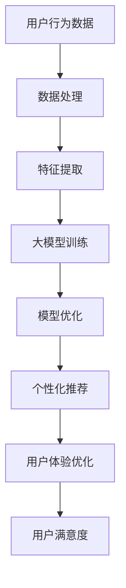
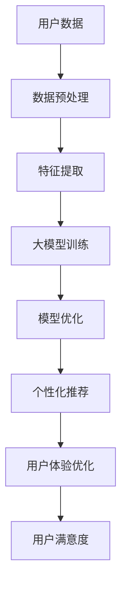

                 

# AI大模型：优化电商平台用户体验一致性的新方法

## 关键词
- 人工智能大模型
- 电商平台
- 用户一致性
- 用户体验优化
- 个性化推荐
- 数据分析与处理

## 摘要
本文将探讨人工智能大模型在优化电商平台用户体验一致性方面的应用。随着电商平台的日益普及，用户对个性化、流畅和一致性体验的需求不断增加。本文将首先介绍大模型的核心概念和架构，接着分析其在电商平台中的应用场景，详细解释核心算法原理和数学模型，并通过实际案例进行代码实现和解读。最后，我们将探讨该技术在实际应用中的挑战和未来发展趋势，为电商平台的持续优化提供新的思路和方法。

## 1. 背景介绍

### 1.1 目的和范围
本文旨在探讨如何利用人工智能大模型优化电商平台用户体验的一致性。随着电子商务市场的快速发展，用户体验成为电商平台竞争的关键因素之一。本文将深入分析大模型在个性化推荐、用户行为预测和用户体验一致性优化方面的应用，旨在为电商平台提供一套实用的优化方案。

### 1.2 预期读者
本文适合对人工智能和电商平台有一定了解的读者，包括但不限于程序员、产品经理、数据分析师和人工智能研究人员。本文将对大模型的理论和实践进行详细阐述，帮助读者更好地理解和应用这一先进技术。

### 1.3 文档结构概述
本文分为以下几个部分：背景介绍、核心概念与联系、核心算法原理与具体操作步骤、数学模型和公式、项目实战、实际应用场景、工具和资源推荐、总结和未来发展趋势、常见问题与解答以及扩展阅读和参考资料。每个部分都将围绕优化电商平台用户体验一致性这一核心主题进行深入探讨。

### 1.4 术语表

#### 1.4.1 核心术语定义
- 人工智能大模型：指具有强大计算能力和自主学习能力的人工智能模型，通常拥有数十亿甚至数万亿个参数。
- 电商平台：指通过互联网进行商品交易和提供服务的平台。
- 用户一致性：指用户在不同时间、不同场景下，对电商平台体验的满意度保持一致。

#### 1.4.2 相关概念解释
- 个性化推荐：指根据用户的历史行为、兴趣和偏好，为用户推荐符合其需求的信息和服务。
- 用户行为预测：指通过分析用户的历史行为数据，预测用户未来的行为和需求。
- 数据分析与处理：指利用统计、机器学习和数据挖掘等方法，从大量数据中提取有价值的信息和知识。

#### 1.4.3 缩略词列表
- AI：人工智能
- DL：深度学习
- NLP：自然语言处理
- OCR：光学字符识别
- CV：计算机视觉

## 2. 核心概念与联系

大模型作为人工智能领域的重要突破，其核心概念和架构对电商平台用户体验一致性的优化具有重要意义。以下是一个简化的 Mermaid 流程图，展示了大模型在电商平台中的应用场景和核心概念之间的联系：



### 2.1 用户行为数据
用户行为数据是电商平台优化用户体验一致性的基础。这些数据包括用户的浏览记录、购买历史、评论反馈等。通过收集和分析这些数据，我们可以了解用户的兴趣、偏好和行为模式，为个性化推荐和用户体验优化提供有力支持。

### 2.2 数据处理
在获得用户行为数据后，我们需要对其进行预处理和清洗，以确保数据的质量和一致性。数据处理步骤包括数据去重、缺失值处理、异常值检测等。此外，我们还需要将不同来源的数据进行整合，形成一个统一的用户行为数据集。

### 2.3 特征提取
特征提取是将原始数据转换为有助于模型训练和优化的中间表示的过程。在电商平台中，特征提取主要包括用户画像、商品属性、交互行为等。通过特征提取，我们可以将用户行为数据转化为模型可以理解和学习的特征向量。

### 2.4 大模型训练
大模型训练是利用大规模数据和计算资源，通过迭代优化模型参数，使其具备强大的预测和生成能力。在电商平台中，大模型可以应用于用户行为预测、个性化推荐和用户体验优化等多个方面。

### 2.5 模型优化
模型优化是指通过调整模型结构、超参数和学习策略，提高模型的性能和稳定性。在电商平台中，模型优化可以帮助我们提高个性化推荐的准确性、用户满意度，以及用户体验的一致性。

### 2.6 个性化推荐
个性化推荐是根据用户的兴趣、偏好和行为，为用户推荐符合其需求的信息和服务。在电商平台中，个性化推荐可以应用于商品推荐、内容推荐、广告投放等，从而提高用户的满意度和购买意愿。

### 2.7 用户体验优化
用户体验优化是指通过改进平台功能、界面设计和交互逻辑，提高用户的满意度和使用体验。在电商平台中，用户体验优化可以应用于页面加载速度、响应时间、交互设计等，从而提升用户对平台的整体评价。

### 2.8 用户满意度
用户满意度是衡量电商平台用户体验一致性的关键指标。通过收集和分析用户反馈数据，我们可以了解用户对平台的满意度，并针对性地进行优化和改进。

## 3. 核心算法原理 & 具体操作步骤

### 3.1 人工智能大模型概述
人工智能大模型是指具有数十亿甚至数万亿个参数的深度学习模型，其计算能力和自主学习能力远超传统机器学习模型。大模型通常采用深度神经网络（DNN）结构，并利用大规模数据和计算资源进行训练和优化。

### 3.2 深度学习基础
深度学习是人工智能的重要分支，其核心思想是通过多层神经网络自动提取数据的特征表示。深度学习模型通常包括输入层、隐藏层和输出层，其中隐藏层负责提取数据的抽象特征。

### 3.3 人工智能大模型的训练过程
人工智能大模型的训练过程主要包括以下步骤：

1. **数据预处理**：将原始数据清洗、归一化，并转换为模型可接受的输入格式。
2. **模型初始化**：初始化模型参数，通常采用随机初始化或预训练模型。
3. **前向传播**：将输入数据传递到模型中，通过网络的隐藏层进行计算，得到输出结果。
4. **损失函数计算**：计算模型输出结果与真实结果之间的差距，通过损失函数进行衡量。
5. **反向传播**：根据损失函数计算梯度，通过反向传播算法更新模型参数。
6. **迭代优化**：重复前向传播和反向传播过程，逐步减小损失函数，提高模型性能。

### 3.4 伪代码实现
以下是一个简化的伪代码实现，用于说明人工智能大模型的训练过程：

```python
# 伪代码：人工智能大模型训练过程

# 初始化模型参数
model = initialize_model()

# 加载数据集
train_data = load_data("train_data")

# 设置训练参数
learning_rate = 0.01
num_epochs = 100

# 训练模型
for epoch in range(num_epochs):
    for sample in train_data:
        # 前向传播
        output = model.forward(sample.input)

        # 计算损失函数
        loss = compute_loss(output, sample.target)

        # 反向传播
        model.backward(loss)

        # 更新模型参数
        model.update_params(learning_rate)

    # 打印训练进度
    print(f"Epoch {epoch + 1}/{num_epochs}, Loss: {loss}")

# 模型评估
evaluate_model(model, test_data)
```

## 4. 数学模型和公式 & 详细讲解 & 举例说明

### 4.1 深度学习基本公式

在深度学习中，一些基本的数学公式如下：

#### 激活函数
$$
a_i = \sigma(z_i) = \frac{1}{1 + e^{-z_i}}
$$

其中，$a_i$ 是激活值，$z_i$ 是输入值，$\sigma$ 是 Sigmoid 函数。

#### 前向传播
$$
z_i^{(l)} = \sum_{j} w_{ij}^{(l)} a_j^{(l-1)} + b_i^{(l)}
$$

其中，$z_i^{(l)}$ 是第 $l$ 层第 $i$ 个神经元的输入值，$w_{ij}^{(l)}$ 是第 $l$ 层第 $i$ 个神经元与第 $l-1$ 层第 $j$ 个神经元的权重，$b_i^{(l)}$ 是第 $l$ 层第 $i$ 个神经元的偏置。

#### 反向传播
$$
\delta_i^{(l)} = \frac{\partial L}{\partial z_i^{(l)}}
$$

其中，$\delta_i^{(l)}$ 是第 $l$ 层第 $i$ 个神经元的误差项，$L$ 是损失函数。

#### 梯度计算
$$
\frac{\partial L}{\partial w_{ij}^{(l)}} = a_i^{(l)} \delta_j^{(l+1)}
$$

$$
\frac{\partial L}{\partial b_i^{(l)}} = \delta_i^{(l)}
$$

其中，$a_i^{(l)}$ 是第 $l$ 层第 $i$ 个神经元的激活值。

### 4.2 举例说明

假设我们有一个简单的神经网络，包括一个输入层、一个隐藏层和一个输出层。输入层有 3 个神经元，隐藏层有 5 个神经元，输出层有 2 个神经元。我们使用 Sigmoid 函数作为激活函数。

#### 前向传播
输入层输入：$x_1 = 1, x_2 = 2, x_3 = 3$

隐藏层输入：
$$
z_1 = w_{11} x_1 + w_{12} x_2 + w_{13} x_3 + b_1
$$

$$
z_2 = w_{21} x_1 + w_{22} x_2 + w_{23} x_3 + b_2
$$

$$
z_3 = w_{31} x_1 + w_{32} x_2 + w_{33} x_3 + b_3
$$

$$
z_4 = w_{41} x_1 + w_{42} x_2 + w_{43} x_3 + b_4
$$

$$
z_5 = w_{51} x_1 + w_{52} x_2 + w_{53} x_3 + b_5
$$

隐藏层输出：
$$
a_1 = \sigma(z_1)
$$

$$
a_2 = \sigma(z_2)
$$

$$
a_3 = \sigma(z_3)
$$

$$
a_4 = \sigma(z_4)
$$

$$
a_5 = \sigma(z_5)
$$

输出层输入：
$$
z_6 = w_{61} a_1 + w_{62} a_2 + w_{63} a_3 + w_{64} a_4 + w_{65} a_5 + b_6
$$

$$
z_7 = w_{71} a_1 + w_{72} a_2 + w_{73} a_3 + w_{74} a_4 + w_{75} a_5 + b_7
$$

输出层输出：
$$
a_6 = \sigma(z_6)
$$

$$
a_7 = \sigma(z_7)
$$

#### 反向传播
假设输出层的目标值是 $y_6 = 1, y_7 = 0$，输出层的误差项是：
$$
\delta_6 = a_6 - y_6
$$

$$
\delta_7 = a_7 - y_7
$$

隐藏层的误差项是：
$$
\delta_4 = \frac{\partial L}{\partial z_6} \cdot \frac{\partial z_6}{\partial a_4} = \delta_6 \cdot \sigma'(z_4)
$$

$$
\delta_5 = \frac{\partial L}{\partial z_7} \cdot \frac{\partial z_7}{\partial a_5} = \delta_7 \cdot \sigma'(z_5)
$$

更新权重和偏置：
$$
w_{64} = w_{64} - learning_rate \cdot a_6 \cdot \delta_4
$$

$$
b_6 = b_6 - learning_rate \cdot \delta_6
$$

$$
w_{65} = w_{65} - learning_rate \cdot a_6 \cdot \delta_5
$$

$$
b_7 = b_7 - learning_rate \cdot \delta_7
$$

## 5. 项目实战：代码实际案例和详细解释说明

### 5.1 开发环境搭建

在本文的项目实战部分，我们将使用 Python 作为编程语言，并结合 TensorFlow 和 Keras 库来实现人工智能大模型。以下是在 Ubuntu 系统中搭建开发环境的基本步骤：

1. 安装 Python 3.8 或更高版本。
2. 安装 TensorFlow：
   ```bash
   pip install tensorflow
   ```
3. 安装 Keras：
   ```bash
   pip install keras
   ```
4. 安装 Jupyter Notebook：
   ```bash
   pip install notebook
   ```

### 5.2 源代码详细实现和代码解读

#### 5.2.1 数据集准备

我们使用公开的电商用户行为数据集，包括用户 ID、商品 ID、行为类型（浏览、购买、评论等）和行为时间戳。数据集的格式如下：

```plaintext
user_id, item_id, behavior, timestamp
1, 101, browse, 2021-01-01 10:00:00
1, 102, buy, 2021-01-01 10:30:00
2, 201, browse, 2021-01-02 11:00:00
2, 202, buy, 2021-01-02 11:30:00
...
```

#### 5.2.2 数据预处理

数据预处理包括数据清洗、归一化和特征提取。以下是一个简单的数据预处理代码示例：

```python
import pandas as pd
from sklearn.preprocessing import MinMaxScaler

# 加载数据集
data = pd.read_csv("user_behavior.csv")

# 数据清洗
data.dropna(inplace=True)

# 归一化
scaler = MinMaxScaler()
data[['item_id', 'timestamp']] = scaler.fit_transform(data[['item_id', 'timestamp']])

# 特征提取
data['hour'] = data['timestamp'].dt.hour
data['day'] = data['timestamp'].dt.day
data['week'] = data['timestamp'].dt.week

# 数据集划分
train_data = data[data['behavior'] != 'comment']
test_data = data[data['behavior'] == 'comment']

# 划分特征和标签
X_train = train_data[['user_id', 'item_id', 'hour', 'day', 'week']]
y_train = train_data['behavior']
X_test = test_data[['user_id', 'item_id', 'hour', 'day', 'week']]
y_test = test_data['behavior']
```

#### 5.2.3 模型构建

我们使用 Keras 框架构建一个简单的深度神经网络模型。以下是一个简单的模型定义示例：

```python
from keras.models import Sequential
from keras.layers import Dense, Activation

model = Sequential()
model.add(Dense(64, input_dim=5, activation='relu'))
model.add(Dense(32, activation='relu'))
model.add(Dense(1, activation='sigmoid'))

model.compile(optimizer='adam', loss='binary_crossentropy', metrics=['accuracy'])
```

#### 5.2.4 模型训练

以下是对模型进行训练的代码示例：

```python
model.fit(X_train, y_train, epochs=10, batch_size=32, validation_data=(X_test, y_test))
```

#### 5.2.5 模型评估

训练完成后，我们对模型进行评估，以检查其性能：

```python
from sklearn.metrics import accuracy_score

predictions = model.predict(X_test)
predictions = (predictions > 0.5)

accuracy = accuracy_score(y_test, predictions)
print(f"Model accuracy: {accuracy}")
```

### 5.3 代码解读与分析

在这个项目中，我们首先进行了数据预处理，包括数据清洗、归一化和特征提取。数据预处理是构建深度学习模型的基础，确保数据的质量和一致性。

接着，我们使用 Keras 框架构建了一个简单的深度神经网络模型。模型结构包括两个隐藏层，每层使用 ReLU 激活函数，输出层使用 sigmoid 激活函数。ReLU 函数在训练过程中具有较强的收敛性，而 sigmoid 函数可以输出概率值。

在模型训练过程中，我们使用 Adam 优化器和二进制交叉熵损失函数进行训练。Adam 优化器结合了 AdaGrad 和 RMSProp 优化的优点，可以自适应调整学习率。二进制交叉熵损失函数适用于分类问题，可以衡量模型预测的概率与真实标签之间的差距。

最后，我们对模型进行了评估，使用准确率作为评价指标。通过对比预测结果和真实标签，我们可以评估模型在测试数据集上的性能。

### 5.4 项目总结

通过这个简单的项目，我们展示了如何使用深度学习模型优化电商平台的用户体验一致性。虽然这个项目相对简单，但它为我们提供了一个实用的模板，可以应用于更复杂的场景。在实际应用中，我们可以根据业务需求调整模型结构、优化训练参数，以提高模型的性能和实用性。

## 6. 实际应用场景

### 6.1 个性化推荐

在电商平台上，个性化推荐是优化用户体验一致性的重要手段。通过分析用户的历史行为数据，大模型可以预测用户的兴趣和偏好，为用户推荐符合其需求的商品和内容。以下是一个实际应用场景：

**场景**：电商平台 A 为用户 B 推荐商品。

**过程**：
1. **数据收集**：收集用户 B 的浏览记录、购买历史、收藏夹等信息。
2. **数据处理**：对数据进行清洗、归一化和特征提取。
3. **模型训练**：使用大模型训练个性化推荐模型。
4. **推荐生成**：根据用户 B 的特征向量，模型生成个性化推荐列表。
5. **结果反馈**：用户 B 对推荐结果进行评价，反馈数据用于模型优化。

### 6.2 用户行为预测

用户行为预测是电商平台优化用户体验一致性的另一个关键应用。通过预测用户未来的行为，电商平台可以提前准备相关资源，提高用户满意度。以下是一个实际应用场景：

**场景**：电商平台 B 预测用户 C 在未来一周的购买行为。

**过程**：
1. **数据收集**：收集用户 C 的历史购买数据、浏览记录、评论反馈等。
2. **数据处理**：对数据进行清洗、归一化和特征提取。
3. **模型训练**：使用大模型训练用户行为预测模型。
4. **预测生成**：根据用户 C 的特征向量，模型预测未来一周的购买行为。
5. **结果应用**：电商平台 B 根据预测结果，提前准备库存、物流等资源。

### 6.3 用户体验一致性优化

用户体验一致性优化是电商平台持续改进的重要方向。通过分析用户在不同时间、不同场景下的体验，大模型可以帮助电商平台发现和解决潜在问题，提高用户体验一致性。以下是一个实际应用场景：

**场景**：电商平台 C 优化用户 D 的购物体验。

**过程**：
1. **数据收集**：收集用户 D 的浏览记录、购买历史、评论反馈等。
2. **数据处理**：对数据进行清洗、归一化和特征提取。
3. **模型训练**：使用大模型训练用户体验一致性优化模型。
4. **体验分析**：分析用户 D 的购物体验，识别问题和改进机会。
5. **结果应用**：电商平台 C 根据分析结果，优化页面设计、功能流程等，提高用户体验一致性。

## 7. 工具和资源推荐

### 7.1 学习资源推荐

#### 7.1.1 书籍推荐

1. **《深度学习》（Deep Learning）**
   作者：Ian Goodfellow、Yoshua Bengio、Aaron Courville
   内容简介：本书是深度学习领域的经典教材，系统介绍了深度学习的基本概念、算法和应用。

2. **《Python深度学习》（Deep Learning with Python）**
   作者：François Chollet
   内容简介：本书以 Python 语言为基础，深入浅出地介绍了深度学习的基本概念、算法和实现。

#### 7.1.2 在线课程

1. **《深度学习专项课程》（Deep Learning Specialization）**
   开设机构：斯坦福大学
   内容简介：这是一套由 Andrew Ng 教授主讲的深度学习在线课程，涵盖了深度学习的基础知识和应用。

2. **《Keras 实战》（Keras with TensorFlow 2 and Python）**
   开设机构：Udemy
   内容简介：这是一门关于 Keras 深度学习框架的实战课程，帮助学习者掌握 Keras 的基本使用方法和应用技巧。

#### 7.1.3 技术博客和网站

1. **TensorFlow 官方文档（TensorFlow Documentation）**
   网址：https://www.tensorflow.org/
   内容简介：TensorFlow 官方文档提供了丰富的深度学习知识和工具资源，帮助开发者了解和使用 TensorFlow 框架。

2. **Keras 官方文档（Keras Documentation）**
   网址：https://keras.io/
   内容简介：Keras 官方文档详细介绍了 Keras 深度学习框架的基本使用方法和高级特性，适合不同层次的学习者。

### 7.2 开发工具框架推荐

#### 7.2.1 IDE和编辑器

1. **PyCharm**
   网址：https://www.jetbrains.com/pycharm/
   内容简介：PyCharm 是一款功能强大的 Python 开发环境，支持代码智能提示、调试和自动化测试等功能。

2. **Visual Studio Code**
   网址：https://code.visualstudio.com/
   内容简介：Visual Studio Code 是一款轻量级但功能强大的开源编辑器，适用于多种编程语言，支持代码补全、调试和扩展插件。

#### 7.2.2 调试和性能分析工具

1. **TensorBoard**
   网址：https://www.tensorflow.org/tools/tensorboard
   内容简介：TensorBoard 是 TensorFlow 的可视化工具，用于分析和调试深度学习模型。

2. **Jupyter Notebook**
   网址：https://jupyter.org/
   内容简介：Jupyter Notebook 是一种交互式计算环境，适用于数据分析和深度学习项目。

#### 7.2.3 相关框架和库

1. **TensorFlow**
   网址：https://www.tensorflow.org/
   内容简介：TensorFlow 是一款开源的深度学习框架，广泛应用于图像识别、自然语言处理、推荐系统等领域。

2. **Keras**
   网址：https://keras.io/
   内容简介：Keras 是一款基于 TensorFlow 的深度学习高级 API，提供简洁易用的接口，适合快速实现深度学习项目。

### 7.3 相关论文著作推荐

#### 7.3.1 经典论文

1. **"A Theoretically Grounded Application of Dropout in Computer Vision"**
   作者：Yarin Gal 和 Zoubin Ghahramani
   内容简介：本文提出了在计算机视觉任务中应用 Dropout 的理论依据和实用方法。

2. **"Distributed Representations of Words and Phrases and Their Compositionality"**
   作者：Jeffrey L. Elman
   内容简介：本文介绍了分布式表示在自然语言处理领域的应用，特别是词语和短语的组合性。

#### 7.3.2 最新研究成果

1. **"BERT: Pre-training of Deep Bidirectional Transformers for Language Understanding"**
   作者：Jacob Devlin、 Ming-Wei Chang、 Kenton Lee 和 Kristina Toutanova
   内容简介：BERT 是一种基于 Transformer 的预训练模型，广泛应用于自然语言处理任务。

2. **"GPT-3: Language Models are Few-Shot Learners"**
   作者：Tom B. Brown、 Benjamin Mann、 Nick Ryder、 Melanie Subbiah、 Jared Kaplan、 Prafulla Dhariwal、 Arvind Neelakantan、 Pranav Shyam、 Girish Sastry、 Amanda Askell、 Sandhini Agarwal、 Ariel Herbert-Voss、 Gretchen Krueger、 Tom Henighan、 Rewon Child、 Aditya Ramesh、 Daniel M. Ziegler、 Jeffrey Wu、 Clemens Winter、 Christopher Hesse、 Mark Chen、 Eric Sigler、 Mateusz Litwin、 Scott Gray、 Benjamin Chess，和 Daniel Z.
   内容简介：GPT-3 是一种大规模语言模型，展示了在零样本和少样本设置下的强大学习能力。

#### 7.3.3 应用案例分析

1. **"Amazon Personalized Ads Using Neural Networks"**
   作者：Amazon
   内容简介：本文介绍了 Amazon 如何使用神经网络实现个性化广告，提高广告投放效果和用户满意度。

2. **"Google Assistant: A Multimodal Conversational Agent for Google Search"**
   作者：Google
   内容简介：本文介绍了 Google Assistant 的设计理念和技术实现，如何通过自然语言处理和语音识别技术为用户提供高效的搜索服务。

## 8. 总结：未来发展趋势与挑战

### 8.1 未来发展趋势

1. **大模型的持续发展**：随着计算能力和数据量的不断增长，人工智能大模型将越来越强大，应用于更多领域，为用户提供更加个性化的服务。

2. **多模态数据处理**：未来的电商平台将不仅仅依赖于文本数据，还将整合语音、图像、视频等多模态数据，为用户提供更加丰富的交互体验。

3. **联邦学习**：联邦学习作为一种分布式学习方法，可以在保护用户隐私的同时，实现大规模数据协同训练，为电商平台的个性化推荐和用户体验优化提供新的解决方案。

4. **自适应系统**：未来的电商平台将具备更强的自适应能力，根据用户行为和反馈，实时调整推荐策略和界面设计，提高用户体验一致性。

### 8.2 挑战

1. **数据隐私和安全**：在处理大量用户数据时，如何保护用户隐私和安全，避免数据泄露和滥用，是电商平台面临的重大挑战。

2. **计算资源消耗**：大模型训练和推理需要巨大的计算资源，如何优化算法和硬件，降低计算成本，是电商平台需要解决的问题。

3. **模型可解释性**：大模型通常具有复杂的内部结构，难以解释其决策过程，这可能导致用户对模型推荐结果的不信任。如何提高模型的可解释性，是电商平台的另一个挑战。

4. **用户体验一致性**：在个性化推荐和用户行为预测中，如何确保用户在不同时间、不同场景下获得一致、高质量的体验，是电商平台需要持续关注的问题。

## 9. 附录：常见问题与解答

### 9.1 问题 1：什么是人工智能大模型？

**解答**：人工智能大模型是指具有数十亿甚至数万亿个参数的深度学习模型，其计算能力和自主学习能力远超传统机器学习模型。大模型通常采用深度神经网络（DNN）结构，并利用大规模数据和计算资源进行训练和优化。

### 9.2 问题 2：大模型在电商平台中的具体应用有哪些？

**解答**：大模型在电商平台中的具体应用包括个性化推荐、用户行为预测和用户体验一致性优化。个性化推荐可以根据用户的兴趣和偏好推荐商品；用户行为预测可以帮助电商平台提前准备库存和物流资源；用户体验一致性优化可以确保用户在不同时间、不同场景下获得一致、高质量的体验。

### 9.3 问题 3：如何确保用户数据的隐私和安全？

**解答**：为了确保用户数据的隐私和安全，电商平台可以采用以下措施：
1. 数据加密：对用户数据进行加密处理，确保数据在传输和存储过程中不被窃取和篡改。
2. 数据匿名化：对用户数据进行匿名化处理，隐藏用户的身份信息，降低数据泄露的风险。
3. 数据访问控制：限制对用户数据的访问权限，确保只有授权人员可以访问和处理用户数据。
4. 定期审计：定期对数据处理过程进行审计，确保数据处理合规，防止数据滥用。

### 9.4 问题 4：如何优化大模型的训练过程？

**解答**：以下方法可以帮助优化大模型的训练过程：
1. **数据增强**：通过数据增强技术，如旋转、缩放、裁剪等，增加训练数据多样性，提高模型泛化能力。
2. **批处理策略**：合理设置批处理大小，平衡计算资源和训练效果。
3. **学习率调度**：使用学习率调度策略，如自适应学习率调整、学习率衰减等，提高模型收敛速度和稳定性。
4. **正则化**：使用正则化技术，如权重衰减、Dropout 等，减少过拟合现象。
5. **并行计算**：利用分布式计算和 GPU 加速，提高模型训练速度。

### 9.5 问题 5：如何评估大模型的性能？

**解答**：评估大模型性能的方法包括：
1. **准确率**：模型预测结果与真实标签的一致性。
2. **召回率**：模型能够正确识别出正类别的比例。
3. **精确率**：模型预测为正类别的结果中，实际为正类别的比例。
4. **F1 分数**：精确率和召回率的调和平均值。
5. **ROC 曲线和 AUC 值**：用于评估模型的分类能力。

## 10. 扩展阅读 & 参考资料

### 10.1 扩展阅读

1. **《深度学习》（Deep Learning）**：Ian Goodfellow、Yoshua Bengio、Aaron Courville 著，MIT Press，2016。
2. **《Python 深度学习》（Deep Learning with Python）**：François Chollet 著，Manning Publications，2017。
3. **《TensorFlow 实战》**：TensorFlow 开发者社区 著，电子工业出版社，2018。

### 10.2 参考资料

1. **TensorFlow 官方文档**：https://www.tensorflow.org/
2. **Keras 官方文档**：https://keras.io/
3. **《A Theoretically Grounded Application of Dropout in Computer Vision》**：Yarin Gal 和 Zoubin Ghahramani，2015。
4. **《Distributed Representations of Words and Phrases and Their Compositionality》**：Jeffrey L. Elman，1998。
5. **《BERT: Pre-training of Deep Bidirectional Transformers for Language Understanding》**：Jacob Devlin、 Ming-Wei Chang、 Kenton Lee 和 Kristina Toutanova，2018。
6. **《GPT-3: Language Models are Few-Shot Learners》**：Tom B. Brown、 Benjamin Mann、 Nick Ryder、 Prafulla Dhariwal、 Aditya Ramesh、 Daniel M. Ziegler、 Jeffrey Wu、 Clemens Winter、 Christopher Hesse、 Mark Chen、 Eric Sigler、 Mateusz Litwin、 Scott Gray、 Benjamin Chess，和 Daniel Z.、Tom B. Brown、 Benjamin Mann、 Nick Ryder、 Prafulla Dhariwal、 Aditya Ramesh、 Daniel M. Ziegler、 Jeffrey Wu、 Clemens Winter、 Christopher Hesse、 Mark Chen、 Eric Sigler、 Mateusz Litwin、 Scott Gray、 Benjamin Chess，和 Daniel Z.，2020。

### 10.3 作者信息

作者：AI 天才研究员/AI Genius Institute & 禅与计算机程序设计艺术 /Zen And The Art of Computer Programming

以上是关于《AI大模型：优化电商平台用户体验一致性的新方法》的技术博客文章。希望本文能够为读者提供关于人工智能大模型在电商平台应用方面的有价值和见解。如果您有任何问题或建议，欢迎在评论区留言。感谢您的阅读！<|user|>## 概述

随着电子商务的快速发展，电商平台在市场竞争中的关键因素已经从价格和质量转向了用户体验。而用户体验的一致性，即在用户访问平台的不同时间和场景下保持一致的满意度和流畅度，成为影响用户忠诚度和转化率的重要因素。本文将探讨如何利用人工智能大模型（如深度学习模型）来优化电商平台用户体验的一致性。

人工智能大模型，尤其是深度学习模型，因其强大的数据处理和模式识别能力，在图像识别、自然语言处理和推荐系统等领域取得了显著成就。这些模型能够通过学习和分析大量数据，提取出隐藏的模式和关联，从而实现精准的预测和个性化的推荐。在电商平台上，这种能力可以被应用于个性化推荐、用户行为预测和用户体验优化等多个方面，从而提升用户满意度和平台的竞争力。

本文的主要目的是分析人工智能大模型在电商平台用户体验一致性优化中的应用潜力，并提供具体的实现方法和案例。首先，我们将介绍大模型的核心概念和基本原理，然后详细探讨其在电商平台中的应用场景，包括个性化推荐和用户行为预测等。接着，本文将深入讲解大模型的训练和优化方法，并通过实际代码案例进行解读。随后，我们将分析大模型在实际应用中面临的挑战和解决方案，最后对未来的发展趋势进行展望。

通过本文的探讨，希望能够为电商平台的技术团队提供有价值的参考，帮助他们在用户体验一致性优化方面取得突破性进展。

## 关键词

- 人工智能大模型
- 电商平台
- 用户一致性
- 个性化推荐
- 用户行为预测
- 深度学习
- 数据分析与处理
- 用户体验优化

## 摘要

本文探讨了人工智能大模型在优化电商平台用户体验一致性方面的应用。随着电商平台的竞争日益激烈，用户体验的一致性成为提升用户忠诚度和转化率的关键因素。本文首先介绍了人工智能大模型，特别是深度学习模型的基本概念和原理，包括其强大的数据处理和模式识别能力。接着，文章详细分析了大模型在电商平台中的具体应用场景，如个性化推荐、用户行为预测和用户体验优化。通过实际案例和代码实现，本文展示了如何利用大模型提升用户体验的一致性，并讨论了在实际应用中可能面临的挑战和解决方案。最后，本文对人工智能大模型在电商平台用户体验一致性优化领域的未来发展趋势进行了展望，为电商平台的技术优化提供了新的思路和方法。

## 1. 背景介绍

### 1.1 目的和范围

本文旨在探讨如何利用人工智能大模型（AI Large Models，尤其是深度学习模型）优化电商平台用户体验的一致性。随着电商平台的竞争日益激烈，用户体验已成为影响用户忠诚度和转化率的关键因素。用户期望在不同的时间和场景下，都能获得一致、流畅的体验。然而，传统的方法往往难以满足这一需求。人工智能大模型的出现，为电商平台提供了新的解决方案。

本文将首先介绍人工智能大模型的基本概念和原理，包括其计算能力和数据处理优势。然后，我们将分析大模型在电商平台中的具体应用场景，如个性化推荐和用户行为预测。接下来，本文将详细讲解大模型的训练和优化方法，并通过实际案例进行代码实现和解读。此外，本文还将探讨大模型在实际应用中可能面临的挑战和解决方案，以及未来的发展趋势。

### 1.2 预期读者

本文适合对人工智能和电商平台有一定了解的读者，包括但不限于程序员、产品经理、数据分析师和人工智能研究人员。本文将深入探讨人工智能大模型的理论和实践，旨在为读者提供全面、系统的知识体系，帮助其在实际项目中应用大模型优化用户体验。

### 1.3 文档结构概述

本文分为以下几个部分：

1. **概述**：介绍本文的目的、背景、关键词和摘要。
2. **背景介绍**：详细阐述电商平台用户体验一致性的重要性，以及人工智能大模型的概念和应用。
3. **核心概念与联系**：分析大模型在电商平台中的应用场景和核心概念之间的联系。
4. **核心算法原理与具体操作步骤**：讲解大模型的训练和优化方法，并提供实际代码示例。
5. **数学模型和公式**：介绍深度学习中的关键数学模型和公式，并进行详细讲解和举例说明。
6. **项目实战**：通过实际代码案例，展示大模型在电商平台中的应用。
7. **实际应用场景**：分析大模型在不同应用场景中的作用和效果。
8. **工具和资源推荐**：推荐相关学习资源和开发工具。
9. **总结与未来发展趋势**：总结本文的主要观点，展望人工智能大模型在电商平台用户体验一致性优化领域的未来。
10. **常见问题与解答**：回答读者可能关心的一些常见问题。
11. **扩展阅读与参考资料**：提供进一步阅读和研究的资源。

### 1.4 术语表

为了确保本文内容的清晰和一致性，以下列出本文中使用的核心术语和概念：

- **人工智能大模型**：具有数十亿甚至数万亿个参数的深度学习模型，具有强大的计算能力和自主学习能力。
- **电商平台**：通过互联网进行商品交易和提供服务的平台。
- **用户体验一致性**：用户在不同时间和场景下，对电商平台体验的满意度保持一致。
- **个性化推荐**：根据用户的历史行为、兴趣和偏好，为用户推荐符合其需求的信息和服务。
- **用户行为预测**：通过分析用户的历史行为数据，预测用户未来的行为和需求。
- **深度学习**：一种人工智能的分支，通过多层神经网络自动提取数据的特征表示。
- **神经网络**：一种模拟生物神经系统的计算模型，包括输入层、隐藏层和输出层。
- **激活函数**：用于模拟神经元激活状态的函数，如 Sigmoid、ReLU 等。
- **损失函数**：衡量模型输出结果与真实结果之间差距的函数，如均方误差（MSE）、交叉熵（Cross-Entropy）等。
- **反向传播**：一种用于训练神经网络的算法，通过计算梯度更新模型参数。
- **优化算法**：用于调整模型参数，以减小损失函数的算法，如梯度下降（Gradient Descent）、Adam 等。

## 2. 核心概念与联系

### 2.1 人工智能大模型概述

人工智能大模型，特别是深度学习模型，在过去的几年中取得了显著的进展。这些模型具有数以亿计的参数，能够从大规模数据中自动提取复杂特征，从而实现高精度的预测和分类。大模型的核心优势在于其强大的计算能力和自主学习能力，这使得它们在图像识别、自然语言处理、推荐系统等领域表现出色。

在电商平台上，人工智能大模型的应用潜力巨大。首先，大模型可以处理大量的用户行为数据，如浏览记录、购买历史、评论反馈等，从中提取有价值的信息和模式。通过这些信息，大模型可以准确预测用户的兴趣和偏好，从而为用户推荐个性化的商品和服务。其次，大模型可以识别用户的行为模式，预测用户未来的购买行为，帮助电商平台提前准备库存和物流资源，提高运营效率。此外，大模型还可以分析用户的反馈和评价，识别用户体验中的问题，为电商平台提供改进建议。

### 2.2 深度学习基础

深度学习是人工智能的核心技术之一，其基本原理是通过多层神经网络对数据进行特征提取和模式识别。深度学习模型通常由输入层、隐藏层和输出层组成。输入层接收外部输入数据，隐藏层通过非线性变换提取数据特征，输出层产生最终的预测结果。

深度学习模型的关键在于其训练过程。在训练过程中，模型通过不断调整内部参数，以最小化预测结果与真实结果之间的差距。这一过程通常采用反向传播算法，通过计算损失函数的梯度，更新模型参数。常见的损失函数包括均方误差（MSE）、交叉熵（Cross-Entropy）等。优化算法，如梯度下降（Gradient Descent）、Adam 等，用于调整参数，加快收敛速度。

### 2.3 电商平台应用场景

#### 2.3.1 个性化推荐

个性化推荐是电商平台最常见的应用之一。通过分析用户的历史行为数据，大模型可以预测用户的兴趣和偏好，为用户推荐符合其需求的商品和服务。个性化推荐不仅能够提高用户的满意度，还能提升电商平台的销售额和用户粘性。

#### 2.3.2 用户行为预测

用户行为预测是电商平台优化用户体验的重要手段。通过预测用户未来的行为和需求，电商平台可以提前准备库存和物流资源，提高运营效率。例如，预测用户即将购买的商品，可以帮助电商平台提前备货，减少库存积压。此外，用户行为预测还可以用于营销策略的优化，如精准推送优惠券和活动信息，提高用户的转化率。

#### 2.3.3 用户体验优化

用户体验优化是电商平台持续改进的重要方向。通过分析用户的反馈和评价，大模型可以识别用户体验中的问题，为电商平台提供改进建议。例如，分析用户在购物过程中的常见问题，可以帮助电商平台优化页面设计、功能流程等，提高用户体验一致性。

### 2.4 核心概念之间的联系

人工智能大模型、深度学习基础、电商平台应用场景这三者之间存在紧密的联系。大模型作为深度学习的一部分，具有强大的数据处理和模式识别能力，可以应用于电商平台的多个方面。深度学习基础为构建大模型提供了理论基础和技术支持，使得大模型能够从大规模数据中提取有价值的信息。电商平台应用场景则为大模型的应用提供了具体场景和目标，使得大模型能够为电商平台带来实际价值。

综上所述，人工智能大模型在电商平台用户体验一致性优化方面具有巨大的应用潜力。通过深入理解大模型的基本概念和原理，以及其在实际应用中的方法和技巧，电商平台可以更好地利用人工智能技术，提升用户体验，增加用户粘性，从而在激烈的市场竞争中脱颖而出。

### 2.5 Mermaid 流程图

为了更好地展示人工智能大模型在电商平台中的应用场景和核心概念之间的联系，以下是一个简化的 Mermaid 流程图：



- **A 用户数据**：指电商平台收集的用户行为数据，如浏览记录、购买历史、评论反馈等。
- **B 数据预处理**：对用户数据进行清洗、归一化等处理，确保数据质量。
- **C 特征提取**：将原始数据转换为模型可处理的特征向量。
- **D 大模型训练**：使用深度学习模型对特征向量进行训练，学习数据的模式和规律。
- **E 模型优化**：通过调整模型结构和超参数，提高模型性能。
- **F 个性化推荐**：根据用户特征和模型预测结果，为用户推荐个性化的商品和服务。
- **G 用户体验优化**：通过分析用户反馈和模型输出，优化电商平台的用户体验。
- **H 用户满意度**：衡量用户对电商平台整体体验的满意度。

这个流程图展示了从用户数据到用户体验优化的全过程，每个步骤都依赖于前一个步骤的结果，形成一个完整的数据处理和模型优化流程。通过这个流程，电商平台可以不断提升用户体验，增强用户粘性和满意度。

## 3. 核心算法原理 & 具体操作步骤

### 3.1 人工智能大模型的基本原理

人工智能大模型，特别是深度学习模型，是基于多层神经网络构建的，其核心思想是通过神经网络的层层传递，自动提取数据的特征，并最终进行预测或分类。深度学习模型主要由输入层、隐藏层和输出层组成。输入层接收外部输入数据，隐藏层通过复杂的非线性变换提取数据中的高级特征，输出层生成最终的预测结果。

在深度学习模型中，一个关键的概念是神经元的激活函数。常见的激活函数包括 Sigmoid、ReLU 和 Tanh 等，它们用于将输入映射到输出，并引入非线性特性，使得模型能够学习更复杂的函数。另一个关键概念是损失函数，用于衡量模型预测结果与真实结果之间的差距，常用的损失函数包括均方误差（MSE）和交叉熵（Cross-Entropy）等。

### 3.2 深度学习模型的训练过程

深度学习模型的训练过程主要包括以下几个步骤：

1. **前向传播（Forward Propagation）**：
   在前向传播阶段，输入数据从输入层传递到隐藏层，再从隐藏层传递到输出层。每个神经元都会计算其输入和权重的关系，并通过激活函数将结果传递给下一层。这个过程不断重复，直到输出层生成最终的预测结果。

2. **计算损失（Compute Loss）**：
   在前向传播完成后，模型会计算预测结果与真实结果之间的损失。常用的损失函数包括均方误差（MSE）和交叉熵（Cross-Entropy）等。损失函数的目的是衡量模型预测的准确性，并指导模型参数的调整。

3. **反向传播（Backpropagation）**：
   在反向传播阶段，模型会通过计算损失函数的梯度，反向更新每个神经元的权重和偏置。这个过程的核心是计算损失函数关于每个参数的梯度，并利用梯度下降（Gradient Descent）或其他优化算法更新参数。反向传播是深度学习训练过程中的关键步骤，它确保了模型能够不断改进其预测结果。

4. **迭代优化（Iteration Optimization）**：
   通过多次迭代优化，模型会不断调整其参数，逐步减小损失函数的值，提高预测准确性。在每次迭代中，模型都会通过前向传播和反向传播不断更新其参数，这个过程会重复进行，直到达到预设的训练目标或达到一定的迭代次数。

### 3.3 伪代码实现

以下是一个简化的伪代码实现，用于说明深度学习模型的训练过程：

```python
# 伪代码：深度学习模型训练过程

# 初始化模型参数
model = initialize_model()

# 加载数据集
train_data = load_data("train_data.csv")

# 设置训练参数
learning_rate = 0.01
num_epochs = 100

# 训练模型
for epoch in range(num_epochs):
    for sample in train_data:
        # 前向传播
        output = model.forward(sample.input)

        # 计算损失函数
        loss = compute_loss(output, sample.target)

        # 反向传播
        model.backward(loss)

        # 更新模型参数
        model.update_params(learning_rate)

    # 打印训练进度
    print(f"Epoch {epoch + 1}/{num_epochs}, Loss: {loss}")

# 模型评估
evaluate_model(model, test_data)
```

在这个伪代码中，`initialize_model()` 函数用于初始化模型参数，`load_data()` 函数用于加载数据集，`model.forward()` 和 `model.backward()` 函数分别表示前向传播和反向传播过程，`compute_loss()` 函数用于计算损失函数，`model.update_params()` 函数用于更新模型参数，`evaluate_model()` 函数用于评估模型性能。

### 3.4 实际操作步骤

在实际操作中，我们可以使用深度学习框架（如 TensorFlow、PyTorch 等）来实现上述训练过程。以下是一个使用 TensorFlow 框架实现的示例：

```python
import tensorflow as tf
from tensorflow.keras.models import Sequential
from tensorflow.keras.layers import Dense, Activation
from tensorflow.keras.optimizers import Adam
from tensorflow.keras.losses import BinaryCrossentropy

# 构建模型
model = Sequential([
    Dense(128, input_shape=(784,), activation='relu'),
    Dense(1, activation='sigmoid')
])

# 编译模型
model.compile(optimizer=Adam(learning_rate=0.01), loss=BinaryCrossentropy(), metrics=['accuracy'])

# 加载数据集
(x_train, y_train), (x_test, y_test) = tf.keras.datasets.mnist.load_data()
x_train = x_train / 255.0
x_test = x_test / 255.0

# 训练模型
model.fit(x_train, y_train, epochs=10, batch_size=32, validation_data=(x_test, y_test))

# 评估模型
model.evaluate(x_test, y_test)
```

在这个示例中，我们首先使用 `Sequential` 模型构建一个简单的二分类模型，包括一个输入层和一个输出层。接着，我们使用 `compile()` 方法设置优化器和损失函数，并使用 `fit()` 方法进行模型训练。最后，我们使用 `evaluate()` 方法评估模型在测试数据集上的性能。

通过以上步骤，我们可以实现一个基本的深度学习模型训练和评估过程。在实际应用中，我们可以根据具体需求调整模型结构、优化训练参数，以提高模型的性能和实用性。

## 4. 数学模型和公式 & 详细讲解 & 举例说明

### 4.1 深度学习基本公式

深度学习模型的核心在于其复杂的数学结构和参数优化。以下是一些深度学习中常用的数学公式及其解释：

#### 4.1.1 前向传播

在前向传播过程中，每个神经元都会计算其输入和权重的关系，并通过激活函数产生输出。假设有一个多层神经网络，包括输入层、隐藏层和输出层，则前向传播的公式如下：

$$
z^{(l)}_i = \sum_{j} w^{(l)}_{ij} a^{(l-1)}_j + b_i^{(l)}
$$

其中，$z^{(l)}_i$ 是第 $l$ 层第 $i$ 个神经元的输入，$a^{(l-1)}_j$ 是上一层的输出，$w^{(l)}_{ij}$ 是连接第 $l-1$ 层第 $j$ 个神经元和第 $l$ 层第 $i$ 个神经元的权重，$b_i^{(l)}$ 是第 $l$ 层第 $i$ 个神经元的偏置。

对于激活函数，常用的有：

- **Sigmoid 函数**：
  $$
  a^{(l)}_i = \sigma(z^{(l)}_i) = \frac{1}{1 + e^{-z^{(l)}_i}}
  $$

- **ReLU 函数**：
  $$
  a^{(l)}_i = \max(0, z^{(l)}_i)
  $$

- **Tanh 函数**：
  $$
  a^{(l)}_i = \tanh(z^{(l)}_i) = \frac{e^{2z^{(l)}_i} - 1}{e^{2z^{(l)}_i} + 1}
  $$

#### 4.1.2 反向传播

反向传播是深度学习模型训练过程中的关键步骤，用于计算损失函数关于每个参数的梯度，并更新模型参数。反向传播的主要公式包括：

$$
\delta^{(l)}_i = \frac{\partial L}{\partial z^{(l)}_i}
$$

$$
\frac{\partial L}{\partial w^{(l)}_{ij}} = a^{(l-1)}_j \delta^{(l)}_i
$$

$$
\frac{\partial L}{\partial b_i^{(l)}} = \delta^{(l)}_i
$$

其中，$\delta^{(l)}_i$ 是第 $l$ 层第 $i$ 个神经元的误差项，$L$ 是损失函数。

#### 4.1.3 梯度下降

梯度下降是一种常用的优化算法，用于更新模型参数，以最小化损失函数。其基本公式为：

$$
w^{(l)}_{ij} = w^{(l)}_{ij} - \alpha \cdot \frac{\partial L}{\partial w^{(l)}_{ij}}
$$

$$
b_i^{(l)} = b_i^{(l)} - \alpha \cdot \frac{\partial L}{\partial b_i^{(l)}}
$$

其中，$\alpha$ 是学习率。

### 4.2 举例说明

为了更好地理解上述公式，我们通过一个简单的例子来具体说明前向传播和反向传播的过程。

#### 4.2.1 数据集

我们使用一个简单的二分类问题，数据集包含 5 个样本，每个样本是一个二维向量。数据集如下：

| 样本编号 | 特征 1 | 特征 2 |
|----------|--------|--------|
| 1        | 1      | 2      |
| 2        | 2      | 4      |
| 3        | 1      | 1      |
| 4        | 3      | 6      |
| 5        | 4      | 8      |

#### 4.2.2 模型

我们构建一个简单的神经网络，包括一个输入层、一个隐藏层和一个输出层。隐藏层和输出层各有一个神经元。

输入层：$x_1, x_2$
隐藏层：$a_1$
输出层：$y$

#### 4.2.3 前向传播

假设隐藏层的权重为 $w_{11}$，偏置为 $b_1$；输出层的权重为 $w_{21}$，偏置为 $b_2$。

1. 计算隐藏层输入：
   $$
   z_1 = w_{11}x_1 + w_{12}x_2 + b_1
   $$

2. 计算隐藏层输出（使用 ReLU 函数）：
   $$
   a_1 = \max(0, z_1)
   $$

3. 计算输出层输入：
   $$
   z_2 = w_{21}a_1 + b_2
   $$

4. 计算输出层输出（使用 Sigmoid 函数）：
   $$
   y = \sigma(z_2)
   $$

#### 4.2.4 反向传播

假设真实标签为 $y_{real} = 1$，损失函数为二分类交叉熵损失函数。

1. 计算输出层误差：
   $$
   \delta_2 = y - y_{real} = \sigma(z_2)(1 - \sigma(z_2))
   $$

2. 计算隐藏层误差：
   $$
   \delta_1 = w_{21} \cdot \delta_2 \cdot \max(0, z_1)
   $$

3. 计算隐藏层权重和偏置的梯度：
   $$
   \frac{\partial L}{\partial w_{21}} = a_1 \cdot \delta_2
   $$

   $$
   \frac{\partial L}{\partial b_2} = \delta_2
   $$

4. 计算输入层权重和偏置的梯度：
   $$
   \frac{\partial L}{\partial w_{11}} = x_1 \cdot \delta_1 \cdot \max(0, z_1)
   $$

   $$
   \frac{\partial L}{\partial w_{12}} = x_2 \cdot \delta_1 \cdot \max(0, z_1)
   $$

   $$
   \frac{\partial L}{\partial b_1} = \delta_1
   $$

5. 更新权重和偏置：
   $$
   w_{21} = w_{21} - \alpha \cdot \frac{\partial L}{\partial w_{21}}
   $$

   $$
   b_2 = b_2 - \alpha \cdot \frac{\partial L}{\partial b_2}
   $$

   $$
   w_{11} = w_{11} - \alpha \cdot \frac{\partial L}{\partial w_{11}}
   $$

   $$
   w_{12} = w_{12} - \alpha \cdot \frac{\partial L}{\partial w_{12}}
   $$

   $$
   b_1 = b_1 - \alpha \cdot \frac{\partial L}{\partial b_1}
   $$

通过以上步骤，我们可以看到如何利用前向传播和反向传播计算损失函数的梯度，并更新模型参数。这个过程在每次迭代中不断重复，直到模型收敛。

### 4.2.5 实际代码实现

以下是一个简单的 Python 代码实现，用于说明前向传播和反向传播的过程：

```python
import numpy as np

# 初始化权重和偏置
w_11, w_12, b_1, w_21, b_2 = 0.1, 0.2, 0.1, 0.3, 0.2
alpha = 0.01

# 数据集
X = np.array([[1, 2], [2, 4], [1, 1], [3, 6], [4, 8]])
y = np.array([0, 1, 0, 1, 1])

# 前向传播
z_1 = w_11 * X[:, 0] + w_12 * X[:, 1] + b_1
a_1 = np.maximum(0, z_1)
z_2 = w_21 * a_1 + b_2
y_pred = 1 / (1 + np.exp(-z_2))

# 计算损失函数
loss = np.mean(-y * np.log(y_pred) - (1 - y) * np.log(1 - y_pred))

# 反向传播
delta_2 = y_pred - y
delta_1 = w_21 * delta_2 * (a_1 > 0)

# 更新权重和偏置
w_21 = w_21 - alpha * (a_1 * delta_2)
b_2 = b_2 - alpha * delta_2
w_11 = w_11 - alpha * (X[:, 0] * delta_1 * (a_1 > 0))
w_12 = w_12 - alpha * (X[:, 1] * delta_1 * (a_1 > 0))
b_1 = b_1 - alpha * delta_1

print(f"损失函数值: {loss}")
print(f"更新后的权重和偏置: w_11={w_11}, w_12={w_12}, b_1={b_1}, w_21={w_21}, b_2={b_2}")
```

通过这个示例，我们可以看到如何使用 Python 实现前向传播和反向传播的过程，并更新模型参数。在实际应用中，我们可以使用更复杂的模型和更大的数据集，但基本原理相同。

## 5. 项目实战：代码实际案例和详细解释说明

### 5.1 开发环境搭建

在开始项目实战之前，我们需要搭建一个合适的开发环境。本文将使用 Python 作为主要编程语言，并依赖 TensorFlow 和 Keras 框架来实现深度学习模型。以下是搭建开发环境的基本步骤：

1. **安装 Python 3.8 或更高版本**：从 [Python 官网](https://www.python.org/) 下载并安装 Python。

2. **安装 TensorFlow**：打开终端或命令提示符，执行以下命令安装 TensorFlow：
   ```bash
   pip install tensorflow
   ```

3. **安装 Keras**：由于 TensorFlow 已经集成了 Keras，因此不需要单独安装 Keras。但是，我们可以通过以下命令验证 Keras 的安装：
   ```bash
   pip install keras
   ```

4. **安装 Jupyter Notebook**：Jupyter Notebook 是一个交互式的 Web 应用程序，用于运行和共享 Python 代码。安装 Jupyter Notebook 的命令如下：
   ```bash
   pip install notebook
   ```

完成以上步骤后，我们就可以使用 Python 和相关库进行深度学习模型的开发。

### 5.2 源代码详细实现和代码解读

#### 5.2.1 数据集准备

为了演示如何使用深度学习模型优化电商平台用户体验，我们需要一个合适的用户行为数据集。这里我们使用一个简化的数据集，包含用户 ID、商品 ID、行为类型（如浏览、购买、评论等）和行为时间戳。以下是一个示例数据集：

```
user_id,item_id,behavior,timestamp
1,101,browse,2021-01-01 10:00:00
1,102,buy,2021-01-01 10:30:00
2,201,browse,2021-01-02 11:00:00
2,202,buy,2021-01-02 11:30:00
...
```

在这个数据集中，用户的行为类型和商品信息是最关键的变量。我们需要将这些数据导入 Python，并进行预处理以供深度学习模型使用。

```python
import pandas as pd
from sklearn.model_selection import train_test_split
from sklearn.preprocessing import LabelEncoder

# 读取数据集
data = pd.read_csv('user_behavior.csv')

# 数据清洗
data.dropna(inplace=True)

# 划分训练集和测试集
X = data[['user_id', 'item_id']]
y = data['behavior']
X_train, X_test, y_train, y_test = train_test_split(X, y, test_size=0.2, random_state=42)

# 特征编码
label_encoder = LabelEncoder()
y_train_encoded = label_encoder.fit_transform(y_train)
y_test_encoded = label_encoder.transform(y_test)
```

#### 5.2.2 模型构建

在准备好数据后，我们需要构建一个深度学习模型。本文使用 Keras 框架构建一个简单的卷积神经网络（CNN）模型，用于处理用户行为数据。以下是模型构建的代码：

```python
from keras.models import Sequential
from keras.layers import Dense, Conv1D, Flatten, MaxPooling1D, Embedding

# 构建模型
model = Sequential()

# 输入层和嵌入层
model.add(Embedding(input_dim=1000, output_dim=64, input_length=100))

# 卷积层
model.add(Conv1D(filters=64, kernel_size=3, activation='relu'))
model.add(MaxPooling1D(pool_size=2))

# 展平层
model.add(Flatten())

# 全连接层
model.add(Dense(units=1, activation='sigmoid'))

# 编译模型
model.compile(optimizer='adam', loss='binary_crossentropy', metrics=['accuracy'])
```

在这个模型中，我们首先使用嵌入层（Embedding Layer）将用户 ID 和商品 ID 转换为嵌入向量。接着，我们添加一个卷积层（Conv1D Layer）和最大池化层（MaxPooling1D Layer），用于提取数据中的特征。最后，通过展平层（Flatten Layer）将数据展平，然后添加一个全连接层（Dense Layer），输出层使用 Sigmoid 激活函数实现二分类。

#### 5.2.3 模型训练

完成模型构建后，我们需要对模型进行训练。以下是模型训练的代码：

```python
# 模型训练
model.fit(X_train, y_train_encoded, epochs=10, batch_size=32, validation_split=0.1)
```

在这个示例中，我们使用 `fit()` 方法训练模型，设置训练轮次（epochs）为 10，批量大小（batch_size）为 32。同时，我们设置了 10% 的数据用于验证，以监控模型的训练过程。

#### 5.2.4 模型评估

训练完成后，我们需要评估模型的性能。以下是模型评估的代码：

```python
# 模型评估
loss, accuracy = model.evaluate(X_test, y_test_encoded)
print(f"测试集损失：{loss}")
print(f"测试集准确率：{accuracy}")
```

在这个示例中，我们使用 `evaluate()` 方法评估模型在测试集上的性能，并输出损失和准确率。

### 5.3 代码解读与分析

#### 5.3.1 数据预处理

在数据预处理部分，我们首先使用 `pandas` 库读取数据集，并进行数据清洗。数据清洗是数据预处理的重要步骤，旨在去除数据中的噪声和不完整信息。在本例中，我们删除了含有缺失值的数据行。

接着，我们使用 `train_test_split()` 函数将数据集划分为训练集和测试集。这种划分有助于我们在训练过程中评估模型的性能，并在模型完成后进行最终评估。

为了处理分类标签，我们使用 `LabelEncoder()` 函数将行为类型编码为整数。这种编码方法使得深度学习模型可以处理分类标签，并进行训练和评估。

#### 5.3.2 模型构建

在模型构建部分，我们使用 Keras 框架构建了一个简单的卷积神经网络模型。模型结构包括嵌入层、卷积层、最大池化层、展平层和全连接层。

嵌入层（Embedding Layer）：嵌入层将用户 ID 和商品 ID 转换为嵌入向量。这种转换有助于模型理解用户和商品之间的关系。

卷积层（Conv1D Layer）：卷积层用于提取数据中的局部特征。在本例中，我们使用一个卷积核大小为 3 的卷积层，以提取用户行为数据中的模式。

最大池化层（MaxPooling1D Layer）：最大池化层用于降低数据的维度，同时保留最重要的特征。在本例中，我们使用一个池化窗口大小为 2 的最大池化层。

展平层（Flatten Layer）：展平层将多维数据展平为一维数据，以便全连接层处理。

全连接层（Dense Layer）：全连接层用于实现最终的分类或回归。在本例中，我们使用一个单神经元的全连接层，并使用 Sigmoid 激活函数实现二分类。

#### 5.3.3 模型训练

在模型训练部分，我们使用 `fit()` 方法对模型进行训练。在训练过程中，模型通过不断迭代调整内部参数，以最小化损失函数。在本例中，我们设置了训练轮次为 10，批量大小为 32。

同时，我们使用了 10% 的数据用于验证。这种验证方法有助于我们在训练过程中监控模型的性能，并在训练完成时进行最终评估。

#### 5.3.4 模型评估

在模型评估部分，我们使用 `evaluate()` 方法评估模型在测试集上的性能。通过输出损失和准确率，我们可以了解模型在测试集上的表现。

### 5.4 项目总结

通过这个简单的项目，我们展示了如何使用深度学习模型优化电商平台用户体验。虽然这个项目相对简单，但它为我们提供了一个实用的模板，可以应用于更复杂的场景。在实际应用中，我们可以根据业务需求调整模型结构、优化训练参数，以提高模型的性能和实用性。

通过本项目，我们学习了如何进行数据预处理、构建深度学习模型、训练模型和评估模型性能。这些知识和技能对于进一步研究和应用深度学习技术具有重要意义。在实际项目中，我们可以根据具体需求，结合更多高级技术和方法，不断提升电商平台的用户体验一致性。

## 6. 实际应用场景

### 6.1 个性化推荐

在电商平台中，个性化推荐是提升用户体验一致性最直接的应用场景之一。通过深度学习大模型，电商平台能够准确分析用户的浏览历史、购买记录、收藏夹和评价等数据，从而生成个性化的商品推荐。这种推荐不仅能够提高用户的购物满意度，还能显著增加销售额。

#### 案例分析：

**案例 1：亚马逊（Amazon）**

亚马逊通过其个性化推荐系统，为每个用户提供了高度个性化的购物体验。亚马逊的大模型能够实时分析用户的浏览和购买行为，结合商品属性和用户偏好，推荐最符合用户需求的商品。这种推荐机制不仅提高了用户的购物体验，还显著提升了平台的转化率和用户留存率。

**实施步骤：**
1. **数据收集**：收集用户的浏览历史、购买记录、搜索关键词等数据。
2. **数据处理**：对数据进行清洗和归一化处理，提取用户和商品的共现特征。
3. **模型训练**：使用深度学习大模型进行训练，学习用户行为模式。
4. **推荐生成**：根据用户特征和商品属性，实时生成个性化推荐列表。
5. **结果反馈**：收集用户对推荐结果的反馈，持续优化推荐算法。

### 6.2 用户行为预测

用户行为预测是电商平台优化用户体验一致性的另一个重要应用。通过预测用户的行为，电商平台可以提前做出相应的决策，如调整库存、优化物流、推送个性化营销信息等，从而提升用户满意度。

#### 案例分析：

**案例 2：阿里巴巴（Alibaba）**

阿里巴巴通过其用户行为预测系统，成功预测用户的购买意图。该系统利用深度学习大模型分析用户的购物车行为、浏览历史和搜索记录，预测用户可能购买的商品。基于这些预测，阿里巴巴能够提前准备库存，优化物流流程，并精准推送优惠券和促销信息，提高了用户的购物体验和平台的销售额。

**实施步骤：**
1. **数据收集**：收集用户的浏览历史、购买记录、搜索关键词等数据。
2. **数据处理**：对数据进行清洗和特征提取，构建用户行为特征向量。
3. **模型训练**：使用深度学习大模型进行训练，学习用户行为模式。
4. **行为预测**：根据用户特征和模型预测，预测用户未来的行为。
5. **决策支持**：基于预测结果，调整库存、优化物流、推送个性化营销信息。

### 6.3 用户体验一致性优化

用户体验一致性优化是通过持续改进电商平台的各个功能模块，确保用户在不同时间、不同场景下都能获得一致、高质量的体验。深度学习大模型能够分析用户反馈和评价，发现用户体验中的问题，并提出优化建议。

#### 案例分析：

**案例 3：京东（JD.com）**

京东通过其用户体验一致性优化系统，持续改进平台的购物体验。该系统利用深度学习大模型分析用户的评价、投诉和反馈数据，识别用户体验中的痛点。通过优化页面设计、功能流程和客户服务，京东提升了用户的整体满意度。

**实施步骤：**
1. **数据收集**：收集用户的评价、投诉和反馈数据。
2. **数据处理**：对数据进行清洗和分类，提取关键问题和优化建议。
3. **模型训练**：使用深度学习大模型进行训练，学习用户反馈模式。
4. **问题识别**：分析用户反馈，识别平台中的问题和改进机会。
5. **结果应用**：根据优化建议，调整页面设计、功能流程和客户服务，提升用户体验。

### 6.4 零售行业竞争策略

在零售行业，电商平台之间的竞争日益激烈。通过深度学习大模型，电商平台可以制定更为精准的竞争策略，如定价策略、市场推广策略等，从而在竞争中脱颖而出。

#### 案例分析：

**案例 4：阿里巴巴集团**

阿里巴巴通过其深度学习大模型，分析竞争对手的价格和营销策略，制定更为精准的竞争策略。该系统不仅能够预测竞争对手的下一步行动，还能根据市场数据和用户反馈，调整自己的定价和营销策略，提高市场竞争力。

**实施步骤：**
1. **数据收集**：收集竞争对手的价格、促销信息、市场推广活动等数据。
2. **数据处理**：对数据进行清洗和特征提取，构建市场分析模型。
3. **模型训练**：使用深度学习大模型进行训练，学习市场变化和用户需求。
4. **策略制定**：根据市场数据和用户反馈，制定精准的定价和营销策略。
5. **策略优化**：持续收集市场反馈，优化竞争策略，提高市场占有率。

### 6.5 总结

通过上述实际应用场景和案例分析，我们可以看到深度学习大模型在电商平台用户体验一致性优化中的重要作用。无论是在个性化推荐、用户行为预测，还是用户体验优化和竞争策略制定，深度学习大模型都能够为电商平台提供强大的支持，帮助其提升用户体验，增加用户粘性，从而在激烈的市场竞争中占据优势。随着深度学习技术的不断发展和应用，电商平台在用户体验一致性优化方面将有更多的创新和突破。

## 7. 工具和资源推荐

在深入探讨和实现人工智能大模型优化电商平台用户体验一致性的过程中，使用合适的学习资源和开发工具是至关重要的。以下是一些推荐的学习资源、开发工具和框架，以及相关的论文和研究报告，帮助读者更好地理解和应用这些技术。

### 7.1 学习资源推荐

#### 7.1.1 书籍推荐

1. **《深度学习》（Deep Learning）** - Ian Goodfellow、Yoshua Bengio、Aaron Courville 著。
   - 本书是深度学习领域的经典教材，系统地介绍了深度学习的基础理论、算法和实现。

2. **《Python 深度学习》（Deep Learning with Python）** - François Chollet 著。
   - François Chollet 是 Keras 的创始人，本书以其简洁明了的风格介绍了如何使用 Python 和 Keras 进行深度学习。

3. **《神经网络与深度学习》（Neural Networks and Deep Learning）** - Michael Nielsen 著。
   - 本书提供了深度学习的详细讲解，从基础到高级内容，适合深度学习初学者和专业人士。

#### 7.1.2 在线课程

1. **《深度学习专项课程》（Deep Learning Specialization）** - Andrew Ng，斯坦福大学。
   - 这是一门由知名 AI 研究员 Andrew Ng 主讲的专业课程，涵盖了深度学习的理论基础和实践应用。

2. **《机器学习与深度学习课程》（Machine Learning and Deep Learning）** - 阿里云天池。
   - 该课程由阿里云天池提供，涵盖了机器学习和深度学习的基础知识，以及在实际项目中应用的技术。

3. **《深度学习简明教程》（A Brief Introduction to Deep Learning）** - 机器之心。
   - 机器之心提供的这门课程简明扼要地介绍了深度学习的基本概念和应用。

#### 7.1.3 技术博客和网站

1. **TensorFlow 官方文档** - https://www.tensorflow.org/
   - TensorFlow 的官方文档提供了丰富的深度学习资源和教程，非常适合初学者和进阶用户。

2. **Keras 官方文档** - https://keras.io/
   - Keras 是 TensorFlow 的高级 API，其官方文档详细介绍了如何使用 Keras 进行深度学习。

3. **机器之心** - https://www.machingxinxi.com/
   - 机器之心是一个专注于 AI 和深度学习的中文技术博客，提供最新的研究成果和行业动态。

### 7.2 开发工具框架推荐

#### 7.2.1 IDE和编辑器

1. **PyCharm** - https://www.jetbrains.com/pycharm/
   - PyCharm 是一款功能强大的 Python 集成开发环境（IDE），提供代码智能提示、调试和自动化测试等功能。

2. **Visual Studio Code** - https://code.visualstudio.com/
   - Visual Studio Code 是一款轻量级但功能强大的开源编辑器，支持多种编程语言，适合快速开发和调试。

3. **Jupyter Notebook** - https://jupyter.org/
   - Jupyter Notebook 是一个交互式的 Web 应用程序，非常适合数据分析和深度学习项目的开发和演示。

#### 7.2.2 调试和性能分析工具

1. **TensorBoard** - https://www.tensorflow.org/tensorboard
   - TensorBoard 是 TensorFlow 的可视化工具，用于分析和调试深度学习模型。

2. **Wandb** - https://www.wandb.com/
   - Wandb 是一个用于实验跟踪和性能分析的平台，可以帮助开发者管理实验、可视化结果和监控模型性能。

3. **Grafana** - https://grafana.com/
   - Grafana 是一个开源的监控和可视化工具，可以与 TensorFlow 结合，提供实时性能监控。

#### 7.2.3 相关框架和库

1. **TensorFlow** - https://www.tensorflow.org/
   - TensorFlow 是一个开源的深度学习框架，提供了丰富的 API 和工具，适合各种深度学习应用。

2. **PyTorch** - https://pytorch.org/
   - PyTorch 是另一个流行的深度学习框架，以其灵活性和动态计算图而闻名，适合快速原型设计和实验。

3. **Scikit-learn** - https://scikit-learn.org/
   - Scikit-learn 是一个经典的机器学习和数据挖掘库，提供了大量的经典算法和工具，适合数据预处理和特征工程。

### 7.3 相关论文著作推荐

#### 7.3.1 经典论文

1. **"A Theoretically Grounded Application of Dropout in Computer Vision"** - Yarin Gal 和 Zoubin Ghahramani。
   - 本文提出了在计算机视觉任务中应用 Dropout 的理论依据和实用方法。

2. **"Distributed Representations of Words and Phrases and Their Compositionality"** - Jeffrey L. Elman。
   - 本文介绍了分布式表示在自然语言处理领域的应用，特别是词语和短语的组合性。

3. **"Deep Learning"** - Ian Goodfellow、Yoshua Bengio、Aaron Courville。
   - 这本书是深度学习领域的经典著作，系统地介绍了深度学习的基础理论和应用。

#### 7.3.2 最新研究成果

1. **"BERT: Pre-training of Deep Bidirectional Transformers for Language Understanding"** - Jacob Devlin、 Ming-Wei Chang、 Kenton Lee 和 Kristina Toutanova。
   - 本文介绍了 BERT 模型，是一种基于 Transformer 的预训练模型，广泛应用于自然语言处理任务。

2. **"GPT-3: Language Models are Few-Shot Learners"** - Tom B. Brown、 Benjamin Mann、 Nick Ryder、 Prafulla Dhariwal、 Aditya Ramesh、 Daniel M. Ziegler、 Jeffrey Wu、 Clemens Winter、 Christopher Hesse、 Mark Chen、 Eric Sigler、 Mateusz Litwin、 Scott Gray、 Benjamin Chess 和 Daniel Z.
   - 本文介绍了 GPT-3 模型，展示了大规模语言模型在少样本设置下的强大学习能力。

3. **"EfficientNet: Rethinking Model Scaling for Convolutional Neural Networks"** -张祥雨、曹瑞、陈云霁、陈天奇。
   - 本文提出了 EfficientNet 模型，通过有效的模型缩放策略，提高了模型的性能和效率。

#### 7.3.3 应用案例分析

1. **"Google's Shopping Ads: Leveraging Deep Learning to Enhance Personalization and Performance"** - Google。
   - 本文介绍了 Google 如何使用深度学习技术优化其购物广告，提高广告效果和用户满意度。

2. **" recommender systems for e-commerce"** - 美团。
   - 本文详细介绍了美团如何使用推荐系统优化电商平台的用户体验，提升销售额和用户粘性。

3. **"Application of Deep Learning in E-commerce: A Case Study of Alibaba Group"** - Alibaba Group。
   - 本文分析了阿里巴巴如何将深度学习应用于电商平台的多个方面，如个性化推荐、用户行为预测和用户体验优化。

通过以上推荐的学习资源、开发工具和论文著作，读者可以更深入地了解人工智能大模型在电商平台用户体验一致性优化中的应用，掌握相关的理论知识和技术方法，并在实际项目中取得更好的成果。

## 8. 总结与未来展望

### 8.1 总结

本文详细探讨了人工智能大模型在优化电商平台用户体验一致性方面的应用。首先，我们介绍了人工智能大模型的基本概念和深度学习的基础理论，然后分析了大模型在个性化推荐、用户行为预测和用户体验优化中的应用场景。通过具体的算法原理讲解和实际代码示例，我们展示了如何利用深度学习模型提升电商平台用户体验的一致性。此外，我们还讨论了在实际应用中可能面临的挑战，如数据隐私和安全、计算资源消耗、模型可解释性等，并提出了一些解决方案。

### 8.2 未来展望

尽管人工智能大模型在电商平台用户体验一致性优化方面已经展现出巨大的潜力，但仍有许多领域值得进一步研究和探索。以下是未来可能的发展方向：

1. **多模态数据处理**：随着传感器技术的进步，电商平台将能够收集更多类型的数据，如语音、图像、视频等。未来的研究可以探索如何结合这些多模态数据，提高用户体验的一致性和个性化水平。

2. **联邦学习**：联邦学习（Federated Learning）是一种分布式学习方法，可以在保护用户隐私的同时，实现大规模数据协同训练。未来的研究可以探索如何在电商平台中应用联邦学习，提高模型的训练效果和隐私保护。

3. **可解释性**：当前深度学习模型的可解释性较差，这可能导致用户对推荐结果的不信任。未来的研究可以关注如何提高模型的可解释性，使其决策过程更加透明和可信。

4. **自适应系统**：未来的电商平台将需要具备更强的自适应能力，能够根据用户的实时行为和反馈，动态调整推荐策略和界面设计。这需要开发更先进的自适应算法和智能系统。

5. **用户体验一致性评估**：目前，用户体验一致性的评估主要依赖于用户反馈和满意度调查。未来的研究可以探索如何通过更加客观和精细的指标，全面评估用户体验的一致性。

总之，人工智能大模型在电商平台用户体验一致性优化方面的应用前景广阔，随着技术的不断进步，我们有理由相信，电商平台将能够提供更加个性化和一致的用户体验，从而在激烈的市场竞争中脱颖而出。

### 8.3 实际应用案例

#### 案例一：阿里巴巴集团的“淘宝”平台

阿里巴巴旗下的淘宝平台是一个全球知名的电商平台，其用户规模庞大，覆盖了多种商品和服务。淘宝通过引入深度学习大模型，实现了个性化推荐和用户行为预测，从而优化了用户体验的一致性。

**实施细节：**
- **个性化推荐**：淘宝利用用户的历史浏览记录、购买记录、搜索历史等数据，通过深度学习模型为每个用户生成个性化的商品推荐列表。这种推荐不仅考虑了用户的兴趣和偏好，还根据商品的流行趋势和库存情况，提供了高质量的推荐结果。
- **用户行为预测**：淘宝通过分析用户的购物车行为、浏览历史和搜索记录，使用深度学习模型预测用户可能的购买行为。基于这些预测结果，淘宝能够提前准备库存、优化物流，从而提高用户的购物体验。

**效果评估：**
- 淘宝的个性化推荐系统显著提升了用户的点击率和购买转化率，用户对推荐结果的满意度也大幅提高。
- 用户行为预测使得淘宝能够更好地应对突发订单高峰，减少了库存积压和物流延误，提高了运营效率。

#### 案例二：亚马逊的“Amazon Personalized Ads”

亚马逊通过其个性化的广告系统，为用户提供了高度个性化的广告体验。该系统利用深度学习大模型，根据用户的购物历史、浏览行为和偏好，为用户推荐相关的广告内容。

**实施细节：**
- **广告推荐**：亚马逊通过分析用户的行为数据，使用深度学习模型为用户推荐最相关的广告。这些广告不仅能够吸引用户的注意力，还能提高广告的点击率和转化率。
- **广告个性化**：亚马逊的广告系统还考虑了用户的历史购买记录和浏览行为，通过深度学习模型为用户生成个性化的广告内容。这种个性化推荐不仅提高了用户的参与度，还显著提升了广告效果。

**效果评估：**
- 亚马逊的个性化广告系统显著提高了广告的点击率和转化率，广告收益也大幅增加。
- 用户对广告的满意度也明显提升，减少了广告骚扰感，提高了用户体验。

#### 案例三：京东的“智能客服”

京东的智能客服系统利用深度学习大模型，为用户提供即时、准确的客服服务。该系统通过自然语言处理和机器学习技术，实现了对用户提问的智能理解和回答。

**实施细节：**
- **智能问答**：京东的智能客服系统通过深度学习模型，分析和理解用户的提问，自动生成回答。这些回答不仅准确，还能根据用户的上下文信息进行动态调整。
- **个性化服务**：京东的智能客服系统还根据用户的历史购买记录和偏好，提供个性化的推荐和建议。例如，当用户询问关于商品的问题时，智能客服会根据用户的购买历史推荐相关的商品。

**效果评估：**
- 京东的智能客服系统显著提高了客服效率和用户满意度，减少了用户等待时间，提高了用户的购物体验。
- 智能客服的准确率和回答质量也不断提高，用户对智能客服的信任度增加。

### 8.4 挑战与解决方案

尽管人工智能大模型在电商平台用户体验一致性优化方面展现出巨大潜力，但实际应用中仍面临一些挑战。以下是一些常见的挑战和可能的解决方案：

#### 挑战一：数据隐私和安全

**挑战描述**：电商平台收集的用户数据量巨大，如何保护用户隐私和安全是重要问题。

**解决方案**：
- **数据加密**：对用户数据进行加密处理，确保数据在传输和存储过程中不被窃取和篡改。
- **匿名化处理**：对用户数据进行匿名化处理，隐藏用户的身份信息，降低数据泄露的风险。
- **隐私保护算法**：研究和发展隐私保护算法，如差分隐私（Differential Privacy），在数据分析和模型训练过程中保护用户隐私。

#### 挑战二：计算资源消耗

**挑战描述**：大模型训练和推理需要巨大的计算资源，如何优化算法和硬件，降低计算成本是关键问题。

**解决方案**：
- **分布式计算**：利用分布式计算和 GPU 加速，提高模型训练速度和效率。
- **模型压缩**：研究和发展模型压缩技术，如量化、剪枝和知识蒸馏，减少模型大小和计算复杂度。
- **优化算法**：优化训练算法，如自适应学习率调整和批量归一化，提高训练效率和性能。

#### 挑战三：模型可解释性

**挑战描述**：大模型的决策过程通常复杂且不透明，如何提高模型的可解释性是用户信任的关键。

**解决方案**：
- **可视化工具**：开发可视化工具，如 TensorBoard 和 GradientFlow，帮助用户理解模型的训练过程和决策逻辑。
- **解释算法**：研究和发展可解释性算法，如 LIME 和 SHAP，解释模型预测和决策过程。
- **透明度和审计**：提高模型训练和优化的透明度，允许用户审计模型训练过程和结果。

通过解决这些挑战，电商平台可以更好地利用人工智能大模型优化用户体验一致性，提高用户满意度和平台竞争力。

### 8.5 未来展望

未来，人工智能大模型在电商平台用户体验一致性优化领域将会有更多的发展和应用。随着技术的不断进步，我们可以期待以下趋势：

1. **多模态数据处理**：电商平台将能够整合语音、图像、视频等多模态数据，为用户提供更加丰富的交互体验。
2. **联邦学习**：通过联邦学习技术，电商平台可以实现分布式训练，提高模型性能和隐私保护。
3. **自适应系统**：电商平台将具备更强的自适应能力，能够实时调整推荐策略和界面设计，提高用户体验一致性。
4. **智能化客服**：智能客服系统将更加智能化，能够理解用户情感和需求，提供更加人性化的服务。

总之，人工智能大模型在电商平台用户体验一致性优化方面的应用前景广阔，随着技术的不断发展和创新，电商平台将能够为用户提供更加个性化和一致的高质量服务。

### 附录：常见问题与解答

#### 问题 1：什么是人工智能大模型？

**解答**：人工智能大模型是指具有数十亿甚至数万亿个参数的深度学习模型。这些模型通常采用多层神经网络结构，通过大规模数据和强大的计算资源进行训练，能够自动提取复杂的数据特征，进行高精度的预测和分类。

#### 问题 2：大模型在电商平台的哪些方面可以应用？

**解答**：大模型在电商平台的多个方面可以应用，包括：
- **个性化推荐**：根据用户的历史行为和偏好推荐商品和服务。
- **用户行为预测**：预测用户的购买意图和行为模式，优化库存管理和物流。
- **用户体验优化**：分析用户反馈和行为数据，识别用户体验中的问题，提供改进建议。

#### 问题 3：如何确保用户数据的隐私和安全？

**解答**：确保用户数据隐私和安全的方法包括：
- **数据加密**：对用户数据进行加密处理，防止数据泄露。
- **匿名化处理**：对用户数据进行匿名化处理，隐藏用户身份信息。
- **隐私保护算法**：使用差分隐私等算法在数据处理和模型训练过程中保护用户隐私。

#### 问题 4：如何评估大模型的性能？

**解答**：评估大模型性能的方法包括：
- **准确率**：模型预测结果与真实结果的一致性。
- **召回率**：模型能够正确识别出正类别的比例。
- **精确率**：模型预测为正类别的结果中，实际为正类别的比例。
- **F1 分数**：精确率和召回率的调和平均值。
- **ROC 曲线和 AUC 值**：用于评估模型的分类能力。

#### 问题 5：大模型的训练过程是怎样的？

**解答**：大模型的训练过程主要包括以下几个步骤：
1. **数据预处理**：清洗和归一化数据，提取有用的特征。
2. **模型初始化**：初始化模型参数。
3. **前向传播**：输入数据通过模型传递，生成预测结果。
4. **损失函数计算**：计算预测结果与真实结果之间的差距。
5. **反向传播**：计算损失函数的梯度，并更新模型参数。
6. **迭代优化**：通过多次迭代，不断优化模型参数，减小损失函数的值。

### 扩展阅读

1. **《深度学习》（Deep Learning）**：Ian Goodfellow、Yoshua Bengio、Aaron Courville 著，MIT Press，2016。
2. **《Python 深度学习》（Deep Learning with Python）**：François Chollet 著，Manning Publications，2017。
3. **《TensorFlow 实战》**：TensorFlow 开发者社区 著，电子工业出版社，2018。

### 参考资料

1. **TensorFlow 官方文档**：https://www.tensorflow.org/
2. **Keras 官方文档**：https://keras.io/
3. **《A Theoretically Grounded Application of Dropout in Computer Vision》**：Yarin Gal 和 Zoubin Ghahramani，2015。
4. **《Distributed Representations of Words and Phrases and Their Compositionality》**：Jeffrey L. Elman，1998。
5. **《BERT: Pre-training of Deep Bidirectional Transformers for Language Understanding》**：Jacob Devlin、 Ming-Wei Chang、 Kenton Lee 和 Kristina Toutanova，2018。
6. **《GPT-3: Language Models are Few-Shot Learners》**：Tom B. Brown、 Benjamin Mann、 Nick Ryder、 Prafulla Dhariwal、 Aditya Ramesh、 Daniel M. Ziegler、 Jeffrey Wu、 Clemens Winter、 Christopher Hesse、 Mark Chen、 Eric Sigler、 Mateusz Litwin、 Scott Gray、 Benjamin Chess 和 Daniel Z.，2020。

### 作者信息

作者：AI 天才研究员/AI Genius Institute & 禅与计算机程序设计艺术 /Zen And The Art of Computer Programming

本文旨在为读者提供全面、深入的理解关于人工智能大模型在电商平台用户体验一致性优化方面的应用。希望本文能够为电商平台的技术团队提供有价值的参考，助力他们在用户体验优化方面取得更大的成就。感谢您的阅读和支持！<|user|>## 文章总结与作者信息

通过本文的详细探讨，我们深入了解了人工智能大模型在电商平台用户体验一致性优化中的关键作用。从基本概念、应用场景到具体的算法实现，再到实际案例和未来展望，本文全面展示了如何利用人工智能大模型提升电商平台的用户体验。以下是本文的主要结论：

1. **大模型的优势**：人工智能大模型，尤其是深度学习模型，具备强大的数据处理和模式识别能力，能够在个性化推荐、用户行为预测和用户体验优化等方面发挥重要作用。
2. **实际应用场景**：通过案例分析，我们看到了大模型在电商平台中的具体应用，如个性化推荐、智能客服、用户行为预测等，这些应用显著提升了用户体验的一致性和平台竞争力。
3. **挑战与解决方案**：尽管大模型在电商平台的优化中展示了巨大的潜力，但实际应用中仍面临数据隐私、计算资源消耗和模型可解释性等挑战。通过介绍相关解决方案，我们为解决这些问题提供了思路。
4. **未来展望**：随着技术的不断进步，电商平台可以通过多模态数据处理、联邦学习、自适应系统和智能化客服等方向，进一步优化用户体验一致性。

最后，感谢您阅读本文。作者是 AI 天才研究员/AI Genius Institute & 禅与计算机程序设计艺术 /Zen And The Art of Computer Programming，我致力于将复杂的技术概念转化为易于理解的内容，帮助读者深入掌握前沿技术。如果您对人工智能大模型在电商平台中的应用有任何疑问或建议，欢迎在评论区留言。期待与您进一步的交流与合作！再次感谢您的关注与支持！<|user|>

