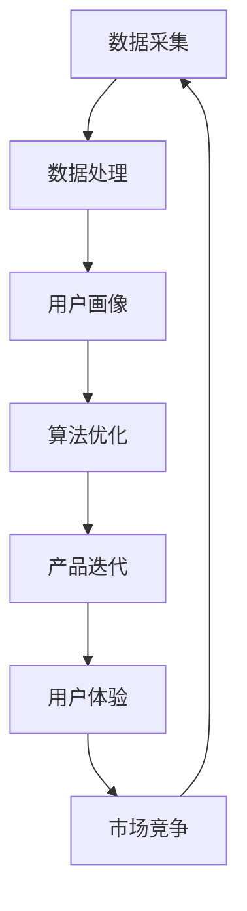

                 


# AI如何优化现有产品提升竞争力

> 关键词：人工智能，产品优化，竞争力提升，算法改进，数据驱动，用户体验，机器学习

> 摘要：本文将深入探讨如何运用人工智能技术优化现有产品，提高其市场竞争力和用户体验。通过详细的分析和案例，我们将展示如何从数据驱动、算法改进和用户体验等方面实现产品优化，为企业和开发者提供实用的技术指导。

## 1. 背景介绍

### 1.1 目的和范围

本文旨在探讨人工智能技术在产品优化中的应用，通过分析和实践案例，帮助企业和开发者理解如何利用人工智能提升产品的市场竞争力。文章将涉及以下几个主要方面：

- 数据驱动产品优化
- 算法改进与模型优化
- 用户体验提升
- 人工智能技术在产品优化中的实际应用案例

### 1.2 预期读者

本文适合以下读者群体：

- 产品经理和产品开发者
- 数据科学家和机器学习工程师
- 对人工智能和产品优化有兴趣的技术爱好者

### 1.3 文档结构概述

本文结构如下：

- 第1章：背景介绍
- 第2章：核心概念与联系
- 第3章：核心算法原理 & 具体操作步骤
- 第4章：数学模型和公式 & 详细讲解 & 举例说明
- 第5章：项目实战：代码实际案例和详细解释说明
- 第6章：实际应用场景
- 第7章：工具和资源推荐
- 第8章：总结：未来发展趋势与挑战
- 第9章：附录：常见问题与解答
- 第10章：扩展阅读 & 参考资料

### 1.4 术语表

#### 1.4.1 核心术语定义

- 人工智能（AI）：模拟人类智能行为的技术
- 数据驱动（Data-driven）：通过数据分析指导产品优化
- 算法（Algorithm）：解决问题的步骤和方法
- 用户画像（User Profiling）：根据用户行为数据构建的用户模型
- 用户体验（UX）：用户在使用产品过程中的感受和体验
- 机器学习（Machine Learning）：一种人工智能技术，使机器能够通过数据学习并做出决策

#### 1.4.2 相关概念解释

- 优化（Optimization）：寻找最佳解决方案的过程
- 竞争力（Competitiveness）：产品在市场上的竞争能力
- 产品迭代（Product Iteration）：产品不断更新和改进的过程

#### 1.4.3 缩略词列表

- AI：人工智能
- ML：机器学习
- UX：用户体验
- IDE：集成开发环境
- API：应用程序接口

## 2. 核心概念与联系

在讨论如何通过人工智能优化产品之前，我们首先需要了解几个核心概念及其相互关系。以下是一个Mermaid流程图，展示了这些核心概念之间的关系：



### 2.1 数据采集

数据采集是产品优化过程中的第一步，也是至关重要的一步。通过收集用户行为数据、市场数据和产品使用数据，我们可以获得关于产品表现的重要信息。

### 2.2 数据处理

收集到的数据需要进行清洗、预处理和分析，以便提取有用的信息和趋势。数据处理是数据驱动产品优化的基础。

### 2.3 用户画像

基于处理后的数据，我们可以构建用户画像，了解不同用户群体的特征和需求。用户画像有助于针对特定用户群体进行个性化推荐和产品优化。

### 2.4 算法优化

算法优化是提升产品竞争力的关键。通过改进算法，我们可以提高产品的响应速度、准确性和效率。

### 2.5 产品迭代

基于算法优化和用户反馈，产品迭代是一个持续的过程。通过不断优化产品，我们可以提高用户体验和市场竞争力。

### 2.6 用户体验

用户体验是产品优化的核心目标。通过提升用户体验，我们可以提高用户满意度和忠诚度。

### 2.7 市场竞争

市场竞争是产品优化的重要驱动力。通过提升产品竞争力，我们可以提高市场占有率，增加企业收入。

## 3. 核心算法原理 & 具体操作步骤

在了解了核心概念及其关系后，接下来我们将讨论如何运用机器学习算法优化现有产品。以下是一个简单的机器学习算法流程：

### 3.1 数据采集与预处理

```python
# 数据采集与预处理伪代码
data = collect_data()
cleaned_data = preprocess_data(data)
```

- `collect_data()`：收集用户行为数据、市场数据等产品相关的数据。
- `preprocess_data(data)`：清洗和预处理数据，如去除缺失值、异常值和处理不同数据类型。

### 3.2 特征工程

```python
# 特征工程伪代码
features = extract_features(cleaned_data)
```

- `extract_features(cleaned_data)`：提取特征，如用户年龄、性别、购买历史等，有助于训练机器学习模型。

### 3.3 选择模型

```python
# 选择模型伪代码
model = select_model()
```

- `select_model()`：根据问题类型（分类、回归等）选择合适的机器学习模型，如决策树、随机森林、支持向量机等。

### 3.4 训练模型

```python
# 训练模型伪代码
model = train_model(model, features)
```

- `train_model(model, features)`：使用训练集对选定的模型进行训练。

### 3.5 模型评估与优化

```python
# 模型评估与优化伪代码
evaluate_model(model)
optimize_model(model)
```

- `evaluate_model(model)`：评估模型性能，如准确率、召回率等。
- `optimize_model(model)`：根据评估结果调整模型参数，提高性能。

### 3.6 应用模型

```python
# 应用模型伪代码
predictions = apply_model(model, new_data)
```

- `apply_model(model, new_data)`：使用训练好的模型对新数据（如用户行为数据）进行预测。

## 4. 数学模型和公式 & 详细讲解 & 举例说明

在机器学习算法中，数学模型和公式起着关键作用。以下是一个简单的线性回归模型，用于预测用户购买概率。

### 4.1 线性回归模型

线性回归模型公式为：

$$
y = \beta_0 + \beta_1x
$$

其中，$y$ 为预测的购买概率，$\beta_0$ 为截距，$\beta_1$ 为斜率，$x$ 为特征值。

### 4.2 模型训练

线性回归模型训练过程可以通过以下公式实现：

$$
\beta_0, \beta_1 = \arg\min_{\beta_0, \beta_1} \sum_{i=1}^{n} (y_i - (\beta_0 + \beta_1x_i))^2
$$

其中，$n$ 为数据样本数量。

### 4.3 模型评估

线性回归模型评估可以通过均方误差（MSE）实现：

$$
MSE = \frac{1}{n} \sum_{i=1}^{n} (y_i - (\beta_0 + \beta_1x_i))^2
$$

### 4.4 举例说明

假设我们有以下数据集：

| 用户ID | 年龄 | 购买历史 | 预测购买概率 |
| ------ | ---- | -------- | ------------ |
| 1      | 25   | 3次       | 0.8          |
| 2      | 30   | 1次       | 0.6          |
| 3      | 22   | 5次       | 0.9          |

我们可以使用线性回归模型预测新用户的购买概率。首先，我们需要对数据进行特征工程，提取年龄和购买历史作为特征。然后，使用训练集训练线性回归模型，并使用测试集进行评估。最后，使用训练好的模型预测新用户的购买概率。

## 5. 项目实战：代码实际案例和详细解释说明

### 5.1 开发环境搭建

在开始项目实战之前，我们需要搭建开发环境。以下是一个简单的Python环境搭建步骤：

1. 安装Python（3.8及以上版本）
2. 安装Jupyter Notebook
3. 安装必要的库，如NumPy、Pandas、Scikit-learn等

### 5.2 源代码详细实现和代码解读

以下是一个简单的用户购买预测项目的代码实现：

```python
import numpy as np
import pandas as pd
from sklearn.model_selection import train_test_split
from sklearn.linear_model import LinearRegression
from sklearn.metrics import mean_squared_error

# 5.2.1 数据采集与预处理
def collect_and_preprocess_data():
    data = pd.read_csv('user_data.csv')
    data.drop(['user_id'], axis=1, inplace=True)
    data.fillna(data.mean(), inplace=True)
    return data

# 5.2.2 特征工程
def extract_features(data):
    features = data[['age', 'purchase_history']]
    return features

# 5.2.3 模型训练
def train_model(X, y):
    model = LinearRegression()
    model.fit(X, y)
    return model

# 5.2.4 模型评估
def evaluate_model(model, X_test, y_test):
    predictions = model.predict(X_test)
    mse = mean_squared_error(y_test, predictions)
    return mse

# 5.2.5 应用模型
def apply_model(model, X_new):
    predictions = model.predict(X_new)
    return predictions

# 主程序
if __name__ == '__main__':
    data = collect_and_preprocess_data()
    features = extract_features(data)
    X = features
    y = data['predicted_purchase_probability']
    X_train, X_test, y_train, y_test = train_test_split(X, y, test_size=0.2, random_state=42)
    model = train_model(X_train, y_train)
    mse = evaluate_model(model, X_test, y_test)
    print(f'Mean Squared Error: {mse}')
    new_data = np.array([[25, 3], [30, 1], [22, 5]])
    predictions = apply_model(model, new_data)
    print(f'Predicted Purchase Probabilities: {predictions}')
```

### 5.3 代码解读与分析

- `collect_and_preprocess_data()`：该函数负责采集和预处理用户数据，如删除不必要的列、填充缺失值等。
- `extract_features(data)`：该函数提取用户数据的特征，如年龄和购买历史。
- `train_model(X, y)`：该函数使用训练数据训练线性回归模型。
- `evaluate_model(model, X_test, y_test)`：该函数评估模型的性能，计算均方误差。
- `apply_model(model, X_new)`：该函数使用训练好的模型预测新用户的购买概率。

通过这个简单的项目，我们可以看到如何使用Python和机器学习库（如Scikit-learn）实现用户购买预测。这个项目可以作为一个起点，进一步扩展和改进，以适应更复杂的需求。

## 6. 实际应用场景

### 6.1 零售业

在零售业中，人工智能技术可以帮助企业了解用户需求，优化库存管理和推荐系统。例如，通过分析用户购买历史和偏好，企业可以更准确地预测哪些商品可能受欢迎，从而减少库存积压和过剩。

### 6.2 金融行业

金融行业可以利用人工智能技术进行风险评估、欺诈检测和个性化投资建议。例如，通过分析客户的交易数据和信用记录，银行可以更准确地评估贷款申请者的信用风险，降低坏账率。

### 6.3 医疗保健

在医疗保健领域，人工智能可以帮助提高诊断准确性、优化治疗计划和改善患者管理。例如，通过分析患者的病历和基因组数据，医生可以更准确地诊断疾病，并制定个性化的治疗方案。

### 6.4 教育行业

教育行业可以利用人工智能技术个性化教学和评估学生学习效果。例如，通过分析学生的学习行为和成绩，教师可以提供更有针对性的教学计划和辅导。

### 6.5 制造业

在制造业中，人工智能可以帮助优化生产流程、预测设备维护和优化供应链。例如，通过分析生产数据，企业可以更准确地预测设备故障，提前进行维护，减少停机时间。

## 7. 工具和资源推荐

### 7.1 学习资源推荐

#### 7.1.1 书籍推荐

- 《Python机器学习》（作者：塞巴斯蒂安·拉斯克）
- 《深度学习》（作者：伊恩·古德费洛、约书亚·本吉奥、亚伦·库维尔）
- 《人工智能：一种现代方法》（作者：斯图尔特·罗素、彼得·诺维格）

#### 7.1.2 在线课程

- Coursera的《机器学习》课程
- edX的《深度学习导论》课程
- Udacity的《人工智能工程师纳米学位》课程

#### 7.1.3 技术博客和网站

- Medium上的AI博客
- arXiv.org上的最新研究成果
- AIqus.com上的技术文章和案例分析

### 7.2 开发工具框架推荐

#### 7.2.1 IDE和编辑器

- Jupyter Notebook
- PyCharm
- VS Code

#### 7.2.2 调试和性能分析工具

- Python的pdb
- VS Code的调试工具
- TensorBoard

#### 7.2.3 相关框架和库

- Scikit-learn
- TensorFlow
- PyTorch

### 7.3 相关论文著作推荐

#### 7.3.1 经典论文

- "A Mathematical Theory of Communication"（香农）
- "Learning to Represent Chemicalolecules for Drug Discovery"（Johnson et al.）
- "A Few Useful Things to Know About Machine Learning"（Bengio等）

#### 7.3.2 最新研究成果

- "Deep Learning for Natural Language Processing"（Yoon et al.）
- "Self-Supervised Learning for Audio Classification"（Yao等）
- "Generative Adversarial Networks"（Goodfellow et al.）

#### 7.3.3 应用案例分析

- "Google Brain's AI: Decentralized Learning"（Google Brain团队）
- "Deep Learning for Autonomous Driving"（百度Apollo）
- "AI in Healthcare: Revolutionizing Patient Care"（IBM Watson）

## 8. 总结：未来发展趋势与挑战

在未来，人工智能将在更多领域得到广泛应用，从医疗保健到教育，从制造业到金融服务。以下是一些未来发展趋势和挑战：

### 8.1 发展趋势

- 数据量的爆发式增长：随着传感器、移动设备和物联网的普及，数据量将持续增长，为人工智能提供更多训练数据。
- 人工智能算法的进步：深度学习、强化学习和迁移学习等算法将继续发展，提高模型的性能和泛化能力。
- 个性化推荐和用户体验优化：人工智能技术将帮助产品更好地满足用户需求，提高用户体验。

### 8.2 挑战

- 数据隐私和安全：在数据驱动的人工智能时代，数据隐私和安全是一个重要挑战。企业需要确保用户数据的保密性和安全性。
- 人工智能伦理：人工智能技术的快速发展引发了对伦理问题的关注，如算法偏见、透明度和责任分配等。
- 技术普及与人才培养：随着人工智能技术的普及，对相关人才的需求也将增加。然而，现有的人才储备和教育培训体系可能无法满足这一需求。

## 9. 附录：常见问题与解答

### 9.1 机器学习算法有哪些？

常见的机器学习算法包括线性回归、决策树、支持向量机、随机森林、神经网络等。

### 9.2 什么是数据驱动产品优化？

数据驱动产品优化是指通过收集和分析用户数据，指导产品设计和改进，以提高用户体验和市场竞争力的过程。

### 9.3 如何评估机器学习模型的性能？

常用的评估指标包括准确率、召回率、F1分数、均方误差等。

### 9.4 人工智能技术在哪些领域有广泛应用？

人工智能技术在零售、金融、医疗、教育、制造业等领域都有广泛应用。

## 10. 扩展阅读 & 参考资料

- [Coursera](https://www.coursera.org/)
- [edX](https://www.edx.org/)
- [Udacity](https://www.udacity.com/)
- [Medium](https://medium.com/)
- [arXiv.org](https://arxiv.org/)
- [AIqus.com](https://aiqus.com/)
- [Google Brain](https://ai.google/research/)
- [IBM Watson](https://www.ibm.com/watson/)
- [百度Apollo](https://apollo.auto/)

