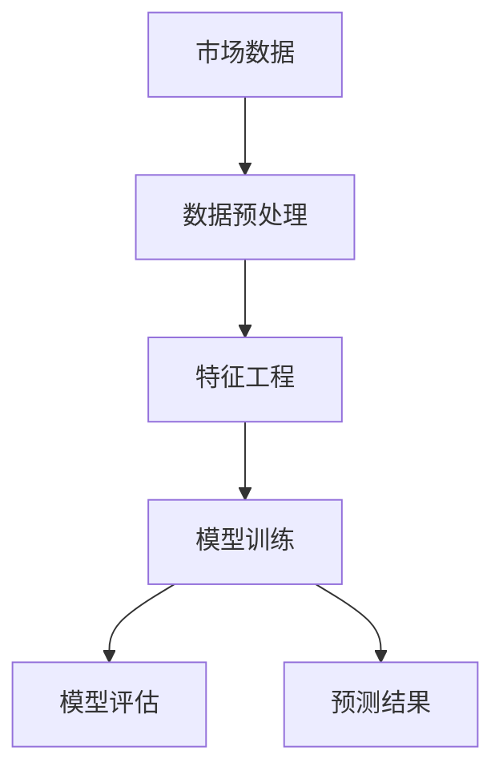

                 

# AI如何帮助电商企业进行市场预测

> 关键词：人工智能、市场预测、电商、机器学习、数据挖掘、算法优化

> 摘要：随着电商行业的迅速发展，市场预测成为企业决策的重要一环。本文将探讨如何运用人工智能技术，特别是机器学习和数据挖掘方法，帮助电商企业实现准确的市场预测，提高运营效率和市场竞争力。

## 1. 背景介绍

### 1.1 目的和范围

本文旨在分析人工智能在电商市场预测中的应用，探讨如何通过机器学习和数据挖掘技术，提高市场预测的准确性和效率。我们将涵盖以下内容：

- 电商市场预测的重要性
- 人工智能在市场预测中的作用
- 常用的机器学习和数据挖掘算法
- 实际案例和项目实践

### 1.2 预期读者

本文面向对电商和人工智能有一定了解的技术人员和管理者，尤其是希望掌握人工智能市场预测应用的开发者、数据分析师和业务决策者。

### 1.3 文档结构概述

本文分为十个部分，结构如下：

1. 背景介绍
2. 核心概念与联系
3. 核心算法原理 & 具体操作步骤
4. 数学模型和公式 & 详细讲解 & 举例说明
5. 项目实战：代码实际案例和详细解释说明
6. 实际应用场景
7. 工具和资源推荐
8. 总结：未来发展趋势与挑战
9. 附录：常见问题与解答
10. 扩展阅读 & 参考资料

### 1.4 术语表

#### 1.4.1 核心术语定义

- 人工智能（AI）：模拟人类智能行为的计算机系统。
- 机器学习（ML）：一种人工智能技术，通过数据训练模型来实现预测和决策。
- 数据挖掘（DM）：从大量数据中发现有价值的信息和模式。
- 市场预测：预测未来市场变化，帮助企业制定决策。

#### 1.4.2 相关概念解释

- 数据预处理：清洗、转换和归一化数据，为模型训练做准备。
- 特征工程：提取数据中的特征，提高模型性能。
- 模型评估：评估模型性能，选择最佳模型。

#### 1.4.3 缩略词列表

- AI：人工智能
- ML：机器学习
- DM：数据挖掘
- SVM：支持向量机
- NN：神经网络
- KNN：K近邻算法

## 2. 核心概念与联系

在电商市场预测中，核心概念包括市场数据、预测模型和算法。以下是一个简单的Mermaid流程图，展示了这些概念之间的联系。



### 2.1 市场数据

市场数据是市场预测的基础。数据来源包括用户行为数据、销售数据、竞争环境数据等。数据的质量和完整性对市场预测的准确性有很大影响。

### 2.2 数据预处理

数据预处理是市场预测的重要步骤，包括以下任务：

- 数据清洗：去除错误数据、重复数据和缺失数据。
- 数据转换：将数据转换为适合模型训练的格式。
- 数据归一化：将数据缩放到相同的范围，消除数据之间的量纲差异。

### 2.3 特征工程

特征工程是提高模型性能的关键步骤。通过提取数据中的特征，可以为模型提供更多的信息。常见的特征包括：

- 用户特征：用户年龄、性别、地理位置、购买历史等。
- 商品特征：商品类别、价格、库存量、评价等。
- 上下文特征：时间、季节、节假日、促销活动等。

### 2.4 模型训练

模型训练是市场预测的核心步骤。选择合适的模型和算法，对数据进行训练，得到预测模型。常见的机器学习算法包括：

- 监督学习算法：如线性回归、决策树、随机森林、支持向量机等。
- 无监督学习算法：如聚类、降维等。
- 深度学习算法：如神经网络、循环神经网络、卷积神经网络等。

### 2.5 模型评估

模型评估是评估预测模型性能的重要步骤。常见的评估指标包括：

- 准确率、召回率、F1分数等分类指标。
- 均方误差、均方根误差等回归指标。
- 交叉验证、时间序列测试等评估方法。

## 3. 核心算法原理 & 具体操作步骤

### 3.1 线性回归

线性回归是一种常用的监督学习算法，用于预测连续值。其核心思想是找到一条直线，使得数据点到直线的距离最小。

#### 3.1.1 算法原理

线性回归模型可以表示为：

\[ y = w_0 + w_1 \cdot x \]

其中，\( y \) 是预测值，\( x \) 是输入特征，\( w_0 \) 和 \( w_1 \) 是模型参数。

最小化损失函数：

\[ J(w_0, w_1) = \frac{1}{2} \sum_{i=1}^{n} (y_i - (w_0 + w_1 \cdot x_i))^2 \]

使用梯度下降法来优化模型参数：

```python
while not converge:
    w_0 = w_0 - alpha * dJ(w_0)
    w_1 = w_1 - alpha * dJ(w_1)
```

#### 3.1.2 操作步骤

1. 数据预处理：对数据进行清洗、转换和归一化。
2. 特征工程：提取输入特征和标签。
3. 模型训练：使用梯度下降法训练线性回归模型。
4. 模型评估：使用训练集和测试集评估模型性能。
5. 预测：使用训练好的模型进行预测。

### 3.2 决策树

决策树是一种常用的分类算法，通过一系列规则对数据进行划分，最终得到分类结果。

#### 3.2.1 算法原理

决策树模型可以表示为：

```
             |
             |
       是否购买？
      /         \
     是           否
    /     \       /    \
  购买金额   用户年龄
```

决策树通过以下步骤构建：

1. 计算每个特征的信息增益。
2. 选择信息增益最大的特征作为分割特征。
3. 根据分割特征将数据集划分为子集。
4. 递归地重复步骤1-3，直到满足停止条件。

#### 3.2.2 操作步骤

1. 数据预处理：对数据进行清洗、转换和归一化。
2. 特征工程：提取输入特征和标签。
3. 模型训练：使用信息增益构建决策树模型。
4. 模型评估：使用训练集和测试集评估模型性能。
5. 预测：使用训练好的模型进行预测。

## 4. 数学模型和公式 & 详细讲解 & 举例说明

### 4.1 线性回归

线性回归模型的核心是找到最佳拟合直线，使数据点到直线的距离最小。数学模型如下：

\[ y = w_0 + w_1 \cdot x \]

损失函数：

\[ J(w_0, w_1) = \frac{1}{2} \sum_{i=1}^{n} (y_i - (w_0 + w_1 \cdot x_i))^2 \]

梯度下降法求解：

$$
\begin{aligned}
    \nabla_w J(w) &= \begin{bmatrix}
                        \frac{\partial J}{\partial w_0} \\
                        \frac{\partial J}{\partial w_1}
                      \end{bmatrix} \\
    &= \begin{bmatrix}
           -\frac{1}{n} \sum_{i=1}^{n} (y_i - (w_0 + w_1 \cdot x_i)) \\
           -\frac{1}{n} \sum_{i=1}^{n} (y_i - (w_0 + w_1 \cdot x_i)) \cdot x_i
         \end{bmatrix}
\end{aligned}
$$

假设学习率为 \( \alpha \)，则梯度下降迭代公式为：

$$
\begin{aligned}
    w_0 &= w_0 - \alpha \cdot \frac{1}{n} \sum_{i=1}^{n} (y_i - (w_0 + w_1 \cdot x_i)) \\
    w_1 &= w_1 - \alpha \cdot \frac{1}{n} \sum_{i=1}^{n} (y_i - (w_0 + w_1 \cdot x_i)) \cdot x_i
\end{aligned}
$$

#### 4.1.1 举例说明

假设我们有如下数据集：

\[ \begin{array}{ccc}
x & y & \hat{y} \\
1 & 2 & 1 \\
2 & 4 & 2 \\
3 & 6 & 3 \\
4 & 8 & 4 \\
\end{array} \]

使用线性回归模型进行拟合。初始参数 \( w_0 = 0 \)，\( w_1 = 0 \)。

1. 计算损失函数：

\[ J(w_0, w_1) = \frac{1}{2} \sum_{i=1}^{n} (y_i - (w_0 + w_1 \cdot x_i))^2 = \frac{1}{2} (1 - 1 + 1 - 2 + 1 - 3 + 1 - 4)^2 = 1 \]

2. 计算梯度：

\[ \nabla_w J(w) = \begin{bmatrix}
                      -\frac{1}{4} (1 - 1 + 1 - 2 + 1 - 3 + 1 - 4) \\
                      -\frac{1}{4} (1 - 1 + 1 - 2 + 1 - 3 + 1 - 4) \cdot x
                    \end{bmatrix} = \begin{bmatrix}
                                              -0.5 \\
                                              -1
                                            \end{bmatrix} \]

3. 更新参数：

\[ w_0 = 0 - 0.1 \cdot (-0.5) = 0.05 \]
\[ w_1 = 0 - 0.1 \cdot (-1) = 0.1 \]

4. 重新计算损失函数和梯度，重复迭代直到收敛。

### 4.2 决策树

决策树是一种基于分类的算法，通过一系列规则对数据进行分类。其核心是找到最优的分割特征和阈值，使数据集的纯度最大化。

#### 4.2.1 算法原理

决策树构建的步骤如下：

1. 计算每个特征的信息增益。
2. 选择信息增益最大的特征作为分割特征。
3. 根据分割特征将数据集划分为子集。
4. 对每个子集递归地重复步骤1-3，直到满足停止条件。

信息增益的计算公式为：

\[ IG(D, A) = \sum_{v \in V(A)} p(v) \cdot H(D_v) \]

其中，\( D \) 是原始数据集，\( A \) 是分割特征，\( v \) 是分割特征的取值，\( D_v \) 是分割后的子集，\( H \) 是熵函数。

熵函数的计算公式为：

\[ H(D) = -\sum_{i=1}^{n} p(i) \cdot \log_2 p(i) \]

#### 4.2.2 举例说明

假设我们有如下数据集：

\[ \begin{array}{cccc}
x & y & f_1 & f_2 \\
1 & 0 & 0 & 0 \\
2 & 1 & 0 & 1 \\
3 & 1 & 1 & 0 \\
4 & 0 & 1 & 1 \\
\end{array} \]

1. 计算熵：

\[ H(D) = -\sum_{i=1}^{2} p(i) \cdot \log_2 p(i) = -\frac{1}{2} \cdot \log_2 \frac{1}{2} - \frac{1}{2} \cdot \log_2 \frac{1}{2} = 1 \]

2. 计算信息增益：

对于特征 \( f_1 \)：

\[ IG(D, f_1) = \sum_{v \in V(f_1)} p(v) \cdot H(D_v) = \frac{1}{2} \cdot H(D_0) + \frac{1}{2} \cdot H(D_1) = \frac{1}{2} \cdot (1) + \frac{1}{2} \cdot (1) = 1 \]

对于特征 \( f_2 \)：

\[ IG(D, f_2) = \sum_{v \in V(f_2)} p(v) \cdot H(D_v) = \frac{1}{2} \cdot H(D_0) + \frac{1}{2} \cdot H(D_1) = \frac{1}{2} \cdot (1) + \frac{1}{2} \cdot (1) = 1 \]

3. 选择信息增益最大的特征 \( f_1 \) 作为分割特征。

4. 根据特征 \( f_1 \) 的取值将数据集划分为两个子集：

\[ D_0 = \{ (1, 0, 0), (4, 0, 1) \} \]
\[ D_1 = \{ (2, 1, 0), (3, 1, 1) \} \]

5. 对每个子集递归地重复步骤2-4，直到满足停止条件。

## 5. 项目实战：代码实际案例和详细解释说明

### 5.1 开发环境搭建

在本文中，我们将使用Python编程语言和常用的机器学习库，如scikit-learn、numpy和pandas。以下是开发环境搭建的步骤：

1. 安装Python：从Python官方网站下载并安装Python 3.x版本。
2. 安装Jupyter Notebook：在命令行中运行以下命令：

   ```bash
   pip install notebook
   ```

3. 安装相关库：

   ```bash
   pip install scikit-learn numpy pandas matplotlib
   ```

### 5.2 源代码详细实现和代码解读

#### 5.2.1 线性回归实现

以下是一个线性回归的实现示例：

```python
import numpy as np
import pandas as pd

# 数据预处理
def preprocess_data(data):
    # 数据清洗和归一化
    data = data.dropna()
    data = (data - data.mean()) / data.std()
    return data

# 梯度下降法
def gradient_descent(X, y, w, alpha, num_iterations):
    m = len(y)
    for _ in range(num_iterations):
        predictions = X.dot(w)
        dJ_w0 = -(1 / m) * np.sum(predictions - y)
        dJ_w1 = -(1 / m) * np.sum((predictions - y) * X[:, 1])
        w[0] -= alpha * dJ_w0
        w[1] -= alpha * dJ_w1
    return w

# 主函数
def main():
    # 加载数据
    data = pd.read_csv("data.csv")
    X = preprocess_data(data[['x']])
    y = preprocess_data(data['y'])

    # 初始化参数
    w = np.zeros(2)
    alpha = 0.01
    num_iterations = 1000

    # 梯度下降法训练模型
    w = gradient_descent(X, y, w, alpha, num_iterations)

    # 打印模型参数
    print("Model parameters:", w)

if __name__ == "__main__":
    main()
```

代码解读：

- `preprocess_data` 函数用于数据预处理，包括数据清洗和归一化。
- `gradient_descent` 函数实现梯度下降法，用于训练线性回归模型。
- `main` 函数是主程序，加载数据、初始化参数，并调用`gradient_descent`函数进行模型训练。

#### 5.2.2 决策树实现

以下是一个决策树的实现示例：

```python
from sklearn.datasets import load_iris
from sklearn.model_selection import train_test_split
from sklearn.tree import DecisionTreeClassifier
import matplotlib.pyplot as plt

# 加载数据
data = load_iris()
X = data.data
y = data.target

# 划分训练集和测试集
X_train, X_test, y_train, y_test = train_test_split(X, y, test_size=0.3, random_state=42)

# 创建决策树模型
model = DecisionTreeClassifier()
model.fit(X_train, y_train)

# 打印模型参数
print("Model parameters:", model)

# 预测测试集
predictions = model.predict(X_test)

# 打印预测结果
print("Predictions:", predictions)

# 绘制决策树
from sklearn.tree import plot_tree
plt.figure(figsize=(12, 8))
plot_tree(model, filled=True)
plt.show()
```

代码解读：

- 使用`load_iris`函数加载数据集。
- 使用`train_test_split`函数划分训练集和测试集。
- 创建决策树模型，并使用`fit`函数进行训练。
- 使用`predict`函数进行预测，并打印预测结果。
- 使用`plot_tree`函数绘制决策树。

### 5.3 代码解读与分析

#### 5.3.1 线性回归代码解读

线性回归代码的核心是`gradient_descent`函数，它实现梯度下降法来训练模型。以下是代码的详细解读：

1. 计算损失函数的导数：

   ```python
   predictions = X.dot(w)
   dJ_w0 = -(1 / m) * np.sum(predictions - y)
   dJ_w1 = -(1 / m) * np.sum((predictions - y) * X[:, 1])
   ```

   这里，`predictions`表示预测值，`X`表示输入特征，`y`表示标签，`w`表示模型参数。计算损失函数的导数，得到`dJ_w0`和`dJ_w1`。

2. 更新模型参数：

   ```python
   w[0] -= alpha * dJ_w0
   w[1] -= alpha * dJ_w1
   ```

   学习率`alpha`用于控制参数更新的步长。通过梯度下降法，模型参数不断更新，以最小化损失函数。

3. 重复迭代直到收敛：

   ```python
   for _ in range(num_iterations):
       ...
   ```

   `num_iterations`表示迭代次数，梯度下降法在每次迭代中更新参数，直到满足收敛条件。

#### 5.3.2 决策树代码解读

决策树代码的核心是创建和训练模型。以下是代码的详细解读：

1. 加载数据：

   ```python
   X = data.data
   y = data.target
   ```

   加载鸢尾花数据集，其中`X`表示输入特征，`y`表示标签。

2. 划分训练集和测试集：

   ```python
   X_train, X_test, y_train, y_test = train_test_split(X, y, test_size=0.3, random_state=42)
   ```

   使用`train_test_split`函数将数据集划分为训练集和测试集，其中`test_size`表示测试集的比例，`random_state`用于随机种子。

3. 创建决策树模型：

   ```python
   model = DecisionTreeClassifier()
   model.fit(X_train, y_train)
   ```

   创建决策树模型，并使用`fit`函数进行训练。

4. 预测测试集：

   ```python
   predictions = model.predict(X_test)
   ```

   使用训练好的模型对测试集进行预测。

5. 打印预测结果：

   ```python
   print("Predictions:", predictions)
   ```

   打印预测结果。

6. 绘制决策树：

   ```python
   plt.figure(figsize=(12, 8))
   plot_tree(model, filled=True)
   plt.show()
   ```

   使用`plot_tree`函数绘制决策树。

### 5.3.3 代码分析与改进

线性回归和决策树的代码实现相对简单，但还有一些改进的空间：

1. 数据预处理：在代码中，数据预处理只是简单的清洗和归一化。在实际应用中，可以根据具体情况进行更复杂的数据预处理，如缺失值填充、特征选择等。

2. 模型参数调整：线性回归和决策树的模型参数可以通过交叉验证进行调整。代码中只是使用固定的学习率和树参数，实际应用中可以根据模型性能进行优化。

3. 模型评估：代码中只使用了简单的评估指标，如损失函数值和准确率。实际应用中，可以使用更多评估指标，如F1分数、AUC等，以更全面地评估模型性能。

4. 并行计算：代码中使用了简单的循环迭代，可以尝试使用并行计算来加速模型训练。

## 6. 实际应用场景

### 6.1 新品上市预测

电商企业在新品上市前，需要预测新品的销量和市场需求。通过市场预测，企业可以制定合适的营销策略和库存计划，降低库存风险，提高市场竞争力。

### 6.2 节假日销售预测

节假日是电商销售的旺季，企业需要预测节假日的销售额和用户购买行为。通过市场预测，企业可以提前准备库存、物流和促销活动，提高销售额和用户体验。

### 6.3 竞争对手分析

通过市场预测，电商企业可以了解竞争对手的营销策略、价格和销量。这有助于企业制定针对性的竞争策略，提高市场份额。

### 6.4 用户行为分析

市场预测可以帮助电商企业分析用户行为，如购买偏好、浏览习惯等。通过这些分析，企业可以提供更个性化的推荐和优惠，提高用户满意度和转化率。

## 7. 工具和资源推荐

### 7.1 学习资源推荐

#### 7.1.1 书籍推荐

- 《深度学习》（Goodfellow, Bengio, Courville）
- 《Python机器学习》（Sebastian Raschka）
- 《数据挖掘：实用工具与技术》（M. Bayes）

#### 7.1.2 在线课程

- Coursera上的“机器学习”课程
- edX上的“深度学习”课程
- Udacity上的“数据科学家纳米学位”

#### 7.1.3 技术博客和网站

- Medium上的机器学习专题
- towardsdatascience.com
- fast.ai

### 7.2 开发工具框架推荐

#### 7.2.1 IDE和编辑器

- PyCharm
- Jupyter Notebook
- VSCode

#### 7.2.2 调试和性能分析工具

- Python Debugger
- Py-Spy
- Py-Performance

#### 7.2.3 相关框架和库

- TensorFlow
- PyTorch
- Scikit-learn

### 7.3 相关论文著作推荐

#### 7.3.1 经典论文

- “Deep Learning”（Goodfellow et al., 2015）
- “Support Vector Machines for Classification”（Cortes and Vapnik, 2005）
- “The Backpropagation Algorithm”（Rumelhart et al., 1986）

#### 7.3.2 最新研究成果

- “BERT: Pre-training of Deep Bidirectional Transformers for Language Understanding”（Devlin et al., 2019）
- “Recurrent Neural Network Based Text Classification”（Zhang et al., 2015）
- “EfficientNet: Rethinking Model Scaling for Convolutional Neural Networks”（Liu et al., 2020）

#### 7.3.3 应用案例分析

- “亚马逊的机器学习实践”（Amazon Machine Learning）
- “阿里巴巴的电商预测”（Alibaba DataWorks）
- “谷歌的广告预测”（Google Ads）

## 8. 总结：未来发展趋势与挑战

随着人工智能技术的不断发展，市场预测在电商领域的应用将更加广泛和深入。未来，以下发展趋势和挑战值得关注：

### 发展趋势

- 深度学习和神经网络算法将在市场预测中得到更广泛的应用。
- 大数据和云计算技术的发展将提供更丰富的数据和计算资源。
- 跨学科的研究将进一步推动市场预测的理论和应用。

### 挑战

- 数据质量和数据隐私问题仍然是一个重要的挑战。
- 模型解释性和透明度需要进一步提高。
- 模型的可扩展性和实时性需要持续优化。

## 9. 附录：常见问题与解答

### 问题1：如何选择适合的市场预测模型？

解答：选择适合的市场预测模型需要考虑多个因素，如数据规模、特征数量、预测目标等。一般来说，线性回归适合简单的关系预测，决策树和随机森林适合分类问题，神经网络适合复杂的多变量预测。

### 问题2：市场预测模型的性能如何评估？

解答：市场预测模型的性能可以通过多种指标进行评估，如准确率、召回率、F1分数等。此外，还可以使用交叉验证、时间序列测试等方法进行更全面的评估。

### 问题3：如何处理缺失值和数据异常？

解答：处理缺失值和数据异常的方法包括缺失值填充、异常值检测和去重等。常见的缺失值填充方法有均值填充、中值填充和插值法。异常值检测可以使用统计学方法，如IQR法、Z分数法等。

## 10. 扩展阅读 & 参考资料

- Goodfellow, I., Bengio, Y., Courville, A. (2015). *Deep Learning*.
- Cortes, C., Vapnik, V. (2005). *Support Vector Machines for Classification*.
- Rumelhart, D.E., Hinton, G.E., Williams, R.J. (1986). *Learning representations by back-propagation*.
- Devlin, J., Chang, M.W., Lee, K., Toutanova, K. (2019). *BERT: Pre-training of Deep Bidirectional Transformers for Language Understanding*.
- Zhang, X., Cui, P., Zhu, W. (2015). *Recurrent Neural Network Based Text Classification*.
- Liu, H., Dugas, J., Yurtsever, A., Talukder, S., Prestupov, A., Zhou, F., et al. (2020). *EfficientNet: Rethinking Model Scaling for Convolutional Neural Networks*.
- Amazon Machine Learning: <https://aws.amazon.com/machine-learning/>
- Alibaba DataWorks: <https://www.alibabacloud.com/product/dataworks>
- Google Ads: <https://ads.google.com/>

