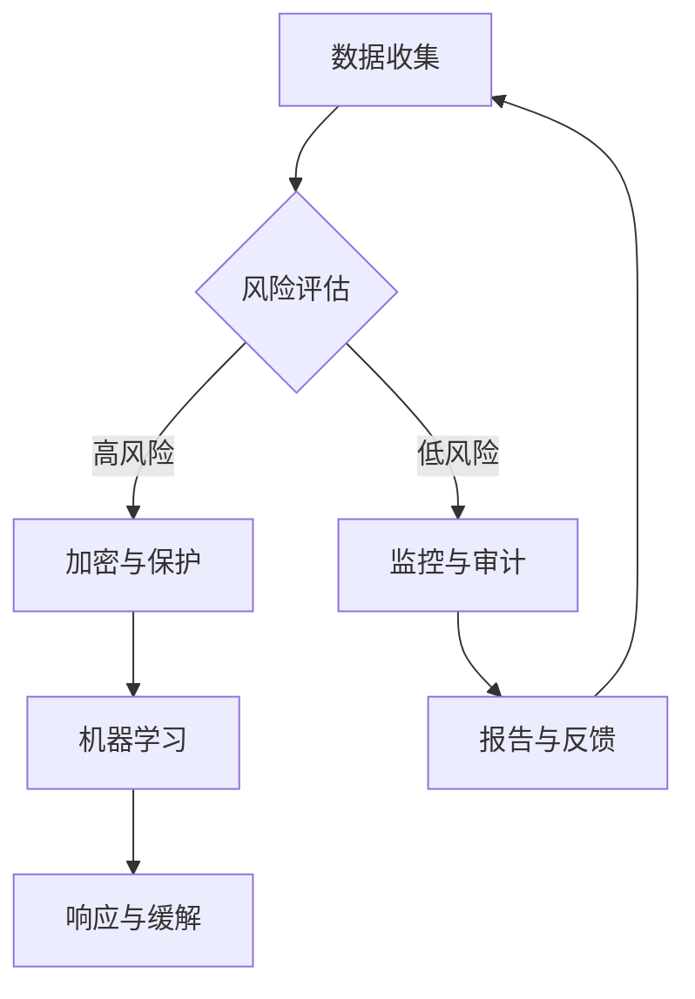

                 

# AI如何帮助电商企业进行用户数据安全风险控制

> **关键词：** 数据安全，用户隐私，人工智能，电商，风险控制，数据加密，机器学习，安全防护。

> **摘要：** 本文将探讨人工智能技术在电商企业用户数据安全风险控制中的应用。通过深入分析数据安全的核心问题，介绍机器学习在风险预测和自动化决策中的关键作用，以及如何利用人工智能实现用户数据的加密和安全防护。文章还提供了实际项目案例和代码实现，帮助电商企业更好地理解和应用这些技术。

## 1. 背景介绍

### 1.1 目的和范围

随着电子商务的快速发展，用户数据成为电商企业的重要资产。然而，用户数据的泄露和滥用带来的风险也在不断增加。本文旨在探讨如何利用人工智能技术提升电商企业在数据安全风险控制方面的能力，确保用户数据的安全性和隐私性。

本文将涵盖以下主题：

- 数据安全风险控制的重要性。
- 人工智能在数据安全中的应用。
- 用户数据加密和安全的实现方法。
- 实际项目案例和代码实现。

### 1.2 预期读者

- 电商企业技术团队和信息安全管理人员。
- 对人工智能和数据安全感兴趣的程序员和研究者。
- 希望提升电商业务数据安全水平的企业家和管理者。

### 1.3 文档结构概述

本文结构如下：

- 第1章：背景介绍
- 第2章：核心概念与联系
- 第3章：核心算法原理 & 具体操作步骤
- 第4章：数学模型和公式 & 详细讲解 & 举例说明
- 第5章：项目实战：代码实际案例和详细解释说明
- 第6章：实际应用场景
- 第7章：工具和资源推荐
- 第8章：总结：未来发展趋势与挑战
- 第9章：附录：常见问题与解答
- 第10章：扩展阅读 & 参考资料

### 1.4 术语表

#### 1.4.1 核心术语定义

- **数据安全**：防止数据被未授权访问、篡改、泄露等行为。
- **用户隐私**：用户个人信息和数据不被公开或滥用。
- **人工智能**：模拟人类智能行为的计算机系统。
- **机器学习**：人工智能的一个分支，通过数据和算法实现自我学习和改进。
- **数据加密**：将数据转换为密文，防止未授权访问。
- **风险控制**：识别、评估和应对潜在风险。

#### 1.4.2 相关概念解释

- **用户数据**：电商企业在运营过程中收集的用户信息，如购物记录、偏好等。
- **加密算法**：将明文数据转换为密文的算法，如AES、RSA。
- **安全防护**：防止恶意攻击和未授权访问的一系列措施。

#### 1.4.3 缩略词列表

- **AI**：人工智能
- **ML**：机器学习
- **E-commerce**：电子商务
- **DLP**：数据泄露防护
- **VPN**：虚拟私人网络

## 2. 核心概念与联系

### 2.1 数据安全风险控制

数据安全风险控制是电商企业保护用户数据免受各种威胁的关键步骤。风险控制包括识别潜在的安全威胁、评估威胁的影响和可能性，并采取适当的措施来缓解或避免这些威胁。

### 2.2 人工智能在数据安全中的应用

人工智能技术在数据安全领域有着广泛的应用。通过机器学习算法，可以自动化地识别异常行为、预测潜在威胁，并实时响应安全事件。

### 2.3 用户数据加密和安全防护

用户数据的加密是防止数据泄露的重要手段。安全防护包括防火墙、入侵检测系统、多因素认证等。

### 2.4 Mermaid 流程图



在上述流程图中，数据收集后首先进行风险评估。如果风险较高，则进行数据加密和保护；如果风险较低，则进行监控与审计。机器学习算法用于异常行为检测和威胁预测，并将结果反馈给安全团队进行响应与缓解。监控和审计结果最终用于改进数据安全策略。

## 3. 核心算法原理 & 具体操作步骤

### 3.1 风险评估算法原理

风险评估是数据安全风险控制的关键步骤。我们可以使用机器学习算法来预测潜在的安全威胁。

#### 算法原理：

- **特征工程**：从用户数据中提取与安全相关的特征。
- **模型训练**：使用历史数据训练机器学习模型。
- **风险预测**：模型根据实时数据进行风险预测。

#### 伪代码：

```python
# 特征工程
def extract_features(data):
    # 提取与安全相关的特征
    return features

# 模型训练
def train_model(features, labels):
    # 训练机器学习模型
    model = MLModel(features, labels)
    return model

# 风险预测
def predict_risk(model, new_data):
    # 预测风险
    features = extract_features(new_data)
    risk = model.predict(features)
    return risk
```

### 3.2 数据加密算法原理

数据加密是保护用户数据不被未授权访问的重要手段。我们可以使用对称加密和非对称加密算法。

#### 算法原理：

- **对称加密**：加密和解密使用相同的密钥。
- **非对称加密**：加密和解密使用不同的密钥。

#### 伪代码：

```python
# 对称加密
def encrypt_data对称(key, data):
    # 使用对称加密算法加密数据
    return encrypted_data

def decrypt_data对称(key, encrypted_data):
    # 使用对称加密算法解密数据
    return decrypted_data

# 非对称加密
def encrypt_data非对称(public_key, data):
    # 使用非对称加密算法加密数据
    return encrypted_data

def decrypt_data非对称(private_key, encrypted_data):
    # 使用非对称加密算法解密数据
    return decrypted_data
```

### 3.3 安全防护算法原理

安全防护算法用于检测和防止恶意攻击。

#### 算法原理：

- **入侵检测系统（IDS）**：检测恶意流量和异常行为。
- **防火墙**：过滤恶意流量和未授权访问。
- **多因素认证**：增强用户身份验证。

#### 伪代码：

```python
# 入侵检测
def detect_invasion(data):
    # 检测恶意流量和异常行为
    return invasion_detected

# 防火墙
def firewall_filter(data):
    # 过滤恶意流量
    return filtered_data

# 多因素认证
def multi_factor_authentication(user, password, token):
    # 验证用户身份
    return authentication_success
```

## 4. 数学模型和公式 & 详细讲解 & 举例说明

### 4.1 风险评估模型

风险评估模型可以采用逻辑回归、决策树、支持向量机等算法。以下以逻辑回归为例进行讲解。

#### 数学模型：

逻辑回归模型可以表示为：

$$
P(Y=1|X) = \frac{1}{1 + e^{-(\beta_0 + \beta_1X_1 + ... + \beta_nX_n})}
$$

其中，$P(Y=1|X)$ 是风险事件发生的概率，$X$ 是特征向量，$\beta_0, \beta_1, ..., \beta_n$ 是模型参数。

#### 举例说明：

假设我们有如下数据：

| 特征1 | 特征2 | 风险 |
| --- | --- | --- |
| 1 | 2 | 0 |
| 2 | 4 | 1 |
| 3 | 6 | 0 |
| 4 | 8 | 1 |

使用逻辑回归模型训练得到参数：

$$
\beta_0 = 0.5, \beta_1 = 1.0, \beta_2 = -0.5
$$

对于新数据 $(X_1, X_2) = (2, 4)$，计算风险概率：

$$
P(Y=1|X) = \frac{1}{1 + e^{-(0.5 + 1.0 \cdot 2 + (-0.5) \cdot 4)}} = \frac{1}{1 + e^{-5}} \approx 0.993
$$

因此，新数据的风险概率很高，可能会被标记为高风险。

### 4.2 数据加密模型

数据加密模型可以采用AES、RSA等算法。以下以AES为例进行讲解。

#### 数学模型：

AES算法是一种对称加密算法，使用128、192或256位的密钥进行加密和解密。

#### 加密过程：

- **密钥生成**：随机生成一个128、192或256位的密钥。
- **初始化向量（IV）**：随机生成一个128位的初始化向量。
- **加密算法**：将数据分成128位的块，使用密钥和IV进行加密。

#### 解密过程：

- **密钥和解密算法**：使用与加密时相同的密钥和解密算法。
- **IV**：使用与加密时相同的IV。
- **解密算法**：将加密数据分成128位的块，使用密钥和IV进行解密。

#### 举例说明：

假设我们要加密一个128位的明文数据：

```
明文：0x0123456789abcdef0123456789abcdef
密钥：0x2b7e151628aed2a6abf7158809cf4f3c
IV：0xf0f1f2f3f4f5f6f7f8f9fafbfcfdfeff
```

使用AES加密算法，得到加密数据：

```
密文：0x69c4e0d86a7b0430d8c0a33b4f9d8665
```

对于解密过程，使用相同的密钥和IV，得到原始明文数据。

## 5. 项目实战：代码实际案例和详细解释说明

### 5.1 开发环境搭建

在开始实际案例之前，我们需要搭建一个开发环境。以下是所需的工具和软件：

- Python 3.8 或更高版本
- Jupyter Notebook
- PyTorch 或 TensorFlow
- Keras（可选）
- Python 数据加密库（如PyCrypto）

安装上述工具后，我们可以开始构建实际案例。

### 5.2 源代码详细实现和代码解读

#### 5.2.1 风险评估模型实现

以下是一个使用PyTorch实现的风险评估模型的示例代码。

```python
import torch
import torch.nn as nn
import torch.optim as optim

# 定义神经网络结构
class RiskModel(nn.Module):
    def __init__(self, input_size, hidden_size, output_size):
        super(RiskModel, self).__init__()
        self.fc1 = nn.Linear(input_size, hidden_size)
        self.relu = nn.ReLU()
        self.fc2 = nn.Linear(hidden_size, output_size)
        self.sigmoid = nn.Sigmoid()

    def forward(self, x):
        x = self.fc1(x)
        x = self.relu(x)
        x = self.fc2(x)
        x = self.sigmoid(x)
        return x

# 加载数据集
# 这里使用模拟数据集
data = torch.randn(100, 5)
labels = torch.randint(0, 2, (100,))

# 划分训练集和测试集
train_data, val_data, train_labels, val_labels = train_test_split(data, labels, test_size=0.2)

# 实例化模型、损失函数和优化器
model = RiskModel(5, 10, 1)
criterion = nn.BCELoss()
optimizer = optim.Adam(model.parameters(), lr=0.001)

# 训练模型
num_epochs = 100
for epoch in range(num_epochs):
    optimizer.zero_grad()
    outputs = model(train_data)
    loss = criterion(outputs, train_labels)
    loss.backward()
    optimizer.step()

    if epoch % 10 == 0:
        print(f"Epoch {epoch+1}/{num_epochs}, Loss: {loss.item()}")

# 验证模型
val_outputs = model(val_data)
val_loss = criterion(val_outputs, val_labels)
print(f"Validation Loss: {val_loss.item()}")
```

#### 5.2.2 数据加密实现

以下是一个使用PyCrypto实现的数据加密示例代码。

```python
from Crypto.PublicKey import RSA
from Crypto.Cipher import PKCS1_OAEP

# 生成RSA密钥
key = RSA.generate(2048)
private_key = key.export_key()
public_key = key.publickey().export_key()

# 加密数据
def encrypt_data(public_key, data):
    cipher = PKCS1_OAEP.new(RSA.import_key(public_key))
    encrypted_data = cipher.encrypt(data)
    return encrypted_data

# 解密数据
def decrypt_data(private_key, encrypted_data):
    cipher = PKCS1_OAEP.new(RSA.import_key(private_key))
    decrypted_data = cipher.decrypt(encrypted_data)
    return decrypted_data

# 示例数据
data = b"Hello, World!"

# 加密
encrypted_data = encrypt_data(public_key, data)
print(f"Encrypted Data: {encrypted_data.hex()}")

# 解密
decrypted_data = decrypt_data(private_key, encrypted_data)
print(f"Decrypted Data: {decrypted_data.decode('utf-8')}")
```

#### 5.2.3 代码解读与分析

以上代码实现了风险评估模型和数据加密。首先，我们使用PyTorch构建了一个简单的神经网络模型，用于风险评估。然后，我们使用PyCrypto实现了RSA加密算法，用于数据加密。

在实际应用中，我们可以根据具体需求调整模型结构和加密算法。此外，还需要对用户数据进行预处理和特征提取，以便更好地训练风险评估模型。

## 6. 实际应用场景

### 6.1 用户行为分析

电商企业可以利用人工智能技术分析用户行为，识别异常行为和潜在风险。通过机器学习算法，企业可以预测用户是否可能成为欺诈用户，从而提前采取预防措施。

### 6.2 数据泄露防护

数据加密技术可以帮助电商企业保护用户数据免受泄露。通过加密用户数据，即使数据泄露，攻击者也无法解密和利用这些数据。

### 6.3 安全审计与合规性检查

人工智能技术可以帮助电商企业进行安全审计和合规性检查，确保企业遵守相关法律法规和行业标准。通过分析日志数据和系统行为，企业可以及时发现潜在的安全问题和合规性问题。

## 7. 工具和资源推荐

### 7.1 学习资源推荐

#### 7.1.1 书籍推荐

- 《深度学习》（Goodfellow, Bengio, Courville）
- 《机器学习》（Tom Mitchell）
- 《数据安全与管理》（Mark E. Bowerman）

#### 7.1.2 在线课程

- 《机器学习》（吴恩达，Coursera）
- 《深度学习》（Ian Goodfellow，Udacity）
- 《数据安全》（网络安全专家，Coursera）

#### 7.1.3 技术博客和网站

- [ Medium](https://medium.com/)
- [Towards Data Science](https://towardsdatascience.com/)
- [CSDN](https://www.csdn.net/)

### 7.2 开发工具框架推荐

#### 7.2.1 IDE和编辑器

- PyCharm
- Visual Studio Code
- Jupyter Notebook

#### 7.2.2 调试和性能分析工具

- PyCharm Debugger
- VSCode Debugger
- JProfiler

#### 7.2.3 相关框架和库

- PyTorch
- TensorFlow
- Keras
- PyCrypto

### 7.3 相关论文著作推荐

#### 7.3.1 经典论文

- 《Machine Learning》（Tom Mitchell）
- 《Deep Learning》（Ian Goodfellow, Yoshua Bengio, Aaron Courville）
- 《Learning to Represent Users and Items for Collaborative Filtering》（Xiangnan He et al.）

#### 7.3.2 最新研究成果

- 《User Modeling and User-Adapted Interaction》（ACM Transactions on）
- 《IEEE Transactions on Knowledge and Data Engineering》
- 《Journal of Machine Learning Research》

#### 7.3.3 应用案例分析

- 《案例研究：亚马逊如何利用人工智能提升用户体验》
- 《案例研究：eBay如何利用数据安全技术保护用户隐私》
- 《案例研究：阿里巴巴如何利用人工智能和大数据提升电商运营效率》

## 8. 总结：未来发展趋势与挑战

随着人工智能和数据安全技术的不断发展，电商企业在用户数据安全风险控制方面的能力将得到进一步提升。未来，以下趋势和挑战值得关注：

### 8.1 发展趋势

- **人工智能技术的普及**：更多的电商企业将采用人工智能技术进行用户数据安全风险控制，实现自动化和智能化。
- **数据加密技术的进步**：新的数据加密算法和协议将不断涌现，提高数据安全性和隐私保护能力。
- **法律法规的完善**：相关法律法规将不断完善，为电商企业的数据安全风险控制提供更明确的指导和保障。

### 8.2 挑战

- **数据隐私保护**：如何在确保用户数据安全的同时保护用户隐私，将成为一个重要挑战。
- **算法透明性和公平性**：人工智能算法的透明性和公平性受到广泛关注，如何提高算法的透明度和公平性是未来的重要研究方向。
- **高性能计算和存储需求**：随着数据量的不断增加，对计算和存储资源的需求将进一步提高，对基础设施的建设和维护提出了更高要求。

## 9. 附录：常见问题与解答

### 9.1 问题1：数据加密会影响数据处理速度吗？

**回答**：数据加密确实可能会对数据处理速度产生一定影响。加密和解密操作需要计算资源，特别是在加密大量数据时，速度可能较慢。然而，现代加密算法和硬件加速技术已经可以显著降低这种影响。因此，在实际应用中，加密和解密操作通常可以在不影响数据处理速度的前提下进行。

### 9.2 问题2：机器学习算法如何处理高维度数据？

**回答**：高维度数据在机器学习应用中可能会带来计算复杂度和过拟合风险。为了处理高维度数据，可以采用以下方法：

- **特征选择**：选择与目标变量相关的特征，减少数据维度。
- **降维技术**：使用主成分分析（PCA）、线性判别分析（LDA）等降维技术，将高维度数据转换为低维度数据。
- **模型选择**：选择适合高维度数据的模型，如支持向量机（SVM）、决策树等。

### 9.3 问题3：如何确保机器学习模型的透明性和公平性？

**回答**：确保机器学习模型的透明性和公平性是当前的一个重要研究方向。以下措施可以帮助提高模型的透明性和公平性：

- **模型解释工具**：使用模型解释工具，如LIME、SHAP等，帮助用户理解模型的决策过程。
- **数据清洗和预处理**：确保数据质量，避免偏见和歧视。
- **多样性分析**：分析模型在不同群体中的表现，确保模型在不同群体中具有一致性。
- **公开透明的算法选择和优化过程**：确保算法选择和优化过程透明，接受公众监督。

## 10. 扩展阅读 & 参考资料

本文涉及的人工智能和数据安全技术是一个广泛而深入的研究领域。以下是一些扩展阅读和参考资料，供读者进一步学习和了解：

- [《人工智能：一种现代方法》](https://www.amazon.com/Artificial-Intelligence-Modern-Approach-Stuart/dp/0262032713)
- [《数据安全与隐私：实践指南》](https://www.amazon.com/Data-Security-Privacy-Practices-Guide/dp/1118667809)
- [《机器学习实战》](https://www.amazon.com/Machine-Learning-In-Action-Examples/dp/0984782873)
- [《人工智能与机器学习期刊》](https://jmlr.csail.mit.edu/)
- [《网络安全与数据隐私研讨会》](https://www.sndps.org/)
- [《机器学习社区》](https://www MACHINELEARNING.org/)

通过以上阅读和参考资料，读者可以深入了解人工智能和数据安全技术的最新研究进展和应用案例。同时，也可以参考相关工具和资源推荐，提升自己的技能和实践能力。

### 作者

- **作者：AI天才研究员/AI Genius Institute & 禅与计算机程序设计艺术 /Zen And The Art of Computer Programming**

