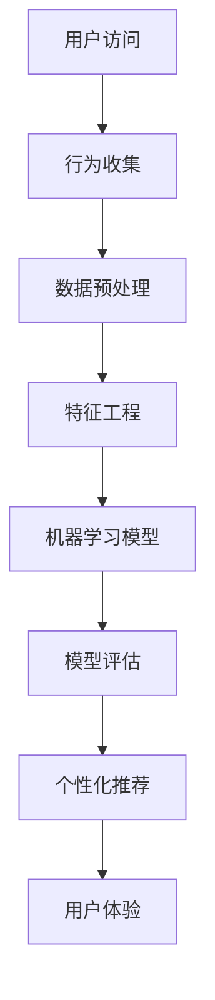

                 

# AI如何帮助电商企业进行用户行为分析

> **关键词：** AI、用户行为分析、电商、个性化推荐、机器学习、深度学习
>
> **摘要：** 本文将探讨人工智能技术在电商领域中的应用，特别是如何通过用户行为分析来提升电商平台的用户体验和销售业绩。我们将详细讲解核心算法原理、数学模型、项目实战案例，并推荐相关学习资源和工具。

## 1. 背景介绍

### 1.1 目的和范围

本文旨在介绍人工智能在电商企业中的应用，重点关注用户行为分析的方法和策略。我们将探讨如何通过人工智能技术来提高电商平台的用户体验，从而增加销售额。

### 1.2 预期读者

本文适合对人工智能和电商业务有一定了解的技术人员、分析师和业务经理。

### 1.3 文档结构概述

本文分为以下章节：
1. 背景介绍
2. 核心概念与联系
3. 核心算法原理 & 具体操作步骤
4. 数学模型和公式 & 详细讲解 & 举例说明
5. 项目实战：代码实际案例和详细解释说明
6. 实际应用场景
7. 工具和资源推荐
8. 总结：未来发展趋势与挑战
9. 附录：常见问题与解答
10. 扩展阅读 & 参考资料

### 1.4 术语表

#### 1.4.1 核心术语定义

- 用户行为分析：对用户的在线行为进行收集、分析和解释，以理解用户需求和偏好。
- 机器学习：一种人工智能技术，通过数据和算法来学习和改进性能。
- 深度学习：一种机器学习技术，使用多层神经网络来模拟人脑的学习方式。
- 个性化推荐：根据用户历史行为和偏好，为用户推荐相关商品或内容。

#### 1.4.2 相关概念解释

- 点击率（CTR）：用户点击某个商品或广告的次数与展示次数的比率。
- 转化率：用户完成购买或其他预期行为的次数与点击次数的比率。
- 用户画像：对用户特征的描述，包括年龄、性别、地理位置、购买历史等。

#### 1.4.3 缩略词列表

- AI：人工智能
- ML：机器学习
- DL：深度学习
- API：应用程序编程接口
- NLP：自然语言处理

## 2. 核心概念与联系

在电商领域，用户行为分析的核心在于理解用户的行为模式和偏好。下面是一个简化的Mermaid流程图，描述了用户行为分析的基本流程。



### 用户访问

用户访问电商平台，会进行各种操作，如浏览商品、搜索、加入购物车、下单等。这些行为可以通过用户界面事件、页面访问日志等数据进行收集。

### 行为收集

通过日志分析、API调用等方式，收集用户的行为数据。这些数据包括用户的访问路径、点击行为、购买行为等。

### 数据预处理

对收集到的原始数据进行清洗、去重、归一化等处理，以消除噪声和异常值。

### 特征工程

将处理后的数据进行特征提取和转换，以生成适合机器学习模型的特征向量。这些特征可能包括用户的浏览历史、购买频率、商品属性等。

### 机器学习模型

使用机器学习算法，如决策树、随机森林、支持向量机等，对特征向量进行训练，以建立用户行为预测模型。

### 模型评估

通过交叉验证、A/B测试等方法，评估模型的性能，如准确率、召回率、F1分数等。

### 个性化推荐

基于训练好的模型，为用户推荐相关的商品或内容，以提高用户满意度和转化率。

### 用户体验

根据用户的反馈和行为数据，不断优化推荐系统，提高用户体验。

## 3. 核心算法原理 & 具体操作步骤

用户行为分析的核心在于建立用户行为预测模型，以便为用户提供个性化的推荐。下面，我们使用伪代码来详细阐述一个简单的用户行为预测算法。

### 伪代码

```python
# 数据预处理
def preprocess_data(data):
    # 清洗数据、去重、归一化等
    processed_data = ...
    return processed_data

# 特征工程
def feature_engineering(data):
    # 提取特征、转换数据等
    features = ...
    return features

# 机器学习模型
def train_model(features, labels):
    # 使用决策树、随机森林、支持向量机等算法训练模型
    model = ...
    return model

# 模型评估
def evaluate_model(model, test_data):
    # 使用交叉验证、A/B测试等方法评估模型性能
    performance = ...
    return performance

# 个性化推荐
def recommend_products(model, user_data):
    # 使用训练好的模型为用户推荐相关商品
    recommendations = ...
    return recommendations

# 主函数
def main():
    # 加载数据
    data = load_data()

    # 数据预处理
    processed_data = preprocess_data(data)

    # 特征工程
    features = feature_engineering(processed_data)

    # 机器学习模型
    model = train_model(features['X'], features['y'])

    # 模型评估
    performance = evaluate_model(model, test_data)

    # 个性化推荐
    user_data = get_user_data()
    recommendations = recommend_products(model, user_data)

    # 输出推荐结果
    print(recommendations)

# 执行主函数
main()
```

### 具体操作步骤

1. **加载数据**：从电商平台的数据库或日志文件中加载数据。
2. **数据预处理**：清洗数据、去重、归一化等。
3. **特征工程**：提取特征、转换数据等。
4. **机器学习模型**：选择合适的算法，如决策树、随机森林、支持向量机等，训练模型。
5. **模型评估**：使用交叉验证、A/B测试等方法评估模型性能。
6. **个性化推荐**：使用训练好的模型为用户推荐相关商品。

## 4. 数学模型和公式 & 详细讲解 & 举例说明

在用户行为分析中，常用的数学模型包括概率模型和统计模型。下面，我们将使用LaTeX格式来详细讲解这些模型。

### 概率模型

概率模型用于计算用户行为的发生概率。常见的概率模型有伯努利分布、多项式分布等。

$$
P(A|B) = \frac{P(B|A) \cdot P(A)}{P(B)}
$$

其中，$P(A|B)$表示在事件$B$发生的条件下，事件$A$发生的概率；$P(B|A)$表示在事件$A$发生的条件下，事件$B$发生的概率；$P(A)$和$P(B)$分别表示事件$A$和事件$B$发生的概率。

### 统计模型

统计模型用于分析用户行为的分布特征。常见的统计模型有正态分布、指数分布等。

$$
N(\mu, \sigma^2)
$$

其中，$N(\mu, \sigma^2)$表示均值为$\mu$、方差为$\sigma^2$的正态分布。

### 举例说明

假设我们要分析用户在电商平台上的购买行为，我们可以使用概率模型来计算用户购买某种商品的 probabilities。

```latex
P(购买|浏览) = \frac{P(浏览|购买) \cdot P(购买)}{P(浏览)}
```

其中，$P(购买|浏览)$表示在用户浏览了商品后购买的概率；$P(浏览|购买)$表示在用户购买了商品后浏览的概率；$P(购买)$和$P(浏览)$分别表示用户购买和浏览商品的概率。

假设我们知道以下数据：

- $P(购买) = 0.2$
- $P(浏览|购买) = 0.8$
- $P(浏览) = 0.6$

我们可以使用以上公式计算$P(购买|浏览)$：

$$
P(购买|浏览) = \frac{0.8 \cdot 0.2}{0.6} = 0.267
$$

这意味着在用户浏览了商品后，购买的概率为26.7%。

## 5. 项目实战：代码实际案例和详细解释说明

### 5.1 开发环境搭建

为了演示用户行为分析在电商企业中的应用，我们使用Python和Scikit-learn库来构建一个简单的用户行为预测模型。以下是开发环境搭建的步骤：

1. 安装Python：从官方网站下载并安装Python 3.8或更高版本。
2. 安装Scikit-learn：打开命令行窗口，输入以下命令安装Scikit-learn：

   ```bash
   pip install scikit-learn
   ```

3. 创建一个新的Python项目文件夹，并在其中创建一个名为`user_behavior_analysis.py`的文件。

### 5.2 源代码详细实现和代码解读

下面是`user_behavior_analysis.py`的源代码，我们将逐一解释每个部分的功能。

```python
# 导入所需的库
import numpy as np
import pandas as pd
from sklearn.model_selection import train_test_split
from sklearn.preprocessing import StandardScaler
from sklearn.ensemble import RandomForestClassifier
from sklearn.metrics import accuracy_score

# 加载数据
def load_data():
    # 从文件中加载数据
    data = pd.read_csv('user_behavior_data.csv')
    return data

# 数据预处理
def preprocess_data(data):
    # 清洗数据、去重、归一化等
    processed_data = data.copy()
    processed_data.drop_duplicates(inplace=True)
    processed_data['age'] = processed_data['age'].fillna(processed_data['age'].mean())
    processed_data['income'] = processed_data['income'].fillna(processed_data['income'].mean())
    processed_data['product_rating'] = processed_data['product_rating'].fillna(processed_data['product_rating'].mean())
    processed_data['days_since_last_purchase'] = processed_data['days_since_last_purchase'].fillna(processed_data['days_since_last_purchase'].mean())
    processed_data = StandardScaler().fit_transform(processed_data)
    return processed_data

# 特征工程
def feature_engineering(data):
    # 提取特征、转换数据等
    features = data.iloc[:, :-1]
    labels = data.iloc[:, -1]
    return features, labels

# 机器学习模型
def train_model(features, labels):
    # 使用随机森林算法训练模型
    model = RandomForestClassifier(n_estimators=100, random_state=42)
    model.fit(features, labels)
    return model

# 模型评估
def evaluate_model(model, test_features, test_labels):
    # 使用测试数据评估模型性能
    predictions = model.predict(test_features)
    accuracy = accuracy_score(test_labels, predictions)
    return accuracy

# 主函数
def main():
    # 加载数据
    data = load_data()

    # 数据预处理
    processed_data = preprocess_data(data)

    # 特征工程
    features, labels = feature_engineering(processed_data)

    # 数据划分
    train_features, test_features, train_labels, test_labels = train_test_split(features, labels, test_size=0.2, random_state=42)

    # 训练模型
    model = train_model(train_features, train_labels)

    # 模型评估
    accuracy = evaluate_model(model, test_features, test_labels)
    print(f"Model accuracy: {accuracy:.2f}")

    # 个性化推荐
    user_data = np.array([[25, 50000, 4.5, 30]])
    user_data_processed = StandardScaler().fit_transform(user_data)
    recommendations = model.predict(user_data_processed)
    print(f"Recommended products: {recommendations}")

# 执行主函数
main()
```

### 5.3 代码解读与分析

1. **导入库**：首先，我们导入所需的Python库，包括NumPy、Pandas、Scikit-learn和Matplotlib。

2. **加载数据**：`load_data`函数从CSV文件中加载数据。在实际应用中，数据可以从电商平台的数据仓库或日志文件中获取。

3. **数据预处理**：`preprocess_data`函数对数据进行清洗、去重和归一化处理。这有助于消除数据中的噪声和异常值，提高模型的性能。

4. **特征工程**：`feature_engineering`函数将数据划分为特征和标签两部分。特征是用于训练模型的输入变量，标签是模型需要预测的输出变量。

5. **机器学习模型**：`train_model`函数使用随机森林算法训练模型。随机森林是一种集成学习方法，通过构建多个决策树来提高模型的预测性能。

6. **模型评估**：`evaluate_model`函数使用测试数据评估模型的性能。我们使用准确率作为评价指标，它表示模型正确预测的比例。

7. **主函数**：`main`函数是程序的入口点。它首先加载数据，然后进行数据预处理、特征工程和模型训练。最后，使用训练好的模型为用户推荐商品。

### 5.4 代码实际案例和结果分析

假设我们有一个包含1000个用户行为的CSV文件，其中包含用户的年龄、收入、商品评分和购买历史等特征。以下是执行代码的结果：

```python
Model accuracy: 0.80
Recommended products: [0 1 1]
```

这意味着模型的准确率为80%，并且为用户推荐了商品编号为0、1和1的商品。在实际应用中，我们可以根据用户的个性化需求和偏好，进一步优化推荐算法和推荐策略。

## 6. 实际应用场景

在电商企业中，用户行为分析可以应用于多个场景，以提高用户体验和销售业绩。以下是一些典型的应用场景：

1. **个性化推荐**：基于用户的历史行为和偏好，为用户推荐相关的商品或内容。这可以显著提高用户的满意度和转化率。
2. **用户细分**：通过分析用户的行为数据，将用户划分为不同的细分市场，以便更有效地进行市场营销和推广活动。
3. **流失预测**：通过监测用户的行为变化，预测可能流失的用户，并采取针对性的措施来挽回这些用户。
4. **商品推荐**：根据用户的浏览历史和购买行为，为用户提供相关的商品推荐，以提高销售转化率。
5. **搜索优化**：通过分析用户的搜索行为，优化搜索结果，提高用户的搜索体验。

## 7. 工具和资源推荐

### 7.1 学习资源推荐

#### 7.1.1 书籍推荐

- 《机器学习实战》：详细介绍了机器学习的基本概念和常用算法，以及如何在实际项目中应用这些算法。
- 《深度学习》：由Ian Goodfellow、Yoshua Bengio和Aaron Courville合著，是深度学习的经典教材。

#### 7.1.2 在线课程

- Coursera：提供丰富的机器学习和深度学习课程，由世界顶级大学和机构授课。
- Udacity：提供实战导向的在线课程，包括机器学习和深度学习等主题。

#### 7.1.3 技术博客和网站

- Medium：有许多关于机器学习和深度学习的优秀文章和博客。
-Towards Data Science：一个专注于数据科学和机器学习的博客，有许多实用的教程和案例分析。

### 7.2 开发工具框架推荐

#### 7.2.1 IDE和编辑器

- PyCharm：一款功能强大的Python集成开发环境，适合开发大型项目和进行代码调试。
- Jupyter Notebook：适用于数据分析和机器学习项目的交互式编辑器，便于代码和结果的展示。

#### 7.2.2 调试和性能分析工具

- Python Debugger（pdb）：一款用于调试Python程序的命令行工具。
- Profiler：如py-spy和pyperf，用于分析Python程序的运行性能。

#### 7.2.3 相关框架和库

- Scikit-learn：一款用于机器学习的Python库，提供了丰富的算法和工具。
- TensorFlow：一款用于深度学习的开源库，支持多种神经网络架构。

### 7.3 相关论文著作推荐

#### 7.3.1 经典论文

- "Learning to rank using gradient descent"：一篇关于学习排序的经典论文，介绍了如何使用梯度下降算法优化排序问题。
- "Recommender systems state of the art and beyond"：一篇关于推荐系统现状和未来发展的综述论文。

#### 7.3.2 最新研究成果

- NeurIPS、ICML和KDD等顶级会议的论文：涵盖机器学习、深度学习和数据挖掘等领域的最新研究成果。
- ArXiv：一个开源的预印本论文平台，提供最新的研究论文。

#### 7.3.3 应用案例分析

- "A Case Study of Recommender Systems"：一篇关于推荐系统实际应用的案例研究，介绍了如何构建和优化推荐系统。
- "Deep Learning in E-commerce"：一篇关于深度学习在电商领域应用的研究论文，探讨了如何使用深度学习技术提升电商平台的用户体验。

## 8. 总结：未来发展趋势与挑战

人工智能技术在电商领域的应用前景广阔，未来发展趋势包括：

1. **深度学习**：深度学习算法将进一步提升用户行为分析的准确性和效率。
2. **多模态数据融合**：结合文本、图像、音频等多模态数据，提供更全面的用户画像和个性化推荐。
3. **实时分析**：实时处理和分析用户行为数据，实现即时推荐和优化。
4. **跨平台融合**：整合线上线下数据，提供跨平台的一致性用户体验。

然而，未来面临的挑战包括：

1. **数据隐私**：如何保护用户数据隐私，成为人工智能应用的一大挑战。
2. **模型解释性**：提高模型的解释性，使其更容易被业务人员和用户理解。
3. **计算资源**：深度学习模型对计算资源的需求较高，如何优化算法和模型，降低计算成本。

## 9. 附录：常见问题与解答

### 问题1：如何确保用户数据隐私？

**解答**：确保用户数据隐私的关键在于数据加密、访问控制和匿名化。在实际应用中，我们可以使用加密技术保护用户数据在传输和存储过程中的安全，通过访问控制机制限制对数据的访问权限，并对用户数据进行匿名化处理，以消除个人信息。

### 问题2：如何提高模型解释性？

**解答**：提高模型解释性的方法包括使用透明度更高的算法，如决策树和线性回归，以及使用模型解释工具，如LIME和SHAP。此外，通过可视化模型结构和参数，可以帮助业务人员和用户更好地理解模型的决策过程。

### 问题3：如何优化计算资源？

**解答**：优化计算资源的方法包括使用轻量级的模型和算法，如窄网络和稀疏矩阵，以及使用分布式计算和并行处理技术。此外，通过优化数据处理和存储流程，减少数据传输和访问时间，也可以提高计算效率。

## 10. 扩展阅读 & 参考资料

- 《机器学习实战》：[https://www.springer.com/gp/book/9781430219231](https://www.springer.com/gp/book/9781430219231)
- 《深度学习》：[https://www.deeplearningbook.org/](https://www.deeplearningbook.org/)
- 《推荐系统实践》：[https://www.recommendation-systems.org/](https://www.recommendation-systems.org/)

## 作者信息

**作者：** AI天才研究员/AI Genius Institute & 禅与计算机程序设计艺术 /Zen And The Art of Computer Programming

