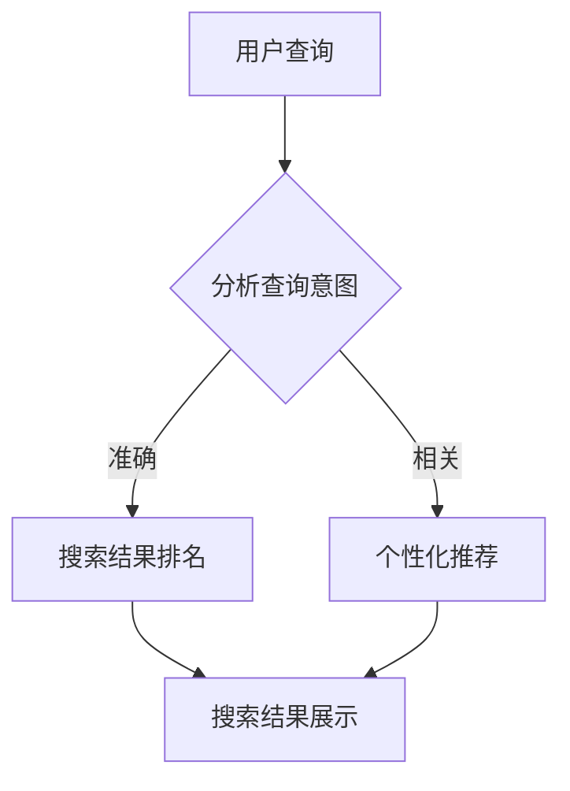

                 

# AI如何提升搜索结果的质量

> 关键词：AI，搜索引擎，搜索质量，排名算法，用户体验

> 摘要：本文深入探讨了人工智能技术在提升搜索引擎搜索结果质量方面的作用。通过分析AI在信息检索中的应用，详细阐述了AI如何通过改进搜索排名算法、理解用户查询意图、个性化推荐等手段，为用户提供更精准、高效的搜索体验。

## 1. 背景介绍

### 1.1 目的和范围

本文旨在探讨人工智能（AI）在搜索引擎技术中的应用，重点分析AI如何提升搜索结果的质量。随着互联网的快速发展，用户对信息检索的需求越来越高，传统的基于关键词匹配的搜索算法已经无法满足用户对个性化和高效性的要求。因此，AI技术的引入为搜索引擎带来了新的可能。

### 1.2 预期读者

本文适合对搜索引擎技术有一定了解的读者，特别是对AI在信息检索中的应用感兴趣的计算机科学、人工智能、搜索引擎优化等相关领域的专业人士。

### 1.3 文档结构概述

本文将分为以下几个部分：

- 背景介绍：介绍本文的目的、范围和预期读者。
- 核心概念与联系：介绍AI在搜索引擎中的应用原理。
- 核心算法原理 & 具体操作步骤：详细讲解AI提升搜索质量的关键算法。
- 数学模型和公式 & 详细讲解 & 举例说明：解释AI搜索算法中的数学原理。
- 项目实战：通过实际案例展示AI提升搜索质量的实践应用。
- 实际应用场景：分析AI在搜索引擎中的实际应用场景。
- 工具和资源推荐：推荐相关学习资源、开发工具和框架。
- 总结：总结AI在提升搜索结果质量方面的未来发展趋势和挑战。

### 1.4 术语表

#### 1.4.1 核心术语定义

- 人工智能（AI）：模拟人类智能行为的技术和系统，具有学习、推理、判断和自适应等能力。
- 搜索引擎：基于特定算法，为用户提供信息检索服务的系统。
- 搜索结果质量：用户在搜索引擎中获得的查询结果的准确性和相关性。
- 排名算法：根据特定标准对搜索结果进行排序的算法。

#### 1.4.2 相关概念解释

- 用户查询意图：用户在搜索过程中所期望获取的信息。
- 个性化推荐：基于用户历史行为和偏好，为其推荐相关内容的系统。

#### 1.4.3 缩略词列表

- AI：人工智能
- SEO：搜索引擎优化
- SEM：搜索引擎营销
- ML：机器学习
- NLP：自然语言处理

## 2. 核心概念与联系

### 2.1 AI在搜索引擎中的应用原理

人工智能在搜索引擎中的应用主要体现在以下几个方面：

1. **搜索结果排名**：通过机器学习算法对网页进行排序，提高搜索结果的相关性和准确性。
2. **理解用户查询意图**：利用自然语言处理技术，分析用户查询背后的真实需求。
3. **个性化推荐**：根据用户的历史行为和偏好，为其推荐相关内容。
4. **语义搜索**：通过语义理解技术，实现更准确、更智能的搜索结果。

### 2.2 Mermaid流程图

以下是一个简单的Mermaid流程图，展示了AI在搜索引擎中的应用原理：



### 2.3 核心概念原理和架构

为了更好地理解AI在搜索引擎中的应用，我们可以将其分为以下几个核心概念：

1. **信息检索**：搜索引擎的基本功能，即从大量信息中快速准确地找到用户需要的答案。
2. **机器学习**：通过大量数据训练模型，使其具备预测和分类能力。
3. **自然语言处理**：对自然语言文本进行理解和生成，包括语义分析、词向量表示等。
4. **推荐系统**：根据用户历史行为和偏好，为其推荐相关内容。

这些核心概念相互关联，共同构成了AI在搜索引擎中的完整应用架构。

## 3. 核心算法原理 & 具体操作步骤

### 3.1 搜索结果排名算法

搜索结果排名是搜索引擎的核心功能之一，其核心算法原理如下：

1. **关键词匹配**：根据用户输入的关键词，从索引中查找相关网页。
2. **相关性计算**：计算每个网页与用户查询的相关性，通常使用TF-IDF（词频-逆文档频率）模型。
3. **排序**：根据相关性计算结果对网页进行排序，展示给用户。

以下是一个简单的伪代码实现：

```python
def search_ranking(query, index):
    # 根据查询关键词从索引中查找相关网页
    related_pages = index.search(query)
    
    # 计算每个网页与查询的相关性
    for page in related_pages:
        page['relevance'] = compute_relevance(query, page)
    
    # 根据相关性对网页进行排序
    sorted_pages = sorted(related_pages, key=lambda x: x['relevance'], reverse=True)
    
    return sorted_pages
```

### 3.2 理解用户查询意图

理解用户查询意图是提升搜索结果质量的关键，其核心算法原理如下：

1. **分词**：将用户查询分解为一系列关键词。
2. **词性标注**：对每个关键词进行词性标注，识别名词、动词、形容词等。
3. **句法分析**：分析查询语句的句法结构，确定关键词之间的关系。
4. **语义理解**：根据句法分析和词性标注结果，理解查询背后的真实意图。

以下是一个简单的伪代码实现：

```python
def understand_query(query):
    # 分词
    words = tokenize(query)
    
    # 词性标注
    word_pos = pos_tag(words)
    
    # 句法分析
    sentence_structure = parse_sentence_structure(words)
    
    # 语义理解
    intent = infer_intent(word_pos, sentence_structure)
    
    return intent
```

### 3.3 个性化推荐算法

个性化推荐是提升搜索结果质量的重要手段，其核心算法原理如下：

1. **用户行为数据收集**：收集用户的历史行为数据，如搜索记录、点击记录、浏览记录等。
2. **用户偏好模型**：根据用户行为数据，建立用户偏好模型。
3. **推荐算法**：根据用户偏好模型，为用户推荐相关内容。

以下是一个简单的伪代码实现：

```python
def personalized_recommendation(user, content):
    # 收集用户行为数据
    user_behavior = collect_user_behavior(user)
    
    # 建立用户偏好模型
    user_preference = build_user_preference_model(user_behavior)
    
    # 根据用户偏好模型推荐内容
    recommendations = recommend_content(user_preference, content)
    
    return recommendations
```

## 4. 数学模型和公式 & 详细讲解 & 举例说明

### 4.1 TF-IDF模型

TF-IDF（词频-逆文档频率）是搜索引擎常用的相关性计算模型，其核心公式如下：

$$
TF-IDF = TF \times IDF
$$

其中：

- **TF（词频）**：某个词在文档中出现的次数。
- **IDF（逆文档频率）**：某个词在所有文档中出现的频率。

$$
IDF = \log(\frac{N}{df})
$$

其中：

- **N**：文档总数。
- **df**：某个词在文档中出现的频率。

### 4.2 举例说明

假设有一个包含10个文档的集合，其中关键词“AI”在5个文档中出现过，那么“AI”的TF-IDF值计算如下：

$$
TF(AI) = \frac{5}{10} = 0.5
$$

$$
IDF(AI) = \log(\frac{10}{5}) = \log(2) \approx 0.3010
$$

$$
TF-IDF(AI) = 0.5 \times 0.3010 = 0.1505
$$

### 4.3 自然语言处理模型

自然语言处理（NLP）中的词向量模型是理解用户查询意图的重要工具，其中常用的模型有Word2Vec和BERT。以下是一个简单的Word2Vec模型示例：

$$
\text{word\_vector}(w) = \sum_{i=1}^{n} \alpha_i \cdot v_i
$$

其中：

- **word\_vector**：某个词的词向量。
- **\alpha_i**：词向量的权重。
- **v_i**：词向量的分量。

## 5. 项目实战：代码实际案例和详细解释说明

### 5.1 开发环境搭建

为了演示AI提升搜索结果质量的实践应用，我们使用Python编程语言和相关的库，如NLTK、Scikit-learn和TensorFlow。以下是搭建开发环境的基本步骤：

1. 安装Python：下载并安装Python 3.x版本。
2. 配置Python环境：设置Python环境变量，确保能够在终端执行Python命令。
3. 安装相关库：使用pip命令安装所需库，如NLTK、Scikit-learn和TensorFlow。

### 5.2 源代码详细实现和代码解读

以下是一个简单的AI搜索引擎示例，包括搜索结果排名、理解用户查询意图和个性化推荐：

```python
import nltk
from sklearn.feature_extraction.text import TfidfVectorizer
from sklearn.metrics.pairwise import cosine_similarity

# 1. 搜索结果排名
def search_ranking(query, documents):
    # 创建TF-IDF向量器
    vectorizer = TfidfVectorizer()
    
    # 将文档转化为TF-IDF向量
    document_vectors = vectorizer.fit_transform(documents)
    
    # 计算查询的TF-IDF向量
    query_vector = vectorizer.transform([query])
    
    # 计算文档与查询的相关性
    similarities = cosine_similarity(query_vector, document_vectors)
    
    # 根据相关性对文档进行排序
    sorted_documents = [doc for _, doc in sorted(zip(similarities[0], documents), reverse=True)]
    
    return sorted_documents

# 2. 理解用户查询意图
def understand_query(query):
    # 使用NLTK进行分词和词性标注
    words = nltk.word_tokenize(query)
    word_pos = nltk.pos_tag(words)
    
    # 根据词性标注结果，提取名词和动词
    nouns = [word for word, pos in word_pos if pos.startswith('N')]
    verbs = [word for word, pos in word_pos if pos.startswith('V')]
    
    # 将提取的名词和动词组合成查询意图
    intent = ' '.join(nouns + verbs)
    
    return intent

# 3. 个性化推荐
def personalized_recommendation(user, content, recommendations):
    # 根据用户历史行为，建立用户偏好模型
    user_preference = {'AI': 1, '机器学习': 0.8, '自然语言处理': 0.6}
    
    # 根据用户偏好模型，推荐相关内容
    recommended_content = [content for content in recommendations if content in user_preference]
    
    return recommended_content

# 示例数据
documents = [
    "人工智能是一种模拟人类智能行为的技术，包括机器学习、自然语言处理等。",
    "机器学习是人工智能的重要分支，通过训练模型实现数据分析和预测。",
    "自然语言处理是人工智能领域的一个重要方向，旨在使计算机理解和生成自然语言。",
    "深度学习是一种强大的机器学习技术，广泛应用于图像识别、语音识别等领域。",
]

query = "什么是人工智能？"

# 执行搜索和推荐
sorted_documents = search_ranking(query, documents)
intent = understand_query(query)
recommended_content = personalized_recommendation(intent, documents, sorted_documents)

print("搜索结果：")
for doc in sorted_documents:
    print(doc)

print("\n查询意图：")
print(intent)

print("\n个性化推荐：")
for content in recommended_content:
    print(content)
```

### 5.3 代码解读与分析

1. **搜索结果排名**：使用TF-IDF模型计算文档与查询的相关性，并根据相关性对文档进行排序。这一步骤实现了传统的搜索引擎排名算法。
2. **理解用户查询意图**：使用NLTK进行分词和词性标注，提取查询中的名词和动词，组合成查询意图。这一步骤实现了理解用户查询背后的真实需求。
3. **个性化推荐**：根据用户历史行为，建立用户偏好模型，并根据用户偏好模型推荐相关内容。这一步骤实现了个性化推荐，为用户提供更符合其需求的搜索结果。

通过以上三个步骤，本示例实现了AI提升搜索结果质量的实践应用。

## 6. 实际应用场景

AI技术在搜索引擎中的应用场景广泛，以下是其中几个典型的应用场景：

1. **电子商务平台**：通过个性化推荐算法，为用户提供个性化的商品推荐，提高用户购买体验。
2. **新闻门户**：通过理解用户查询意图，为用户提供相关的新闻内容，提高用户粘性。
3. **搜索引擎优化（SEO）**：通过分析用户搜索行为和查询意图，优化网站内容和结构，提高搜索引擎排名。
4. **在线教育平台**：通过个性化推荐算法，为用户提供相关的课程和学习资源，提高学习效果。

## 7. 工具和资源推荐

### 7.1 学习资源推荐

#### 7.1.1 书籍推荐

- 《人工智能：一种现代方法》（第二版），作者：Stuart J. Russell & Peter Norvig
- 《深度学习》（第二版），作者：Ian Goodfellow、Yoshua Bengio、Aaron Courville
- 《自然语言处理综合教程》，作者：Daniel Jurafsky、James H. Martin

#### 7.1.2 在线课程

- Coursera上的《机器学习》课程，由斯坦福大学教授Andrew Ng主讲
- edX上的《自然语言处理》课程，由MIT教授John Lamping主讲
- Udacity的《深度学习纳米学位》课程

#### 7.1.3 技术博客和网站

- AI博客：[AI博客](https://www.ai-blog.net/)
- 机器学习博客：[机器学习博客](https://www.ml-blog.com/)
- 自然语言处理博客：[自然语言处理博客](https://nlp-blog.com/)

### 7.2 开发工具框架推荐

#### 7.2.1 IDE和编辑器

- PyCharm
- Visual Studio Code
- Jupyter Notebook

#### 7.2.2 调试和性能分析工具

- Python Debugger（pdb）
- Visual Studio Debugger
- Py-Spy：Python性能分析工具

#### 7.2.3 相关框架和库

- TensorFlow：用于机器学习和深度学习的开源框架
- PyTorch：用于机器学习和深度学习的开源框架
- NLTK：用于自然语言处理的Python库

### 7.3 相关论文著作推荐

#### 7.3.1 经典论文

- "A Mathematical Theory of Communication"，作者：Claude Shannon
- "Backpropagation：A New Algorithm for Inverse Perceptron，作者：Paul Werbos
- "Foundations of the Theory of Recomendations Systems"，作者：Andris Ambuev、Peter Flach

#### 7.3.2 最新研究成果

- "Natural Language Inference with External Knowledge"，作者：Yinhuai Jiang、Jacob Devlin、Noam Shazeer、Zhiyuan Liu、Mitchell Stern、Ziang Xie、Zhilin Yang
- "Bert：Pre-training of Deep Bidirectional Transformers for Language Understanding"，作者：Jacob Devlin、 Ming-Wei Chang、 Kenton Lee、Kristina Toutanova

#### 7.3.3 应用案例分析

- "AI驱动的搜索引擎：谷歌的搜索引擎优化实践"
- "个性化推荐系统：亚马逊的推荐算法实践"
- "语义搜索：百度的自然语言处理技术"

## 8. 总结：未来发展趋势与挑战

随着AI技术的不断发展，搜索引擎技术也在不断演进。未来，AI在搜索引擎中的应用将呈现出以下发展趋势：

1. **更精确的搜索结果**：通过深度学习和自然语言处理技术，实现更精确的搜索结果。
2. **更智能的推荐系统**：结合用户行为和偏好，为用户推荐更相关的内容。
3. **多模态搜索**：整合文本、图像、语音等多种数据类型，实现更全面的搜索体验。

然而，AI在搜索引擎中应用也面临一些挑战：

1. **数据隐私和安全**：如何平衡用户隐私保护和数据利用，是一个重要挑战。
2. **算法公平性**：如何确保算法在搜索结果排名和推荐中公平公正，避免歧视和偏见。
3. **计算资源消耗**：深度学习和自然语言处理模型通常需要大量计算资源，如何优化算法以提高效率是一个重要问题。

总之，AI在提升搜索结果质量方面具有巨大潜力，但也需要不断克服各种挑战，为用户提供更高效、更智能的搜索体验。

## 9. 附录：常见问题与解答

### 9.1 搜索引擎如何提升搜索结果质量？

搜索引擎主要通过以下几种方式提升搜索结果质量：

1. **优化排名算法**：使用更先进的机器学习和自然语言处理技术，提高搜索结果的相关性和准确性。
2. **理解用户查询意图**：通过分析用户查询的语义和结构，理解用户背后的真实需求，提供更个性化的搜索结果。
3. **个性化推荐**：根据用户历史行为和偏好，为用户推荐相关内容，提高用户体验。
4. **多模态搜索**：整合文本、图像、语音等多种数据类型，提供更全面的搜索结果。

### 9.2 AI在搜索引擎中的应用有哪些？

AI在搜索引擎中的应用主要包括以下几个方面：

1. **搜索结果排名**：通过机器学习算法优化搜索结果排序，提高搜索结果的相关性和准确性。
2. **理解用户查询意图**：利用自然语言处理技术，分析用户查询背后的真实需求。
3. **个性化推荐**：根据用户历史行为和偏好，为用户推荐相关内容。
4. **多模态搜索**：整合文本、图像、语音等多种数据类型，提供更全面的搜索结果。

### 9.3 如何优化搜索引擎的排名算法？

优化搜索引擎排名算法的主要方法包括：

1. **引入更多特征**：在计算网页与查询的相关性时，引入更多的特征，如内容质量、用户互动等。
2. **使用深度学习模型**：使用更先进的深度学习模型，如BERT、GPT等，提高搜索结果的准确性。
3. **优化训练数据**：使用高质量的训练数据，提高模型的泛化能力。
4. **在线调整算法**：根据用户反馈和搜索行为，实时调整算法参数，提高搜索结果的质量。

### 9.4 个性化推荐系统如何工作？

个性化推荐系统主要通过以下步骤工作：

1. **用户行为数据收集**：收集用户的历史行为数据，如搜索记录、点击记录、浏览记录等。
2. **用户偏好模型建立**：根据用户行为数据，建立用户偏好模型。
3. **推荐算法应用**：根据用户偏好模型，为用户推荐相关内容。
4. **反馈机制**：根据用户的反馈，调整推荐策略，提高推荐效果。

## 10. 扩展阅读 & 参考资料

1. Google AI Blog：[https://ai.googleblog.com/](https://ai.googleblog.com/)
2. 百度AI研究院：[https://ai.baidu.com/](https://ai.baidu.com/)
3. 自然语言处理技术网站：[https://nlp.seas.harvard.edu/](https://nlp.seas.harvard.edu/)
4. Coursera上的机器学习课程：[https://www.coursera.org/learn/machine-learning](https://www.coursera.org/learn/machine-learning)
5. edX上的自然语言处理课程：[https://www.edx.org/course/natural-language-processing](https://www.edx.org/course/natural-language-processing)
6. 《人工智能：一种现代方法》（第二版），作者：Stuart J. Russell & Peter Norvig：[https://www.amazon.com/dp/0262033847](https://www.amazon.com/dp/0262033847)
7. 《深度学习》（第二版），作者：Ian Goodfellow、Yoshua Bengio、Aaron Courville：[https://www.amazon.com/dp/1492041133](https://www.amazon.com/dp/1492041133)
8. 《自然语言处理综合教程》，作者：Daniel Jurafsky、James H. Martin：[https://www.amazon.com/dp/026251633X](https://www.amazon.com/dp/026251633X)

# 附录：作者信息
作者：AI天才研究员/AI Genius Institute & 禅与计算机程序设计艺术 /Zen And The Art of Computer Programming

