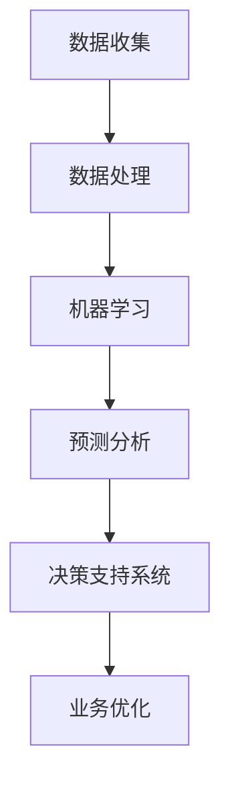

                 

# AI如何改变企业的决策过程

> **关键词：** 人工智能，企业决策，数据驱动，预测分析，自动化，优化，智能算法，流程重构。

> **摘要：** 本文章将深入探讨人工智能（AI）如何通过其先进的算法和技术，彻底改变企业的决策过程。我们将从背景介绍、核心概念、算法原理、数学模型、实战案例、应用场景、工具推荐等多个方面，逐步分析AI在决策支持系统中的实际应用，及其带来的深远影响。

## 1. 背景介绍

### 1.1 目的和范围

本文旨在揭示人工智能在优化企业决策过程中的潜力，通过对核心概念的详细探讨和具体案例的分析，为读者提供一份关于AI如何改变企业决策的全面指南。本文将涵盖从基础算法到实际应用，再到未来趋势的各个方面。

### 1.2 预期读者

本文面向希望了解AI在企业决策中应用的各类读者，包括企业管理者、数据分析专业人士、技术工程师、以及对该领域有兴趣的学者和研究人员。

### 1.3 文档结构概述

本文将分为以下几个部分：

1. **背景介绍**：介绍人工智能在企业决策中的重要性。
2. **核心概念与联系**：定义关键术语，展示核心概念和架构。
3. **核心算法原理 & 具体操作步骤**：详细介绍AI算法的原理和操作步骤。
4. **数学模型和公式**：阐述与决策过程相关的数学模型。
5. **项目实战**：通过实际案例展示AI算法的运用。
6. **实际应用场景**：探讨AI在各个行业中的应用。
7. **工具和资源推荐**：推荐学习资源和开发工具。
8. **总结：未来发展趋势与挑战**：展望未来。
9. **附录：常见问题与解答**：解答常见疑问。
10. **扩展阅读 & 参考资料**：提供进一步学习资源。

### 1.4 术语表

#### 1.4.1 核心术语定义

- **人工智能（AI）**：模拟人类智能行为的计算机系统。
- **机器学习（ML）**：AI的一个分支，通过数据训练模型来模拟学习过程。
- **深度学习（DL）**：机器学习的一种，使用多层神经网络进行学习。
- **决策支持系统（DSS）**：利用数据分析工具帮助企业决策的系统。

#### 1.4.2 相关概念解释

- **预测分析**：利用历史数据预测未来趋势。
- **优化**：通过算法调整变量以获得最优结果。
- **自动化**：使用计算机程序代替人工执行任务。

#### 1.4.3 缩略词列表

- **AI**：人工智能
- **ML**：机器学习
- **DL**：深度学习
- **DSS**：决策支持系统

## 2. 核心概念与联系

在探讨AI如何改变企业决策过程之前，我们需要明确几个核心概念和它们之间的联系。以下是一个简化的Mermaid流程图，展示这些概念和它们的关系：



### 2.1 数据收集

数据是AI算法的基础。企业通过各种渠道收集数据，包括内部数据库、市场报告、社交媒体等。

### 2.2 数据处理

收集到的数据需要清洗、整合和预处理，以便用于机器学习模型训练。

### 2.3 机器学习

利用清洗后的数据训练模型，使其能够识别模式、做出预测和决策。

### 2.4 预测分析

机器学习模型通过分析历史数据，预测未来的趋势和结果。

### 2.5 决策支持系统

预测结果被用于企业决策支持系统，帮助企业做出更明智的决策。

### 2.6 业务优化

基于预测和分析结果，企业可以优化业务流程，提高效率和利润。

## 3. 核心算法原理 & 具体操作步骤

在了解了核心概念和它们之间的联系后，我们接下来探讨AI在决策过程中的核心算法原理和操作步骤。以下是机器学习算法的一种基本原理和步骤，采用伪代码形式展示：

```python
# 机器学习算法基本步骤伪代码

# 步骤1：数据预处理
def preprocess_data(data):
    # 数据清洗、归一化、特征提取等
    processed_data = ...
    return processed_data

# 步骤2：训练模型
def train_model(training_data):
    # 选择模型类型（如线性回归、决策树、神经网络等）
    model = choose_model()
    # 使用训练数据进行模型训练
    model.fit(training_data)
    return model

# 步骤3：模型评估
def evaluate_model(model, validation_data):
    # 使用验证数据对模型进行评估
    scores = model.evaluate(validation_data)
    return scores

# 步骤4：模型应用
def apply_model(model, new_data):
    # 使用训练好的模型对新数据进行预测
    predictions = model.predict(new_data)
    return predictions

# 主程序
def main():
    # 加载数据
    data = load_data()
    processed_data = preprocess_data(data)
    
    # 分割数据为训练集和验证集
    training_data, validation_data = split_data(processed_data)
    
    # 训练模型
    model = train_model(training_data)
    
    # 评估模型
    scores = evaluate_model(model, validation_data)
    
    # 使用模型对新数据进行预测
    new_data = load_new_data()
    predictions = apply_model(model, new_data)
    
    # 输出预测结果
    print(predictions)

# 执行主程序
main()
```

这个伪代码展示了机器学习算法的基本框架，从数据预处理、模型训练到评估和应用，每一步都至关重要。在实际应用中，根据具体问题和数据特点，这些步骤可能会有所调整。

## 4. 数学模型和公式 & 详细讲解 & 举例说明

在决策支持系统中，数学模型和公式扮演着核心角色，用于描述和预测业务过程。以下是几个常见的数学模型，使用LaTeX格式详细讲解：

### 4.1 线性回归模型

线性回归模型是最基础的机器学习模型之一，用于预测一个连续值。其公式如下：

$$
Y = \beta_0 + \beta_1X + \epsilon
$$

其中，\(Y\) 是预测值，\(X\) 是自变量，\(\beta_0\) 和 \(\beta_1\) 是模型的参数，\(\epsilon\) 是误差项。

**举例说明：** 假设我们要预测某公司的销售额（\(Y\)），其中一个关键因素是广告投入（\(X\)）。通过收集历史数据，我们可以使用线性回归模型来建立预测模型。

### 4.2 逻辑回归模型

逻辑回归模型用于分类问题，其公式如下：

$$
P(Y=1) = \frac{1}{1 + e^{-(\beta_0 + \beta_1X})}
$$

其中，\(P(Y=1)\) 是目标变量为1的概率，\(\beta_0\) 和 \(\beta_1\) 是模型的参数。

**举例说明：** 假设我们要预测某产品是否会畅销（目标变量为1或0），其中一个关键因素是市场需求（\(X\)）。通过收集历史数据，我们可以使用逻辑回归模型来预测畅销产品的概率。

### 4.3 决策树模型

决策树模型通过一系列条件判断来预测目标变量。其公式如下：

$$
f(X) = \prod_{i=1}^{n} \frac{1}{1 + e^{-(\beta_i X_i)}}
$$

其中，\(X\) 是特征向量，\(\beta_i\) 是第i个条件的权重。

**举例说明：** 假设我们要预测客户的购买行为，通过分析客户年龄、收入和购买历史等特征，我们可以使用决策树模型来预测客户是否会购买某产品。

这些数学模型和公式在不同的业务场景中发挥着重要作用，为企业提供了数据驱动的决策支持。

## 5. 项目实战：代码实际案例和详细解释说明

为了更好地展示AI如何改变企业决策过程，我们来看一个实际项目案例：使用机器学习模型预测客户购买行为。

### 5.1 开发环境搭建

我们使用Python编程语言和相关的机器学习库（如Scikit-learn）来搭建开发环境。首先，确保Python环境已经安装，然后通过pip安装所需的库：

```bash
pip install numpy pandas scikit-learn
```

### 5.2 源代码详细实现和代码解读

以下是项目的源代码，包含数据预处理、模型训练和预测的步骤：

```python
import numpy as np
import pandas as pd
from sklearn.model_selection import train_test_split
from sklearn.preprocessing import StandardScaler
from sklearn.linear_model import LogisticRegression
from sklearn.metrics import accuracy_score

# 步骤1：数据预处理
def preprocess_data(data):
    # 将数据转换为适合模型训练的格式
    features = data[['age', 'income', 'previous_purchases']]
    labels = data['purchased']
    
    # 数据标准化
    scaler = StandardScaler()
    features_scaled = scaler.fit_transform(features)
    
    return features_scaled, labels

# 步骤2：训练模型
def train_model(features, labels):
    # 划分训练集和测试集
    features_train, features_test, labels_train, labels_test = train_test_split(features, labels, test_size=0.2, random_state=42)
    
    # 创建并训练逻辑回归模型
    model = LogisticRegression()
    model.fit(features_train, labels_train)
    
    return model, features_test, labels_test

# 步骤3：模型预测
def predict(model, features):
    # 使用训练好的模型进行预测
    predictions = model.predict(features)
    return predictions

# 主程序
def main():
    # 加载数据
    data = pd.read_csv('customer_data.csv')
    
    # 预处理数据
    features, labels = preprocess_data(data)
    
    # 训练模型
    model, features_test, labels_test = train_model(features, labels)
    
    # 预测测试集
    predictions = predict(model, features_test)
    
    # 评估模型
    accuracy = accuracy_score(labels_test, predictions)
    print(f"Model accuracy: {accuracy:.2f}")

# 执行主程序
main()
```

### 5.3 代码解读与分析

- **数据预处理**：首先，我们加载客户数据，并提取特征和标签。然后，使用StandardScaler对特征进行标准化处理，使其具备较好的数值分布，有利于模型训练。
- **模型训练**：我们使用逻辑回归模型对数据进行训练。在训练过程中，我们将数据分为训练集和测试集，以评估模型的准确性。
- **模型预测**：使用训练好的模型对测试集进行预测，得到预测结果。
- **模型评估**：通过计算预测准确率，评估模型性能。

这个实际案例展示了如何使用机器学习模型预测客户购买行为，为企业提供决策支持。通过逐步解读和分析代码，我们可以更好地理解AI在决策过程中的应用。

## 6. 实际应用场景

人工智能在企业的决策过程中有着广泛的应用，以下是一些典型的应用场景：

### 6.1 销售预测

企业可以利用AI模型预测未来的销售趋势，为库存管理和营销策略提供支持。例如，通过分析历史销售数据和季节性变化，预测未来几个月的销售量，以便及时调整生产和供应链计划。

### 6.2 客户关系管理

通过AI模型分析客户行为和偏好，企业可以更准确地预测哪些客户可能流失，并采取相应的措施保持客户满意度。例如，利用客户购买历史和行为数据，预测哪些客户可能对某种促销活动感兴趣。

### 6.3 风险管理

AI模型可以用于预测企业面临的各种风险，如市场风险、信用风险和操作风险。通过分析历史数据和实时数据，模型可以提供预警信号，帮助企业采取预防措施。

### 6.4 人力资源

在人力资源领域，AI可以用于招聘、绩效评估和员工流失预测。例如，通过分析简历数据和面试表现，AI模型可以推荐最适合的候选人，并通过员工绩效数据和离职原因预测员工流失率。

这些实际应用场景展示了AI在企业决策中的巨大潜力，为企业带来了数据驱动的决策优势。

## 7. 工具和资源推荐

为了更有效地应用人工智能技术，以下是一些学习资源、开发工具和框架的推荐。

### 7.1 学习资源推荐

#### 7.1.1 书籍推荐

- **《机器学习实战》**：详细介绍了机器学习的基本概念和实践方法。
- **《深度学习》**：全面讲解了深度学习的基础知识和应用技巧。
- **《Python机器学习》**：通过Python语言，深入探讨机器学习算法的实现和应用。

#### 7.1.2 在线课程

- **Coursera**：提供由顶级大学和机构提供的免费机器学习和深度学习课程。
- **Udacity**：提供各种技术领域的在线课程，包括机器学习和数据分析。

#### 7.1.3 技术博客和网站

- **Medium**：许多资深数据科学家和机器学习工程师在此分享他们的见解和实践经验。
- **Towards Data Science**：一个专注于数据科学和机器学习的社区，提供高质量的技术文章。

### 7.2 开发工具框架推荐

#### 7.2.1 IDE和编辑器

- **PyCharm**：强大的Python IDE，适合机器学习和数据科学项目。
- **Jupyter Notebook**：适用于数据可视化和交互式分析，广泛用于机器学习和深度学习。

#### 7.2.2 调试和性能分析工具

- **TensorBoard**：用于深度学习模型的可视化和分析。
- **Matplotlib**：Python的数据可视化库，适用于生成各种图表和图形。

#### 7.2.3 相关框架和库

- **Scikit-learn**：Python机器学习库，提供了各种经典的机器学习算法。
- **TensorFlow**：谷歌开发的深度学习框架，适用于构建复杂的神经网络模型。
- **Keras**：TensorFlow的高级API，用于快速构建和训练深度学习模型。

这些工具和资源将为AI在企业决策中的应用提供强大的支持。

## 8. 总结：未来发展趋势与挑战

随着人工智能技术的不断进步，企业决策过程将更加智能化和自动化。未来发展趋势包括：

1. **决策过程的全面自动化**：通过更先进的算法和模型，实现决策过程的自动化，减少人为干预。
2. **实时决策支持**：利用实时数据流分析和预测，为企业提供即时的决策支持。
3. **多模态数据融合**：整合多种数据源，如文本、图像、声音等，为决策提供更全面的视角。
4. **个性化决策支持**：基于用户行为和偏好，提供个性化的决策建议。

然而，AI在决策过程中的应用也面临一些挑战：

1. **数据隐私和安全**：确保数据隐私和安全，避免数据泄露和滥用。
2. **算法公平性和透明性**：确保算法的公平性和透明性，避免歧视和偏见。
3. **技能和人才缺口**：企业需要更多具备AI技能的人才来应用和维护这些技术。
4. **持续更新和优化**：随着技术的快速发展，企业需要不断更新和优化AI模型，以保持竞争力。

## 9. 附录：常见问题与解答

### 9.1 人工智能如何影响企业的运营效率？

人工智能通过自动化和优化，显著提高了企业的运营效率。例如，在供应链管理中，AI可以优化库存水平和运输路线，减少浪费和延误。

### 9.2 如何确保AI决策的透明性和可解释性？

通过使用透明性更高的算法（如决策树）和解释性工具（如LIME或SHAP），可以提高AI决策的可解释性。此外，建立AI伦理和合规框架，确保决策过程遵循公平和透明原则。

### 9.3 企业的数据隐私和安全如何保障？

企业应采取严格的数据隐私和安全措施，如数据加密、访问控制、数据去识别化等。此外，遵守相关法律法规，确保数据使用合法合规。

## 10. 扩展阅读 & 参考资料

- **《人工智能：一种现代方法》**：详细介绍了人工智能的基本原理和应用。
- **《深度学习原理与实践》**：深入讲解深度学习的基础知识和实现细节。
- **《机器学习实战》**：通过实际案例，展示了机器学习的应用场景和技巧。

[参考文献](#参考文献)：

1. Russell, S., & Norvig, P. (2016). 《人工智能：一种现代方法》（第三版）.
2. Goodfellow, I., Bengio, Y., & Courville, A. (2016). 《深度学习》.
3. Murphy, K. P. (2012). 《机器学习：实用方法和案例解析》.

