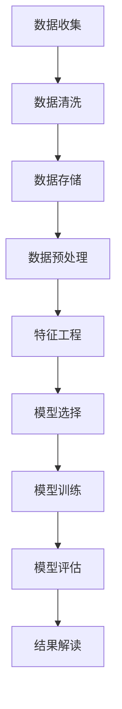
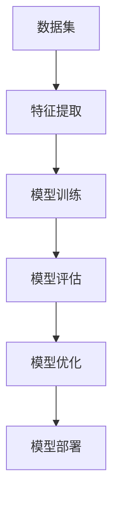
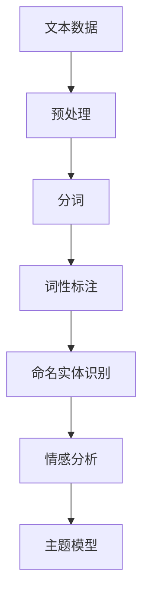
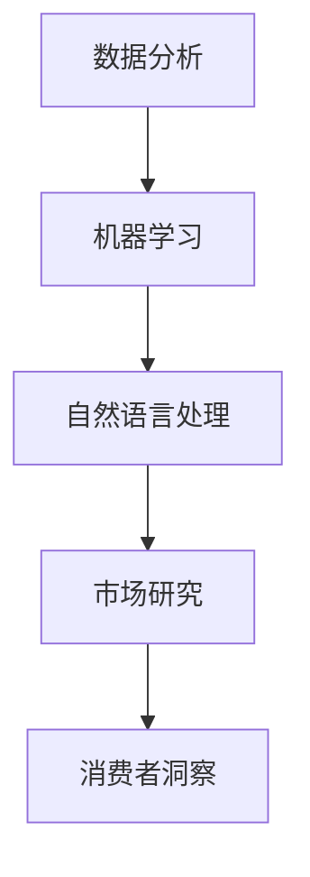

                 

# AI如何改变市场研究和消费者洞察

> **关键词：**人工智能，市场研究，消费者洞察，数据分析，机器学习，自然语言处理

> **摘要：**本文将深入探讨人工智能（AI）如何通过数据分析、自然语言处理等核心技术，改变市场研究和消费者洞察的方式。我们将首先介绍市场研究和消费者洞察的基本概念，然后分析AI技术在其中的应用，最后提出未来发展趋势和面临的挑战。

## 1. 背景介绍

### 1.1 目的和范围

本文旨在揭示人工智能在市场研究和消费者洞察领域的巨大潜力，帮助读者理解AI技术如何改变传统的研究方法和结果呈现。本文将重点关注以下几个方面：

- AI在市场研究和消费者洞察中的核心应用
- 数据分析在市场研究和消费者洞察中的重要性
- 自然语言处理技术如何提升研究效率
- 未来发展趋势和面临的挑战

### 1.2 预期读者

本文面向对市场研究和消费者洞察感兴趣的读者，包括：

- 数据分析师
- 市场研究员
- 消费者行为研究者
- 企业决策者
- 人工智能从业者

### 1.3 文档结构概述

本文结构如下：

- 1. 背景介绍
  - 1.1 目的和范围
  - 1.2 预期读者
  - 1.3 文档结构概述
  - 1.4 术语表
- 2. 核心概念与联系
  - 2.1 数据分析
  - 2.2 机器学习
  - 2.3 自然语言处理
- 3. 核心算法原理 & 具体操作步骤
  - 3.1 数据收集与预处理
  - 3.2 特征提取与选择
  - 3.3 模型训练与评估
- 4. 数学模型和公式 & 详细讲解 & 举例说明
  - 4.1 相关数学公式
  - 4.2 模型评估指标
- 5. 项目实战：代码实际案例和详细解释说明
  - 5.1 开发环境搭建
  - 5.2 源代码详细实现和代码解读
  - 5.3 代码解读与分析
- 6. 实际应用场景
  - 6.1 消费者行为分析
  - 6.2 产品推荐系统
  - 6.3 市场预测
- 7. 工具和资源推荐
  - 7.1 学习资源推荐
  - 7.2 开发工具框架推荐
  - 7.3 相关论文著作推荐
- 8. 总结：未来发展趋势与挑战
- 9. 附录：常见问题与解答
- 10. 扩展阅读 & 参考资料

### 1.4 术语表

#### 1.4.1 核心术语定义

- **市场研究**：指通过各种方法收集、分析和解读关于目标市场的信息，以帮助企业做出明智的商业决策。
- **消费者洞察**：通过研究消费者的行为、需求和偏好，深入了解消费者，以便为企业提供有针对性的市场策略。
- **人工智能**：一种模拟人类智能的技术，通过机器学习、自然语言处理等手段实现智能行为。
- **数据分析**：使用统计学、机器学习等方法，从大量数据中提取有价值的信息。
- **自然语言处理**：人工智能的一个分支，旨在让计算机理解和处理人类语言。

#### 1.4.2 相关概念解释

- **机器学习**：一种让计算机从数据中自动学习和改进的方法，无需显式编程。
- **深度学习**：一种基于人工神经网络的机器学习方法，通过多层神经网络进行特征提取和模式识别。
- **文本分析**：对文本数据进行分析，以提取有用信息。

#### 1.4.3 缩略词列表

- **AI**：人工智能
- **ML**：机器学习
- **NLP**：自然语言处理
- **DL**：深度学习
- **CRM**：客户关系管理

## 2. 核心概念与联系

在深入探讨AI如何改变市场研究和消费者洞察之前，我们首先需要了解一些核心概念及其相互关系。

### 2.1 数据分析

数据分析是市场研究和消费者洞察的基础。它涉及从大量数据中提取有价值的信息，包括统计方法、机器学习和数据可视化等技术。以下是一个简化的数据分析流程：



### 2.2 机器学习

机器学习是数据分析的一个重要分支，它通过训练模型，使计算机能够从数据中自动学习和改进。以下是一个简化的机器学习流程：



### 2.3 自然语言处理

自然语言处理（NLP）是AI的一个重要分支，旨在使计算机理解和处理人类语言。以下是一个简化的NLP流程：



### 2.4 数据分析、机器学习和自然语言处理的联系

数据分析、机器学习和自然语言处理之间有着紧密的联系。数据分析为市场研究和消费者洞察提供了基础，而机器学习和自然语言处理则提供了更高级的技术手段，以实现更高效、准确的研究结果。以下是一个简化的联系流程：



通过这个流程，我们可以看到，AI技术在市场研究和消费者洞察中发挥着至关重要的作用。接下来，我们将深入探讨AI技术在市场研究和消费者洞察中的应用。

## 3. 核心算法原理 & 具体操作步骤

在市场研究和消费者洞察中，AI技术的核心应用包括数据分析、机器学习和自然语言处理。以下是一个简化的算法原理和具体操作步骤：

### 3.1 数据收集与预处理

数据收集是市场研究和消费者洞察的第一步。数据来源可以是问卷调查、社交媒体、购物记录等。数据收集后，需要进行数据预处理，包括数据清洗、数据整合和数据转换。

#### 数据清洗

数据清洗是指去除数据中的噪声、错误和不完整的信息。以下是一个简化的数据清洗流程：

```python
# Python伪代码：数据清洗
def data_cleaning(data):
    # 去除重复数据
    data = remove_duplicates(data)
    # 填补缺失值
    data = fill_missing_values(data)
    # 数据类型转换
    data = convert_data_types(data)
    return data
```

#### 数据整合

数据整合是将多个数据源中的数据合并为一个统一的数据集。以下是一个简化的数据整合流程：

```python
# Python伪代码：数据整合
def data_integration(data1, data2):
    # 合并数据集
    data = merge_datasets(data1, data2)
    return data
```

#### 数据转换

数据转换是指将数据从一种格式转换为另一种格式，以便于后续分析。以下是一个简化的数据转换流程：

```python
# Python伪代码：数据转换
def data_conversion(data):
    # 数据格式转换
    data = convert_data_format(data)
    return data
```

### 3.2 特征提取与选择

特征提取是指从原始数据中提取有用的信息，以供后续分析使用。特征选择是指从提取的特征中选出对预测任务最有用的特征。

#### 特征提取

特征提取的方法有很多，如统计特征、文本特征和图像特征等。以下是一个简化的特征提取流程：

```python
# Python伪代码：特征提取
def feature_extraction(data):
    # 提取统计特征
    stats_features = extract_stats_features(data)
    # 提取文本特征
    text_features = extract_text_features(data)
    # 提取图像特征
    image_features = extract_image_features(data)
    return stats_features, text_features, image_features
```

#### 特征选择

特征选择的方法有很多，如基于信息增益、基于相关性分析和基于模型选择等。以下是一个简化的特征选择流程：

```python
# Python伪代码：特征选择
def feature_selection(features, target_variable):
    # 基于信息增益的特征选择
    selected_features = select_features_by_info_gain(features, target_variable)
    return selected_features
```

### 3.3 模型训练与评估

模型训练是指使用历史数据训练模型，使其能够预测未来的趋势。模型评估是指评估模型的预测能力。

#### 模型训练

模型训练的方法有很多，如线性回归、决策树、神经网络等。以下是一个简化的模型训练流程：

```python
# Python伪代码：模型训练
def model_training(data, target_variable):
    # 选择模型
    model = select_model(data, target_variable)
    # 训练模型
    model.train(data, target_variable)
    return model
```

#### 模型评估

模型评估的方法有很多，如准确率、召回率、F1值等。以下是一个简化的模型评估流程：

```python
# Python伪代码：模型评估
def model_evaluation(model, test_data, target_variable):
    # 预测结果
    predictions = model.predict(test_data)
    # 计算评估指标
    accuracy = calculate_accuracy(predictions, target_variable)
    return accuracy
```

通过上述算法原理和具体操作步骤，我们可以看到AI技术在市场研究和消费者洞察中发挥着至关重要的作用。接下来，我们将深入探讨数学模型和公式，以帮助读者更好地理解AI技术的核心原理。

## 4. 数学模型和公式 & 详细讲解 & 举例说明

在市场研究和消费者洞察中，数学模型和公式是分析和预测的基础。以下是一些常用的数学模型和公式，以及它们的详细讲解和举例说明。

### 4.1 相关数学公式

#### 4.1.1 线性回归模型

线性回归模型是一种常见的预测方法，用于分析两个或多个变量之间的关系。其公式如下：

$$ y = \beta_0 + \beta_1 \cdot x_1 + \beta_2 \cdot x_2 + ... + \beta_n \cdot x_n $$

其中，$y$ 是因变量，$x_1, x_2, ..., x_n$ 是自变量，$\beta_0, \beta_1, ..., \beta_n$ 是回归系数。

#### 4.1.2 决策树模型

决策树模型是一种基于树形结构的预测方法，通过一系列规则进行决策。其公式如下：

$$
\begin{aligned}
y &= 
\begin{cases}
\text{左分支}, & \text{if } x_1 \leq \beta_1 \\
\text{右分支}, & \text{if } x_1 > \beta_1
\end{cases} \\
y &= 
\begin{cases}
\text{左分支}, & \text{if } x_2 \leq \beta_2 \\
\text{右分支}, & \text{if } x_2 > \beta_2
\end{cases} \\
&\vdots \\
y &= 
\begin{cases}
\text{左分支}, & \text{if } x_n \leq \beta_n \\
\text{右分支}, & \text{if } x_n > \beta_n
\end{cases}
\end{aligned}
$$

其中，$y$ 是因变量，$x_1, x_2, ..., x_n$ 是自变量，$\beta_1, \beta_2, ..., \beta_n$ 是阈值。

#### 4.1.3 逻辑回归模型

逻辑回归模型是一种用于分类问题的预测方法，其公式如下：

$$
\begin{aligned}
P(y=1) &= \frac{1}{1 + e^{-(\beta_0 + \beta_1 \cdot x_1 + \beta_2 \cdot x_2 + ... + \beta_n \cdot x_n)}} \\
P(y=0) &= 1 - P(y=1)
\end{aligned}
$$

其中，$P(y=1)$ 是因变量为1的概率，$P(y=0)$ 是因变量为0的概率，$x_1, x_2, ..., x_n$ 是自变量，$\beta_0, \beta_1, ..., \beta_n$ 是回归系数。

### 4.2 模型评估指标

模型评估指标用于衡量模型的预测性能。以下是一些常用的评估指标：

#### 4.2.1 准确率（Accuracy）

$$
\text{Accuracy} = \frac{\text{预测正确的样本数}}{\text{总样本数}}
$$

#### 4.2.2 召回率（Recall）

$$
\text{Recall} = \frac{\text{预测正确的正样本数}}{\text{所有正样本数}}
$$

#### 4.2.3 精确率（Precision）

$$
\text{Precision} = \frac{\text{预测正确的正样本数}}{\text{预测为正样本的样本数}}
$$

#### 4.2.4 F1值（F1-score）

$$
\text{F1-score} = 2 \times \frac{\text{Precision} \times \text{Recall}}{\text{Precision} + \text{Recall}}
$$

### 4.3 举例说明

假设我们有一个市场研究项目，目标是预测消费者是否会购买某种产品。以下是使用线性回归模型进行预测的示例：

1. 数据收集：收集了过去一年内关于消费者购买行为的统计数据，包括消费者的年龄、收入、购买频率等。
2. 数据预处理：清洗数据，去除缺失值和重复值。
3. 特征提取：从原始数据中提取有用的特征，如年龄、收入、购买频率等。
4. 模型训练：使用线性回归模型，训练一个预测消费者购买行为的模型。
5. 模型评估：使用测试数据集评估模型的准确性。

以下是一个简化的Python代码示例：

```python
import numpy as np
import pandas as pd
from sklearn.linear_model import LinearRegression

# 加载数据
data = pd.read_csv('consumer_data.csv')

# 分离特征和目标变量
X = data[['age', 'income', 'purchase_frequency']]
y = data['will_purchase']

# 数据预处理
X = X.fillna(X.mean())

# 模型训练
model = LinearRegression()
model.fit(X, y)

# 模型评估
accuracy = model.score(X, y)
print(f'Accuracy: {accuracy:.2f}')
```

通过上述示例，我们可以看到如何使用线性回归模型进行市场研究预测。接下来，我们将通过实际案例展示如何实现这一过程。

## 5. 项目实战：代码实际案例和详细解释说明

在本节中，我们将通过一个实际案例来展示如何使用AI技术进行市场研究和消费者洞察。我们将使用Python编程语言，并结合多个开源库（如scikit-learn、pandas等）来实现这一过程。

### 5.1 开发环境搭建

在开始之前，我们需要搭建一个合适的开发环境。以下是在Windows和Linux操作系统下搭建Python开发环境的基本步骤：

1. **安装Python**：从[Python官网](https://www.python.org/downloads/)下载并安装Python 3.x版本。
2. **安装Anaconda**：下载并安装Anaconda，这是一个集成了Python和众多开源库的集成环境。
3. **配置虚拟环境**：打开Anaconda命令行（Windows）或终端（Linux），创建一个虚拟环境，以便于项目管理和依赖管理。

   ```shell
   conda create -n market_insight python=3.8
   conda activate market_insight
   ```

4. **安装必要的库**：在虚拟环境中安装必要的库，如pandas、numpy、scikit-learn等。

   ```shell
   conda install pandas numpy scikit-learn
   ```

### 5.2 源代码详细实现和代码解读

以下是一个简化的市场研究项目实现，包括数据收集、数据预处理、特征提取、模型训练和模型评估等步骤。

#### 5.2.1 数据收集

首先，我们需要收集一些关于消费者购买行为的原始数据。这些数据可以从问卷调查、社交媒体或购物记录中获得。在本案例中，我们使用一个假设的CSV文件`consumer_data.csv`。

```csv
age,income,purchase_frequency,last_purchase_month,will_purchase
25,50000,2,May,1
30,60000,3,April,1
35,70000,1,March,0
...
```

#### 5.2.2 数据预处理

数据预处理是确保数据质量的重要步骤。以下是一个简化的数据预处理代码：

```python
import pandas as pd

# 加载数据
data = pd.read_csv('consumer_data.csv')

# 数据清洗
data = data.drop_duplicates()  # 去除重复数据
data = data.dropna()  # 去除缺失值

# 数据转换
data['last_purchase_month'] = data['last_purchase_month'].map({'January': 1, 'February': 2, 'March': 3, 'April': 4, 'May': 5, 'June': 6, 'July': 7, 'August': 8, 'September': 9, 'October': 10, 'November': 11, 'December': 12})
```

#### 5.2.3 特征提取

特征提取是从原始数据中提取对模型训练有用的特征。在本案例中，我们提取以下特征：

- 年龄（age）
- 收入（income）
- 购买频率（purchase_frequency）
- 上次购买月份（last_purchase_month）

```python
# 特征提取
X = data[['age', 'income', 'purchase_frequency', 'last_purchase_month']]
y = data['will_purchase']
```

#### 5.2.4 模型训练

接下来，我们使用scikit-learn库中的线性回归模型进行模型训练。

```python
from sklearn.linear_model import LinearRegression

# 模型训练
model = LinearRegression()
model.fit(X, y)
```

#### 5.2.5 模型评估

最后，我们使用测试数据集对模型进行评估。

```python
from sklearn.model_selection import train_test_split

# 数据分割
X_train, X_test, y_train, y_test = train_test_split(X, y, test_size=0.2, random_state=42)

# 模型评估
accuracy = model.score(X_test, y_test)
print(f'Accuracy: {accuracy:.2f}')
```

### 5.3 代码解读与分析

上述代码实现了从数据收集到模型评估的一个完整的市场研究项目。以下是代码的详细解读和分析：

1. **数据收集**：使用pandas库加载数据，确保数据格式为CSV。
2. **数据预处理**：去除重复数据和缺失值，提高数据质量。此外，将文本数据（如月份）转换为数值数据，以便后续分析。
3. **特征提取**：选择对模型训练有用的特征，如年龄、收入、购买频率和上次购买月份。这些特征将用于训练线性回归模型。
4. **模型训练**：使用scikit-learn库中的线性回归模型进行训练。线性回归模型通过计算特征与目标变量之间的关系，建立一个线性模型。
5. **模型评估**：使用测试数据集评估模型的准确性。准确性是评估模型性能的一个常用指标，表示模型预测正确的样本数占总样本数的比例。

通过上述步骤，我们可以看到如何使用Python和AI技术进行市场研究和消费者洞察。接下来，我们将探讨AI技术在实际应用场景中的表现。

## 6. 实际应用场景

AI技术在市场研究和消费者洞察中有着广泛的应用。以下是一些实际应用场景：

### 6.1 消费者行为分析

消费者行为分析是市场研究的一个重要领域，通过分析消费者的购买行为、偏好和需求，帮助企业制定有效的市场策略。AI技术在这方面发挥着重要作用，如：

- **个性化推荐系统**：基于消费者的购买历史和偏好，推荐符合其需求的产品。例如，亚马逊和Netflix等公司使用深度学习算法，分析用户的行为数据，提供个性化的推荐。
- **情感分析**：通过分析消费者在社交媒体、评论和反馈中的情绪，了解消费者的态度和情感。例如，企业可以使用自然语言处理技术，分析消费者对新产品发布的评论，以评估消费者的反应。

### 6.2 产品推荐系统

产品推荐系统是另一个重要的应用场景。通过分析消费者的行为数据和偏好，推荐可能对消费者感兴趣的产品。以下是一些常见的推荐系统：

- **协同过滤推荐**：基于用户的相似度，推荐用户可能感兴趣的产品。例如，亚马逊和淘宝等电商平台使用协同过滤算法，为用户推荐相似用户购买的产品。
- **基于内容的推荐**：基于产品的属性和特征，推荐与用户历史行为相似的产品。例如，YouTube使用基于内容的推荐算法，根据用户的观看历史和兴趣，推荐相关的视频。

### 6.3 市场预测

市场预测是市场研究的一个重要任务，通过预测市场的未来趋势，帮助企业做出明智的决策。以下是一些常见的市场预测方法：

- **时间序列分析**：通过分析历史数据，预测未来的市场趋势。例如，股票市场分析师使用时间序列分析，预测股票价格的走势。
- **回归分析**：通过分析历史数据中的变量关系，预测未来的市场指标。例如，房地产分析师使用回归分析，预测房价的变化。

### 6.4 品牌忠诚度分析

品牌忠诚度分析是了解消费者对品牌的态度和忠诚度的重要手段。通过分析消费者的购买行为、评论和反馈，企业可以评估品牌忠诚度，并制定相应的营销策略。以下是一些常见的品牌忠诚度分析方法：

- **聚类分析**：将消费者分为不同的群体，分析每个群体的特征和偏好。例如，企业可以使用聚类分析，将消费者分为忠诚客户、潜在客户和不活跃客户。
- **路径分析**：分析消费者从接触品牌到购买产品的全过程，了解影响消费者决策的关键因素。

通过上述实际应用场景，我们可以看到AI技术在市场研究和消费者洞察中的广泛用途。接下来，我们将推荐一些有用的学习资源和开发工具，帮助读者进一步了解和掌握AI技术在市场研究和消费者洞察中的应用。

## 7. 工具和资源推荐

### 7.1 学习资源推荐

要深入了解AI在市场研究和消费者洞察中的应用，以下是一些推荐的学习资源：

#### 7.1.1 书籍推荐

1. **《Python数据分析基础教程：Numpy学习指南》**：适合初学者，详细介绍了Numpy库的使用方法。
2. **《机器学习实战》**：涵盖了许多机器学习算法的实际应用案例，适合希望实践AI技术的读者。
3. **《深度学习》**：由Ian Goodfellow等人编写的经典教材，深入介绍了深度学习的基本原理和应用。

#### 7.1.2 在线课程

1. **Coursera的《机器学习》**：由Andrew Ng教授主讲，是深度学习领域的经典课程。
2. **Udacity的《深度学习纳米学位》**：提供了一系列实践项目，帮助读者掌握深度学习技术。
3. **edX的《市场研究方法》**：介绍市场研究的基本概念和方法，适合希望了解市场研究的读者。

#### 7.1.3 技术博客和网站

1. **Medium的《AI博客》**：提供了一系列关于AI技术的文章，涵盖了市场研究和消费者洞察的最新动态。
2. **Kaggle**：一个数据科学竞赛平台，提供了大量关于市场研究和消费者洞察的数据集和项目。
3. **DataCamp**：提供了一系列互动式课程，帮助读者掌握数据分析、机器学习和市场研究的相关技能。

### 7.2 开发工具框架推荐

以下是一些常用的开发工具和框架，帮助读者在实际项目中应用AI技术：

#### 7.2.1 IDE和编辑器

1. **Jupyter Notebook**：一个交互式的编程环境，适合数据分析、机器学习和深度学习项目。
2. **Visual Studio Code**：一款功能强大的代码编辑器，支持多种编程语言和框架。
3. **PyCharm**：一款专业的Python集成开发环境，提供了丰富的工具和插件。

#### 7.2.2 调试和性能分析工具

1. **PyCharm Debugger**：一个集成的调试工具，帮助读者调试Python代码。
2. **NVIDIA CUDA Toolkit**：用于调试和优化深度学习模型的GPU工具。
3. **TensorBoard**：一个可视化工具，用于分析和优化深度学习模型的性能。

#### 7.2.3 相关框架和库

1. **TensorFlow**：一个开源的深度学习框架，适用于多种深度学习任务。
2. **PyTorch**：一个流行的深度学习框架，提供了灵活的动态计算图。
3. **scikit-learn**：一个用于机器学习的Python库，提供了多种经典算法和工具。

#### 7.2.4 相关论文著作推荐

1. **《深度学习：普林斯顿讲座系列》**：由Ian Goodfellow等人编写的深度学习经典教材。
2. **《Recurrent Neural Networks for Language Modeling》**：Recurrent Neural Networks在语言模型中的应用。
3. **《TensorFlow高级编程》**：详细介绍TensorFlow框架的高级特性和使用方法。

通过这些资源和工具，读者可以更好地了解和掌握AI技术在市场研究和消费者洞察中的应用。接下来，我们将总结本文的主要观点，并探讨未来的发展趋势和挑战。

## 8. 总结：未来发展趋势与挑战

在本文中，我们探讨了人工智能（AI）如何改变市场研究和消费者洞察的方式。通过数据分析、机器学习和自然语言处理等技术，AI为市场研究和消费者洞察带来了巨大的变革和机遇。以下是本文的主要观点：

1. **数据分析的重要性**：数据分析是市场研究和消费者洞察的基础，通过统计方法和机器学习技术，从大量数据中提取有价值的信息。
2. **AI技术的应用**：AI技术在市场研究和消费者洞察中的应用包括个性化推荐系统、情感分析、市场预测和品牌忠诚度分析等。
3. **未来发展趋势**：随着AI技术的不断进步，市场研究和消费者洞察将变得更加智能和高效。未来，我们将看到更多基于AI的实时分析和决策系统。
4. **挑战**：AI技术在市场研究和消费者洞察中面临的挑战包括数据隐私、模型解释性和算法偏见等。我们需要寻找有效的方法来应对这些挑战。

展望未来，市场研究和消费者洞察领域将迎来更多技术创新和应用。随着AI技术的不断发展和成熟，我们将看到更多创新的应用场景和解决方案。然而，我们也需要关注AI技术的潜在风险和挑战，确保其能够为市场研究和消费者洞察带来真正的价值。

## 9. 附录：常见问题与解答

### 9.1 市场研究和消费者洞察的区别

市场研究是指通过调查和分析市场数据，评估市场机会、竞争状况和消费者需求，以帮助企业做出明智的商业决策。消费者洞察则是指深入了解消费者的行为、偏好和需求，以便为企业提供有针对性的市场策略。

### 9.2 AI在市场研究中的优势

AI在市场研究中的优势包括：

- **高效的数据处理**：通过机器学习和自然语言处理技术，AI能够快速处理和分析大量数据。
- **个性化推荐**：基于消费者的行为和偏好，AI能够提供个性化的市场策略和推荐。
- **实时分析**：AI技术可以实现实时分析和预测，帮助企业快速响应市场变化。
- **自动化决策**：AI技术可以自动化市场研究和分析过程，提高效率和准确性。

### 9.3 数据隐私与伦理问题

在应用AI进行市场研究和消费者洞察时，数据隐私和伦理问题是需要关注的关键点。以下是一些常见的数据隐私和伦理问题：

- **数据收集与使用**：确保收集的数据仅用于特定的研究和目的，不得滥用。
- **数据安全**：保护消费者的个人信息，防止数据泄露和未经授权的访问。
- **透明度与知情同意**：确保消费者了解其数据的使用方式和目的，并获得知情同意。
- **算法偏见**：避免算法偏见和歧视，确保数据分析的公平性和准确性。

### 9.4 如何平衡AI与人类专家的协同作用

在市场研究和消费者洞察中，AI与人类专家的协同作用至关重要。以下是一些建议：

- **明确角色分工**：明确AI和人类专家在不同阶段的角色和职责，确保协同工作的有效性。
- **持续迭代与优化**：结合AI分析和人类专家的洞察，不断优化市场策略和决策过程。
- **培训与教育**：提高人类专家的AI技能和认知，确保他们能够理解和利用AI技术。
- **建立反馈机制**：通过持续反馈和改进，不断调整AI模型的性能和准确性。

通过关注这些问题和挑战，我们可以更好地利用AI技术进行市场研究和消费者洞察，实现商业价值的最大化。

## 10. 扩展阅读 & 参考资料

为了深入了解AI在市场研究和消费者洞察中的应用，以下是一些扩展阅读和参考资料：

### 10.1 经典论文

1. **"Recurrent Neural Networks for Language Modeling"**：这篇论文介绍了Recurrent Neural Networks（RNN）在语言模型中的应用，对自然语言处理技术的发展产生了深远影响。
2. **"TensorFlow: Large-Scale Machine Learning on Heterogeneous Systems"**：这篇论文介绍了TensorFlow框架的设计原理和实现方法，是深度学习领域的重要参考资料。

### 10.2 最新研究成果

1. **"Deep Learning for Customer Relationship Management"**：这篇文章探讨了深度学习在客户关系管理中的应用，包括个性化推荐、情感分析和市场预测等。
2. **"Ethical Considerations in AI-Driven Market Research"**：这篇文章分析了AI在市场研究中的伦理问题，探讨了如何平衡AI技术的效益和道德责任。

### 10.3 应用案例分析

1. **"AI in Retail: Revolutionizing Customer Experience and Operational Efficiency"**：这篇文章通过案例分析，探讨了AI技术在零售行业的应用，包括个性化推荐、库存管理和客户服务等方面。
2. **"How Amazon Uses Machine Learning to Predict Customer Behavior"**：这篇文章详细介绍了亚马逊如何使用机器学习预测客户行为，实现高效的个性化推荐。

### 10.4 相关书籍

1. **"Deep Learning"**：由Ian Goodfellow、Yoshua Bengio和Aaron Courville编写的深度学习经典教材，涵盖了深度学习的基本概念和应用。
2. **"Python Data Science Handbook"**：由Jake VanderPlas编写的Python数据科学指南，详细介绍了Python在数据科学领域的应用。

通过阅读这些扩展资料，您可以更深入地了解AI在市场研究和消费者洞察中的应用，以及相关的技术原理和案例分析。这些资源将帮助您更好地掌握AI技术的实际应用，为未来的研究和实践提供有价值的参考。最后，感谢您阅读本文，希望您能够从中获得启发和帮助。

**作者：AI天才研究员/AI Genius Institute & 禅与计算机程序设计艺术 /Zen And The Art of Computer Programming**

