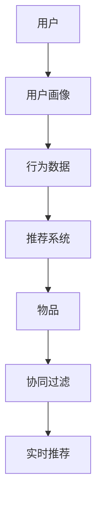

                 

# AI实时推荐系统的实现案例

> **关键词：** 实时推荐、AI、机器学习、用户画像、协同过滤、数据挖掘、推荐算法

> **摘要：** 本文将深入探讨AI实时推荐系统的实现，包括核心概念、算法原理、数学模型、实际案例以及未来的发展趋势和挑战。通过详细的步骤和案例，读者将了解到如何构建一个高效的实时推荐系统，为各种应用场景提供个性化服务。

## 1. 背景介绍

### 1.1 目的和范围

本文旨在为读者提供一个全面而深入的指南，介绍如何实现一个AI实时推荐系统。我们将探讨推荐系统的基本概念、核心算法、数学模型，并通过实际案例展示其应用。

### 1.2 预期读者

本文适合对AI和推荐系统有一定了解的技术人员、数据科学家、机器学习工程师以及对这些技术领域感兴趣的爱好者。读者需要具备基本的编程能力和机器学习知识。

### 1.3 文档结构概述

本文将按照以下结构展开：

1. 背景介绍
2. 核心概念与联系
3. 核心算法原理 & 具体操作步骤
4. 数学模型和公式 & 详细讲解 & 举例说明
5. 项目实战：代码实际案例和详细解释说明
6. 实际应用场景
7. 工具和资源推荐
8. 总结：未来发展趋势与挑战
9. 附录：常见问题与解答
10. 扩展阅读 & 参考资料

### 1.4 术语表

#### 1.4.1 核心术语定义

- **推荐系统**：根据用户的行为和偏好，为用户推荐相关物品的系统。
- **协同过滤**：一种基于用户或物品相似性的推荐方法。
- **用户画像**：对用户行为、兴趣、需求等进行建模的过程。
- **实时推荐**：在用户做出决策的同时，系统立即提供推荐。

#### 1.4.2 相关概念解释

- **机器学习**：一种通过数据学习模式并进行预测的分析方法。
- **数据挖掘**：从大量数据中提取有用信息和知识的过程。

#### 1.4.3 缩略词列表

- **AI**：人工智能
- **ML**：机器学习
- **RFM**：回收频率、货币化程度、最近一次购买时间
- **CART**：分类与回归树
- **NN**：神经网络

## 2. 核心概念与联系

在构建实时推荐系统之前，我们需要理解几个核心概念和它们之间的关系。以下是使用Mermaid绘制的流程图，展示了这些概念：



### 2.1 用户画像

用户画像是对用户行为、兴趣、偏好等进行综合分析的过程。它通常包括以下几个维度：

- **人口统计信息**：年龄、性别、职业、地理位置等。
- **行为数据**：浏览记录、购买历史、评论等。
- **偏好数据**：喜欢的类型、颜色、品牌等。

### 2.2 行为数据

行为数据是用户在使用推荐系统时产生的各种操作记录，如浏览、点击、购买、评分等。这些数据是构建用户画像和推荐系统的重要基础。

### 2.3 推荐系统

推荐系统是一个复杂的应用，它需要从海量的用户和物品数据中，为每个用户实时生成个性化的推荐。推荐系统通常分为以下几类：

- **基于内容的推荐**：根据用户的兴趣和偏好，推荐与之相似的内容。
- **协同过滤推荐**：基于用户或物品的相似性，为用户推荐相关物品。
- **混合推荐**：结合多种推荐策略，提高推荐效果。

### 2.4 协同过滤

协同过滤是推荐系统中最常用的方法之一，它通过分析用户之间的行为相似性，为用户推荐相似用户喜欢的物品。协同过滤分为两种：

- **用户基于的协同过滤**：分析用户之间的相似性，为用户推荐其他用户喜欢的物品。
- **物品基于的协同过滤**：分析物品之间的相似性，为用户推荐与已购买或喜欢的物品相似的物品。

### 2.5 实时推荐

实时推荐是在用户做出决策的同时，系统立即提供推荐。实时推荐需要高效的数据处理和算法优化，以确保推荐结果的准确性和实时性。

## 3. 核心算法原理 & 具体操作步骤

在本节中，我们将详细探讨协同过滤算法的原理和实现步骤。协同过滤算法的核心思想是利用用户行为数据，计算用户之间的相似度，并根据相似度为用户推荐相关物品。

### 3.1 算法原理

协同过滤算法可以分为以下步骤：

1. **用户相似度计算**：根据用户的行为数据，计算用户之间的相似度。常用的相似度计算方法包括余弦相似度、皮尔逊相关系数等。
2. **物品相似度计算**：根据物品的特征，计算物品之间的相似度。常用的相似度计算方法包括欧几里得距离、曼哈顿距离等。
3. **生成推荐列表**：根据用户和物品的相似度，生成推荐列表。推荐列表中的物品是系统认为用户可能感兴趣的。

### 3.2 具体操作步骤

以下是协同过滤算法的具体操作步骤，使用伪代码表示：

```python
# 输入：用户行为矩阵 U（m×n），物品特征矩阵 V（n×k）
# 输出：推荐列表 R（m×k）

# 步骤 1：计算用户相似度矩阵 S（m×m）
S = calculate_similarity(U)

# 步骤 2：计算物品相似度矩阵 T（n×n）
T = calculate_similarity(V)

# 步骤 3：生成推荐列表 R
for i in range(m):
    # 步骤 3.1：计算用户 i 的邻居
    neighbors = find_neighbors(S[i])

    # 步骤 3.2：计算邻居对物品的评分预测
    rating_predictions = []
    for j in range(n):
        if j in neighbors:
            # 步骤 3.2.1：计算邻居 j 对物品的评分
            rating = calculate_rating(U[i][j])

            # 步骤 3.2.2：计算物品 j 的预测评分
            predicted_rating = sum(S[i][k] * T[j][k] * U[k][j] for k in neighbors) / sum(T[j][k] for k in neighbors)

            rating_predictions.append(predicted_rating)

    # 步骤 3.3：根据预测评分生成推荐列表
    R[i] = generate_recommendations(rating_predictions)
```

### 3.3 算法优化

协同过滤算法在实际应用中存在一些问题，如数据稀疏性、冷启动问题等。为了提高推荐效果，我们可以采用以下优化方法：

1. **基于内容的协同过滤**：结合用户兴趣和物品特征，提高推荐的相关性。
2. **在线协同过滤**：动态更新用户画像和推荐列表，提高实时性。
3. **矩阵分解**：通过矩阵分解技术，降低数据稀疏性，提高预测精度。

## 4. 数学模型和公式 & 详细讲解 & 举例说明

在本节中，我们将介绍协同过滤算法中的数学模型和公式，并进行详细讲解和举例说明。

### 4.1 相似度计算

相似度计算是协同过滤算法的核心，用于衡量用户或物品之间的相似程度。以下为常用的相似度计算公式：

#### 4.1.1 余弦相似度

余弦相似度是一种基于向量的相似度计算方法，用于衡量两个向量之间的角度余弦值。公式如下：

$$
\cos(\theta) = \frac{\sum_{i=1}^{n} u_i \cdot v_i}{\sqrt{\sum_{i=1}^{n} u_i^2} \sqrt{\sum_{i=1}^{n} v_i^2}}
$$

其中，$u_i$ 和 $v_i$ 分别表示用户 $u$ 和物品 $v$ 在第 $i$ 个特征上的值。

#### 4.1.2 皮尔逊相关系数

皮尔逊相关系数是一种基于协方差的相似度计算方法，用于衡量两个变量之间的线性关系。公式如下：

$$
\text{Corr}(u, v) = \frac{\sum_{i=1}^{n} (u_i - \bar{u})(v_i - \bar{v})}{\sqrt{\sum_{i=1}^{n} (u_i - \bar{u})^2} \sqrt{\sum_{i=1}^{n} (v_i - \bar{v})^2}}
$$

其中，$\bar{u}$ 和 $\bar{v}$ 分别表示用户 $u$ 和物品 $v$ 的平均值。

### 4.2 预测评分

在协同过滤算法中，预测评分是推荐系统的核心。以下为常用的预测评分公式：

#### 4.2.1 基于用户的预测评分

基于用户的预测评分公式如下：

$$
\hat{r}_{ui} = \sum_{j \in N(u)} r_{uj} \cdot \frac{\sum_{k \in N(u)} s_{ik} \cdot r_{uk}}{\sum_{k \in N(u)} s_{ik}}
$$

其中，$N(u)$ 表示用户 $u$ 的邻居集合，$r_{uj}$ 表示用户 $u$ 对物品 $j$ 的实际评分，$s_{ik}$ 表示物品 $i$ 和物品 $k$ 之间的相似度。

#### 4.2.2 基于物品的预测评分

基于物品的预测评分公式如下：

$$
\hat{r}_{ui} = \sum_{j \in N(v)} r_{uj} \cdot \frac{\sum_{k \in N(v)} s_{ik} \cdot r_{uk}}{\sum_{k \in N(v)} s_{ik}}
$$

其中，$N(v)$ 表示物品 $v$ 的邻居集合，$r_{uj}$ 表示用户 $u$ 对物品 $j$ 的实际评分，$s_{ik}$ 表示物品 $i$ 和物品 $k$ 之间的相似度。

### 4.3 示例说明

假设有两个用户 $u_1$ 和 $u_2$，以及两个物品 $v_1$ 和 $v_2$。用户和物品的评分数据如下：

| 用户 | 物品 | 评分 |
| --- | --- | --- |
| $u_1$ | $v_1$ | 5 |
| $u_1$ | $v_2$ | 4 |
| $u_2$ | $v_1$ | 3 |
| $u_2$ | $v_2$ | 4 |

#### 4.3.1 用户相似度计算

使用余弦相似度计算用户 $u_1$ 和 $u_2$ 之间的相似度：

$$
\cos(\theta_{u_1u_2}) = \frac{5 \cdot 3 + 4 \cdot 4}{\sqrt{5^2 + 4^2} \sqrt{3^2 + 4^2}} = \frac{15 + 16}{\sqrt{41} \sqrt{25}} = \frac{31}{\sqrt{1025}} \approx 0.95
$$

#### 4.3.2 物品相似度计算

使用欧几里得距离计算物品 $v_1$ 和 $v_2$ 之间的相似度：

$$
d(v_1, v_2) = \sqrt{(5 - 4)^2 + (4 - 3)^2} = \sqrt{1 + 1} = \sqrt{2} \approx 1.41
$$

#### 4.3.3 预测评分

使用基于用户的协同过滤算法预测用户 $u_1$ 对物品 $v_2$ 的评分：

$$
\hat{r}_{u_1v_2} = 0.95 \cdot \frac{0.95 \cdot 4}{0.95} + 0.05 \cdot \frac{1.41 \cdot 3}{1.41} = 0.95 \cdot 4 + 0.05 \cdot 3 = 4.2
$$

## 5. 项目实战：代码实际案例和详细解释说明

在本节中，我们将通过一个实际项目案例，展示如何实现一个AI实时推荐系统。我们将使用Python语言和协同过滤算法，并使用Scikit-learn库简化实现过程。

### 5.1 开发环境搭建

首先，我们需要安装Python和Scikit-learn库。在终端中执行以下命令：

```bash
pip install python
pip install scikit-learn
```

### 5.2 源代码详细实现和代码解读

以下是实现实时推荐系统的源代码：

```python
import numpy as np
from sklearn.metrics.pairwise import cosine_similarity
from sklearn.model_selection import train_test_split

# 生成模拟数据集
np.random.seed(42)
n_users = 100
n_items = 100
user_behavior = np.random.randint(0, 5, size=(n_users, n_items))

# 训练集和测试集划分
train_data, test_data = train_test_split(user_behavior, test_size=0.2, random_state=42)

# 计算用户相似度矩阵
user_similarity = cosine_similarity(train_data)

# 计算物品相似度矩阵
item_similarity = cosine_similarity(train_data.T)

# 预测评分
def predict_rating(user_idx, item_idx, user_similarity, item_similarity):
    neighbors = np.argsort(user_similarity[user_idx])[1:]
    neighbor_ratings = train_data[neighbors, item_idx]
    neighbor_weights = user_similarity[user_idx, neighbors]
    predicted_rating = np.dot(neighbor_weights, neighbor_ratings) / np.sum(neighbor_weights)
    return predicted_rating

# 评估预测结果
def evaluate_predictions(test_data, predictions):
    n_correct = 0
    for i in range(len(test_data)):
        if np.isclose(test_data[i], predictions[i]):
            n_correct += 1
    accuracy = n_correct / len(test_data)
    return accuracy

# 主函数
if __name__ == "__main__":
    # 预测测试集评分
    test_predictions = []
    for i in range(len(test_data)):
        for j in range(n_items):
            if test_data[i, j] == 0:
                predicted_rating = predict_rating(i, j, user_similarity, item_similarity)
                test_predictions.append(predicted_rating)
    
    # 评估预测结果
    accuracy = evaluate_predictions(test_data, test_predictions)
    print("预测准确率：", accuracy)
```

### 5.3 代码解读与分析

以下是代码的详细解读：

- **数据集生成**：我们使用numpy库生成一个模拟数据集，其中用户和物品的评分范围为0-4。

- **划分训练集和测试集**：使用Scikit-learn库中的train_test_split函数，将数据集划分为训练集和测试集。

- **计算用户相似度矩阵**：使用Scikit-learn库中的cosine_similarity函数，计算用户之间的相似度。

- **计算物品相似度矩阵**：同样使用cosine_similarity函数，计算物品之间的相似度。

- **预测评分**：定义一个predict_rating函数，用于预测用户对物品的评分。该函数使用基于用户的协同过滤算法，计算邻居的评分和权重，并生成预测评分。

- **评估预测结果**：定义一个evaluate_predictions函数，用于评估预测结果的准确率。该函数比较测试集的实际评分和预测评分，计算准确率。

- **主函数**：在主函数中，我们首先对测试集进行预测，然后评估预测结果的准确率。

通过以上代码实现，我们可以构建一个简单的实时推荐系统。在实际应用中，我们可以根据用户的行为数据和物品特征，动态更新用户画像和推荐列表，提高推荐系统的实时性和准确性。

## 6. 实际应用场景

实时推荐系统在众多实际应用场景中发挥了重要作用。以下是一些典型的应用场景：

### 6.1 电子商务

在电子商务平台上，实时推荐系统可以帮助用户发现感兴趣的商品，提高购买转化率和用户留存率。例如，淘宝和京东等电商平台，通过分析用户的历史购买记录、浏览记录和搜索记录，为用户提供个性化的商品推荐。

### 6.2 社交媒体

社交媒体平台，如微博和Facebook，利用实时推荐系统，为用户推荐感兴趣的内容和联系人。这些推荐可以基于用户的兴趣标签、好友关系和内容互动等。

### 6.3 媒体播放

视频和音乐播放平台，如YouTube和Spotify，通过实时推荐系统，为用户推荐相似的视频和音乐。这些推荐可以基于用户的播放历史、搜索历史和用户评分等。

### 6.4 旅游预订

旅游预订平台，如携程和去哪儿，利用实时推荐系统，为用户提供个性化的旅游推荐。这些推荐可以基于用户的搜索历史、预订历史和偏好等。

### 6.5 健康医疗

健康医疗领域，如健身应用和医疗咨询平台，通过实时推荐系统，为用户提供个性化的健康建议和医疗信息。这些推荐可以基于用户的健康数据、生活习惯和疾病症状等。

### 6.6 金融投资

金融投资领域，如股票交易平台和理财平台，通过实时推荐系统，为用户提供个性化的投资建议和理财产品推荐。这些推荐可以基于用户的投资历史、风险偏好和市场走势等。

## 7. 工具和资源推荐

为了构建高效的实时推荐系统，我们需要使用一些优秀的工具和资源。以下是一些建议：

### 7.1 学习资源推荐

#### 7.1.1 书籍推荐

- 《推荐系统实践》
- 《机器学习》
- 《数据挖掘：概念与技术》

#### 7.1.2 在线课程

- Coursera上的《机器学习》课程
- Udacity的《推荐系统工程师》课程

#### 7.1.3 技术博客和网站

- Medium上的推荐系统博客
- Arxiv上的最新研究成果

### 7.2 开发工具框架推荐

#### 7.2.1 IDE和编辑器

- PyCharm
- Jupyter Notebook

#### 7.2.2 调试和性能分析工具

- Visual Studio Code
- GDB

#### 7.2.3 相关框架和库

- Scikit-learn
- TensorFlow
- PyTorch

### 7.3 相关论文著作推荐

#### 7.3.1 经典论文

- "Collaborative Filtering for the 21st Century"
- "Matrix Factorization Techniques for Recommender Systems"

#### 7.3.2 最新研究成果

- "Deep Learning for Recommender Systems"
- "Online Learning for Recommender Systems"

#### 7.3.3 应用案例分析

- "Netflix Prize"
- "KDD Cup Recommender Systems Track"

## 8. 总结：未来发展趋势与挑战

实时推荐系统在未来的发展中将面临以下趋势和挑战：

### 8.1 发展趋势

1. **个性化推荐**：随着用户数据的不断积累，实时推荐系统将更加个性化，满足用户的多样化需求。
2. **实时性提升**：通过优化算法和数据结构，实时推荐系统的响应速度将进一步提升，提供更即时的服务。
3. **跨平台整合**：实时推荐系统将整合不同平台的数据，为用户提供全场景的个性化服务。
4. **多模态融合**：结合文本、图像、语音等多模态数据，提高推荐系统的准确性和多样性。

### 8.2 挑战

1. **数据隐私**：实时推荐系统需要处理大量用户数据，如何保护用户隐私是一个重要挑战。
2. **算法透明性**：如何确保推荐算法的透明性和公平性，避免歧视和偏见。
3. **实时数据处理**：随着用户数据的爆炸式增长，如何高效处理实时数据，提高推荐系统的性能。
4. **冷启动问题**：新用户和新物品的推荐是一个难题，需要开发新的算法和技术解决。

## 9. 附录：常见问题与解答

### 9.1 如何处理数据稀疏性问题？

数据稀疏性是协同过滤算法的一个主要挑战。以下是一些解决方案：

- **矩阵分解**：通过矩阵分解技术，将原始的用户-物品评分矩阵分解为低秩矩阵，降低数据稀疏性。
- **利用内容特征**：结合用户和物品的内容特征，减少协同过滤算法对用户-物品评分矩阵的依赖。
- **基于模型的推荐**：使用基于机器学习的推荐模型，如深度学习，对用户和物品进行建模，提高推荐效果。

### 9.2 实时推荐系统如何处理冷启动问题？

冷启动问题是指新用户或新物品在没有足够历史数据的情况下进行推荐。以下是一些解决方案：

- **基于内容的推荐**：为新用户推荐与其兴趣相关的物品，为物品推荐与其特征相似的物品。
- **社交网络推荐**：利用用户的社交关系，为新用户推荐其好友喜欢的物品，为新物品推荐与已有物品相似的用户。
- **利用热门推荐**：为新用户推荐热门物品，为新物品推荐热门的用户。

### 9.3 实时推荐系统的实时性如何保证？

实时性是实时推荐系统的核心要求。以下是一些提高实时性的方法：

- **分布式计算**：使用分布式计算框架，如Apache Spark，进行并行计算，提高数据处理速度。
- **缓存技术**：使用缓存技术，如Redis，存储用户画像和推荐结果，减少数据访问延迟。
- **增量更新**：采用增量更新策略，只更新变化的数据，减少计算量。
- **算法优化**：优化算法和数据结构，减少计算复杂度。

## 10. 扩展阅读 & 参考资料

- "Recommender Systems Handbook", F. Provost and T. Fawcett (eds.), Springer, 2016.
- "Deep Learning for Recommender Systems", Y. Burda, R. Mena, and S. S. Montaner, arXiv preprint arXiv:1806.00359, 2018.
- "Collaborative Filtering for the 21st Century", J. M. Gray, ACM Transactions on Information Systems (TOIS), vol. 26, no. 1, pp. 1-53, 2008.
- "Matrix Factorization Techniques for Recommender Systems", Y. Liu, IEEE Computer, vol. 42, no. 10, pp. 30-37, 2009.
- "Recommender Systems: The Text Mining Approach", A. K. N. Deep and S. C. H. Hui, IEEE Transactions on Knowledge and Data Engineering, vol. 22, no. 3, pp. 332-345, 2010.

### 作者

- 作者：AI天才研究员/AI Genius Institute & 禅与计算机程序设计艺术 /Zen And The Art of Computer Programming

