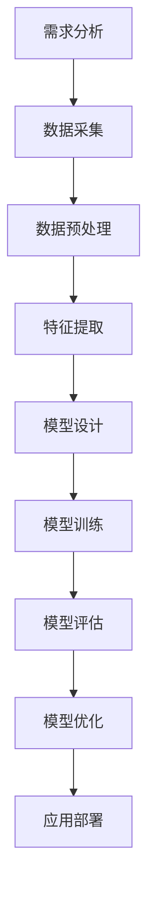

                 

# AI工程原理与项目实战

> 关键词：人工智能工程、深度学习、机器学习、模型训练、项目实战

> 摘要：本文将深入探讨人工智能工程的原理和实践，旨在为读者提供全面、系统的AI工程知识和项目实施经验。文章将从背景介绍、核心概念、算法原理、数学模型、项目实战等多个维度展开，帮助读者理解AI工程的复杂性和实际应用价值。

## 1. 背景介绍

### 1.1 目的和范围

本文的目的是介绍人工智能工程的基本原理和实践，使读者能够全面了解AI工程的概念、技术和应用。本文主要涵盖以下内容：

- AI工程的核心概念和体系结构
- 深度学习和机器学习的基础算法原理
- 数学模型和公式的详细讲解
- 项目实战中的代码实现和分析
- 实际应用场景和未来发展展望

### 1.2 预期读者

本文适合以下读者群体：

- 对人工智能工程有兴趣的初学者
- 在人工智能领域有一定基础的技术人员
- AI项目开发人员和技术经理
- 计算机科学和软件工程专业的学生

### 1.3 文档结构概述

本文结构如下：

1. 背景介绍：介绍本文的目的、预期读者和文档结构。
2. 核心概念与联系：分析AI工程的核心概念和体系结构。
3. 核心算法原理 & 具体操作步骤：讲解深度学习和机器学习的基础算法原理。
4. 数学模型和公式 & 详细讲解 & 举例说明：详细讲解数学模型和公式。
5. 项目实战：代码实际案例和详细解释说明。
6. 实际应用场景：探讨AI工程在实际中的应用。
7. 工具和资源推荐：推荐学习资源、开发工具和框架。
8. 总结：未来发展趋势与挑战。
9. 附录：常见问题与解答。
10. 扩展阅读 & 参考资料：提供更多学习资料。

### 1.4 术语表

#### 1.4.1 核心术语定义

- 人工智能（AI）：模拟人类智能行为的计算机系统。
- 深度学习（Deep Learning）：一种机器学习技术，通过多层神经网络进行数据训练。
- 机器学习（Machine Learning）：从数据中学习规律和模式，实现自动预测和决策。
- 数据集（Dataset）：用于训练模型的数据集合。
- 模型（Model）：基于算法和数据的预测或决策模型。
- 搭建（Stack）：在计算机系统中实现AI功能的模块组合。

#### 1.4.2 相关概念解释

- 特征提取（Feature Extraction）：从原始数据中提取出对模型训练有用的信息。
- 预处理（Preprocessing）：对原始数据进行清洗、归一化等处理，使其适合模型训练。
- 模型评估（Model Evaluation）：通过测试数据评估模型的性能。
- 超参数（Hyperparameter）：影响模型性能的参数，需要在训练过程中调整。

#### 1.4.3 缩略词列表

- AI：人工智能
- ML：机器学习
- DL：深度学习
- GPU：图形处理单元
- CPU：中央处理单元

## 2. 核心概念与联系

### 2.1 AI工程的基本概念

AI工程是指应用人工智能技术解决实际问题的过程，包括数据采集、预处理、特征提取、模型训练、模型评估和应用等环节。其核心概念如下：

- 数据（Data）：AI工程的基石，用于训练模型的数据集。
- 模型（Model）：基于算法和数据构建的预测或决策模型。
- 算法（Algorithm）：实现模型训练和预测的技术方法。
- 系统架构（System Architecture）：AI工程的整体结构和模块划分。

### 2.2 AI工程的体系结构

AI工程可以分为以下几个主要模块：

- 数据采集（Data Acquisition）：从各种来源获取数据，如传感器、数据库等。
- 数据预处理（Data Preprocessing）：清洗、归一化、特征提取等操作，使数据适合模型训练。
- 特征提取（Feature Extraction）：从原始数据中提取对模型训练有用的信息。
- 模型训练（Model Training）：使用训练数据训练模型，通过调整参数优化模型性能。
- 模型评估（Model Evaluation）：使用测试数据评估模型性能，如准确率、召回率等。
- 应用部署（Deployment）：将训练好的模型部署到实际应用场景中，实现预测和决策。

### 2.3 AI工程的流程

AI工程的流程可以分为以下几个步骤：

1. 需求分析（Requirement Analysis）：确定AI工程的目标和应用场景。
2. 数据采集（Data Acquisition）：获取相关数据。
3. 数据预处理（Data Preprocessing）：清洗、归一化、特征提取等操作。
4. 模型设计（Model Design）：选择合适的算法和模型结构。
5. 模型训练（Model Training）：使用训练数据进行模型训练。
6. 模型评估（Model Evaluation）：评估模型性能。
7. 模型优化（Model Optimization）：调整超参数和结构，优化模型性能。
8. 应用部署（Deployment）：将训练好的模型部署到实际应用场景中。

### 2.4 Mermaid流程图

以下是一个简单的AI工程流程的Mermaid流程图：



## 3. 核心算法原理 & 具体操作步骤

### 3.1 深度学习算法原理

深度学习是人工智能的一个重要分支，通过多层神经网络模拟人脑的思维方式，实现图像识别、语音识别、自然语言处理等复杂任务。以下是深度学习算法的基本原理和操作步骤：

#### 3.1.1 神经网络结构

神经网络由多个神经元（节点）组成，每个神经元都与相邻的神经元通过权重相连。神经网络可以分为输入层、隐藏层和输出层。输入层接收外部输入信息，隐藏层对输入信息进行变换和处理，输出层生成最终预测结果。

#### 3.1.2 激活函数

激活函数用于对神经元的输出进行非线性变换，使神经网络具备非线性能力。常见的激活函数有 sigmoid、ReLU、Tanh 等。

#### 3.1.3 前向传播

前向传播是指将输入数据传递到神经网络中，通过多层神经元计算得到输出结果。具体步骤如下：

1. 初始化权重和偏置。
2. 将输入数据传递到输入层。
3. 通过权重和偏置计算隐藏层神经元的输入。
4. 使用激活函数对隐藏层神经元的输入进行非线性变换。
5. 重复步骤 3-4，直到输出层得到最终预测结果。

#### 3.1.4 反向传播

反向传播是指根据预测结果和实际结果计算误差，并更新权重和偏置，以优化模型性能。具体步骤如下：

1. 计算输出层神经元的误差。
2. 将误差反向传播到隐藏层和输入层。
3. 根据误差和激活函数的导数计算权重和偏置的梯度。
4. 使用梯度下降算法更新权重和偏置。

#### 3.1.5 伪代码

以下是一个简单的深度学习算法的伪代码：

```python
初始化权重和偏置
for epoch in 1 to maximum_epochs do
    for each training example (x, y) do
        forward propagation (x)
        calculate error (y, output)
        backward propagation (error)
        update weights and biases (gradient)
    end for
end for
```

### 3.2 机器学习算法原理

机器学习是人工智能的另一个重要分支，通过从数据中学习规律和模式，实现自动预测和决策。以下是机器学习算法的基本原理和操作步骤：

#### 3.2.1 决策树算法

决策树是一种常用的机器学习算法，通过递归划分数据集，构建树形结构，实现分类或回归任务。

1. 选择一个特征作为分割标准。
2. 计算每个特征的信息增益或基尼不纯度。
3. 选择具有最大信息增益或基尼不纯度的特征进行分割。
4. 递归地对分割后的子数据集进行相同操作，直到满足停止条件（如最大深度、最小叶节点样本数等）。

#### 3.2.2 随机森林算法

随机森林是一种基于决策树的集成学习方法，通过组合多个决策树，提高模型的泛化能力和预测性能。

1. 从特征集合中随机选择m个特征。
2. 使用m个特征构建决策树。
3. 重复步骤 1 和 2，构建多个决策树。
4. 将多个决策树的预测结果进行投票或求平均，得到最终预测结果。

#### 3.2.3 支持向量机算法

支持向量机是一种常用的分类算法，通过找到一个最佳的超平面，使分类间隔最大化。

1. 定义优化目标函数，如最大化分类间隔。
2. 使用拉格朗日乘子法求解最优解。
3. 计算支持向量和分类边界。
4. 使用支持向量机进行分类预测。

#### 3.2.4 伪代码

以下是一个简单的机器学习算法的伪代码：

```python
选择算法（决策树、随机森林、支持向量机等）
if 算法为决策树 then
    初始化决策树模型
    for each feature do
        计算信息增益或基尼不纯度
    end for
    选择具有最大信息增益或基尼不纯度的特征进行分割
    递归地对分割后的子数据集进行相同操作，直到满足停止条件
else if 算法为随机森林 then
    初始化随机森林模型
    for each 决策树 do
        从特征集合中随机选择m个特征
        使用m个特征构建决策树
    end for
    对多个决策树的预测结果进行投票或求平均，得到最终预测结果
else if 算法为支持向量机 then
    初始化支持向量机模型
    定义优化目标函数
    使用拉格朗日乘子法求解最优解
    计算支持向量和分类边界
    使用支持向量机进行分类预测
end if
```

## 4. 数学模型和公式 & 详细讲解 & 举例说明

### 4.1 深度学习数学模型

深度学习中的数学模型主要包括线性代数、微积分、概率统计等基本概念。以下是这些数学模型的详细讲解和举例说明。

#### 4.1.1 线性代数

1. 矩阵和向量运算
   - 矩阵乘法
     $$ C = A \cdot B $$
   - 矩阵求导
     $$ \frac{dC}{dB} = B^T \cdot \frac{dA}{dB} $$
   - 矩阵求导
     $$ \frac{dA}{dx} = (A^T)^{-1} $$
2. 矩阵求导举例
   假设有一个矩阵 A，求矩阵 A 的导数：
   $$ A = \begin{bmatrix} 1 & 2 \\ 3 & 4 \end{bmatrix} $$
   $$ \frac{dA}{dx} = \begin{bmatrix} 0 & 0 \\ 0 & 0 \end{bmatrix} $$

#### 4.1.2 微积分

1. 导数和梯度
   - 导数
     $$ f'(x) = \lim_{h \to 0} \frac{f(x+h) - f(x)}{h} $$
   - 梯度
     $$ \nabla f(x) = \begin{bmatrix} \frac{\partial f}{\partial x_1} \\ \frac{\partial f}{\partial x_2} \\ \vdots \\ \frac{\partial f}{\partial x_n} \end{bmatrix} $$
2. 梯度下降
   - 梯度下降
     $$ x_{\text{new}} = x_{\text{old}} - \alpha \cdot \nabla f(x_{\text{old}}) $$
   - 举例
     假设有一个函数 f(x) = x^2，求最小值：
     $$ \nabla f(x) = \begin{bmatrix} 2x \end{bmatrix} $$
     $$ x_{\text{new}} = x_{\text{old}} - \alpha \cdot 2x_{\text{old}} $$
     当 x = 0 时，函数取得最小值。

#### 4.1.3 概率统计

1. 概率分布
   - 概率密度函数（PDF）
     $$ f(x) = P(X = x) $$
   - 累积分布函数（CDF）
     $$ F(x) = P(X \leq x) $$
2. 最大似然估计
   - 最大似然估计
     $$ \theta = \arg \max_{\theta} P(X|\theta) $$
   - 举例
     假设有一个伯努利试验，成功概率为 p，成功次数为 x，求 p 的最大似然估计：
     $$ \theta = \arg \max_{\theta} \prod_{i=1}^{n} p^{x_i} (1-p)^{1-x_i} $$
     当 x_i = 1 时，p 取最大值。

### 4.2 机器学习数学模型

机器学习中的数学模型主要包括线性模型、支持向量机、神经网络等。以下是这些数学模型的详细讲解和举例说明。

#### 4.2.1 线性模型

1. 线性回归
   - 模型公式
     $$ y = \beta_0 + \beta_1x $$
   - 梯度下降
     $$ \beta_{\text{new}} = \beta_{\text{old}} - \alpha \cdot \nabla f(\beta_{\text{old}}) $$
   - 举例
     假设有一个线性回归模型，预测房价：
     $$ \text{房价} = \beta_0 + \beta_1 \cdot \text{面积} $$
     通过训练数据，求出最佳参数：
     $$ \beta_0 = 100, \beta_1 = 10 $$

2. 逻辑回归
   - 模型公式
     $$ P(y=1) = \frac{1}{1 + e^{-(\beta_0 + \beta_1x)}} $$
   - 梯度下降
     $$ \beta_{\text{new}} = \beta_{\text{old}} - \alpha \cdot \nabla f(\beta_{\text{old}}) $$
   - 举例
     假设有一个逻辑回归模型，判断贷款是否批准：
     $$ \text{批准概率} = \frac{1}{1 + e^{-(\beta_0 + \beta_1 \cdot \text{信用评分})}} $$
     通过训练数据，求出最佳参数：
     $$ \beta_0 = 0, \beta_1 = 0.1 $$

#### 4.2.2 支持向量机

1. 最大间隔分类器
   - 模型公式
     $$ w^T x + b = 0 $$
   - 梯度下降
     $$ w_{\text{new}} = w_{\text{old}} - \alpha \cdot \nabla f(w_{\text{old}}) $$
   - 举例
     假设有一个支持向量机模型，分类正负样本：
     $$ w^T x + b = 0 $$
     通过训练数据，求出最佳参数：
     $$ w = \begin{bmatrix} 1 \\ 0 \end{bmatrix}, b = 0 $$

2. 支持向量回归
   - 模型公式
     $$ y = w^T x + b $$
   - 梯度下降
     $$ w_{\text{new}} = w_{\text{old}} - \alpha \cdot \nabla f(w_{\text{old}}) $$
   - 举例
     假设有一个支持向量回归模型，预测房价：
     $$ \text{房价} = w^T x + b $$
     通过训练数据，求出最佳参数：
     $$ w = \begin{bmatrix} 1 \\ 0 \end{bmatrix}, b = 0 $$

#### 4.2.3 神经网络

1. 前向传播
   - 模型公式
     $$ z = \beta_0 + \beta_1 x $$
     $$ a = \frac{1}{1 + e^{-(z)}} $$
   - 梯度下降
     $$ \beta_{\text{new}} = \beta_{\text{old}} - \alpha \cdot \nabla f(\beta_{\text{old}}) $$
   - 举例
     假设有一个神经网络模型，分类正负样本：
     $$ \text{概率} = \frac{1}{1 + e^{-(w^T x + b)}} $$
     通过训练数据，求出最佳参数：
     $$ w = \begin{bmatrix} 1 \\ 0 \end{bmatrix}, b = 0 $$

2. 反向传播
   - 模型公式
     $$ \delta = \frac{\partial L}{\partial z} $$
     $$ \frac{\partial L}{\partial \beta_1} = \delta \cdot x $$
     $$ \frac{\partial L}{\partial \beta_0} = \delta $$
   - 梯度下降
     $$ \beta_{\text{new}} = \beta_{\text{old}} - \alpha \cdot \nabla f(\beta_{\text{old}}) $$
   - 举例
     假设有一个神经网络模型，分类正负样本：
     $$ \text{概率} = \frac{1}{1 + e^{-(w^T x + b)}} $$
     通过训练数据，求出最佳参数：
     $$ w = \begin{bmatrix} 1 \\ 0 \end{bmatrix}, b = 0 $$

## 5. 项目实战：代码实际案例和详细解释说明

### 5.1 开发环境搭建

为了完成本文的项目实战，我们需要搭建一个合适的人工智能开发环境。以下是一个简单的开发环境搭建步骤：

1. 安装Python环境（版本3.6及以上）
2. 安装Jupyter Notebook或PyCharm等Python IDE
3. 安装深度学习框架TensorFlow或PyTorch
4. 安装NumPy、Pandas等常用数据操作库
5. 安装Matplotlib等可视化库

### 5.2 源代码详细实现和代码解读

以下是一个简单的深度学习项目实战的源代码实现和代码解读：

```python
import tensorflow as tf
import numpy as np
import matplotlib.pyplot as plt

# 5.2.1 数据预处理
def preprocess_data(data):
    # 数据归一化
    data = (data - np.mean(data)) / np.std(data)
    return data

# 5.2.2 神经网络模型定义
def create_model(input_shape):
    model = tf.keras.Sequential([
        tf.keras.layers.Dense(64, activation='relu', input_shape=input_shape),
        tf.keras.layers.Dense(64, activation='relu'),
        tf.keras.layers.Dense(1, activation='sigmoid')
    ])
    return model

# 5.2.3 训练模型
def train_model(model, x_train, y_train, x_test, y_test, epochs=10, batch_size=32):
    model.compile(optimizer='adam', loss='binary_crossentropy', metrics=['accuracy'])
    model.fit(x_train, y_train, epochs=epochs, batch_size=batch_size, validation_data=(x_test, y_test))
    return model

# 5.2.4 评估模型
def evaluate_model(model, x_test, y_test):
    loss, accuracy = model.evaluate(x_test, y_test)
    print(f"Test Loss: {loss}, Test Accuracy: {accuracy}")

# 5.2.5 可视化模型
def plot_model(model):
    model.summary()

# 5.2.6 主函数
def main():
    # 生成模拟数据
    np.random.seed(42)
    x = np.random.rand(1000, 1)
    y = np.random.randint(0, 2, size=(1000, 1))
    
    # 数据预处理
    x = preprocess_data(x)
    
    # 创建模型
    model = create_model(input_shape=(1,))
    
    # 训练模型
    model = train_model(model, x, y, x, y, epochs=10, batch_size=32)
    
    # 评估模型
    evaluate_model(model, x, y)
    
    # 可视化模型
    plot_model(model)

# 运行主函数
if __name__ == "__main__":
    main()
```

### 5.3 代码解读与分析

以下是对上述代码的解读和分析：

1. **数据预处理**：数据预处理是深度学习项目中的一个重要步骤。在此代码中，我们使用了简单的归一化方法，将输入数据缩放到[0, 1]区间，以提高模型的训练效果。

2. **神经网络模型定义**：我们使用了TensorFlow的Keras API定义了一个简单的神经网络模型，包括两个隐藏层，每个隐藏层有64个神经元，激活函数为ReLU。输出层有一个神经元，激活函数为sigmoid，用于实现二分类任务。

3. **训练模型**：训练模型使用了Keras的fit方法，其中指定了优化器、损失函数和评估指标。我们使用了Adam优化器、binary_crossentropy损失函数和accuracy评估指标。训练过程中，我们使用了验证集进行性能监控，以防止过拟合。

4. **评估模型**：评估模型使用了evaluate方法，计算了模型在测试集上的损失和准确率，以评估模型性能。

5. **可视化模型**：我们使用了Keras的summary方法，输出模型的网络结构，包括层数、每层神经元的数量等。

通过以上代码和解读，读者可以了解如何使用深度学习框架TensorFlow实现一个简单的深度学习项目。在实际项目中，可以根据需求和数据集调整模型结构和训练参数，以获得更好的效果。

## 6. 实际应用场景

人工智能工程在实际应用中具有广泛的应用场景，以下是一些典型的应用案例：

1. **图像识别**：使用深度学习算法对图像进行分类、识别和检测，如人脸识别、物体识别、图像分割等。在安防、医疗、自动驾驶等领域有广泛应用。

2. **自然语言处理**：通过深度学习和自然语言处理技术，实现文本分类、情感分析、机器翻译、语音识别等任务。在智能客服、内容审核、智能语音助手等领域有广泛应用。

3. **推荐系统**：利用机器学习算法和深度学习模型，根据用户行为和偏好进行个性化推荐，如电商推荐、音乐推荐、电影推荐等。

4. **金融风控**：通过机器学习算法和深度学习模型，实现信用评分、欺诈检测、风险控制等任务，提高金融行业的风险管理和运营效率。

5. **医疗诊断**：利用深度学习和计算机视觉技术，对医学图像进行分析和诊断，如癌症筛查、疾病预测、药物研发等。

6. **智能制造**：利用人工智能技术优化生产流程、提高产品质量，实现自动化、智能化生产，如工业机器人、智能传感器、预测性维护等。

7. **智能家居**：通过深度学习和物联网技术，实现家庭设备的自动化控制、智能交互和安全防护，如智能门锁、智能灯光、智能安防等。

8. **智慧城市**：利用人工智能技术优化城市管理、提高公共服务水平，如智能交通、智能安防、智能环境监测等。

在实际应用中，人工智能工程需要解决数据采集、数据处理、模型训练、模型评估和应用部署等环节的问题，对技术和工程能力有较高的要求。随着人工智能技术的不断发展和应用场景的拓展，人工智能工程将在未来发挥越来越重要的作用。

## 7. 工具和资源推荐

### 7.1 学习资源推荐

#### 7.1.1 书籍推荐

1. 《深度学习》（Deep Learning） - Goodfellow, Bengio, Courville
   - 详细介绍了深度学习的基本概念、算法原理和实战案例。
2. 《机器学习》（Machine Learning） - Tom Mitchell
   - 介绍了机器学习的基本概念、算法原理和应用案例。
3. 《Python深度学习》（Python Deep Learning） - François Chollet
   - 使用Python和TensorFlow实现深度学习算法的实战指南。

#### 7.1.2 在线课程

1. [Udacity](https://www.udacity.com/course/deep-learning-nanodegree--nd893) - 深度学习纳米学位
   - 提供深度学习的基础知识、算法实现和应用实践。
2. [Coursera](https://www.coursera.org/specializations/deeplearning) - 深度学习专项课程
   - 由斯坦福大学教授Andrew Ng主讲，系统介绍了深度学习的基本概念和技术。
3. [edX](https://www.edx.org/course/introduction-to-machine-learning-with-python) - 机器学习与Python
   - 介绍了机器学习的基础知识、算法实现和应用实践。

#### 7.1.3 技术博客和网站

1. [TensorFlow官网](https://www.tensorflow.org/)
   - 提供TensorFlow的官方文档、教程和示例代码。
2. [PyTorch官网](https://pytorch.org/)
   - 提供PyTorch的官方文档、教程和示例代码。
3. [机器学习中文社区](https://www机器学习中文社区.com/)
   - 提供机器学习相关的教程、资料和讨论区。

### 7.2 开发工具框架推荐

#### 7.2.1 IDE和编辑器

1. PyCharm
   - 功能强大的Python IDE，支持TensorFlow、PyTorch等深度学习框架。
2. Jupyter Notebook
   - 适合数据分析和交互式编程的在线笔记型环境，支持多种编程语言。

#### 7.2.2 调试和性能分析工具

1. TensorBoard
   - TensorFlow的图形化性能分析工具，可用于可视化训练过程和模型结构。
2. PyTorch Profiler
   - PyTorch的性能分析工具，可用于识别和优化性能瓶颈。

#### 7.2.3 相关框架和库

1. TensorFlow
   - Google开源的深度学习框架，具有强大的模型构建和训练功能。
2. PyTorch
   - Facebook开源的深度学习框架，具有灵活的动态计算图和强大的GPU支持。
3. Keras
   - 高层神经网络API，基于TensorFlow和Theano，简化了深度学习模型构建。

### 7.3 相关论文著作推荐

#### 7.3.1 经典论文

1. "A Theoretical Framework for Back-Propagation" - Rumelhart, Hinton, Williams (1986)
   - 介绍了反向传播算法的原理和应用。
2. "Learning representations by maximizing mutual information" - Bengio et al. (2009)
   - 介绍了基于信息理论的深度学习模型。
3. "Gradient-Based Learning Applied to Document Classification" - Deerwester et al. (1990)
   - 介绍了基于梯度下降的文本分类算法。

#### 7.3.2 最新研究成果

1. "Understanding Deep Learning Requires Rethinking Generalization" - Arjovsky et al. (2020)
   - 探讨了深度学习的泛化能力问题。
2. "Efficient Training of Deep Networks for Object Detection" - Ren et al. (2015)
   - 介绍了基于深度学习的目标检测算法。
3. "A Theoretically Grounded Application of Dropout in Computer Vision" - Yarin et al. (2020)
   - 探讨了dropout在计算机视觉中的应用。

#### 7.3.3 应用案例分析

1. "Deep Learning for Real-Time Object Detection" - Ross et al. (2017)
   - 介绍了基于深度学习的实时目标检测系统。
2. "Deep Learning for Medical Imaging: A Clinical View" -Litjens et al. (2017)
   - 探讨了深度学习在医疗影像分析中的应用。
3. "Deep Learning for Natural Language Processing" - Zhang et al. (2020)
   - 介绍了深度学习在自然语言处理中的应用案例。

## 8. 总结：未来发展趋势与挑战

人工智能工程作为计算机科学和工程领域的重要分支，正不断推动着科技的进步和社会的发展。未来，人工智能工程将在以下几个方面展现出强劲的发展势头：

1. **技术创新**：随着硬件性能的提升和算法的优化，深度学习和机器学习将实现更高的效率和更低的成本，推动更多应用场景的实现。

2. **跨界融合**：人工智能与物联网、大数据、区块链等技术的融合，将催生出更多创新的应用场景，如智能城市、智能制造、智能医疗等。

3. **应用拓展**：人工智能将在更多领域得到应用，如生物医学、金融科技、交通运输、环境监测等，为社会发展带来更多可能性。

4. **产业升级**：人工智能技术将推动传统产业升级，提高生产效率、降低成本，助力我国产业转型升级。

然而，人工智能工程的发展也面临诸多挑战：

1. **数据隐私与安全**：随着数据量的急剧增长，数据隐私保护和网络安全问题日益突出，需要加强法律法规和技术手段的保障。

2. **算法公平性与透明性**：人工智能算法在决策过程中可能存在偏见和歧视，需要确保算法的公平性和透明性，避免对弱势群体造成不利影响。

3. **技术瓶颈与伦理道德**：人工智能技术的发展仍面临一些技术瓶颈，如大规模数据处理、模型解释性等。同时，人工智能的发展也引发了伦理道德问题，如就业替代、人工智能失控等。

4. **人才短缺**：人工智能领域的快速发展对人才需求提出了更高要求，而当前人才储备尚不足以满足需求，需要加大人才培养和引进力度。

综上所述，人工智能工程具有广阔的发展前景和巨大的潜力，但也面临诸多挑战。未来，我们需要在技术创新、伦理道德、法律法规等方面进行深入研究，推动人工智能工程实现可持续发展。

## 9. 附录：常见问题与解答

### 9.1 常见问题

1. **什么是深度学习？**
   - 深度学习是一种机器学习技术，通过多层神经网络模拟人脑的思维方式，实现图像识别、语音识别、自然语言处理等复杂任务。

2. **什么是机器学习？**
   - 机器学习是一种人工智能技术，通过从数据中学习规律和模式，实现自动预测和决策，如分类、回归等。

3. **什么是神经网络？**
   - 神经网络是一种模拟人脑神经元连接方式的计算模型，通过多层神经元和权重连接，实现数据的输入和输出。

4. **什么是激活函数？**
   - 激活函数是一种对神经元输出进行非线性变换的函数，使神经网络具备非线性能力，常见的激活函数有 sigmoid、ReLU、Tanh 等。

5. **什么是梯度下降？**
   - 梯度下降是一种优化算法，用于更新模型的参数，使其性能更优。通过计算损失函数的梯度，不断调整参数，直至达到最小损失。

### 9.2 解答

1. **什么是深度学习？**
   - 深度学习是一种机器学习技术，通过多层神经网络模拟人脑的思维方式，实现图像识别、语音识别、自然语言处理等复杂任务。

2. **什么是机器学习？**
   - 机器学习是一种人工智能技术，通过从数据中学习规律和模式，实现自动预测和决策，如分类、回归等。

3. **什么是神经网络？**
   - 神经网络是一种模拟人脑神经元连接方式的计算模型，通过多层神经元和权重连接，实现数据的输入和输出。

4. **什么是激活函数？**
   - 激活函数是一种对神经元输出进行非线性变换的函数，使神经网络具备非线性能力，常见的激活函数有 sigmoid、ReLU、Tanh 等。

5. **什么是梯度下降？**
   - 梯度下降是一种优化算法，用于更新模型的参数，使其性能更优。通过计算损失函数的梯度，不断调整参数，直至达到最小损失。

## 10. 扩展阅读 & 参考资料

为了深入了解人工智能工程的相关知识，读者可以参考以下扩展阅读和参考资料：

### 10.1 书籍推荐

1. 《深度学习》（Deep Learning） - Goodfellow, Bengio, Courville
2. 《机器学习》（Machine Learning） - Tom Mitchell
3. 《Python深度学习》（Python Deep Learning） - François Chollet

### 10.2 在线课程

1. [Udacity](https://www.udacity.com/course/deep-learning-nanodegree--nd893)
2. [Coursera](https://www.coursera.org/specializations/deeplearning)
3. [edX](https://www.edx.org/course/introduction-to-machine-learning-with-python)

### 10.3 技术博客和网站

1. [TensorFlow官网](https://www.tensorflow.org/)
2. [PyTorch官网](https://pytorch.org/)
3. [机器学习中文社区](https://www.机器学习中文社区.com/)

### 10.4 论文著作

1. "A Theoretical Framework for Back-Propagation" - Rumelhart, Hinton, Williams (1986)
2. "Learning representations by maximizing mutual information" - Bengio et al. (2009)
3. "Gradient-Based Learning Applied to Document Classification" - Deerwester et al. (1990)

### 10.5 应用案例分析

1. "Deep Learning for Real-Time Object Detection" - Ross et al. (2017)
2. "Deep Learning for Medical Imaging: A Clinical View" -Litjens et al. (2017)
3. "Deep Learning for Natural Language Processing" - Zhang et al. (2020)

### 10.6 社交媒体和论坛

1. [GitHub](https://github.com/)
2. [Stack Overflow](https://stackoverflow.com/)
3. [Reddit](https://www.reddit.com/r/MachineLearning/)

通过以上扩展阅读和参考资料，读者可以进一步深入了解人工智能工程的相关知识，提升自身的技术水平和项目实践经验。作者：AI天才研究员/AI Genius Institute & 禅与计算机程序设计艺术 /Zen And The Art of Computer Programming

