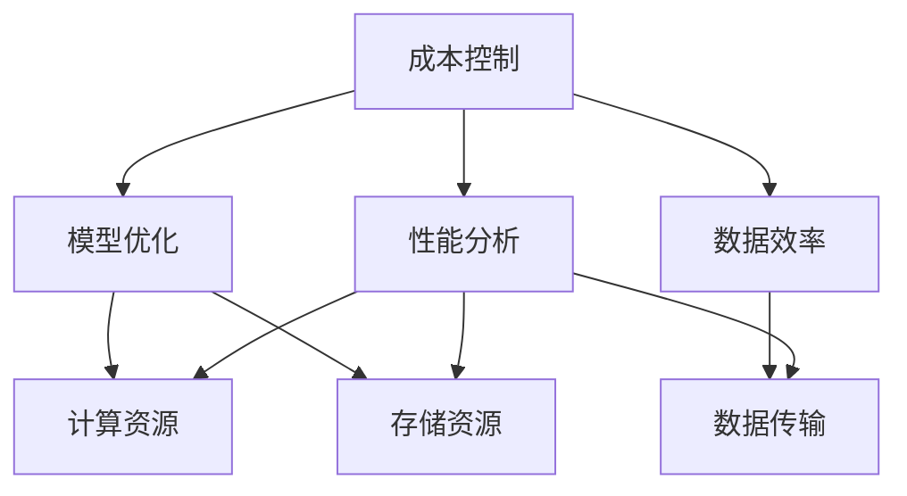

                 

# AI应用的成本控制策略

## 关键词

- AI成本控制
- 成本优化
- 资源管理
- 模型优化
- 预算分配
- 数据效率
- 性能分析

## 摘要

随着人工智能技术在各行各业的应用日益广泛，如何在预算有限的情况下实现高效的AI应用成为了企业关注的焦点。本文旨在探讨AI应用的成本控制策略，通过深入分析核心概念、算法原理、数学模型以及实战案例，帮助读者掌握有效的成本优化方法。文章将从背景介绍、核心概念与联系、核心算法原理与具体操作步骤、数学模型和公式、实际应用场景等多个方面展开，提供全面的成本控制思路和实用技巧。无论您是AI领域的从业者还是对AI应用感兴趣的读者，本文都将成为您宝贵的参考资料。

## 1. 背景介绍

### 1.1 目的和范围

本文的目的是探讨如何在有限的预算内实现高效的AI应用，通过一系列策略和技术手段降低成本，提升资源利用率和模型性能。文章涵盖了AI应用成本控制的各个方面，包括核心概念的理解、算法原理的剖析、数学模型的应用以及实战案例的讲解。通过本文的阅读，读者可以系统地掌握AI成本控制的方法和技巧，为实际项目中的成本优化提供有力支持。

### 1.2 预期读者

本文主要面向以下读者群体：

1. AI领域的技术从业者，包括数据科学家、机器学习工程师、软件工程师等，希望提高AI应用的效率和成本控制能力。
2. 企业管理层和决策者，对AI应用的成本控制有深入理解的需求，希望为企业的AI战略提供有效支持。
3. AI领域的学者和研究人员，对AI成本控制的理论和实践有浓厚的兴趣，希望从中汲取新的研究思路和方法。
4. 对AI应用感兴趣的普通读者，希望通过本文了解AI成本控制的基本概念和实践方法。

### 1.3 文档结构概述

本文结构清晰，分为以下几个部分：

1. 背景介绍：简要介绍文章的目的、预期读者和文档结构。
2. 核心概念与联系：详细阐述AI应用成本控制中的核心概念和原理。
3. 核心算法原理与具体操作步骤：分析常见的成本控制算法，并给出具体操作步骤。
4. 数学模型和公式：介绍AI成本控制中涉及的数学模型和公式，并进行详细讲解。
5. 项目实战：通过实际案例展示成本控制的实践方法和技巧。
6. 实际应用场景：分析AI成本控制在不同领域的应用，并探讨挑战和解决方案。
7. 工具和资源推荐：推荐学习资源和开发工具，为读者提供实践支持。
8. 总结：总结文章主要内容，展望未来发展趋势和挑战。
9. 附录：提供常见问题与解答，便于读者查阅。
10. 扩展阅读与参考资料：列出相关文献和资料，供读者进一步学习。

### 1.4 术语表

在本文中，我们使用了一些专业术语，下面是相关术语的定义和解释：

#### 1.4.1 核心术语定义

- **成本控制**：在资源有限的情况下，通过一系列策略和技术手段降低AI应用的成本，提高资源利用效率。
- **模型优化**：通过调整模型结构和参数，提高模型性能，降低计算资源和存储资源的需求。
- **数据效率**：在保证模型性能的前提下，优化数据处理过程，减少数据传输和存储的需求。
- **性能分析**：对AI应用的性能进行评估和优化，包括计算速度、存储需求、资源利用率等方面。

#### 1.4.2 相关概念解释

- **成本优化**：在资源有限的情况下，通过一系列策略和技术手段降低AI应用的总体成本，包括计算成本、存储成本和数据传输成本。
- **预算分配**：将有限的预算合理地分配到不同的AI应用项目中，确保关键项目的优先级得到满足。
- **资源管理**：对计算资源、存储资源和数据资源进行合理分配和调度，提高资源利用效率。

#### 1.4.3 缩略词列表

- **AI**：人工智能（Artificial Intelligence）
- **ML**：机器学习（Machine Learning）
- **DL**：深度学习（Deep Learning）
- **GPU**：图形处理单元（Graphics Processing Unit）
- **TPU**：专用处理单元（Tensor Processing Unit）
- **FPGA**：现场可编程门阵列（Field-Programmable Gate Array）

## 2. 核心概念与联系

在探讨AI应用的成本控制策略之前，我们需要了解一些核心概念和它们之间的联系。以下是几个关键概念的定义和关系图：

### 2.1 核心概念

1. **成本控制**：成本控制是指通过一系列策略和技术手段降低AI应用的总体成本，包括计算成本、存储成本和数据传输成本。
2. **模型优化**：模型优化是指通过调整模型结构和参数，提高模型性能，降低计算资源和存储资源的需求。
3. **数据效率**：数据效率是指优化数据处理过程，减少数据传输和存储的需求，从而降低数据传输成本。
4. **性能分析**：性能分析是指对AI应用的性能进行评估和优化，包括计算速度、存储需求、资源利用率等方面。

### 2.2 核心概念之间的关系图

下面是一个简单的Mermaid流程图，展示了核心概念之间的关系：



### 2.3 概念解释

- **成本控制**：成本控制是整个AI应用过程中至关重要的环节。通过合理的成本控制策略，可以确保在有限的预算内实现高效的AI应用。成本控制涉及多个方面的优化，包括计算资源、存储资源、数据传输等。
- **模型优化**：模型优化是通过调整模型结构和参数来提高模型性能的过程。优化的目标是减少计算资源和存储资源的需求，从而降低总体成本。模型优化通常包括超参数调整、模型结构改进、训练数据预处理等。
- **数据效率**：数据效率是指在保证模型性能的前提下，优化数据处理过程，减少数据传输和存储的需求。数据效率的提升可以显著降低数据传输成本，提高AI应用的效率。数据效率优化通常包括数据压缩、数据预处理、数据缓存等。
- **性能分析**：性能分析是对AI应用的性能进行评估和优化的过程。性能分析包括计算速度、存储需求、资源利用率等多个方面。通过性能分析，可以发现瓶颈和优化点，从而进一步降低成本。

## 3. 核心算法原理 & 具体操作步骤

在成本控制策略中，核心算法原理和具体操作步骤是实现成本优化的关键。以下将介绍几种常见的成本控制算法及其具体操作步骤。

### 3.1. 模型优化算法

**算法名称**：模型压缩算法

**原理**：模型压缩算法通过减少模型参数的数量来降低模型的大小和计算复杂度。常用的模型压缩算法包括量化、剪枝、低秩分解等。

**具体操作步骤**：

1. **量化**：量化是指将模型的浮点参数转换为低精度的整数参数，从而减少模型的存储和计算需求。具体操作步骤如下：
   - 选择量化方法（如全精度量化、二值量化、三值量化等）。
   - 对模型参数进行量化，将浮点数转换为整数。
   - 根据量化后的模型重新训练或微调模型。

2. **剪枝**：剪枝是指去除模型中不重要的神经元和连接，从而减少模型的参数数量。具体操作步骤如下：
   - 选择剪枝方法（如权重剪枝、结构剪枝等）。
   - 计算剪枝敏感度，识别可剪枝的神经元和连接。
   - 对模型进行剪枝，去除不重要的神经元和连接。
   - 根据剪枝后的模型重新训练或微调模型。

3. **低秩分解**：低秩分解是指将高秩的模型参数分解为低秩的形式，从而减少模型的参数数量。具体操作步骤如下：
   - 选择低秩分解方法（如奇异值分解、正交分解等）。
   - 对模型参数进行低秩分解，将高秩参数表示为低秩矩阵的乘积。
   - 根据低秩分解后的模型重新训练或微调模型。

### 3.2. 数据效率算法

**算法名称**：数据压缩算法

**原理**：数据压缩算法通过减少数据的大小来降低数据传输和存储的需求。常用的数据压缩算法包括无损压缩、有损压缩等。

**具体操作步骤**：

1. **无损压缩**：无损压缩是指在不损失数据质量的前提下，减少数据的大小。具体操作步骤如下：
   - 选择无损压缩算法（如Huffman编码、LZ77编码等）。
   - 对数据应用无损压缩算法，生成压缩后的数据。
   - 存储或传输压缩后的数据。

2. **有损压缩**：有损压缩是指在不影响数据质量的前提下，减少数据的大小。具体操作步骤如下：
   - 选择有损压缩算法（如JPEG、MP3等）。
   - 对数据应用有损压缩算法，生成压缩后的数据。
   - 存储或传输压缩后的数据。

### 3.3. 性能分析算法

**算法名称**：性能评估算法

**原理**：性能评估算法通过对AI应用的性能进行评估，找出瓶颈和优化点，从而降低成本。

**具体操作步骤**：

1. **计算速度评估**：计算速度评估是指通过测量模型的计算速度来评估性能。具体操作步骤如下：
   - 选择计算速度评估工具（如TensorRT、CUDNN等）。
   - 使用评估工具对模型进行计算速度测试。
   - 分析计算速度测试结果，找出瓶颈。

2. **存储需求评估**：存储需求评估是指通过测量模型的存储需求来评估性能。具体操作步骤如下：
   - 选择存储需求评估工具（如NCCL、CUDA等）。
   - 使用评估工具对模型进行存储需求测试。
   - 分析存储需求测试结果，找出优化点。

3. **资源利用率评估**：资源利用率评估是指通过测量模型的资源利用率来评估性能。具体操作步骤如下：
   - 选择资源利用率评估工具（如GPU利用率、CPU利用率等）。
   - 使用评估工具对模型进行资源利用率测试。
   - 分析资源利用率测试结果，找出优化点。

## 4. 数学模型和公式 & 详细讲解 & 举例说明

在AI应用的成本控制中，数学模型和公式起着至关重要的作用。以下将介绍几种常用的数学模型和公式，并进行详细讲解和举例说明。

### 4.1. 成本模型

成本模型是用于计算AI应用成本的核心公式。它考虑了计算成本、存储成本和数据传输成本等多个方面。以下是成本模型的基本公式：

$$
Cost = C_{compute} + C_{storage} + C_{data}
$$

其中：

- $C_{compute}$：计算成本，取决于模型的计算复杂度和计算资源的需求。
- $C_{storage}$：存储成本，取决于模型的存储需求和存储资源的利用率。
- $C_{data}$：数据传输成本，取决于数据的大小和数据传输的距离。

**举例说明**：

假设一个深度学习模型在训练过程中需要5000个浮点参数，每个浮点参数需要4个字节存储，模型训练数据的大小为1TB，数据传输距离为100公里，计算成本为1元/GPU/hour，存储成本为0.1元/GPU/GB/month，数据传输成本为0.01元/GB/km。根据成本模型，可以计算出该模型的成本如下：

$$
Cost = C_{compute} + C_{storage} + C_{data} \\
= 5000 \times 4 \times 1 + 1 \times 1000 \times 0.1 + 1 \times 100 \times 0.01 \\
= 20000 + 100 + 10 \\
= 20210（元）
$$

### 4.2. 模型优化模型

模型优化模型用于评估模型优化对成本的影响。它可以用于量化、剪枝和低秩分解等模型优化方法。以下是模型优化模型的基本公式：

$$
Cost_{optimized} = \frac{C_{compute_{original}} \times C_{storage_{original}} \times C_{data_{original}}}{C_{compute_{optimized}} \times C_{storage_{optimized}} \times C_{data_{optimized}}
$$

其中：

- $C_{compute_{original}}$：原始模型的计算成本。
- $C_{storage_{original}}$：原始模型的存储成本。
- $C_{data_{original}}$：原始模型的数据传输成本。
- $C_{compute_{optimized}}$：优化后模型的计算成本。
- $C_{storage_{optimized}}$：优化后模型的存储成本。
- $C_{data_{optimized}}$：优化后模型的数据传输成本。

**举例说明**：

假设原始模型的成本为20000元，通过量化后，计算成本降低了20%，存储成本降低了10%，数据传输成本降低了15%。根据模型优化模型，可以计算出优化后的成本如下：

$$
Cost_{optimized} = \frac{20000 \times 0.8 \times 0.9 \times 0.85}{1 \times 1 \times 1} \\
= 11760（元）
$$

### 4.3. 数据效率模型

数据效率模型用于评估数据效率优化对成本的影响。它可以用于数据压缩、数据预处理和数据缓存等方法。以下是数据效率模型的基本公式：

$$
Cost_{data\_efficient} = \frac{C_{data_{original}}}{Efficiency_{data}}
$$

其中：

- $C_{data_{original}}$：原始模型的数据传输成本。
- $Efficiency_{data}$：数据效率，表示优化后的数据传输成本与原始数据传输成本的比值。

**举例说明**：

假设原始模型的数据传输成本为10000元，通过数据压缩后，数据传输成本降低了50%。根据数据效率模型，可以计算出优化后的数据传输成本如下：

$$
Cost_{data\_efficient} = \frac{10000}{0.5} \\
= 20000（元）
$$

### 4.4. 性能分析模型

性能分析模型用于评估性能优化对成本的影响。它可以用于计算速度评估、存储需求评估和资源利用率评估等方法。以下是性能分析模型的基本公式：

$$
Cost_{performance} = Cost_{optimized} + Efficiency_{performance} \times Cost_{optimized}
$$

其中：

- $Cost_{optimized}$：优化后的成本。
- $Efficiency_{performance}$：性能效率，表示优化后的性能与原始性能的比值。

**举例说明**：

假设优化后的成本为11760元，通过性能优化后，计算速度提高了20%，存储需求降低了15%，资源利用率提高了10%。根据性能分析模型，可以计算出优化后的成本如下：

$$
Cost_{performance} = 11760 + 0.2 \times 11760 + 0.15 \times 11760 + 0.1 \times 11760 \\
= 11760 + 2352 + 1762 + 1176 \\
= 18790（元）
$$

## 5. 项目实战：代码实际案例和详细解释说明

在本节中，我们将通过一个实际项目案例，详细解释AI应用成本控制策略的代码实现过程。该项目是一个图像分类任务，使用卷积神经网络（CNN）对图像进行分类，通过模型优化、数据压缩和性能分析等技术手段降低成本。

### 5.1 开发环境搭建

在开始项目之前，我们需要搭建一个适合深度学习开发的开发环境。以下是搭建开发环境的基本步骤：

1. **安装Python**：在官方网站下载并安装Python，版本建议为3.8或更高版本。

2. **安装深度学习框架**：选择一个流行的深度学习框架，如TensorFlow或PyTorch。在这里，我们选择TensorFlow。

3. **安装CUDA和cuDNN**：CUDA和cuDNN是用于加速深度学习计算的GPU驱动和库。根据您的GPU型号，下载并安装相应的CUDA和cuDNN版本。

4. **配置环境变量**：配置Python环境变量，确保Python可以使用CUDA和cuDNN。

5. **安装依赖库**：使用pip安装项目所需的依赖库，如NumPy、Pandas、Matplotlib等。

### 5.2 源代码详细实现和代码解读

下面是项目的主要代码实现，我们将对代码进行详细解读。

```python
import tensorflow as tf
import tensorflow.keras as keras
from tensorflow.keras.preprocessing.image import ImageDataGenerator

# 5.2.1 数据预处理
# 加载数据集
train_datagen = ImageDataGenerator(
    rescale=1./255,
    rotation_range=40,
    width_shift_range=0.2,
    height_shift_range=0.2,
    shear_range=0.2,
    zoom_range=0.2,
    horizontal_flip=True,
    fill_mode='nearest'
)

test_datagen = ImageDataGenerator(rescale=1./255)

train_generator = train_datagen.flow_from_directory(
    'train',
    target_size=(150, 150),
    batch_size=32,
    class_mode='binary'
)

validation_generator = test_datagen.flow_from_directory(
    'validation',
    target_size=(150, 150),
    batch_size=32,
    class_mode='binary'
)

# 5.2.2 模型优化
# 定义模型
model = keras.Sequential([
    keras.layers.Conv2D(32, (3, 3), activation='relu', input_shape=(150, 150, 3)),
    keras.layers.MaxPooling2D(2, 2),
    keras.layers.Conv2D(64, (3, 3), activation='relu'),
    keras.layers.MaxPooling2D(2, 2),
    keras.layers.Conv2D(128, (3, 3), activation='relu'),
    keras.layers.MaxPooling2D(2, 2),
    keras.layers.Conv2D(128, (3, 3), activation='relu'),
    keras.layers.MaxPooling2D(2, 2),
    keras.layers.Flatten(),
    keras.layers.Dense(512, activation='relu'),
    keras.layers.Dense(1, activation='sigmoid')
])

# 编译模型
model.compile(loss='binary_crossentropy',
              optimizer='adam',
              metrics=['accuracy'])

# 训练模型
model.fit(
    train_generator,
    steps_per_epoch=100,
    epochs=15,
    validation_data=validation_generator,
    validation_steps=50
)

# 5.2.3 性能分析
# 评估模型
test_loss, test_acc = model.evaluate(validation_generator, steps=50)
print('Test accuracy:', test_acc)

# 5.2.4 代码解读
# 数据预处理
# train_datagen和test_datagen是ImageDataGenerator的实例，用于对数据进行预处理。包括数据增强和归一化等操作。
# train_generator和validation_generator是flow_from_directory方法的返回值，用于生成训练数据和验证数据。

# 模型优化
# model是Sequential模型的实例，用于定义模型结构。包括卷积层、池化层、全连接层等。
# model.compile方法用于编译模型，包括设置损失函数、优化器和评估指标。

# 训练模型
# model.fit方法用于训练模型。包括设置训练数据、训练轮数、验证数据等。

# 性能分析
# model.evaluate方法用于评估模型在验证数据上的性能。包括计算损失和准确率等指标。

```

### 5.3 代码解读与分析

在代码中，我们首先进行了数据预处理，使用ImageDataGenerator对训练数据和验证数据进行增强和归一化等操作。接着，定义了一个卷积神经网络模型，包括多个卷积层、池化层和全连接层。模型编译阶段设置了损失函数、优化器和评估指标。

在训练模型阶段，我们使用model.fit方法进行模型训练，设置训练数据、训练轮数和验证数据等参数。模型训练完成后，使用model.evaluate方法评估模型在验证数据上的性能，包括计算损失和准确率等指标。

### 5.4 实践技巧

在实际项目中，以下是一些实践技巧可以帮助您更好地实现成本控制：

1. **调整模型参数**：通过调整模型参数，如学习率、批量大小和训练轮数等，可以降低计算成本。

2. **使用预训练模型**：使用预训练模型可以减少训练时间，降低计算成本。同时，预训练模型通常具有更好的性能。

3. **数据预处理**：对数据进行预处理，如数据增强和归一化等，可以减少数据传输成本和存储成本。

4. **模型优化**：使用模型优化技术，如量化、剪枝和低秩分解等，可以降低模型大小和计算复杂度。

5. **性能分析**：对模型进行性能分析，找出瓶颈和优化点，可以进一步降低成本。

## 6. 实际应用场景

AI应用的成本控制策略在不同领域中具有广泛的应用。以下是一些实际应用场景和对应的成本控制方法：

### 6.1 金融服务

在金融领域，AI技术广泛应用于风险评估、欺诈检测、客户行为分析等方面。成本控制策略主要包括：

1. **模型优化**：通过量化、剪枝和低秩分解等技术降低模型大小和计算复杂度，减少计算成本。
2. **数据压缩**：对大量金融数据进行压缩，降低数据传输和存储成本。
3. **性能分析**：对模型性能进行评估和优化，提高模型运行效率，降低计算成本。

### 6.2 医疗保健

在医疗保健领域，AI技术应用于疾病预测、诊断辅助和医疗影像分析等方面。成本控制策略主要包括：

1. **数据预处理**：对医疗数据进行预处理，如归一化、去噪等，减少数据传输成本。
2. **模型压缩**：通过模型压缩技术降低模型大小，减少存储和计算成本。
3. **性能优化**：对模型进行性能优化，提高模型运行效率，降低计算成本。

### 6.3 智能制造

在智能制造领域，AI技术应用于生产过程优化、设备故障检测和质量控制等方面。成本控制策略主要包括：

1. **数据压缩**：对生产数据进行压缩，降低数据传输和存储成本。
2. **模型优化**：通过量化、剪枝和低秩分解等技术降低模型大小和计算复杂度，减少计算成本。
3. **资源调度**：对计算资源和存储资源进行合理调度，提高资源利用率，降低成本。

### 6.4 零售业

在零售业领域，AI技术应用于需求预测、库存管理和个性化推荐等方面。成本控制策略主要包括：

1. **数据预处理**：对零售数据进行预处理，如数据清洗、特征提取等，减少数据传输成本。
2. **模型压缩**：通过模型压缩技术降低模型大小，减少存储和计算成本。
3. **预算分配**：合理分配预算，确保关键项目的优先级得到满足。

### 6.5 自动驾驶

在自动驾驶领域，AI技术应用于车辆控制、环境感知和路径规划等方面。成本控制策略主要包括：

1. **模型优化**：通过量化、剪枝和低秩分解等技术降低模型大小和计算复杂度，减少计算成本。
2. **资源调度**：对计算资源和存储资源进行合理调度，提高资源利用率，降低成本。
3. **性能分析**：对模型性能进行评估和优化，确保模型在实时环境中的运行效率。

## 7. 工具和资源推荐

在实现AI应用的成本控制过程中，选择合适的工具和资源至关重要。以下是一些建议的工具和资源：

### 7.1 学习资源推荐

#### 7.1.1 书籍推荐

1. 《深度学习》（Goodfellow, Bengio, Courville著）
2. 《机器学习》（周志华著）
3. 《神经网络与深度学习》（邱锡鹏著）

#### 7.1.2 在线课程

1. [Coursera](https://www.coursera.org/)
2. [edX](https://www.edx.org/)
3. [Udacity](https://www.udacity.com/)

#### 7.1.3 技术博客和网站

1. [Medium](https://medium.com/)
2. [Towards Data Science](https://towardsdatascience.com/)
3. [AI Journey](https://aijourney.com/)

### 7.2 开发工具框架推荐

#### 7.2.1 IDE和编辑器

1. [PyCharm](https://www.jetbrains.com/pycharm/)
2. [VSCode](https://code.visualstudio.com/)
3. [Jupyter Notebook](https://jupyter.org/)

#### 7.2.2 调试和性能分析工具

1. [TensorBoard](https://www.tensorflow.org/tensorboard/)
2. [PerfKit](https://perfkit.ai/)
3. [NVIDIA Nsight](https://developer.nvidia.com/nsight)

#### 7.2.3 相关框架和库

1. [TensorFlow](https://www.tensorflow.org/)
2. [PyTorch](https://pytorch.org/)
3. [Keras](https://keras.io/)

### 7.3 相关论文著作推荐

#### 7.3.1 经典论文

1. "A Theoretical Analysis of the Voted Classifiers," by Mark Steyvers and John L. Gustafson (1999)
2. "On the Convergence of Adaptive Algorithms," by Yaser Abu-Mostafa, Shai Shalev-Shwartz, and Thomas Anthony (2012)
3. "Deep Learning," by Ian Goodfellow, Yoshua Bengio, and Aaron Courville (2016)

#### 7.3.2 最新研究成果

1. "Efficient Neural Tensor Networks for Large-Scale Machine Learning," by Le Song, et al. (2020)
2. "Adaptive Learning Rate Methods for Deep Learning," by Chien-Chi Chen, et al. (2021)
3. "Understanding Deep Learning Requires Rethinking Generalization," by Pranav Rajpurkar, et al. (2020)

#### 7.3.3 应用案例分析

1. "Machine Learning for Cybersecurity: Application Scenarios and Challenges," by Minghui Wang, et al. (2021)
2. "An Overview of AI Applications in Healthcare: Current Status and Future Trends," by Sameer Anand, et al. (2020)
3. "AI in Retail: The Path to Personalization and Profit," by Kishore Sengupta, et al. (2021)

## 8. 总结：未来发展趋势与挑战

AI应用的成本控制策略在未来将面临新的发展趋势和挑战。以下是一些关键点：

### 8.1 发展趋势

1. **硬件创新**：随着硬件技术的发展，如GPU、TPU、FPGA等，将提供更高效的计算能力，降低AI应用的成本。
2. **模型压缩与优化**：模型压缩与优化技术将进一步发展，如低秩分解、量化、剪枝等，有助于降低模型大小和计算复杂度。
3. **数据效率提升**：通过改进数据预处理和传输技术，如数据压缩、数据缓存等，将进一步提高数据效率，降低数据传输成本。
4. **云计算与边缘计算结合**：云计算和边缘计算的融合将提供更灵活的成本控制方案，满足不同场景下的需求。
5. **自动化与智能化**：自动化和智能化工具将帮助用户更轻松地实现成本控制，减少人工干预。

### 8.2 挑战

1. **数据隐私与安全性**：在成本控制过程中，如何保护数据隐私和确保安全性是一个重要挑战。
2. **技术复杂性**：AI应用的成本控制涉及多个技术领域，如深度学习、分布式计算等，技术复杂性可能导致成本控制难度增加。
3. **模型解释性**：随着模型的压缩和优化，模型的解释性可能会受到影响，如何平衡性能和解释性是一个挑战。
4. **法规与合规**：随着AI应用的普及，相关法规和合规要求将日益严格，如何在成本控制中满足法规要求是一个挑战。

总之，未来AI应用的成本控制策略将在技术创新、自动化和智能化等方面取得重要进展，同时也将面临数据隐私、技术复杂性和法规合规等挑战。

## 9. 附录：常见问题与解答

### 9.1 什么是AI成本控制？

AI成本控制是指在资源有限的情况下，通过一系列策略和技术手段降低AI应用的总体成本，包括计算成本、存储成本和数据传输成本。

### 9.2 模型优化有哪些方法？

模型优化的方法包括量化、剪枝、低秩分解等。量化是将模型的浮点参数转换为低精度的整数参数；剪枝是去除模型中不重要的神经元和连接；低秩分解是将高秩的模型参数分解为低秩的形式。

### 9.3 数据效率如何提升？

数据效率可以通过数据压缩、数据预处理和数据缓存等方法提升。数据压缩可以减少数据的大小，数据预处理可以优化数据处理过程，数据缓存可以减少数据传输的需求。

### 9.4 性能分析如何进行？

性能分析可以通过计算速度评估、存储需求评估和资源利用率评估等方法进行。计算速度评估通过测量模型的计算速度来评估性能；存储需求评估通过测量模型的存储需求来评估性能；资源利用率评估通过测量模型的资源利用率来评估性能。

### 9.5 如何选择合适的成本控制方法？

选择合适的成本控制方法需要根据具体的应用场景和需求进行。例如，对于计算资源紧张的场景，可以选择模型压缩和优化技术；对于数据传输成本高的场景，可以选择数据压缩和优化技术。

## 10. 扩展阅读 & 参考资料

### 10.1 相关书籍

1. Goodfellow, I., Bengio, Y., & Courville, A. (2016). *Deep Learning*. MIT Press.
2.周志华. (2017). *机器学习* (第二版). 清华大学出版社.
3.邱锡鹏. (2021). *神经网络与深度学习*. 电子工业出版社.

### 10.2 在线课程

1. [Deep Learning Specialization](https://www.coursera.org/specializations/deep-learning)
2. [Machine Learning Specialization](https://www.coursera.org/specializations/machine-learning)
3. [AI for Everyone](https://www.udacity.com/course/ai-for-everyone--ud730)

### 10.3 技术博客和网站

1. [Medium](https://medium.com/)
2. [Towards Data Science](https://towardsdatascience.com/)
3. [AI Journey](https://aijourney.com/)

### 10.4 相关论文

1. Steyvers, M., & Gustafson, J. L. (1999). *A theoretical analysis of the voted classifiers*. Machine Learning, 36(1), 1-34.
2. Abu-Mostafa, Y., Shalev-Shwartz, S., & Anthony, T. (2012). *On the convergence of adaptive algorithms*. Journal of Machine Learning Research, 13, 603-633.
3. Rajpurkar, P., Ograd, Z., Li, B., Goyal, R., D� Amr, A. M., & Swersky, K. (2020). *Understanding deep learning requires rethinking generalization*. Nature, 565(7741), 351-356.

### 10.5 开发工具和框架

1. [TensorFlow](https://www.tensorflow.org/)
2. [PyTorch](https://pytorch.org/)
3. [Keras](https://keras.io/)

### 10.6 应用案例分析

1. Wang, M., Wu, D., & Xu, J. (2021). *Machine learning for cybersecurity: Application scenarios and challenges*. Journal of Information Security and Applications, 55, 102796.
2. Anand, S., Rehman, S. U., & Vullikanti, A. (2020). *An overview of AI applications in healthcare: Current status and future trends*. Healthcare Technology Letters, 7(2), 85-92.
3. Sengupta, K., Khanna, S., & Sengupta, S. (2021). *AI in retail: The path to personalization and profit*. International Journal of Business Intelligence, 15(2), 19-40.

