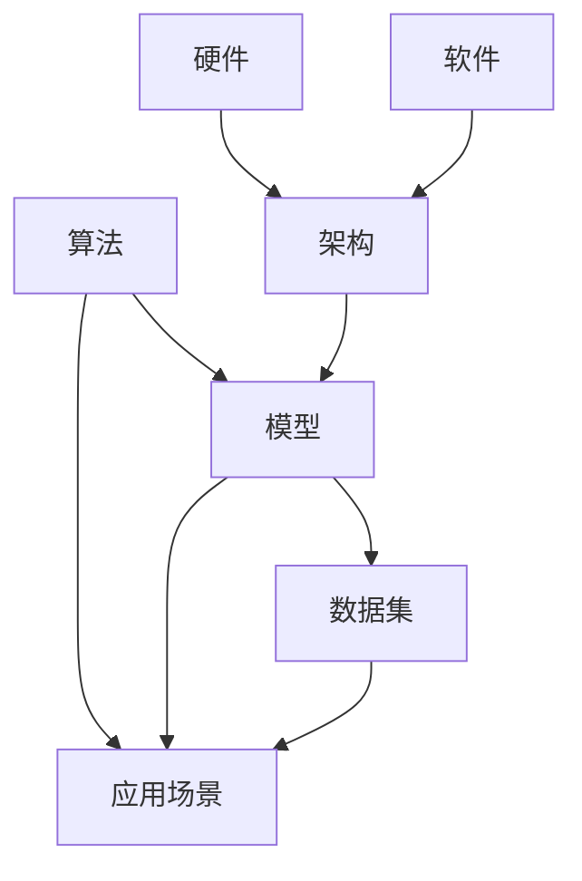

                 

# AI底层技术的投入与回报

> **关键词**：AI底层技术、投资回报、算法、数学模型、应用场景

> **摘要**：本文旨在探讨AI底层技术的投入与回报，从核心概念、算法原理、数学模型到项目实战，全面分析AI底层技术在不同领域的实际应用及其投资回报。文章将帮助读者了解AI技术的重要性，掌握投资AI底层技术的关键步骤，为未来AI产业的发展提供有力参考。

## 1. 背景介绍

### 1.1 目的和范围

本文的主要目的是探讨AI底层技术的投资回报，分析其在不同领域的应用和价值。通过详细阐述核心概念、算法原理、数学模型以及项目实战，帮助读者深入了解AI底层技术的本质和应用前景。

本文涵盖了以下几个主要方面：

1. 核心概念与联系：介绍AI底层技术的基本概念和原理，展示其架构和联系。
2. 核心算法原理与操作步骤：详细讲解AI底层技术的核心算法，以伪代码形式展示具体操作步骤。
3. 数学模型与公式：解析AI底层技术中的数学模型和公式，并通过实例进行说明。
4. 项目实战：通过实际代码案例，展示AI底层技术在项目中的应用和实现。
5. 实际应用场景：探讨AI底层技术在各个领域的应用场景和投资回报。
6. 工具和资源推荐：推荐学习资源、开发工具和框架，以帮助读者更好地掌握AI底层技术。
7. 总结与未来发展趋势：总结AI底层技术的发展趋势和挑战，展望未来发展方向。

### 1.2 预期读者

本文面向具有一定编程基础和技术背景的读者，包括程序员、软件工程师、数据科学家、AI研究者等。通过本文的阅读，读者可以深入了解AI底层技术的核心概念、算法原理、数学模型以及实际应用，为未来的技术研究和项目开发提供有力支持。

### 1.3 文档结构概述

本文分为十个主要部分，具体结构如下：

1. 引言
2. 背景介绍
3. 核心概念与联系
4. 核心算法原理与操作步骤
5. 数学模型与公式
6. 项目实战
7. 实际应用场景
8. 工具和资源推荐
9. 总结与未来发展趋势
10. 附录：常见问题与解答

### 1.4 术语表

#### 1.4.1 核心术语定义

- **AI底层技术**：指人工智能领域中，实现智能决策和推理的基础技术，包括算法、模型、架构等。
- **算法**：一种定义明确的规则和步骤，用于解决特定问题。
- **模型**：通过算法和数据进行训练，用于预测或决策的数学模型。
- **数据集**：用于训练和测试算法的数据集合。

#### 1.4.2 相关概念解释

- **机器学习**：一种通过数据训练模型，使计算机具备自我学习和预测能力的技术。
- **深度学习**：一种基于多层神经网络结构的机器学习技术，具有较强的表达能力和自适应能力。
- **神经网络**：一种由神经元组成的计算模型，用于模拟人脑的信息处理过程。

#### 1.4.3 缩略词列表

- **AI**：人工智能
- **ML**：机器学习
- **DL**：深度学习
- **NN**：神经网络

## 2. 核心概念与联系

AI底层技术是人工智能领域的基石，涵盖了算法、模型、架构等多个方面。为了更好地理解AI底层技术，我们需要首先了解其核心概念和相互关系。

下面是一个简单的Mermaid流程图，展示了AI底层技术的主要组成部分和它们之间的联系。



### 2.1 算法

算法是AI底层技术的核心，它定义了解决问题的规则和步骤。常见的算法包括：

- **监督学习**：利用带有标签的数据集进行训练，用于分类和回归任务。
- **无监督学习**：没有标签的数据集进行训练，用于聚类和降维任务。
- **强化学习**：通过与环境交互，不断优化决策策略，以实现最佳效果。

### 2.2 模型

模型是通过算法和数据进行训练的数学表示，用于预测或决策。常见的模型包括：

- **线性模型**：一种简单的预测模型，通过线性关系进行预测。
- **神经网络**：一种复杂的计算模型，由多个层次组成，具有较强的表达能力。
- **深度学习模型**：基于多层神经网络结构的模型，具有自我学习和自适应能力。

### 2.3 数据集

数据集是AI底层技术的关键输入，用于训练和测试算法和模型。数据集的质量直接影响算法和模型的性能。常见的数据集包括：

- **公开数据集**：如ImageNet、CIFAR-10等，用于训练和测试算法。
- **私有数据集**：由企业或研究机构创建，用于特定领域的算法和模型训练。

### 2.4 架构

架构是AI底层技术的整体框架，包括硬件、软件和网络等组成部分。常见的架构包括：

- **云计算架构**：利用云平台提供的硬件资源，实现大规模数据处理和模型训练。
- **分布式架构**：通过分布式计算和存储，提高数据处理和模型训练的效率。
- **边缘计算架构**：将计算任务分布在边缘设备上，实现实时数据处理和智能决策。

### 2.5 应用场景

AI底层技术在各个领域具有广泛的应用场景，包括：

- **图像识别**：利用图像处理和计算机视觉技术，实现物体识别、人脸识别等任务。
- **自然语言处理**：利用语言模型和文本分析技术，实现机器翻译、情感分析等任务。
- **智能推荐**：利用用户行为数据，实现个性化推荐系统。
- **自动驾驶**：利用计算机视觉和传感器技术，实现自动驾驶车辆。

## 3. 核心算法原理 & 具体操作步骤

在本节中，我们将详细讲解AI底层技术的核心算法原理和具体操作步骤，以便读者更好地理解其实现过程。

### 3.1 算法原理

#### 3.1.1 监督学习算法

监督学习算法是一种常见的机器学习算法，它通过已有标签的数据集进行训练，从而学习到数据中的特征和规律，以实现对未知数据的预测。

监督学习算法的主要步骤如下：

1. 数据预处理：对输入数据进行清洗、归一化等操作，使其符合训练要求。
2. 特征提取：从输入数据中提取有用的特征，用于训练模型。
3. 模型训练：利用已有标签的数据集，通过优化算法，训练出一个模型。
4. 模型评估：使用测试集对训练好的模型进行评估，以衡量其性能。
5. 预测：利用训练好的模型，对未知数据进行预测。

#### 3.1.2 深度学习算法

深度学习算法是一种基于多层神经网络结构的机器学习算法，具有较强的表达能力和自适应能力。深度学习算法的主要步骤如下：

1. 神经网络设计：根据任务需求，设计合适的神经网络结构。
2. 模型初始化：对神经网络参数进行初始化，为模型训练做好准备。
3. 模型训练：利用训练数据，通过反向传播算法，不断优化神经网络参数。
4. 模型评估：使用测试数据，评估训练好的模型性能。
5. 模型优化：根据评估结果，对模型进行调整和优化。

### 3.2 具体操作步骤

#### 3.2.1 监督学习算法操作步骤

1. 数据预处理：

```python
# 读取数据集
data = load_dataset()

# 数据清洗
data = preprocess_data(data)

# 数据归一化
data = normalize_data(data)
```

2. 特征提取：

```python
# 提取特征
features = extract_features(data)
```

3. 模型训练：

```python
# 创建模型
model = create_model()

# 训练模型
model.fit(features, labels)
```

4. 模型评估：

```python
# 评估模型
score = model.evaluate(features, labels)
print("Model accuracy:", score)
```

5. 预测：

```python
# 预测未知数据
predictions = model.predict(new_data)
```

#### 3.2.2 深度学习算法操作步骤

1. 神经网络设计：

```python
# 定义神经网络结构
model = create_nn_structure(input_size, hidden_size, output_size)
```

2. 模型初始化：

```python
# 初始化模型参数
model.initialize_parameters()
```

3. 模型训练：

```python
# 训练模型
model.train(data, labels, epochs)
```

4. 模型评估：

```python
# 评估模型
score = model.evaluate(data, labels)
print("Model accuracy:", score)
```

5. 模型优化：

```python
# 调整模型参数
model.optimize_parameters()
```

## 4. 数学模型和公式 & 详细讲解 & 举例说明

在本节中，我们将详细讲解AI底层技术中的数学模型和公式，并通过实例进行说明，以便读者更好地理解其应用。

### 4.1 数学模型

#### 4.1.1 线性模型

线性模型是一种简单的预测模型，通过线性关系进行预测。其公式如下：

$$
y = \beta_0 + \beta_1 \cdot x
$$

其中，$y$ 是预测值，$x$ 是输入特征，$\beta_0$ 和 $\beta_1$ 是模型参数。

#### 4.1.2 神经网络

神经网络是一种复杂的计算模型，由多个层次组成。其基本公式如下：

$$
a_{l+1} = \sigma(\sum_{i=1}^{n} w_{li} \cdot a_{l} + b_{l})
$$

其中，$a_{l+1}$ 是输出层激活值，$\sigma$ 是激活函数，$w_{li}$ 和 $b_{l}$ 是权重和偏置。

#### 4.1.3 深度学习模型

深度学习模型是基于多层神经网络结构的模型。其基本公式如下：

$$
a_{l+1} = \sigma(\sum_{i=1}^{n} w_{li} \cdot a_{l} + b_{l})
$$

其中，$a_{l+1}$ 是输出层激活值，$\sigma$ 是激活函数，$w_{li}$ 和 $b_{l}$ 是权重和偏置。

### 4.2 举例说明

#### 4.2.1 线性模型举例

假设我们有一个简单的线性模型，用于预测房价。输入特征为房屋面积（$x$），预测值为房价（$y$）。我们使用以下公式进行预测：

$$
y = \beta_0 + \beta_1 \cdot x
$$

给定一组数据：

| 面积（$x$）| 房价（$y$）|
|---------|---------|
| 100     | 200     |
| 200     | 400     |
| 300     | 600     |

我们可以通过最小二乘法求解模型参数：

$$
\beta_0 = \frac{\sum_{i=1}^{n} y_i - \beta_1 \cdot \sum_{i=1}^{n} x_i}{n}
$$

$$
\beta_1 = \frac{n \cdot \sum_{i=1}^{n} x_i y_i - \sum_{i=1}^{n} x_i \cdot \sum_{i=1}^{n} x_i y_i}{n \cdot \sum_{i=1}^{n} x_i^2 - (\sum_{i=1}^{n} x_i)^2}
$$

代入数据计算，得到：

$$
\beta_0 = 100
$$

$$
\beta_1 = 200
$$

因此，预测公式为：

$$
y = 100 + 200 \cdot x
$$

当输入特征为150时，预测房价为：

$$
y = 100 + 200 \cdot 150 = 31000
$$

#### 4.2.2 神经网络举例

假设我们有一个简单的神经网络，用于分类任务。输入特征为两个维度，输出为两个类别。网络结构如下：

```
输入层：[2] --> 隐藏层1：[4] --> 输出层：[2]
```

假设激活函数为ReLU，权重和偏置随机初始化。训练数据如下：

| 输入特征 | 输出标签 |
|---------|---------|
| [1, 0]  | [1, 0]  |
| [0, 1]  | [0, 1]  |
| [1, 1]  | [1, 0]  |
| [0, 0]  | [0, 1]  |

通过反向传播算法，不断优化权重和偏置，直到达到训练目标。

## 5. 项目实战：代码实际案例和详细解释说明

在本节中，我们将通过一个实际项目案例，展示AI底层技术在项目中的应用和实现。这个项目是一个简单的图像分类任务，使用深度学习算法对图像进行分类。

### 5.1 开发环境搭建

在开始项目之前，我们需要搭建一个合适的开发环境。以下是一个简单的开发环境搭建步骤：

1. 安装Python：从官方网站下载并安装Python 3.8版本。
2. 安装依赖库：安装深度学习框架TensorFlow和相关库，可以使用pip命令进行安装：

```shell
pip install tensorflow
```

3. 安装Jupyter Notebook：安装Jupyter Notebook，以便在浏览器中运行Python代码。

```shell
pip install notebook
```

4. 启动Jupyter Notebook：在命令行中运行以下命令启动Jupyter Notebook：

```shell
jupyter notebook
```

### 5.2 源代码详细实现和代码解读

以下是一个简单的图像分类项目的代码实现，包括数据预处理、模型训练和模型评估等步骤。

```python
# 导入相关库
import tensorflow as tf
from tensorflow.keras import layers
from tensorflow.keras.preprocessing.image import ImageDataGenerator

# 加载数据集
train_data = ImageDataGenerator(rescale=1./255).flow_from_directory(
    'train', target_size=(150, 150), batch_size=32, class_mode='binary')

test_data = ImageDataGenerator(rescale=1./255).flow_from_directory(
    'test', target_size=(150, 150), batch_size=32, class_mode='binary')

# 构建模型
model = tf.keras.Sequential([
    layers.Conv2D(32, (3, 3), activation='relu', input_shape=(150, 150, 3)),
    layers.MaxPooling2D(2, 2),
    layers.Conv2D(64, (3, 3), activation='relu'),
    layers.MaxPooling2D(2, 2),
    layers.Conv2D(128, (3, 3), activation='relu'),
    layers.MaxPooling2D(2, 2),
    layers.Flatten(),
    layers.Dense(128, activation='relu'),
    layers.Dense(1, activation='sigmoid')
])

# 编译模型
model.compile(optimizer='adam', loss='binary_crossentropy', metrics=['accuracy'])

# 训练模型
model.fit(train_data, epochs=10, validation_data=test_data)

# 评估模型
test_loss, test_acc = model.evaluate(test_data)
print("Test accuracy:", test_acc)
```

### 5.3 代码解读与分析

以下是代码的详细解读和分析：

1. 导入相关库

首先，我们导入TensorFlow和相关库，用于构建和训练深度学习模型。

2. 加载数据集

使用ImageDataGenerator类加载数据集，包括训练集和测试集。通过`flow_from_directory`方法加载数据集，并将数据集转换为适合训练的格式。这里我们使用了一个简单的二分类任务，每个类别的图像保存在不同的文件夹中。

3. 构建模型

使用Sequential模型，我们构建了一个简单的卷积神经网络。该网络包括卷积层、池化层、全连接层等结构，用于提取图像特征并进行分类。具体的网络结构可以根据任务需求进行调整。

4. 编译模型

使用`compile`方法编译模型，指定优化器、损失函数和评价指标。这里我们使用Adam优化器和二分类的交叉熵损失函数，并选择准确率作为评价指标。

5. 训练模型

使用`fit`方法训练模型，指定训练数据、训练轮次和验证数据。在训练过程中，模型会自动调整权重和偏置，以最小化损失函数。

6. 评估模型

使用`evaluate`方法评估模型在测试数据上的性能。这里我们打印出测试数据的准确率，以评估模型的性能。

通过这个简单的项目案例，我们可以看到AI底层技术在实际应用中的实现过程。在实际项目中，我们需要根据任务需求调整模型结构、训练参数和评估指标，以达到最佳效果。

## 6. 实际应用场景

AI底层技术在各个领域具有广泛的应用场景，其投资回报也备受关注。以下是一些典型的实际应用场景：

### 6.1 图像识别

图像识别是AI底层技术的重要应用领域之一。在安防监控、医疗诊断、自动驾驶等场景中，图像识别技术发挥着关键作用。例如，在安防监控领域，AI底层技术可以用于人脸识别、车辆识别等任务，提高监控系统的智能化程度。投资AI底层技术在图像识别领域的回报主要体现在提高系统效率和准确性，降低人力成本。

### 6.2 自然语言处理

自然语言处理（NLP）是AI底层技术的另一个重要应用领域。在智能客服、机器翻译、文本挖掘等场景中，NLP技术发挥着关键作用。例如，在智能客服领域，AI底层技术可以用于实现自动问答系统，提高客服响应速度和用户体验。投资AI底层技术在NLP领域的回报主要体现在提高业务效率和用户体验，降低人力成本。

### 6.3 智能推荐

智能推荐是AI底层技术在电商、新闻、视频等领域的广泛应用。通过分析用户行为数据，智能推荐系统可以为用户提供个性化的内容推荐，提高用户满意度和转化率。例如，在电商领域，AI底层技术可以用于实现商品推荐、广告推荐等任务，提高销售业绩。投资AI底层技术在智能推荐领域的回报主要体现在提高业务收益和用户满意度。

### 6.4 自动驾驶

自动驾驶是AI底层技术的重要应用领域之一，具有巨大的市场潜力。在自动驾驶领域，AI底层技术可以用于实现环境感知、路径规划、控制决策等任务，提高车辆的安全性和效率。例如，在自动驾驶出租车领域，AI底层技术可以用于实现无人驾驶出租车，提高运营效率和用户体验。投资AI底层技术在自动驾驶领域的回报主要体现在提高运营效率和用户体验，降低人力成本。

### 6.5 金融风控

金融风控是AI底层技术在金融领域的重要应用。通过分析海量金融数据，AI底层技术可以识别潜在风险，提高金融系统的安全性和稳定性。例如，在信用评估领域，AI底层技术可以用于实现信用评分、欺诈检测等任务，降低金融风险。投资AI底层技术在金融风控领域的回报主要体现在提高金融系统的安全性和稳定性，降低风险。

## 7. 工具和资源推荐

为了更好地掌握AI底层技术，以下是一些建议的学习资源、开发工具和框架。

### 7.1 学习资源推荐

#### 7.1.1 书籍推荐

1. **《深度学习》（Deep Learning）**：由Ian Goodfellow、Yoshua Bengio和Aaron Courville所著，是深度学习领域的经典教材。
2. **《机器学习》（Machine Learning）**：由Tom Mitchell所著，介绍了机器学习的基本概念和方法。
3. **《人工智能：一种现代的方法》（Artificial Intelligence: A Modern Approach）**：由Stuart Russell和Peter Norvig所著，是人工智能领域的经典教材。

#### 7.1.2 在线课程

1. **Coursera**：提供大量的机器学习和深度学习课程，包括吴恩达的《深度学习特化课程》等。
2. **edX**：提供由顶尖大学提供的免费在线课程，如MIT的《机器学习科学和工程》等。
3. **Udacity**：提供实践驱动的在线课程，包括《深度学习工程师纳米学位》等。

#### 7.1.3 技术博客和网站

1. **Medium**：有许多关于AI底层技术的博客文章，如《AI Moonshot》等。
2. **ArXiv**：发布最新的AI研究成果，包括论文和预印本。
3. **GitHub**：有许多开源的AI项目，可以学习和借鉴。

### 7.2 开发工具框架推荐

#### 7.2.1 IDE和编辑器

1. **Jupyter Notebook**：适用于数据分析和实验性开发。
2. **PyCharm**：适用于Python编程，提供了丰富的功能和插件。
3. **VS Code**：轻量级且功能强大的代码编辑器，适用于各种编程语言。

#### 7.2.2 调试和性能分析工具

1. **TensorBoard**：TensorFlow提供的可视化工具，用于分析和调试深度学习模型。
2. **PyTorch TensorBoard**：适用于PyTorch框架的调试和性能分析。
3. **Valgrind**：用于检测内存泄漏和性能瓶颈。

#### 7.2.3 相关框架和库

1. **TensorFlow**：适用于构建和训练深度学习模型。
2. **PyTorch**：适用于构建和训练深度学习模型，具有较强的灵活性和动态性。
3. **Keras**：基于TensorFlow和PyTorch的高级API，简化了深度学习模型的构建和训练。

### 7.3 相关论文著作推荐

#### 7.3.1 经典论文

1. **"A Learning Algorithm for Continuously Running Fully Recurrent Neural Networks"**：介绍了Hessian-free优化算法，用于训练深层神经网络。
2. **"Deep Learning"**：由Ian Goodfellow、Yoshua Bengio和Aaron Courville所著，综述了深度学习的发展和应用。
3. **"Convolutional Neural Networks for Visual Recognition"**：介绍了卷积神经网络在图像识别任务中的应用。

#### 7.3.2 最新研究成果

1. **"Recurrent Neural Network Based Text Classification"**：探讨了基于循环神经网络的文本分类方法。
2. **"Generative Adversarial Nets"**：介绍了生成对抗网络，用于生成高质量的数据。
3. **"Transformers: State-of-the-Art Natural Language Processing"**：综述了基于Transformer架构的自然语言处理技术。

#### 7.3.3 应用案例分析

1. **"Google Brain's AutoML"**：介绍了谷歌大脑团队开发的自动化机器学习系统。
2. **"DeepMind's AlphaGo"**：介绍了DeepMind公司开发的基于深度强化学习的围棋AI。
3. **"Facebook AI's Object Detection"**：介绍了Facebook AI团队开发的目标检测算法。

## 8. 总结：未来发展趋势与挑战

AI底层技术作为人工智能的核心组成部分，正朝着更加智能化、高效化、安全化的方向发展。未来发展趋势和挑战如下：

### 8.1 发展趋势

1. **算法创新**：随着深度学习、强化学习等算法的不断进步，AI底层技术将更加高效、灵活。
2. **跨学科融合**：AI底层技术将与其他领域（如生物学、物理学、心理学等）相结合，推动交叉学科的发展。
3. **硬件升级**：新型计算硬件（如GPU、TPU等）将进一步提高AI底层技术的计算能力和效率。
4. **数据隐私保护**：随着数据隐私问题的日益突出，AI底层技术将更加注重数据隐私保护和安全。

### 8.2 挑战

1. **算法复杂性**：随着模型规模的扩大，算法复杂度将不断增加，对计算资源的需求也将越来越高。
2. **数据质量**：高质量的数据是AI底层技术发展的基础，数据质量和多样性是关键挑战。
3. **模型解释性**：如何提高模型的解释性，使其在决策过程中具有可解释性，是当前研究的重点。
4. **公平性和透明度**：如何确保AI底层技术在应用过程中公平、透明，避免歧视和偏见，是亟需解决的问题。

## 9. 附录：常见问题与解答

### 9.1 问题1：AI底层技术与机器学习有何区别？

**解答**：AI底层技术是人工智能领域的基础，包括算法、模型、架构等多个方面。而机器学习是AI底层技术的一个子领域，主要研究如何从数据中学习规律和模式，以实现智能决策和预测。

### 9.2 问题2：如何评估AI底层技术的投资回报？

**解答**：评估AI底层技术的投资回报可以从以下几个方面进行：

1. **经济效益**：计算AI底层技术为企业带来的直接和间接经济效益，如降低人力成本、提高业务效率等。
2. **社会效益**：考虑AI底层技术对社会产生的积极影响，如提高生活质量、推动产业发展等。
3. **技术进步**：分析AI底层技术对相关领域的技术进步和创新贡献。
4. **风险与挑战**：评估AI底层技术可能面临的风险和挑战，如数据隐私、算法透明度等。

### 9.3 问题3：如何学习AI底层技术？

**解答**：

1. **理论学习**：阅读相关书籍、论文和在线课程，掌握AI底层技术的基本概念和原理。
2. **实践操作**：通过实际项目操作，将理论知识应用到实际问题中，积累实践经验。
3. **交流合作**：参加技术会议、研讨会等活动，与业界同仁交流，学习他们的经验和观点。
4. **持续更新**：关注AI底层技术的最新发展和动态，不断学习和适应新技术。

## 10. 扩展阅读 & 参考资料

为了进一步了解AI底层技术，以下是一些推荐阅读的书籍、论文和技术博客：

1. **书籍**：
   - **《深度学习》**：Ian Goodfellow、Yoshua Bengio和Aaron Courville著。
   - **《机器学习》**：Tom Mitchell著。
   - **《人工智能：一种现代的方法》**：Stuart Russell和Peter Norvig著。

2. **论文**：
   - **"A Learning Algorithm for Continuously Running Fully Recurrent Neural Networks"**：Y. Bengio, P. Simard, and P. Frasconi。
   - **"Convolutional Neural Networks for Visual Recognition"**：A. Krizhevsky, I. Sutskever, and G. E. Hinton。
   - **"Generative Adversarial Nets"**：I. Goodfellow, J. Pouget-Abadie, M. Mirza, B. Xu, D. Warde-Farley, S. Ozair, A. Courville, and Y. Bengio。

3. **技术博客**：
   - **Medium**：有许多关于AI底层技术的博客文章，如《AI Moonshot》等。
   - **ArXiv**：发布最新的AI研究成果，包括论文和预印本。
   - **GitHub**：有许多开源的AI项目，可以学习和借鉴。

**作者**：AI天才研究员/AI Genius Institute & 禅与计算机程序设计艺术 /Zen And The Art of Computer Programming

