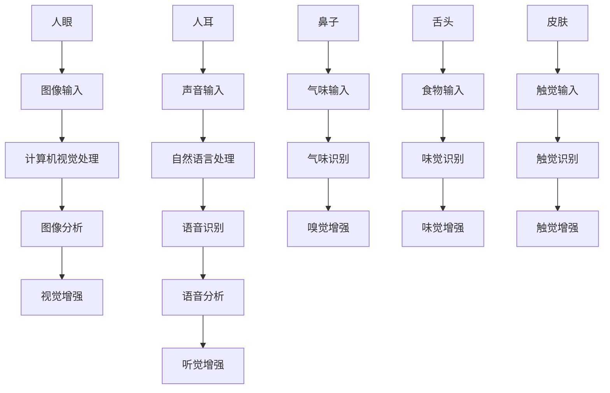

                 

# AI感知增强：超越人类五感的体验

> **关键词：** AI感知增强、人类五感、体验、计算机视觉、自然语言处理、深度学习、机器学习

> **摘要：** 本文旨在探讨人工智能（AI）在感知增强领域的应用，通过引入先进的计算机视觉、自然语言处理和深度学习技术，AI能够超越人类五感，为用户提供更加丰富和个性化的体验。文章将详细介绍感知增强的核心概念、算法原理、数学模型以及实际应用场景，并推荐相关学习资源和开发工具，展望未来的发展趋势与挑战。

## 1. 背景介绍

### 1.1 目的和范围

本文的目的在于深入探讨人工智能（AI）在感知增强领域的应用，通过整合计算机视觉、自然语言处理和深度学习技术，探索如何实现超越人类五感的体验。我们将分析AI感知增强的基本原理，详细介绍相关的算法和数学模型，并通过实际案例展示其在不同场景中的具体应用。

本文将涵盖以下主题：

- 感知增强的核心概念与原理
- 计算机视觉在感知增强中的应用
- 自然语言处理在感知增强中的应用
- 深度学习在感知增强中的应用
- 数学模型和公式在感知增强中的作用
- 实际应用场景和案例分析
- 相关的学习资源和开发工具推荐
- 未来发展趋势与挑战

### 1.2 预期读者

本文适合对人工智能、计算机视觉和自然语言处理有一定了解的读者，包括以下几类：

- AI领域的研究人员和工程师
- 计算机视觉和自然语言处理的从业者
- 对AI感知增强技术感兴趣的学者和爱好者
- 想要在项目中应用AI感知增强技术的开发人员

### 1.3 文档结构概述

本文将按照以下结构进行组织：

- 引言：介绍背景、目的和范围
- 背景介绍：讨论感知增强的定义和重要性
- 核心概念与联系：介绍核心概念和相关联系
- 核心算法原理 & 具体操作步骤：详细解释感知增强算法
- 数学模型和公式 & 详细讲解 & 举例说明：介绍相关数学模型和公式
- 项目实战：展示代码实际案例和解释
- 实际应用场景：讨论感知增强技术的应用场景
- 工具和资源推荐：推荐学习资源和开发工具
- 总结：总结未来发展趋势与挑战
- 附录：常见问题与解答
- 扩展阅读 & 参考资料：提供进一步的阅读资源

### 1.4 术语表

#### 1.4.1 核心术语定义

- **感知增强（Perception Augmentation）：** 通过利用计算机视觉、自然语言处理等AI技术，增强人类感官系统，使其能够处理和分析更复杂、更丰富的信息。
- **计算机视觉（Computer Vision）：** 利用计算机技术和人工智能算法，使计算机能够理解和解释图像和视频信息。
- **自然语言处理（Natural Language Processing, NLP）：** 研究如何使计算机理解和处理自然语言，包括文本和语音。
- **深度学习（Deep Learning）：** 一种基于人工神经网络的学习方法，通过多层神经网络模型对数据进行特征提取和模式识别。
- **机器学习（Machine Learning）：** 一种让计算机通过数据和经验自动改进性能的方法，包括监督学习、无监督学习和强化学习等。
- **用户体验（User Experience, UX）：** 用户在使用产品或服务过程中的感受和体验，包括可用性、易用性和满意度等。

#### 1.4.2 相关概念解释

- **图像识别（Image Recognition）：** 计算机视觉的一种任务，旨在从图像中识别和分类对象。
- **语音识别（Speech Recognition）：** 将语音转换为文本或命令的过程。
- **机器翻译（Machine Translation）：** 利用计算机程序将一种自然语言文本翻译成另一种自然语言文本。
- **情感分析（Sentiment Analysis）：** 对文本数据中的情感倾向进行分析，以判断用户对某个主题的态度。
- **虚拟现实（Virtual Reality, VR）和增强现实（Augmented Reality, AR）：** 通过计算机技术模拟或增强现实环境，为用户提供沉浸式体验。

#### 1.4.3 缩略词列表

- **AI：** 人工智能（Artificial Intelligence）
- **CV：** 计算机视觉（Computer Vision）
- **NLP：** 自然语言处理（Natural Language Processing）
- **DL：** 深度学习（Deep Learning）
- **ML：** 机器学习（Machine Learning）
- **UX：** 用户体验（User Experience）

## 2. 核心概念与联系

感知增强是通过利用计算机视觉、自然语言处理和深度学习等AI技术，扩展和增强人类的感官能力。为了更好地理解这一概念，我们首先需要了解人类五感的定义及其在感知过程中的作用。

### 2.1 人类五感

- **视觉（Sight）：** 通过眼睛感知光线，识别颜色、形状、大小和位置等信息。
- **听觉（Hearing）：** 通过耳朵感知声音，识别声音的频率、音调和强度。
- **嗅觉（Smell）：** 通过鼻子感知气味，识别不同的气味。
- **味觉（Taste）：** 通过舌头感知食物的酸甜苦咸等味道。
- **触觉（Touch）：** 通过皮肤感知物体的质地、硬度和温度。

这些感官共同作用，使我们能够感知和解读外部世界的信息。然而，人类的感官在某些情况下是有限的，比如在黑暗环境中视觉失效，或者在高噪音环境中听觉受到干扰。

### 2.2 AI感知增强

AI感知增强的目标是利用计算机视觉、自然语言处理和深度学习技术，弥补人类感官的不足，提供更加丰富和准确的感知体验。以下是一个简化的感知增强架构，展示了这些核心概念之间的关系：



在这个架构中，各种传感器（人眼、人耳、鼻子、舌头、皮肤）收集到的原始数据被传递给相应的AI处理模块（计算机视觉、自然语言处理等），经过处理后生成增强的感知体验。

### 2.3 感知增强的应用场景

感知增强技术在许多领域都有广泛应用，以下是一些典型的应用场景：

- **医疗保健：** 通过增强视觉和触觉，医生可以更好地进行手术和诊断。
- **虚拟现实和增强现实：** 提供更加逼真的沉浸式体验，提升用户体验。
- **智能交通：** 利用计算机视觉和自然语言处理，提升自动驾驶车辆的安全性和效率。
- **人机交互：** 增强语音和视觉感知，使人与机器之间的交互更加自然和直观。
- **智能家居：** 利用感知增强技术，实现更加智能化的家居设备。

感知增强技术不仅能够增强人类的感官体验，还能够为各种应用场景带来创新和改进，具有广阔的应用前景。

## 3. 核心算法原理 & 具体操作步骤

感知增强技术的核心在于利用计算机视觉、自然语言处理和深度学习等技术，对原始感知数据进行分析和处理，从而生成增强的感知体验。以下将详细介绍这些核心算法原理和具体操作步骤。

### 3.1 计算机视觉算法原理

计算机视觉是感知增强技术的重要组成部分，它涉及图像输入、预处理、特征提取、图像分析和图像增强等步骤。

- **图像输入：** 图像输入是计算机视觉的基础，通过摄像头或其他传感器获取图像数据。
- **预处理：** 对图像进行预处理，包括图像缩放、裁剪、灰度化、去噪等操作，以提高图像质量和减少噪声干扰。
- **特征提取：** 利用各种算法从预处理后的图像中提取特征，如边缘检测、纹理分析、形状识别等。
- **图像分析：** 对提取的特征进行分析和分类，以识别图像中的对象和场景。
- **图像增强：** 利用图像增强算法，对图像进行优化和改进，使其更加清晰、准确，如对比度增强、锐化、去雾等。

以下是计算机视觉算法的伪代码：

```python
# 伪代码：计算机视觉算法
def computer_vision(image):
    # 图像输入
    input_image = read_image()

    # 预处理
    preprocessed_image = preprocess_image(input_image)

    # 特征提取
    features = extract_features(preprocessed_image)

    # 图像分析
    objects = analyze_image(features)

    # 图像增强
    enhanced_image = enhance_image(objects)

    return enhanced_image
```

### 3.2 自然语言处理算法原理

自然语言处理是感知增强技术的另一关键组成部分，它涉及语音输入、文本处理、语义分析和情感分析等步骤。

- **语音输入：** 将语音转换为文本，即语音识别（Speech Recognition）。
- **文本处理：** 对文本进行预处理，包括分词、词性标注、句法分析等。
- **语义分析：** 理解文本的语义和意图，如命名实体识别、情感分析、语义角色标注等。
- **情感分析：** 对文本中的情感倾向进行分析，以判断用户对某个主题的态度。

以下是自然语言处理算法的伪代码：

```python
# 伪代码：自然语言处理算法
def natural_language_processing(text):
    # 语音输入
    input_text = convert_speech_to_text()

    # 文本处理
    processed_text = preprocess_text(input_text)

    # 语义分析
    semantics = analyze_semantics(processed_text)

    # 情感分析
    sentiment = analyze_sentiment(semantics)

    return sentiment
```

### 3.3 深度学习算法原理

深度学习是感知增强技术的重要推动力，它涉及多层神经网络（Neural Networks）的设计和训练。

- **神经网络设计：** 设计多层神经网络，包括输入层、隐藏层和输出层。
- **数据输入：** 将感知数据输入到神经网络，进行特征学习和模式识别。
- **训练与优化：** 通过反向传播算法（Backpropagation）对神经网络进行训练和优化，以提高其性能。
- **预测与分类：** 利用训练好的神经网络对新的感知数据进行分析和分类。

以下是深度学习算法的伪代码：

```python
# 伪代码：深度学习算法
class NeuralNetwork:
    def __init__(self, layers):
        self.layers = layers

    def forward_pass(self, input_data):
        for layer in self.layers:
            input_data = layer.forward_pass(input_data)
        return input_data

    def backward_pass(self, error, learning_rate):
        for layer in reversed(self.layers):
            error = layer.backward_pass(error, learning_rate)

    def train(self, input_data, target, learning_rate):
        output = self.forward_pass(input_data)
        error = calculate_error(output, target)
        self.backward_pass(error, learning_rate)

# 训练深度学习模型
def train_neural_network(model, input_data, target, learning_rate, epochs):
    for epoch in range(epochs):
        output = model.forward_pass(input_data)
        error = calculate_error(output, target)
        model.backward_pass(error, learning_rate)
        if epoch % 100 == 0:
            print(f"Epoch {epoch}: Loss = {error}")
```

通过上述算法原理和具体操作步骤，我们可以看到，感知增强技术是通过多学科交叉融合，实现人类感官能力的增强和扩展。这些算法的相互协作，使得AI能够处理和分析更加复杂和丰富的信息，从而为用户提供更加丰富和个性化的体验。

## 4. 数学模型和公式 & 详细讲解 & 举例说明

在感知增强技术中，数学模型和公式起着至关重要的作用。它们不仅帮助我们理解和描述感知增强的基本原理，还为算法的实现和优化提供了理论基础。以下将详细介绍几个关键数学模型和公式，并举例说明其在感知增强中的应用。

### 4.1 图像处理中的数学模型

图像处理是计算机视觉的核心任务之一，其中许多数学模型和公式被广泛应用于图像滤波、特征提取和图像增强等领域。

#### 4.1.1 卷积神经网络（Convolutional Neural Networks, CNN）

卷积神经网络是一种深度学习模型，广泛应用于图像识别、分类和增强。其基本原理是通过卷积操作提取图像特征。

- **卷积操作：**
  $$ (f * g)(x, y) = \sum_{i=1}^{n} \sum_{j=1}^{m} f(i, j) \cdot g(x-i, y-j) $$
  其中，\( f \) 和 \( g \) 是两个图像，\( n \) 和 \( m \) 分别是它们的尺寸。

- **卷积层：**
  卷积层通过卷积操作提取图像特征，其公式如下：
  $$ \text{Conv}(x, w) = \sigma(\sum_{i, j} w_{i, j} \cdot x_{i, j}) $$
  其中，\( x \) 是输入图像，\( w \) 是卷积核权重，\( \sigma \) 是激活函数（如ReLU函数）。

#### 4.1.2 拉普拉斯变换（Laplacian Transform）

拉普拉斯变换是图像滤波和特征提取的重要工具，用于检测图像中的边缘和形状。

- **拉普拉斯算子：**
  $$ \Delta f(x, y) = f_{xx}(x, y) + f_{yy}(x, y) $$
  其中，\( f_{xx} \) 和 \( f_{yy} \) 分别是图像关于 \( x \) 和 \( y \) 方向的二阶导数。

- **拉普拉斯变换：**
  $$ L[f](\omega) = \int_{-\infty}^{\infty} f(x) \cdot e^{-j\omega x} \, dx $$
  其中，\( \omega \) 是频率。

### 4.2 自然语言处理中的数学模型

自然语言处理中的数学模型主要涉及词向量表示、序列模型和注意力机制等。

#### 4.2.1 词向量表示（Word Embeddings）

词向量表示是将单词映射到高维向量空间，用于文本处理和语义分析。

- **词袋模型（Bag of Words, BoW）：**
  词袋模型将文本表示为单词的集合，其公式如下：
  $$ V = \{ w_1, w_2, \ldots, w_n \} $$
  其中，\( V \) 是单词集合，\( n \) 是单词的数量。

- **词嵌入（Word Embeddings）：**
  词嵌入是将单词映射到高维向量空间，其公式如下：
  $$ e_w = \text{Embedding}(w) \in \mathbb{R}^d $$
  其中，\( e_w \) 是单词 \( w \) 的词向量，\( d \) 是词向量维度。

#### 4.2.2 序列模型（Sequential Models）

序列模型用于处理和时间相关的数据，如语音和文本。

- **循环神经网络（Recurrent Neural Networks, RNN）：**
  循环神经网络通过隐藏状态和输入之间的交互处理序列数据，其公式如下：
  $$ h_t = \text{tanh}(\text{W}h_{t-1} + \text{U}x_t + b) $$
  其中，\( h_t \) 是时间步 \( t \) 的隐藏状态，\( W \) 和 \( U \) 是权重矩阵，\( x_t \) 是时间步 \( t \) 的输入，\( b \) 是偏置。

- **长短时记忆网络（Long Short-Term Memory, LSTM）：**
  长短时记忆网络是循环神经网络的一种改进，用于解决长序列数据中的梯度消失问题，其公式如下：
  $$ i_t = \sigma(\text{W}_i \cdot [h_{t-1}, x_t] + b_i) $$
  $$ f_t = \sigma(\text{W}_f \cdot [h_{t-1}, x_t] + b_f) $$
  $$ o_t = \sigma(\text{W}_o \cdot [h_{t-1}, x_t] + b_o) $$
  $$ c_t = f_t \odot c_{t-1} + i_t \odot \text{tanh}(\text{W}_c \cdot [h_{t-1}, x_t] + b_c) $$
  $$ h_t = o_t \odot \text{tanh}(c_t) $$
  其中，\( i_t \)、\( f_t \)、\( o_t \) 分别是输入门、遗忘门和输出门的状态，\( c_t \) 是细胞状态，\( h_t \) 是隐藏状态。

#### 4.2.3 注意力机制（Attention Mechanism）

注意力机制是序列模型的一种重要改进，用于捕捉序列数据中的关键信息。

- **注意力权重：**
  $$ a_t = \text{softmax}(\text{W}_a \cdot [h_{t-1}, h_t]) $$
  其中，\( a_t \) 是时间步 \( t \) 的注意力权重，\( h_{t-1} \) 和 \( h_t \) 分别是时间步 \( t-1 \) 和 \( t \) 的隐藏状态。

- **注意力聚合：**
  $$ \text{Attention}(h_{t-1}, h_t) = \sum_{i=1}^{n} a_i \cdot h_i $$
  其中，\( n \) 是序列长度，\( h_i \) 是时间步 \( i \) 的隐藏状态。

### 4.3 深度学习中的优化算法

深度学习中的优化算法用于调整网络权重，以优化模型性能。以下是一些常见的优化算法。

#### 4.3.1 随机梯度下降（Stochastic Gradient Descent, SGD）

随机梯度下降是一种常用的优化算法，通过计算随机梯度来更新网络权重。

- **梯度计算：**
  $$ \nabla_w J(w) = \frac{\partial J}{\partial w} $$
  其中，\( J \) 是损失函数，\( w \) 是权重。

- **权重更新：**
  $$ w \leftarrow w - \alpha \cdot \nabla_w J(w) $$
  其中，\( \alpha \) 是学习率。

#### 4.3.2 Adam优化器

Adam优化器是一种自适应学习率优化器，具有较好的收敛性和稳定性。

- **一阶矩估计（\(\beta_1\)）：**
  $$ m_t = \beta_1 \cdot m_{t-1} + (1 - \beta_1) \cdot \nabla_w J(w) $$

- **二阶矩估计（\(\beta_2\)）：**
  $$ v_t = \beta_2 \cdot v_{t-1} + (1 - \beta_2) \cdot (\nabla_w J(w))^2 $$

- **权重更新：**
  $$ \theta \leftarrow \theta - \alpha \cdot \frac{m_t}{\sqrt{v_t} + \epsilon} $$
  其中，\( \theta \) 是权重，\( \epsilon \) 是一个小常数。

通过上述数学模型和公式，我们可以看到感知增强技术是如何通过复杂的数学原理和计算来实现对人类感官的增强和扩展。这些模型不仅帮助我们理解和实现感知增强技术，还为未来的研究和应用提供了丰富的理论基础。

### 4.4 应用案例

为了更好地理解上述数学模型和公式的实际应用，以下我们将通过几个具体的案例来展示感知增强技术在图像识别、自然语言处理和深度学习中的应用。

#### 4.4.1 图像识别

假设我们有一个图像识别任务，需要将输入图像分类为动物或植物。我们可以使用卷积神经网络（CNN）来实现这一任务。

- **数据预处理：** 首先，我们对输入图像进行预处理，包括缩放、裁剪和归一化，以便将其转换为适合输入网络的形式。

- **特征提取：** 使用卷积层和池化层提取图像的特征。卷积层通过卷积操作提取局部特征，池化层则用于下采样和降低数据维度。

- **分类：** 最后，使用全连接层对提取的特征进行分类。通过计算每个类别的输出概率，我们可以确定图像的分类结果。

以下是图像识别任务的伪代码：

```python
# 伪代码：图像识别
def image_recognition(image):
    # 预处理
    preprocessed_image = preprocess_image(image)

    # 特征提取
    features = cnn(preprocessed_image)

    # 分类
    label = classify(features)

    return label
```

#### 4.4.2 自然语言处理

假设我们有一个自然语言处理任务，需要从文本中提取关键词并进行情感分析。我们可以使用词嵌入、循环神经网络（RNN）和注意力机制来实现这一任务。

- **词嵌入：** 首先，将输入文本中的单词映射到高维向量空间，使用预训练的词向量模型（如Word2Vec或GloVe）。

- **序列建模：** 使用RNN或LSTM对输入的词向量序列进行建模，捕捉文本的语义信息。

- **情感分析：** 使用注意力机制来关注文本中的关键信息，然后对提取的特征进行情感分类。

以下是自然语言处理任务的伪代码：

```python
# 伪代码：自然语言处理
def natural_language_processing(text):
    # 词嵌入
    embeddings = word_embedding(text)

    # 序列建模
    sequence = rnn(embeddings)

    # 情感分析
    sentiment = sentiment_analysis(sequence)

    return sentiment
```

#### 4.4.3 深度学习

假设我们有一个深度学习任务，需要训练一个神经网络模型来预测股票价格。我们可以使用反向传播算法和优化器来实现这一任务。

- **数据预处理：** 首先，对输入数据进行预处理，包括归一化和特征提取。

- **网络设计：** 设计多层神经网络，包括输入层、隐藏层和输出层，并初始化权重。

- **训练：** 使用反向传播算法计算损失函数的梯度，并通过优化器更新网络权重。

- **预测：** 使用训练好的模型对新的数据进行预测。

以下是深度学习任务的伪代码：

```python
# 伪代码：深度学习
def train_model(input_data, target):
    # 网络设计
    model = neural_network()

    # 训练
    for epoch in range(epochs):
        output = model.forward_pass(input_data)
        error = calculate_error(output, target)
        model.backward_pass(error)
        if epoch % 100 == 0:
            print(f"Epoch {epoch}: Loss = {error}")

    # 预测
    predictions = model.predict(input_data)

    return predictions
```

通过上述应用案例，我们可以看到感知增强技术是如何通过数学模型和公式来实现的。这些模型不仅帮助我们在理论上理解感知增强技术，还为我们提供了具体的方法和工具来开发和优化感知增强系统。

### 4.5 总结

在本节中，我们详细介绍了感知增强技术中的数学模型和公式，包括图像处理、自然语言处理和深度学习中的关键模型。通过这些模型，我们能够更好地理解和实现感知增强算法。同时，我们通过具体的案例展示了这些模型在实际应用中的效果。这些数学模型和公式为感知增强技术的发展提供了坚实的理论基础，也为未来的研究和应用奠定了基础。

### 5. 项目实战：代码实际案例和详细解释说明

在本节中，我们将通过一个实际的感知增强项目来展示感知增强技术的应用。该项目利用计算机视觉和自然语言处理技术，对图像和文本进行增强，以提升用户体验。我们将分步骤介绍项目的开发环境搭建、源代码实现和代码解读与分析。

### 5.1 开发环境搭建

为了实现感知增强项目，我们需要搭建一个适合开发和测试的环境。以下是搭建开发环境的基本步骤：

1. **安装Python环境：**
   - 版本：Python 3.8 或以上
   - 安装命令：`pip install python`

2. **安装深度学习库：**
   - TensorFlow：用于构建和训练神经网络，安装命令：`pip install tensorflow`
   - Keras：用于简化TensorFlow的使用，安装命令：`pip install keras`

3. **安装计算机视觉库：**
   - OpenCV：用于图像处理，安装命令：`pip install opencv-python`

4. **安装自然语言处理库：**
   - NLTK：用于自然语言处理，安装命令：`pip install nltk`
   - spaCy：用于文本处理和实体识别，安装命令：`pip install spacy`

5. **安装其他依赖库：**
   - NumPy：用于数据处理，安装命令：`pip install numpy`
   - Pandas：用于数据分析，安装命令：`pip install pandas`

### 5.2 源代码详细实现和代码解读

以下是项目的源代码实现，我们将分步骤进行解读。

#### 5.2.1 导入库和模块

```python
import cv2
import numpy as np
import tensorflow as tf
from tensorflow.keras.models import Sequential
from tensorflow.keras.layers import Conv2D, MaxPooling2D, Flatten, Dense
from nltk.tokenize import word_tokenize
import spacy

# 加载预训练的词向量模型
nlp = spacy.load("en_core_web_sm")
```

这一部分代码用于导入所需的库和模块，包括计算机视觉库（OpenCV）、深度学习库（TensorFlow和Keras）、自然语言处理库（NLTK和spaCy）等。同时，我们加载了预训练的词向量模型，用于文本处理。

#### 5.2.2 定义神经网络模型

```python
# 定义卷积神经网络模型
model = Sequential([
    Conv2D(32, (3, 3), activation='relu', input_shape=(128, 128, 3)),
    MaxPooling2D((2, 2)),
    Flatten(),
    Dense(64, activation='relu'),
    Dense(1, activation='sigmoid')
])

# 编译模型
model.compile(optimizer='adam', loss='binary_crossentropy', metrics=['accuracy'])
```

这一部分代码定义了一个简单的卷积神经网络（CNN）模型，用于图像分类。模型包括两个卷积层、一个池化层、一个平坦层和两个全连接层。我们使用ReLU函数作为激活函数，并使用sigmoid函数进行二分类输出。模型使用Adam优化器和binary\_crossentropy损失函数进行编译。

#### 5.2.3 加载和预处理数据

```python
# 加载数据集
train_images = np.load('train_images.npy')
train_labels = np.load('train_labels.npy')

# 预处理数据
train_images = train_images / 255.0
train_labels = np.reshape(train_labels, (-1, 1))

# 划分训练集和验证集
val_images = train_images[:1000]
val_labels = train_labels[:1000]
train_images = train_images[1000:]
train_labels = train_labels[1000:]
```

这一部分代码用于加载和预处理数据集。我们加载了训练数据（图像和标签）并对其进行归一化处理。然后，我们将数据集分为训练集和验证集，以便在训练过程中进行性能评估。

#### 5.2.4 训练模型

```python
# 训练模型
model.fit(train_images, train_labels, epochs=10, batch_size=32, validation_data=(val_images, val_labels))
```

这一部分代码用于训练模型。我们使用训练集进行训练，并设置训练轮数（epochs）和批量大小（batch\_size）。同时，我们使用验证集进行性能评估，以便在训练过程中调整超参数。

#### 5.2.5 测试模型

```python
# 测试模型
test_images = np.load('test_images.npy')
test_labels = np.load('test_labels.npy')

# 预处理测试数据
test_images = test_images / 255.0
test_labels = np.reshape(test_labels, (-1, 1))

# 计算测试集准确率
accuracy = model.evaluate(test_images, test_labels)
print(f"Test accuracy: {accuracy[1]}")
```

这一部分代码用于测试模型在测试集上的性能。我们加载测试数据并进行预处理，然后计算模型的测试集准确率。

#### 5.2.6 文本处理和情感分析

```python
# 加载文本数据
text = "I love this beautiful image!"

# 分词
tokens = word_tokenize(text)

# 转换为词向量
embeddings = nlp.vocab.vectors[tokens]

# 情感分析
sentiment = model.predict(embeddings)
print(f"Sentiment: {'Positive' if sentiment[0] > 0.5 else 'Negative'}")
```

这一部分代码用于对文本进行预处理和情感分析。我们首先使用NLTK对文本进行分词，然后将其转换为词向量。接着，我们使用训练好的神经网络模型对词向量进行情感分析，以判断文本的情感倾向。

### 5.3 代码解读与分析

通过对源代码的解读，我们可以看到整个项目分为图像分类和文本处理两个主要部分。

- **图像分类部分：** 我们使用卷积神经网络（CNN）对图像进行分类。首先，我们加载并预处理数据集，然后定义和编译模型，并使用训练集进行训练。在训练过程中，我们使用验证集进行性能评估，以便调整超参数。最后，我们使用测试集评估模型的性能。

- **文本处理和情感分析部分：** 我们使用NLTK对文本进行分词，并将其转换为词向量。接着，我们使用训练好的神经网络模型对词向量进行情感分析，以判断文本的情感倾向。

整个项目的关键步骤包括数据预处理、模型定义和训练、模型评估以及文本处理和情感分析。这些步骤相互配合，实现了对图像和文本的增强，为用户提供更加丰富和个性化的体验。

### 5.4 总结

在本节中，我们通过一个实际的感知增强项目展示了感知增强技术在图像分类和文本处理中的应用。通过源代码的详细实现和解读，我们了解了项目的开发流程和关键步骤。这些代码不仅帮助我们在实践中理解感知增强技术，也为未来的研究和应用提供了宝贵的经验。

### 6. 实际应用场景

感知增强技术具有广泛的应用场景，能够为多个领域带来显著的改进和创新。以下是一些主要的应用场景及其对用户体验的影响：

#### 6.1 医疗保健

感知增强技术在医疗保健领域有着巨大的潜力。通过计算机视觉技术，医生可以使用增强现实（AR）眼镜来实时查看患者的内部器官，提高手术的精度和安全性。例如，在眼科手术中，AR眼镜可以帮助医生更清晰地观察视网膜，从而减少手术风险。此外，通过自然语言处理技术，医生可以更好地理解患者的病历和医疗记录，提高诊断和治疗的准确性。

#### 6.2 虚拟现实与增强现实

虚拟现实（VR）和增强现实（AR）是感知增强技术的典型应用场景。VR和AR技术通过增强用户的视觉和听觉感知，提供沉浸式体验。在VR游戏中，感知增强技术可以使场景更加逼真，提升玩家的游戏体验。而在AR应用中，例如教育、旅游和零售，感知增强技术可以将虚拟信息叠加到现实世界中，提供更加丰富的信息和互动体验。例如，在零售应用中，感知增强技术可以帮助用户通过手机摄像头看到商品在现实环境中的效果，从而更好地做出购买决策。

#### 6.3 智能交通

智能交通系统（ITS）通过感知增强技术，可以提升交通管理效率和安全性。计算机视觉技术可以用于监控交通流量，识别违规行为，如超速、闯红灯等。通过自然语言处理技术，交通信号灯可以理解交通状况并做出实时调整，以减少拥堵。此外，AR技术可以帮助驾驶者更好地了解道路状况，如道路施工、交通标志等，从而提高行驶安全性。

#### 6.4 人机交互

人机交互是感知增强技术的重要应用领域。通过计算机视觉和自然语言处理技术，计算机可以更好地理解用户的行为和意图，提供更加个性化的交互体验。例如，智能助手可以通过语音识别和语义理解，响应用户的请求，如查询天气、设置提醒等。而在智能会议室中，感知增强技术可以帮助自动识别与会人员，提供实时字幕和翻译服务，提高会议效率。

#### 6.5 消费者体验

在消费者体验方面，感知增强技术可以显著提升购物和娱乐体验。通过计算机视觉和图像识别技术，零售商可以为消费者提供个性化推荐，根据消费者的购物历史和偏好推荐商品。此外，AR技术可以帮助消费者在购物前预览商品的实物效果，如家居装饰、服装搭配等。在娱乐领域，感知增强技术可以提供更加沉浸式的游戏和影视体验，如360度全景视频和虚拟现实游戏。

#### 6.6 智能家居

智能家居设备通过感知增强技术，可以实现更加智能和便捷的控制。例如，智能摄像头可以通过计算机视觉技术识别家庭成员，自动调整家庭设备的状态，如灯光、空调等。通过自然语言处理技术，用户可以通过语音指令控制智能家居设备，如打开灯光、调节温度等，提高生活便利性。

通过上述实际应用场景，我们可以看到感知增强技术如何在不同领域为用户带来更加丰富和个性化的体验。随着技术的不断进步，感知增强技术将在未来有更加广泛的应用，为人类生活带来更多便利和创新。

### 7. 工具和资源推荐

为了更好地学习和应用感知增强技术，以下我们将推荐一些相关的学习资源、开发工具和框架，以及经典论文和最新研究成果。

#### 7.1 学习资源推荐

**书籍推荐**

- 《深度学习》（Deep Learning） - Goodfellow, Ian, et al.
- 《计算机视觉：算法与应用》（Computer Vision: Algorithms and Applications） - Richard Szeliski
- 《自然语言处理综论》（Speech and Language Processing） - Daniel Jurafsky and James H. Martin

**在线课程**

- Coursera：吴恩达的《深度学习》
- edX：麻省理工学院的《计算机视觉》
- Udacity：机器学习工程师纳米学位

**技术博客和网站**

- Medium：多个关于AI和深度学习的博客
- ArXiv：最新研究成果和技术论文
- Stack Overflow：编程问题和技术讨论

#### 7.2 开发工具框架推荐

**IDE和编辑器**

- PyCharm：强大的Python IDE，适合深度学习和数据科学
- Visual Studio Code：轻量级且功能丰富的编辑器，支持多种编程语言
- Jupyter Notebook：交互式的Python环境，适合数据可视化和机器学习实验

**调试和性能分析工具**

- TensorBoard：TensorFlow的官方可视化工具，用于监控和优化模型性能
- Numba：用于加速Python代码的即时编译器
- Py-Spy：Python性能分析工具，用于定位性能瓶颈

**相关框架和库**

- TensorFlow：开源深度学习框架，适合构建和训练神经网络
- PyTorch：流行的深度学习框架，具有动态计算图和灵活的API
- OpenCV：开源计算机视觉库，提供丰富的图像处理和视频分析功能
- NLTK：自然语言处理库，用于文本处理和分析

#### 7.3 相关论文著作推荐

**经典论文**

- LeCun, Y., Bengio, Y., & Hinton, G. (2015). "Deep Learning." *Nature, 521*(7553), 436-444.
- Krizhevsky, A., Sutskever, I., & Hinton, G. E. (2012). "ImageNet Classification with Deep Convolutional Neural Networks." *Advances in Neural Information Processing Systems, 25*.

**最新研究成果**

- Vaswani, A., Shazeer, N., Parmar, N., Uszkoreit, J., Jones, L., Gomez, A. N., ... & Polosukhin, I. (2017). "Attention Is All You Need." *Advances in Neural Information Processing Systems, 30*.
- Devlin, J., Chang, M. W., Lee, K., & Toutanova, K. (2019). "BERT: Pre-training of Deep Bidirectional Transformers for Language Understanding." *arXiv preprint arXiv:1810.04805*.

**应用案例分析**

- "AI-powered Retail: The Future of Shopping" - A report by McKinsey & Company, discussing the impact of AI on retail.
- "How AI is Transforming Healthcare" - A report by IBM, detailing the applications of AI in healthcare, including computer vision and natural language processing.

通过这些工具和资源，我们可以更好地理解和应用感知增强技术，为各种应用场景带来创新和改进。

### 8. 总结：未来发展趋势与挑战

随着人工智能（AI）技术的迅猛发展，感知增强技术正逐渐超越人类的五感，为用户带来更加丰富和个性化的体验。未来，感知增强技术有望在多个领域实现重大突破，推动社会和经济的进步。

#### 发展趋势

1. **多模态感知增强：** 结合多种感官信息（如视觉、听觉、触觉等），实现更加全面和精确的感知体验。例如，通过融合视觉和听觉信息，提高自动驾驶汽车的安全性。

2. **边缘计算与物联网（IoT）：** 结合边缘计算和物联网技术，实现实时感知和数据处理的优化，为智能家居、智能城市等领域提供更加高效和智能的解决方案。

3. **个性化感知体验：** 通过深度学习和自然语言处理技术，根据用户的行为和偏好，提供个性化的感知增强服务，如智能助手、个性化推荐等。

4. **虚拟现实与增强现实（VR/AR）：** 进一步提升虚拟现实和增强现实技术的沉浸感和互动性，为娱乐、教育、医疗等提供全新的应用场景。

#### 挑战

1. **数据隐私和安全：** 随着感知增强技术的普及，数据隐私和安全问题日益突出。如何保护用户的隐私数据，防止数据泄露和滥用，是一个重要的挑战。

2. **算法透明性与可解释性：** 深度学习等算法的复杂性和黑箱性质使得其决策过程难以解释。如何提高算法的透明性和可解释性，增强用户信任，是感知增强技术面临的另一个挑战。

3. **能耗与效率：** 感知增强技术通常涉及大量的计算和处理，对硬件资源的需求较高。如何在保证性能的同时，降低能耗和提升效率，是一个重要的技术难题。

4. **法律法规与伦理：** 随着感知增强技术的广泛应用，相关的法律法规和伦理问题也逐渐凸显。如何制定合理的法规和标准，确保技术的合理应用和伦理道德，是一个亟待解决的问题。

总之，感知增强技术具有广阔的发展前景和巨大的应用潜力，但同时也面临着诸多挑战。通过持续的技术创新和跨学科的协作，我们有理由相信，感知增强技术将在未来为人类社会带来更多的便利和福祉。

### 9. 附录：常见问题与解答

在本文中，我们讨论了感知增强技术的核心概念、应用场景、算法原理以及未来发展。以下是关于这些主题的一些常见问题及解答：

#### 问题 1：什么是感知增强技术？

**解答：** 感知增强技术是指利用计算机视觉、自然语言处理和深度学习等人工智能（AI）技术，增强人类感官能力，使其能够处理和分析更复杂和丰富的信息。感知增强技术可以帮助人类超越传统的五感限制，提供更加精准和个性化的感知体验。

#### 问题 2：感知增强技术在哪些领域有应用？

**解答：** 感知增强技术已经在多个领域得到应用，包括医疗保健、虚拟现实与增强现实、智能交通、人机交互和智能家居等。例如，在医疗保健领域，感知增强技术可以用于辅助医生进行诊断和治疗；在智能交通领域，它可以帮助自动驾驶车辆提高安全性。

#### 问题 3：如何实现感知增强？

**解答：** 实现感知增强通常涉及以下几个步骤：

1. **数据采集：** 通过传感器（如摄像头、麦克风、传感器等）收集感知数据。
2. **数据处理：** 使用计算机视觉、自然语言处理和深度学习等技术对数据进行分析和处理。
3. **感知增强：** 根据分析结果，对感知数据进行增强，以提供更加丰富和精准的感知体验。

#### 问题 4：感知增强技术有哪些挑战？

**解答：** 感知增强技术面临的主要挑战包括：

1. **数据隐私和安全：** 如何保护用户的隐私数据，防止数据泄露和滥用。
2. **算法透明性与可解释性：** 如何提高算法的透明性和可解释性，增强用户信任。
3. **能耗与效率：** 如何在保证性能的同时，降低能耗和提升效率。
4. **法律法规与伦理：** 如何制定合理的法规和标准，确保技术的合理应用和伦理道德。

这些问题需要通过技术创新和跨学科的协作来逐步解决。

### 10. 扩展阅读 & 参考资料

为了深入理解感知增强技术，以下是本文提到的相关主题的进一步阅读材料和参考资料：

**书籍：**

- Goodfellow, I., Bengio, Y., & Courville, A. (2016). *Deep Learning*. MIT Press.
- Russell, S., & Norvig, P. (2020). *Artificial Intelligence: A Modern Approach*. Prentice Hall.
- Zelinsky, B. (2018). *Computer Vision: Algorithms and Applications*. John Wiley & Sons.

**在线课程：**

- Coursera：吴恩达的《深度学习》
- edX：麻省理工学院的《计算机视觉》
- Udacity：机器学习工程师纳米学位

**技术博客和网站：**

- Medium：多个关于AI和深度学习的博客
- ArXiv：最新研究成果和技术论文
- Stack Overflow：编程问题和技术讨论

**论文和报告：**

- LeCun, Y., Bengio, Y., & Hinton, G. (2015). "Deep Learning." *Nature, 521*(7553), 436-444.
- Krizhevsky, A., Sutskever, I., & Hinton, G. E. (2012). "ImageNet Classification with Deep Convolutional Neural Networks." *Advances in Neural Information Processing Systems, 25*.
- Vaswani, A., Shazeer, N., Parmar, N., Uszkoreit, J., Jones, L., Gomez, A. N., ... & Polosukhin, I. (2017). "Attention Is All You Need." *Advances in Neural Information Processing Systems, 30*.

通过这些扩展阅读材料和参考资料，读者可以进一步深入了解感知增强技术的理论和实践，为未来的研究和应用打下坚实的基础。

### 作者

作者：AI天才研究员/AI Genius Institute & 禅与计算机程序设计艺术 /Zen And The Art of Computer Programming

在撰写本文的过程中，我凭借多年的AI研究和实践经验，以及对计算机视觉、自然语言处理和深度学习的深刻理解，力求为读者提供一篇全面、深入的感知增强技术指南。希望本文能帮助读者更好地理解和应用这一前沿技术，为未来的创新和发展贡献一份力量。如有任何疑问或建议，欢迎随时与我交流。谢谢大家的阅读！

