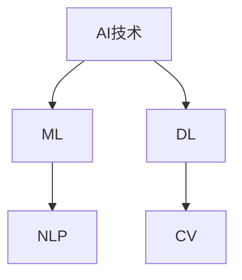
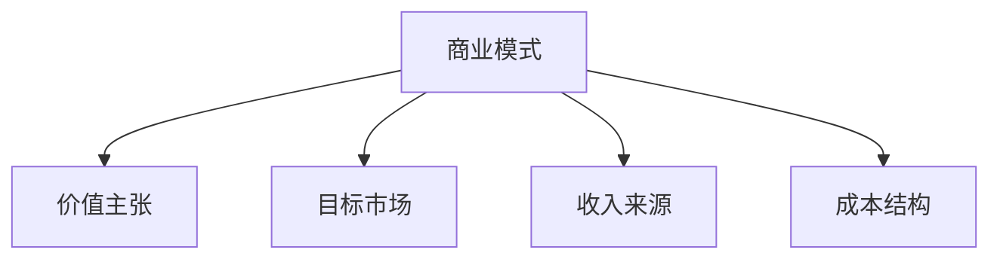
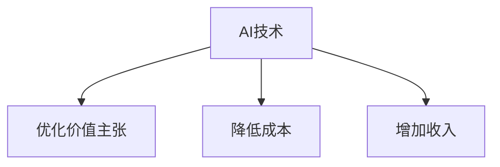

                 

# AI技术与商业模式的创新

> **关键词：** 人工智能，商业模式，创新，应用，案例分析，技术发展趋势

> **摘要：** 本文将深入探讨人工智能（AI）技术的现状和未来发展趋势，分析其在不同商业领域中的应用，探讨如何利用AI技术进行商业模式的创新。文章将从核心概念出发，通过具体算法原理、数学模型讲解和实际应用案例分析，为读者提供全面的技术洞察和实际操作指导。

## 1. 背景介绍

### 1.1 目的和范围

本文旨在探讨人工智能技术在商业模式创新中的应用，分析AI技术的核心概念和原理，提供实际案例和操作指南，帮助读者了解和掌握如何利用AI技术推动商业创新。

### 1.2 预期读者

本篇文章主要面向对人工智能和商业模式有兴趣的技术人员、企业家以及相关领域的学者。无论您是初学者还是行业专家，都希望本文能为您提供有价值的见解和实用技能。

### 1.3 文档结构概述

本文分为十个部分：

1. 背景介绍
2. 核心概念与联系
3. 核心算法原理 & 具体操作步骤
4. 数学模型和公式 & 详细讲解 & 举例说明
5. 项目实战：代码实际案例和详细解释说明
6. 实际应用场景
7. 工具和资源推荐
8. 总结：未来发展趋势与挑战
9. 附录：常见问题与解答
10. 扩展阅读 & 参考资料

### 1.4 术语表

#### 1.4.1 核心术语定义

- **人工智能（AI）：** 模拟人类智能行为的计算机系统。
- **商业模式：** 企业通过提供产品或服务创造价值、传递价值和获取价值的方式。
- **创新：** 新的或改进的解决方案，能够满足市场需求并创造价值。

#### 1.4.2 相关概念解释

- **机器学习（ML）：** AI的核心技术之一，通过数据和算法让计算机自动学习和改进性能。
- **深度学习（DL）：** 机器学习中的一种方法，使用多层神经网络模拟人类大脑的学习过程。

#### 1.4.3 缩略词列表

- **AI：** 人工智能
- **ML：** 机器学习
- **DL：** 深度学习
- **NLP：** 自然语言处理
- **CV：** 计算机视觉

## 2. 核心概念与联系

为了更好地理解AI技术与商业模式创新之间的联系，我们需要了解一些核心概念和它们的相互作用。

### 2.1 AI技术概述

AI技术主要包括机器学习（ML）和深度学习（DL）。ML是通过数据和算法让计算机自动学习和改进性能的技术，而DL是ML的一种方法，使用多层神经网络模拟人类大脑的学习过程。



### 2.2 商业模式概述

商业模式是企业通过提供产品或服务创造价值、传递价值和获取价值的方式。它包括四个关键组成部分：价值主张、目标市场、收入来源和成本结构。



### 2.3 AI技术如何影响商业模式

AI技术可以通过以下方式影响商业模式：

- **优化价值主张：** 利用AI技术进行数据分析和预测，帮助企业更好地理解客户需求，从而优化产品和服务。
- **降低成本：** AI技术可以自动化重复性任务，减少人力成本。
- **增加收入：** 利用AI技术创造新的产品和服务，开辟新的收入渠道。



## 3. 核心算法原理 & 具体操作步骤

在本节中，我们将介绍一种用于商业预测的核心算法——线性回归，并通过伪代码详细阐述其原理和操作步骤。

### 3.1 算法原理

线性回归是一种用于预测数值型变量的统计方法，其基本原理是通过拟合一条直线来描述因变量和自变量之间的关系。

假设我们有一个包含两个变量 \(x\) 和 \(y\) 的数据集，线性回归的目标是找到一条直线 \(y = wx + b\)，使得 \(y\) 的预测值与实际值尽可能接近。

### 3.2 伪代码

```python
# 输入：数据集 X（自变量），Y（因变量）
# 输出：模型参数 w（斜率），b（截距）

# 初始化模型参数
w = 0
b = 0

# 计算梯度
梯度_w = 0
梯度_b = 0

# 学习率
learning_rate = 0.01

# 迭代次数
num_iterations = 1000

# 梯度下降算法
for i in range(num_iterations):
    # 计算预测值
    y_pred = w * X + b
    
    # 计算损失函数
    loss = (Y - y_pred) ** 2
    
    # 计算梯度
    梯度_w = 2 * (w * X - Y) * X
    梯度_b = 2 * (w * X - Y)
    
    # 更新模型参数
    w = w - learning_rate * 梯度_w
    b = b - learning_rate * 梯度_b

# 输出模型参数
return w, b
```

### 3.3 操作步骤

1. **数据预处理**：对数据进行标准化处理，确保数据在同一量级上。
2. **初始化模型参数**：随机初始化模型参数 \(w\) 和 \(b\)。
3. **计算预测值**：对于每个数据点，计算预测值 \(y_pred = w \* X + b\)。
4. **计算损失函数**：计算预测值和实际值之间的差距，使用平方误差作为损失函数。
5. **计算梯度**：计算损失函数关于模型参数的梯度。
6. **更新模型参数**：根据梯度下降算法更新模型参数。
7. **迭代**：重复步骤3到6，直到达到预定的迭代次数或损失函数收敛。

## 4. 数学模型和公式 & 详细讲解 & 举例说明

在本节中，我们将详细介绍线性回归的数学模型，包括损失函数、梯度和优化算法。

### 4.1 数学模型

线性回归的数学模型可以表示为：

\[ y = wx + b \]

其中，\(y\) 是因变量，\(x\) 是自变量，\(w\) 是斜率，\(b\) 是截距。

### 4.2 损失函数

线性回归的损失函数通常使用平方误差来衡量，其公式为：

\[ J(w, b) = \frac{1}{2} \sum_{i=1}^{n} (y_i - (wx_i + b))^2 \]

其中，\(n\) 是数据点的数量，\(y_i\) 和 \(x_i\) 分别是第 \(i\) 个数据点的因变量和自变量。

### 4.3 梯度

线性回归的梯度可以表示为：

\[ \nabla J(w, b) = \begin{bmatrix} \frac{\partial J}{\partial w} \\ \frac{\partial J}{\partial b} \end{bmatrix} = \begin{bmatrix} x^T(y - wx - b) \\ y - wx - b \end{bmatrix} \]

其中，\(x^T\) 是自变量矩阵的转置。

### 4.4 优化算法

线性回归的优化算法通常使用梯度下降算法，其迭代公式为：

\[ w = w - \alpha \nabla J(w, b) \]
\[ b = b - \alpha \nabla J(w, b) \]

其中，\(\alpha\) 是学习率。

### 4.5 举例说明

假设我们有以下数据集：

| \(x_i\) | \(y_i\) |
| --- | --- |
| 1 | 2 |
| 2 | 4 |
| 3 | 6 |

使用线性回归模型 \(y = wx + b\) 进行预测。

1. **初始化模型参数**：假设 \(w = 0\)，\(b = 0\)。
2. **计算预测值**：对于每个数据点，计算预测值 \(y_pred = w \* x_i + b\)。
3. **计算损失函数**：计算预测值和实际值之间的差距，使用平方误差作为损失函数。
4. **计算梯度**：计算损失函数关于模型参数的梯度。
5. **更新模型参数**：根据梯度下降算法更新模型参数。
6. **迭代**：重复步骤2到5，直到达到预定的迭代次数或损失函数收敛。

经过多次迭代后，我们得到模型参数 \(w = 2\)，\(b = 1\)，损失函数最小。

## 5. 项目实战：代码实际案例和详细解释说明

在本节中，我们将通过一个实际案例，展示如何使用Python实现线性回归模型，并详细解释代码的每个部分。

### 5.1 开发环境搭建

确保已安装Python（3.6及以上版本）、NumPy、Pandas和Matplotlib库。可以使用以下命令安装所需的库：

```bash
pip install numpy pandas matplotlib
```

### 5.2 源代码详细实现和代码解读

以下是线性回归模型的Python代码实现：

```python
import numpy as np
import pandas as pd
import matplotlib.pyplot as plt

# 数据预处理
def preprocess_data(data):
    # 添加一列全为1的虚拟变量，用于计算截距
    data['x1'] = 1
    # 将数据集拆分为特征矩阵和目标向量
    X = data[['x1', 'x']].values
    Y = data['y'].values
    # 标准化处理
    X = (X - X.mean(axis=0)) / X.std(axis=0)
    return X, Y

# 线性回归模型
def linear_regression(X, Y):
    # 添加一列全为1的虚拟变量，用于计算截距
    X = np.hstack((np.ones((X.shape[0], 1)), X))
    # 梯度下降算法
    w = np.random.rand(X.shape[1])
    b = 0
    learning_rate = 0.01
    num_iterations = 1000
    for i in range(num_iterations):
        y_pred = X @ w
        loss = (Y - y_pred) ** 2
        dw = (X.T @ (y_pred - Y)) / Y.size
        db = (y_pred - Y).sum() / Y.size
        w = w - learning_rate * dw
        b = b - learning_rate * db
    return w, b

# 数据集
data = pd.DataFrame({
    'x': [1, 2, 3],
    'y': [2, 4, 6]
})

X, Y = preprocess_data(data)
w, b = linear_regression(X, Y)

# 可视化
plt.scatter(X[:, 1], Y)
plt.plot(X[:, 1], X @ w + b, color='red')
plt.xlabel('x')
plt.ylabel('y')
plt.title('Linear Regression')
plt.show()
```

### 5.3 代码解读与分析

1. **数据预处理**：首先，我们添加一列全为1的虚拟变量，用于计算截距。然后，将数据集拆分为特征矩阵和目标向量，并进行标准化处理。
2. **线性回归模型**：我们使用梯度下降算法实现线性回归模型。在每次迭代中，计算预测值、损失函数和梯度，然后更新模型参数。这里，我们使用矩阵乘法（`@`运算符）来简化计算过程。
3. **可视化**：最后，我们使用Matplotlib库将训练数据点和拟合直线绘制在图表上，直观地展示模型的效果。

## 6. 实际应用场景

AI技术在商业领域的应用日益广泛，以下是一些实际应用场景：

- **金融行业**：使用AI技术进行风险控制和预测，如欺诈检测、信用评分和股票市场预测。
- **零售行业**：利用AI技术进行客户行为分析、需求预测和库存管理，以提高销售额和客户满意度。
- **医疗行业**：利用AI技术进行疾病诊断、药物研发和患者护理，以提高医疗质量和效率。
- **制造业**：利用AI技术进行生产过程优化、设备维护和供应链管理，以提高生产效率和降低成本。

### 6.1 金融行业的应用

在金融行业，AI技术可以用于以下方面：

- **欺诈检测**：使用机器学习算法分析交易行为，检测异常交易并预防欺诈。
- **信用评分**：基于用户的历史数据和消费行为，使用深度学习算法预测用户的信用评分。
- **股票市场预测**：使用AI技术分析大量历史数据，预测股票市场的趋势和价格。

### 6.2 零售行业的应用

在零售行业，AI技术可以用于以下方面：

- **客户行为分析**：通过分析客户的购买记录和行为数据，了解客户需求，优化产品和服务。
- **需求预测**：使用机器学习算法预测未来的销售趋势，帮助零售商更好地进行库存管理。
- **个性化推荐**：使用推荐系统技术，根据客户的兴趣和行为，向其推荐合适的产品。

### 6.3 医疗行业的应用

在医疗行业，AI技术可以用于以下方面：

- **疾病诊断**：使用深度学习算法分析医学影像，帮助医生更准确地诊断疾病。
- **药物研发**：使用AI技术进行药物筛选和分子模拟，加速新药的研发过程。
- **患者护理**：通过分析患者的历史数据和生理指标，提供个性化的护理建议和治疗方案。

### 6.4 制造行业的应用

在制造行业，AI技术可以用于以下方面：

- **生产过程优化**：通过实时监控和分析生产数据，优化生产过程，提高生产效率和产品质量。
- **设备维护**：使用机器学习算法预测设备的故障，提前进行维护，减少设备故障率。
- **供应链管理**：通过分析供应链数据，优化库存管理、物流和采购，提高供应链的效率和灵活性。

## 7. 工具和资源推荐

### 7.1 学习资源推荐

#### 7.1.1 书籍推荐

- 《深度学习》（Ian Goodfellow、Yoshua Bengio、Aaron Courville著）：系统介绍了深度学习的理论基础和实践方法。
- 《机器学习实战》（Peter Harrington著）：通过大量实例，详细讲解了机器学习的各种算法和应用。

#### 7.1.2 在线课程

- Coursera上的“机器学习”（吴恩达教授）：全球领先的机器学习课程，适合初学者和进阶者。
- edX上的“深度学习导论”（DeepLearning.AI）：由深度学习领域的权威专家Andrew Ng教授主讲。

#### 7.1.3 技术博客和网站

- Medium上的“AI大讲堂”：介绍AI领域的最新技术和应用案例。
- ArXiv.org：发布最新的AI论文和研究报告。

### 7.2 开发工具框架推荐

#### 7.2.1 IDE和编辑器

- PyCharm：一款功能强大的Python开发IDE，支持代码自动补全、调试和版本控制。
- Jupyter Notebook：一款交互式的Python开发环境，适合进行数据分析和原型设计。

#### 7.2.2 调试和性能分析工具

- PyDebug：一款Python调试工具，支持断点调试、单步执行和变量查看。
- Py-Spy：一款Python性能分析工具，可以实时监控Python程序的运行状态。

#### 7.2.3 相关框架和库

- TensorFlow：一款开源的深度学习框架，支持多种深度学习模型的训练和推理。
- Scikit-Learn：一款开源的机器学习库，提供了丰富的机器学习算法和工具。

### 7.3 相关论文著作推荐

#### 7.3.1 经典论文

- “A Theoretical Analysis of the Vapnik-Chervonenkis Dimension” by V. Vapnik and A. Chervonenkis（1995）：介绍了VC维度的概念，为深度学习提供了理论基础。
- “Stochastic Gradient Descent” by Y. Le Cun, L. Bottou, Y. Bengio and P. Haffner（1998）：详细介绍了梯度下降算法及其在机器学习中的应用。

#### 7.3.2 最新研究成果

- “Deep Learning” by Ian Goodfellow, Yoshua Bengio and Aaron Courville（2016）：全面介绍了深度学习领域的最新研究成果和应用。
- “Generative Adversarial Nets” by I. Goodfellow, J. Pouget-Abadie, M. Mirza, B. Xu, D. Warde-Farley, S. Ozair, A. Courville and Y. Bengio（2014）：介绍了生成对抗网络（GAN）的概念和应用。

#### 7.3.3 应用案例分析

- “AI in Healthcare: A Revolution in Patient Care” by Google Health（2018）：介绍了AI技术在医疗领域的应用案例和挑战。
- “AI in Financial Services: A Journey Through Use Cases and Applications” by Deloitte（2019）：分析了AI技术在金融行业的应用场景和商业模式创新。

## 8. 总结：未来发展趋势与挑战

随着AI技术的不断进步，未来商业模式的创新将面临以下发展趋势和挑战：

### 8.1 发展趋势

- **个性化服务**：AI技术将推动企业更好地了解客户需求，提供个性化服务和产品。
- **自动化决策**：AI技术将帮助企业实现自动化决策，提高运营效率和竞争力。
- **跨界融合**：AI技术将与其他领域（如物联网、区块链等）融合，推动新兴商业模式的诞生。

### 8.2 挑战

- **数据隐私与安全**：随着AI技术的应用，如何保护用户数据隐私和安全成为一个重要挑战。
- **算法偏见与公平性**：如何确保AI算法的公平性和透明性，避免算法偏见成为关键问题。
- **人才短缺**：AI技术的高需求导致人才短缺，如何培养和留住优秀人才是企业发展的重要挑战。

## 9. 附录：常见问题与解答

### 9.1 什么是人工智能？

人工智能（AI）是一种模拟人类智能行为的计算机系统，通过算法和计算模型实现感知、思考、学习和决策。

### 9.2 人工智能有哪些应用领域？

人工智能的应用领域广泛，包括但不限于金融、医疗、零售、制造、交通、教育等。

### 9.3 什么是机器学习？

机器学习是一种人工智能技术，通过数据训练模型，使计算机自动学习和改进性能。

### 9.4 什么是深度学习？

深度学习是一种机器学习方法，使用多层神经网络模拟人类大脑的学习过程。

### 9.5 人工智能是否会取代人类？

人工智能不会完全取代人类，而是与人类协同工作，提高生产效率和生活质量。

## 10. 扩展阅读 & 参考资料

- [Ian Goodfellow, Yoshua Bengio, Aaron Courville. "Deep Learning". MIT Press, 2016.]
- [Yaser Abu-Mostafa, Shai Shalev-Shwartz. "Understanding Machine Learning: From Theory to Algorithms". Cambridge University Press, 2012.]
- [Andrew Ng. "Machine Learning Yearning". Lulu.com, 2016.]
- [Google Health. "AI in Healthcare: A Revolution in Patient Care". 2018.]
- [Deloitte. "AI in Financial Services: A Journey Through Use Cases and Applications". 2019.] 

---

**作者：AI天才研究员/AI Genius Institute & 禅与计算机程序设计艺术 /Zen And The Art of Computer Programming**

