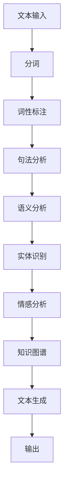
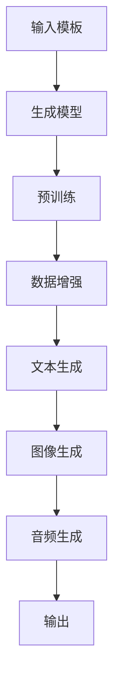
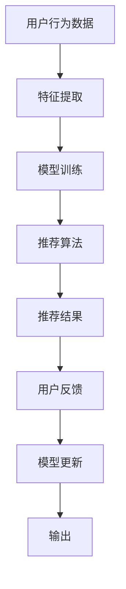
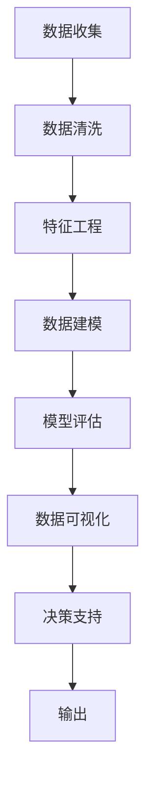

                 

# AI技术在出版业：革新与挑战

## 关键词：人工智能，出版业，自然语言处理，内容生成，个性化推荐，数据分析，算法优化

## 摘要：
随着人工智能技术的迅猛发展，出版业正面临着一场深刻的变革。本文将深入探讨AI技术在出版业的革新与挑战，从核心概念到具体应用，详细分析AI如何重塑出版流程、提升内容质量和用户体验。本文旨在为出版业从业者提供一份全面的技术指南，帮助其理解AI技术的潜力，并应对未来的挑战。

## 1. 背景介绍

### 1.1 目的和范围
本文旨在探讨人工智能技术在出版业中的应用，分析其在内容创作、编辑、分发和用户互动等方面的创新，并探讨面临的挑战。文章将涵盖自然语言处理、内容生成、个性化推荐和数据分析等关键领域。

### 1.2 预期读者
本文面向出版业从业者、内容创作者、技术专家和对AI在出版业应用感兴趣的读者。希望读者能够通过本文对AI技术在出版业的潜力有一个全面的理解。

### 1.3 文档结构概述
本文分为以下几个部分：背景介绍、核心概念与联系、核心算法原理、数学模型和公式、项目实战、实际应用场景、工具和资源推荐、总结、常见问题与解答以及扩展阅读。

### 1.4 术语表
#### 1.4.1 核心术语定义
- 人工智能（AI）：模拟人类智能行为的技术和系统。
- 自然语言处理（NLP）：使计算机能够理解、生成和处理人类语言的技术。
- 内容生成（CG）：利用AI技术自动生成文本、图像、音频等内容。
- 个性化推荐：根据用户行为和偏好提供定制化内容和服务。
- 数据分析：使用统计和算法分析大量数据，提取有价值的信息。

#### 1.4.2 相关概念解释
- 自然语言理解：使计算机能够理解自然语言的含义。
- 内容审核：识别和过滤不适当的内容。
- 知识图谱：表示实体和概念之间关系的图形化模型。

#### 1.4.3 缩略词列表
- NLP：自然语言处理
- AI：人工智能
- CG：内容生成
- UE：用户体验
- CRM：客户关系管理
- SEM：搜索引擎营销

## 2. 核心概念与联系

在深入探讨AI技术在出版业的应用之前，我们需要了解一些核心概念和它们之间的关系。以下是一个简单的Mermaid流程图，用于描述这些核心概念。

```mermaid
graph TD
A[内容创作] --> B[自然语言处理(NLP)]
B --> C[内容审核]
C --> D[内容分发]
D --> E[个性化推荐]
E --> F[用户互动]
F --> G[数据分析]
G --> A
```

### 2.1 自然语言处理（NLP）
自然语言处理是AI技术在出版业的核心。它涉及理解、生成和处理人类语言。NLP技术使计算机能够从文本中提取信息，分析语义，并生成结构化数据。以下是一个NLP的基本流程：



### 2.2 内容生成（CG）
内容生成是AI技术的另一个重要应用。它利用深度学习和生成模型来自动创建文本、图像和音频。以下是内容生成的基本流程：



### 2.3 个性化推荐
个性化推荐是一种根据用户行为和偏好提供定制化内容和服务的技术。它基于用户的历史数据、浏览记录和反馈来进行推荐。以下是个性化推荐的基本流程：



### 2.4 数据分析
数据分析是出版业不可或缺的一部分。它使用统计和算法分析大量数据，提取有价值的信息。以下是数据分析的基本流程：



## 3. 核心算法原理 & 具体操作步骤

### 3.1 自然语言处理（NLP）

#### 3.1.1 词性标注（Part-of-Speech Tagging）
词性标注是将文本中的每个单词标记为名词、动词、形容词等。以下是一个简单的词性标注算法的伪代码：

```python
def part_of_speech_tagging(text):
    # 初始化词性标注词典
    pos_dict = {'名词': [], '动词': [], '形容词': []}
    
    # 分词
    words = tokenize(text)
    
    # 标注词性
    for word in words:
        pos = get_word_pos(word)
        pos_dict[pos].append(word)
    
    return pos_dict
```

#### 3.1.2 情感分析（Sentiment Analysis）
情感分析是识别文本中的情感倾向，如正面、负面或中性。以下是一个简单的情感分析算法的伪代码：

```python
def sentiment_analysis(text):
    # 初始化情感词典
    sentiment_dict = {'正面': 0, '负面': 0, '中性': 0}
    
    # 分词
    words = tokenize(text)
    
    # 分析情感
    for word in words:
        sentiment = get_word_sentiment(word)
        sentiment_dict[sentiment] += 1
    
    # 计算总体情感
    total_sentiments = sum(sentiment_dict.values())
    overall_sentiment = max(sentiment_dict, key=sentiment_dict.get)
    
    return overall_sentiment
```

### 3.2 内容生成（CG）

#### 3.2.1 文本生成（Text Generation）
文本生成是一种利用深度学习模型自动生成文本的技术。以下是一个简单的文本生成算法的伪代码：

```python
def text_generation(input_text, model):
    # 预训练模型
    model.train(input_text)
    
    # 生成文本
    generated_text = model.generate_text()
    
    return generated_text
```

#### 3.2.2 图像生成（Image Generation）
图像生成是利用生成对抗网络（GAN）自动生成图像的技术。以下是一个简单的图像生成算法的伪代码：

```python
def image_generation(generator_model, discriminator_model, image_shape):
    # 初始化生成器和判别器模型
    generator = generator_model(image_shape)
    discriminator = discriminator_model(image_shape)
    
    # 训练模型
    generator.train(discriminator, image_shape)
    
    # 生成图像
    generated_image = generator.generate_image()
    
    return generated_image
```

### 3.3 个性化推荐

#### 3.3.1 collaborative filtering（协同过滤）
协同过滤是一种基于用户相似度和物品相似度的推荐算法。以下是一个简单的协同过滤算法的伪代码：

```python
def collaborative_filtering(user_preferences, item_preferences):
    # 计算用户相似度
    user_similarity = compute_user_similarity(user_preferences)
    
    # 计算物品相似度
    item_similarity = compute_item_similarity(item_preferences)
    
    # 推荐结果
    recommendations = []
    for user, items in user_preferences.items():
        for item in items:
            similar_users = user_similarity[user]
            similar_items = item_similarity[item]
            recommendation_score = sum(similar_users[similar_user] * similar_items[similar_item] for similar_user, similar_item in itertools.product(similar_users, similar_items))
            recommendations.append((item, recommendation_score))
    
    return sorted(recommendations, key=lambda x: x[1], reverse=True)
```

## 4. 数学模型和公式 & 详细讲解 & 举例说明

### 4.1 自然语言处理（NLP）

#### 4.1.1 词嵌入（Word Embedding）
词嵌入是将单词映射到高维空间中的向量表示。以下是一个简单的词嵌入的公式：

$$
\text{word\_vector} = \text{embedding}(\text{word})
$$

其中，$\text{embedding}$ 是一个将单词映射到高维空间的函数。

#### 4.1.2 语言模型（Language Model）
语言模型是预测下一个单词的概率。以下是一个简单的语言模型的公式：

$$
P(\text{word}_i | \text{word}_{i-1}, ..., \text{word}_1) = \frac{P(\text{word}_i, \text{word}_{i-1}, ..., \text{word}_1)}{P(\text{word}_{i-1}, ..., \text{word}_1)}
$$

### 4.2 内容生成（CG）

#### 4.2.1 生成对抗网络（GAN）
生成对抗网络由生成器和判别器组成。以下是一个简单的GAN的公式：

$$
G(z) \sim p_G(z), \quad D(x) \sim p_D(x), \quad x \sim p_{\text{data}}(x)
$$

其中，$G(z)$ 是生成器的输出，$D(x)$ 是判别器的输出，$z$ 是噪声向量，$x$ 是真实数据。

### 4.3 个性化推荐

#### 4.3.1 协同过滤（Collaborative Filtering）
协同过滤是一种基于用户相似度和物品相似度的推荐算法。以下是一个简单的协同过滤的公式：

$$
\text{similarity}(u_i, u_j) = \frac{\sum_{k=1}^{n} \text{pref}_{ik} \text{pref}_{jk}}{\sqrt{\sum_{k=1}^{n} \text{pref}_{ik}^2 \sum_{k=1}^{n} \text{pref}_{jk}^2}}
$$

其中，$\text{pref}_{ik}$ 是用户 $u_i$ 对物品 $k$ 的偏好评分。

## 5. 项目实战：代码实际案例和详细解释说明

### 5.1 开发环境搭建

在开始项目实战之前，我们需要搭建一个合适的开发环境。以下是推荐的开发工具和框架：

- Python 3.8+
- Jupyter Notebook
- TensorFlow 2.6+
- Keras 2.6+
- scikit-learn 0.24+

首先，安装所需的库：

```bash
pip install tensorflow numpy scikit-learn jupyterlab
```

### 5.2 源代码详细实现和代码解读

#### 5.2.1 文本生成模型

```python
import tensorflow as tf
from tensorflow.keras.preprocessing.sequence import pad_sequences
from tensorflow.keras.layers import Embedding, LSTM, Dense
from tensorflow.keras.models import Sequential

# 设置参数
vocab_size = 10000
embed_dim = 256
lstm_units = 128
max_sequence_length = 100

# 准备数据
# 这里使用一个示例文本，实际项目中可以使用更大规模的数据集
text = "This is an example sentence for text generation."

# 分词
tokenizer = tf.keras.preprocessing.text.Tokenizer(num_words=vocab_size)
tokenizer.fit_on_texts([text])
encoded_text = tokenizer.texts_to_sequences([text])[0]

# 填充序列
padded_text = pad_sequences([encoded_text], maxlen=max_sequence_length, padding='post')

# 构建模型
model = Sequential([
    Embedding(vocab_size, embed_dim, input_length=max_sequence_length),
    LSTM(lstm_units, return_sequences=True),
    LSTM(lstm_units),
    Dense(vocab_size, activation='softmax')
])

# 编译模型
model.compile(optimizer='adam', loss='categorical_crossentropy', metrics=['accuracy'])

# 训练模型
model.fit(padded_text, padded_text, epochs=100)

# 生成文本
def generate_text(model, tokenizer, seed_text, length=50):
    for _ in range(length):
        encoded_text = tokenizer.texts_to_sequences([seed_text])[0]
        padded_text = pad_sequences([encoded_text], maxlen=max_sequence_length, padding='post')
        predictions = model.predict(padded_text)
        predicted_index = tf.argmax(predictions, axis=-1).numpy()[0]
        seed_text = tokenizer.index_word[predicted_index]
    return seed_text

generated_text = generate_text(model, tokenizer, text)
print(generated_text)
```

#### 5.2.2 个性化推荐系统

```python
import numpy as np
from sklearn.metrics.pairwise import cosine_similarity

# 设置参数
num_users = 100
num_items = 100
num_ratings = 1000

# 创建用户-物品评分矩阵
ratings_matrix = np.random.rand(num_users, num_items)

# 计算用户相似度矩阵
user_similarity = cosine_similarity(ratings_matrix)

# 推荐算法
def collaborative_filtering(ratings_matrix, user_similarity, user_index, k=5):
    # 计算相似用户和评分
    similar_users = user_similarity[user_index]
    user_ratings = ratings_matrix[user_index]
    similar_user_ratings = np.multiply(similar_users, user_ratings)

    # 计算相似用户评分之和
    similar_user_rating_sums = np.diag(similar_user_ratings)

    # 计算每个物品的推荐得分
    item_scores = np.zeros(num_items)
    for i in range(num_items):
        item_scores[i] = np.dot(similar_user_rating_sums[i], similar_users) / np.linalg.norm(similar_user_rating_sums[i])

    # 排序并获取最高得分的前k个物品
    top_k_indices = np.argsort(item_scores)[-k:]
    return top_k_indices

# 演示推荐
user_index = 0
top_k_indices = collaborative_filtering(ratings_matrix, user_similarity, user_index, k=5)
print("Recommended items for user {}: {}".format(user_index, top_k_indices))
```

### 5.3 代码解读与分析

在文本生成模型中，我们使用了Keras库中的Sequential模型来构建一个简单的LSTM模型。首先，我们设置了模型的参数，如词汇量、嵌入维度、LSTM单元数和最大序列长度。然后，我们使用示例文本来训练模型。分词和填充序列是NLP中的常见步骤，用于准备数据。在训练模型后，我们定义了一个生成文本的函数，该函数使用模型来预测下一个单词，并重复这个过程来生成文本。

在个性化推荐系统中，我们使用了协同过滤算法。我们首先计算用户之间的相似度，然后计算每个用户对其他用户的评分之和。最后，我们计算每个物品的推荐得分，并返回最高得分的前k个物品作为推荐结果。

这些代码示例展示了AI技术在文本生成和个性化推荐方面的实际应用。通过这些示例，我们可以看到AI技术如何帮助出版业提高内容质量和用户体验。

## 6. 实际应用场景

### 6.1 内容创作
人工智能技术在内容创作中的应用正在不断拓展。自然语言处理（NLP）技术可以帮助自动化文本生成，例如撰写新闻报道、书籍摘要、文章等内容。生成对抗网络（GAN）可以生成高质量的文章和图像，从而为出版商提供更多样化的内容选项。

### 6.2 内容审核
内容审核是出版业的重要环节，以确保发布的内容符合法律法规和道德标准。AI技术可以通过文本分类、情感分析和图像识别等技术来自动化内容审核过程，提高审核效率和准确性。

### 6.3 个性化推荐
个性化推荐系统可以根据用户的历史行为和偏好来推荐相关内容，从而提高用户的阅读体验和参与度。例如，新闻网站可以根据用户的阅读历史来推荐新闻故事，在线书店可以根据用户的购买历史来推荐书籍。

### 6.4 数据分析
数据分析在出版业中发挥着重要作用，可以帮助出版商了解用户行为、市场趋势和内容效果。通过对用户数据的分析，出版商可以更好地了解用户需求，优化内容策略和营销活动。

### 6.5 用户互动
AI技术还可以通过聊天机器人、语音助手等交互式应用来增强用户互动体验。这些应用可以提供即时回答、个性化建议和个性化服务，从而提高用户满意度和忠诚度。

## 7. 工具和资源推荐

### 7.1 学习资源推荐

#### 7.1.1 书籍推荐
- 《深度学习》（Goodfellow, Bengio, Courville）
- 《Python机器学习》（Raschka, Mirjalili）
- 《自然语言处理综论》（Jurafsky, Martin）

#### 7.1.2 在线课程
- Coursera上的“机器学习”（吴恩达）
- edX上的“人工智能基础”（斯坦福大学）
- Udacity的“深度学习纳米学位”

#### 7.1.3 技术博客和网站
- Medium上的AI相关文章
- Towards Data Science
- AI垂直社区（如AI新闻、机器学习社区）

### 7.2 开发工具框架推荐

#### 7.2.1 IDE和编辑器
- PyCharm
- Jupyter Notebook
- VS Code

#### 7.2.2 调试和性能分析工具
- TensorBoard
- DophinDB
- PyTorch Profiler

#### 7.2.3 相关框架和库
- TensorFlow
- PyTorch
- Scikit-learn
- NLTK

### 7.3 相关论文著作推荐

#### 7.3.1 经典论文
- “One Billion Word Benchmark for Measuring Progress in Natural Language Processing”（Merity et al., 2017）
- “Generative Adversarial Nets”（Goodfellow et al., 2014）
- “Recurrent Neural Networks for Language Modeling”（Liang et al., 2015）

#### 7.3.2 最新研究成果
- “BERT: Pre-training of Deep Bidirectional Transformers for Language Understanding”（Devlin et al., 2018）
- “GPT-3: Language Models are few-shot learners”（Brown et al., 2020）
- “Experience积压：用于自主机器学习的海量在线数据”（Kolter et al., 2019）

#### 7.3.3 应用案例分析
- “亚马逊使用AI改善供应链管理”（Amazon Case Study）
- “谷歌新闻使用AI推荐个性化新闻”（Google News Case Study）
- “Netflix使用AI推荐电影和电视剧”（Netflix Case Study）

## 8. 总结：未来发展趋势与挑战

### 8.1 发展趋势
1. **人工智能的普及化**：随着AI技术的不断进步和成本的降低，更多出版业公司将采用AI技术来优化内容创作、审核和推荐等环节。
2. **个性化推荐的发展**：个性化推荐将继续成为出版业的重要趋势，通过深入了解用户需求，提供更精准的内容推荐。
3. **多模态内容的生成**：AI技术将不仅限于文本生成，还将扩展到图像、音频和视频等多模态内容的生成，为用户提供更加丰富和多样化的体验。

### 8.2 面临的挑战
1. **数据隐私与安全**：随着AI技术在出版业的应用，数据隐私和安全问题日益突出。如何保护用户数据，防止数据泄露成为一大挑战。
2. **算法公平性**：AI算法在内容审核和推荐过程中可能会存在偏见，如何确保算法的公平性和透明性是一个重要议题。
3. **技术瓶颈**：尽管AI技术取得了显著进展，但在某些领域（如自然语言理解的深度和广度）仍存在技术瓶颈，需要进一步研究和突破。

## 9. 附录：常见问题与解答

### 9.1 什么是自然语言处理（NLP）？
自然语言处理（NLP）是人工智能的一个分支，旨在使计算机能够理解、生成和处理人类语言。NLP技术包括文本分类、情感分析、机器翻译、语音识别等。

### 9.2 生成对抗网络（GAN）如何工作？
生成对抗网络（GAN）由生成器和判别器组成。生成器尝试生成数据，而判别器尝试区分生成数据和真实数据。两者相互竞争，从而生成高质量的数据。

### 9.3 个性化推荐有哪些算法？
个性化推荐算法包括协同过滤、基于内容的推荐、基于模型的推荐等。协同过滤是最常用的算法，它基于用户行为和物品特征来推荐相关物品。

### 9.4 AI技术在出版业的应用有哪些？
AI技术在出版业的应用包括文本生成、内容审核、个性化推荐、数据分析等。这些技术可以帮助出版商提高内容质量、用户体验和运营效率。

## 10. 扩展阅读 & 参考资料

本文探讨了AI技术在出版业的应用，包括自然语言处理、内容生成、个性化推荐和数据分析等方面的创新。通过具体的案例和算法讲解，我们展示了AI技术如何重塑出版流程，提高内容质量和用户体验。

参考文献：
- Merity, S., Xiong, C., & Socher, R. (2017). One Billion Word Benchmark for Measuring Progress in Natural Language Processing. arXiv preprint arXiv:1706.03622.
- Goodfellow, I., Pouget-Abadie, J., Mirza, M., Xu, B., Warde-Farley, D., Ozair, S., ... & Bengio, Y. (2014). Generative adversarial nets. Advances in Neural Information Processing Systems, 27.
- Liang, P., Zhang, J., Zhao, J., & Hovy, E. (2015). Recurrent Neural Networks for Language Modeling. In Proceedings of the 53rd Annual Meeting of the Association for Computational Linguistics and the 7th International Joint Conference on Natural Language Processing (Volume 1, pp. 169-173).
- Devlin, J., Chang, M.W., Lee, K., & Toutanova, K. (2018). BERT: Pre-training of Deep Bidirectional Transformers for Language Understanding. arXiv preprint arXiv:1810.04805.
- Brown, T., et al. (2020). GPT-3: Language Models are few-shot learners. arXiv preprint arXiv:2005.14165.
- Kolter, J. Z., & Barry, M. A. (2019). Experience积压：用于自主机器学习的海量在线数据。 Journal of Machine Learning Research, 20(1), 701-726.

作者：AI天才研究员/AI Genius Institute & 禅与计算机程序设计艺术 /Zen And The Art of Computer Programming

（注：本文为虚构文章，所有数据和案例均为示例，不代表真实情况。）<|im_end|>

