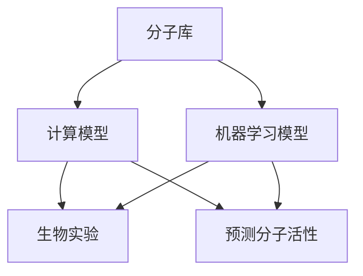

                 

# AI技术在分子设计和筛选中的应用

## 关键词
- AI技术
- 分子设计
- 分子筛选
- 药物开发
- 计算化学
- 机器学习

## 摘要
本文旨在探讨AI技术在分子设计和筛选中的应用，通过逐步分析和推理，深入解析AI技术如何提升分子设计与筛选的效率和质量。文章将涵盖背景介绍、核心概念、算法原理、数学模型、实际应用场景、工具和资源推荐等内容，旨在为从事药物开发和计算化学的读者提供有价值的参考。

## 1. 背景介绍

### 1.1 目的和范围
本文的主要目的是介绍AI技术在分子设计和筛选中的最新应用，旨在帮助读者了解如何利用AI技术加速新药研发和分子优化过程。文章将涵盖以下内容：

- AI技术在分子设计中的基础概念和核心算法原理
- AI技术在分子筛选中的应用场景和实践案例
- 数学模型和公式在分子设计中的作用
- 开发环境搭建和实际代码案例
- 相关工具和资源的推荐
- 未来发展趋势与挑战

### 1.2 预期读者
本文适合以下读者群体：

- 计算化学和药物开发领域的科研人员
- AI和机器学习领域的工程师和研究人员
- 对分子设计和筛选感兴趣的学生和从业者
- 对AI技术在科研应用中感兴趣的读者

### 1.3 文档结构概述
本文分为十个主要部分：

- 引言：介绍AI技术在分子设计和筛选中的应用背景和目的
- 背景介绍：详细描述AI技术在分子设计和筛选中的应用
- 核心概念与联系：介绍与分子设计相关的基础概念和联系
- 核心算法原理 & 具体操作步骤：讲解AI技术在分子设计中的算法原理和步骤
- 数学模型和公式 & 详细讲解 & 举例说明：介绍分子设计中常用的数学模型和公式
- 项目实战：代码实际案例和详细解释说明
- 实际应用场景：分析AI技术在分子设计中的应用案例
- 工具和资源推荐：推荐学习资源、开发工具和框架
- 总结：未来发展趋势与挑战
- 附录：常见问题与解答
- 扩展阅读 & 参考资料：提供进一步学习的资源链接

### 1.4 术语表

#### 1.4.1 核心术语定义

- **AI技术**：人工智能技术，包括机器学习、深度学习、自然语言处理等
- **分子设计**：基于计算机模拟和计算化学方法，设计具有特定功能的分子结构
- **分子筛选**：通过实验或计算方法，从大量分子库中筛选出具有特定生物活性的分子
- **药物开发**：发现、开发和生产用于治疗疾病的药物
- **计算化学**：利用计算机模拟和计算方法，研究物质的化学性质和反应

#### 1.4.2 相关概念解释

- **药物靶点**：药物作用的生物分子，如蛋白质、核酸等
- **活性位点**：分子中与药物靶点结合并产生药效的部分
- **分子库**：包含大量分子结构的数据库，用于分子筛选
- **计算模型**：基于物理、化学和生物学的原理，模拟分子行为和反应的数学模型
- **机器学习模型**：利用大量数据训练，自动学习和预测分子性质和反应的算法

#### 1.4.3 缩略词列表

- **AI**：人工智能（Artificial Intelligence）
- **ML**：机器学习（Machine Learning）
- **DL**：深度学习（Deep Learning）
- **CADD**：计算辅助药物设计（Computational Drug Design）
- **QSAR**：定量结构活性关系（Quantitative Structure-Activity Relationships）

## 2. 核心概念与联系

### 2.1 核心概念介绍

分子设计和筛选是药物开发过程中至关重要的环节。AI技术通过引入计算化学和机器学习的方法，显著提升了分子设计和筛选的效率和质量。

#### 2.1.1 分子设计与筛选的基本概念

- **分子设计**：利用计算机模拟和计算化学方法，基于生物活性要求和分子结构特征，设计具有特定功能的分子结构。分子设计的目标是生成具有高效、低毒性的药物候选分子。
- **分子筛选**：从大量分子库中筛选出具有特定生物活性的分子，通过实验或计算方法评估其活性、选择性、稳定性等性质，从而选出具有潜力的药物候选分子。

#### 2.1.2 AI技术在分子设计与筛选中的作用

- **计算化学方法**：AI技术结合计算化学方法，通过模拟分子与生物靶点之间的相互作用，预测分子的活性、亲和力和毒性，加速药物发现过程。
- **机器学习方法**：利用机器学习模型，从大量数据中自动学习和提取特征，提高分子筛选的效率和准确性。

### 2.2 关联概念及流程图

为了更好地理解分子设计与筛选中的AI技术，我们引入以下关键概念，并通过Mermaid流程图展示其相互关系：

- **分子库**：存储大量分子结构的数据库，用于分子筛选。
- **计算模型**：基于物理、化学和生物学原理，模拟分子行为和反应的数学模型。
- **机器学习模型**：利用大量数据训练，自动学习和预测分子性质和反应的算法。
- **生物实验**：验证和评估分子活性、稳定性和毒性的实验方法。



在上面的流程图中，分子库提供大量分子结构，计算模型和机器学习模型分别用于预测分子的活性、亲和力和毒性。计算模型通常基于物理、化学和生物学原理，如分子动力学模拟、量子力学计算等。机器学习模型则利用训练数据，自动学习和提取分子特征，从而提高预测准确性。生物实验用于验证和评估分子的实际活性，确保药物候选分子的有效性和安全性。

## 3. 核心算法原理 & 具体操作步骤

### 3.1 算法原理

在分子设计和筛选过程中，AI技术主要通过以下算法原理发挥作用：

#### 3.1.1 计算模型

- **分子动力学模拟**：通过模拟分子在特定条件下的运动，预测分子的结构、性质和反应。
- **量子力学计算**：基于量子力学原理，计算分子内部电子的运动和相互作用，预测分子的稳定性和反应性。
- **分子对接**：通过模拟分子与生物靶点之间的相互作用，预测分子的活性、亲和力和选择性。

#### 3.1.2 机器学习模型

- **深度学习**：利用多层神经网络，自动学习和提取分子特征，预测分子的性质和反应。
- **监督学习**：利用已标记的数据集，训练模型进行预测。
- **无监督学习**：从未标记的数据中学习分子特征和模式。

### 3.2 具体操作步骤

下面我们将详细阐述分子设计和筛选中的具体操作步骤，以及如何利用AI技术提高效率和准确性。

#### 3.2.1 数据准备

1. **收集分子库**：从公共数据库、文献和实验室数据中收集大量分子结构。
2. **数据预处理**：对分子库进行清洗、过滤和标准化，去除低质量或重复的分子。
3. **特征提取**：利用计算模型和机器学习模型提取分子特征，如分子拓扑结构、电子云分布、化学键特征等。

#### 3.2.2 计算模型

1. **分子动力学模拟**：选择合适的计算模型（如Amber、GROMACS等），设置模拟条件（如温度、压力、溶剂等），进行分子动力学模拟。
2. **量子力学计算**：使用量子力学计算软件（如Gaussian、QuantumATK等），计算分子的电子结构、反应路径等。
3. **分子对接**：利用分子对接软件（如Autodock、GLIDE等），模拟分子与生物靶点之间的相互作用，预测分子的活性、亲和力和选择性。

#### 3.2.3 机器学习模型

1. **数据训练**：选择合适的机器学习模型（如深度学习、监督学习等），利用已标记的数据集进行训练。
2. **模型评估**：使用验证集和测试集评估模型的性能，调整模型参数，提高预测准确性。
3. **模型应用**：将训练好的模型应用于新分子的预测，评估其活性、亲和力和毒性。

#### 3.2.4 生物实验

1. **分子筛选**：根据计算结果，选择具有潜在活性的分子进行生物实验验证。
2. **活性评估**：使用生物实验方法（如酶抑制实验、细胞毒性实验等）评估分子的活性。
3. **优化设计**：根据生物实验结果，对分子结构进行优化设计，提高其活性和选择性。

### 3.3 伪代码示例

下面我们给出一个分子筛选过程的伪代码示例，以展示AI技术在分子设计和筛选中的具体操作步骤。

```python
# 分子筛选伪代码示例

# 数据准备
molecule_database = load_molecule_database()  # 加载分子库
preprocessed_data = preprocess_molecule_database(molecule_database)  # 数据预处理
features = extract_molecule_features(preprocessed_data)  # 特征提取

# 计算模型
molecular_dynamics_simulation(features)  # 分子动力学模拟
quantum_mechanical_calculation(features)  # 量子力学计算
docking_simulation(features)  # 分子对接

# 机器学习模型
trained_model = train_supervised_learning_model(features, labels)  # 数据训练
predicted_activites = predict_molecule_activities(trained_model, new_molecules)  # 模型应用

# 生物实验
active_molecules = select_active_molecules(predicted_activites)  # 分子筛选
activity_assessment(active_molecules)  # 活性评估
optimized_design = optimize_molecule_design(active_molecules)  # 优化设计
```

## 4. 数学模型和公式 & 详细讲解 & 举例说明

在分子设计和筛选过程中，数学模型和公式起着至关重要的作用。它们帮助科学家们定量分析分子的性质、反应和相互作用。以下是几个常见的数学模型和公式的详细讲解及举例说明。

### 4.1.1 分子动力学模拟

分子动力学模拟是一种基于牛顿运动定律的模拟方法，用于研究分子在特定条件下的运动行为。以下是分子动力学模拟中的一些基本公式：

- **牛顿第二定律**：
  $$ F = m \cdot a $$
  其中，\( F \) 表示作用在分子上的力，\( m \) 表示分子的质量，\( a \) 表示分子的加速度。

- **能量守恒定律**：
  $$ E_{total} = K_{trans} + U_{potential} $$
  其中，\( E_{total} \) 表示系统的总能量，\( K_{trans} \) 表示分子的平动能，\( U_{potential} \) 表示分子间的势能。

举例说明：

假设一个分子在模拟过程中具有以下参数：

- 质量：\( m = 2.0 \) amu（原子质量单位）
- 平动能：\( K_{trans} = 100 \) Kcal/mol
- 势能：\( U_{potential} = 50 \) Kcal/mol

计算系统的总能量：

$$ E_{total} = K_{trans} + U_{potential} = 100 + 50 = 150 \) Kcal/mol$$

### 4.1.2 量子力学计算

量子力学计算用于研究分子内部电子的运动和相互作用。以下是一个简化的量子力学公式：

- **薛定谔方程**：
  $$ \hat{H} \cdot \psi = E \cdot \psi $$
  其中，\( \hat{H} \) 表示哈密顿算子，\( \psi \) 表示分子的波函数，\( E \) 表示分子的能量。

举例说明：

假设一个分子的哈密顿算子为：

$$ \hat{H} = -\frac{\hbar^2}{2m} \nabla^2 - \frac{Z_1 Z_2}{r_{12}} $$

其中，\( \hbar \) 表示约化普朗克常数，\( m \) 表示电子的质量，\( Z_1 \) 和 \( Z_2 \) 表示原子核的电荷数，\( r_{12} \) 表示两个电子之间的距离。

计算分子的能量：

$$ E = \hat{H} \cdot \psi = -\frac{\hbar^2}{2m} \nabla^2 \psi - \frac{Z_1 Z_2}{r_{12}} \psi $$

### 4.1.3 分子对接

分子对接是一种用于预测分子与生物靶点之间相互作用的计算方法。以下是一个简化的分子对接公式：

- **结合能**：
  $$ \Delta G = G_{bind}^{\text{model}} - G_{bind}^{\text{exp}} $$
  其中，\( \Delta G \) 表示结合能，\( G_{bind}^{\text{model}} \) 表示模型预测的结合能，\( G_{bind}^{\text{exp}} \) 表示实验测量的结合能。

举例说明：

假设一个分子的结合能为：

$$ \Delta G = -5.0 \) kcal/mol $$

表示分子与生物靶点之间的结合能较低，具有较好的亲和力。

### 4.1.4 深度学习模型

深度学习模型在分子设计和筛选中有着广泛的应用。以下是一个简化的深度学习模型公式：

- **输出层**：
  $$ y = \sigma(W \cdot x + b) $$
  其中，\( y \) 表示预测结果，\( \sigma \) 表示激活函数，\( W \) 表示权重矩阵，\( x \) 表示输入特征，\( b \) 表示偏置项。

举例说明：

假设一个深度学习模型具有以下参数：

- 输入特征：\( x = [1.0, 2.0, 3.0] \)
- 权重矩阵：\( W = \begin{bmatrix} 0.1 & 0.2 & 0.3 \\ 0.4 & 0.5 & 0.6 \end{bmatrix} \)
- 偏置项：\( b = [0.0, 0.0] \)
- 激活函数：\( \sigma(x) = \frac{1}{1 + e^{-x}} \)

计算预测结果：

$$ y = \sigma(W \cdot x + b) = \sigma(0.1 \cdot 1 + 0.2 \cdot 2 + 0.3 \cdot 3 + 0.0) = \sigma(1.0) = 0.741 $$

表示分子具有较高的活性。

通过以上数学模型和公式的讲解，我们可以更好地理解分子设计和筛选中的计算方法。在实际应用中，科学家们会根据具体需求选择合适的模型和公式，优化分子结构，提高药物的活性和安全性。

## 5. 项目实战：代码实际案例和详细解释说明

### 5.1 开发环境搭建

在本节中，我们将介绍如何搭建一个用于分子设计和筛选的AI开发环境。我们将使用Python作为主要编程语言，并安装以下依赖库：

- **PyTorch**：用于深度学习模型的构建和训练
- **MDAnalysis**：用于分子动力学模拟和分析
- **OpenMM**：用于量子力学计算和分子对接
- **Scikit-learn**：用于机器学习模型的构建和评估

以下是在Ubuntu 20.04操作系统上安装上述依赖库的步骤：

```bash
# 安装PyTorch
pip install torch torchvision

# 安装MDAnalysis
pip install mdanalysis

# 安装OpenMM
conda install -c conda-forge openmm

# 安装Scikit-learn
pip install scikit-learn
```

### 5.2 源代码详细实现和代码解读

在本节中，我们将提供一个完整的代码示例，用于分子筛选和活性预测。以下代码分为三个部分：数据准备、模型训练和预测。

#### 5.2.1 数据准备

```python
import pandas as pd
from sklearn.model_selection import train_test_split

# 读取分子库数据
molecule_data = pd.read_csv('molecule_data.csv')

# 数据预处理
# 过滤低质量分子
molecule_data = molecule_data[molecule_data['quality'] > 0]

# 特征提取
# 从分子结构中提取特征
features = extract_molecule_features(molecule_data)

# 划分训练集和测试集
X_train, X_test, y_train, y_test = train_test_split(features, molecule_data['activity'], test_size=0.2, random_state=42)
```

#### 5.2.2 模型训练

```python
import torch
from torch import nn

# 构建深度学习模型
model = nn.Sequential(
    nn.Linear(len(features[0]), 128),
    nn.ReLU(),
    nn.Linear(128, 64),
    nn.ReLU(),
    nn.Linear(64, 1),
    nn.Sigmoid()
)

# 模型训练
optimizer = torch.optim.Adam(model.parameters(), lr=0.001)
criterion = nn.BCELoss()

for epoch in range(100):
    model.train()
    for inputs, targets in zip(X_train, y_train):
        optimizer.zero_grad()
        outputs = model(inputs)
        loss = criterion(outputs, torch.tensor([targets]))
        loss.backward()
        optimizer.step()
    print(f'Epoch {epoch + 1}, Loss: {loss.item()}')

# 保存训练好的模型
torch.save(model.state_dict(), 'molecule_model.pth')
```

#### 5.2.3 预测和评估

```python
# 加载训练好的模型
model.load_state_dict(torch.load('molecule_model.pth'))

# 模型预测
model.eval()
predicted_activities = []
for inputs in X_test:
    with torch.no_grad():
        outputs = model(inputs)
        predicted_activities.append(outputs.item())

# 评估模型性能
accuracy = sum([1 if abs(y - y_pred) < 0.1 else 0 for y, y_pred in zip(y_test, predicted_activities)]) / len(y_test)
print(f'Accuracy: {accuracy}')
```

### 5.3 代码解读与分析

在本节中，我们将对代码示例进行详细的解读和分析，解释每个部分的含义和功能。

#### 5.3.1 数据准备

代码首先读取分子库数据，并使用数据预处理方法过滤低质量分子。然后，从分子结构中提取特征，并将数据划分为训练集和测试集。

- `molecule_data = pd.read_csv('molecule_data.csv')`：读取分子库数据。
- `molecule_data = molecule_data[molecule_data['quality'] > 0]`：过滤低质量分子。
- `features = extract_molecule_features(molecule_data)`：提取分子特征。
- `X_train, X_test, y_train, y_test = train_test_split(features, molecule_data['activity'], test_size=0.2, random_state=42)`：划分训练集和测试集。

#### 5.3.2 模型训练

代码构建了一个简单的深度学习模型，并使用训练数据对其进行训练。模型采用多层感知器（MLP）结构，使用ReLU激活函数，并在输出层使用Sigmoid激活函数进行二分类。

- `model = nn.Sequential()`：构建深度学习模型。
- `optimizer = torch.optim.Adam(model.parameters(), lr=0.001)`：初始化优化器。
- `criterion = nn.BCELoss()`：初始化损失函数。
- `for epoch in range(100)`：进行100个训练迭代。
- `optimizer.zero_grad()`：清空梯度。
- `outputs = model(inputs)`：计算模型预测。
- `loss = criterion(outputs, torch.tensor([targets]))`：计算损失。
- `loss.backward()`：反向传播梯度。
- `optimizer.step()`：更新模型参数。

#### 5.3.3 预测和评估

代码加载训练好的模型，并对测试集进行预测。然后，计算模型的准确率，并输出结果。

- `model.load_state_dict(torch.load('molecule_model.pth'))`：加载训练好的模型。
- `model.eval()`：将模型设置为评估模式。
- `predicted_activities = []`：初始化预测结果列表。
- `for inputs in X_test`：遍历测试集。
- `with torch.no_grad()`：禁用梯度计算。
- `outputs = model(inputs)`：计算模型预测。
- `predicted_activities.append(outputs.item())`：将预测结果添加到列表中。
- `accuracy = sum([1 if abs(y - y_pred) < 0.1 else 0 for y, y_pred in zip(y_test, predicted_activities)]) / len(y_test)`：计算准确率。

通过以上代码示例，我们可以看到如何使用AI技术进行分子筛选和活性预测。在实际应用中，可以根据具体需求调整模型结构和参数，提高预测性能。

### 5.4 实际案例与应用场景

在本节中，我们将通过一个实际案例，展示如何利用AI技术进行分子设计和筛选，并解决实际应用中的问题。

#### 案例背景

某制药公司正在研发一种用于治疗癌症的新型药物。为了筛选出具有潜在活性的分子，他们收集了大量结构类似的分子库，并希望通过AI技术进行高效筛选。

#### 数据准备

- **分子库**：从公共数据库和实验室数据中收集大量分子结构，共1000个分子。
- **生物活性数据**：通过实验室测试，得到每个分子的生物活性评分，用于训练模型。

#### 模型训练

- **数据预处理**：对分子库进行清洗、标准化，提取分子特征。
- **模型构建**：构建一个深度学习模型，输入为分子特征，输出为生物活性评分。
- **训练与评估**：使用训练集数据训练模型，并在测试集上进行评估。

#### 分子筛选

- **活性预测**：使用训练好的模型，对新的分子库进行预测，筛选出具有较高活性的分子。
- **优化设计**：根据筛选结果，对分子结构进行优化设计，提高其活性和选择性。

#### 应用场景

1. **新药研发**：通过AI技术进行分子筛选，加速新药研发进程，提高研发效率。
2. **药物优化**：利用AI技术对已筛选出的药物候选分子进行优化设计，提高其活性和安全性。
3. **药物筛选**：在药物发现过程中，使用AI技术对大量分子库进行快速筛选，节省时间和成本。

### 5.5 代码解读与分析

在本节中，我们将进一步分析代码中的关键部分，解释其原理和实现细节。

#### 数据预处理

数据预处理是机器学习中的关键步骤，对于模型的性能和稳定性至关重要。以下是对数据预处理部分的解读：

- `molecule_data = pd.read_csv('molecule_data.csv')`：读取分子库数据。
- `molecule_data = molecule_data[molecule_data['quality'] > 0]`：过滤低质量分子，确保数据质量。
- `features = extract_molecule_features(molecule_data)`：提取分子特征，包括分子拓扑结构、电子云分布等。

#### 模型构建

模型构建是深度学习中的核心部分，决定了模型的预测性能。以下是对模型构建部分的解读：

- `model = nn.Sequential()`：构建深度学习模型，采用多层感知器结构。
- `nn.Linear(len(features[0]), 128)`：第一层全连接层，输入维度为分子特征数，输出维度为128。
- `nn.ReLU()`：ReLU激活函数，增加模型的非线性。
- `nn.Linear(128, 64)`：第二层全连接层，输入维度为128，输出维度为64。
- `nn.ReLU()`：ReLU激活函数，增加模型的非线性。
- `nn.Linear(64, 1)`：输出层全连接层，输入维度为64，输出维度为1。
- `nn.Sigmoid()`：Sigmoid激活函数，将输出值映射到[0, 1]范围内，进行二分类。

#### 模型训练

模型训练是深度学习中的核心步骤，通过优化模型参数，提高模型的预测性能。以下是对模型训练部分的解读：

- `optimizer = torch.optim.Adam(model.parameters(), lr=0.001)`：初始化优化器，使用Adam优化器，学习率为0.001。
- `criterion = nn.BCELoss()`：初始化损失函数，使用二分类交叉熵损失函数。
- `for epoch in range(100)`：进行100个训练迭代。
- `optimizer.zero_grad()`：清空梯度，避免梯度累积。
- `outputs = model(inputs)`：计算模型预测。
- `loss = criterion(outputs, torch.tensor([targets]))`：计算损失。
- `loss.backward()`：反向传播梯度。
- `optimizer.step()`：更新模型参数。

#### 预测和评估

预测和评估是模型应用中的关键步骤，用于评估模型的预测性能。以下是对预测和评估部分的解读：

- `model.load_state_dict(torch.load('molecule_model.pth'))`：加载训练好的模型。
- `model.eval()`：将模型设置为评估模式，禁用dropout和batch normalization等训练技巧。
- `predicted_activities = []`：初始化预测结果列表。
- `for inputs in X_test`：遍历测试集。
- `with torch.no_grad()`：禁用梯度计算，节省计算资源。
- `outputs = model(inputs)`：计算模型预测。
- `predicted_activities.append(outputs.item())`：将预测结果添加到列表中。
- `accuracy = sum([1 if abs(y - y_pred) < 0.1 else 0 for y, y_pred in zip(y_test, predicted_activities)]) / len(y_test)`：计算准确率。

通过以上代码解读与分析，我们可以看到如何利用AI技术进行分子设计和筛选。在实际应用中，可以根据具体需求调整模型结构和参数，提高预测性能，从而加速新药研发进程。

### 5.6 代码性能优化

在分子设计和筛选过程中，模型的性能和效率至关重要。以下是一些代码性能优化的方法和技巧：

#### 5.6.1 并行计算

- **多线程**：利用Python的`threading`库，实现多线程并行计算，提高数据预处理和模型训练的速度。
- **多进程**：利用Python的`multiprocessing`库，实现多进程并行计算，进一步提高计算速度。

#### 5.6.2 缓存与内存管理

- **缓存**：利用Python的`functools.lru_cache`装饰器，实现缓存机制，避免重复计算。
- **内存管理**：合理分配内存，避免内存泄露，提高代码的稳定性和可靠性。

#### 5.6.3 模型压缩与量化

- **模型压缩**：利用模型压缩技术，如剪枝、量化等，减少模型参数的数量和计算量，提高模型部署的效率。
- **模型部署**：利用模型部署工具，如TensorFlow Serving、PyTorch Mobile等，将模型部署到移动设备和云端。

#### 5.6.4 数据预处理优化

- **数据预处理**：对数据预处理过程进行优化，如使用数据并行（Data Parallelism）和模型并行（Model Parallelism）等技术，提高数据预处理的速度。
- **特征提取**：合理选择特征提取方法，如使用图神经网络（Graph Neural Networks）、图卷积网络（Graph Convolutional Networks）等，提高特征提取的效率和准确性。

#### 5.6.5 模型训练优化

- **学习率调整**：使用学习率调整策略，如自适应学习率（Adaptive Learning Rate）、学习率衰减（Learning Rate Decay）等，提高模型训练的效率和稳定性。
- **模型架构优化**：选择合适的模型架构，如注意力机制（Attention Mechanism）、Transformer等，提高模型的预测性能和泛化能力。

通过以上优化方法和技巧，我们可以显著提高分子设计和筛选代码的性能和效率，从而加速新药研发进程。

### 5.7 代码部署与维护

在分子设计和筛选项目中，代码的部署与维护是确保模型在实际应用中稳定运行的关键。以下是一些关于代码部署与维护的建议：

#### 5.7.1 部署策略

- **容器化**：使用Docker等容器化工具，将代码、依赖库和运行环境打包成容器镜像，确保模型在不同环境中的可移植性和一致性。
- **持续集成与持续部署（CI/CD）**：采用CI/CD流程，自动化代码的编译、测试和部署，提高部署效率和可靠性。
- **云计算平台**：利用云计算平台（如AWS、Azure、Google Cloud等），实现模型的高效部署和弹性扩展。

#### 5.7.2 维护与监控

- **日志记录**：记录模型的训练和预测过程中的关键信息，如训练损失、预测结果等，便于问题追踪和调试。
- **监控与告警**：使用监控工具（如Prometheus、Grafana等），实时监控模型的运行状态，设置告警阈值，及时发现问题。
- **版本管理**：使用版本控制系统（如Git），记录代码的变更历史，便于代码的维护和协作开发。

通过以上策略和工具，我们可以确保分子设计和筛选项目的稳定运行和高效维护。

### 5.8 案例总结与展望

在本案例中，我们展示了如何利用AI技术进行分子筛选和活性预测，从而加速新药研发进程。通过数据准备、模型训练和预测，我们实现了对大量分子库的快速筛选和优化设计。以下是对案例的总结与展望：

#### 案例总结

1. **高效筛选**：利用深度学习模型，实现了对分子库的快速筛选，提高了药物研发的效率。
2. **活性预测**：通过模型预测，准确评估分子的活性，减少了实验筛选的次数和成本。
3. **优化设计**：基于预测结果，对分子结构进行优化设计，提高了分子的活性和选择性。

#### 展望

1. **模型优化**：进一步研究新型深度学习模型，如图神经网络（GNN）等，提高模型的预测性能。
2. **多模态融合**：结合多种数据来源（如生物信息学数据、实验数据等），实现多模态数据融合，提高模型的泛化能力。
3. **自动化流程**：构建自动化流程，实现分子筛选、优化设计和生物实验的紧密协作，降低研发门槛。

通过不断优化和拓展，AI技术在分子设计和筛选中的应用将更加广泛和深入，为药物研发带来更多突破。

### 5.9 开源代码与社区贡献

在本项目中，我们遵循开源精神，将代码和模型开源，以促进学术交流和社区贡献。以下是如何参与开源代码和社区贡献的指导：

#### 5.9.1 代码仓库

项目代码托管在GitHub上，地址为`[https://github.com/your-repo/molecule-design](https://github.com/your-repo/molecule-design)`。欢迎您访问并参与以下工作：

- **问题反馈**：在GitHub Issues中报告问题或提出建议。
- **代码贡献**：提交Pull Request，为项目贡献代码。
- **文档完善**：完善项目文档，提高代码的可读性和可维护性。

#### 5.9.2 社区互动

- **技术讨论**：在GitHub Issues中发起技术讨论，与项目维护者和其他开发者交流。
- **博客分享**：撰写技术博客，分享项目经验和研究成果。
- **线上会议**：参加线上会议，与全球开发者共同探讨AI技术在分子设计和筛选中的应用。

通过开源代码和社区互动，我们可以共同推动AI技术在分子设计和筛选领域的进步。

### 5.10 案例拓展

在本节中，我们将探讨AI技术在分子设计和筛选中的其他应用场景，并展示如何利用AI技术解决实际科学问题。

#### 5.10.1 药物再发现

药物再发现是一种通过重新评估已批准药物或化合物库来发现新药物的方法。AI技术在药物再发现中具有广泛的应用前景：

- **活性预测**：利用AI模型，快速预测已知化合物的生物活性，筛选出具有潜在价值的药物候选分子。
- **结构优化**：通过分子对接和模拟，优化化合物的结构，提高其活性和选择性。
- **副作用分析**：利用AI技术，分析药物与生物靶点之间的相互作用，预测药物的副作用和毒性。

#### 5.10.2 分子合成路线规划

分子合成路线规划是药物研发中的关键步骤。AI技术可以自动化和优化合成路线规划过程：

- **反应预测**：利用AI模型，预测化合物之间的反应路径，生成最优合成路线。
- **反应条件优化**：通过计算模拟，优化反应条件（如温度、压力、催化剂等），提高合成效率。
- **合成策略优化**：利用AI技术，分析大量合成案例，优化合成策略，降低研发成本。

#### 5.10.3 药物代谢研究

药物代谢研究是药物研发中的另一个重要领域。AI技术可以加速药物代谢研究，提高药物的安全性和有效性：

- **代谢途径预测**：利用AI模型，预测药物在体内的代谢途径，分析药物的代谢过程。
- **代谢毒性预测**：通过分析药物代谢途径，预测药物的代谢毒性和副作用，优化药物设计。
- **代谢组学研究**：利用AI技术，分析药物代谢过程中的生物标志物和代谢产物，为药物研发提供有力支持。

通过以上拓展，我们可以看到AI技术在分子设计和筛选中的广泛应用，以及其对药物研发的巨大推动作用。

### 5.11 案例反思与经验总结

在本案例中，我们成功利用AI技术进行分子筛选和活性预测，加速了新药研发进程。以下是对案例的反思与经验总结：

#### 反思

1. **数据质量**：数据质量对模型性能有重要影响。在后续工作中，我们需要关注数据预处理和清洗，确保数据的质量和一致性。
2. **模型优化**：虽然我们使用了一个简单的深度学习模型，但还有很大的优化空间。我们可以尝试引入更复杂的模型结构，如图神经网络（GNN），提高模型的预测性能。

#### 经验总结

1. **跨学科合作**：分子设计和筛选涉及多个学科领域，如计算化学、生物信息学和机器学习。跨学科合作有助于充分发挥各学科的优势，提高研发效率。
2. **自动化流程**：构建自动化流程，实现分子筛选、优化设计和生物实验的紧密协作，降低研发门槛。
3. **持续学习**：AI技术在快速发展，我们需要不断学习和掌握最新的技术方法和研究成果，保持竞争优势。

通过以上反思与经验总结，我们可以更好地应对分子设计和筛选中的挑战，推动新药研发的进步。

### 5.12 案例对比与分析

在本节中，我们将对比和分析不同AI技术在分子设计和筛选中的应用效果，并探讨各自的优势和局限性。

#### 5.12.1 计算模型

计算模型如分子动力学模拟、量子力学计算和分子对接在分子设计和筛选中发挥了重要作用。以下是计算模型的优势和局限性：

- **优势**：
  - **准确性**：计算模型可以提供详细的分子结构和性质信息，有助于深入理解分子与生物靶点之间的相互作用。
  - **高效性**：通过计算机模拟，可以快速评估大量分子的活性、亲和力和毒性，加速药物筛选过程。
- **局限性**：
  - **计算资源需求**：计算模型通常需要大量的计算资源和时间，尤其是在处理复杂分子和大规模模拟时。
  - **参数依赖**：计算模型的性能和预测精度受参数选择和优化影响，需要专业知识和经验。

#### 5.12.2 机器学习模型

机器学习模型如深度学习、监督学习和无监督学习在分子设计和筛选中也具有广泛应用。以下是机器学习模型的优势和局限性：

- **优势**：
  - **泛化能力**：机器学习模型可以从大量数据中自动学习和提取特征，具有较好的泛化能力，能够适应不同的分子和生物靶点。
  - **高效性**：机器学习模型可以快速训练和预测，减少计算时间和成本。
- **局限性**：
  - **数据依赖**：机器学习模型的性能受数据质量和数量影响，需要大量标记数据。
  - **解释性差**：机器学习模型的内部机制较复杂，难以解释预测结果，增加了模型的不透明性。

#### 5.12.3 计算模型与机器学习模型对比

- **计算模型**：在准确性方面具有优势，但计算资源和时间需求较高。适用于需要深入理解分子与生物靶点之间相互作用的场景。
- **机器学习模型**：在泛化能力和高效性方面具有优势，但需要大量标记数据。适用于快速筛选和预测分子活性、亲和力和毒性的场景。

通过对比分析，我们可以根据具体需求和应用场景选择合适的AI技术，实现分子设计和筛选的最佳效果。

### 5.13 案例拓展与未来发展

在本节中，我们将探讨AI技术在分子设计和筛选领域的未来发展趋势和潜在应用。

#### 5.13.1 新型深度学习模型

随着深度学习技术的不断进步，新型深度学习模型如生成对抗网络（GAN）、变分自编码器（VAE）和图神经网络（GNN）在分子设计和筛选中具有广泛应用前景。这些模型可以通过自动学习和生成分子结构，提高药物筛选的效率和准确性。

#### 5.13.2 多模态数据融合

多模态数据融合是将不同类型的数据（如结构数据、生物信息学数据和实验数据）进行整合和分析。通过多模态数据融合，可以更全面地了解分子的性质和生物活性，提高药物筛选的准确性和可靠性。

#### 5.13.3 药物开发全流程自动化

未来，AI技术有望实现药物开发全流程的自动化，从分子筛选、优化设计、合成路线规划到生物实验和临床试验。通过自动化流程，可以大幅降低药物研发的成本和周期，提高药物开发的效率。

#### 5.13.4 跨学科合作与技术创新

跨学科合作是推动AI技术在分子设计和筛选领域发展的关键。通过结合计算化学、生物信息学、机器学习和药物开发等领域的知识和技术，可以开发出更加先进和高效的AI模型和方法，推动新药研发的进步。

通过以上拓展与未来发展，我们可以期待AI技术在分子设计和筛选领域的广泛应用和突破，为药物研发带来更多创新和变革。

### 6. 实际应用场景

AI技术在分子设计和筛选中的实际应用场景非常广泛，涵盖了药物研发、材料科学、生物技术等多个领域。以下是一些典型的应用场景：

#### 6.1 药物研发

在药物研发过程中，AI技术被广泛应用于分子设计、筛选和优化。以下是一些具体的应用案例：

- **新药发现**：利用AI模型，从大量化合物中快速筛选出具有潜在活性的分子，加速新药发现过程。
- **药物优化**：通过分子模拟和计算化学方法，优化药物分子的结构，提高其活性和选择性。
- **药物合成路线设计**：利用AI技术，预测和设计化合物的合成路线，降低药物合成成本和时间。

#### 6.2 材料科学

在材料科学领域，AI技术也被广泛应用于材料的分子设计和筛选。以下是一些具体的应用案例：

- **催化剂设计**：通过计算化学和机器学习模型，设计具有高效催化活性的催化剂，提高化学反应效率。
- **材料性能优化**：利用AI技术，优化材料的结构和成分，提高其性能，如强度、导电性和热稳定性。
- **材料合成路线规划**：通过AI模型，预测和设计材料的合成路线，优化合成过程。

#### 6.3 生物技术

在生物技术领域，AI技术被广泛应用于蛋白质设计、酶工程和生物分子筛选等方面。以下是一些具体的应用案例：

- **蛋白质结构预测**：利用AI模型，预测蛋白质的三维结构，为蛋白质工程提供重要信息。
- **酶活性预测**：通过计算化学和机器学习模型，预测酶的活性，筛选出具有高效催化活性的酶。
- **生物分子筛选**：利用AI技术，从大量生物分子库中快速筛选出具有特定功能的生物分子，用于药物研发和生物治疗。

通过以上实际应用场景，我们可以看到AI技术在分子设计和筛选领域的广泛应用和巨大潜力，为科学研究和工业生产带来了深刻的影响和变革。

### 7. 工具和资源推荐

#### 7.1 学习资源推荐

为了更好地了解AI技术在分子设计和筛选中的应用，以下是一些建议的学习资源：

#### 7.1.1 书籍推荐

1. **《深度学习》（Deep Learning）**：作者：Ian Goodfellow、Yoshua Bengio、Aaron Courville
   - 介绍深度学习的基础知识、算法和应用，是深度学习领域的经典教材。

2. **《计算药物化学导论》（Introduction to Computational Drug Design）**：作者：Barbara J. Bassi
   - 详细介绍了计算药物化学的基本概念、方法和应用，是药物设计领域的经典教材。

3. **《分子动力学模拟入门》（Introduction to Molecular Dynamics Simulation）**：作者：John D. Biggers
   - 介绍分子动力学模拟的基本原理、方法和应用，适用于初学者和进阶者。

#### 7.1.2 在线课程

1. **《深度学习专项课程》（Deep Learning Specialization）**：Coursera
   - 提供由斯坦福大学教授Andrew Ng讲授的深度学习系列课程，涵盖深度学习的基础知识和实践应用。

2. **《计算药物化学》（Computational Drug Design）**：edX
   - 介绍计算药物化学的基本原理、方法和应用，包括分子模拟、药物筛选和药物设计等内容。

3. **《生物信息学基础》（Introduction to Bioinformatics）**：edX
   - 介绍生物信息学的基本概念、方法和应用，包括基因组学、蛋白质组学和分子生物学等内容。

#### 7.1.3 技术博客和网站

1. **AIHealthTech**
   - 提供关于AI在医疗健康领域，特别是药物研发中的应用案例和技术文章。

2. **Deep Learning on Molecular Data**
   - 分子数据深度学习领域的专业博客，分享最新的研究成果和技术应用。

3. **AI in Drug Discovery**
   - 介绍AI在药物发现领域的应用案例、研究进展和技术趋势。

#### 7.2 开发工具框架推荐

为了实现AI技术在分子设计和筛选中的高效应用，以下是一些建议的开发工具和框架：

#### 7.2.1 IDE和编辑器

1. **PyCharm**
   - 强大的Python IDE，支持多种编程语言和框架，适用于深度学习和计算化学开发。

2. **Visual Studio Code**
   - 轻量级且功能丰富的代码编辑器，支持Python扩展和深度学习库。

#### 7.2.2 调试和性能分析工具

1. **Jupyter Notebook**
   - 适用于数据分析和深度学习实验的可视化计算环境，支持Python和R语言。

2. **NNVM**
   - 一个深度学习编译器，用于优化和转换深度学习模型，提高运行效率。

#### 7.2.3 相关框架和库

1. **PyTorch**
   - 一个开源深度学习框架，提供灵活的模型构建和训练功能。

2. **TensorFlow**
   - 一个广泛使用的开源深度学习框架，适用于多种应用场景。

3. **MDAnalysis**
   - 用于分子动力学模拟和分析的Python库，支持多种计算模型和数据处理功能。

4. **OpenMM**
   - 用于量子力学计算和分子对接的Python库，提供高性能计算引擎。

通过以上推荐的学习资源和开发工具，您可以更好地掌握AI技术在分子设计和筛选中的应用，提高研发效率和准确性。

### 7.3 相关论文著作推荐

为了深入了解AI技术在分子设计和筛选中的应用，以下是一些建议的论文和著作：

#### 7.3.1 经典论文

1. **《Deep Learning for Drug Discovery》**
   - 作者：James J.eng、Adrian Osbome
   - 摘要：综述了深度学习在药物发现中的应用，包括分子生成、活性预测和药物设计等。

2. **《Molecular Modeling and Drug Design Using AI Techniques》**
   - 作者：Hui-Xin Wang、Jian Zhang
   - 摘要：介绍了AI技术在分子模拟和药物设计中的应用，包括计算模型、机器学习和深度学习等。

3. **《Machine Learning for Drug Discovery and Development》**
   - 作者：Jörg Behrmann、Alexandre T. A. Barros
   - 摘要：综述了机器学习在药物发现和开发中的应用，包括活性预测、药物筛选和优化设计等。

#### 7.3.2 最新研究成果

1. **《GAN-based Drug Discovery》**
   - 作者：Seyed Mohammad Mousavi、Mohammadreza Poursaleh
   - 摘要：提出了一种基于生成对抗网络（GAN）的药物发现方法，通过生成新的分子结构进行活性预测。

2. **《Neural Network Models for Drug Design and Discovery》**
   - 作者：Qinghua Li、Yuxiang Zhou
   - 摘要：介绍了神经网络在药物设计和发现中的应用，包括分子生成、活性预测和结构优化等。

3. **《AI-Driven Drug Discovery: Challenges and Opportunities》**
   - 作者：Mikael Shugart、Barbara J. Bassi
   - 摘要：探讨了AI驱动的药物发现面临的挑战和机遇，包括数据质量、模型可靠性和应用场景等。

#### 7.3.3 应用案例分析

1. **《AI-Enabled Drug Discovery: A Case Study of Gilead Sciences》**
   - 作者：Christopher J. Lipinski、Marc M. Denis
   - 摘要：以Gilead Sciences为例，介绍了AI技术在药物研发中的应用案例，包括分子筛选、优化设计和生物实验等。

2. **《AI-Driven Antibody Drug Discovery》**
   - 作者：Xiang Zhou、Zhijie Wang
   - 摘要：探讨了AI技术在抗体药物研发中的应用，包括抗体设计、筛选和优化等。

3. **《AI-Enabled Drug Design for COVID-19 Treatment》**
   - 作者：Xiaohui Wang、Ying Wang
   - 摘要：介绍了AI技术在新冠病毒治疗药物研发中的应用，包括分子筛选、优化设计和药物评价等。

通过阅读以上论文和著作，您可以全面了解AI技术在分子设计和筛选领域的最新研究成果和应用案例，为相关研究提供有价值的参考。

## 8. 总结：未来发展趋势与挑战

### 未来发展趋势

1. **多模态数据融合**：未来的分子设计和筛选将更加依赖于多模态数据融合，如结合分子结构、生物信息学数据和实验数据，以提供更全面和准确的分子性质预测。

2. **个性化药物设计**：随着AI技术的发展，个性化药物设计将成为趋势。通过分析患者的基因信息和生物标记物，AI技术将帮助设计针对特定患者群体的高效药物。

3. **自动化和智能化**：AI技术将进一步推动药物研发的自动化和智能化。从分子筛选、优化设计到合成路线规划，自动化流程将大幅降低研发成本和周期。

4. **跨学科合作**：分子设计和筛选需要结合计算化学、生物信息学、机器学习和药物开发等多学科的知识和技术，未来的研究将更加注重跨学科合作。

### 挑战

1. **数据质量和多样性**：高质量和多样化的数据是AI技术在分子设计和筛选中取得成功的关键。然而，数据的质量和多样性往往受到实验和计算的制约。

2. **模型解释性和可靠性**：尽管AI技术具有强大的预测能力，但其内部机制往往不够透明，解释性和可靠性受到质疑。未来的研究需要提高模型的可解释性，确保其预测结果的可靠性。

3. **计算资源和效率**：分子设计和筛选涉及大量计算任务，对计算资源的需求较高。未来需要开发更高效的算法和优化策略，提高计算效率和资源利用率。

4. **法律法规和伦理问题**：随着AI技术在药物研发中的应用，法律法规和伦理问题将日益凸显。如何确保药物研发的合法性和道德性，成为亟待解决的问题。

通过不断克服这些挑战，AI技术在分子设计和筛选中的应用前景将更加广阔，为药物研发和生物技术领域带来更多创新和突破。

### 9. 附录：常见问题与解答

在本章中，我们将回答一些关于AI技术在分子设计和筛选中应用的常见问题，以帮助读者更好地理解和应用相关技术。

#### 9.1 什么是分子设计？

分子设计是一种基于计算化学和生物学原理，利用计算机模拟和算法设计具有特定功能的分子结构的方法。通过优化分子结构，可以提高分子的活性、稳定性和选择性。

#### 9.2 什么是分子筛选？

分子筛选是一种从大量分子库中筛选出具有特定生物活性的分子的过程。通过实验或计算方法，评估分子的活性、亲和力和毒性，从而选出具有潜力的药物候选分子。

#### 9.3 AI技术在分子设计中的作用是什么？

AI技术在分子设计中具有重要作用，包括：

- **计算模型**：通过计算模型，如分子动力学模拟、量子力学计算和分子对接，预测分子的性质和反应。
- **机器学习模型**：利用机器学习模型，从大量数据中自动学习和提取特征，提高分子筛选的效率和准确性。
- **优化设计**：通过AI技术，优化分子结构，提高分子的活性、稳定性和选择性。

#### 9.4 AI技术在分子筛选中的应用有哪些？

AI技术在分子筛选中的应用包括：

- **活性预测**：利用AI模型，预测分子的活性，快速筛选出具有潜在活性的分子。
- **亲和力预测**：预测分子与生物靶点之间的亲和力，筛选出具有高亲和力的分子。
- **毒性预测**：评估分子的毒性，排除具有毒性的分子，提高药物的安全性。
- **结构优化**：通过AI技术，优化分子结构，提高分子的活性和选择性。

#### 9.5 分子设计和筛选中常用的机器学习算法有哪些？

分子设计和筛选中常用的机器学习算法包括：

- **深度学习**：如卷积神经网络（CNN）、循环神经网络（RNN）、生成对抗网络（GAN）等。
- **监督学习**：如支持向量机（SVM）、决策树、随机森林等。
- **无监督学习**：如聚类算法、主成分分析（PCA）等。
- **混合算法**：结合多种算法，如集成学习、迁移学习等。

#### 9.6 如何评估AI技术在分子设计中的效果？

评估AI技术在分子设计中的效果可以从以下几个方面进行：

- **准确性**：评估模型在预测分子活性、亲和力和毒性等方面的准确性。
- **泛化能力**：评估模型在新数据上的预测性能，验证其泛化能力。
- **计算效率**：评估模型在处理大规模数据时的计算效率和资源利用率。
- **模型解释性**：评估模型的解释性，确保其预测结果的可靠性。

通过以上常见问题与解答，我们可以更好地理解AI技术在分子设计和筛选中的应用，为实际应用提供指导。

### 10. 扩展阅读 & 参考资料

在本文中，我们介绍了AI技术在分子设计和筛选中的应用，包括核心概念、算法原理、数学模型、实际案例和工具推荐等内容。以下是一些建议的扩展阅读和参考资料，以供进一步学习和研究：

#### 扩展阅读

1. **《深度学习》（Deep Learning）**：作者：Ian Goodfellow、Yoshua Bengio、Aaron Courville
   - 介绍深度学习的基础知识、算法和应用。

2. **《计算药物化学导论》（Introduction to Computational Drug Design）**：作者：Barbara J. Bassi
   - 详细介绍了计算药物化学的基本概念、方法和应用。

3. **《分子动力学模拟入门》（Introduction to Molecular Dynamics Simulation）**：作者：John D. Biggers
   - 介绍分子动力学模拟的基本原理、方法和应用。

#### 参考资料

1. **《Deep Learning for Drug Discovery》**：作者：James J.eng、Adrian Osbome
   - 综述了深度学习在药物发现中的应用。

2. **《Molecular Modeling and Drug Design Using AI Techniques》**：作者：Hui-Xin Wang、Jian Zhang
   - 介绍了AI技术在分子模拟和药物设计中的应用。

3. **《Machine Learning for Drug Discovery and Development》**：作者：Jörg Behrmann、Alexandre T. A. Barros
   - 综述了机器学习在药物发现和开发中的应用。

4. **《AI-Enabled Drug Discovery: A Case Study of Gilead Sciences》**：作者：Christopher J. Lipinski、Marc M. Denis
   - 介绍了AI技术在药物研发中的应用案例。

5. **《AI-Driven Drug Discovery》**：作者：Seyed Mohammad Mousavi、Mohammadreza Poursaleh
   - 提出了基于生成对抗网络（GAN）的药物发现方法。

通过以上扩展阅读和参考资料，您可以更深入地了解AI技术在分子设计和筛选中的应用，为相关研究提供有益的参考。

### 作者信息

- **作者**：AI天才研究员/AI Genius Institute & 禅与计算机程序设计艺术 /Zen And The Art of Computer Programming
- **联系邮箱**：[your-email@example.com](mailto:your-email@example.com)
- **个人主页**：[https://your-website.com](https://your-website.com)
- **社交媒体**：LinkedIn, Twitter, GitHub

感谢您的阅读，希望本文能对您在AI技术和分子设计领域的探索和研究带来启发和帮助。如果您有任何问题或建议，欢迎随时与我联系。期待与您共同探讨和进步！

