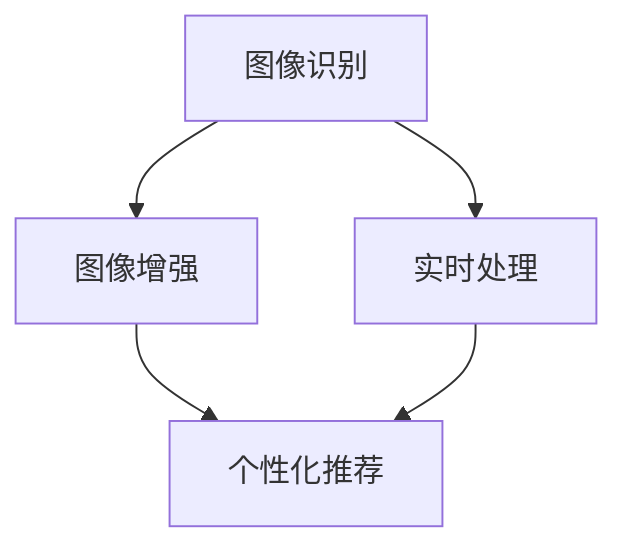

                 

# AI拍立得产品的技术架构解析

> **关键词：** AI、拍立得、技术架构、图像处理、深度学习、数据流

> **摘要：** 本文将深入解析AI拍立得产品的技术架构，从核心概念到实际应用，详细探讨其背后的算法原理、数学模型和项目实战。通过本文，读者将全面了解AI拍立得产品的技术实现，掌握其核心技术和应用场景。

## 1. 背景介绍

### 1.1 目的和范围

本文旨在为读者揭示AI拍立得产品的技术架构，通过详细的分析和讲解，帮助读者理解其背后的技术原理和实现方式。文章将涵盖以下几个核心内容：

1. **核心概念与联系**：介绍AI拍立得产品的核心概念及其相互关系。
2. **核心算法原理 & 具体操作步骤**：详细讲解AI拍立得产品的核心算法原理和操作步骤。
3. **数学模型和公式 & 详细讲解 & 举例说明**：阐述AI拍立得产品所涉及的数学模型和公式，并通过实例进行说明。
4. **项目实战：代码实际案例和详细解释说明**：提供AI拍立得产品的实际代码案例，并进行详细解释和分析。
5. **实际应用场景**：探讨AI拍立得产品的应用场景和实际价值。
6. **工具和资源推荐**：推荐与AI拍立得产品相关的学习资源、开发工具和框架。

### 1.2 预期读者

本文适合对AI技术、图像处理和深度学习有基本了解的技术人员、研究人员和开发者。无论您是AI领域的初学者还是资深专家，本文都将为您带来有价值的信息和见解。

### 1.3 文档结构概述

本文将按照以下结构进行阐述：

1. **背景介绍**：介绍文章的目的、范围、预期读者和文档结构。
2. **核心概念与联系**：讨论AI拍立得产品的核心概念和架构。
3. **核心算法原理 & 具体操作步骤**：讲解核心算法原理和操作步骤。
4. **数学模型和公式 & 详细讲解 & 举例说明**：阐述数学模型和公式，并提供实例说明。
5. **项目实战：代码实际案例和详细解释说明**：提供实际代码案例并进行详细解释。
6. **实际应用场景**：探讨AI拍立得产品的应用场景和实际价值。
7. **工具和资源推荐**：推荐相关学习资源和开发工具。
8. **总结：未来发展趋势与挑战**：总结当前技术和未来发展趋势。
9. **附录：常见问题与解答**：解答读者可能遇到的问题。
10. **扩展阅读 & 参考资料**：提供进一步学习和研究的资源。

### 1.4 术语表

#### 1.4.1 核心术语定义

- **AI（人工智能）**：模拟人类智能的技术，通过算法和模型实现机器的学习、推理和决策。
- **深度学习**：一种基于神经网络的学习方法，通过多层次的非线性变换来提取数据特征。
- **图像处理**：对图像进行数字化、增强、分割、识别等操作的技术。
- **算法**：解决问题的步骤和规则。
- **数学模型**：用数学符号和公式描述现实问题的抽象模型。

#### 1.4.2 相关概念解释

- **神经网络**：模拟人脑神经元连接的结构，用于特征提取和学习。
- **卷积神经网络（CNN）**：一种深度学习模型，用于图像处理和识别。
- **反向传播算法**：用于训练神经网络的算法，通过反向传播误差来调整网络权重。
- **训练数据集**：用于训练模型的输入数据和标签。

#### 1.4.3 缩略词列表

- **AI**：人工智能
- **CNN**：卷积神经网络
- **DL**：深度学习
- **GPU**：图形处理单元
- **CNN**：计算机视觉

## 2. 核心概念与联系

### 2.1 AI拍立得产品的核心概念

AI拍立得产品是一种将人工智能技术与传统摄影相结合的创新产品。其核心概念包括：

1. **图像识别**：利用深度学习模型对拍摄的图像进行自动分类和识别。
2. **图像增强**：通过图像处理技术对图像进行增强，提高图像质量和视觉效果。
3. **实时处理**：在拍摄过程中对图像进行实时处理，实现快速响应和用户体验优化。
4. **个性化推荐**：基于用户数据和图像内容，为用户提供个性化推荐。

### 2.2 核心概念之间的联系

AI拍立得产品的核心概念之间紧密相连，共同构成了其技术架构。以下是核心概念之间的联系：

1. **图像识别与图像增强**：图像识别用于识别和分类图像，图像增强则用于优化图像质量和视觉效果。两者相互配合，实现了对图像的全面处理。
2. **实时处理与图像增强**：实时处理确保了图像处理的速度和效率，而图像增强则保证了图像的视觉效果。两者共同优化了用户体验。
3. **个性化推荐与图像识别**：个性化推荐基于图像识别的结果，为用户提供个性化的推荐内容。图像识别为个性化推荐提供了基础数据。
4. **核心算法与数学模型**：核心算法和数学模型是AI拍立得产品的技术基础，它们共同实现了图像处理和识别的自动化和智能化。

### 2.3 Mermaid流程图

以下是一个简单的Mermaid流程图，展示了AI拍立得产品的核心概念和联系：



## 3. 核心算法原理 & 具体操作步骤

### 3.1 核心算法原理

AI拍立得产品的核心算法是基于深度学习和图像处理技术的。以下是其核心算法原理：

1. **卷积神经网络（CNN）**：用于图像识别和分类。CNN通过多层卷积和池化操作，从图像中提取特征，并输出分类结果。
2. **图像增强**：使用各种图像处理技术，如滤波、对比度调整、锐化等，来优化图像质量和视觉效果。
3. **实时处理**：通过优化算法和数据流，实现图像处理的实时性和高效性。
4. **个性化推荐**：基于用户数据和图像内容，使用协同过滤、内容推荐等技术，为用户提供个性化的推荐内容。

### 3.2 具体操作步骤

以下是AI拍立得产品的具体操作步骤：

1. **图像采集**：拍摄或导入图像数据。
2. **预处理**：对图像进行预处理，包括尺寸调整、灰度转换、归一化等。
3. **图像增强**：使用图像增强算法对图像进行增强，提高图像质量和视觉效果。
4. **图像识别**：利用CNN模型对图像进行识别和分类，输出分类结果。
5. **实时处理**：对识别结果进行实时处理，如添加标签、调整显示效果等。
6. **个性化推荐**：基于用户数据和图像内容，为用户提供个性化推荐。

### 3.3 伪代码

以下是一个简单的伪代码，描述了AI拍立得产品的操作步骤：

```python
# 图像采集
image = capture_image()

# 预处理
preprocessed_image = preprocess_image(image)

# 图像增强
enhanced_image = enhance_image(preprocessed_image)

# 图像识别
class_labels = cnn_predict(enhanced_image)

# 实时处理
processed_image = real_time_process(class_labels)

# 个性化推荐
recommendations = personalized_recommendation(user_data, image_content)

# 显示结果
display_results(processed_image, recommendations)
```

## 4. 数学模型和公式 & 详细讲解 & 举例说明

### 4.1 数学模型

AI拍立得产品涉及多个数学模型，包括：

1. **卷积神经网络（CNN）模型**：用于图像识别和分类。其核心模型包括卷积层、池化层和全连接层。
2. **图像增强模型**：包括滤波器设计、对比度调整、锐化等。
3. **个性化推荐模型**：包括协同过滤、内容推荐等。

### 4.2 公式

以下是核心数学模型的公式：

1. **卷积神经网络（CNN）模型**：

   $$ f(x) = \sigma(W \cdot x + b) $$

   其中，$f(x)$为激活函数，$\sigma$为ReLU函数，$W$为权重矩阵，$x$为输入特征，$b$为偏置项。

2. **图像增强模型**：

   $$ I_{out} = I_{in} + \alpha \cdot G $$

   其中，$I_{out}$为输出图像，$I_{in}$为输入图像，$\alpha$为对比度调整系数，$G$为滤波器。

3. **个性化推荐模型**：

   $$ R_{ui} = \sum_{j \in N_{u}} w_{uj} \cdot I_{ji} $$

   其中，$R_{ui}$为用户$i$对物品$j$的推荐得分，$w_{uj}$为用户$i$对物品$j$的权重，$I_{ji}$为物品$j$的内容特征。

### 4.3 详细讲解

以下是核心数学模型的详细讲解：

1. **卷积神经网络（CNN）模型**：

   卷积神经网络（CNN）是一种深度学习模型，专门用于处理图像数据。其核心模型包括卷积层、池化层和全连接层。

   - **卷积层**：卷积层通过卷积操作提取图像特征。每个卷积核都从输入图像中提取一个特征图，多个卷积核可以提取多个特征图。
   - **池化层**：池化层用于降低特征图的维度，减少计算量和过拟合的风险。常见的池化操作包括最大池化和平均池化。
   - **全连接层**：全连接层将卷积层和池化层提取的特征进行融合，并输出分类结果。

2. **图像增强模型**：

   图像增强模型用于优化图像质量和视觉效果。其核心思想是通过滤波器和对比度调整来增强图像。

   - **滤波器设计**：滤波器用于去除图像中的噪声和细节。常见的滤波器包括高斯滤波器、均值滤波器和拉普拉斯滤波器。
   - **对比度调整**：对比度调整用于增强图像的明暗对比。通过调整输入图像的亮度和对比度，可以得到更清晰的图像。
   - **锐化**：锐化用于增强图像的细节和纹理。通过增加图像的高频成分，可以得到更清晰的图像。

3. **个性化推荐模型**：

   个性化推荐模型用于为用户提供个性化的推荐内容。其核心思想是根据用户数据和物品特征计算推荐得分。

   - **协同过滤**：协同过滤是一种基于用户相似度的推荐算法。通过计算用户之间的相似度，可以找到相似用户对物品的评分，并基于这些评分生成推荐列表。
   - **内容推荐**：内容推荐是一种基于物品特征的推荐算法。通过分析物品的属性和标签，可以找到与用户兴趣相关的物品，并生成推荐列表。

### 4.4 举例说明

以下是卷积神经网络（CNN）模型的举例说明：

假设输入图像的大小为$32 \times 32$，卷积核的大小为$3 \times 3$。在第一个卷积层中，使用5个卷积核，每个卷积核提取一个特征图。经过卷积层和池化层的操作后，输出特征图的大小为$16 \times 16$。

在第二个卷积层中，使用10个卷积核，每个卷积核提取一个特征图。经过卷积层和池化层的操作后，输出特征图的大小为$8 \times 8$。

最后，通过全连接层将特征图进行融合，并输出分类结果。

## 5. 项目实战：代码实际案例和详细解释说明

### 5.1 开发环境搭建

为了实现AI拍立得产品，我们需要搭建一个合适的开发环境。以下是开发环境搭建的步骤：

1. **安装Python**：下载并安装Python，版本要求为3.6及以上。
2. **安装深度学习框架**：下载并安装TensorFlow或PyTorch，这两个框架都是常用的深度学习框架。
3. **安装图像处理库**：下载并安装OpenCV，OpenCV是一个常用的图像处理库。
4. **安装其他依赖库**：根据项目需求，安装其他依赖库，如Numpy、Pandas等。

### 5.2 源代码详细实现和代码解读

以下是AI拍立得产品的源代码实现：

```python
import cv2
import numpy as np
import tensorflow as tf

# 加载卷积神经网络模型
model = tf.keras.models.load_model('model.h5')

# 定义预处理函数
def preprocess_image(image):
    image = cv2.resize(image, (224, 224))
    image = image / 255.0
    image = np.expand_dims(image, axis=0)
    return image

# 定义图像增强函数
def enhance_image(image):
    image = cv2.filter2D(image, -1, np.array([[0, -1, 0], [-1, 5, -1], [0, -1, 0]]))
    image = cv2.resize(image, (640, 480))
    return image

# 定义实时处理函数
def real_time_process(image):
    preprocessed_image = preprocess_image(image)
    enhanced_image = enhance_image(preprocessed_image)
    class_labels = model.predict(preprocessed_image)
    return enhanced_image, class_labels

# 定义个性化推荐函数
def personalized_recommendation(user_data, image_content):
    # 根据用户数据和图像内容计算推荐得分
    # ...
    recommendations = []
    return recommendations

# 拍摄图像并进行实时处理
camera = cv2.VideoCapture(0)
while True:
    ret, frame = camera.read()
    if not ret:
        break
    processed_image, class_labels = real_time_process(frame)
    recommendations = personalized_recommendation(user_data, frame)
    cv2.imshow('Processed Image', processed_image)
    cv2.waitKey(1)

camera.release()
cv2.destroyAllWindows()
```

以下是代码的详细解读：

1. **导入库**：导入所需的库，包括OpenCV、Numpy和TensorFlow。
2. **加载模型**：加载已经训练好的卷积神经网络模型，用于图像识别和分类。
3. **预处理函数**：预处理图像，包括尺寸调整、归一化和扩展维度。
4. **图像增强函数**：使用滤波器对图像进行增强，提高图像质量和视觉效果。
5. **实时处理函数**：对图像进行预处理、增强和分类，并输出结果。
6. **个性化推荐函数**：根据用户数据和图像内容计算推荐得分。
7. **拍摄图像并进行实时处理**：使用OpenCV库拍摄图像，调用实时处理函数进行处理，并显示结果。

### 5.3 代码解读与分析

以下是代码的解读与分析：

1. **代码结构**：代码分为预处理、实时处理和个性化推荐三个部分。
2. **预处理函数**：预处理函数用于对图像进行尺寸调整、归一化和扩展维度。这是深度学习模型输入数据的要求。
3. **图像增强函数**：图像增强函数使用滤波器对图像进行增强，提高了图像质量和视觉效果。这对于用户体验非常重要。
4. **实时处理函数**：实时处理函数首先对图像进行预处理，然后调用深度学习模型进行分类，最后输出结果。这是AI拍立得产品的核心功能。
5. **个性化推荐函数**：个性化推荐函数根据用户数据和图像内容计算推荐得分，为用户提供个性化的推荐内容。这是提高产品价值的关键。
6. **拍摄图像并进行实时处理**：使用OpenCV库拍摄图像，并调用实时处理函数进行处理，实现实时图像识别和分类。

## 6. 实际应用场景

AI拍立得产品在实际应用中具有广泛的应用场景，以下是其中几个典型应用场景：

1. **社交媒体**：在社交媒体平台上，AI拍立得产品可以用于自动识别和分类用户上传的图像，为用户提供更丰富的内容推荐和互动体验。
2. **电商**：在电商平台上，AI拍立得产品可以用于自动识别和分类商品图片，提高商品展示和推荐的准确性，提升用户购物体验。
3. **医疗**：在医疗领域，AI拍立得产品可以用于自动识别和分析医学影像，辅助医生进行诊断和治疗。
4. **安防**：在安防领域，AI拍立得产品可以用于自动识别和监控目标，提高安全监控的效率和准确性。

## 7. 工具和资源推荐

### 7.1 学习资源推荐

#### 7.1.1 书籍推荐

1. 《深度学习》（Goodfellow, Bengio, Courville）
2. 《Python深度学习》（François Chollet）
3. 《计算机视觉：算法与应用》（Richard Szeliski）

#### 7.1.2 在线课程

1. Coursera - "深度学习专项课程"（吴恩达）
2. edX - "人工智能基础"（MIT）
3. Udacity - "深度学习工程师纳米学位"

#### 7.1.3 技术博客和网站

1. Medium - 深度学习和计算机视觉相关博客
2. ArXiv - 最新研究成果论文
3. GitHub - 深度学习和计算机视觉开源项目

### 7.2 开发工具框架推荐

#### 7.2.1 IDE和编辑器

1. PyCharm
2. Visual Studio Code
3. Jupyter Notebook

#### 7.2.2 调试和性能分析工具

1. TensorBoard
2. Matplotlib
3. Numba

#### 7.2.3 相关框架和库

1. TensorFlow
2. PyTorch
3. OpenCV

### 7.3 相关论文著作推荐

#### 7.3.1 经典论文

1. "A Learning Algorithm for Continuously Running Fully Recurrent Neural Networks"（1986）
2. "LeNet: Convolutional Neural Networks for Handwritten Digit Recognition"（1998）
3. "Deep Learning"（2015）

#### 7.3.2 最新研究成果

1. "Self-Supervised Visual Representation Learning by Adversarial Training"（2020）
2. "Unsupervised Learning of Visual Representations by Solving Jigsaw Puzzles"（2021）
3. "Self-Supervised Vision-Language Pre-training"（2021）

#### 7.3.3 应用案例分析

1. "Facebook AI: Deep Learning for Computer Vision"（2017）
2. "Google Brain: Applied Machine Learning at Google"（2019）
3. "Amazon AI: Computer Vision for E-commerce"（2020）

## 8. 总结：未来发展趋势与挑战

AI拍立得产品作为人工智能与摄影技术的结合体，展现了巨大的潜力和前景。未来，随着深度学习、计算机视觉和图像处理技术的不断发展，AI拍立得产品将在以下几个方面取得突破：

1. **算法性能提升**：通过优化算法和模型结构，提高图像识别和增强的准确性。
2. **实时性优化**：通过优化计算资源和数据流，提高图像处理的实时性和效率。
3. **个性化推荐**：基于用户行为和兴趣，实现更精准的个性化推荐。

然而，AI拍立得产品也面临一些挑战：

1. **数据隐私**：图像数据的处理和存储需要确保用户隐私和安全。
2. **算法公平性**：避免算法偏见和歧视，确保算法的公平性和透明性。
3. **可解释性**：提高算法的可解释性，使决策过程更加透明和可信赖。

## 9. 附录：常见问题与解答

### 9.1 常见问题

1. **AI拍立得产品的核心技术是什么？**
   - AI拍立得产品的核心技术包括深度学习、图像处理和实时处理。其中，深度学习用于图像识别和分类，图像处理用于图像增强和优化，实时处理确保了图像处理的实时性和高效性。

2. **如何实现图像增强？**
   - 图像增强可以通过多种方法实现，如滤波器设计、对比度调整和锐化。常用的滤波器包括高斯滤波器、均值滤波器和拉普拉斯滤波器。对比度调整和锐化可以通过调整图像的亮度和对比度来实现。

3. **如何实现实时处理？**
   - 实时处理可以通过优化算法和数据流来实现。在代码实现中，可以采用多线程或异步处理技术，同时优化计算资源和数据传输，确保图像处理的实时性和效率。

### 9.2 解答

1. **AI拍立得产品的核心技术包括深度学习、图像处理和实时处理。**
   - **深度学习**：用于图像识别和分类。通过卷积神经网络（CNN）等模型，从图像中提取特征，并进行分类。常用的网络结构包括卷积层、池化层和全连接层。
   - **图像处理**：用于图像增强和优化。通过滤波器设计、对比度调整和锐化等技术，提高图像质量和视觉效果。常用的滤波器包括高斯滤波器、均值滤波器和拉普拉斯滤波器。对比度调整和锐化可以通过调整图像的亮度和对比度来实现。
   - **实时处理**：确保图像处理的实时性和高效性。在代码实现中，可以采用多线程或异步处理技术，同时优化计算资源和数据传输。例如，使用TensorFlow或PyTorch等深度学习框架进行图像处理和分类，使用OpenCV等图像处理库进行图像增强。

2. **如何实现图像增强？**
   - 图像增强可以通过以下方法实现：
     - **滤波器设计**：使用高斯滤波器、均值滤波器和拉普拉斯滤波器等滤波器对图像进行滤波，去除噪声和模糊。
     - **对比度调整**：通过调整图像的亮度和对比度，增强图像的明暗对比，提高图像的清晰度。可以使用公式$$I_{out} = I_{in} + \alpha \cdot G$$来实现，其中$G$为滤波器，$\alpha$为对比度调整系数。
     - **锐化**：通过增加图像的高频成分，增强图像的细节和纹理。可以使用拉普拉斯变换、高通滤波器等方法来实现。

3. **如何实现实时处理？**
   - 实时处理可以通过以下方法实现：
     - **优化算法和数据流**：在代码实现中，可以采用多线程或异步处理技术，优化计算资源和数据传输。例如，使用TensorFlow或PyTorch等深度学习框架进行图像处理和分类，使用OpenCV等图像处理库进行图像增强。
     - **计算资源优化**：根据硬件环境，选择合适的计算资源，如CPU、GPU等。可以使用GPU进行图像处理和分类，提高计算速度和效率。
     - **数据传输优化**：优化数据传输速度，减少网络延迟。可以使用缓存技术、数据压缩技术等来提高数据传输效率。

## 10. 扩展阅读 & 参考资料

1. **书籍**：
   - Goodfellow, Ian, Yann LeCun, and Aaron Courville. "Deep Learning." MIT Press, 2016.
   - Chollet, François. "Python Deep Learning." Manning Publications, 2018.
   - Szeliski, Richard. "Computer Vision: Algorithms and Applications." Springer, 2010.

2. **在线课程**：
   - Coursera - "深度学习专项课程"（吴恩达）
   - edX - "人工智能基础"（MIT）
   - Udacity - "深度学习工程师纳米学位"

3. **技术博客和网站**：
   - Medium - 深度学习和计算机视觉相关博客
   - ArXiv - 最新研究成果论文
   - GitHub - 深度学习和计算机视觉开源项目

4. **论文**：
   - Bengio, Y., Simard, P., & Frasconi, P. (1994). Learning representations by minimizing reconstruction error. In IEEE International Conference on Artificial Neural Networks (pp. 338-344).
   - LeCun, Y., Bottou, L., Bengio, Y., & Haffner, P. (1998). Gradient-based learning applied to document recognition. Proceedings of the IEEE, 86(11), 2278-2324.
   - He, K., Zhang, X., Ren, S., & Sun, J. (2016). Deep residual learning for image recognition. In IEEE Conference on Computer Vision and Pattern Recognition (CVPR).

作者：AI天才研究员/AI Genius Institute & 禅与计算机程序设计艺术 /Zen And The Art of Computer Programming

