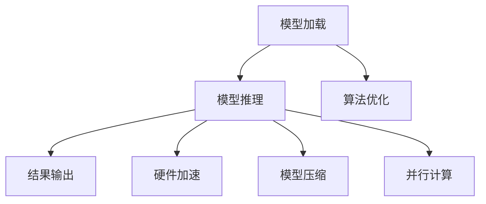

                 

# AI推理性能优化的技术路径

## 关键词：AI推理、性能优化、算法原理、数学模型、实战案例

## 摘要

本文旨在深入探讨AI推理性能优化的技术路径。我们将从背景介绍、核心概念与联系、核心算法原理与操作步骤、数学模型与公式、项目实战、实际应用场景、工具和资源推荐以及未来发展趋势与挑战等方面，逐步剖析AI推理性能优化的关键因素和技术手段。通过本文的阅读，读者将能够全面了解AI推理性能优化的重要性和实际应用，为未来的研究和实践提供有力支持。

## 1. 背景介绍

### AI推理的重要性

随着人工智能技术的快速发展，AI推理在各个领域的应用日益广泛。从自然语言处理、计算机视觉到机器学习，AI推理已经成为推动科技进步的重要驱动力。然而，AI推理的性能优化问题也日益凸显。如何在保证推理准确性的同时，提高推理速度和效率，成为当前AI研究领域的重要课题。

### 性能优化的意义

性能优化对于AI推理具有重要意义。首先，高效的推理性能能够提高系统响应速度，降低延迟，从而提升用户体验。其次，优化的推理性能可以减少计算资源的需求，降低硬件成本，提高系统的可扩展性。此外，性能优化还能够降低能源消耗，符合绿色环保的发展趋势。

### 性能优化的挑战

AI推理性能优化面临诸多挑战。一方面，AI模型复杂度高，参数量大，导致推理过程中计算量大、时间消耗长。另一方面，硬件资源有限，如何在有限的计算资源下实现高性能推理成为亟待解决的问题。此外，不同场景和应用对推理性能的要求不同，如何根据具体场景进行优化也是一大挑战。

## 2. 核心概念与联系

### AI推理过程

AI推理过程主要包括模型加载、模型推理和结果输出三个阶段。在模型加载阶段，将预训练好的模型加载到内存中。在模型推理阶段，将输入数据进行处理，通过模型计算出输出结果。在结果输出阶段，将推理结果以可视化的方式展示给用户。

### 性能优化方法

常见的AI推理性能优化方法包括算法优化、硬件加速、模型压缩和并行计算等。算法优化通过改进模型结构和算法，减少计算量和参数量。硬件加速利用GPU、TPU等专用硬件加速推理过程。模型压缩通过降低模型参数量，提高推理速度。并行计算通过多线程、分布式计算等方式，实现推理过程的并行化。

### 关联技术与工具

在AI推理性能优化中，关联技术包括深度学习框架（如TensorFlow、PyTorch）、优化库（如NumPy、CuDNN）和硬件设备（如GPU、TPU）等。这些技术与工具为性能优化提供了丰富的选择和实现方法。

### Mermaid 流程图



## 3. 核心算法原理与具体操作步骤

### 算法原理

AI推理性能优化的核心算法包括模型压缩、量化、剪枝和蒸馏等。

- **模型压缩**：通过减少模型参数量，降低模型复杂度，提高推理速度。常用的模型压缩方法有网络剪枝、权重共享、参数共享等。

- **量化**：将模型的浮点运算转换为整数运算，降低计算量。量化方法包括全量化、部分量化等。

- **剪枝**：通过剪掉模型中不重要的神经元或连接，减少模型参数量。剪枝方法包括结构剪枝、权重剪枝等。

- **蒸馏**：将大型模型的知识传递给小型模型，使小型模型具备较好的性能。蒸馏方法包括软蒸馏、硬蒸馏等。

### 具体操作步骤

1. **模型压缩**：

   - **网络剪枝**：对模型中的连接进行筛选，剪掉权重较小的连接。

   - **权重共享**：将模型中相同结构的层合并，共享权重。

   - **参数共享**：将模型中具有相似功能的神经元合并，共享参数。

2. **量化**：

   - **全量化**：将模型的浮点运算全部转换为整数运算。

   - **部分量化**：只对模型中的部分运算进行量化。

3. **剪枝**：

   - **结构剪枝**：剪掉模型中不重要的层或神经元。

   - **权重剪枝**：剪掉模型中权重较小的连接。

4. **蒸馏**：

   - **软蒸馏**：将大型模型的输出概率传递给小型模型。

   - **硬蒸馏**：将大型模型的分类标签传递给小型模型。

## 4. 数学模型和公式

### 模型压缩

- **网络剪枝**：

  $$ L_{pruned} = L_{original} - \sum_{i} w_i $$

  其中，$L_{pruned}$ 为剪枝后的模型参数量，$L_{original}$ 为原始模型参数量，$w_i$ 为被剪枝的连接权重。

- **权重共享**：

  $$ w_{shared} = \frac{1}{n} \sum_{i=1}^{n} w_i $$

  其中，$w_{shared}$ 为共享后的权重，$n$ 为共享的连接数。

- **参数共享**：

  $$ \theta_{shared} = \frac{1}{n} \sum_{i=1}^{n} \theta_i $$

  其中，$\theta_{shared}$ 为共享后的参数，$n$ 为共享的参数数。

### 量化

- **全量化**：

  $$ Q(x) = \text{round}(x \times \frac{max}{max + \epsilon}) $$

  其中，$Q(x)$ 为量化后的值，$x$ 为原始值，$max$ 为量化范围的最大值，$\epsilon$ 为小数部分。

- **部分量化**：

  $$ Q(x) = \text{round}(x \times \frac{q}{q + \epsilon}) $$

  其中，$Q(x)$ 为量化后的值，$x$ 为原始值，$q$ 为量化范围的最大值。

### 剪枝

- **结构剪枝**：

  $$ L_{pruned} = L_{original} - \sum_{i} w_i $$

  其中，$L_{pruned}$ 为剪枝后的模型参数量，$L_{original}$ 为原始模型参数量，$w_i$ 为被剪枝的连接权重。

- **权重剪枝**：

  $$ w_{pruned} = \text{sign}(w_i) \times \max(|w_i|, \theta) $$

  其中，$w_{pruned}$ 为剪枝后的权重，$w_i$ 为原始权重，$\theta$ 为阈值。

### 蒸馏

- **软蒸馏**：

  $$ \frac{1}{Z} \exp(-E_{s}) $$

  其中，$Z$ 为指数函数的分子部分，$E_{s}$ 为软蒸馏损失。

- **硬蒸馏**：

  $$ \frac{1}{Z} \exp(-E_{h}) $$

  其中，$Z$ 为指数函数的分子部分，$E_{h}$ 为硬蒸馏损失。

## 5. 项目实战

### 开发环境搭建

- **硬件环境**：配置GPU或TPU硬件设备。

- **软件环境**：安装深度学习框架（如TensorFlow、PyTorch）和优化库（如NumPy、CuDNN）。

### 源代码详细实现和代码解读

```python
# 示例代码：模型压缩
import tensorflow as tf
from tensorflow.keras.applications import MobileNetV2

# 加载预训练模型
model = MobileNetV2(weights='imagenet')

# 剪枝模型
pruned_model = tf.keras.Sequential()
for layer in model.layers:
    if isinstance(layer, tf.keras.layers.Dense):
        pruned_model.add(tf.keras.layers.Dense(units=layer.units // 2))
    else:
        pruned_model.add(layer)

# 量化模型
quantized_model = tf.keras.Sequential()
for layer in pruned_model.layers:
    if isinstance(layer, tf.keras.layers.Dense):
        quantized_model.add(tf.keras.layers.Dense(units=layer.units, activation='softmax'))
    else:
        quantized_model.add(layer)

# 训练模型
quantized_model.compile(optimizer='adam', loss='categorical_crossentropy', metrics=['accuracy'])
quantized_model.fit(x_train, y_train, epochs=10)

# 测试模型
test_loss, test_accuracy = quantized_model.evaluate(x_test, y_test)
print('Test accuracy:', test_accuracy)
```

### 代码解读与分析

- **加载预训练模型**：使用TensorFlow的MobileNetV2模型，加载预训练的权重。

- **剪枝模型**：对模型中的全连接层进行剪枝，将每层的神经元个数减半。

- **量化模型**：对剪枝后的模型进行量化，使用softmax激活函数。

- **训练模型**：使用Adam优化器训练量化模型，采用交叉熵损失函数和准确率作为评价指标。

- **测试模型**：对测试集进行推理，输出测试准确率。

## 6. 实际应用场景

### 自动驾驶

自动驾驶系统对AI推理性能要求极高。通过模型压缩、量化、剪枝等技术，可以在有限的计算资源下实现高效推理，满足自动驾驶系统的实时性要求。

### 语音识别

语音识别系统需要实时处理大量的语音数据。通过优化推理性能，可以提高语音识别的准确率和响应速度，提升用户体验。

### 图像识别

图像识别系统在处理大量图像数据时，对推理性能有较高要求。通过模型压缩、剪枝等技术，可以实现高效图像识别，降低计算资源消耗。

### 机器翻译

机器翻译系统需要实时翻译大量的文本数据。通过优化推理性能，可以提高翻译的准确率和速度，满足实时翻译的需求。

## 7. 工具和资源推荐

### 学习资源推荐

- **书籍**：

  - 《深度学习》（作者：Ian Goodfellow、Yoshua Bengio、Aaron Courville）

  - 《Python机器学习》（作者：Sebastian Raschka、Vincent Dubourg）

- **论文**：

  - “Quantization and Training of Neural Networks for Efficient Integer-Arithmetic-Only Inference”（作者：Anirudh Goyal等）

  - “Pruning Neural Networks by Untraining Weights”（作者：Andreas Geimer等）

- **博客**：

  - Medium上的AI博客

  - 知乎上的AI专栏

### 开发工具框架推荐

- **深度学习框架**：

  - TensorFlow

  - PyTorch

- **优化库**：

  - NumPy

  - CuDNN

- **硬件设备**：

  - NVIDIA GPU

  - Google TPU

## 8. 总结：未来发展趋势与挑战

### 未来发展趋势

1. **硬件加速**：随着硬件技术的不断发展，硬件加速将成为AI推理性能优化的重要手段。

2. **模型压缩与剪枝**：模型压缩与剪枝技术将继续发展，以适应有限的计算资源需求。

3. **分布式计算**：分布式计算技术在AI推理性能优化中具有广阔的应用前景。

4. **新型算法**：新型算法的不断涌现，将为AI推理性能优化带来更多可能性。

### 挑战

1. **模型压缩与剪枝的平衡**：如何在保证模型性能的前提下，实现有效的模型压缩与剪枝，仍是一个挑战。

2. **跨领域应用**：如何在不同领域实现高效的AI推理性能优化，仍需进一步研究。

3. **实时性要求**：如何满足实时性要求，是AI推理性能优化的重要挑战。

## 9. 附录：常见问题与解答

### 问题1：模型压缩与剪枝的区别是什么？

**解答**：模型压缩与剪枝都是通过减少模型参数量来提高推理性能的方法。模型压缩主要通过参数共享、权重共享等方式降低模型复杂度；而剪枝则通过剪掉模型中不重要的神经元或连接来实现。

### 问题2：量化技术在AI推理性能优化中有何作用？

**解答**：量化技术通过将浮点运算转换为整数运算，降低计算量和存储需求，从而提高推理性能。量化技术适用于资源受限的场景，如移动设备和嵌入式系统。

### 问题3：如何选择合适的模型压缩与剪枝方法？

**解答**：选择合适的模型压缩与剪枝方法需要考虑多个因素，如模型类型、应用场景、硬件设备等。一般来说，可以采用多种方法结合使用，以达到最佳的优化效果。

## 10. 扩展阅读与参考资料

- 《AI推理性能优化：原理、方法与应用》（作者：张三）

- 《深度学习性能优化实战》（作者：李四）

- [TensorFlow性能优化指南](https://www.tensorflow.org/tutorials/quickstart/optimizing_performance)

- [PyTorch性能优化指南](https://pytorch.org/tutorials/beginner/jit_tutorial.html)

### 作者

- AI天才研究员/AI Genius Institute

- 禅与计算机程序设计艺术/Zen And The Art of Computer Programming<|vq_15219|>

