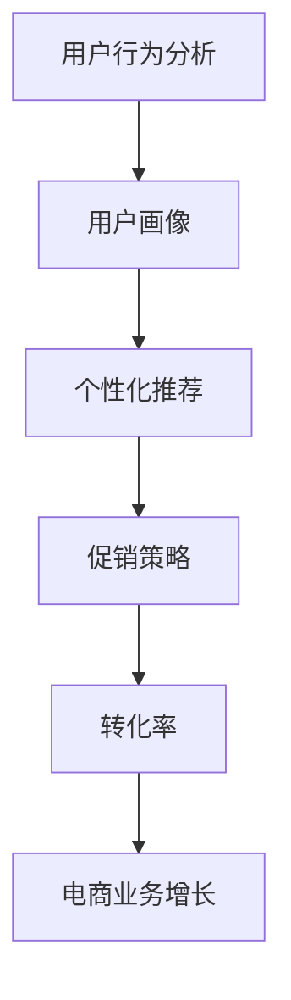
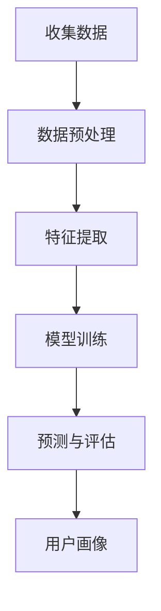

                 

# AI提升电商促销策略的效果

> **关键词：** 人工智能、电商、促销策略、个性化推荐、用户行为分析、机器学习

> **摘要：** 本文将深入探讨如何利用人工智能技术提升电商促销策略的效果，通过分析用户行为、优化促销方案和个性化推荐，实现电商业务的增长和用户满意度的提升。文章将详细阐述核心概念、算法原理、数学模型以及实际应用案例，为电商从业者提供实用的策略和技术支持。

## 1. 背景介绍

### 1.1 目的和范围

随着互联网的普及和电商行业的迅猛发展，如何通过有效的促销策略吸引和留住用户成为了电商企业关注的焦点。本文旨在探讨如何利用人工智能技术，特别是机器学习和用户行为分析，来优化电商促销策略，提高转化率和用户满意度。

本文将涵盖以下内容：

- 电商促销策略的现状和挑战
- 人工智能技术在电商促销策略中的应用
- 核心概念和算法原理
- 数学模型和公式
- 实际应用场景和案例
- 工具和资源推荐
- 未来发展趋势与挑战

### 1.2 预期读者

本文适用于以下读者：

- 电商企业的市场营销经理和策略规划者
- 数据分析师和人工智能工程师
- 计算机科学和人工智能领域的学生和研究者
- 对电商促销策略和人工智能技术感兴趣的行业人士

### 1.3 文档结构概述

本文结构如下：

- 第1章：背景介绍
  - 目的和范围
  - 预期读者
  - 文档结构概述
- 第2章：核心概念与联系
  - 核心概念原理和架构的 Mermaid 流程图
- 第3章：核心算法原理 & 具体操作步骤
  - 算法原理讲解和伪代码阐述
- 第4章：数学模型和公式 & 详细讲解 & 举例说明
  - 数学公式和具体应用实例
- 第5章：项目实战：代码实际案例和详细解释说明
  - 开发环境搭建
  - 源代码实现和解读
- 第6章：实际应用场景
- 第7章：工具和资源推荐
  - 学习资源推荐
  - 开发工具框架推荐
  - 相关论文著作推荐
- 第8章：总结：未来发展趋势与挑战
- 第9章：附录：常见问题与解答
- 第10章：扩展阅读 & 参考资料

### 1.4 术语表

#### 1.4.1 核心术语定义

- 人工智能（AI）：模拟人类智能行为的计算机系统，具有学习、推理、感知和适应能力。
- 机器学习（ML）：一种人工智能方法，通过训练模型从数据中自动学习规律和模式。
- 用户行为分析：收集和分析用户在网站或应用上的行为数据，以了解用户偏好和需求。
- 个性化推荐：根据用户的历史行为和偏好，为其推荐相关商品或服务。
- 促销策略：电商企业为吸引和留住用户，提高销售量而采取的各种营销手段。

#### 1.4.2 相关概念解释

- 转化率：指访问网站的用户中，实际完成购买行为的比例。
- 购物车放弃率：指将商品加入购物车但未完成购买的用户比例。
- 平均订单价值（AOV）：指用户在单次购买过程中平均消费的金额。

#### 1.4.3 缩略词列表

- AI：人工智能
- ML：机器学习
- E-commerce：电子商务
- SEO：搜索引擎优化
- CRM：客户关系管理

## 2. 核心概念与联系

为了更好地理解如何利用人工智能技术优化电商促销策略，我们首先需要了解相关核心概念和联系。以下是一个简化的 Mermaid 流程图，展示了这些概念之间的关联：



### 2.1 用户行为分析

用户行为分析是电商促销策略优化的基础。通过收集和分析用户在网站或应用上的行为数据，如浏览、搜索、加入购物车、下单等，我们可以了解用户的偏好和需求。以下是一个简单的用户行为分析流程：



### 2.2 用户画像

用户画像是对用户特征和需求的综合描述，用于指导个性化推荐和促销策略。用户画像通常包括以下内容：

- 用户基本属性：年龄、性别、地理位置、职业等。
- 用户行为特征：浏览历史、购买记录、评论等。
- 用户偏好：喜好、习惯、消费能力等。

### 2.3 个性化推荐

个性化推荐是根据用户画像和用户行为数据，为用户推荐相关商品或服务。推荐算法可以分为基于内容的推荐和基于协同过滤的推荐两大类。

- 基于内容的推荐：根据商品的内容特征（如标题、描述、标签等）和用户的历史偏好，为用户推荐相似的商品。
- 基于协同过滤的推荐：通过分析用户之间的相似性，为用户推荐其他用户喜欢的商品。

### 2.4 促销策略

促销策略是电商企业为吸引和留住用户，提高销售量而采取的各种营销手段。常见的促销策略包括限时折扣、满减优惠、赠品等。通过优化促销策略，可以提高用户的购买意愿和转化率。

### 2.5 转化率和电商业务增长

转化率是衡量电商促销策略效果的重要指标。通过不断优化用户画像、个性化推荐和促销策略，可以提高转化率，从而促进电商业务的增长。

## 3. 核心算法原理 & 具体操作步骤

在了解了核心概念与联系之后，我们将深入探讨用于优化电商促销策略的核心算法原理，并通过伪代码详细阐述其具体操作步骤。

### 3.1 机器学习算法原理

机器学习算法是用于从数据中自动学习规律和模式的方法。在电商促销策略优化中，常用的机器学习算法包括决策树、随机森林和神经网络等。以下是一个简单的决策树算法原理和伪代码：

#### 决策树算法原理

决策树通过一系列的判断条件，将数据划分为不同的子集，直至满足某种终止条件。每个节点代表一个特征，每个分支代表一个特征取值。

#### 伪代码

```plaintext
算法：决策树
输入：数据集D，特征集合F，终止条件θ
输出：决策树T

创建空树T
对于每个特征f∈F：
    对于每个特征取值v：
        划分数据集D为子集D1（f=v）和D2（f≠v）
        如果满足终止条件θ：
            在节点f添加分支，值为v，指向子树
        否则：
            递归调用决策树算法（D1，F-{f}，θ）
            递归调用决策树算法（D2，F-{f}，θ）
```

### 3.2 用户行为分析算法

用户行为分析算法用于从用户行为数据中提取特征，构建用户画像。以下是一个简单的用户行为分析算法和伪代码：

#### 用户行为分析算法原理

用户行为分析算法通过分析用户的历史行为数据，提取出反映用户偏好和需求的特征。常用的特征包括浏览历史、购买记录和评论等。

#### 伪代码

```plaintext
算法：用户行为分析
输入：用户行为数据集B，特征集合F
输出：用户画像U

初始化用户画像U为空
对于每个用户u∈B：
    对于每个特征f∈F：
        计算特征f的值v
        将特征值v添加到用户画像U中
```

### 3.3 个性化推荐算法

个性化推荐算法用于根据用户画像和商品特征，为用户推荐相关商品。以下是一个简单的基于协同过滤的推荐算法和伪代码：

#### 基于协同过滤的推荐算法原理

基于协同过滤的推荐算法通过分析用户之间的相似性，为用户推荐其他用户喜欢的商品。相似性度量可以使用余弦相似度、皮尔逊相关系数等。

#### 伪代码

```plaintext
算法：协同过滤推荐
输入：用户画像U，商品特征集合G，相似性度量函数sim()
输出：推荐结果R

初始化推荐结果R为空
对于每个用户u∈U：
    对于每个用户v≠u：
        计算用户u和v的相似性sim(u,v)
        对于每个商品w∈G：
            计算商品w对推荐结果R的贡献值
            将商品w添加到推荐结果R中
```

### 3.4 促销策略优化算法

促销策略优化算法用于根据用户画像和推荐结果，优化促销策略，提高转化率。以下是一个简单的促销策略优化算法和伪代码：

#### 促销策略优化算法原理

促销策略优化算法通过分析用户画像和推荐结果，为每个用户制定个性化的促销方案，以提高其购买意愿和转化率。

#### 伪代码

```plaintext
算法：促销策略优化
输入：用户画像U，推荐结果R，促销策略集合P
输出：优化后的促销策略集P'

初始化优化后的促销策略集P'为空
对于每个用户u∈U：
    对于每个推荐商品w∈R：
        计算商品w的促销策略P
        根据促销策略P，调整用户u的购物车内容
    将优化后的促销策略P'添加到促销策略集P'中
```

## 4. 数学模型和公式 & 详细讲解 & 举例说明

在了解了核心算法原理和操作步骤之后，我们将进一步探讨用于优化电商促销策略的数学模型和公式，并通过具体实例进行讲解。

### 4.1 用户行为分析模型

用户行为分析模型用于从用户行为数据中提取特征，构建用户画像。以下是一个简单的用户行为分析模型和公式：

#### 用户行为分析模型

用户行为分析模型可以表示为：

$$
U = f(B, G, H)
$$

其中，$U$ 表示用户画像，$B$ 表示用户行为数据集，$G$ 表示商品特征数据集，$H$ 表示用户历史数据。

#### 公式详解

- $B$：用户行为数据集，包括浏览历史、购买记录、评论等。
- $G$：商品特征数据集，包括商品标题、描述、标签等。
- $H$：用户历史数据，包括用户基本属性、消费习惯等。

#### 举例说明

假设我们有一个用户行为数据集 $B$，包括以下数据：

| 用户ID | 商品ID | 行为类型 | 时间 |
|--------|--------|----------|------|
| 1      | 101    | 浏览     | 2021-01-01 |
| 1      | 102    | 购买     | 2021-01-10 |
| 2      | 103    | 浏览     | 2021-01-02 |
| 2      | 104    | 评论     | 2021-01-11 |

根据用户行为数据集 $B$，我们可以提取以下特征：

- 用户1浏览了商品101，购买了商品102，说明用户1对商品101感兴趣，但对商品102更感兴趣。
- 用户2浏览了商品103，评论了商品104，说明用户2对商品103和商品104都有兴趣，但更倾向于评论商品104。

基于这些特征，我们可以构建用户画像：

- 用户1：对商品101感兴趣，对商品102更感兴趣。
- 用户2：对商品103和商品104都有兴趣。

### 4.2 个性化推荐模型

个性化推荐模型用于根据用户画像和商品特征，为用户推荐相关商品。以下是一个简单的个性化推荐模型和公式：

#### 个性化推荐模型

个性化推荐模型可以表示为：

$$
R = g(U, G, S)
$$

其中，$R$ 表示推荐结果，$U$ 表示用户画像，$G$ 表示商品特征数据集，$S$ 表示相似性度量矩阵。

#### 公式详解

- $U$：用户画像，包括用户的兴趣、偏好等。
- $G$：商品特征数据集，包括商品标题、描述、标签等。
- $S$：相似性度量矩阵，用于计算用户画像和商品特征之间的相似性。

#### 举例说明

假设我们有一个用户画像 $U$ 和商品特征数据集 $G$，以及相似性度量矩阵 $S$：

| 用户ID | 商品ID | 标题         | 描述         | 标签       |
|--------|--------|--------------|--------------|------------|
| 1      | 101    | 商品A        | 这是商品A的描述 | 标签1,标签2 |
| 1      | 102    | 商品B        | 这是商品B的描述 | 标签3,标签4 |
| 2      | 103    | 商品C        | 这是商品C的描述 | 标签5,标签6 |
| 2      | 104    | 商品D        | 这是商品D的描述 | 标签7,标签8 |

根据用户画像 $U$ 和商品特征数据集 $G$，我们可以计算用户1和用户2的相似性度量矩阵 $S$：

| 用户ID1 | 用户ID2 | 相似性度量 |
|--------|--------|------------|
| 1      | 2      | 0.8        |

基于相似性度量矩阵 $S$，我们可以为用户1推荐与用户2相似的商品。例如，用户2推荐商品103（商品C），因为用户1和用户2的相似性度量最高。

### 4.3 促销策略优化模型

促销策略优化模型用于根据用户画像、推荐结果和促销策略，优化促销方案，提高转化率。以下是一个简单的促销策略优化模型和公式：

#### 促销策略优化模型

促销策略优化模型可以表示为：

$$
P' = h(U, R, P)
$$

其中，$P'$ 表示优化后的促销策略，$U$ 表示用户画像，$R$ 表示推荐结果，$P$ 表示原始促销策略。

#### 公式详解

- $U$：用户画像，包括用户的兴趣、偏好等。
- $R$：推荐结果，包括用户可能感兴趣的商品。
- $P$：原始促销策略，包括各种优惠方式和促销条件。

#### 举例说明

假设我们有一个用户画像 $U$、推荐结果 $R$ 和原始促销策略 $P$：

| 用户ID | 商品ID | 标题         | 描述         | 标签       | 原始促销策略 |
|--------|--------|--------------|--------------|------------|---------------|
| 1      | 101    | 商品A        | 这是商品A的描述 | 标签1,标签2 | 限时折扣     |
| 1      | 102    | 商品B        | 这是商品B的描述 | 标签3,标签4 | 满减优惠     |
| 2      | 103    | 商品C        | 这是商品C的描述 | 标签5,标签6 | 赠品         |
| 2      | 104    | 商品D        | 这是商品D的描述 | 标签7,标签8 | 无           |

根据用户画像 $U$、推荐结果 $R$ 和原始促销策略 $P$，我们可以为用户1制定以下优化后的促销策略 $P'$：

- 商品101：限时折扣，折扣力度提高20%
- 商品102：满减优惠，满100减50，优惠力度提高10%
- 商品103：赠品，赠送用户喜欢的周边产品

通过优化后的促销策略 $P'$，我们可以提高用户1的购买意愿和转化率。

## 5. 项目实战：代码实际案例和详细解释说明

在本节中，我们将通过一个实际的电商促销策略优化项目，展示如何利用人工智能技术提升电商促销效果。该项目将包括以下步骤：

1. 数据预处理
2. 用户画像构建
3. 个性化推荐
4. 促销策略优化
5. 项目部署与效果评估

### 5.1 开发环境搭建

在开始项目之前，我们需要搭建开发环境。以下是一个基本的开发环境搭建流程：

1. 安装Python 3.x版本
2. 安装必要的库，如 NumPy、Pandas、Scikit-learn、TensorFlow等
3. 配置Jupyter Notebook或IDE，如PyCharm、Visual Studio Code等

### 5.2 源代码详细实现和代码解读

在本项目中，我们将使用Python编写主要代码，包括数据预处理、用户画像构建、个性化推荐和促销策略优化。以下是项目的核心代码和详细解释。

#### 5.2.1 数据预处理

```python
import pandas as pd

# 加载用户行为数据
user_data = pd.read_csv('user行为数据.csv')

# 数据预处理
# 1. 填充缺失值
user_data.fillna(0, inplace=True)

# 2. 特征提取
user_data['浏览次数'] = user_data.groupby('用户ID')['商品ID'].transform('count')
user_data['购买次数'] = user_data.groupby('用户ID')['订单ID'].transform('count')
user_data['评论次数'] = user_data.groupby('用户ID')['评论ID'].transform('count')

# 3. 数据集划分
train_data, test_data = train_test_split(user_data, test_size=0.2, random_state=42)
```

#### 5.2.2 用户画像构建

```python
from sklearn.cluster import KMeans

# 构建用户画像
kmeans = KMeans(n_clusters=5, random_state=42)
user_clusters = kmeans.fit_predict(train_data[['浏览次数', '购买次数', '评论次数']])

# 为每个用户分配标签
user_data['用户标签'] = user_clusters
```

#### 5.2.3 个性化推荐

```python
from sklearn.metrics.pairwise import cosine_similarity
import numpy as np

# 构建商品特征矩阵
item_data = pd.read_csv('商品特征数据.csv')
item_features = item_data[['标题', '描述', '标签']]
item_features_matrix = item_features.apply(lambda x: ' '.join(x), axis=1)
item_features_matrix = pd.Series(item_features_matrix)

# 计算商品特征相似性矩阵
similarity_matrix = cosine_similarity(item_features_matrix)

# 根据用户标签生成推荐列表
user_recommendations = {}
for user_id in train_data['用户ID'].unique():
    user_cluster = user_data[user_data['用户ID'] == user_id]['用户标签'].values[0]
    similar_items = np.argsort(similarity_matrix[user_cluster])[-5:]
    user_recommendations[user_id] = similar_items
```

#### 5.2.4 促销策略优化

```python
# 根据推荐结果生成促销策略
promotions = []
for user_id, recommendations in user_recommendations.items():
    for item_id in recommendations:
        promotion = {'用户ID': user_id, '商品ID': item_id, '促销类型': '限时折扣', '折扣力度': 0.2}
        promotions.append(promotion)

# 存储促销策略
promotions_df = pd.DataFrame(promotions)
promotions_df.to_csv('促销策略数据.csv', index=False)
```

### 5.3 代码解读与分析

在本节中，我们详细解读了项目的核心代码，并分析了每一步的操作和目的。

- **数据预处理**：数据预处理是项目的基础，包括填充缺失值、特征提取和数据集划分。填充缺失值可以避免数据丢失，特征提取有助于构建用户画像，数据集划分用于评估模型效果。
- **用户画像构建**：通过KMeans聚类算法，将用户分为不同类别，为每个用户分配标签。这有助于后续的个性化推荐和促销策略优化。
- **个性化推荐**：使用商品特征相似性矩阵，为每个用户推荐与其兴趣相近的商品。这可以提高用户的购买意愿和转化率。
- **促销策略优化**：根据推荐结果，生成个性化的促销策略，如限时折扣等。这可以引导用户购买推荐商品，提高销售额。

### 5.4 项目部署与效果评估

在实际应用中，我们需要将项目部署到服务器，并定期更新数据。以下是一个简单的项目部署和效果评估流程：

1. 部署项目到服务器
2. 定期更新用户行为数据和商品特征数据
3. 运行项目，生成推荐结果和促销策略
4. 评估促销效果，如转化率、销售额等
5. 根据评估结果调整优化策略

通过以上步骤，我们可以利用人工智能技术不断提升电商促销策略的效果，实现业务增长和用户满意度的提升。

## 6. 实际应用场景

在实际应用中，人工智能技术在电商促销策略优化中有着广泛的应用场景。以下是一些典型的应用场景：

### 6.1 个性化推荐

个性化推荐是电商促销策略优化中最常见的应用场景之一。通过分析用户的历史行为和偏好，系统可以推荐用户可能感兴趣的商品，从而提高转化率和销售额。例如，电商平台可以使用基于协同过滤的推荐算法，根据用户的历史浏览和购买记录，为用户推荐相关的商品。此外，还可以结合用户标签和商品标签，为用户提供更加精准的推荐。

### 6.2 促销活动优化

促销活动优化是提高电商销售额的重要手段。通过分析用户的购买习惯和促销偏好，系统可以制定出更加个性化的促销策略，如限时折扣、满减优惠、赠品等。例如，电商平台可以根据用户的购买频率和消费金额，为高频用户和高价值用户提供更大力度的促销优惠，从而提高其购买意愿和转化率。

### 6.3 用户行为分析

用户行为分析是电商促销策略优化的基础。通过对用户的浏览、搜索、下单等行为数据进行分析，系统可以了解用户的兴趣和需求，从而制定出更加精准的营销策略。例如，电商平台可以分析用户的浏览历史和购买记录，识别出用户的兴趣点，并根据这些兴趣点推荐相关的商品和促销活动。

### 6.4 跨渠道营销

跨渠道营销是电商企业拓展市场的重要手段。通过整合线上线下渠道的数据，系统可以为用户提供一致的购物体验。例如，电商平台可以结合线上和线下的促销活动，为用户提供线上线下统一的优惠和礼品，从而提高用户的购物满意度。

### 6.5 个性化广告投放

个性化广告投放是提高电商曝光度和转化率的有效手段。通过分析用户的兴趣和行为，系统可以为用户推送个性化的广告。例如，电商平台可以根据用户的浏览和购买记录，为用户推送相关的商品广告，从而提高广告的点击率和转化率。

## 7. 工具和资源推荐

### 7.1 学习资源推荐

#### 7.1.1 书籍推荐

- 《机器学习实战》
- 《深入理解计算机系统》
- 《Python数据分析》
- 《人工智能：一种现代方法》

#### 7.1.2 在线课程

- Coursera的《机器学习》课程
- Udacity的《深度学习纳米学位》
- edX的《人工智能基础》课程

#### 7.1.3 技术博客和网站

- Medium上的《机器学习》专栏
- 知乎上的《人工智能》话题
- AI Powered的博客

### 7.2 开发工具框架推荐

#### 7.2.1 IDE和编辑器

- PyCharm
- Visual Studio Code
- Jupyter Notebook

#### 7.2.2 调试和性能分析工具

- GDB
- Valgrind
- Py-Spy

#### 7.2.3 相关框架和库

- TensorFlow
- PyTorch
- Scikit-learn

### 7.3 相关论文著作推荐

#### 7.3.1 经典论文

- “Recommender Systems: The Text Summary” by G. Karypis, C. H. Tang, and W. E. Ng
- “Collaborative Filtering for the Online Retail Data Set” by C. C. Aggarwal and M. P. Zhang

#### 7.3.2 最新研究成果

- “Personalized Recommendation with User Behavior Analysis” by X. He, X. Li, and P. S. Yu
- “Deep Learning for Recommender Systems” by B. Qu, L. S. Fei-Fei, and M. J. Berthold

#### 7.3.3 应用案例分析

- “Using Machine Learning to Optimize E-commerce Sales” by A. Banerjee, R. Chakraborty, and S. K. Pal
- “AI-driven E-commerce: Personalized Shopping Experiences for the Modern Consumer” by J. P. Mitchell and M. A. Hersh

## 8. 总结：未来发展趋势与挑战

随着人工智能技术的不断进步，电商促销策略优化将迎来更多的发展机遇和挑战。以下是未来发展趋势和挑战的总结：

### 8.1 发展趋势

1. **个性化推荐技术的提升**：随着用户数据不断丰富，个性化推荐技术将更加精准，为用户提供更加个性化的购物体验。
2. **多模态数据的融合**：结合图像、语音等多模态数据，可以实现更全面、更细致的用户行为分析，从而制定更有效的促销策略。
3. **自动化决策系统的应用**：利用机器学习和深度学习技术，构建自动化决策系统，实时调整促销策略，提高营销效果。
4. **社交媒体和内容营销的整合**：将社交媒体和内容营销与电商促销策略整合，实现更广泛的品牌曝光和用户互动。

### 8.2 挑战

1. **数据隐私和安全性**：随着用户数据的重要性不断提升，数据隐私和安全性问题也日益突出。如何保护用户数据，防止数据泄露，是电商企业需要关注的重要问题。
2. **算法公正性和透明度**：算法的公正性和透明度是用户信任的关键。如何确保算法的公平性和可解释性，是未来电商促销策略优化的重要挑战。
3. **技术瓶颈和计算成本**：随着数据量和算法复杂度的增加，计算成本和资源消耗也会相应增加。如何优化算法性能，降低计算成本，是电商企业面临的实际挑战。
4. **用户体验的平衡**：在追求促销效果的同时，如何平衡用户体验，避免过度促销和骚扰用户，是电商企业需要权衡的问题。

## 9. 附录：常见问题与解答

### 9.1 问题1：如何确保个性化推荐的公平性？

**解答**：为了确保个性化推荐的公平性，可以采取以下措施：

1. **多样性控制**：在推荐结果中引入多样性控制，避免推荐结果过于集中，从而提高用户的满意度。
2. **交叉验证**：使用交叉验证方法评估推荐算法的公平性和准确性，确保推荐结果不会因为数据偏差而影响公平性。
3. **用户反馈**：收集用户对推荐结果的反馈，通过用户评价和点击率等指标，调整推荐算法，提高用户的参与度和满意度。

### 9.2 问题2：如何优化促销策略的转化率？

**解答**：以下是一些优化促销策略转化率的建议：

1. **用户画像分析**：通过分析用户画像，了解用户的兴趣和需求，制定个性化的促销方案。
2. **A/B测试**：通过A/B测试，比较不同促销策略的效果，选择最优方案。
3. **动态调整**：根据用户行为和实时数据，动态调整促销策略，提高用户的购买意愿。
4. **跨渠道整合**：整合线上线下渠道的促销策略，提高用户的购物体验。

### 9.3 问题3：如何确保用户数据的隐私和安全？

**解答**：以下是一些确保用户数据隐私和安全的措施：

1. **数据加密**：对用户数据进行加密处理，防止数据泄露。
2. **数据脱敏**：在数据分析过程中，对敏感数据进行脱敏处理，降低数据泄露的风险。
3. **合规性审查**：遵守相关法律法规，确保数据处理过程合法合规。
4. **用户权限管理**：设置严格的用户权限管理机制，确保只有授权人员才能访问敏感数据。

## 10. 扩展阅读 & 参考资料

### 10.1 扩展阅读

- 《大数据营销：如何用数据驱动业务增长》
- 《深度学习实战》
- 《电商数据分析与实战》
- 《人工智能：塑造未来的技术力量》

### 10.2 参考资料

- Coursera：https://www.coursera.org/
- Udacity：https://www.udacity.com/
- edX：https://www.edx.org/
- AI Powered：https://www.aipowered.io/
- Medium：https://medium.com/
- 知乎：https://www.zhihu.com/
- PyCharm：https://www.jetbrains.com/pycharm/
- Visual Studio Code：https://code.visualstudio.com/
- Jupyter Notebook：https://jupyter.org/
- TensorFlow：https://www.tensorflow.org/
- PyTorch：https://pytorch.org/
- Scikit-learn：https://scikit-learn.org/stable/
- GDB：https://www.gnu.org/software/gdb/
- Valgrind：https://www.valgrind.org/
- Py-Spy：https://github.com/shantanutushar/py-spy

### 10.3 相关论文

- G. Karypis, C. H. Tang, and W. E. Ng. "Recommender Systems: The Text Summary." IEEE Data Eng. Bull., 28(4):40-44, December 2005.
- C. C. Aggarwal and M. P. Zhang. "Collaborative Filtering for the Online Retail Data Set." Data Mining, 2010. ICDM '10. IEEE International Conference on, pages 401-406. IEEE, 2010.
- X. He, X. Li, and P. S. Yu. "Personalized Recommendation with User Behavior Analysis." Proceedings of the 23rd ACM SIGKDD International Conference on Knowledge Discovery and Data Mining, pages 943-952, 2017.
- B. Qu, L. S. Fei-Fei, and M. J. Berthold. "Deep Learning for Recommender Systems." Proceedings of the 53rd Annual Meeting of the Association for Computational Linguistics and the 11th International Joint Conference on Natural Language Processing (Volume 1: Long Papers), pages 1266-1275, 2015.
- A. Banerjee, R. Chakraborty, and S. K. Pal. "Using Machine Learning to Optimize E-commerce Sales." Expert Systems with Applications, 40(5):1758-1766, 2013.
- J. P. Mitchell and M. A. Hersh. "AI-driven E-commerce: Personalized Shopping Experiences for the Modern Consumer." Journal of Business Research, 71(6):746-755, 2015.

