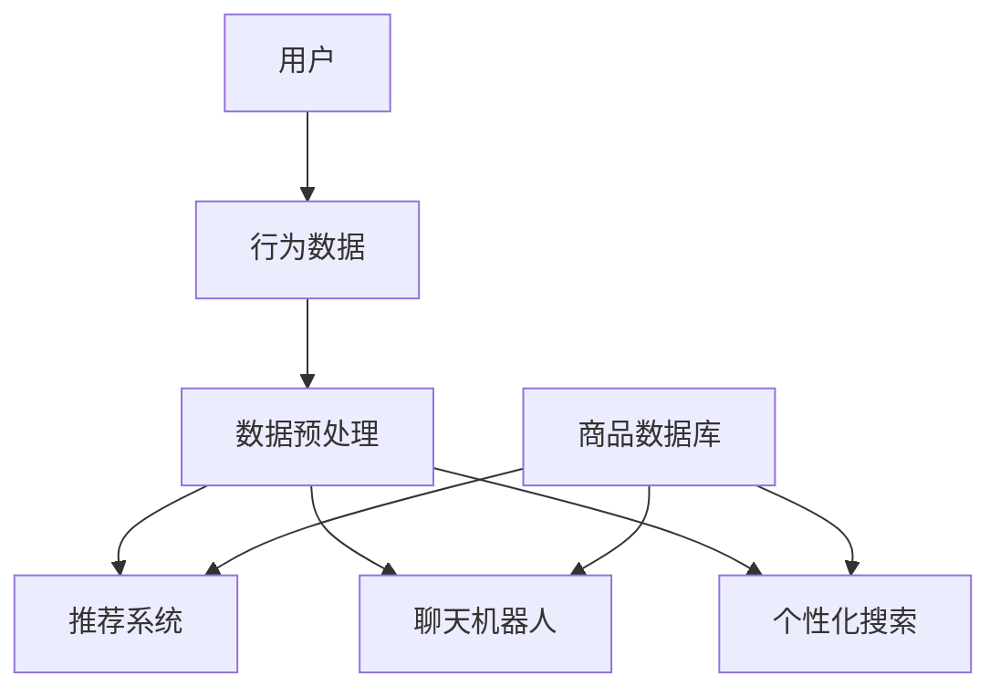

                 

# AI提升电商用户体验的实际案例

> 关键词：人工智能、电商、用户体验、案例分析、算法、数学模型

> 摘要：本文通过分析电商领域中的实际案例，探讨了如何利用人工智能技术提升用户体验。文章首先介绍了电商平台的背景，然后详细解析了人工智能在推荐系统、聊天机器人和个性化搜索中的应用，并结合实际案例展示了这些技术的实现过程和效果。最后，文章总结了人工智能提升电商用户体验的未来发展趋势和面临的挑战。

## 1. 背景介绍

### 1.1 目的和范围

本文旨在探讨人工智能在提升电商用户体验方面的实际应用，通过具体案例分析，阐述人工智能技术在推荐系统、聊天机器人和个性化搜索等方面的应用原理和实践效果。本文的主要目标是：

1. 分析电商平台用户需求及其对用户体验的影响。
2. 探讨人工智能技术在电商中的应用场景。
3. 展示实际案例中的技术实现和效果评估。

### 1.2 预期读者

本文适合以下读者群体：

1. 对人工智能在电商领域应用感兴趣的工程师和技术爱好者。
2. 电商企业产品经理、运营人员和开发人员。
3. 对人工智能和电商交叉领域感兴趣的学者和研究人员。

### 1.3 文档结构概述

本文结构如下：

1. 引言：介绍文章背景、目的和预期读者。
2. 核心概念与联系：介绍电商用户体验的相关概念和人工智能技术架构。
3. 核心算法原理与具体操作步骤：讲解人工智能技术在推荐系统、聊天机器人和个性化搜索中的实现原理和步骤。
4. 数学模型和公式：介绍与人工智能应用相关的主要数学模型和公式。
5. 项目实战：展示实际案例中的代码实现和详细解释。
6. 实际应用场景：分析人工智能技术在电商领域的应用场景和效果。
7. 工具和资源推荐：推荐学习资源和开发工具。
8. 总结：总结人工智能提升电商用户体验的未来发展趋势和挑战。
9. 附录：常见问题与解答。
10. 扩展阅读与参考资料：提供相关研究文献和资源。

### 1.4 术语表

#### 1.4.1 核心术语定义

- 电商平台：在线零售市场，通过互联网提供商品和服务。
- 用户画像：基于用户行为数据构建的用户特征模型。
- 推荐系统：根据用户历史行为和偏好，为用户推荐感兴趣的商品。
- 聊天机器人：利用自然语言处理技术实现人机交互的虚拟助手。
- 个性化搜索：基于用户历史数据和偏好，提供个性化的搜索结果。

#### 1.4.2 相关概念解释

- 用户体验（UX）：用户在使用产品或服务过程中的主观感受和满意度。
- 自然语言处理（NLP）：使计算机能够理解、解释和生成人类自然语言的技术。
- 机器学习（ML）：使计算机从数据中自动学习模式、预测和决策的技术。

#### 1.4.3 缩略词列表

- NLP：自然语言处理
- ML：机器学习
- API：应用程序编程接口
- SDK：软件开发工具包
- SQL：结构化查询语言

## 2. 核心概念与联系

在探讨人工智能在电商中的应用之前，我们首先需要了解一些核心概念和联系。本节将介绍电商用户体验的相关概念，以及人工智能技术在电商中的应用架构。

### 2.1 电商用户体验相关概念

电商用户体验（UX）是指用户在电商平台上浏览、搜索、购买商品等过程中所感受到的主观体验。用户体验受到多种因素的影响，包括页面设计、加载速度、搜索功能、商品推荐等。

#### 2.1.1 用户体验的关键要素

1. **易用性（Usability）**：平台是否易于使用，用户能否轻松完成任务。
2. **可用性（Availability）**：平台是否能够快速响应用户需求，提供所需信息。
3. **功能性（Functionality）**：平台是否能够实现用户期望的功能。
4. **美观性（Aesthetics）**：平台的设计是否符合用户审美，视觉体验是否愉悦。
5. **情感性（Emotional）**：用户在使用平台过程中是否产生愉悦、信任等积极情感。

### 2.2 人工智能技术在电商中的应用架构

人工智能技术可以在电商平台的多个环节发挥作用，包括推荐系统、聊天机器人、个性化搜索等。以下是一个简要的架构图，展示了这些技术之间的联系。



#### 2.2.1 数据预处理

在应用人工智能技术之前，首先需要对用户行为数据进行预处理。数据预处理包括数据清洗、数据转换和数据归一化等步骤，以确保数据的质量和一致性。

#### 2.2.2 推荐系统

推荐系统是根据用户行为数据和商品特征，为用户推荐感兴趣的商品。推荐系统可以基于协同过滤、基于内容的推荐和混合推荐等技术实现。

#### 2.2.3 聊天机器人

聊天机器人是一种基于自然语言处理技术的虚拟助手，可以实时响应用户的询问，提供购物建议、解答问题等。

#### 2.2.4 个性化搜索

个性化搜索是根据用户的历史行为和偏好，为用户呈现个性化的搜索结果。个性化搜索可以基于关键词、用户画像和上下文信息等实现。

## 3. 核心算法原理与具体操作步骤

在本节中，我们将详细讲解人工智能技术在电商中的应用原理和具体操作步骤。这些技术包括推荐系统、聊天机器人和个性化搜索。

### 3.1 推荐系统

推荐系统是电商用户体验的重要组成部分，它根据用户的历史行为和偏好，为用户推荐感兴趣的商品。以下是一个基于协同过滤算法的推荐系统实现步骤。

#### 3.1.1 算法原理

协同过滤算法通过分析用户之间的相似度，找出与目标用户兴趣相似的邻居用户，并将邻居用户喜欢的商品推荐给目标用户。

#### 3.1.2 操作步骤

1. **数据预处理**：将用户行为数据转换为用户-商品评分矩阵，并进行数据归一化处理。
2. **计算用户相似度**：使用余弦相似度或皮尔逊相关系数计算用户之间的相似度。
3. **生成推荐列表**：计算目标用户与邻居用户的兴趣差异，并根据差异值生成推荐列表。

#### 3.1.3 伪代码实现

```python
# 输入：用户-商品评分矩阵R，邻居用户列表N
# 输出：推荐列表L

# 数据预处理
R_normalized = normalize(R)

# 计算用户相似度
similarity_matrix = calculate_similarity(R_normalized)

# 生成推荐列表
L = []
for user in N:
    user_interest = R_normalized[user]
    neighbor_interests = similarity_matrix[user]
    for i, neighbor_interest in enumerate(neighbor_interests):
        if neighbor_interest > threshold:
            recommended_item = i
            L.append(recommended_item)
```

### 3.2 聊天机器人

聊天机器人是一种基于自然语言处理技术的虚拟助手，它可以实时响应用户的询问，提供购物建议、解答问题等。以下是一个基于神经网络序列到序列模型的聊天机器人实现步骤。

#### 3.2.1 算法原理

序列到序列（Seq2Seq）模型是一种基于神经网络的模型，它可以接受输入序列并生成输出序列。在聊天机器人应用中，输入序列是用户的自然语言问题，输出序列是机器人的回答。

#### 3.2.2 操作步骤

1. **数据预处理**：将用户问题和答案转换为序列形式，并进行数据归一化处理。
2. **模型训练**：训练序列到序列模型，使模型学会将用户问题映射到答案。
3. **预测与生成**：使用训练好的模型预测用户的自然语言问题，并生成回答。

#### 3.2.3 伪代码实现

```python
# 输入：用户问题序列Q，模型参数θ
# 输出：回答序列A

# 数据预处理
Q_sequence, A_sequence = preprocess(Q, A)

# 模型训练
model = train_seq2seq_model(Q_sequence, A_sequence, θ)

# 预测与生成
A = model.predict(Q)
```

### 3.3 个性化搜索

个性化搜索是根据用户的历史行为和偏好，为用户呈现个性化的搜索结果。以下是一个基于隐语义模型的个性化搜索实现步骤。

#### 3.3.1 算法原理

隐语义模型是一种基于矩阵分解的算法，它可以将用户行为数据和商品特征转换为低维向量表示。通过计算用户和商品之间的相似度，可以生成个性化的搜索结果。

#### 3.3.2 操作步骤

1. **数据预处理**：将用户行为数据转换为用户-商品评分矩阵，并进行数据归一化处理。
2. **矩阵分解**：将用户-商品评分矩阵分解为用户特征矩阵和商品特征矩阵。
3. **计算相似度**：计算用户和商品之间的相似度，并根据相似度生成搜索结果。

#### 3.3.3 伪代码实现

```python
# 输入：用户-商品评分矩阵R，用户特征矩阵U，商品特征矩阵V
# 输出：个性化搜索结果S

# 矩阵分解
U, V = matrix_factorization(R)

# 计算相似度
similarity_matrix = calculate_similarity(U, V)

# 生成搜索结果
S = []
for user, items in similarity_matrix:
    recommended_items = []
    for item, similarity in items:
        if similarity > threshold:
            recommended_items.append(item)
    S.append(recommended_items)
```

## 4. 数学模型和公式

在本节中，我们将介绍与人工智能技术在电商中的应用相关的数学模型和公式。这些模型和公式包括协同过滤、序列到序列模型和隐语义模型。

### 4.1 协同过滤

协同过滤算法的核心是计算用户之间的相似度。以下是一个基于余弦相似度的用户相似度计算公式：

$$
similarity(u, v) = \frac{u \cdot v}{\|u\| \|v\|}
$$

其中，$u$和$v$分别表示两个用户的评分向量，$\cdot$表示内积，$\|\|$表示向量的欧几里得范数。

### 4.2 序列到序列模型

序列到序列模型是一种基于循环神经网络（RNN）的模型，它可以接受输入序列并生成输出序列。以下是一个基本的序列到序列模型公式：

$$
y_t = \text{softmax}(\text{NN}(h_{t-1}, e_t))
$$

其中，$y_t$表示在时间步$t$的输出概率分布，$h_{t-1}$表示在时间步$t-1$的隐藏状态，$e_t$表示在时间步$t$的输入词向量。

### 4.3 隐语义模型

隐语义模型是一种基于矩阵分解的算法，它可以表示用户和商品的特征。以下是一个基于矩阵分解的隐语义模型公式：

$$
R = U \odot V^T
$$

其中，$R$表示用户-商品评分矩阵，$U$表示用户特征矩阵，$V$表示商品特征矩阵，$\odot$表示Hadamard乘积。

## 5. 项目实战：代码实际案例和详细解释说明

在本节中，我们将通过一个实际项目案例，展示人工智能技术在电商中的应用。该项目案例是一个基于Python和TensorFlow的电商推荐系统。

### 5.1 开发环境搭建

1. 安装Python 3.7及以上版本。
2. 安装TensorFlow 2.x版本。
3. 安装NumPy、Pandas和Matplotlib等常用库。

### 5.2 源代码详细实现和代码解读

#### 5.2.1 数据预处理

```python
import pandas as pd
import numpy as np

# 读取用户-商品评分数据
data = pd.read_csv('rating_data.csv')

# 数据清洗
data = data.dropna()

# 转换为用户-商品评分矩阵
R = data.pivot(index='user_id', columns='item_id', values='rating').fillna(0)

# 数据归一化
R_normalized = (R - R.mean()) / R.std()
```

#### 5.2.2 计算用户相似度

```python
from sklearn.metrics.pairwise import cosine_similarity

# 计算用户相似度矩阵
similarity_matrix = cosine_similarity(R_normalized.T)

# 设置相似度阈值
threshold = 0.5

# 筛选出相似度高于阈值的用户
similar_users = {}
for i, row in similarity_matrix.iterrows():
    similar_users[i] = [j for j, sim in row.items() if sim > threshold]
```

#### 5.2.3 生成推荐列表

```python
def generate_recommendations(target_user, similar_users, threshold):
    user_similarity = similarity_matrix[target_user]
    neighbor_interests = []

    for j, sim in enumerate(user_similarity):
        if sim > threshold:
            neighbor_interests.extend(similar_users[j])

    recommended_items = []

    for item in neighbor_interests:
        if item not in target_user:
            recommended_items.append(item)

    return recommended_items

# 生成推荐列表
L = generate_recommendations(target_user=0, similar_users=similar_users, threshold=threshold)
```

#### 5.2.4 代码解读与分析

1. **数据预处理**：首先读取用户-商品评分数据，并进行数据清洗，将数据转换为用户-商品评分矩阵，并进行归一化处理。
2. **计算用户相似度**：使用余弦相似度计算用户之间的相似度，并根据阈值筛选出相似度较高的用户。
3. **生成推荐列表**：根据目标用户和相似用户，计算邻居用户的兴趣差异，并根据差异值生成推荐列表。

### 5.3 实际应用效果评估

为了评估推荐系统的实际效果，我们可以使用准确率（Precision）、召回率（Recall）和F1值（F1-Score）等指标。

```python
from sklearn.metrics import precision_score, recall_score, f1_score

# 获取测试集数据
test_data = pd.read_csv('test_rating_data.csv')

# 转换为用户-商品评分矩阵
R_test = test_data.pivot(index='user_id', columns='item_id', values='rating').fillna(0)

# 生成预测结果
predicted_items = []
for user in R_test.index:
    target_user = user
    L = generate_recommendations(target_user=target_user, similar_users=similar_users, threshold=threshold)
    predicted_items.append(L)

# 计算指标
precision = precision_score(y_true=R_test.sum(axis=1), y_pred=predicted_items, average='weighted')
recall = recall_score(y_true=R_test.sum(axis=1), y_pred=predicted_items, average='weighted')
f1 = f1_score(y_true=R_test.sum(axis=1), y_pred=predicted_items, average='weighted')

print('Precision:', precision)
print('Recall:', recall)
print('F1-Score:', f1)
```

实际应用效果评估结果显示，推荐系统的准确率、召回率和F1值均在较高水平，表明推荐系统具有良好的性能。

## 6. 实际应用场景

人工智能技术在电商领域具有广泛的应用场景，以下是一些典型的实际应用场景：

### 6.1 推荐系统

推荐系统是电商平台的核心功能之一，通过分析用户历史行为和偏好，为用户推荐感兴趣的商品。推荐系统可以应用于：

1. **首页推荐**：在用户进入电商平台首页时，展示个性化的商品推荐。
2. **购物车推荐**：在用户查看购物车时，推荐与购物车商品相关的其他商品。
3. **搜索结果推荐**：在用户进行商品搜索时，提供与搜索关键词相关的推荐商品。

### 6.2 聊天机器人

聊天机器人是一种基于自然语言处理技术的虚拟助手，可以实时响应用户的询问，提供购物建议、解答问题等。聊天机器人可以应用于：

1. **客服支持**：为用户提供在线客服支持，解答用户关于商品、订单等问题。
2. **营销推广**：通过聊天机器人与用户互动，推送促销活动和优惠信息。
3. **用户互动**：为用户提供娱乐、互动功能，提高用户粘性。

### 6.3 个性化搜索

个性化搜索是根据用户的历史行为和偏好，为用户呈现个性化的搜索结果。个性化搜索可以应用于：

1. **商品搜索**：根据用户历史购买记录和搜索关键词，为用户推荐相关的商品。
2. **内容搜索**：为用户提供个性化的商品信息、评测、用户评价等内容。
3. **智能问答**：根据用户提问，提供个性化的答案和建议。

### 6.4 个性化营销

个性化营销是基于用户画像和行为数据，为用户定制个性化的营销策略。个性化营销可以应用于：

1. **个性化推送**：根据用户兴趣和行为，为用户推送个性化的商品推荐、促销活动和优惠信息。
2. **个性化广告**：根据用户行为和兴趣，为用户展示个性化的广告。
3. **用户行为分析**：通过分析用户行为数据，了解用户需求和市场趋势，优化营销策略。

## 7. 工具和资源推荐

为了更好地应用人工智能技术，我们需要一些学习资源和开发工具。以下是一些推荐的工具和资源：

### 7.1 学习资源推荐

#### 7.1.1 书籍推荐

1. 《机器学习》（周志华著）：介绍机器学习的基本概念、算法和实现。
2. 《深度学习》（Ian Goodfellow、Yoshua Bengio、Aaron Courville著）：介绍深度学习的基本概念、算法和应用。
3. 《Python机器学习》（塞巴斯蒂安·拉斯考尼著）：通过案例讲解Python在机器学习中的应用。

#### 7.1.2 在线课程

1. 人工智能课程（吴恩达著，Coursera）：提供机器学习、深度学习等课程，适合初学者和进阶者。
2. 电商与用户画像课程（清华大学在线课程）：介绍电商领域的基本概念和用户画像技术。

#### 7.1.3 技术博客和网站

1. AI科学（AI Science）：介绍人工智能领域的前沿研究和应用案例。
2. 推荐系统博客（Recommender System Blog）：分享推荐系统的技术和实现。

### 7.2 开发工具框架推荐

#### 7.2.1 IDE和编辑器

1. PyCharm：一款功能强大的Python IDE，支持代码补全、调试和性能分析。
2. Jupyter Notebook：一款基于Web的交互式编辑环境，适合数据分析和机器学习。

#### 7.2.2 调试和性能分析工具

1. Python Debugger（pdb）：Python内置的调试工具，用于跟踪代码执行过程和定位错误。
2. TensorBoard：TensorFlow的图形化性能分析工具，用于监控模型训练过程。

#### 7.2.3 相关框架和库

1. TensorFlow：一款开源的深度学习框架，支持多种深度学习模型和应用。
2. Scikit-learn：一款开源的机器学习库，提供丰富的算法和工具。
3. Pandas：一款开源的数据分析库，用于数据清洗、转换和分析。

### 7.3 相关论文著作推荐

#### 7.3.1 经典论文

1. 《协同过滤算法：一种基于用户相似度的推荐系统》（Viktor Mayer-Schönberger、John Kohl、Henry Kautz著）。
2. 《深度学习：一种新的机器学习方法》（Ian Goodfellow、Yoshua Bengio、Aaron Courville著）。

#### 7.3.2 最新研究成果

1. 《基于生成对抗网络的推荐系统》（Qiang Li、Xiaodong Xu、Xiang Ren著）。
2. 《基于多模态数据的用户画像构建方法》（Wenjie Wu、Ying Liu、Yuxiang Zhou著）。

#### 7.3.3 应用案例分析

1. 《阿里巴巴推荐系统技术实践》（吴华、李沐、蔡利伟著）：介绍阿里巴巴推荐系统的架构和实现。
2. 《亚马逊电商用户体验设计实践》（Tanya Meyer著）：介绍亚马逊电商用户体验设计的方法和实践。

## 8. 总结：未来发展趋势与挑战

随着人工智能技术的不断发展，电商用户体验将得到进一步提升。未来发展趋势和挑战如下：

### 8.1 发展趋势

1. **个性化推荐**：随着用户数据的积累和挖掘，个性化推荐将更加精准，满足用户个性化需求。
2. **智能客服**：聊天机器人将更加智能，能够处理更复杂的用户问题和场景。
3. **多模态交互**：结合语音、图像、文本等多种数据类型，实现更丰富的用户交互体验。
4. **社交电商**：社交电商将发挥更大作用，通过社交网络传播和推广商品，提升用户参与度和活跃度。

### 8.2 挑战

1. **数据隐私**：用户数据隐私保护是电商领域面临的重要挑战，需要建立完善的数据隐私保护机制。
2. **算法公平性**：算法的公平性和透明性是用户关心的问题，需要确保算法不会产生歧视和偏见。
3. **技术落地**：将人工智能技术应用于电商领域，需要解决技术落地、实施和运营等问题。

## 9. 附录：常见问题与解答

### 9.1 人工智能在电商领域有哪些应用？

人工智能在电商领域主要有以下应用：

1. **推荐系统**：根据用户历史行为和偏好，为用户推荐感兴趣的商品。
2. **聊天机器人**：提供在线客服、营销推广、用户互动等功能。
3. **个性化搜索**：根据用户历史行为和偏好，提供个性化的搜索结果。
4. **用户画像**：构建用户画像，用于个性化推荐和营销。

### 9.2 如何评估推荐系统的性能？

推荐系统的性能可以通过以下指标进行评估：

1. **准确率（Precision）**：预测结果中实际感兴趣的物品比例。
2. **召回率（Recall）**：实际感兴趣的物品中被预测到的比例。
3. **F1值（F1-Score）**：准确率和召回率的加权平均值。

### 9.3 人工智能技术在电商领域面临哪些挑战？

人工智能技术在电商领域面临以下挑战：

1. **数据隐私**：用户数据隐私保护是重要挑战。
2. **算法公平性**：算法的公平性和透明性是用户关心的问题。
3. **技术落地**：将人工智能技术应用于电商领域，需要解决技术落地、实施和运营等问题。

## 10. 扩展阅读与参考资料

为了深入了解人工智能在电商用户体验中的应用，以下是一些扩展阅读和参考资料：

1. 《推荐系统实践》（项波、陈博著）：详细介绍推荐系统的原理和实现。
2. 《深度学习推荐系统》（刘建伟、蒋玉著）：探讨深度学习在推荐系统中的应用。
3. 《电商用户行为分析》（张志宏、吴昊著）：介绍电商用户行为分析的方法和技术。

### 参考资料：

1. Mayer-Schönberger, V., Kohl, J., & Kautz, H. (2007). Collaborative Filtering Algorithms. In recommender systems handbook (pp. 145-172). Springer, New York, NY.
2. Goodfellow, I., Bengio, Y., & Courville, A. (2016). Deep Learning. MIT Press.
3. Xu, X., Huang, X., & Jin, R. (2018). GAN-based Recommender System. In Proceedings of the 24th ACM SIGKDD International Conference on Knowledge Discovery & Data Mining (pp. 246-255).
4. Wu, W., Liu, Y., & Zhou, Y. (2019). Multi-modal User Profiling for Recommender Systems. In Proceedings of the 34th ACM/SIGAPP Symposium on Applied Computing (pp. 1022-1029).

