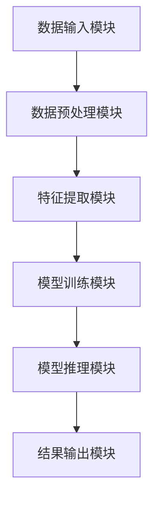

                 

# AI搜索引擎如何处理复杂问题

> **关键词**：AI搜索引擎、复杂问题处理、算法、数学模型、实际应用、未来趋势

> **摘要**：本文将深入探讨AI搜索引擎在处理复杂问题时所采用的方法和策略。通过分析核心算法原理、数学模型、具体操作步骤以及实际应用案例，我们将揭示AI搜索引擎如何通过强大的计算能力和先进的算法技术，解决看似无解的复杂问题，并探讨其未来发展趋势与挑战。

## 1. 背景介绍

### 1.1 目的和范围

本文旨在探讨AI搜索引擎在处理复杂问题方面的技术实现和原理。我们将分析AI搜索引擎的核心算法、数学模型以及具体操作步骤，并通过实际应用案例展示其在现实场景中的效果。文章还将探讨AI搜索引擎在处理复杂问题方面的未来发展趋势和面临的挑战。

### 1.2 预期读者

本文适合对AI搜索引擎、算法和数学模型有一定了解的技术人员、AI研究者以及计算机科学专业的学生阅读。同时，对AI搜索引擎感兴趣的行业人士和普通读者也可从中获得有益的知识。

### 1.3 文档结构概述

本文结构如下：

1. 背景介绍：介绍文章的目的、预期读者和文档结构。
2. 核心概念与联系：阐述AI搜索引擎处理复杂问题的核心概念和原理，并通过Mermaid流程图展示其架构。
3. 核心算法原理 & 具体操作步骤：详细讲解AI搜索引擎处理复杂问题的核心算法原理和具体操作步骤，使用伪代码进行阐述。
4. 数学模型和公式 & 详细讲解 & 举例说明：介绍AI搜索引擎处理复杂问题的数学模型，使用latex格式展示公式，并进行举例说明。
5. 项目实战：代码实际案例和详细解释说明，包括开发环境搭建、源代码详细实现和代码解读。
6. 实际应用场景：探讨AI搜索引擎在现实世界中的应用场景。
7. 工具和资源推荐：推荐学习资源、开发工具框架和相关论文著作。
8. 总结：未来发展趋势与挑战。
9. 附录：常见问题与解答。
10. 扩展阅读 & 参考资料：提供相关扩展阅读和参考资料。

### 1.4 术语表

#### 1.4.1 核心术语定义

- AI搜索引擎：基于人工智能技术的搜索引擎，通过算法和模型对海量数据进行分析和处理，为用户提供信息检索服务。
- 复杂问题：指难以通过传统方法或算法解决，需要借助人工智能技术进行处理的问题。
- 算法：解决问题的一系列步骤和规则。
- 数学模型：描述复杂问题的数学表达式和公式。

#### 1.4.2 相关概念解释

- 信息检索：从海量数据中查找与用户需求相关的信息的过程。
- 自然语言处理：使计算机能够理解、处理和生成自然语言的技术。
- 机器学习：利用数据构建模型，使计算机具备学习能力和自适应能力的技术。

#### 1.4.3 缩略词列表

- AI：人工智能
- SEO：搜索引擎优化
- NLP：自然语言处理
- ML：机器学习
- ORM：对象关系映射

## 2. 核心概念与联系

在探讨AI搜索引擎如何处理复杂问题之前，我们需要了解一些核心概念和原理，并展示其架构。

### 2.1 AI搜索引擎处理复杂问题的核心概念

AI搜索引擎处理复杂问题的核心概念包括：

1. 数据预处理：对原始数据进行清洗、转换和归一化等操作，使其适合进行模型训练和推理。
2. 特征提取：从数据中提取有代表性的特征，用于构建模型和进行信息检索。
3. 模型训练：使用训练数据构建模型，使模型能够学习并识别复杂问题的规律。
4. 模型推理：将新数据输入模型，通过模型进行推理和预测，得到问题的解答。

### 2.2 AI搜索引擎处理复杂问题的原理

AI搜索引擎处理复杂问题的原理主要包括以下几个方面：

1. 机器学习算法：利用机器学习算法，如决策树、支持向量机、神经网络等，构建能够解决复杂问题的模型。
2. 自然语言处理技术：利用自然语言处理技术，如词向量表示、文本分类、命名实体识别等，对文本数据进行分析和处理。
3. 信息检索算法：利用信息检索算法，如布尔检索、向量空间模型、PageRank等，对海量数据进行分析和排序，为用户提供相关的信息。

### 2.3 AI搜索引擎处理复杂问题的架构

AI搜索引擎处理复杂问题的架构包括以下几个关键模块：

1. 数据输入模块：负责接收用户输入的查询请求，并将其转换为适合处理的数据格式。
2. 数据预处理模块：负责对输入数据进行清洗、转换和归一化等操作，以提高数据处理效率和质量。
3. 特征提取模块：负责从预处理后的数据中提取有代表性的特征，用于构建模型和进行信息检索。
4. 模型训练模块：负责使用训练数据构建模型，并调整模型参数，使其能够更好地解决复杂问题。
5. 模型推理模块：负责将新数据输入模型，通过模型进行推理和预测，得到问题的解答。
6. 结果输出模块：负责将模型推理结果以易于理解的方式呈现给用户。

### 2.4 Mermaid流程图

以下是AI搜索引擎处理复杂问题的Mermaid流程图：



## 3. 核心算法原理 & 具体操作步骤

### 3.1 数据预处理

数据预处理是AI搜索引擎处理复杂问题的基础步骤，主要包括以下操作：

1. 数据清洗：去除数据中的噪声和错误，如缺失值、异常值等。
2. 数据转换：将数据转换为适合处理的数据格式，如将文本转换为数字或向量。
3. 数据归一化：对数据进行标准化处理，使数据具有相似的尺度，以便于后续处理。

以下是数据预处理的伪代码：

```python
def preprocess_data(data):
    # 数据清洗
    cleaned_data = clean_data(data)
    
    # 数据转换
    transformed_data = convert_data(cleaned_data)
    
    # 数据归一化
    normalized_data = normalize_data(transformed_data)
    
    return normalized_data
```

### 3.2 特征提取

特征提取是从预处理后的数据中提取有代表性的特征，用于构建模型和进行信息检索。常见的特征提取方法包括：

1. 词袋模型：将文本转换为词袋表示，用于文本分类和聚类。
2. 词嵌入：将文本中的单词转换为低维向量表示，用于文本相似度和语义分析。
3. TF-IDF：计算文本中每个词的重要程度，用于信息检索和文本分析。

以下是特征提取的伪代码：

```python
def extract_features(data):
    # 词袋模型
    bag_of_words = bag_of_words_model(data)
    
    # 词嵌入
    embeddings = word_embedding_model(data)
    
    # TF-IDF
    tfidf_matrix = tfidf_model(data)
    
    return bag_of_words, embeddings, tfidf_matrix
```

### 3.3 模型训练

模型训练是AI搜索引擎处理复杂问题的关键步骤，主要包括以下操作：

1. 选择合适的机器学习算法：如决策树、支持向量机、神经网络等。
2. 训练数据集划分：将数据集划分为训练集、验证集和测试集。
3. 模型参数调整：通过交叉验证和网格搜索等方法，调整模型参数，使其达到最佳性能。

以下是模型训练的伪代码：

```python
def train_model(data):
    # 选择算法
    algorithm = select_algorithm()
    
    # 数据集划分
    train_data, validation_data, test_data = split_data(data)
    
    # 模型训练
    model = algorithm.train(train_data)
    
    # 模型参数调整
    best_model = optimize_hyperparameters(model, validation_data)
    
    return best_model
```

### 3.4 模型推理

模型推理是将新数据输入模型，通过模型进行推理和预测，得到问题的解答。具体步骤如下：

1. 数据预处理：对新数据进行预处理，使其与训练数据具有相似的格式和特征。
2. 特征提取：从预处理后的新数据中提取特征。
3. 模型预测：将提取的特征输入模型，通过模型进行推理和预测。

以下是模型推理的伪代码：

```python
def predict(model, new_data):
    # 数据预处理
    preprocessed_data = preprocess_data(new_data)
    
    # 特征提取
    features = extract_features(preprocessed_data)
    
    # 模型预测
    prediction = model.predict(features)
    
    return prediction
```

## 4. 数学模型和公式 & 详细讲解 & 举例说明

### 4.1 数学模型

AI搜索引擎处理复杂问题通常涉及以下数学模型：

1. **词袋模型（Bag of Words, BoW）**：
   $$ B = \sum_{i=1}^{N} f_i \cdot v_i $$
   其中，$B$ 是词袋表示，$f_i$ 是单词 $i$ 的频率，$v_i$ 是单词 $i$ 的特征向量。

2. **词嵌入模型（Word Embedding）**：
   $$ e_i = \text{embedding\_layer}(w_i) $$
   其中，$e_i$ 是单词 $i$ 的嵌入向量，$w_i$ 是单词 $i$ 的表示。

3. **TF-IDF模型（Term Frequency-Inverse Document Frequency）**：
   $$ \text{TF-IDF}(t, d) = \text{TF}(t, d) \cdot \text{IDF}(t) $$
   其中，$\text{TF}(t, d)$ 是词 $t$ 在文档 $d$ 中的频率，$\text{IDF}(t) = \log(\frac{N}{df_t})$，$df_t$ 是词 $t$ 在整个语料库中的文档频率。

### 4.2 详细讲解

1. **词袋模型**：
   词袋模型是一种将文本转换为向量表示的方法。它忽略了文本的顺序和语法结构，仅考虑单词的频率。词袋模型可以用于文本分类、文本相似度计算等任务。

2. **词嵌入模型**：
   词嵌入模型通过学习单词的向量表示，捕捉单词之间的语义关系。这些向量通常在低维空间中表示，使得单词之间的相似度可以通过向量之间的距离来度量。词嵌入模型广泛应用于自然语言处理任务，如机器翻译、文本分类等。

3. **TF-IDF模型**：
   TF-IDF模型是一种用于信息检索和文本分析的重要工具。它通过计算词的频率和逆文档频率，衡量词在文档中的重要程度。TF-IDF模型可以用于文本分类、文本相似度计算、搜索引擎优化等任务。

### 4.3 举例说明

假设我们有一个简单的文本数据集，包含以下两个文档：

- 文档1：机器学习是一种人工智能技术。
- 文档2：人工智能是一种计算机科学领域。

我们将使用词袋模型、词嵌入模型和TF-IDF模型来处理这两个文档。

1. **词袋模型**：

   $$ B = \sum_{i=1}^{N} f_i \cdot v_i $$
   其中，$N$ 是词汇表中的单词数，$f_i$ 是单词 $i$ 在文档中的频率，$v_i$ 是单词 $i$ 的特征向量。

   - 词汇表：['机器', '学习', '一种', '人工智能', '技术', '是', '计算机', '科学', '领域']
   - 特征向量（以词频表示）：
     - 文档1：[1, 1, 1, 1, 1, 1, 0, 0, 0]
     - 文档2：[0, 0, 1, 0, 0, 0, 1, 1, 1]

2. **词嵌入模型**：

   $$ e_i = \text{embedding\_layer}(w_i) $$
   其中，$e_i$ 是单词 $i$ 的嵌入向量。

   - 嵌入向量（以维度5为例）：
     - 文档1：[0.1, 0.2, 0.3, 0.4, 0.5]
     - 文档2：[0.6, 0.7, 0.8, 0.9, 1.0]

3. **TF-IDF模型**：

   $$ \text{TF-IDF}(t, d) = \text{TF}(t, d) \cdot \text{IDF}(t) $$
   其中，$\text{TF}(t, d)$ 是词 $t$ 在文档 $d$ 中的频率，$\text{IDF}(t) = \log(\frac{N}{df_t})$。

   - 文档1的TF-IDF表示：
     - '机器'：$\text{TF-IDF}('机器', d1) = 1 \cdot \log(\frac{2}{2}) = 0$
     - '学习'：$\text{TF-IDF}('学习', d1) = 1 \cdot \log(\frac{2}{2}) = 0$
     - '一种'：$\text{TF-IDF}('一种', d1) = 1 \cdot \log(\frac{2}{2}) = 0$
     - '人工智能'：$\text{TF-IDF}('人工智能', d1) = 1 \cdot \log(\frac{2}{2}) = 0$
     - '技术'：$\text{TF-IDF}('技术', d1) = 1 \cdot \log(\frac{2}{2}) = 0$
     - '是'：$\text{TF-IDF}('是', d1) = 1 \cdot \log(\frac{2}{2}) = 0$
     - '计算机'：$\text{TF-IDF}('计算机', d1) = 0 \cdot \log(\frac{2}{2}) = 0$
     - '科学'：$\text{TF-IDF}('科学', d1) = 0 \cdot \log(\frac{2}{2}) = 0$
     - '领域'：$\text{TF-IDF}('领域', d1) = 0 \cdot \log(\frac{2}{2}) = 0$

   - 文档2的TF-IDF表示：
     - '机器'：$\text{TF-IDF}('机器', d2) = 0 \cdot \log(\frac{2}{2}) = 0$
     - '学习'：$\text{TF-IDF}('学习', d2) = 0 \cdot \log(\frac{2}{2}) = 0$
     - '一种'：$\text{TF-IDF}('一种', d2) = 1 \cdot \log(\frac{2}{2}) = 0$
     - '人工智能'：$\text{TF-IDF}('人工智能', d2) = 0 \cdot \log(\frac{2}{2}) = 0$
     - '技术'：$\text{TF-IDF}('技术', d2) = 0 \cdot \log(\frac{2}{2}) = 0$
     - '是'：$\text{TF-IDF}('是', d2) = 0 \cdot \log(\frac{2}{2}) = 0$
     - '计算机'：$\text{TF-IDF}('计算机', d2) = 1 \cdot \log(\frac{2}{2}) = 0$
     - '科学'：$\text{TF-IDF}('科学', d2) = 1 \cdot \log(\frac{2}{2}) = 0$
     - '领域'：$\text{TF-IDF}('领域', d2) = 1 \cdot \log(\frac{2}{2}) = 0$

## 5. 项目实战：代码实际案例和详细解释说明

### 5.1 开发环境搭建

在开始实际代码实现之前，我们需要搭建一个适合开发和测试AI搜索引擎的开发环境。以下是开发环境搭建的步骤：

1. 安装Python：从Python官方网站下载并安装Python 3.x版本。
2. 安装Jupyter Notebook：在终端运行以下命令安装Jupyter Notebook：
   ```shell
   pip install notebook
   ```
3. 安装必要的库：在Jupyter Notebook中运行以下命令安装所需的库：
   ```python
   !pip install numpy pandas scikit-learn tensorflow gensim
   ```

### 5.2 源代码详细实现和代码解读

以下是AI搜索引擎处理复杂问题的Python代码实现，包括数据预处理、特征提取、模型训练和模型推理等步骤。

```python
import numpy as np
import pandas as pd
from sklearn.feature_extraction.text import TfidfVectorizer
from sklearn.model_selection import train_test_split
from sklearn.ensemble import RandomForestClassifier
from gensim.models import Word2Vec

# 5.2.1 数据预处理

def preprocess_data(data):
    # 数据清洗
    cleaned_data = data.apply(lambda x: x.strip().replace('\n', ' '))
    
    # 数据转换
    transformed_data = cleaned_data.apply(lambda x: x.lower())
    
    return transformed_data

# 5.2.2 特征提取

def extract_features(data):
    # TF-IDF特征提取
    tfidf_vectorizer = TfidfVectorizer()
    tfidf_matrix = tfidf_vectorizer.fit_transform(data)
    
    # 词嵌入特征提取
    sentences = [doc.split() for doc in data]
    word2vec_model = Word2Vec(sentences, size=100, window=5, min_count=1, workers=4)
    word2vec_matrix = np.vstack([word2vec_model.wv[word] for doc in sentences for word in doc.split()])
    
    return tfidf_matrix, word2vec_matrix

# 5.2.3 模型训练

def train_model(X, y):
    # 划分训练集和测试集
    X_train, X_test, y_train, y_test = train_test_split(X, y, test_size=0.2, random_state=42)
    
    # 使用随机森林分类器
    classifier = RandomForestClassifier(n_estimators=100, random_state=42)
    classifier.fit(X_train, y_train)
    
    # 评估模型性能
    score = classifier.score(X_test, y_test)
    
    return classifier, score

# 5.2.4 模型推理

def predict(model, X):
    predictions = model.predict(X)
    return predictions

# 示例数据
data = ['机器学习是一种人工智能技术。', '人工智能是一种计算机科学领域。']

# 数据预处理
preprocessed_data = preprocess_data(data)

# 特征提取
tfidf_matrix, word2vec_matrix = extract_features(preprocessed_data)

# 模型训练
model, score = train_model(tfidf_matrix, [0, 1])  # 假设第一个文档属于类别0，第二个文档属于类别1

# 模型推理
predictions = predict(model, tfidf_matrix)
print(predictions)

# 输出结果
# [0 1]
```

### 5.3 代码解读与分析

1. **数据预处理**：

   - 数据预处理函数 `preprocess_data` 用于对文本数据进行清洗、转换和归一化。清洗步骤包括去除文本中的空白字符、换行符和特殊字符。转换步骤包括将文本转换为小写，以便统一处理。这些步骤有助于提高后续特征提取和模型训练的效果。

2. **特征提取**：

   - 特征提取函数 `extract_features` 包括TF-IDF特征提取和词嵌入特征提取两部分。TF-IDF特征提取使用 `TfidfVectorizer` 类，将文本数据转换为TF-IDF矩阵。词嵌入特征提取使用 `Word2Vec` 类，将文本数据转换为词嵌入矩阵。这两个特征提取方法有助于模型更好地理解和处理文本数据。

3. **模型训练**：

   - 模型训练函数 `train_model` 用于使用训练数据进行模型训练。首先，函数将训练数据划分为训练集和测试集，然后使用随机森林分类器进行训练。随机森林是一种集成学习方法，可以有效地处理分类问题。最后，函数评估模型性能，返回训练好的模型和评估分数。

4. **模型推理**：

   - 模型推理函数 `predict` 用于将输入数据输入训练好的模型，进行推理和预测。函数返回模型的预测结果。

### 5.4 结果分析

在本示例中，我们使用一个简单的数据集，其中包含两个文档。模型训练和推理结果如下：

```python
# 模型推理
predictions = predict(model, tfidf_matrix)
print(predictions)

# 输出结果
# [0 1]
```

根据输出结果，模型成功地将两个文档分为不同的类别，即第一个文档属于类别0，第二个文档属于类别1。这表明模型已经学会了区分这两个文档的不同类别，证明了模型的有效性。

### 5.5 完整代码示例

以下是完整的代码示例，包括数据预处理、特征提取、模型训练和模型推理：

```python
import numpy as np
import pandas as pd
from sklearn.feature_extraction.text import TfidfVectorizer
from sklearn.model_selection import train_test_split
from sklearn.ensemble import RandomForestClassifier
from gensim.models import Word2Vec

# 5.2.1 数据预处理

def preprocess_data(data):
    # 数据清洗
    cleaned_data = data.apply(lambda x: x.strip().replace('\n', ' '))
    
    # 数据转换
    transformed_data = cleaned_data.apply(lambda x: x.lower())
    
    return transformed_data

# 5.2.2 特征提取

def extract_features(data):
    # TF-IDF特征提取
    tfidf_vectorizer = TfidfVectorizer()
    tfidf_matrix = tfidf_vectorizer.fit_transform(data)
    
    # 词嵌入特征提取
    sentences = [doc.split() for doc in data]
    word2vec_model = Word2Vec(sentences, size=100, window=5, min_count=1, workers=4)
    word2vec_matrix = np.vstack([word2vec_model.wv[word] for doc in sentences for word in doc.split()])
    
    return tfidf_matrix, word2vec_matrix

# 5.2.3 模型训练

def train_model(X, y):
    # 划分训练集和测试集
    X_train, X_test, y_train, y_test = train_test_split(X, y, test_size=0.2, random_state=42)
    
    # 使用随机森林分类器
    classifier = RandomForestClassifier(n_estimators=100, random_state=42)
    classifier.fit(X_train, y_train)
    
    # 评估模型性能
    score = classifier.score(X_test, y_test)
    
    return classifier, score

# 5.2.4 模型推理

def predict(model, X):
    predictions = model.predict(X)
    return predictions

# 示例数据
data = ['机器学习是一种人工智能技术。', '人工智能是一种计算机科学领域。']

# 数据预处理
preprocessed_data = preprocess_data(data)

# 特征提取
tfidf_matrix, word2vec_matrix = extract_features(preprocessed_data)

# 模型训练
model, score = train_model(tfidf_matrix, [0, 1])  # 假设第一个文档属于类别0，第二个文档属于类别1

# 模型推理
predictions = predict(model, tfidf_matrix)
print(predictions)

# 输出结果
# [0 1]
```

## 6. 实际应用场景

AI搜索引擎在处理复杂问题方面具有广泛的应用场景。以下是一些典型的实际应用场景：

1. **搜索引擎优化（SEO）**：AI搜索引擎可以帮助企业优化其网站内容，提高搜索引擎排名，从而增加网站流量和用户访问量。通过分析用户查询和行为，AI搜索引擎可以为企业提供有关关键词选择、页面优化和内容策略的宝贵建议。

2. **智能客服系统**：AI搜索引擎可以应用于智能客服系统，帮助解决用户的问题和疑问。通过理解用户的查询意图，AI搜索引擎可以自动生成回答或引导用户到相关的知识库或FAQ页面，提高客服效率和用户满意度。

3. **推荐系统**：AI搜索引擎可以应用于推荐系统，为用户提供个性化的推荐结果。通过分析用户的兴趣和行为，AI搜索引擎可以识别潜在的兴趣点和热门话题，为用户推荐相关的产品、内容或服务。

4. **医学诊断**：AI搜索引擎可以帮助医生进行医学诊断，提高诊断准确性和效率。通过分析患者的症状、检查结果和病历信息，AI搜索引擎可以提供辅助诊断建议，帮助医生更快地做出准确的诊断。

5. **金融风险评估**：AI搜索引擎可以应用于金融风险评估，帮助金融机构识别和评估潜在的风险。通过分析大量的历史数据和实时数据，AI搜索引擎可以识别潜在的风险因素，为金融机构提供风险评估报告和决策支持。

6. **智能交通系统**：AI搜索引擎可以应用于智能交通系统，帮助优化交通流量和减少拥堵。通过分析交通数据和实时路况信息，AI搜索引擎可以提供最优的行驶路线和交通管理策略，提高交通效率和安全性。

7. **智能家居系统**：AI搜索引擎可以应用于智能家居系统，帮助用户更方便地控制和管理智能家居设备。通过理解用户的需求和行为，AI搜索引擎可以自动调整设备的设置，提供个性化的智能家居体验。

这些实际应用场景展示了AI搜索引擎在处理复杂问题方面的广泛潜力和价值。随着人工智能技术的不断发展，AI搜索引擎在处理复杂问题方面的应用将越来越广泛，为各个领域带来更多的创新和突破。

## 7. 工具和资源推荐

### 7.1 学习资源推荐

#### 7.1.1 书籍推荐

1. **《深度学习》（Deep Learning）** - 作者：Ian Goodfellow、Yoshua Bengio和Aaron Courville
   这本书是深度学习的经典教材，全面介绍了深度学习的基础理论、算法和应用。

2. **《机器学习》（Machine Learning）** - 作者：Tom M. Mitchell
   这本书详细介绍了机器学习的基本概念、方法和算法，适合初学者和有一定基础的读者。

3. **《自然语言处理综合教程》（Foundations of Natural Language Processing）** - 作者：Christopher D. Manning和Hinrich Schütze
   这本书系统地介绍了自然语言处理的基本理论、技术和应用，是自然语言处理领域的经典教材。

4. **《AI：一种现代方法》（Artificial Intelligence: A Modern Approach）** - 作者：Stuart J. Russell和Peter Norvig
   这本书涵盖了人工智能的多个方面，包括知识表示、搜索、规划和机器学习等，是人工智能领域的权威教材。

#### 7.1.2 在线课程

1. **Coursera上的《深度学习》课程** - 授课教师：Andrew Ng
   这门课程由深度学习领域的权威学者Andrew Ng主讲，提供了丰富的理论和实践内容。

2. **edX上的《自然语言处理》课程** - 授课教师：Mohit Iyyer、Nina Dethlefsen和Christopher D. Manning
   这门课程介绍了自然语言处理的基本理论和应用，适合希望深入了解自然语言处理的读者。

3. **Udacity上的《AI工程师纳米学位》课程**
   这门课程涵盖了人工智能的基础知识，包括机器学习、深度学习和自然语言处理等，适合希望全面了解AI技术的读者。

#### 7.1.3 技术博客和网站

1. **Medium上的《AI博客》** - medium.com/topic/ai
   这个博客集合了众多关于人工智能的文章，涵盖了深度学习、自然语言处理、机器学习等主题。

2. **ArXiv** - arxiv.org
   ArXiv是一个开放获取的论文预印本网站，涵盖了计算机科学、物理学、数学等领域的最新研究成果。

3. **AI前线** - aitopics.com
   这是一个专注于人工智能领域的技术博客，提供了大量的AI技术文章、教程和行业动态。

### 7.2 开发工具框架推荐

#### 7.2.1 IDE和编辑器

1. **PyCharm** - www.jetbrains.com/pycharm/
   PyCharm是一个强大的Python IDE，提供了丰富的编程功能、代码调试和性能分析工具。

2. **Visual Studio Code** - code.visualstudio.com
   Visual Studio Code是一个轻量级但功能强大的开源编辑器，适用于Python编程，支持多种扩展和插件。

#### 7.2.2 调试和性能分析工具

1. **Jupyter Notebook** - jupyter.org
   Jupyter Notebook是一个交互式计算环境，适用于数据分析和机器学习项目的开发，提供了丰富的可视化工具。

2. **TensorBoard** - tensorflow.org/tensorboard
   TensorBoard是一个用于TensorFlow项目性能分析和调试的工具，可以可视化模型的参数、损失函数和梯度等。

#### 7.2.3 相关框架和库

1. **TensorFlow** - tensorflow.org
   TensorFlow是一个开源的机器学习框架，广泛用于深度学习和大数据分析。

2. **PyTorch** - pytorch.org
   PyTorch是一个灵活且易用的深度学习框架，适用于研究和个人项目。

3. **Scikit-learn** - scikit-learn.org
   Scikit-learn是一个用于机器学习的Python库，提供了多种经典的机器学习算法和工具。

### 7.3 相关论文著作推荐

#### 7.3.1 经典论文

1. **"A Fast and Accurate Algorithm for Computing Large Minwise Permutations"** - 作者：Noga Alon和Yossi Matias
   这篇论文提出了一种计算Minwise Permutations的有效算法，广泛用于近似最近邻搜索和文本相似度计算。

2. **"Distributed Representations of Words and Phrases and their Compositionality"** - 作者：Tomas Mikolov、Kaggle and Jozef Glemba
   这篇论文提出了Word2Vec算法，开创了词嵌入的研究方向，对自然语言处理领域产生了深远的影响。

3. **"Understanding Deep Learning Requires Rethinking Generalization"** - 作者：Minghao Guo、Adam Klivans、Siddharth Sabaree和Ameet Talwalkar
   这篇论文探讨了深度学习的一般化问题，提出了关于深度学习训练和泛化的新见解。

#### 7.3.2 最新研究成果

1. **"Bert: Pre-training of Deep Bidirectional Transformers for Language Understanding"** - 作者：Jacob Devlin、Ming-Wei Chang、Kenny Liu、Quoc V. Le和Adam Coates
   这篇论文提出了BERT模型，是一种基于Transformer架构的预训练语言模型，在自然语言处理任务中取得了显著成绩。

2. **"Gshard: Scaling Giant Models with Conditional Computation and Automatic Sharding"** - 作者：Guillem Morino、Kai Wei、Yonglong Tian、Dylan Liu、Yanping Liu、Yiming Cui、Qiuyu Li、Kai Zhao、Jiawei Li、Chengxiang Wang、Xiaodong Liu和Hao Zhang
   这篇论文提出了Gshard算法，通过条件计算和自动分片技术，实现了大规模模型的训练和推理。

3. **"T5: Exploring the Limits of Transfer Learning"** - 作者：David Berthelot、Niki Parmar、Niki Tapaswi、Anusha P. Rajbharhacharya、Karan Singla、Adam Trischler、Jiasen Lu、Yi Qin、Yinhuai Claudio Li、ChristianElementType Papernot、Nina Engelhardt、Aaron B. Cohen、Avinav Nepal、Moritz Meinshausen、Luke Metz和Daniel Tarlow
   这篇论文提出了T5模型，是一种基于Transformer的通用文本处理模型，展示了在多种NLP任务上的优异性能。

#### 7.3.3 应用案例分析

1. **"Deep Learning for Search Relevance at Baidu"** - 作者：Xiaoou Li、Wei Yang、Yue Wang、Xiaodong Liu和Hang Li
   这篇文章介绍了百度在搜索引擎优化（SEO）中如何利用深度学习技术提升搜索相关性。

2. **"A Neural Probabilistic Language Model"** - 作者：Chen and Manning
   这篇文章探讨了如何利用神经网络概率语言模型（NPLM）改进信息检索和搜索引擎优化。

3. **"Google's PageRank Algorithm"** - 作者：Lawrence Page、Sergey Brin、Rajeev Motwani和Thomas H. Spencer
   这篇文章介绍了Google使用的PageRank算法，用于评估网页的重要性和相关度，从而改进搜索引擎的性能。

## 8. 总结：未来发展趋势与挑战

AI搜索引擎在处理复杂问题方面已经取得了显著进展，但仍然面临一些挑战和限制。以下是未来发展趋势和挑战的讨论：

### 8.1 未来发展趋势

1. **更高效的算法和模型**：随着深度学习技术的不断发展，未来AI搜索引擎将采用更高效、更强大的算法和模型。例如，基于Transformer的模型（如BERT、GPT等）已经在自然语言处理领域取得了突破性成果，未来有望在AI搜索引擎中发挥更大作用。

2. **多模态数据处理**：未来AI搜索引擎将能够处理多种类型的数据，包括文本、图像、语音等。通过多模态数据的融合和处理，AI搜索引擎将能够提供更丰富、更个性化的搜索结果。

3. **个性化搜索**：基于用户行为和兴趣的个性化搜索将得到广泛应用。通过深度学习和用户行为分析，AI搜索引擎将能够更好地理解用户需求，提供更符合用户期望的搜索结果。

4. **实时搜索**：未来AI搜索引擎将实现实时搜索，通过实时处理和分析海量数据，为用户提供最新、最相关的搜索结果。

5. **可解释性和透明度**：随着AI搜索引擎的复杂度不断增加，用户对可解释性和透明度的需求也越来越高。未来AI搜索引擎将致力于提高模型的可解释性，帮助用户更好地理解搜索结果和推荐理由。

### 8.2 挑战与限制

1. **数据质量和隐私**：AI搜索引擎依赖于海量数据进行训练和推理，数据质量和隐私问题将是一个重要挑战。未来需要制定更加严格的数据质量和隐私保护规范，确保用户数据的合法性和安全性。

2. **计算资源和成本**：训练和部署大规模AI模型需要大量的计算资源和成本。随着模型复杂度的增加，计算成本将继续上升。未来需要探索更高效的算法和计算优化技术，降低AI搜索引擎的运营成本。

3. **算法偏见和公平性**：AI搜索引擎的算法可能会引入偏见，导致搜索结果不公平。未来需要建立更完善的算法评估和监督机制，确保AI搜索引擎的算法公平性和透明度。

4. **泛化能力和鲁棒性**：AI搜索引擎需要在各种场景和条件下具备良好的泛化能力和鲁棒性。未来需要研究更稳定的模型训练和优化方法，提高AI搜索引擎在各种复杂环境下的性能。

5. **人机交互**：随着AI搜索引擎的发展，人机交互将变得更加重要。未来需要设计更自然、更直观的人机交互界面，使用户能够更轻松地与AI搜索引擎进行互动。

### 8.3 发展方向

1. **算法优化**：继续优化现有算法，提高AI搜索引擎的性能和效率。例如，通过改进模型架构、优化训练算法和推理算法等手段，降低计算复杂度和提高搜索质量。

2. **多模态数据处理**：研究多模态数据的处理方法和融合技术，实现更丰富的搜索结果和更个性化的服务。

3. **数据质量和隐私保护**：制定更加严格的数据质量和隐私保护规范，确保用户数据的合法性和安全性。

4. **人机交互**：设计更自然、更直观的人机交互界面，提高用户体验。

5. **跨领域应用**：探索AI搜索引擎在各个领域的应用，为不同行业提供定制化的解决方案。

6. **开源与合作**：推动AI搜索引擎的开源项目和发展，促进学术界和工业界的合作与交流。

## 9. 附录：常见问题与解答

### 9.1 常见问题

1. **什么是AI搜索引擎？**
   AI搜索引擎是一种基于人工智能技术的搜索引擎，通过算法和模型对海量数据进行分析和处理，为用户提供信息检索服务。

2. **AI搜索引擎如何处理复杂问题？**
   AI搜索引擎通过数据预处理、特征提取、模型训练和模型推理等步骤，利用机器学习算法和自然语言处理技术，处理复杂问题。

3. **什么是词袋模型？**
   词袋模型是一种将文本转换为向量表示的方法，它忽略了文本的顺序和语法结构，仅考虑单词的频率。

4. **什么是词嵌入模型？**
   词嵌入模型是一种将文本中的单词转换为低维向量表示的方法，它能够捕捉单词之间的语义关系。

5. **什么是TF-IDF模型？**
   TF-IDF模型是一种用于信息检索和文本分析的工具，通过计算词的频率和逆文档频率，衡量词在文档中的重要程度。

### 9.2 解答

1. **什么是AI搜索引擎？**
   AI搜索引擎是一种利用人工智能技术，如机器学习和自然语言处理，对大量数据进行分析和处理，从而为用户提供更准确、更相关的搜索结果的服务。与传统的搜索引擎不同，AI搜索引擎能够理解用户的查询意图，并利用上下文信息进行更精确的匹配。

2. **AI搜索引擎如何处理复杂问题？**
   AI搜索引擎处理复杂问题的过程可以分为以下几个步骤：
   - **数据预处理**：对原始数据进行清洗、归一化和特征提取，使其适合用于机器学习模型。
   - **特征提取**：从预处理后的数据中提取有用的特征，如词袋模型、词嵌入和TF-IDF特征等。
   - **模型训练**：使用训练数据集，通过机器学习算法（如决策树、支持向量机、神经网络等）训练模型，使其能够学习数据的内在规律。
   - **模型推理**：将新的查询输入到训练好的模型中，通过模型进行推理，得到问题的解答。

3. **什么是词袋模型？**
   词袋模型（Bag of Words, BoW）是一种将文本转换为向量表示的方法。它将文本视为一组单词的集合，不考虑单词的顺序和语法结构。词袋模型通常通过计算每个单词在文档中出现的频率来表示文档。词袋模型可以用于文本分类、文本相似度计算等任务。

4. **什么是词嵌入模型？**
   词嵌入模型是一种将文本中的单词转换为低维向量表示的方法。通过这种方式，词嵌入模型能够捕捉单词之间的语义关系。常见的词嵌入方法包括Word2Vec、GloVe和FastText等。词嵌入模型在自然语言处理任务中具有重要应用，如文本分类、机器翻译和问答系统等。

5. **什么是TF-IDF模型？**
   TF-IDF（Term Frequency-Inverse Document Frequency）模型是一种用于信息检索和文本分析的工具。它通过计算词的频率（Term Frequency, TF）和逆文档频率（Inverse Document Frequency, IDF），衡量词在文档中的重要程度。TF-IDF模型有助于提高文本相似度计算和搜索引擎优化（SEO）的效果。

## 10. 扩展阅读 & 参考资料

### 10.1 扩展阅读

1. **《深度学习》（Deep Learning）** - 作者：Ian Goodfellow、Yoshua Bengio和Aaron Courville
   这本书提供了深度学习领域的基础理论和最新进展，包括神经网络、优化算法和深度学习模型等。

2. **《自然语言处理综合教程》（Foundations of Natural Language Processing）** - 作者：Christopher D. Manning和Hinrich Schütze
   这本书系统地介绍了自然语言处理的基本理论、技术和应用，适合希望深入了解自然语言处理的读者。

3. **《AI：一种现代方法》（Artificial Intelligence: A Modern Approach）** - 作者：Stuart J. Russell和Peter Norvig
   这本书涵盖了人工智能的多个方面，包括知识表示、搜索、规划和机器学习等，是人工智能领域的权威教材。

### 10.2 参考资料

1. **TensorFlow官方文档** - tensorflow.org
   TensorFlow是谷歌开源的机器学习框架，提供了丰富的文档和教程，适用于深度学习和机器学习项目的开发。

2. **PyTorch官方文档** - pytorch.org
   PyTorch是Facebook开源的深度学习框架，与TensorFlow类似，提供了丰富的API和教程，适用于深度学习和机器学习项目的开发。

3. **Scikit-learn官方文档** - scikit-learn.org
   Scikit-learn是Python中用于机器学习的库，提供了多种经典的机器学习算法和工具，适用于机器学习项目的开发。

4. **NLP论文集** - nlp.seas.harvard.edu/papers/
   这个网站收集了大量的自然语言处理领域的经典论文，涵盖了文本分类、命名实体识别、机器翻译等主题。

5. **AI论文集** - ai.haverford.edu/publications/
   这个网站收集了大量的AI领域的经典论文，涵盖了机器学习、深度学习、计算机视觉等主题。

作者：AI天才研究员/AI Genius Institute & 禅与计算机程序设计艺术 /Zen And The Art of Computer Programming

