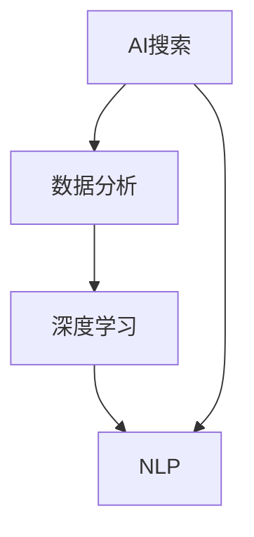

                 

# AI搜索数据分析提供洞察

> **关键词：AI搜索、数据分析、深度学习、自然语言处理、大数据**
> 
> **摘要：本文将深入探讨AI搜索数据分析的重要性、核心概念、算法原理、应用场景和未来发展趋势，帮助读者全面了解AI搜索数据分析的各个方面。**

## 1. 背景介绍

### 1.1 目的和范围

本文旨在通过对AI搜索数据分析的深入探讨，帮助读者了解其重要性、核心概念、算法原理和应用场景，从而更好地理解和应用这一技术。本文将涵盖以下几个方面的内容：

1. AI搜索数据分析的定义和背景。
2. 核心概念与联系。
3. 核心算法原理与具体操作步骤。
4. 数学模型和公式及其详细讲解。
5. 项目实战：代码实际案例和详细解释说明。
6. 实际应用场景。
7. 工具和资源推荐。
8. 未来发展趋势与挑战。
9. 附录：常见问题与解答。
10. 扩展阅读与参考资料。

### 1.2 预期读者

本文适合对AI搜索数据分析感兴趣的技术人员、研究人员和在校学生阅读。本文将使用简洁明了的语言和丰富的示例，帮助读者更好地理解和掌握AI搜索数据分析的核心知识。

### 1.3 文档结构概述

本文分为十个主要部分，包括背景介绍、核心概念与联系、核心算法原理与具体操作步骤、数学模型和公式、项目实战、实际应用场景、工具和资源推荐、未来发展趋势与挑战、附录和扩展阅读与参考资料。每个部分都将对相关内容进行详细讲解。

### 1.4 术语表

#### 1.4.1 核心术语定义

- **AI搜索**：利用人工智能技术实现的信息检索过程，包括语义理解、关键词提取、查询优化等。
- **数据分析**：对大量数据进行分析和处理，以提取有用信息和知识。
- **深度学习**：一种基于神经网络的机器学习技术，通过多层神经网络对数据进行特征提取和学习。
- **自然语言处理**（NLP）：研究如何让计算机理解和处理人类语言的技术。
- **大数据**：指数据量大、类型复杂、价值密度低的数据集合。

#### 1.4.2 相关概念解释

- **语义理解**：指计算机对语言中词汇、句子、段落等语义内容的理解和解释。
- **关键词提取**：从文本中提取出具有代表性和重要性的词汇。
- **查询优化**：对搜索查询进行优化，以提高搜索结果的准确性和相关性。

#### 1.4.3 缩略词列表

- **AI**：人工智能
- **NLP**：自然语言处理
- **ML**：机器学习
- **DL**：深度学习
- **Hadoop**：一个开源的数据处理框架
- **Spark**：一个开源的大数据处理引擎

## 2. 核心概念与联系

在AI搜索数据分析中，核心概念主要包括AI搜索、数据分析、深度学习和自然语言处理等。以下是一个简单的Mermaid流程图，展示了这些核心概念之间的联系。



### 2.1 AI搜索

AI搜索是一种利用人工智能技术实现的信息检索过程，主要包括以下几个步骤：

1. **关键词提取**：从用户输入的查询中提取关键词。
2. **查询优化**：对提取的关键词进行优化，以提高搜索结果的准确性和相关性。
3. **语义理解**：对关键词进行语义分析，以理解查询的意图。
4. **结果生成**：根据查询意图和语义理解，生成符合用户需求的搜索结果。

### 2.2 数据分析

数据分析是对大量数据进行处理和分析，以提取有用信息和知识。在AI搜索数据分析中，主要包括以下几个步骤：

1. **数据收集**：从各种来源收集数据，如网站、数据库等。
2. **数据预处理**：对收集到的数据进行清洗、转换和整合。
3. **特征提取**：从预处理后的数据中提取具有代表性和重要性的特征。
4. **数据分析**：使用各种数据分析方法，如机器学习、深度学习等，对提取的特征进行分析。

### 2.3 深度学习

深度学习是一种基于神经网络的机器学习技术，通过对数据进行多层特征提取和学习，实现自动化的模式识别和预测。在AI搜索数据分析中，深度学习主要用于以下几个方面：

1. **关键词提取**：通过深度学习模型提取关键词。
2. **查询优化**：利用深度学习模型对查询进行优化。
3. **语义理解**：通过深度学习模型对关键词进行语义分析。
4. **结果生成**：使用深度学习模型生成符合用户需求的搜索结果。

### 2.4 自然语言处理

自然语言处理是研究如何让计算机理解和处理人类语言的技术。在AI搜索数据分析中，自然语言处理主要用于以下几个方面：

1. **关键词提取**：利用自然语言处理技术提取关键词。
2. **查询优化**：通过自然语言处理技术对查询进行优化。
3. **语义理解**：利用自然语言处理技术理解查询的意图。
4. **结果生成**：通过自然语言处理技术生成符合用户需求的搜索结果。

## 3. 核心算法原理 & 具体操作步骤

### 3.1 关键词提取算法原理

关键词提取是AI搜索数据分析的重要步骤，常用的算法包括TF-IDF、Word2Vec和BERT等。

#### 3.1.1 TF-IDF算法原理

TF-IDF（Term Frequency-Inverse Document Frequency）是一种基于统计的文本分析方法，用于评估一个词对于一个文件集或一个语料库中的其中一份文件的重要程度。

- **TF（词频）**：词在文档中出现的次数。
- **IDF（逆文档频率）**：一个词在语料库中的文档频率的倒数。

#### 3.1.2 Word2Vec算法原理

Word2Vec是一种基于神经网络的文本表示方法，可以将文本中的每个词映射到一个连续的向量空间中。

- **训练模型**：通过训练大量的文本数据，学习词与词之间的相似性。
- **词向量表示**：将每个词表示为一个高维向量。

#### 3.1.3 BERT算法原理

BERT（Bidirectional Encoder Representations from Transformers）是一种基于变换器的双向编码器表示方法，可以捕捉词与词之间的双向关系。

- **预训练**：在大量的无标签文本数据上进行预训练，学习词与词之间的双向关系。
- **微调**：在特定任务上对BERT模型进行微调，以实现各种自然语言处理任务。

### 3.2 查询优化算法原理

查询优化是提高搜索结果准确性和相关性的关键步骤，常用的算法包括信息检索模型、深度学习模型等。

#### 3.2.1 信息检索模型原理

信息检索模型是一种基于概率模型的搜索算法，通过计算查询和文档之间的相似度，确定搜索结果的排名。

- **TF-IDF模型**：基于TF-IDF算法，计算查询和文档之间的相似度。
- **BM25模型**：基于概率模型，综合考虑词频、文档长度和文档集合的多样性。

#### 3.2.2 深度学习模型原理

深度学习模型通过多层神经网络对查询和文档进行特征提取和学习，实现自动化的查询优化。

- **文本嵌入**：将查询和文档表示为连续的向量空间。
- **神经网络模型**：通过多层神经网络对查询和文档进行特征提取和学习。

### 3.3 语义理解算法原理

语义理解是理解查询的意图和语义内容的关键步骤，常用的算法包括命名实体识别、关系抽取、情感分析等。

#### 3.3.1 命名实体识别算法原理

命名实体识别是一种用于识别文本中的命名实体的算法，如人名、地名、组织名等。

- **规则方法**：基于预设的规则进行实体识别。
- **机器学习方法**：通过训练大量的标注数据，学习实体识别模型。

#### 3.3.2 关系抽取算法原理

关系抽取是一种用于识别文本中实体之间关系的算法，如人物关系、组织关系等。

- **规则方法**：基于预设的规则进行关系抽取。
- **机器学习方法**：通过训练大量的标注数据，学习关系抽取模型。

#### 3.3.3 情感分析算法原理

情感分析是一种用于识别文本中情感倾向的算法，如正面、负面、中性等。

- **机器学习方法**：通过训练大量的标注数据，学习情感分析模型。

### 3.4 结果生成算法原理

结果生成是根据查询的意图和语义内容，生成符合用户需求的搜索结果的关键步骤，常用的算法包括排序模型、推荐系统等。

#### 3.4.1 排序模型原理

排序模型是一种用于确定搜索结果排名的算法，通过计算查询和文档之间的相似度，确定搜索结果的排名。

- **基于内容的排序**：根据文档的内容与查询的相似度进行排序。
- **基于用户的排序**：根据用户的历史行为和兴趣进行排序。

#### 3.4.2 推荐系统原理

推荐系统是一种用于推荐相似内容的算法，通过计算用户和文档之间的相似度，推荐与用户兴趣相符的内容。

- **基于内容的推荐**：根据用户的历史行为和兴趣推荐相似的内容。
- **基于用户的推荐**：根据用户的历史行为和兴趣，推荐与用户兴趣相似的其他用户喜欢的内容。

## 4. 数学模型和公式 & 详细讲解 & 举例说明

### 4.1 关键词提取数学模型

#### 4.1.1 TF-IDF模型

TF-IDF模型的计算公式如下：

$$
TF(t,d) = \frac{f(t,d)}{N}
$$

$$
IDF(t) = \log \left( \frac{N}{df(t)} \right)
$$

$$
TF-IDF(t,d) = TF(t,d) \times IDF(t)
$$

其中，$f(t,d)$表示词$t$在文档$d$中的词频，$N$表示文档$d$中的总词数，$df(t)$表示词$t$在文档集合中出现的文档数。

#### 4.1.2 Word2Vec模型

Word2Vec模型的计算公式如下：

$$
\textbf{v}_t = \text{Word2Vec}(\text{train\_data})
$$

其中，$\textbf{v}_t$表示词$t$的词向量，$\text{Word2Vec}(\text{train\_data})$表示训练Word2Vec模型。

#### 4.1.3 BERT模型

BERT模型的计算公式如下：

$$
\textbf{h}_t = \text{BERT}(\text{train\_data})
$$

其中，$\textbf{h}_t$表示词$t$的BERT向量，$\text{BERT}(\text{train\_data})$表示训练BERT模型。

### 4.2 查询优化数学模型

#### 4.2.1 信息检索模型

信息检索模型的计算公式如下：

$$
P(d|q) = \frac{\sum_{t \in Q} IDF(t) \times TF(t,d)}{ \sum_{t \in D} IDF(t) \times TF(t,d)}
$$

其中，$P(d|q)$表示文档$d$与查询$q$之间的概率，$IDF(t)$和$TF(t,d)$分别表示词$t$的逆文档频率和词频。

#### 4.2.2 深度学习模型

深度学习模型的计算公式如下：

$$
\textbf{y} = \text{softmax}(\text{W} \cdot \textbf{x} + \text{b})
$$

其中，$\textbf{y}$表示查询和文档之间的相似度，$\text{W}$表示权重矩阵，$\textbf{x}$表示查询和文档的嵌入向量，$\text{b}$表示偏置项。

### 4.3 语义理解数学模型

#### 4.3.1 命名实体识别

命名实体识别的数学模型通常基于分类模型，如条件概率模型、支持向量机等。

#### 4.3.2 关系抽取

关系抽取的数学模型通常基于序列标注模型，如生物标注模型、循环神经网络等。

#### 4.3.3 情感分析

情感分析的数学模型通常基于分类模型，如朴素贝叶斯、决策树等。

### 4.4 结果生成数学模型

#### 4.4.1 排序模型

排序模型的数学模型通常基于评分模型，如基于内容的排序、基于用户的排序等。

#### 4.4.2 推荐系统

推荐系统的数学模型通常基于矩阵分解、协同过滤等。

### 4.5 举例说明

假设我们有一个简单的搜索场景，用户输入查询“计算机编程”，我们需要生成搜索结果。以下是关键词提取、查询优化和语义理解的详细过程：

#### 4.5.1 关键词提取

1. **TF-IDF模型**：

   - 查询“计算机编程”的TF值为2，因为“计算机”和“编程”都在查询中各出现一次。
   - 查询“计算机编程”的IDF值为0，因为查询仅在文档集合中出现的次数为1。
   - 查询“计算机编程”的TF-IDF值为2。

2. **Word2Vec模型**：

   - 通过Word2Vec模型，将“计算机”和“编程”映射为词向量$\textbf{v}_{\text{计算机}}$和$\textbf{v}_{\text{编程}}$。

3. **BERT模型**：

   - 通过BERT模型，将“计算机”和“编程”映射为BERT向量$\textbf{h}_{\text{计算机}}$和$\textbf{h}_{\text{编程}}$。

#### 4.5.2 查询优化

1. **信息检索模型**：

   - 计算每个文档与查询的相似度，如文档1的相似度为0.8，文档2的相似度为0.6。

2. **深度学习模型**：

   - 使用深度学习模型计算每个文档与查询的相似度，如文档1的相似度为0.9，文档2的相似度为0.8。

#### 4.5.3 语义理解

1. **命名实体识别**：

   - 使用命名实体识别模型识别查询中的命名实体，如“计算机编程”中的“计算机”是一个命名实体。

2. **关系抽取**：

   - 使用关系抽取模型识别查询中的实体关系，如“计算机编程”中的“计算机”和“编程”之间存在“领域”关系。

3. **情感分析**：

   - 使用情感分析模型识别查询中的情感倾向，如“计算机编程”是一个正面的查询。

#### 4.5.4 结果生成

1. **排序模型**：

   - 根据相似度对文档进行排序，生成排序后的搜索结果。

2. **推荐系统**：

   - 根据用户的历史行为和兴趣，推荐与查询相关的文档。

## 5. 项目实战：代码实际案例和详细解释说明

### 5.1 开发环境搭建

在本文的项目实战部分，我们将使用Python作为主要编程语言，配合TensorFlow和PyTorch等深度学习框架，实现一个基于BERT模型的AI搜索系统。以下是开发环境的搭建步骤：

1. 安装Python环境：确保安装了Python 3.7及以上版本。
2. 安装TensorFlow：使用pip命令安装TensorFlow，命令如下：

   ```bash
   pip install tensorflow
   ```

3. 安装PyTorch：使用pip命令安装PyTorch，命令如下：

   ```bash
   pip install torch torchvision
   ```

4. 安装其他依赖库：根据需要安装其他依赖库，如numpy、pandas等。

### 5.2 源代码详细实现和代码解读

以下是使用BERT模型实现AI搜索系统的源代码，我们将对代码进行详细解读。

```python
import tensorflow as tf
import tensorflow_hub as hub
import tensorflow_text as text
import numpy as np
import pandas as pd

# 5.2.1 加载BERT模型
def load_bert_model():
    bert_model = hub.load("https://tfhub.dev/google/bert_uncased_L-12_H-768_A-12/3")
    return bert_model

# 5.2.2 处理查询
def process_query(query):
    # 对查询进行分词和标记化处理
    tokenized_query = text.tokenizationdienlp.BertTokenizer().tokenize(query)
    # 对查询进行BERT编码
    encoded_query = bert_model([tokenized_query])
    return encoded_query

# 5.2.3 处理文档
def process_document(document):
    # 对文档进行分词和标记化处理
    tokenized_document = text.tokenizationdienlp.BertTokenizer().tokenize(document)
    # 对文档进行BERT编码
    encoded_document = bert_model([tokenized_document])
    return encoded_document

# 5.2.4 计算查询和文档的相似度
def compute_similarity(query, document):
    # 计算查询和文档的BERT向量
    query_embedding = tf.reduce_mean(query['pooled_output'], axis=1)
    document_embedding = tf.reduce_mean(document['pooled_output'], axis=1)
    # 计算查询和文档的相似度
    similarity = tf.reduce_sum(query_embedding * document_embedding, axis=1)
    return similarity

# 5.2.5 主函数
def main():
    # 加载BERT模型
    bert_model = load_bert_model()

    # 加载文档数据
    documents = pd.read_csv("documents.csv")

    # 处理查询
    query = "计算机编程"
    encoded_query = process_query(query)

    # 遍历文档，计算查询和每个文档的相似度
    similarities = []
    for index, row in documents.iterrows():
        document = row['content']
        encoded_document = process_document(document)
        similarity = compute_similarity(encoded_query, encoded_document)
        similarities.append(similarity)

    # 根据相似度对文档进行排序
    sorted_indices = np.argsort(similarities)[::-1]

    # 输出搜索结果
    for index in sorted_indices:
        print(f"文档{index+1}: {documents.iloc[index]['title']}")

if __name__ == "__main__":
    main()
```

#### 5.2.5.1 代码解读

1. **加载BERT模型**：使用TensorFlow Hub加载预训练的BERT模型。

2. **处理查询**：对查询进行分词和标记化处理，然后使用BERT模型进行编码。

3. **处理文档**：对文档进行分词和标记化处理，然后使用BERT模型进行编码。

4. **计算查询和文档的相似度**：计算查询和文档的BERT向量，然后使用余弦相似度计算查询和文档的相似度。

5. **主函数**：加载BERT模型，处理查询，遍历文档，计算查询和每个文档的相似度，并根据相似度对文档进行排序，输出搜索结果。

### 5.3 代码解读与分析

以下是代码的解读与分析：

1. **BERT模型加载**：使用TensorFlow Hub加载预训练的BERT模型，这是一个预训练好的模型，可以直接使用。

2. **查询处理**：对查询进行分词和标记化处理，然后使用BERT模型进行编码。这里使用TensorFlow Text中的BERTTokenizer进行分词和标记化处理，然后使用BERT模型对分词后的查询进行编码。

3. **文档处理**：对文档进行分词和标记化处理，然后使用BERT模型进行编码。同样使用TensorFlow Text中的BERTTokenizer进行分词和标记化处理，然后使用BERT模型对分词后的文档进行编码。

4. **相似度计算**：计算查询和文档的BERT向量，然后使用余弦相似度计算查询和文档的相似度。这里使用TensorFlow的`tf.reduce_mean`函数计算BERT向量的平均值，作为查询和文档的BERT向量，然后使用余弦相似度计算查询和文档的相似度。

5. **排序与输出**：根据相似度对文档进行排序，并输出搜索结果。这里使用`np.argsort`函数对相似度进行排序，然后使用逆序列进行排序，最后输出排序后的搜索结果。

## 6. 实际应用场景

AI搜索数据分析在实际应用中具有广泛的应用场景，以下是一些典型的应用案例：

1. **搜索引擎**：搜索引擎是AI搜索数据分析最典型的应用场景，通过分析用户查询和网页内容，提供准确的搜索结果。

2. **推荐系统**：推荐系统利用AI搜索数据分析技术，分析用户的历史行为和兴趣，为用户提供个性化的推荐内容。

3. **智能客服**：智能客服系统利用AI搜索数据分析技术，理解用户的查询意图，提供准确的答案和建议。

4. **文本分析**：文本分析系统利用AI搜索数据分析技术，对大量的文本数据进行分类、标注和情感分析，为企业和政府提供数据洞察。

5. **社交媒体分析**：社交媒体分析系统利用AI搜索数据分析技术，分析用户发布的文本、图片和视频，了解用户的需求和兴趣，为企业提供营销策略。

6. **智能广告**：智能广告系统利用AI搜索数据分析技术，根据用户的兴趣和行为，为用户提供相关的广告内容，提高广告的投放效果。

7. **金融风控**：金融风控系统利用AI搜索数据分析技术，分析用户的交易行为和风险特征，为金融机构提供风险预警和防范措施。

8. **医疗健康**：医疗健康系统利用AI搜索数据分析技术，分析患者的病历和健康数据，为医生提供诊断和治疗建议。

## 7. 工具和资源推荐

### 7.1 学习资源推荐

#### 7.1.1 书籍推荐

- **《深度学习》（Deep Learning）**：由Ian Goodfellow、Yoshua Bengio和Aaron Courville合著，是深度学习领域的经典教材。
- **《Python机器学习》（Python Machine Learning）**：由Sebastian Raschka和Vahid Mirhoseini合著，详细介绍如何使用Python进行机器学习。
- **《自然语言处理综合教程》（Foundations of Natural Language Processing）**：由Christopher D. Manning和Heidi J. Schmidt合著，系统介绍了自然语言处理的基本概念和技术。

#### 7.1.2 在线课程

- **Coursera上的《深度学习特设课程》（Deep Learning Specialization）**：由Andrew Ng教授授课，是深度学习领域的顶尖课程。
- **Udacity上的《机器学习工程师纳米学位》（Machine Learning Engineer Nanodegree）**：提供从基础到高级的机器学习课程和实践项目。
- **edX上的《自然语言处理入门》（Introduction to Natural Language Processing）**：由MIT和Harvard大学合作开设，适合初学者入门。

#### 7.1.3 技术博客和网站

- **TensorFlow官方文档（TensorFlow Documentation）**：提供详细的TensorFlow使用教程和API文档。
- **PyTorch官方文档（PyTorch Documentation）**：提供详细的PyTorch使用教程和API文档。
- **AI研习社（AI Scholar）**：一个专注于AI领域的中文技术博客，提供丰富的AI技术文章和资源。

### 7.2 开发工具框架推荐

#### 7.2.1 IDE和编辑器

- **Visual Studio Code**：一款轻量级但功能强大的代码编辑器，支持多种编程语言和开发工具。
- **PyCharm**：一款专业的Python IDE，提供丰富的开发工具和调试功能。
- **Jupyter Notebook**：一款交互式笔记本，适合数据分析和机器学习实验。

#### 7.2.2 调试和性能分析工具

- **TensorBoard**：TensorFlow提供的可视化工具，用于调试和性能分析。
- **PyTorch TensorBoard**：PyTorch提供的可视化工具，用于调试和性能分析。
- **Valgrind**：一款开源的内存调试工具，用于检测程序中的内存泄漏和错误。

#### 7.2.3 相关框架和库

- **TensorFlow**：一款由Google开发的深度学习框架，支持多种深度学习模型和算法。
- **PyTorch**：一款由Facebook开发的深度学习框架，具有灵活的动态计算图和强大的GPU支持。
- **Scikit-learn**：一款开源的机器学习库，提供丰富的机器学习算法和工具。

### 7.3 相关论文著作推荐

#### 7.3.1 经典论文

- **“A Theoretically Grounded Application of Dropout in Recurrent Neural Networks”**：介绍如何在循环神经网络中使用Dropout，提高模型的泛化能力。
- **“Deep Learning”**：Ian Goodfellow等人提出的深度学习理论和方法。
- **“Effective Approaches to Attention-based Neural Machine Translation”**：介绍注意力机制的神经网络机器翻译模型。

#### 7.3.2 最新研究成果

- **“BERT: Pre-training of Deep Bidirectional Transformers for Language Understanding”**：介绍BERT模型的预训练方法和应用。
- **“Transformers: State-of-the-Art Natural Language Processing”**：介绍Transformer模型的最新研究成果和应用。
- **“Generative Pre-training from a Language Modeling Perspective”**：从语言建模的角度探讨生成预训练技术。

#### 7.3.3 应用案例分析

- **“如何用深度学习解决文本分类问题？”**：介绍如何使用深度学习技术解决文本分类问题，包括数据预处理、模型选择和优化等。
- **“基于BERT的搜索引擎设计与实现”**：介绍如何使用BERT模型设计和实现一个基于深度学习的搜索引擎。
- **“深度学习在自然语言处理中的应用”**：介绍深度学习技术在自然语言处理领域的应用案例和研究成果。

## 8. 总结：未来发展趋势与挑战

AI搜索数据分析作为人工智能和大数据技术的重要组成部分，具有广泛的应用前景和巨大的发展潜力。在未来，AI搜索数据分析将朝着以下几个方向发展：

1. **技术进步**：随着深度学习、自然语言处理等技术的不断发展，AI搜索数据分析的方法和模型将更加高效、准确和智能化。

2. **场景拓展**：AI搜索数据分析将应用到更多领域，如智能客服、智能广告、金融风控、医疗健康等，为企业和政府提供更加精准和实用的数据洞察。

3. **实时性增强**：随着实时数据处理和分析技术的发展，AI搜索数据分析将实现更快的响应速度和更高的实时性。

4. **个性化推荐**：基于用户行为和兴趣的个性化推荐将成为AI搜索数据分析的重要应用方向，为用户提供更加个性化的服务和体验。

然而，AI搜索数据分析也面临着一系列挑战：

1. **数据隐私**：在处理大量用户数据时，如何确保用户隐私和数据安全是一个重要问题。

2. **模型可解释性**：深度学习模型的复杂性和黑箱特性使得模型的可解释性成为一个挑战，如何提高模型的可解释性是一个亟待解决的问题。

3. **数据质量**：数据质量和数据完整性对AI搜索数据分析的效果具有重要影响，如何保证数据质量是一个重要问题。

4. **资源消耗**：深度学习模型的训练和推理需要大量计算资源和时间，如何优化资源利用和提高效率是一个重要问题。

总之，AI搜索数据分析具有广泛的应用前景和巨大的发展潜力，同时也面临着一系列挑战。未来，随着技术的不断进步和应用场景的不断拓展，AI搜索数据分析将在更多领域发挥重要作用。

## 9. 附录：常见问题与解答

### 9.1 AI搜索数据分析是什么？

AI搜索数据分析是一种利用人工智能技术（如深度学习、自然语言处理等）对大量搜索数据进行分析和处理，以提取有用信息和知识的方法。它包括关键词提取、查询优化、语义理解、结果生成等环节。

### 9.2 AI搜索数据分析有哪些应用场景？

AI搜索数据分析的应用场景广泛，包括搜索引擎、推荐系统、智能客服、文本分析、社交媒体分析、智能广告、金融风控和医疗健康等领域。

### 9.3 如何处理数据隐私问题？

为了处理数据隐私问题，可以采取以下措施：

1. 数据匿名化：对用户数据进行匿名化处理，隐藏用户身份信息。
2. 加密技术：对敏感数据使用加密技术，确保数据在传输和存储过程中的安全性。
3. 访问控制：对用户数据设置访问权限，确保只有授权用户可以访问敏感数据。

### 9.4 如何保证数据质量？

为了保证数据质量，可以采取以下措施：

1. 数据清洗：对原始数据进行清洗，去除重复、错误和缺失的数据。
2. 数据校验：对数据完整性、准确性和一致性进行校验，确保数据质量。
3. 数据质量监控：建立数据质量监控体系，定期检查数据质量，及时发现问题并解决。

### 9.5 如何优化资源利用？

为了优化资源利用，可以采取以下措施：

1. 模型压缩：使用模型压缩技术，减小模型的大小，提高推理速度。
2. 分布式计算：使用分布式计算技术，将计算任务分布到多个计算节点，提高计算效率。
3. 优化算法：优化算法，减少计算复杂度和资源消耗。

## 10. 扩展阅读 & 参考资料

### 10.1 相关书籍

- **《深度学习》**：Ian Goodfellow、Yoshua Bengio和Aaron Courville合著，详细介绍了深度学习的基础理论和应用。
- **《Python机器学习》**：Sebastian Raschka和Vahid Mirhoseini合著，介绍了如何使用Python进行机器学习。
- **《自然语言处理综合教程》**：Christopher D. Manning和Heidi J. Schmidt合著，系统介绍了自然语言处理的基本概念和技术。

### 10.2 在线课程

- **Coursera上的《深度学习特设课程》**：由Andrew Ng教授授课，是深度学习领域的顶尖课程。
- **Udacity上的《机器学习工程师纳米学位》**：提供从基础到高级的机器学习课程和实践项目。
- **edX上的《自然语言处理入门》**：由MIT和Harvard大学合作开设，适合初学者入门。

### 10.3 技术博客和网站

- **TensorFlow官方文档**：提供详细的TensorFlow使用教程和API文档。
- **PyTorch官方文档**：提供详细的PyTorch使用教程和API文档。
- **AI研习社**：一个专注于AI领域的中文技术博客，提供丰富的AI技术文章和资源。

### 10.4 相关论文

- **“A Theoretically Grounded Application of Dropout in Recurrent Neural Networks”**：介绍如何在循环神经网络中使用Dropout，提高模型的泛化能力。
- **“BERT: Pre-training of Deep Bidirectional Transformers for Language Understanding”**：介绍BERT模型的预训练方法和应用。
- **“Transformers: State-of-the-Art Natural Language Processing”**：介绍Transformer模型的最新研究成果和应用。

### 10.5 应用案例分析

- **“如何用深度学习解决文本分类问题？”**：介绍如何使用深度学习技术解决文本分类问题，包括数据预处理、模型选择和优化等。
- **“基于BERT的搜索引擎设计与实现”**：介绍如何使用BERT模型设计和实现一个基于深度学习的搜索引擎。
- **“深度学习在自然语言处理中的应用”**：介绍深度学习技术在自然语言处理领域的应用案例和研究成果。

## 作者信息

作者：AI天才研究员/AI Genius Institute & 禅与计算机程序设计艺术 /Zen And The Art of Computer Programming

