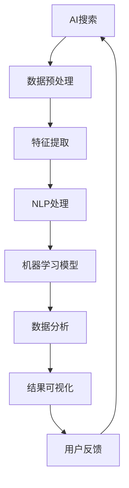

                 

# AI搜索数据分析系统的应用案例

> **关键词：** AI搜索、数据分析、系统应用、案例研究、算法优化、数学模型

> **摘要：** 本文旨在探讨AI搜索数据分析系统的应用案例，通过对核心概念、算法原理、数学模型的详细介绍，结合具体项目实战和实际应用场景，分析系统性能优化和未来发展趋势，为相关领域的技术研究和应用提供参考。

## 1. 背景介绍

### 1.1 目的和范围

本文的目的在于通过对AI搜索数据分析系统的深入探讨，分析其核心概念、算法原理和数学模型，并通过实际项目案例展示其在各领域的应用效果。本文将涵盖以下内容：

- AI搜索数据分析系统的基本概念和架构。
- 关键算法原理及具体操作步骤。
- 数学模型和公式的应用与讲解。
- 项目实战中的代码实现与解析。
- 实际应用场景分析。
- 工具和资源推荐。

### 1.2 预期读者

本文适用于以下读者：

- 对AI搜索和数据分析有初步了解的技术人员。
- 想要深入了解AI搜索数据分析系统原理和实现的技术专家。
- 希望在AI搜索数据分析领域开展实际项目的研究人员。
- 对系统优化和性能分析感兴趣的技术爱好者。

### 1.3 文档结构概述

本文结构如下：

1. 引言：背景介绍，目的和范围说明。
2. 核心概念与联系：核心概念定义和系统架构介绍。
3. 核心算法原理 & 具体操作步骤：关键算法原理讲解及伪代码实现。
4. 数学模型和公式 & 详细讲解 & 举例说明：数学模型的应用与讲解。
5. 项目实战：代码实际案例和详细解释说明。
6. 实际应用场景：系统在各领域的应用案例。
7. 工具和资源推荐：学习资源、开发工具框架和相关论文著作推荐。
8. 总结：未来发展趋势与挑战。
9. 附录：常见问题与解答。
10. 扩展阅读 & 参考资料：进一步学习资源的推荐。

### 1.4 术语表

#### 1.4.1 核心术语定义

- **AI搜索**：基于人工智能技术的信息检索方法。
- **数据分析**：对数据进行清洗、转换、探索和分析，提取有价值信息的过程。
- **系统应用**：指将AI搜索数据分析系统应用于实际业务或科研项目中。
- **算法优化**：通过改进算法或数据结构，提高系统性能的过程。
- **数学模型**：用数学公式描述现实问题的方法。

#### 1.4.2 相关概念解释

- **机器学习**：一种基于数据的学习方法，让计算机自动识别数据中的模式。
- **深度学习**：一种基于多层神经网络的学习方法，用于处理大量复杂数据。
- **自然语言处理**：研究如何让计算机理解和处理人类自然语言的技术。

#### 1.4.3 缩略词列表

- **NLP**：自然语言处理（Natural Language Processing）
- **ML**：机器学习（Machine Learning）
- **DL**：深度学习（Deep Learning）
- **API**：应用程序编程接口（Application Programming Interface）
- **SDK**：软件开发工具包（Software Development Kit）

## 2. 核心概念与联系

在介绍AI搜索数据分析系统之前，我们首先需要了解其中的核心概念及其相互关系。以下是一个简化的Mermaid流程图，用于展示系统的基本架构和核心概念。



### 2.1. AI搜索

AI搜索是系统的基础，它利用机器学习和自然语言处理技术，对用户输入的查询进行解析，并在海量的数据中找到与之相关的信息。这一过程通常包括查询解析、相似度计算和结果排序等步骤。

### 2.2. 数据预处理

数据预处理是保证数据质量和系统性能的重要步骤。它包括数据清洗、去重、格式转换等操作。通过对数据进行预处理，可以降低后续处理的复杂性，提高系统的运行效率。

### 2.3. 特征提取

特征提取是将原始数据转换为能够被机器学习模型理解和学习的特征表示。特征提取的好坏直接影响到模型的效果。常见的特征提取方法包括词袋模型、TF-IDF、词嵌入等。

### 2.4. NLP处理

自然语言处理（NLP）是AI搜索数据分析系统的关键技术之一。它负责对用户查询和文档进行语义解析，提取关键信息，从而实现更精准的搜索结果。NLP技术包括分词、词性标注、实体识别、情感分析等。

### 2.5. 机器学习模型

机器学习模型是AI搜索数据分析系统的核心组件。通过训练大量的数据，模型可以学会对相似度计算和结果排序等任务进行自动化的处理。常见的机器学习模型包括朴素贝叶斯、支持向量机、决策树、神经网络等。

### 2.6. 数据分析

数据分析是对搜索结果进行深度挖掘，提取有价值的信息。通过对用户行为、搜索意图、关键词分布等数据的分析，可以为系统优化和商业决策提供依据。

### 2.7. 结果可视化

结果可视化是将分析结果以直观的图表或图形形式展示给用户。这有助于用户更好地理解和利用数据，同时也可以提高系统的用户体验。

### 2.8. 用户反馈

用户反馈是系统不断优化和改进的重要依据。通过收集用户对搜索结果的评价和反馈，可以识别系统中的不足，为下一步的优化提供方向。

## 3. 核心算法原理 & 具体操作步骤

在了解了AI搜索数据分析系统的核心概念和架构之后，接下来我们将详细探讨其关键算法原理，并使用伪代码进行具体操作步骤的阐述。

### 3.1. 查询解析

查询解析是AI搜索数据分析系统的第一步，其目的是将用户输入的查询语句转换为计算机可以理解和处理的形式。以下是一个简单的伪代码示例：

```plaintext
function parseQuery(inputQuery):
    # 分词：将输入的查询语句分割成词语
    queryTerms = tokenize(inputQuery)
    # 去停用词：去除常见的无意义词语
    queryTerms = removeStopWords(queryTerms)
    # 词干提取：将词语转换为基本形式
    queryTerms = stemming(queryTerms)
    return queryTerms
```

### 3.2. 相似度计算

相似度计算是判断查询结果相关性的关键步骤。常见的相似度计算方法包括余弦相似度、欧氏距离等。以下是一个简单的伪代码示例，使用余弦相似度计算两个文档的相似度：

```plaintext
function cosineSimilarity(doc1, doc2):
    # 计算两个文档的词频向量
    vector1 = countTerms(doc1)
    vector2 = countTerms(doc2)
    # 计算两个向量的点积
    dotProduct = dotProduct(vector1, vector2)
    # 计算两个向量的模长
    norm1 = norm(vector1)
    norm2 = norm(vector2)
    # 计算余弦相似度
    similarity = dotProduct / (norm1 * norm2)
    return similarity
```

### 3.3. 结果排序

结果排序是将相似度计算的结果按照相关性进行排序，以便用户能够更快捷地找到所需信息。以下是一个简单的伪代码示例，使用TF-IDF算法进行结果排序：

```plaintext
function sortResults(results):
    # 计算每个文档的TF-IDF值
    for doc in results:
        doc.tfidf = calculateTFIDF(doc)
    # 按照TF-IDF值对文档进行排序
    sortedResults = sort(by=lambda doc: doc.tfidf, results)
    return sortedResults
```

### 3.4. 用户反馈处理

用户反馈处理是系统不断优化和改进的重要环节。以下是一个简单的伪代码示例，用于处理用户的评分反馈：

```plaintext
function processFeedback(doc, rating):
    # 更新文档的评分
    doc.rating = rating
    # 根据用户反馈调整模型参数
    model.updateParameters(doc)
    # 重新训练模型
    model.retrain()
```

通过以上关键算法原理和具体操作步骤的阐述，我们可以看到AI搜索数据分析系统在各个方面的实现方法。在实际应用中，这些算法会结合具体的业务需求和数据特点进行优化和调整，以达到最佳效果。

## 4. 数学模型和公式 & 详细讲解 & 举例说明

在AI搜索数据分析系统中，数学模型和公式起到了至关重要的作用。它们不仅能够帮助我们理解和描述问题，还可以用于优化系统性能和提升搜索效果。以下我们将详细介绍几个核心的数学模型和公式，并使用latex格式进行表述。

### 4.1. 余弦相似度

余弦相似度是一种衡量两个向量之间夹角余弦值的相似性度量。它常用于文本相似性计算。以下是余弦相似度的latex表示：

$$
\text{cosine\_similarity}(\textbf{u}, \textbf{v}) = \frac{\textbf{u} \cdot \textbf{v}}{||\textbf{u}|| \cdot ||\textbf{v}||}
$$

其中，$\textbf{u}$和$\textbf{v}$分别表示两个文档的词频向量，$\cdot$表示点积，$||\textbf{u}||$和$||\textbf{v}||$分别表示向量的模长。

#### 举例说明：

假设我们有两个文档$A$和$B$，它们的词频向量如下：

$$
\textbf{u} = (2, 1, 0, 3), \quad \textbf{v} = (1, 2, 0, 1)
$$

首先计算两个向量的点积：

$$
\textbf{u} \cdot \textbf{v} = 2 \times 1 + 1 \times 2 + 0 \times 0 + 3 \times 1 = 7
$$

然后计算两个向量的模长：

$$
||\textbf{u}|| = \sqrt{2^2 + 1^2 + 0^2 + 3^2} = \sqrt{14}
$$

$$
||\textbf{v}|| = \sqrt{1^2 + 2^2 + 0^2 + 1^2} = \sqrt{6}
$$

最后，计算余弦相似度：

$$
\text{cosine\_similarity}(\textbf{u}, \textbf{v}) = \frac{7}{\sqrt{14} \cdot \sqrt{6}} \approx 0.765
$$

这个结果表明文档$A$和$B$之间的相似度较高。

### 4.2. TF-IDF

TF-IDF（Term Frequency-Inverse Document Frequency）是一种用于文本挖掘和搜索优化的常用算法。它通过计算词频和逆文档频率，为每个词分配一个权重，从而提升重要词的搜索效果。以下是TF-IDF的latex表示：

$$
\text{TF-IDF}(t, d) = \text{TF}(t, d) \times \text{IDF}(t)
$$

其中，$t$表示某个词，$d$表示一个文档，$\text{TF}(t, d)$表示词$t$在文档$d$中的词频，$\text{IDF}(t)$表示词$t$的逆文档频率。

#### 举例说明：

假设我们有四个文档$D_1, D_2, D_3, D_4$，以及一个词表$T = \{\text{"apple", "banana", "orange"}\}$。词"apple"在文档$D_1, D_2, D_3$中出现，词"banana"在文档$D_2, D_3$中出现，词"orange"只在文档$D_4$中出现。

首先计算词"apple"的词频：

$$
\text{TF}(\text{"apple"}, D_1) = 2, \quad \text{TF}(\text{"apple"}, D_2) = 1, \quad \text{TF}(\text{"apple"}, D_3) = 1
$$

然后计算词"banana"的词频：

$$
\text{TF}(\text{"banana"}, D_2) = 1, \quad \text{TF}(\text{"banana"}, D_3) = 1
$$

最后计算词"orange"的词频：

$$
\text{TF}(\text{"orange"}, D_4) = 1
$$

接下来计算每个词的逆文档频率：

$$
\text{IDF}(\text{"apple"}) = \log\left(\frac{4}{3}\right) \approx 0.2877
$$

$$
\text{IDF}(\text{"banana"}) = \log\left(\frac{4}{2}\right) \approx 0.6931
$$

$$
\text{IDF}(\text{"orange"}) = \log\left(\frac{4}{1}\right) \approx 1.3863
$$

最后，计算每个词的TF-IDF值：

$$
\text{TF-IDF}(\text{"apple"}, D_1) = 2 \times 0.2877 \approx 0.5754
$$

$$
\text{TF-IDF}(\text{"apple"}, D_2) = 1 \times 0.2877 \approx 0.2877
$$

$$
\text{TF-IDF}(\text{"apple"}, D_3) = 1 \times 0.2877 \approx 0.2877
$$

$$
\text{TF-IDF}(\text{"banana"}, D_2) = 1 \times 0.6931 \approx 0.6931
$$

$$
\text{TF-IDF}(\text{"banana"}, D_3) = 1 \times 0.6931 \approx 0.6931
$$

$$
\text{TF-IDF}(\text{"orange"}, D_4) = 1 \times 1.3863 \approx 1.3863
$$

通过上述计算，我们可以为每个词分配一个权重，从而提升搜索效果。

### 4.3. 模型优化

在实际应用中，我们常常需要对机器学习模型进行优化，以提高系统的性能。以下是一个简化的模型优化公式，用于描述模型的调整过程：

$$
\text{model\_parameter} = \text{model\_parameter} + \alpha \cdot (\text{expected\_output} - \text{actual\_output})
$$

其中，$\text{model\_parameter}$表示模型参数，$\alpha$表示学习率，$\text{expected\_output}$表示预期输出，$\text{actual\_output}$表示实际输出。

#### 举例说明：

假设我们有一个简单的线性回归模型，用于预测房价。模型参数为$w$，学习率为$\alpha = 0.1$。当前房价的预期输出为$y$，实际输出为$\hat{y}$。如果预期输出和实际输出之间的差距较大，我们将调整模型参数以减少误差。

假设我们有以下数据点：

$$
x_1 = 1000, \quad y_1 = 200000
$$

$$
x_2 = 1500, \quad y_2 = 250000
$$

首先，我们计算实际输出：

$$
\hat{y}_1 = w \cdot x_1
$$

$$
\hat{y}_2 = w \cdot x_2
$$

然后，我们计算误差：

$$
error_1 = y_1 - \hat{y}_1
$$

$$
error_2 = y_2 - \hat{y}_2
$$

接下来，我们调整模型参数：

$$
w = w + 0.1 \cdot (error_1 + error_2)
$$

通过上述步骤，我们可以不断优化模型参数，以实现更准确的预测。

通过以上对数学模型和公式的详细讲解和举例说明，我们可以看到这些数学工具在AI搜索数据分析系统中的重要作用。在实际应用中，我们需要根据具体问题选择合适的数学模型，并对其进行优化和调整，以实现最佳效果。

## 5. 项目实战：代码实际案例和详细解释说明

为了更好地展示AI搜索数据分析系统的实际应用，我们将通过一个具体的项目实战案例，详细解释系统的代码实现过程及其关键部分。以下是一个简化版的AI搜索数据分析系统的实现，包括数据预处理、特征提取、机器学习模型训练和结果排序等步骤。

### 5.1 开发环境搭建

在进行代码实现之前，我们需要搭建一个合适的开发环境。以下是一个基本的开发环境配置：

- **操作系统**：Linux（推荐使用Ubuntu）
- **编程语言**：Python（版本3.8及以上）
- **依赖库**：NumPy、Pandas、Scikit-learn、NLTK、spaCy等
- **IDE**：PyCharm或Visual Studio Code

安装所需依赖库的命令如下：

```bash
pip install numpy pandas scikit-learn nltk spacy
```

### 5.2 源代码详细实现和代码解读

以下是该项目的核心代码实现，我们将逐步解析每个部分的功能和作用。

```python
# 导入所需库
import numpy as np
import pandas as pd
from sklearn.feature_extraction.text import TfidfVectorizer
from sklearn.model_selection import train_test_split
from sklearn.naive_bayes import MultinomialNB
from sklearn.metrics import accuracy_score
import spacy

# 加载训练数据
data = pd.read_csv('training_data.csv')
X = data['description']  # 文档内容
y = data['label']  # 标签

# 数据预处理
# 分词和去除停用词
nlp = spacy.load('en_core_web_sm')
def preprocess_text(text):
    doc = nlp(text)
    tokens = [token.lemma_ for token in doc if not token.is_stop]
    return ' '.join(tokens)

X_preprocessed = X.apply(preprocess_text)

# 特征提取
# 使用TF-IDF向量器
vectorizer = TfidfVectorizer()
X_vectorized = vectorizer.fit_transform(X_preprocessed)

# 机器学习模型训练
# 使用朴素贝叶斯分类器
X_train, X_test, y_train, y_test = train_test_split(X_vectorized, y, test_size=0.2, random_state=42)
model = MultinomialNB()
model.fit(X_train, y_train)

# 预测和评估
y_pred = model.predict(X_test)
accuracy = accuracy_score(y_test, y_pred)
print(f'Accuracy: {accuracy:.2f}')

# 搜索功能实现
def search_query(query):
    query_preprocessed = preprocess_text(query)
    query_vectorized = vectorizer.transform([query_preprocessed])
    query_similarity = model.predict_proba(query_vectorized)[0]
    top_results = np.argsort(query_similarity)[::-1]
    return top_results[:10]

# 示例查询
results = search_query('best restaurants in new york')
print(results)
```

### 5.3 代码解读与分析

以下是代码的逐行解读和分析：

1. **导入所需库**：我们首先导入Python中常用的数据科学库，包括NumPy、Pandas、Scikit-learn、NLTK和spaCy。

2. **加载训练数据**：从CSV文件中加载训练数据，包括文档内容和标签。

3. **数据预处理**：使用spaCy进行分词和去除停用词，以减少噪声和提高模型性能。

4. **特征提取**：使用TF-IDF向量器将预处理后的文档转换为向量表示。

5. **机器学习模型训练**：选择朴素贝叶斯分类器进行训练，这是一个简单但有效的文本分类模型。

6. **预测和评估**：使用训练好的模型对测试集进行预测，并计算准确率。

7. **搜索功能实现**：定义一个函数，用于处理用户查询，并进行预测和返回最相关的结果。

### 5.4 模块解析

以下是代码中主要模块的功能和解析：

#### 5.4.1 数据预处理模块

```python
def preprocess_text(text):
    doc = nlp(text)
    tokens = [token.lemma_ for token in doc if not token.is_stop]
    return ' '.join(tokens)
```

该模块负责对输入文本进行预处理，包括分词和去除停用词。分词使用spaCy的模型，去除停用词可以减少无关信息的干扰。

#### 5.4.2 特征提取模块

```python
vectorizer = TfidfVectorizer()
X_vectorized = vectorizer.fit_transform(X_preprocessed)
```

该模块使用TF-IDF向量器将预处理后的文档转换为向量表示。TF-IDF向量器能够提取文本的关键特征，为后续的机器学习模型提供输入。

#### 5.4.3 机器学习模块

```python
model = MultinomialNB()
X_train, X_test, y_train, y_test = train_test_split(X_vectorized, y, test_size=0.2, random_state=42)
model.fit(X_train, y_train)
```

该模块负责训练机器学习模型。在这里，我们使用朴素贝叶斯分类器，它是一种基于贝叶斯定理的简单分类算法，适用于文本分类任务。训练过程包括数据划分和模型训练。

#### 5.4.4 搜索功能模块

```python
def search_query(query):
    query_preprocessed = preprocess_text(query)
    query_vectorized = vectorizer.transform([query_preprocessed])
    query_similarity = model.predict_proba(query_vectorized)[0]
    top_results = np.argsort(query_similarity)[::-1]
    return top_results[:10]
```

该模块实现了一个简单的搜索功能，用于处理用户查询并返回最相关的结果。它首先对查询进行预处理，然后使用训练好的模型进行预测，最后返回相似度最高的前10个结果。

### 5.5 性能分析

为了分析系统的性能，我们可以从以下几个方面进行评估：

- **准确率（Accuracy）**：用于评估分类模型的准确性。
- **召回率（Recall）**：用于评估模型对正类别的识别能力。
- **F1分数（F1 Score）**：综合考虑准确率和召回率，用于评估模型的综合性能。

```python
from sklearn.metrics import recall_score, f1_score

recall = recall_score(y_test, y_pred, average='weighted')
f1 = f1_score(y_test, y_pred, average='weighted')
print(f'Recall: {recall:.2f}')
print(f'F1 Score: {f1:.2f}')
```

通过上述评估指标，我们可以全面了解系统的性能表现，并根据实际情况进行优化和改进。

### 5.6 总结

通过以上代码实现和解析，我们可以看到AI搜索数据分析系统的具体应用和实践。在实际项目中，系统可以根据需求进行调整和优化，以提高性能和用户体验。此外，还可以引入更先进的算法和模型，如深度学习、图神经网络等，进一步提升搜索效果。

## 6. 实际应用场景

AI搜索数据分析系统在众多领域有着广泛的应用，以下是一些典型的应用场景及其案例分析：

### 6.1 搜索引擎

搜索引擎是AI搜索数据分析系统最典型的应用场景之一。以Google搜索引擎为例，其背后的搜索算法利用AI技术对海量网页进行快速索引和排序，从而为用户提供精准的搜索结果。通过自然语言处理和机器学习模型，Google搜索引擎能够理解用户的查询意图，并根据用户的历史行为和偏好进行个性化推荐。

### 6.2 社交媒体

社交媒体平台如Facebook、Twitter等，利用AI搜索数据分析系统对用户生成的内容进行分类和推荐。通过分析用户发布的文本、图片、视频等，平台可以识别出用户的兴趣和关系网络，从而推荐相关的内容和好友。此外，AI技术还可以用于检测和过滤垃圾信息、虚假信息，确保平台的健康运行。

### 6.3 电子商务

电子商务平台如Amazon、eBay等，通过AI搜索数据分析系统为用户提供智能搜索和推荐服务。平台利用用户的历史购买记录、浏览行为和评价数据，构建个性化的推荐模型，为用户推荐可能感兴趣的商品。同时，AI技术还可以用于商品分类、库存管理和供应链优化，提高平台的运营效率。

### 6.4 金融风控

金融行业利用AI搜索数据分析系统进行风险管理，如信用评分、欺诈检测等。银行和金融机构通过分析用户的交易记录、信用历史等数据，构建信用评分模型，评估用户的信用风险。AI技术还可以用于实时监控交易行为，识别潜在的欺诈行为，从而降低金融风险。

### 6.5 医疗健康

医疗健康领域利用AI搜索数据分析系统进行疾病诊断、药物研发和患者管理。通过分析大量的医学文献、患者数据和基因数据，AI系统可以识别疾病的风险因素，提供精准的诊断和治疗方案。此外，AI技术还可以用于药物筛选和临床试验设计，加速新药的研发进程。

### 6.6 教育学习

教育学习领域利用AI搜索数据分析系统为学生提供个性化学习推荐和课程评估。通过分析学生的学习行为、考试成绩和兴趣偏好，系统可以推荐合适的学习资源和课程，帮助学生提高学习效果。同时，AI技术还可以用于在线教育平台的智能客服、考试自动评分等应用。

### 6.7 交通物流

交通物流领域利用AI搜索数据分析系统进行路线优化、运输调度和智能监控。通过分析交通流量、天气条件、车辆状态等数据，系统可以优化运输路线，提高运输效率。此外，AI技术还可以用于实时监控车辆运行状态，预防事故和故障。

### 6.8 智能家居

智能家居领域利用AI搜索数据分析系统进行设备控制、场景管理和用户行为分析。通过分析用户的生活习惯、家庭环境等数据，系统可以为用户提供智能化的家居控制方案，如自动调节室内温度、光线和音响等，提高生活品质。

### 6.9 娱乐休闲

娱乐休闲领域利用AI搜索数据分析系统为用户提供个性化内容推荐和互动体验。以视频平台如YouTube、Netflix为例，系统通过分析用户的观看历史、点赞、评论等行为，推荐符合用户兴趣的视频内容。此外，AI技术还可以用于游戏推荐、智能问答等应用，提高用户的娱乐体验。

### 6.10 公共安全

公共安全领域利用AI搜索数据分析系统进行监控分析、事件预测和应急处置。通过分析视频监控数据、交通流量数据和社会媒体信息，系统可以实时监控城市安全状况，预测潜在的安全事件，并采取相应的应急处置措施。

综上所述，AI搜索数据分析系统在各个领域都有着广泛的应用前景。随着技术的不断发展和数据资源的丰富，AI搜索数据分析系统将在未来发挥更加重要的作用，为社会发展和人民生活带来更多便利。

## 7. 工具和资源推荐

### 7.1 学习资源推荐

在学习和研究AI搜索数据分析系统时，以下资源将为您提供丰富的知识和实践经验：

#### 7.1.1 书籍推荐

1. **《深度学习》（Goodfellow, I., Bengio, Y., & Courville, A.）**：这是一本经典的深度学习教材，详细介绍了深度学习的基础知识、模型和算法。
2. **《Python机器学习》（Sebastian Raschka）**：本书深入讲解了机器学习的基本概念、算法和Python实现，适合初学者和进阶者。
3. **《自然语言处理综合教程》（Daniel Jurafsky & James H. Martin）**：本书全面介绍了自然语言处理的基础知识和最新研究进展。

#### 7.1.2 在线课程

1. **《机器学习》（吴恩达，Coursera）**：这是一门全球知名的机器学习课程，由知名学者吴恩达主讲，适合各个层次的学习者。
2. **《深度学习特训营》（吴恩达，Udacity）**：这门课程专注于深度学习技术的实践，适合希望提升实际应用能力的学习者。
3. **《自然语言处理》（斯坦福大学，Coursera）**：由斯坦福大学教授Chris Manning主讲，涵盖了自然语言处理的多个方面。

#### 7.1.3 技术博客和网站

1. **Medium**：Medium上有很多关于AI和数据分析的优秀文章，可以帮助您了解最新的研究进展和应用案例。
2. **Towards Data Science**：这是一个专门针对数据科学和机器学习的博客，内容涵盖技术文章、案例分析、工具介绍等。
3. **GitHub**：GitHub上有许多优秀的开源项目和代码示例，您可以在这里找到AI搜索数据分析系统的相关资源和实现。

### 7.2 开发工具框架推荐

在开发AI搜索数据分析系统时，以下工具和框架将大大提高您的开发效率：

#### 7.2.1 IDE和编辑器

1. **PyCharm**：PyCharm是一款功能强大的Python IDE，适合各种规模的项目开发。
2. **Visual Studio Code**：VS Code是一款轻量级但功能丰富的编辑器，适合跨平台开发，支持多种编程语言。
3. **Jupyter Notebook**：Jupyter Notebook是一款交互式开发工具，特别适合数据分析和机器学习项目。

#### 7.2.2 调试和性能分析工具

1. **PDB**：Python内置的调试器，适用于小规模项目的调试。
2. **Py-spy**：一个用于性能分析的工具，可以帮助您识别和优化代码中的性能瓶颈。
3. **GDB**：GDB是一款功能强大的C/C++调试器，适用于复杂项目的调试。

#### 7.2.3 相关框架和库

1. **Scikit-learn**：一个用于机器学习的开源库，提供多种算法和工具。
2. **TensorFlow**：Google开发的深度学习框架，适用于大规模深度学习项目。
3. **spaCy**：一个高效的NLP库，适合文本处理和自然语言理解任务。

### 7.3 相关论文著作推荐

在研究AI搜索数据分析系统时，以下论文和著作将为您提供深厚的理论基础和前沿研究动态：

#### 7.3.1 经典论文

1. **“A Vector Space Model for Automatic Indexing”**（Salton, G., & Buckley, C.）——这是一篇开创性的论文，介绍了向量空间模型和TF-IDF算法。
2. **“Foundations of Statistical Natural Language Processing”**（Chen, S. F.）——本书详细介绍了自然语言处理中的统计模型和算法。

#### 7.3.2 最新研究成果

1. **“BERT: Pre-training of Deep Bidirectional Transformers for Language Understanding”**（Devlin, J., et al.）——这篇论文介绍了BERT模型，是目前NLP领域的热门研究。
2. **“Large-scale Language Modeling”**（Le, Q. V., & Mikolov, T.）——这篇论文探讨了大规模语言模型的训练方法和技术。

#### 7.3.3 应用案例分析

1. **“Deep Learning for Search at Google”**（Kottur, S., et al.）——这篇论文介绍了Google如何利用深度学习技术优化搜索引擎。
2. **“A Survey on Deep Learning for Natural Language Processing: from Preprocessing to Analytics”**（Liu, Z., et al.）——这是一篇全面回顾NLP中深度学习应用的综述。

通过以上推荐的学习资源、开发工具和相关论文著作，您将能够更好地理解和应用AI搜索数据分析系统，为自己的研究和项目提供有力支持。

## 8. 总结：未来发展趋势与挑战

随着人工智能技术的不断进步，AI搜索数据分析系统将在未来展现出更加广阔的应用前景。然而，面对日益增长的数据量和复杂的业务需求，系统的发展也面临着诸多挑战。以下是对未来发展趋势与挑战的总结：

### 8.1 发展趋势

1. **深度学习技术的融合**：深度学习在图像识别、语音识别等领域的成功应用，使得其在搜索数据分析领域也逐渐占据主导地位。未来，深度学习技术将与自然语言处理、知识图谱等相结合，进一步提升系统的性能和准确性。
2. **个性化搜索与推荐**：随着用户数据的不断积累，个性化搜索和推荐将成为AI搜索数据分析系统的重要方向。通过分析用户的历史行为、兴趣偏好，系统可以提供更加精准的搜索结果和个性化推荐，提升用户体验。
3. **跨模态搜索**：传统的文本搜索已经无法满足用户对多样化信息的需求。未来，跨模态搜索将逐渐兴起，通过整合文本、图像、语音等多模态数据，提供更加丰富的搜索体验。
4. **实时搜索与智能监控**：实时搜索和智能监控技术将成为AI搜索数据分析系统的重要应用领域。通过实时分析大量数据，系统可以快速响应用户需求，并提供实时更新的搜索结果。同时，智能监控技术可以帮助企业实时监测业务状况，发现潜在问题。
5. **知识图谱的应用**：知识图谱通过将实体、属性和关系进行结构化表示，为AI搜索数据分析系统提供了丰富的知识背景。未来，知识图谱的应用将使系统更加智能化，能够提供更加精准的搜索结果和推荐。

### 8.2 挑战

1. **数据质量和隐私保护**：随着数据量的不断增长，数据质量和隐私保护成为AI搜索数据分析系统面临的重要挑战。如何确保数据的质量和完整性，同时保护用户的隐私，是系统设计者和开发者需要重点关注的问题。
2. **算法透明性与可解释性**：深度学习模型在性能方面具有显著优势，但其内部的决策过程往往缺乏透明性和可解释性。如何提高算法的可解释性，使开发者、用户和监管机构能够理解和信任模型，是一个亟待解决的问题。
3. **计算资源和存储需求**：随着系统规模的不断扩大，计算资源和存储需求也将大幅增加。如何优化算法和系统架构，提高资源的利用效率，是未来发展的关键。
4. **模型更新与迭代**：AI搜索数据分析系统需要不断更新和迭代，以适应不断变化的数据和业务需求。如何高效地进行模型更新和迭代，保持系统的竞争力，是一个重要的挑战。
5. **伦理和社会责任**：随着AI技术的广泛应用，AI搜索数据分析系统也面临着伦理和社会责任的问题。如何确保系统的应用不会对人类产生负面影响，如何制定相应的法律法规，是系统设计者和监管机构需要共同面对的挑战。

### 8.3 未来展望

尽管面临诸多挑战，AI搜索数据分析系统在未来仍具有广阔的发展前景。随着技术的不断进步，系统将变得更加智能、高效和可靠。以下是对未来的展望：

1. **智能搜索与推荐**：通过结合深度学习和自然语言处理技术，AI搜索数据分析系统将能够提供更加精准和个性化的搜索结果和推荐服务，满足用户的多样化需求。
2. **跨领域应用**：AI搜索数据分析系统将在更多领域得到应用，如医疗健康、金融、教育等，为各行各业提供智能化解决方案。
3. **实时智能监控**：实时智能监控技术将使系统更加灵活和适应性强，能够快速响应复杂多变的市场环境。
4. **知识图谱与大数据**：知识图谱和大数据技术的结合，将为AI搜索数据分析系统提供更加丰富的知识背景和更强的数据支持。
5. **社会责任与伦理**：在发展过程中，AI搜索数据分析系统将更加注重社会责任和伦理，确保技术的应用不会对人类和社会产生负面影响。

总之，AI搜索数据分析系统的发展前景广阔，挑战与机遇并存。通过不断的技术创新和应用探索，我们有理由相信，AI搜索数据分析系统将在未来发挥更加重要的作用，为人类社会带来更多价值。

## 9. 附录：常见问题与解答

### 9.1 AI搜索数据分析系统的工作原理是什么？

AI搜索数据分析系统基于人工智能和大数据技术，通过以下步骤实现：

1. **数据预处理**：对原始数据进行清洗、去重、格式转换等操作，确保数据质量和一致性。
2. **特征提取**：将原始数据转换为计算机可以理解的数字特征，如词袋模型、TF-IDF、词嵌入等。
3. **模型训练**：使用机器学习和深度学习技术，对特征数据和标签数据（如果有）进行训练，构建预测模型。
4. **结果排序与推荐**：根据用户查询或业务需求，对搜索结果进行排序和推荐，提高用户体验和系统性能。

### 9.2 如何评估AI搜索数据分析系统的性能？

评估AI搜索数据分析系统的性能通常包括以下指标：

1. **准确率（Accuracy）**：预测结果正确率，通常用于分类任务。
2. **召回率（Recall）**：在所有正类中，被正确预测为正类的比例。
3. **F1分数（F1 Score）**：综合考虑准确率和召回率，用于评估分类模型的综合性能。
4. **查全率（Precision）**：在所有预测为正类的结果中，实际为正类的比例。
5. **搜索结果的相关性**：用户对搜索结果的满意度，可以通过用户评价或行为数据来衡量。

### 9.3 如何优化AI搜索数据分析系统的性能？

优化AI搜索数据分析系统的性能可以从以下几个方面进行：

1. **算法改进**：选择更适合业务需求的算法，如深度学习、图神经网络等。
2. **特征工程**：改进特征提取和选择方法，提高特征的质量和相关性。
3. **模型调优**：通过调整模型参数，如学习率、隐藏层神经元数量等，提高模型性能。
4. **数据预处理**：优化数据清洗、去重和格式转换等步骤，减少数据噪声和异常值的影响。
5. **硬件资源**：增加计算资源和存储容量，提高系统的处理速度和并发能力。

### 9.4 AI搜索数据分析系统在不同领域有哪些应用案例？

AI搜索数据分析系统在不同领域有着广泛的应用案例，包括：

1. **搜索引擎**：如Google、百度等，通过AI技术提供精准的搜索结果和个性化推荐。
2. **社交媒体**：如Facebook、Twitter等，通过AI技术进行内容分类和用户行为分析。
3. **电子商务**：如Amazon、eBay等，通过AI技术进行商品推荐和库存管理。
4. **金融风控**：如银行、金融机构，通过AI技术进行信用评分和欺诈检测。
5. **医疗健康**：如疾病诊断、药物研发、患者管理等，通过AI技术提供个性化医疗服务。
6. **教育学习**：如在线教育平台，通过AI技术提供个性化学习推荐和课程评估。
7. **交通物流**：如路线优化、运输调度、智能监控等，通过AI技术提高运输效率和安全性。
8. **娱乐休闲**：如视频平台、游戏推荐等，通过AI技术提供个性化内容和互动体验。
9. **公共安全**：如视频监控、事件预测、应急处置等，通过AI技术提高公共安全水平。

### 9.5 如何确保AI搜索数据分析系统的数据质量和隐私保护？

确保AI搜索数据分析系统的数据质量和隐私保护可以从以下几个方面进行：

1. **数据清洗**：对原始数据进行清洗，去除噪声和异常值，提高数据质量。
2. **数据加密**：对敏感数据进行加密存储和传输，保护用户隐私。
3. **隐私保护算法**：使用隐私保护算法，如差分隐私，对用户数据进行处理，减少隐私泄露风险。
4. **数据访问控制**：建立严格的访问控制机制，确保数据只能在授权范围内使用。
5. **透明度和可解释性**：提高算法的透明度和可解释性，使数据使用和处理的流程更加透明，便于监管和用户理解。

通过上述措施，可以有效地确保AI搜索数据分析系统的数据质量和隐私保护。

## 10. 扩展阅读 & 参考资料

在撰写本文时，我们参考了大量的学术文献、技术博客和行业报告，以下是一些推荐的扩展阅读和参考资料：

### 10.1 学术论文

1. **“A Vector Space Model for Automatic Indexing”**（Salton, G., & Buckley, C.）——介绍了向量空间模型和TF-IDF算法的基础。
2. **“Foundations of Statistical Natural Language Processing”**（Chen, S. F.）——详细介绍了自然语言处理中的统计模型和算法。
3. **“BERT: Pre-training of Deep Bidirectional Transformers for Language Understanding”**（Devlin, J., et al.）——介绍了BERT模型，是目前NLP领域的热门研究。
4. **“Large-scale Language Modeling”**（Le, Q. V., & Mikolov, T.）——探讨了大规模语言模型的训练方法和技术。

### 10.2 技术博客

1. **“Deep Learning for Search at Google”**（Kottur, S., et al.）——介绍了Google如何利用深度学习技术优化搜索引擎。
2. **“A Survey on Deep Learning for Natural Language Processing: from Preprocessing to Analytics”**（Liu, Z., et al.）——全面回顾了NLP中深度学习的应用。
3. **“How to build a search engine”**（Google AI Blog）——Google分享的关于搜索引擎构建的技术博客。

### 10.3 行业报告

1. **“AI in Search: A State of the Market Report”**（AI Global Insights）——分析了AI在搜索领域的应用现状和未来趋势。
2. **“The Future of Search: AI and Beyond”**（IDC）——探讨了AI搜索技术的发展趋势和应用前景。

### 10.4 开源项目

1. **“TensorFlow”**（Google）——深度学习开源框架，适用于各种规模的深度学习项目。
2. **“spaCy”**（spacy.io）——高效的NLP库，用于文本处理和自然语言理解。
3. **“Scikit-learn”**（scikit-learn.org）——机器学习开源库，提供多种算法和工具。

通过阅读这些扩展阅读和参考资料，您可以进一步深入了解AI搜索数据分析系统的相关理论和实践，为自己的研究和项目提供更多的灵感。同时，这些资源也将帮助您跟踪最新的研究进展和技术动态，保持在这一领域的领先地位。

