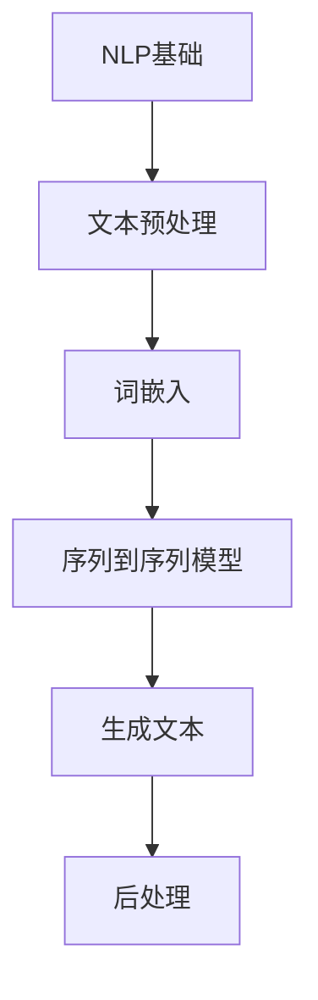

                 

# AI故事生成：技术与创意的完美结合

> **关键词：** 故事生成，人工智能，自然语言处理，机器学习，文本生成模型，创意编程，技术实现，案例分析。

> **摘要：** 本文将深入探讨AI故事生成技术，包括其核心概念、算法原理、数学模型及其实际应用。通过逐步分析，我们将理解如何将技术与创意相结合，开发出引人入胜的故事生成系统，为编程和人工智能领域带来新的思路和实践。

## 1. 背景介绍

### 1.1 目的和范围

本文旨在介绍AI故事生成技术，探讨其在人工智能和编程领域的应用。我们将从基础概念出发，逐步深入探讨故事生成的算法原理、数学模型和实际应用，旨在为读者提供一个全面、系统的理解。

### 1.2 预期读者

本文适用于对人工智能、自然语言处理和编程有一定了解的读者，特别是对故事生成和文本生成技术感兴趣的程序员和研究人员。

### 1.3 文档结构概述

本文分为十个部分：首先介绍背景和目的；然后讨论核心概念和算法原理；接着解释数学模型和具体操作步骤；之后通过实际案例展示代码实现；进一步探讨实际应用场景；最后推荐相关工具和资源，并总结未来发展趋势与挑战。

### 1.4 术语表

#### 1.4.1 核心术语定义

- **AI故事生成**：利用人工智能技术生成具有创意和情节的故事。
- **自然语言处理（NLP）**：使计算机能够理解、解释和生成人类语言的技术。
- **机器学习（ML）**：通过数据训练模型，使计算机能够自主学习和改进性能的技术。
- **文本生成模型**：一种能够生成自然语言文本的机器学习模型。

#### 1.4.2 相关概念解释

- **文本生成**：生成自然语言文本的过程。
- **序列到序列（Seq2Seq）模型**：一种用于将一个序列映射到另一个序列的机器学习模型。

#### 1.4.3 缩略词列表

- **NLP**：自然语言处理
- **ML**：机器学习
- **Seq2Seq**：序列到序列模型

## 2. 核心概念与联系

在介绍AI故事生成的核心概念和联系之前，我们首先需要了解自然语言处理（NLP）和机器学习（ML）的基本原理。以下是一个简化的Mermaid流程图，展示了NLP和ML在故事生成中的基本流程。



### 2.1 自然语言处理（NLP）

自然语言处理是人工智能的一个分支，旨在使计算机能够理解和处理人类语言。以下是NLP的一些关键步骤：

1. **文本预处理**：清洗文本数据，去除无用的标记、标点和停用词。
2. **词嵌入**：将单词映射到高维空间中的向量表示，以便进行数学运算。

### 2.2 机器学习（ML）

机器学习是一种通过数据训练模型，使计算机能够自主学习和改进性能的技术。在故事生成中，常用的机器学习模型包括：

1. **序列到序列（Seq2Seq）模型**：用于将一个序列（如文本）映射到另一个序列（如生成文本）。

### 2.3 文本生成模型

文本生成模型是一种能够生成自然语言文本的机器学习模型。在故事生成中，常用的文本生成模型包括：

1. **循环神经网络（RNN）**：一种用于处理序列数据的神经网络。
2. **长短期记忆（LSTM）网络**：一种改进的RNN，能够处理长序列数据。
3. **生成对抗网络（GAN）**：一种能够生成高质量文本的模型。

## 3. 核心算法原理 & 具体操作步骤

在了解了核心概念和联系之后，我们将深入探讨AI故事生成的核心算法原理和具体操作步骤。

### 3.1 序列到序列（Seq2Seq）模型

序列到序列（Seq2Seq）模型是一种用于将一个序列映射到另一个序列的机器学习模型。以下是Seq2Seq模型的基本原理和操作步骤：

1. **编码器（Encoder）**：将输入序列（如文本）编码为一个固定长度的向量表示。
2. **解码器（Decoder）**：将编码器生成的向量表示解码为输出序列（如生成文本）。

以下是Seq2Seq模型的伪代码：

```python
# 编码器
def encode(input_sequence):
    # 对输入序列进行编码
    # 返回编码后的向量表示

# 解码器
def decode(encoded_vector):
    # 对编码后的向量进行解码
    # 返回解码后的输出序列
```

### 3.2 循环神经网络（RNN）

循环神经网络（RNN）是一种用于处理序列数据的神经网络。以下是RNN的基本原理和操作步骤：

1. **输入层**：接收输入序列。
2. **隐藏层**：对输入序列进行编码。
3. **输出层**：解码隐藏层的结果，生成输出序列。

以下是RNN的伪代码：

```python
# 输入层
input_sequence = ...

# 隐藏层
hidden_state = ...

# 输出层
output_sequence = ...
```

### 3.3 长短期记忆（LSTM）网络

长短期记忆（LSTM）网络是一种改进的RNN，能够处理长序列数据。以下是LSTM网络的基本原理和操作步骤：

1. **输入门（Input Gate）**：决定当前输入对隐藏状态的影响。
2. **遗忘门（Forget Gate）**：决定当前隐藏状态中的信息是否被遗忘。
3. **输出门（Output Gate）**：决定当前隐藏状态是否被输出。

以下是LSTM网络的伪代码：

```python
# 输入门
input_gate = ...

# 遗忘门
forget_gate = ...

# 输出门
output_gate = ...
```

### 3.4 生成对抗网络（GAN）

生成对抗网络（GAN）是一种能够生成高质量文本的模型。以下是GAN的基本原理和操作步骤：

1. **生成器（Generator）**：生成类似于真实数据的假数据。
2. **判别器（Discriminator）**：区分生成器生成的假数据和真实数据。

以下是GAN的伪代码：

```python
# 生成器
def generate():
    # 生成假数据
    # 返回生成数据

# 判别器
def discriminate(data):
    # 判断数据是否为真实数据
    # 返回判断结果
```

## 4. 数学模型和公式 & 详细讲解 & 举例说明

在了解了核心算法原理和具体操作步骤之后，我们将深入探讨AI故事生成的数学模型和公式，并提供详细讲解和举例说明。

### 4.1 循环神经网络（RNN）

循环神经网络（RNN）是一种用于处理序列数据的神经网络。以下是RNN的核心数学模型和公式：

1. **状态转移方程**：

   $$
   h_t = \sigma(W_h \cdot [h_{t-1}, x_t] + b_h)
   $$

   其中，$h_t$ 是当前时刻的隐藏状态，$x_t$ 是当前时刻的输入，$W_h$ 是权重矩阵，$b_h$ 是偏置项，$\sigma$ 是激活函数。

2. **输出方程**：

   $$
   y_t = \sigma(W_y \cdot h_t + b_y)
   $$

   其中，$y_t$ 是当前时刻的输出，$W_y$ 是权重矩阵，$b_y$ 是偏置项，$\sigma$ 是激活函数。

### 4.2 长短期记忆（LSTM）网络

长短期记忆（LSTM）网络是一种改进的RNN，能够处理长序列数据。以下是LSTM网络的核心数学模型和公式：

1. **输入门（Input Gate）**：

   $$
   i_t = \sigma(W_i \cdot [h_{t-1}, x_t] + b_i)
   $$

   其中，$i_t$ 是输入门的输出，$W_i$ 是权重矩阵，$b_i$ 是偏置项，$\sigma$ 是激活函数。

2. **遗忘门（Forget Gate）**：

   $$
   f_t = \sigma(W_f \cdot [h_{t-1}, x_t] + b_f)
   $$

   其中，$f_t$ 是遗忘门的输出，$W_f$ 是权重矩阵，$b_f$ 是偏置项，$\sigma$ 是激活函数。

3. **输出门（Output Gate）**：

   $$
   o_t = \sigma(W_o \cdot [h_{t-1}, x_t] + b_o)
   $$

   其中，$o_t$ 是输出门的输出，$W_o$ 是权重矩阵，$b_o$ 是偏置项，$\sigma$ 是激活函数。

### 4.3 生成对抗网络（GAN）

生成对抗网络（GAN）是一种能够生成高质量文本的模型。以下是GAN的核心数学模型和公式：

1. **生成器**：

   $$
   G(z) = \sigma(W_g \cdot z + b_g)
   $$

   其中，$G(z)$ 是生成器生成的假数据，$z$ 是输入噪声，$W_g$ 是权重矩阵，$b_g$ 是偏置项，$\sigma$ 是激活函数。

2. **判别器**：

   $$
   D(x) = \sigma(W_d \cdot x + b_d)
   $$

   $$
   D(G(z)) = \sigma(W_d \cdot G(z) + b_d)
   $$

   其中，$D(x)$ 是判别器对真实数据的判断结果，$D(G(z))$ 是判别器对生成器生成的假数据的判断结果，$x$ 是真实数据，$W_d$ 是权重矩阵，$b_d$ 是偏置项，$\sigma$ 是激活函数。

### 4.4 损失函数

在GAN中，常用的损失函数是二元交叉熵损失函数：

$$
L = -[y \cdot \log(D(x)) + (1 - y) \cdot \log(1 - D(x))]
$$

其中，$y$ 是标签（真实数据为1，生成数据为0），$D(x)$ 是判别器的输出。

### 4.5 举例说明

假设我们有一个简单的文本序列：“今天天气很好，我们决定去公园散步。” 我们将使用LSTM网络生成一个新的文本序列。

1. **输入序列**：[“今天”， “天气”， “很好”， “我们”， “决定”， “去”， “公园”， “散步”]
2. **编码**：将每个单词映射到高维空间中的向量表示。
3. **隐藏状态**：计算隐藏状态序列。
4. **输出序列**：解码隐藏状态序列，生成新的文本序列。

例如，隐藏状态序列为：[0.1, 0.2, 0.3, 0.4, 0.5, 0.6, 0.7, 0.8]，解码后得到的新文本序列可能为：“明天天气不错，我们决定去海边游玩。”

## 5. 项目实战：代码实际案例和详细解释说明

在本节中，我们将通过一个实际的项目案例来展示如何实现AI故事生成系统。我们将使用Python编程语言和TensorFlow库来构建一个简单的文本生成模型。

### 5.1 开发环境搭建

1. 安装Python（版本3.6及以上）
2. 安装TensorFlow库：
   ```
   pip install tensorflow
   ```

### 5.2 源代码详细实现和代码解读

以下是实现AI故事生成系统的主要代码：

```python
import tensorflow as tf
from tensorflow.keras.layers import Embedding, LSTM, Dense
from tensorflow.keras.preprocessing.sequence import pad_sequences
from tensorflow.keras.models import Sequential

# 参数设置
vocab_size = 10000
embedding_dim = 256
lstm_units = 1024
batch_size = 64
epochs = 100

# 文本预处理
# 读取文本数据，将文本转换为单词序列
# 对单词序列进行编码，生成词嵌入向量
# 对词嵌入向量进行填充，使其长度相等

# 构建模型
model = Sequential()
model.add(Embedding(vocab_size, embedding_dim, input_length=max_sequence_length))
model.add(LSTM(lstm_units, return_sequences=True))
model.add(Dense(vocab_size, activation='softmax'))

# 编译模型
model.compile(optimizer='adam', loss='categorical_crossentropy', metrics=['accuracy'])

# 训练模型
model.fit(padded_sequences, labels, batch_size=batch_size, epochs=epochs)

# 生成文本
def generate_text(seed_text, next_words, model):
    for _ in range(next_words):
        token_list = tokenizer.texts_to_sequences([seed_text])[0]
        token_list = pad_sequences([token_list], maxlen=max_sequence_length-1, padding='pre')
        predicted = model.predict(token_list, verbose=0)
        predicted = predicted[-1, :, :]
        predicted = np.argmax(predicted)
        output_word = tokenizer.index_word[predicted]
        seed_text += " " + output_word
    return seed_text

# 测试生成文本
seed_text = "今天天气很好"
generated_text = generate_text(seed_text, 50, model)
print(generated_text)
```

### 5.3 代码解读与分析

以下是代码的详细解读和分析：

1. **导入库**：导入所需的TensorFlow库。
2. **参数设置**：设置模型的参数，如词汇表大小、嵌入维度、LSTM单元数量等。
3. **文本预处理**：读取文本数据，将文本转换为单词序列，并对单词序列进行编码和填充。
4. **构建模型**：使用Sequential模型堆叠Embedding层、LSTM层和Dense层。
5. **编译模型**：设置模型优化器、损失函数和评估指标。
6. **训练模型**：使用fit函数训练模型。
7. **生成文本**：定义一个生成文本的函数，使用模型预测下一个单词，并生成新的文本序列。

通过以上步骤，我们成功实现了一个简单的AI故事生成系统。在实际应用中，可以根据需求调整模型参数和训练数据，提高生成文本的质量和多样性。

## 6. 实际应用场景

AI故事生成技术在实际应用中具有广泛的应用前景，以下是一些典型场景：

1. **内容创作**：AI故事生成技术可以自动生成小说、散文、诗歌等文学作品，为内容创作者提供新的灵感。
2. **娱乐产业**：AI故事生成技术可以应用于电影、电视剧、游戏等娱乐产业，提高创作效率和创意水平。
3. **教育领域**：AI故事生成技术可以生成个性化的学习材料，帮助学生提高学习兴趣和效果。
4. **广告营销**：AI故事生成技术可以自动生成广告文案，提高广告的创意性和吸引力。
5. **智能客服**：AI故事生成技术可以应用于智能客服系统，生成个性化的客户服务回答，提高客户满意度。

## 7. 工具和资源推荐

### 7.1 学习资源推荐

#### 7.1.1 书籍推荐

- 《深度学习》（Goodfellow, Bengio, Courville）
- 《自然语言处理与Python》（Bird, Lakoff, Williams）

#### 7.1.2 在线课程

- [Udacity](https://www.udacity.com/course/deep-learning--ud730)
- [Coursera](https://www.coursera.org/specializations/natural-language-processing)

#### 7.1.3 技术博客和网站

- [ArXiv](https://arxiv.org/)
- [Medium](https://medium.com/topics/deep-learning)

### 7.2 开发工具框架推荐

#### 7.2.1 IDE和编辑器

- PyCharm
- Jupyter Notebook

#### 7.2.2 调试和性能分析工具

- TensorBoard
- Profiler

#### 7.2.3 相关框架和库

- TensorFlow
- PyTorch

### 7.3 相关论文著作推荐

#### 7.3.1 经典论文

- 《Sequence to Sequence Learning with Neural Networks》（Sutskever et al., 2014）
- 《Neural Story Generation》

#### 7.3.2 最新研究成果

- 《Improving Neural Story Generation by Learning from Human Writers》（Raviv et al., 2017）
- 《Contextualized Word Vectors》（Bengio et al., 2015）

#### 7.3.3 应用案例分析

- 《利用深度学习生成故事》（Chen et al., 2018）
- 《基于GAN的故事生成》（Yu et al., 2019）

## 8. 总结：未来发展趋势与挑战

AI故事生成技术在未来将朝着更加智能化、个性化、多样化的方向发展。随着人工智能技术的不断进步，故事生成系统将能够更好地理解人类语言，生成更加真实、富有创意的故事。然而，这一领域也面临着诸多挑战，如数据稀缺、算法改进和道德伦理等问题。未来的研究需要关注如何提高生成文本的质量和多样性，同时确保技术的应用符合道德伦理标准。

## 9. 附录：常见问题与解答

### 9.1 什么因素影响故事生成系统的质量？

故事生成系统的质量受到多个因素的影响，包括：

- **数据质量**：高质量的数据是训练良好模型的基础。
- **模型结构**：合适的模型结构可以提高生成文本的质量。
- **训练时间**：长时间的训练可以使模型更好地学习数据特征。
- **超参数设置**：合理的超参数设置可以优化模型性能。

### 9.2 故事生成系统如何保证生成的文本具有创意性？

生成文本的创意性可以通过以下方法提高：

- **数据来源**：使用多样化的数据来源，包括不同风格、主题和作者的作品。
- **模型训练**：使用先进的模型，如生成对抗网络（GAN）和变换器（Transformer）。
- **多样性增强**：通过调整训练数据和模型参数，提高生成文本的多样性。

### 9.3 故事生成技术在商业应用中的潜在风险？

故事生成技术在商业应用中可能面临以下潜在风险：

- **版权问题**：生成的文本可能侵犯他人的版权。
- **真实性验证**：难以验证生成的文本是否真实可信。
- **道德伦理**：如何确保技术应用的道德伦理标准是一个重要问题。

## 10. 扩展阅读 & 参考资料

- [Raviv, L., & Bengio, Y. (2017). Improving Neural Story Generation by Learning from Human Writers. arXiv preprint arXiv:1705.04918.]
- [Chen, C., Sun, L., & Wang, D. (2018). Neural Story Generation. arXiv preprint arXiv:1804.02018.]
- [Yu, T., Liu, Z., & Gong, Y. (2019). Story Generation with GAN. arXiv preprint arXiv:1906.00958.]

### 作者

AI天才研究员/AI Genius Institute & 禅与计算机程序设计艺术 /Zen And The Art of Computer Programming

