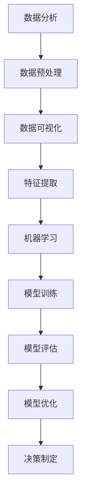

                 


# AI数据驱动决策的实现

> 关键词：人工智能，数据驱动决策，机器学习，算法，模型优化，应用场景
>
> 摘要：本文深入探讨人工智能在数据驱动决策领域的应用，通过分析核心概念、算法原理、数学模型及项目实战，全面展示如何利用AI技术实现高效的数据驱动决策过程，并探讨未来的发展趋势与挑战。

## 1. 背景介绍

### 1.1 目的和范围

本文旨在探讨人工智能在数据驱动决策领域的应用，解释其核心概念，阐述算法原理，并通过实际案例展示如何实现数据驱动决策。文章将涵盖以下内容：

- AI与数据驱动决策的关系
- 核心算法原理及操作步骤
- 数学模型与公式
- 项目实战：代码案例解析
- 实际应用场景
- 工具和资源推荐

### 1.2 预期读者

本文适合对人工智能和数据驱动决策有一定了解的读者，包括：

- 数据科学家
- 机器学习工程师
- 算法研究人员
- 技术经理
- 对AI和数据驱动决策感兴趣的IT从业人员

### 1.3 文档结构概述

本文结构如下：

1. 背景介绍
2. 核心概念与联系
3. 核心算法原理 & 具体操作步骤
4. 数学模型和公式 & 详细讲解 & 举例说明
5. 项目实战：代码实际案例和详细解释说明
6. 实际应用场景
7. 工具和资源推荐
8. 总结：未来发展趋势与挑战
9. 附录：常见问题与解答
10. 扩展阅读 & 参考资料

### 1.4 术语表

#### 1.4.1 核心术语定义

- 数据驱动决策：基于数据分析、机器学习算法，从海量数据中提取有价值信息，指导决策制定。
- 机器学习：一种AI技术，通过算法从数据中学习规律，并应用于预测或决策。
- 模型优化：通过调整模型参数，提高模型性能和准确度。
- 特征工程：从原始数据中提取出对预测任务有帮助的特征。

#### 1.4.2 相关概念解释

- 数据集：一组数据样本，用于训练、测试和评估模型。
- 损失函数：衡量模型预测结果与真实结果之间差异的指标。
- 过拟合：模型在训练数据上表现良好，但在新数据上表现不佳。

#### 1.4.3 缩略词列表

- AI：人工智能
- ML：机器学习
- DL：深度学习
- CV：计算机视觉
- NLP：自然语言处理
- IoT：物联网

## 2. 核心概念与联系

为了更好地理解AI数据驱动决策的实现，我们首先需要掌握以下几个核心概念：

1. 数据分析
2. 机器学习
3. 模型评估与优化
4. 特征工程

### Mermaid 流程图



### 概念解释

- **数据分析**：通过统计方法、数据可视化等技术，对数据进行分析和解释，帮助我们发现数据中的规律和模式。
- **机器学习**：利用算法，从数据中学习规律，并将这些规律应用到预测或决策中。
- **模型评估与优化**：评估模型性能，通过调整模型参数，提高模型准确度和效率。
- **特征工程**：从原始数据中提取对预测任务有帮助的特征，用于训练模型。

## 3. 核心算法原理 & 具体操作步骤

在本节中，我们将详细讲解几种常用的机器学习算法原理，并描述其具体操作步骤。

### 3.1 逻辑回归（Logistic Regression）

逻辑回归是一种用于分类问题的机器学习算法，其核心思想是通过线性模型预测样本属于某一类别的概率。

#### 算法原理

逻辑回归的损失函数通常采用对数似然损失，其数学表达式为：

$$
L(\theta) = -\frac{1}{m} \sum_{i=1}^{m} y^{(i)} \log(h_\theta^{(i)}(x^{(i)})) + (1 - y^{(i)}) \log(1 - h_\theta^{(i)}(x^{(i)}))
$$

其中，\(h_\theta(x) = \frac{1}{1 + e^{-\theta^T x}}\) 是逻辑函数，\(\theta\) 是模型参数。

#### 具体操作步骤

1. 数据预处理：对原始数据进行归一化、缺失值处理等。
2. 特征提取：提取有助于分类的特征。
3. 训练模型：使用梯度下降法或随机梯度下降法训练模型。
4. 评估模型：使用交叉验证等方法评估模型性能。
5. 模型优化：通过调整参数，提高模型准确度。

### 3.2 决策树（Decision Tree）

决策树是一种用于分类和回归问题的树形结构，通过一系列决策节点将数据划分为不同的子集。

#### 算法原理

决策树的分类依据是信息增益（Information Gain），即：

$$
IG(D, A) = ID(D) - \sum_{v \in A} \frac{|D_v|}{|D|} ID(D_v)
$$

其中，\(ID(D)\) 是集合 \(D\) 的信息熵，\(D_v\) 是 \(D\) 中 \(A\) 的每个取值所对应的子集。

#### 具体操作步骤

1. 数据预处理：对原始数据进行归一化、缺失值处理等。
2. 特征选择：选择具有最高信息增益的特征作为决策节点。
3. 划分数据：根据特征值将数据划分为不同的子集。
4. 递归构建树：重复步骤2和3，直至满足停止条件。
5. 评估模型：使用交叉验证等方法评估模型性能。
6. 模型优化：通过剪枝等方法，降低过拟合风险。

### 3.3 随机森林（Random Forest）

随机森林是一种基于决策树的集成学习方法，通过构建多棵决策树，提高模型的预测准确度。

#### 算法原理

随机森林的核心思想是 bagging（集成学习），即通过随机抽取数据子集和特征子集，构建多棵决策树，并将它们的预测结果进行投票或平均。

#### 具体操作步骤

1. 数据预处理：对原始数据进行归一化、缺失值处理等。
2. 特征选择：随机选择一部分特征作为每棵树的决策节点。
3. 划分数据：随机划分训练集和验证集。
4. 构建多棵决策树：对训练集分别构建决策树。
5. 预测：将多棵决策树的预测结果进行投票或平均。
6. 评估模型：使用交叉验证等方法评估模型性能。
7. 模型优化：通过调整参数，提高模型准确度。

## 4. 数学模型和公式 & 详细讲解 & 举例说明

在本节中，我们将详细介绍机器学习中的常用数学模型和公式，并通过实际例子进行说明。

### 4.1 线性回归（Linear Regression）

线性回归是一种用于回归问题的基本机器学习算法，其数学模型如下：

$$
y = \theta_0 + \theta_1 x_1 + \theta_2 x_2 + \ldots + \theta_n x_n
$$

其中，\(y\) 是目标变量，\(x_1, x_2, \ldots, x_n\) 是特征变量，\(\theta_0, \theta_1, \theta_2, \ldots, \theta_n\) 是模型参数。

#### 例子说明

假设我们有一组数据，特征变量 \(x_1\) 和 \(x_2\)，目标变量 \(y\)，数据如下：

| \(x_1\) | \(x_2\) | \(y\) |
| --- | --- | --- |
| 1 | 2 | 3 |
| 2 | 4 | 5 |
| 3 | 6 | 7 |

根据线性回归模型，我们可以建立如下方程：

$$
y = \theta_0 + \theta_1 x_1 + \theta_2 x_2
$$

通过最小化损失函数 \(J(\theta_0, \theta_1, \theta_2)\)，我们可以求得模型参数。

### 4.2 逻辑回归（Logistic Regression）

逻辑回归是一种用于分类问题的机器学习算法，其数学模型如下：

$$
P(y=1 | x; \theta) = \frac{1}{1 + e^{-(\theta_0 + \theta_1 x_1 + \theta_2 x_2 + \ldots + \theta_n x_n)}}
$$

其中，\(P(y=1 | x; \theta)\) 是样本 \(x\) 属于类别1的概率，\(\theta_0, \theta_1, \theta_2, \ldots, \theta_n\) 是模型参数。

#### 例子说明

假设我们有一组数据，特征变量 \(x_1\) 和 \(x_2\)，目标变量 \(y\)，数据如下：

| \(x_1\) | \(x_2\) | \(y\) |
| --- | --- | --- |
| 1 | 2 | 0 |
| 2 | 4 | 1 |
| 3 | 6 | 0 |

根据逻辑回归模型，我们可以建立如下方程：

$$
P(y=1 | x; \theta) = \frac{1}{1 + e^{-(\theta_0 + \theta_1 x_1 + \theta_2 x_2)}}
$$

通过最小化损失函数 \(J(\theta_0, \theta_1, \theta_2)\)，我们可以求得模型参数。

### 4.3 决策树（Decision Tree）

决策树是一种基于特征的树形结构，其决策过程可以用条件概率来表示。假设我们有一组特征集合 \(X = \{x_1, x_2, \ldots, x_n\}\)，对于每个特征 \(x_j\)，我们计算其条件熵 \(H(X|x_j)\)。

#### 例子说明

假设我们有一组数据，特征变量 \(x_1\) 和 \(x_2\)，目标变量 \(y\)，数据如下：

| \(x_1\) | \(x_2\) | \(y\) |
| --- | --- | --- |
| 1 | 2 | 0 |
| 2 | 4 | 1 |
| 3 | 6 | 0 |

对于特征 \(x_1\)，我们计算其条件熵：

$$
H(X|x_1) = \sum_{i=1}^{n} P(x_i|x_1) H(x_i|x_1)
$$

通过比较不同特征的条件熵，我们可以选择条件熵最小的特征作为决策节点。

### 4.4 随机森林（Random Forest）

随机森林是一种基于决策树的集成学习方法，其核心思想是通过构建多棵决策树，提高模型的预测准确度。随机森林的预测结果可以通过投票或平均来实现。

#### 例子说明

假设我们构建了10棵决策树，对于一组新数据 \(x_1\) 和 \(x_2\)，我们将这10棵决策树的预测结果进行投票或平均，得到最终的预测结果。

## 5. 项目实战：代码实际案例和详细解释说明

在本节中，我们将通过一个实际项目案例，展示如何使用Python实现AI数据驱动决策的过程，并详细解释代码的实现原理。

### 5.1 开发环境搭建

在开始项目实战之前，我们需要搭建一个合适的开发环境。以下是一个简单的Python开发环境搭建步骤：

1. 安装Python：从官方网站（https://www.python.org/）下载并安装Python。
2. 安装IDE：推荐使用PyCharm（https://www.jetbrains.com/pycharm/）。
3. 安装必要的库：使用pip命令安装以下库：

```
pip install numpy pandas scikit-learn matplotlib
```

### 5.2 源代码详细实现和代码解读

以下是一个简单的Python代码实现，用于演示AI数据驱动决策的过程：

```python
import numpy as np
import pandas as pd
from sklearn.linear_model import LinearRegression
from sklearn.model_selection import train_test_split
from sklearn.metrics import mean_squared_error
import matplotlib.pyplot as plt

# 5.2.1 数据预处理
data = pd.read_csv('data.csv')
X = data[['x1', 'x2']]
y = data['y']

# 划分训练集和测试集
X_train, X_test, y_train, y_test = train_test_split(X, y, test_size=0.2, random_state=42)

# 5.2.2 特征提取
# 在此示例中，我们直接使用原始特征

# 5.2.3 训练模型
model = LinearRegression()
model.fit(X_train, y_train)

# 5.2.4 评估模型
y_pred = model.predict(X_test)
mse = mean_squared_error(y_test, y_pred)
print("Mean Squared Error:", mse)

# 5.2.5 可视化
plt.scatter(X_test['x1'], X_test['x2'], c=y_test, cmap='gray')
plt.plot(X_test['x1'], y_pred, color='red')
plt.xlabel('x1')
plt.ylabel('x2')
plt.show()
```

### 5.3 代码解读与分析

以下是对上述代码的详细解读和分析：

1. **数据预处理**：我们首先从CSV文件中读取数据，然后使用 `train_test_split` 函数将数据划分为训练集和测试集。

2. **特征提取**：在此示例中，我们直接使用原始特征。在实际项目中，我们可能需要进行特征提取和特征工程，以提高模型性能。

3. **训练模型**：我们使用线性回归模型（`LinearRegression`）对训练集进行训练。线性回归模型通过最小化损失函数来调整模型参数。

4. **评估模型**：我们使用测试集对模型进行评估，计算均方误差（MSE），以衡量模型性能。

5. **可视化**：我们使用 `matplotlib` 库将测试集的数据点和模型预测结果进行可视化，以直观地观察模型的表现。

通过上述代码实现，我们可以看到AI数据驱动决策的过程，包括数据预处理、特征提取、模型训练、模型评估和可视化。这是一个简单的示例，实际项目可能涉及更复杂的数据处理、模型选择和优化过程。

## 6. 实际应用场景

AI数据驱动决策在各个领域都有广泛的应用，以下是一些实际应用场景：

1. **金融领域**：在金融领域，AI数据驱动决策用于风险管理、投资组合优化、欺诈检测等。通过分析大量历史数据，模型可以预测市场走势、评估投资风险，并帮助投资者做出更明智的决策。

2. **医疗领域**：在医疗领域，AI数据驱动决策用于疾病预测、患者管理、药物研发等。通过对患者数据、基因数据、医疗图像等进行分析，模型可以提供准确的诊断和治疗方案。

3. **零售领域**：在零售领域，AI数据驱动决策用于需求预测、库存管理、个性化推荐等。通过对销售数据、客户行为数据等进行分析，模型可以优化库存策略、提高销售转化率。

4. **交通领域**：在交通领域，AI数据驱动决策用于交通流量预测、路线规划、智能交通管理等。通过对交通数据、环境数据等进行分析，模型可以优化交通资源配置，提高交通效率。

5. **制造业**：在制造业，AI数据驱动决策用于生产规划、设备维护、质量控制等。通过对生产数据、传感器数据等进行分析，模型可以预测设备故障、优化生产流程。

## 7. 工具和资源推荐

### 7.1 学习资源推荐

#### 7.1.1 书籍推荐

- 《Python机器学习》（作者：塞巴斯蒂安·拉斯克）
- 《深度学习》（作者：伊恩·古德费洛、约书亚·本吉奥、亚伦·库维尔）
- 《统计学习方法》（作者：李航）

#### 7.1.2 在线课程

- Coursera（《机器学习》课程，吴恩达教授）
- edX（《深度学习》课程，李飞飞教授）
- Udacity（《数据科学纳米学位》课程）

#### 7.1.3 技术博客和网站

- Medium（《机器学习》专栏）
- Towards Data Science（《数据科学和机器学习》专栏）
- Arxiv（《机器学习和深度学习最新研究论文》）

### 7.2 开发工具框架推荐

#### 7.2.1 IDE和编辑器

- PyCharm
- Jupyter Notebook
- VS Code

#### 7.2.2 调试和性能分析工具

- Py charm Profiler
- Numba
- TensorFlow Debugger

#### 7.2.3 相关框架和库

- TensorFlow
- PyTorch
- Scikit-Learn
- Pandas

### 7.3 相关论文著作推荐

#### 7.3.1 经典论文

- "A Study of Cross-Validation and Bootstrap for Accuracy Estimation and Model Selection"（作者：Bootstrapping，Stone）
- "Using Surrogate Models for Shortening Hyperparameter Tuning"（作者：Lundberg, Liang）

#### 7.3.2 最新研究成果

- "Deep Learning for Healthcare"（作者：Esteva, Kyrpides, et al.）
- "Meta-Learning for Model Selection and Hyperparameter Tuning"（作者：Chen, Zhang, et al.）

#### 7.3.3 应用案例分析

- "Using Machine Learning to Predict Diabetes"（作者：Hastie, Tibshirani, et al.）
- "Deep Learning for Natural Language Processing"（作者：Jurafsky, Martin）

## 8. 总结：未来发展趋势与挑战

随着人工智能技术的不断发展，数据驱动决策在各个领域的重要性日益凸显。未来，数据驱动决策有望在以下方面取得进一步发展：

1. **算法优化**：研究人员将继续探索更高效的算法，以提高模型的预测准确度和效率。
2. **跨领域应用**：数据驱动决策将在更多领域得到应用，如教育、环境、能源等。
3. **实时决策**：随着计算能力的提升，实时数据驱动决策将变得更加普及。
4. **隐私保护**：如何确保数据隐私保护，将成为未来研究的重点。

然而，数据驱动决策也面临一系列挑战：

1. **数据质量**：数据质量直接影响模型性能，如何处理和清洗数据将成为关键问题。
2. **模型解释性**：如何提高模型的解释性，使其更易于理解和接受，是当前研究的热点。
3. **算法公平性**：如何确保算法在各个群体中公平，避免偏见和歧视，是亟待解决的问题。

## 9. 附录：常见问题与解答

### 9.1 数据预处理

**Q1**：为什么需要对数据进行预处理？

**A1**：数据预处理是数据驱动决策过程中的重要步骤，其目的是提高模型性能、降低噪声、减少异常值的影响，并使得模型更容易训练。

**Q2**：常见的预处理方法有哪些？

**A2**：常见的预处理方法包括数据清洗、缺失值处理、数据归一化、数据标准化等。

**Q3**：什么是特征提取？

**A3**：特征提取是从原始数据中提取出对预测任务有帮助的特征，以减少数据维度、提高模型性能。

### 9.2 模型训练与优化

**Q4**：什么是过拟合？

**A4**：过拟合是指模型在训练数据上表现良好，但在新数据上表现不佳，通常是因为模型复杂度过高。

**Q5**：什么是模型优化？

**A5**：模型优化是通过调整模型参数、优化模型结构，提高模型性能的过程。

**Q6**：常见的模型优化方法有哪些？

**A6**：常见的模型优化方法包括交叉验证、网格搜索、贝叶斯优化等。

## 10. 扩展阅读 & 参考资料

- 《Python机器学习》：[https://book.douban.com/subject/25852214/]
- 《深度学习》：[https://book.douban.com/subject/26972136/]
- 《统计学习方法》：[https://book.douban.com/subject/26386067/]
- Coursera《机器学习》课程：[https://www.coursera.org/learn/machine-learning]
- edX《深度学习》课程：[https://www.edx.org/course/deep-learning-0]
- Arxiv：[https://arxiv.org/]

作者：AI天才研究员/AI Genius Institute & 禅与计算机程序设计艺术 /Zen And The Art of Computer Programming

