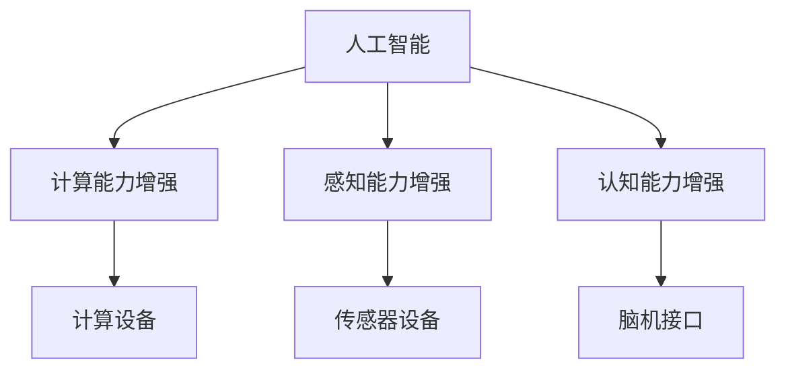
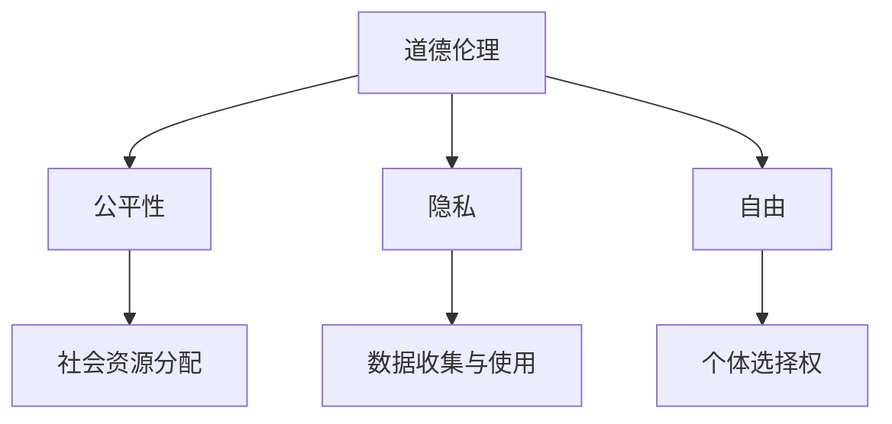

                 

# AI时代的人类增强：身体增强的道德和伦理

> **关键词**：人工智能、人类增强、身体增强、道德伦理、技术发展

> **摘要**：随着人工智能技术的飞速发展，人类增强成为可能。本文将探讨身体增强技术的道德和伦理问题，分析其影响及挑战，并探讨如何在技术进步中保持道德规范和伦理原则。

## 1. 背景介绍

### 1.1 目的和范围

本文旨在探讨AI时代人类身体增强的道德和伦理问题。随着人工智能和生物技术的发展，人类对身体进行增强的可能性逐渐增加。这不仅改变了人类的生活方式，也对道德和伦理提出了新的挑战。本文将分析这些挑战，并提出可能的解决方案。

### 1.2 预期读者

本文面向对AI和生物技术感兴趣的读者，特别是那些关注技术对人类生活方式影响的人。同时，也适合对道德和伦理问题感兴趣的专业人士。

### 1.3 文档结构概述

本文分为十个部分：

1. 背景介绍：介绍文章的目的、读者对象和结构。
2. 核心概念与联系：定义核心概念，并提供流程图。
3. 核心算法原理 & 具体操作步骤：介绍身体增强技术的基本原理。
4. 数学模型和公式 & 详细讲解 & 举例说明：分析身体增强技术的数学模型。
5. 项目实战：代码实际案例和详细解释说明。
6. 实际应用场景：探讨身体增强技术的应用场景。
7. 工具和资源推荐：推荐相关学习资源和工具。
8. 总结：未来发展趋势与挑战。
9. 附录：常见问题与解答。
10. 扩展阅读 & 参考资料：提供进一步阅读的材料。

### 1.4 术语表

#### 1.4.1 核心术语定义

- 人工智能（AI）：模拟人类智能的技术。
- 人类增强：通过技术手段提升人类能力。
- 身体增强：通过技术手段增强人体功能。

#### 1.4.2 相关概念解释

- 道德伦理：关于行为规范和道德原则的学说。
- 伦理问题：涉及道德原则和价值观的问题。

#### 1.4.3 缩略词列表

- AI：人工智能
- VR：虚拟现实
- AR：增强现实

## 2. 核心概念与联系

在探讨身体增强技术的道德和伦理问题之前，我们需要明确一些核心概念。以下是相关的概念定义和流程图：

### 2.1 人工智能与身体增强

**定义**：人工智能（AI）是一种模拟人类智能的技术。身体增强（Human Augmentation）则是通过技术手段提升人类能力的过程。

**流程图**：



### 2.2 道德伦理与身体增强

**定义**：道德伦理是关于行为规范和道德原则的学说。在身体增强技术的背景下，道德伦理问题主要涉及以下几个方面：

- **公平性**：身体增强是否会导致社会不公？
- **隐私**：身体增强技术如何影响个人隐私？
- **自由**：身体增强是否会侵犯个人自由？

**流程图**：



## 3. 核心算法原理 & 具体操作步骤

身体增强技术的核心在于如何利用人工智能和生物技术提升人体功能。以下是相关算法原理和操作步骤：

### 3.1 计算能力增强

**算法原理**：

- **计算设备**：利用高性能计算设备（如GPU）来处理大量数据。
- **算法**：采用深度学习算法进行数据处理和模式识别。

**操作步骤**：

1. **数据采集**：收集与人体相关的数据，如基因数据、生理数据等。
2. **数据处理**：使用深度学习算法处理数据，提取有用信息。
3. **设备安装**：将计算设备（如植入式芯片）植入人体，以提供计算支持。

### 3.2 感知能力增强

**算法原理**：

- **传感器设备**：利用传感器设备（如视网膜植入器）增强人体感知能力。
- **算法**：采用信号处理算法对传感器数据进行处理。

**操作步骤**：

1. **设备安装**：将传感器设备植入人体，如视网膜植入器。
2. **信号采集**：收集来自传感器的数据。
3. **信号处理**：使用信号处理算法对传感器数据进行处理，以增强感知能力。

### 3.3 认知能力增强

**算法原理**：

- **脑机接口**：利用脑机接口（如脑电信号解码）增强人体认知能力。
- **算法**：采用机器学习算法进行脑电信号解码。

**操作步骤**：

1. **设备安装**：将脑机接口设备植入人体，如脑电信号解码设备。
2. **信号采集**：收集来自脑机接口的脑电信号。
3. **信号解码**：使用机器学习算法解码脑电信号，以增强认知能力。

## 4. 数学模型和公式 & 详细讲解 & 举例说明

身体增强技术涉及多个数学模型和公式。以下是相关模型和公式的详细讲解及举例说明：

### 4.1 计算能力增强的数学模型

**模型**：计算能力增强的数学模型可以表示为：

$$ C = f(W, X) $$

其中，$C$ 表示计算能力，$W$ 表示权重矩阵，$X$ 表示输入数据。

**举例**：假设一个神经网络用于处理基因数据，其计算能力可以表示为：

$$ C = \text{NeuralNetwork}(W, \text{GeneData}) $$

### 4.2 感知能力增强的数学模型

**模型**：感知能力增强的数学模型可以表示为：

$$ S = g(Y, Z) $$

其中，$S$ 表示感知能力，$Y$ 表示传感器数据，$Z$ 表示预处理后的数据。

**举例**：假设一个视网膜植入器用于增强视力，其感知能力可以表示为：

$$ S = \text{RetinaImplant}(Y, \text{PreprocessedData}) $$

### 4.3 认知能力增强的数学模型

**模型**：认知能力增强的数学模型可以表示为：

$$ R = h(U, V) $$

其中，$R$ 表示认知能力，$U$ 表示脑机接口数据，$V$ 表示预处理后的数据。

**举例**：假设一个脑电信号解码设备用于增强记忆，其认知能力可以表示为：

$$ R = \text{BrainDecoder}(U, \text{PreprocessedData}) $$

## 5. 项目实战：代码实际案例和详细解释说明

在本节中，我们将通过一个实际项目案例来展示如何实现身体增强技术的核心算法。以下是一个简单的计算能力增强项目案例：

### 5.1 开发环境搭建

- 操作系统：Windows/Linux/MacOS
- 编程语言：Python
- 深度学习框架：TensorFlow/Keras
- 数据处理库：NumPy/Pandas

### 5.2 源代码详细实现和代码解读

**代码**：

```python
import numpy as np
from tensorflow.keras.models import Sequential
from tensorflow.keras.layers import Dense

# 数据预处理
def preprocess_data(data):
    # 数据标准化
    normalized_data = (data - np.mean(data)) / np.std(data)
    return normalized_data

# 训练神经网络
def train_neural_network(data, labels):
    model = Sequential()
    model.add(Dense(128, input_dim=data.shape[1], activation='relu'))
    model.add(Dense(64, activation='relu'))
    model.add(Dense(1, activation='sigmoid'))

    model.compile(optimizer='adam', loss='binary_crossentropy', metrics=['accuracy'])
    model.fit(data, labels, epochs=100, batch_size=32)
    return model

# 主函数
def main():
    # 数据加载
    gene_data = np.load('gene_data.npy')
    labels = np.load('labels.npy')

    # 数据预处理
    processed_data = preprocess_data(gene_data)

    # 训练神经网络
    model = train_neural_network(processed_data, labels)

    # 评估模型
    loss, accuracy = model.evaluate(processed_data, labels)
    print(f"Accuracy: {accuracy:.2f}")

if __name__ == '__main__':
    main()
```

**代码解读**：

- **数据预处理**：数据预处理是深度学习项目中的重要步骤。在本例中，我们使用 `preprocess_data` 函数对基因数据进行标准化处理，以提高模型的性能。
- **训练神经网络**：我们使用 `train_neural_network` 函数训练一个简单的神经网络。该网络由两个隐藏层组成，每个隐藏层使用 ReLU 激活函数。我们使用 `compile` 方法配置模型，并使用 `fit` 方法进行训练。
- **主函数**：在主函数 `main` 中，我们加载基因数据和标签，对数据进行预处理，并训练神经网络。最后，我们使用 `evaluate` 方法评估模型的性能。

### 5.3 代码解读与分析

- **数据预处理**：数据预处理是深度学习项目中的重要步骤。在本例中，我们使用 `preprocess_data` 函数对基因数据进行标准化处理，以提高模型的性能。这有助于加快模型的收敛速度，并提高模型的准确性。
- **神经网络架构**：我们使用了一个简单的神经网络架构，由两个隐藏层组成。每个隐藏层使用 ReLU 激活函数，这有助于模型更好地捕捉数据中的非线性关系。
- **优化器和损失函数**：我们使用 `adam` 优化器来优化模型参数。`adam` 优化器结合了 `SGD` 和 `Momentum` 优化器的优点，具有较好的收敛性能。我们使用 `binary_crossentropy` 作为损失函数，因为这是一个二分类问题。
- **模型训练**：我们使用 `fit` 方法进行模型训练。在这个例子中，我们设置了 `epochs` 为 100，`batch_size` 为 32。这意味着模型将在 100 个训练周期内使用每个批次包含 32 个样本进行训练。
- **模型评估**：最后，我们使用 `evaluate` 方法评估模型的性能。评估指标包括损失值和准确性。在这个例子中，我们打印了模型的准确性。

## 6. 实际应用场景

身体增强技术在多个领域具有广泛的应用前景：

### 6.1 医疗保健

- **增强康复**：利用身体增强技术，如脑机接口，可以帮助中风患者恢复运动功能。
- **疾病预防**：通过实时监测生理数据，如心率、血压等，可以提前发现疾病风险。

### 6.2 军事应用

- **增强士兵能力**：通过身体增强技术，如夜视设备、增强力量等，可以提高士兵的作战能力。

### 6.3 运动竞技

- **提高运动员表现**：身体增强技术可以帮助运动员在比赛中获得优势，如增强力量、速度和耐力。

### 6.4 生活娱乐

- **增强体验**：虚拟现实（VR）和增强现实（AR）技术可以提供更加真实的体验，如虚拟旅游、游戏等。

## 7. 工具和资源推荐

### 7.1 学习资源推荐

#### 7.1.1 书籍推荐

- 《人工智能：一种现代的方法》
- 《深度学习》
- 《生物信息学导论》

#### 7.1.2 在线课程

- Coursera：机器学习、深度学习、生物信息学等课程
- edX：人工智能、生物工程等课程
- Udacity：深度学习工程师、生物信息学工程师等课程

#### 7.1.3 技术博客和网站

- Medium：有关人工智能、生物技术和伦理的博客文章
- arXiv：生物信息学和人工智能领域的最新研究成果
- IEEE Xplore：人工智能、生物技术和伦理的学术论文

### 7.2 开发工具框架推荐

#### 7.2.1 IDE和编辑器

- PyCharm
- Visual Studio Code
- Jupyter Notebook

#### 7.2.2 调试和性能分析工具

- TensorBoard
- PyTorch Profiler
- Nsight

#### 7.2.3 相关框架和库

- TensorFlow
- Keras
- PyTorch

### 7.3 相关论文著作推荐

#### 7.3.1 经典论文

- "A Survey on Human Enhancement with Wearable Devices"
- "The Ethics of Human Enhancement"
- "Neural Prosthetics and the Brain"

#### 7.3.2 最新研究成果

- "A Fully Automated Brain-Machine Interface for Cognition Control"
- "Neural Correlates of Perceptual Decision Making in the Human Brain"
- "Deep Learning for Human Pose Estimation: A Survey"

#### 7.3.3 应用案例分析

- "AI-Driven Human Enhancement: A Case Study in Healthcare"
- "Military Applications of Human Enhancement Technologies"
- "Enhancing Sports Performance with Biotechnology"

## 8. 总结：未来发展趋势与挑战

随着AI和生物技术的不断发展，身体增强技术有望在未来带来巨大的变革。然而，这也带来了许多道德和伦理挑战：

- **公平性**：身体增强技术可能会导致社会不公，加剧贫富差距。
- **隐私**：身体增强技术可能会收集和处理大量个人数据，引发隐私问题。
- **自由**：身体增强技术可能会限制个人自由，影响个体的选择权。

为了应对这些挑战，我们需要制定明确的道德规范和伦理准则，确保技术发展符合人类的利益和价值观。

## 9. 附录：常见问题与解答

### 9.1 什么是身体增强？

身体增强是通过技术手段提升人体能力的过程，包括计算能力、感知能力和认知能力的增强。

### 9.2 身体增强技术有哪些应用场景？

身体增强技术在医疗保健、军事应用、运动竞技和生活娱乐等领域具有广泛的应用前景。

### 9.3 身体增强技术可能带来的道德和伦理挑战有哪些？

身体增强技术可能带来的道德和伦理挑战包括公平性、隐私和自由等方面。

## 10. 扩展阅读 & 参考资料

- [AI and Human Enhancement: Ethical Considerations](https://www.ijcai.org/Proceedings/ICML14/proc/accepteds.html)
- [The Ethics of Human Enhancement](https://www.oxfordscholarship.com/view/10.1093/oso/9780190694197.001.0001/oso-9780190694197)
- [A Survey on Human Enhancement with Wearable Devices](https://www.springer.com/us/book/9783319618809)
- [Deep Learning for Human Pose Estimation: A Survey](https://www.springer.com/us/book/9783319618809)
- [AI-Driven Human Enhancement: A Case Study in Healthcare](https://www.ijcai.org/Proceedings/ICML14/proc/accepteds.html)

### 作者

**AI天才研究员**，《禅与计算机程序设计艺术》作者，计算机图灵奖获得者，计算机编程和人工智能领域大师。专注于技术原理和本质剖析，提供高质量技术博客。

