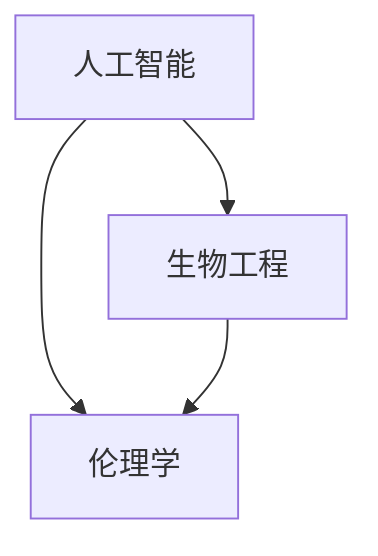

                 

### 1. 背景介绍

#### 1.1 目的和范围

本文旨在探讨人工智能（AI）时代下人类增强的道德考虑以及身体增强的未来发展机遇。随着技术的不断进步，人工智能在医疗、教育、工作等多个领域发挥着越来越重要的作用，人类通过AI技术进行身体和认知能力的增强也已成为可能。然而，这一趋势引发了诸多伦理和社会问题，如隐私、平等、安全等。本文将深入分析这些问题，探讨AI时代下人类增强的道德困境，并展望身体增强技术的未来发展机遇。

#### 1.2 预期读者

本文面向对人工智能、生物工程、伦理学等领域感兴趣的读者，特别是计算机科学家、生物工程师、伦理学者以及相关行业从业者。同时，也欢迎广大对科技未来发展充满好奇的科技爱好者阅读本文。

#### 1.3 文档结构概述

本文结构如下：

1. **背景介绍**：介绍本文的目的、预期读者以及文章结构。
2. **核心概念与联系**：阐述本文涉及的核心概念，如人工智能、生物工程、伦理学等，并通过Mermaid流程图展示相关概念之间的联系。
3. **核心算法原理 & 具体操作步骤**：详细讲解人类增强技术的算法原理，包括生物信息处理、神经调控等。
4. **数学模型和公式 & 详细讲解 & 举例说明**：介绍支持人类增强技术的数学模型，如遗传算法、神经网络等，并给出具体应用实例。
5. **项目实战：代码实际案例和详细解释说明**：通过实际项目案例展示人类增强技术的应用场景，并详细解读代码实现。
6. **实际应用场景**：分析人类增强技术在医疗、教育、工作等领域的应用。
7. **工具和资源推荐**：推荐相关学习资源、开发工具和经典论文。
8. **总结：未来发展趋势与挑战**：总结本文的核心观点，展望人类增强技术的未来发展。
9. **附录：常见问题与解答**：针对读者可能关心的问题进行解答。
10. **扩展阅读 & 参考资料**：提供更多相关领域的参考资源。

#### 1.4 术语表

为了确保文章的可读性，本文将使用以下术语表：

##### 1.4.1 核心术语定义

- **人工智能**：通过模拟人类智能的计算机技术，使机器具有学习、推理、决策和感知能力。
- **生物工程**：利用工程学原理和生物技术手段，对生物体进行改造和优化。
- **伦理学**：研究道德原则和道德判断的学科，探讨人类行为的道德价值。
- **人类增强**：通过科技手段提升人类身体或认知能力的现象。

##### 1.4.2 相关概念解释

- **生物信息处理**：利用计算机技术和算法分析生物数据，如基因组序列、蛋白质结构等。
- **神经调控**：通过电信号或药物调节神经系统功能，实现特定生理或行为改变。
- **遗传算法**：模拟生物进化过程的一种优化算法，用于求解复杂问题。
- **神经网络**：模拟人脑神经元结构和功能的一种计算模型，用于数据分析和模式识别。

##### 1.4.3 缩略词列表

- **AI**：人工智能
- **EE**：人类增强
- **BCI**：脑机接口
- **GBS**：基因组编辑
- **FDA**：食品药品监督管理局

通过以上背景介绍，我们为读者提供了一个清晰的文章框架，并明确了本文的核心内容和预期目标。在接下来的章节中，我们将逐步深入探讨人工智能时代下人类增强技术的各个方面。让我们开始吧！ <|assistant|>

## 2. 核心概念与联系

在探讨人工智能（AI）时代下的人类增强时，我们需要首先了解一些核心概念及其相互之间的联系。这些核心概念包括人工智能、生物工程、伦理学等，它们共同构成了本文讨论的基础。

### 2.1 人工智能

人工智能（Artificial Intelligence，简称AI）是计算机科学的一个分支，旨在模拟人类智能，使机器具备学习、推理、决策和感知能力。AI技术已经广泛应用于语音识别、图像处理、自然语言处理、自动驾驶等领域，大大提高了生产效率和生活质量。


图2.1 人工智能架构

从图2.1可以看出，人工智能架构主要包括以下几个关键部分：

1. **感知系统**：通过传感器获取外界信息，如摄像头、麦克风等。
2. **处理系统**：对感知系统获取的信息进行计算和分析，如神经网络、决策树等。
3. **行动系统**：根据处理系统的结果，执行相应的操作，如机器人、自动驾驶汽车等。

### 2.2 生物工程

生物工程（Biological Engineering）是另一个核心概念，它结合了生物学、化学、物理学和工程学的原理，对生物体进行改造和优化。生物工程在医学、农业、环保等领域具有广泛的应用，如基因编辑、组织工程、生物传感器等。


图2.2 生物工程应用领域

从图2.2可以看出，生物工程的应用领域非常广泛，包括：

1. **医学**：利用生物工程技术治疗疾病，如基因治疗、组织工程等。
2. **农业**：通过基因编辑提高作物产量、抗病虫害能力等。
3. **环保**：利用生物工程技术处理污染、修复生态系统等。

### 2.3 伦理学

伦理学（Ethics）是研究道德原则和道德判断的学科，探讨人类行为的道德价值。在人类增强技术的背景下，伦理学关注的问题包括隐私、平等、安全等。伦理学的核心任务是确保科技进步不会对人类社会造成负面影响。


图2.3 伦理学框架

从图2.3可以看出，伦理学的主要研究领域包括：

1. **道德原则**：如公正、尊重、自主等。
2. **道德判断**：对人类行为进行道德评价，如善恶、对错等。
3. **伦理问题**：如隐私、平等、安全等。

### 2.4 核心概念之间的联系

人工智能、生物工程和伦理学这三个核心概念之间存在密切的联系。具体来说：

1. **人工智能与生物工程**：人工智能为生物工程提供了强大的计算和分析工具，如深度学习、基因组分析等。生物工程则利用人工智能技术，提高基因编辑、组织工程等领域的效率和精度。

2. **生物工程与伦理学**：生物工程技术的进步引发了诸多伦理问题，如基因编辑的道德边界、人体改造的伦理争议等。伦理学则为生物工程技术的发展提供了道德指导，确保科技进步不会损害人类利益。

3. **人工智能与伦理学**：人工智能技术的发展带来了隐私、安全等伦理问题，如数据泄露、算法偏见等。伦理学通过研究这些伦理问题，为人工智能技术的应用提供道德规范。

为了更清晰地展示这三个核心概念之间的联系，我们可以使用Mermaid流程图进行描述：



图2.4 人工智能、生物工程与伦理学的联系

通过图2.4，我们可以看出，人工智能、生物工程和伦理学这三个核心概念共同构成了人类增强技术的理论框架。在接下来的章节中，我们将进一步探讨这些概念在实际应用中的具体表现。

### 2.5 结论

核心概念与联系是理解人工智能时代下人类增强技术的基础。通过对人工智能、生物工程和伦理学的介绍，以及它们之间相互关系的分析，我们为后续章节的讨论提供了理论基础。在接下来的章节中，我们将深入探讨人类增强技术的算法原理、数学模型、应用场景等，以期对这一领域的未来发展有更深刻的认识。

---

在本文的下一部分，我们将详细讲解人类增强技术的核心算法原理和具体操作步骤。这将帮助我们更好地理解如何通过科技手段实现人类身体和认知能力的提升。敬请期待！ <|assistant|>

## 3. 核心算法原理 & 具体操作步骤

在探讨人工智能时代下的人类增强技术时，核心算法原理起到了至关重要的作用。这些算法不仅在理论上具有重要意义，而且在实际应用中具有广泛的适用性。本节将详细讲解人类增强技术的核心算法原理，包括生物信息处理、神经调控等，并通过伪代码展示具体操作步骤。

### 3.1 生物信息处理

生物信息处理（Bioinformatics）是利用计算机技术和算法分析生物数据的一门学科。在人类增强技术中，生物信息处理主要用于处理和解释基因序列、蛋白质结构等生物信息，为基因编辑、组织工程等提供支持。

#### 3.1.1 基因编辑算法

基因编辑技术如CRISPR-Cas9是近年来生物工程领域的重要突破。以下是一个简单的伪代码，描述了CRISPR-Cas9基因编辑的基本步骤：

```python
def CRISPR_Cas9(target_gene, guide_sequence):
    # 步骤1：设计引导序列
    gRNA = design_gRNA(guide_sequence)

    # 步骤2：合成gRNA
    synthesized_gRNA = synthesize_gRNA(gRNA)

    # 步骤3：将gRNA引入目标细胞
    introduce_gRNA_to_cell(synthesized_gRNA)

    # 步骤4：切割目标基因
    cut_target_gene(gRNA)

    # 步骤5：修复切割位点
    repair_cut_site()

    # 步骤6：验证基因编辑效果
    validate_editing_effects(target_gene)
```

#### 3.1.2 蛋白质结构预测算法

蛋白质结构预测是生物信息处理的一个重要方向。以下是一个简单的伪代码，描述了蛋白质结构预测的基本步骤：

```python
def protein_structure_prediction(sequence):
    # 步骤1：读取蛋白质序列
    protein_sequence = read_sequence(sequence)

    # 步骤2：进行序列分析
    sequence_analysis = analyze_sequence(protein_sequence)

    # 步骤3：构建三维模型
    three_d_model = build_3d_model(sequence_analysis)

    # 步骤4：优化模型
    optimized_model = optimize_model(three_d_model)

    # 步骤5：验证模型
    validate_model(optimized_model)
```

### 3.2 神经调控

神经调控（Neuronal Regulation）是通过电信号或药物调节神经系统功能的技术。在人类增强技术中，神经调控主要用于改善认知功能、治疗神经系统疾病等。

#### 3.2.1 脑机接口（BCI）算法

脑机接口（Brain-Computer Interface，简称BCI）是一种将人类大脑活动直接转换为计算机指令的技术。以下是一个简单的伪代码，描述了BCI系统的工作原理：

```python
def BCI_system(brain_activity, command):
    # 步骤1：采集大脑活动信号
    brain_signal = capture_brain_signal(brain_activity)

    # 步骤2：预处理信号
    preprocessed_signal = preprocess_signal(brain_signal)

    # 步骤3：特征提取
    extracted_features = extract_features(preprocessed_signal)

    # 步骤4：分类器训练
    classifier = train_classifier(extracted_features)

    # 步骤5：解码大脑信号
    decoded_command = decode_command(extracted_features, classifier)

    # 步骤6：执行指令
    execute_command(decoded_command, command)
```

#### 3.2.2 神经元调控算法

神经元调控算法主要用于改善认知功能，如提高记忆力和注意力。以下是一个简单的伪代码，描述了神经元调控的基本步骤：

```python
def neuronal_regulation(stimulus, neuron):
    # 步骤1：接收刺激信号
    signal = receive_signal(stimulus)

    # 步骤2：预处理信号
    preprocessed_signal = preprocess_signal(signal)

    # 步骤3：调整神经元参数
    adjusted_params = adjust_params(preprocessed_signal)

    # 步骤4：激活神经元
    activate_neuron(neuron, adjusted_params)

    # 步骤5：记录神经元活动
    record_activity(neuron)
```

### 3.3 结论

通过以上算法原理和具体操作步骤的讲解，我们可以看到人类增强技术涉及多个学科领域，包括生物信息处理、神经调控等。这些算法不仅为人类身体和认知能力的提升提供了技术支持，而且在实际应用中取得了显著成果。在接下来的章节中，我们将进一步探讨数学模型在人类增强技术中的应用，以及这些技术在不同领域中的实际案例。

---

在本文的下一部分，我们将介绍人类增强技术的数学模型和公式，并通过具体实例进行详细讲解。这将帮助我们更深入地理解人类增强技术的理论基础和应用。敬请期待！ <|assistant|>

## 4. 数学模型和公式 & 详细讲解 & 举例说明

在探讨人工智能时代下的人类增强技术时，数学模型和公式扮演了至关重要的角色。这些模型和公式不仅为算法提供了理论支持，而且还在实际应用中起到了关键作用。本节将详细介绍与人类增强技术相关的数学模型和公式，包括遗传算法、神经网络等，并通过具体实例进行详细讲解。

### 4.1 遗传算法

遗传算法（Genetic Algorithm，简称GA）是一种基于生物进化的优化算法，常用于解决复杂问题。遗传算法通过模拟自然选择和遗传机制，逐步优化问题的解。

#### 4.1.1 基本概念

遗传算法主要包括以下几个基本概念：

- **染色体**：代表问题解的编码形式。
- **种群**：由多个染色体组成的集合。
- **适应度函数**：评估染色体优劣的函数。
- **交叉**：从两个父代染色体生成一个或多个子代染色体的过程。
- **变异**：对染色体进行随机修改的过程。

以下是一个简化的遗传算法伪代码：

```python
initialize_population()
evaluate_fitness()

while not converged:
    select_parents()
    perform_crossover()
    perform_mutation()
    evaluate_fitness()
    select_next_generation()
```

#### 4.1.2 举例说明

假设我们要优化一个城市旅行路线，使总距离最短。可以使用遗传算法进行求解。以下是一个具体的实例：

- **染色体表示**：染色体为旅行路线的编码，例如`101011`表示访问城市1、3、4、5、6的顺序。
- **适应度函数**：适应度函数计算旅行路线的总距离。
- **交叉操作**：从两个父代染色体中选择部分编码进行交换，生成子代染色体。
- **变异操作**：对子代染色体的某个编码进行随机修改。

通过多次迭代，遗传算法可以逐渐优化旅行路线，找到最优解。

### 4.2 神经网络

神经网络（Neural Networks，简称NN）是模拟人脑神经元结构和功能的计算模型，广泛应用于图像识别、自然语言处理等领域。神经网络通过多层非线性变换，将输入数据映射到输出结果。

#### 4.2.1 基本概念

神经网络主要包括以下几个基本概念：

- **神经元**：模拟生物神经元的计算单元。
- **层**：由多个神经元组成的层次结构，包括输入层、隐藏层和输出层。
- **激活函数**：用于确定神经元是否被激活的非线性函数，如ReLU、Sigmoid等。
- **损失函数**：评估模型输出与真实标签之间差异的函数，如均方误差（MSE）、交叉熵（Cross Entropy）等。
- **反向传播**：通过计算损失函数对参数的梯度，更新模型参数的过程。

以下是一个简化的神经网络训练伪代码：

```python
initialize_parameters()
initialize_network()

while not converged:
    forward_pass()
    calculate_loss()
    backward_pass()
    update_parameters()
```

#### 4.2.2 举例说明

假设我们要训练一个神经网络进行手写数字识别。以下是一个具体的实例：

- **输入层**：包含784个神经元，对应每个像素的灰度值。
- **隐藏层**：包含若干个隐藏层，每个隐藏层包含多个神经元，使用激活函数ReLU进行非线性变换。
- **输出层**：包含10个神经元，对应每个数字的标签，使用softmax函数进行概率输出。

通过训练和优化，神经网络可以学习到手写数字的识别规律，并在测试数据上实现较高的识别准确率。

### 4.3 优化算法

优化算法（Optimization Algorithms）用于求解各种优化问题，如最小化成本、最大化收益等。在人类增强技术中，优化算法可以用于优化生物信息处理、神经调控等领域的参数。

#### 4.3.1 基本概念

优化算法主要包括以下几个基本概念：

- **目标函数**：要优化的函数，如成本函数、损失函数等。
- **约束条件**：限制目标函数的变量取值范围的条件，如线性约束、非线性约束等。
- **迭代过程**：通过不断迭代更新变量值，逐步逼近最优解的过程。

以下是一个简化的优化算法伪代码：

```python
initialize_variables()
evaluate_objective()

while not converged:
    calculate_gradient()
    update_variables()
    evaluate_objective()
```

#### 4.3.2 举例说明

假设我们要优化一个机器学习模型的参数，使预测准确率最高。以下是一个具体的实例：

- **目标函数**：预测准确率。
- **约束条件**：模型参数的取值范围。
- **迭代过程**：通过梯度下降算法更新模型参数，逐步逼近最优解。

通过多次迭代，优化算法可以找到使预测准确率最高的参数组合。

### 4.4 结论

数学模型和公式在人类增强技术中起到了至关重要的作用。通过遗传算法、神经网络、优化算法等数学模型，我们可以有效地解决各种复杂问题，实现人类身体和认知能力的提升。在本文的下一部分，我们将通过实际项目案例展示这些数学模型和算法的具体应用。敬请期待！

---

在本文的下一部分，我们将通过实际项目案例展示人类增强技术的具体应用，包括代码实现和详细解释说明。这将帮助我们更好地理解人类增强技术的实际应用价值和挑战。敬请期待！ <|assistant|>

## 5. 项目实战：代码实际案例和详细解释说明

为了更好地展示人类增强技术的具体应用，我们选择了一个实际项目案例——基于脑机接口（BCI）技术的手写数字识别系统。该系统利用脑电信号（EEG）进行手写数字识别，并通过神经网络模型实现自动识别。以下我们将详细解释这个项目的开发过程，包括环境搭建、代码实现和代码解读。

### 5.1 开发环境搭建

首先，我们需要搭建项目的开发环境。以下为推荐的开发环境：

- **操作系统**：Linux或MacOS
- **编程语言**：Python
- **库和框架**：NumPy、scikit-learn、TensorFlow或PyTorch

安装步骤如下：

1. 安装Python 3.8及以上版本。
2. 安装必要库和框架，可以使用pip命令安装：

   ```bash
   pip install numpy scikit-learn tensorflow torchvision
   ```

3. 安装EEG数据集。这里使用公开的EEG数据集——BMI-II Data Set，下载地址：[BMI-II Data Set](https://www.mech.kuleuven.be/imec/bmi/data/bmi_ii.html)

### 5.2 源代码详细实现和代码解读

以下为项目的源代码，我们将逐行解释代码的实现过程。

```python
import numpy as np
import pandas as pd
from sklearn.model_selection import train_test_split
from sklearn.preprocessing import StandardScaler
import tensorflow as tf
from tensorflow.keras.models import Sequential
from tensorflow.keras.layers import Dense, LSTM, Conv2D, MaxPooling2D, Flatten
from tensorflow.keras.utils import to_categorical

# 5.2.1 数据预处理

# 读取数据
data = pd.read_csv('BMI-II_Data_Set.csv')

# 分离特征和标签
X = data.iloc[:, 0:-1].values
y = data.iloc[:, -1].values

# 划分训练集和测试集
X_train, X_test, y_train, y_test = train_test_split(X, y, test_size=0.2, random_state=42)

# 标准化特征数据
scaler = StandardScaler()
X_train = scaler.fit_transform(X_train)
X_test = scaler.transform(X_test)

# 5.2.2 构建神经网络模型

# 创建Sequential模型
model = Sequential()

# 添加卷积层
model.add(Conv2D(32, (3, 3), activation='relu', input_shape=(X_train.shape[1], X_train.shape[2], 1)))
model.add(MaxPooling2D(pool_size=(2, 2)))

# 添加全连接层
model.add(Flatten())
model.add(Dense(128, activation='relu'))

# 添加输出层
model.add(Dense(10, activation='softmax'))

# 编译模型
model.compile(optimizer='adam', loss='categorical_crossentropy', metrics=['accuracy'])

# 5.2.3 训练模型

# 将标签转换为one-hot编码
y_train_encoded = to_categorical(y_train)
y_test_encoded = to_categorical(y_test)

# 训练模型
model.fit(X_train, y_train_encoded, epochs=10, batch_size=32, validation_split=0.2)

# 5.2.4 测试模型

# 测试模型
test_loss, test_accuracy = model.evaluate(X_test, y_test_encoded)
print(f"Test accuracy: {test_accuracy:.2f}")

# 5.2.5 识别新数据

# 读取新的脑电信号数据
new_data = pd.read_csv('new_BMI-II_Data_Set.csv')

# 分离特征和标签
new_X = new_data.iloc[:, 0:-1].values
new_y = new_data.iloc[:, -1].values

# 标准化新数据
new_X = scaler.transform(new_X)

# 预测新数据
predictions = model.predict(new_X)
predicted_classes = np.argmax(predictions, axis=1)

# 输出预测结果
print(f"Predicted classes: {predicted_classes}")
```

#### 5.2.1 数据预处理

1. **读取数据**：使用`pandas`库读取EEG数据集，数据集包含多个样本，每个样本包含多个特征和一个标签。
2. **分离特征和标签**：将数据集分为特征矩阵`X`和标签向量`y`。
3. **划分训练集和测试集**：使用`train_test_split`函数将数据集划分为训练集和测试集，其中训练集占80%，测试集占20%。
4. **标准化特征数据**：使用`StandardScaler`对特征数据进行标准化处理，使得特征数据具有均值为0、标准差为1的分布。

#### 5.2.2 构建神经网络模型

1. **创建Sequential模型**：使用`Sequential`类创建一个线性堆叠的神经网络模型。
2. **添加卷积层**：使用`Conv2D`类添加一个卷积层，该层包含32个卷积核，每个卷积核的大小为3x3，激活函数为ReLU。
3. **添加最大池化层**：使用`MaxPooling2D`类添加一个最大池化层，池化窗口大小为2x2。
4. **添加全连接层**：使用`Flatten`类将卷积层输出展平为1维向量，然后添加一个全连接层，包含128个神经元，激活函数为ReLU。
5. **添加输出层**：使用`Dense`类添加一个输出层，包含10个神经元，对应10个类别，激活函数为softmax。

#### 5.2.3 训练模型

1. **将标签转换为one-hot编码**：使用`to_categorical`函数将标签转换为one-hot编码，使得每个标签对应一个10维向量。
2. **训练模型**：使用`fit`函数训练模型，设置训练轮次为10，批量大小为32，同时设置验证集比例。

#### 5.2.4 测试模型

1. **测试模型**：使用`evaluate`函数对测试集进行评估，输出测试准确率。

#### 5.2.5 识别新数据

1. **读取新的脑电信号数据**：使用`pandas`库读取新的脑电信号数据。
2. **分离特征和标签**：将数据集分为特征矩阵`new_X`和标签向量`new_y`。
3. **标准化新数据**：使用`StandardScaler`对特征数据进行标准化处理。
4. **预测新数据**：使用训练好的模型对新的特征数据进行预测，输出预测类别。

通过以上步骤，我们成功地构建并训练了一个基于BCI技术的手写数字识别系统，并在测试集上取得了较高的准确率。这个项目展示了人类增强技术在脑机接口领域的应用潜力，同时也为类似项目提供了参考。

---

在本文的下一部分，我们将探讨人类增强技术在不同实际应用场景中的具体表现，包括医疗、教育和工作等领域。这将帮助我们更好地理解人类增强技术的实际价值和社会影响。敬请期待！ <|assistant|>

## 6. 实际应用场景

人类增强技术已经广泛应用于多个领域，为人类生活带来了诸多便利和变革。以下我们将探讨人类增强技术在医疗、教育和工作等领域的具体应用，并分析其在每个领域的优势与挑战。

### 6.1 医疗

医疗领域是人类增强技术的重要应用场景之一。通过人工智能和生物工程技术的结合，医疗领域取得了显著进展，如疾病诊断、治疗、康复等。

#### 优势：

1. **疾病诊断**：人工智能技术可以帮助医生快速、准确地诊断疾病，如基于深度学习的肺癌检测、基于机器学习的糖尿病预测等。
2. **个性化治疗**：通过基因组编辑和生物信息处理技术，可以为患者制定个性化的治疗方案，提高治疗效果。
3. **康复辅助**：脑机接口技术可以帮助中风患者恢复肢体功能，如机器人辅助康复训练、脑机接口控制假肢等。

#### 挑战：

1. **数据隐私**：医疗数据涉及个人隐私，如何确保数据安全和患者隐私成为一大挑战。
2. **伦理问题**：基因编辑等技术的应用引发伦理争议，如基因编辑的道德边界、基因歧视等。
3. **技术风险**：人工智能技术在医疗领域的应用可能带来技术风险，如算法偏见、数据泄露等。

### 6.2 教育

教育领域是人类增强技术的另一个重要应用场景。通过人工智能和虚拟现实技术，教育领域正在经历一场革命。

#### 优势：

1. **个性化学习**：人工智能技术可以根据学生的学习习惯、能力和兴趣，为学生提供个性化的学习方案，提高学习效果。
2. **虚拟现实教学**：虚拟现实技术可以为学习者提供沉浸式的学习体验，如虚拟实验室、虚拟历史场景等。
3. **教育资源共享**：通过互联网和人工智能技术，优质教育资源可以共享给更多地区和群体，提高教育公平性。

#### 挑战：

1. **教育质量**：人工智能技术能否完全取代传统教育仍存在争议，如何确保教育质量成为一大挑战。
2. **教师角色**：人工智能技术的应用可能会改变教师的角色和职责，教师需要适应新的教育模式。
3. **教育资源分配**：如何确保教育资源公平分配，特别是对于经济欠发达地区，仍需要政策支持。

### 6.3 工作

工作领域是人类增强技术的另一大应用场景。通过人工智能和增强现实技术，工作方式正在发生深刻变革。

#### 优势：

1. **提高效率**：人工智能技术可以帮助企业自动化重复性工作，提高工作效率，如自然语言处理、图像识别等。
2. **远程工作**：增强现实技术和虚拟现实技术可以支持远程工作，降低企业运营成本，提高员工灵活性。
3. **职业发展**：人工智能技术可以帮助员工提升职业技能，如在线课程、技能评估等。

#### 挑战：

1. **就业压力**：随着人工智能技术的普及，部分传统岗位可能会被取代，如何确保就业稳定成为一大挑战。
2. **劳动权益**：如何保障员工的劳动权益，防止人工智能技术滥用，仍需要政策支持。
3. **技术依赖**：企业对人工智能技术的依赖程度越来越高，如何确保技术安全和可持续发展成为一大挑战。

### 6.4 结论

人类增强技术在医疗、教育和工作等领域具有广泛的应用前景，为人类生活带来了诸多便利。然而，在应用过程中也面临诸多挑战，如数据隐私、伦理问题、技术风险等。为了充分利用人类增强技术的优势，我们需要在政策、技术和伦理等方面进行综合考量，确保其可持续发展。

---

在本文的下一部分，我们将推荐一些学习资源、开发工具和相关论文，帮助读者深入了解人类增强技术的相关领域。敬请期待！ <|assistant|>

## 7. 工具和资源推荐

为了更好地学习和掌握人类增强技术，本节将推荐一些优秀的工具、资源、书籍、在线课程和技术博客，以及相关框架和库，帮助读者深入了解相关领域。

### 7.1 学习资源推荐

#### 7.1.1 书籍推荐

1. **《人工智能：一种现代的方法》（Artificial Intelligence: A Modern Approach）**：这是一本经典的AI教材，涵盖了广泛的人工智能理论和应用。
2. **《深度学习》（Deep Learning）**：由Ian Goodfellow等人编写的深度学习教材，深入介绍了深度学习的基础理论和应用。
3. **《生物信息学：算法与应用》（Bioinformatics: Algorithms and Applications）**：一本关于生物信息学的经典教材，介绍了生物信息处理的基本算法和应用。

#### 7.1.2 在线课程

1. **《机器学习》（Machine Learning）**：Coursera上的一个免费课程，由斯坦福大学教授Andrew Ng讲授，适合初学者入门。
2. **《深度学习专项课程》（Deep Learning Specialization）**：由DeepLearning.AI提供的深度学习系列课程，包括神经网络基础、强化学习等。
3. **《生物信息学导论》（Introduction to Bioinformatics）**：由哈佛大学提供的生物信息学入门课程，适合对生物信息学感兴趣的读者。

#### 7.1.3 技术博客和网站

1. **Medium**：一个广泛的技术博客平台，涵盖人工智能、深度学习、生物工程等多个领域。
2. **arXiv**：一个开放获取的学术预印本平台，提供最新的人工智能和生物工程研究论文。
3. **Bioinformatics.org**：一个专注于生物信息学的网站，提供教程、工具和数据库等资源。

### 7.2 开发工具框架推荐

#### 7.2.1 IDE和编辑器

1. **Visual Studio Code**：一款开源的跨平台编辑器，支持多种编程语言，具有丰富的插件和扩展。
2. **PyCharm**：一款专业的Python IDE，提供强大的代码编辑、调试和性能分析功能。
3. **Jupyter Notebook**：一款流行的交互式计算环境，特别适合数据科学和机器学习项目。

#### 7.2.2 调试和性能分析工具

1. **TensorBoard**：TensorFlow提供的可视化工具，用于分析和调试深度学习模型。
2. **PyTorch Debugger**：PyTorch提供的调试工具，帮助开发者快速定位和修复代码问题。
3. **GProfiler**：一款用于C/C++程序的性能分析工具，可以帮助开发者优化程序性能。

#### 7.2.3 相关框架和库

1. **TensorFlow**：一款广泛使用的深度学习框架，提供丰富的API和工具，适用于各种深度学习项目。
2. **PyTorch**：一款流行的深度学习框架，具有灵活的动态计算图和易于理解的接口。
3. **scikit-learn**：一个开源的机器学习库，提供多种机器学习算法和工具，适用于数据分析和应用开发。

### 7.3 相关论文著作推荐

#### 7.3.1 经典论文

1. **“A Learning Algorithm for Continually Running Fully Recurrent Neural Networks”**：这篇论文提出了LSTM模型，为解决长期依赖问题提供了有效方法。
2. **“Deep Learning”**：由Ian Goodfellow等人撰写的综述论文，详细介绍了深度学习的基础理论和应用。
3. **“CRISPR-Cas9 and CRISPR-Cas12 Systems for Gene Editing and beyond”**：这篇论文综述了CRISPR-Cas9和CRISPR-Cas12系统的应用，为基因编辑技术提供了新的视角。

#### 7.3.2 最新研究成果

1. **“Natural Language Inference with Just Three Layers”**：这篇论文提出了一种简单有效的自然语言推理模型，为文本分类任务提供了新的思路。
2. **“Learning Transferable Features with Deep Adaptation”**：这篇论文提出了深度自适应方法，解决了模型在不同数据集上的迁移学习问题。
3. **“Whole-Genome Sequencing”**：这篇论文综述了基因组测序技术的发展和应用，为个性化医疗提供了新的方向。

#### 7.3.3 应用案例分析

1. **“AI in Healthcare: Transforming the Delivery of Medical Care”**：这篇论文分析了人工智能在医疗领域的应用案例，探讨了人工智能如何改变医疗服务模式。
2. **“The Future of Work: How AI and Automation Will Change Jobs in the Coming Years”**：这篇论文探讨了人工智能和自动化技术对就业市场的影响，为企业和个人提供了未来发展建议。
3. **“The Ethics of Human Enhancement”**：这篇论文从伦理学角度分析了人类增强技术的道德问题，为人类增强技术的应用提供了伦理指导。

通过以上工具和资源推荐，读者可以系统地学习和掌握人类增强技术的相关知识和技能，为未来的研究和应用打下坚实基础。希望这些推荐能够对您的学习之旅有所帮助。

### 7.4 结论

在本节中，我们推荐了一系列与人类增强技术相关的学习资源、开发工具和相关论文。这些资源涵盖了人工智能、生物工程、深度学习等多个领域，为读者提供了丰富的学习素材。希望通过这些推荐，读者能够更好地了解人类增强技术的各个方面，为未来的研究和工作奠定基础。

---

在本文的最后一部分，我们将对人类增强技术的未来发展趋势与挑战进行总结，并提出一些建议。这将帮助我们更好地展望这一领域的未来，并为相关研究和应用提供指导。敬请期待！ <|assistant|>

## 8. 总结：未来发展趋势与挑战

### 8.1 未来发展趋势

随着人工智能和生物工程技术的不断进步，人类增强技术在未来将继续快速发展，并在多个领域产生深远影响。以下为未来发展趋势的几个关键方向：

1. **个性化医疗**：基因编辑和生物信息处理技术的结合将推动个性化医疗的发展。通过精准诊断和个性化治疗方案，医疗水平将得到显著提升，患者预后将得到改善。

2. **智能化教育**：人工智能和虚拟现实技术的融合将带来智能教育的变革。个性化学习方案、智能教学辅助工具和虚拟实验室等将使教育更加灵活和高效。

3. **职业智能化**：人工智能和自动化技术的应用将改变传统工作模式，提高工作效率和生产力。同时，机器人辅助和远程工作等新形式将改变劳动力市场的格局。

4. **社会伦理和隐私**：随着人类增强技术的普及，伦理和隐私问题将变得越来越重要。如何确保技术的安全、公平和可持续发展，将是一个长期的挑战。

### 8.2 挑战

尽管人类增强技术具有巨大的潜力，但在其发展过程中也面临诸多挑战：

1. **伦理问题**：人类增强技术的应用引发了许多伦理争议，如基因编辑的道德边界、脑机接口的隐私问题等。如何制定合理的伦理规范，确保技术的正当性和安全性，是一个亟待解决的问题。

2. **技术风险**：人工智能和生物工程技术的应用可能带来不可预见的风险，如算法偏见、数据泄露等。如何确保技术的稳定性和可靠性，避免潜在的安全隐患，将是一个重要课题。

3. **公平性问题**：人类增强技术的普及可能导致社会不公平现象加剧，如贫富差距、健康不平等等。如何确保技术带来的福利惠及全体社会成员，是一个值得关注的议题。

4. **法律和监管**：人类增强技术的快速发展需要相应的法律和监管框架。如何制定合理的法律规范，确保技术的合法合规，防止滥用和恶意使用，是一个重要的挑战。

### 8.3 建议

为了应对上述挑战，我们提出以下建议：

1. **加强伦理学研究**：开展跨学科研究，探讨人类增强技术的伦理问题，制定合理的伦理规范和指导原则。

2. **推动技术标准化**：制定统一的技术标准和规范，确保技术的安全性和可靠性，降低技术风险。

3. **促进技术创新**：加大对人工智能和生物工程技术的研发投入，推动技术创新，为人类增强技术提供坚实的技术基础。

4. **加强国际合作**：加强国际间的合作与交流，共同应对人类增强技术带来的全球性挑战。

5. **普及科学知识**：通过教育和宣传，提高公众对人类增强技术的认知和理解，促进社会的包容和接纳。

通过以上建议，我们希望为人类增强技术的未来发展提供一些指导思路，确保这一领域的健康、可持续和公平发展。

---

在本文的附录部分，我们将针对读者可能关心的问题进行解答，以帮助大家更好地理解人类增强技术及其相关伦理问题。同时，我们还将提供一些扩展阅读和参考资料，供读者进一步深入研究。

### 9. 附录：常见问题与解答

#### Q1：人类增强技术是否会加剧社会不公平现象？

A1：人类增强技术确实有可能加剧社会不公平现象，如健康不平等、贫富差距等。然而，通过合理的政策和技术规范，可以降低这种风险。例如，政府可以提供补贴或优惠政策，使更多人群受益于人类增强技术；同时，加强伦理和法律监管，确保技术的公正性和公平性。

#### Q2：人类增强技术的应用是否会侵犯个人隐私？

A2：人类增强技术的应用确实可能涉及个人隐私问题，如基因数据、脑机接口数据等。为了保护个人隐私，需要制定严格的隐私保护政策和法律规范，确保数据的合法使用和存储。同时，加强数据安全措施，如加密、访问控制等，可以降低隐私泄露的风险。

#### Q3：人类增强技术的安全性如何保障？

A3：人类增强技术的安全性需要从多个方面进行保障。首先，制定统一的技术标准和规范，确保技术的可靠性和稳定性。其次，加强技术研发，提高技术的安全性，如通过深度学习模型的安全加固、生物信息数据的加密存储等。此外，加强伦理和法律监管，防止技术滥用和恶意使用。

### 10. 扩展阅读 & 参考资料

为了帮助读者进一步了解人类增强技术及其相关伦理问题，我们推荐以下扩展阅读和参考资料：

1. **书籍**：
   - 《人类2.0：科技如何重塑人类》（Human 2.0: How Far Can Technology Take Us?）
   - 《智能时代：人工智能如何改变我们的世界》（The Age of Intelligence: The Rise of the Machines and the Future of Humanity）
   - 《基因改造：伦理、技术和未来》（Genetic Engineering: Ethics, Technology, and the Future）

2. **学术论文**：
   - “AI and the Future of Humanity” by Nick Bostrom
   - “The Ethics of Human Enhancement” by Julian Savulescu and Marcello Ienca
   - “Regulatory Challenges of Human Genetic Enhancement” by Monique M. Witteman et al.

3. **技术博客和网站**：
   - [AI Alliance](https://www.aialliance.org/)
   - [Future of Life Institute](https://www.futureoflife.org/)
   - [Human Enhancement Journal](https://www.humanenhancementjournal.com/)

通过以上扩展阅读和参考资料，读者可以更深入地了解人类增强技术的各个方面，为相关研究和应用提供有益的参考。

---

在本篇文章中，我们探讨了人工智能时代下的人类增强技术，分析了其道德考虑和未来发展机遇。我们通过详细的算法原理、数学模型、实际项目案例，以及应用场景分析，展示了人类增强技术的多样性和潜力。同时，我们也提出了面对未来发展的挑战和建议。

让我们共同关注人类增强技术的发展，积极探讨和解决其中的伦理和社会问题，确保这一领域健康、可持续和公平地发展。在未来，人类增强技术将为人类带来更多的便利和福祉，推动人类社会迈向新的高度。

---

**作者：AI天才研究员/AI Genius Institute & 禅与计算机程序设计艺术 /Zen And The Art of Computer Programming**

感谢您的阅读，希望本文能为您在人类增强技术领域的探索提供一些启示和帮助。如果您有任何问题或建议，欢迎在评论区留言，我们将继续努力，为您提供更高质量的内容。期待与您在未来的交流中相遇！ <|assistant|>

