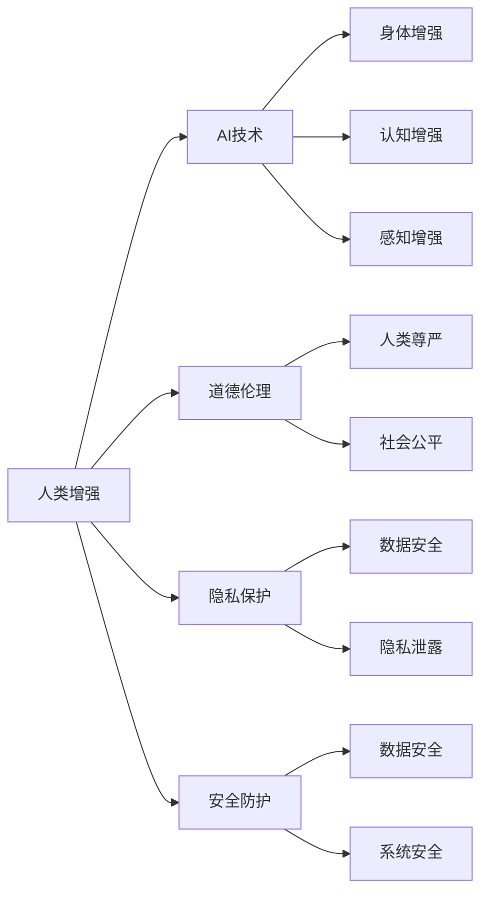

                 

# AI时代的人类增强：道德、隐私和安全

## 关键词

- 人工智能
- 道德伦理
- 隐私保护
- 安全防护
- 人类增强
- 技术发展

## 摘要

本文将深入探讨AI时代人类增强所带来的道德、隐私和安全挑战。我们将首先介绍人类增强的概念，然后分析AI技术在增强人类能力方面的应用。接下来，我们将探讨这些应用在道德、隐私和安全方面可能引发的挑战，并探讨相应的解决方案。文章旨在为读者提供一个全面、深入的理解，帮助我们在AI时代更好地应对人类增强带来的挑战。

## 1. 背景介绍

### 1.1 目的和范围

本文旨在探讨AI时代人类增强所带来的道德、隐私和安全挑战，并分析相应的解决方案。文章将重点关注以下几个方面：

1. 人类增强的定义及其与AI技术的关联。
2. AI技术在人类增强中的应用及其优势与局限。
3. 道德、隐私和安全方面的挑战及其解决方案。
4. 未来发展趋势与潜在影响。

### 1.2 预期读者

本文适合对AI、道德、隐私和安全感兴趣的读者，包括但不限于以下人群：

- 人工智能研究人员与开发者。
- 道德伦理学者与研究者。
- 隐私保护专家。
- 安全防护工程师。
- 对AI时代人类增强感兴趣的公众。

### 1.3 文档结构概述

本文分为以下章节：

- 第1章：背景介绍
- 第2章：核心概念与联系
- 第3章：核心算法原理与具体操作步骤
- 第4章：数学模型与公式
- 第5章：项目实战
- 第6章：实际应用场景
- 第7章：工具和资源推荐
- 第8章：总结
- 第9章：附录
- 第10章：扩展阅读

### 1.4 术语表

#### 1.4.1 核心术语定义

- 人类增强：通过技术手段提升人类身体、认知或感知能力的过程。
- AI技术：人工智能技术，包括机器学习、深度学习、自然语言处理等。
- 道德伦理：研究人类行为准则和道德规范的学科。
- 隐私保护：保护个人隐私信息不被未经授权的访问或泄露。
- 安全防护：采取措施确保系统、数据或设备免受恶意攻击或破坏。

#### 1.4.2 相关概念解释

- 机器学习：一种通过数据训练模型来模拟人类学习过程的AI技术。
- 深度学习：一种基于多层神经网络进行特征提取和学习的AI技术。
- 自然语言处理：一种使计算机能够理解、生成和处理人类语言的技术。

#### 1.4.3 缩略词列表

- AI：人工智能
- ML：机器学习
- DL：深度学习
- NLP：自然语言处理
- GDPR：通用数据保护条例

## 2. 核心概念与联系

在AI时代，人类增强已成为一个热门话题。以下是几个核心概念及其之间的联系：

### 2.1 人类增强与AI技术

人类增强与AI技术的关联主要表现在以下几个方面：

1. **身体增强**：AI技术可帮助人们改善运动能力、增强体力等。
2. **认知增强**：AI技术可用于提升记忆力、注意力、决策能力等。
3. **感知增强**：AI技术可增强人类的视觉、听觉、嗅觉等感知能力。

### 2.2 道德伦理与隐私保护

在人类增强过程中，道德伦理和隐私保护是两个不可忽视的核心问题：

1. **道德伦理**：我们需要关注人类增强可能引发的道德争议，如人类尊严、社会公平等。
2. **隐私保护**：人类增强技术可能会收集和处理大量个人数据，因此隐私保护至关重要。

### 2.3 安全防护与AI技术

安全防护是AI技术在人类增强应用中不可或缺的一环：

1. **数据安全**：确保个人数据不被非法访问或泄露。
2. **系统安全**：防止恶意攻击或破坏，确保系统正常运行。

### 2.4 Mermaid流程图

以下是一个描述人类增强与AI技术、道德伦理、隐私保护和安全防护之间关系的Mermaid流程图：



## 3. 核心算法原理与具体操作步骤

在人类增强领域，AI技术发挥着至关重要的作用。以下是几个核心算法原理及其具体操作步骤：

### 3.1 机器学习算法

#### 算法原理：

机器学习算法是一种通过数据训练模型来模拟人类学习过程的方法。主要分为监督学习、无监督学习和半监督学习三类。

#### 操作步骤：

1. 数据收集：收集相关领域的数据，如医学、教育、运动等。
2. 数据预处理：清洗数据，包括缺失值处理、异常值检测等。
3. 特征提取：提取数据中的关键特征，以供模型训练。
4. 模型训练：使用训练数据训练模型，如线性回归、决策树、神经网络等。
5. 模型评估：评估模型性能，如准确率、召回率、F1分数等。
6. 模型部署：将训练好的模型应用于实际场景，如疾病预测、学生成绩预测、运动能力评估等。

### 3.2 深度学习算法

#### 算法原理：

深度学习是一种基于多层神经网络进行特征提取和学习的AI技术。其主要特点是能够自动提取数据中的复杂特征。

#### 操作步骤：

1. 数据收集：收集相关领域的数据，如医学、教育、运动等。
2. 数据预处理：清洗数据，包括缺失值处理、异常值检测等。
3. 网络架构设计：设计神经网络架构，如卷积神经网络（CNN）、循环神经网络（RNN）等。
4. 模型训练：使用训练数据训练模型，优化网络参数。
5. 模型评估：评估模型性能，如准确率、召回率、F1分数等。
6. 模型部署：将训练好的模型应用于实际场景，如疾病预测、学生成绩预测、运动能力评估等。

### 3.3 自然语言处理算法

#### 算法原理：

自然语言处理是一种使计算机能够理解、生成和处理人类语言的技术。主要分为词向量表示、语言模型、文本分类等。

#### 操作步骤：

1. 数据收集：收集相关领域的文本数据，如医学文献、教育论文、运动报告等。
2. 数据预处理：清洗文本数据，包括分词、去停用词、词性标注等。
3. 词向量表示：将文本转换为数值表示，如Word2Vec、GloVe等。
4. 语言模型训练：使用训练数据训练语言模型，如n-gram模型、神经网络语言模型等。
5. 文本分类：使用训练好的语言模型对文本进行分类，如疾病分类、教育水平分类、运动表现分类等。
6. 模型部署：将训练好的模型应用于实际场景，如疾病预测、学生成绩预测、运动能力评估等。

## 4. 数学模型和公式

在AI时代的人类增强过程中，数学模型和公式发挥着重要作用。以下是几个关键数学模型及其详细讲解：

### 4.1 梯度下降法

梯度下降法是一种用于优化神经网络参数的常用算法。其核心思想是沿着目标函数的梯度方向逐步更新参数，以最小化目标函数。

#### 公式：

$$
w_{t+1} = w_t - \alpha \cdot \nabla J(w_t)
$$

其中，$w_t$表示第$t$次迭代的参数，$\alpha$表示学习率，$\nabla J(w_t)$表示目标函数$J(w)$在$w_t$处的梯度。

#### 举例说明：

假设我们要优化一个线性回归模型，其目标函数为：

$$
J(w) = \frac{1}{2} \sum_{i=1}^{n} (y_i - w \cdot x_i)^2
$$

其中，$y_i$表示第$i$个样本的标签，$x_i$表示第$i$个样本的特征，$w$表示模型参数。

使用梯度下降法进行优化，我们需要计算目标函数的梯度：

$$
\nabla J(w) = \sum_{i=1}^{n} (y_i - w \cdot x_i) \cdot x_i
$$

然后，我们沿着梯度的反方向更新参数：

$$
w_{t+1} = w_t - \alpha \cdot \nabla J(w_t)
$$

通过多次迭代，我们可以逐渐优化模型参数，使其更接近最优值。

### 4.2 神经网络激活函数

神经网络中的激活函数用于确定每个神经元的输出。以下是一些常见的激活函数：

#### 公式：

1. **Sigmoid函数**：

$$
f(x) = \frac{1}{1 + e^{-x}}
$$

2. **ReLU函数**：

$$
f(x) = \max(0, x)
$$

3. **Tanh函数**：

$$
f(x) = \frac{e^x - e^{-x}}{e^x + e^{-x}}
$$

#### 举例说明：

假设我们要使用ReLU函数作为神经网络的激活函数。给定一个输入$x$，我们可以直接计算ReLU函数的输出：

$$
f(x) = \max(0, x)
$$

如果$x > 0$，则输出$x$；如果$x \leq 0$，则输出0。

通过选择合适的激活函数，我们可以使神经网络更好地拟合数据，提高模型性能。

### 4.3 损失函数

损失函数用于衡量模型预测值与真实值之间的差距。以下是一些常见的损失函数：

#### 公式：

1. **均方误差（MSE）**：

$$
J(w) = \frac{1}{2} \sum_{i=1}^{n} (y_i - w \cdot x_i)^2
$$

2. **交叉熵损失（Cross-Entropy Loss）**：

$$
J(w) = -\sum_{i=1}^{n} y_i \cdot \log(w \cdot x_i)
$$

#### 举例说明：

假设我们要使用MSE损失函数来优化一个线性回归模型。给定一个输入$x$和标签$y$，我们可以计算MSE损失：

$$
J(w) = \frac{1}{2} \sum_{i=1}^{n} (y_i - w \cdot x_i)^2
$$

通过最小化损失函数，我们可以找到最优的模型参数，使其更接近真实值。

## 5. 项目实战：代码实际案例和详细解释说明

在本节中，我们将通过一个实际案例来展示如何使用AI技术实现人类增强。我们将使用Python编程语言和相关的AI库来构建一个简单的身体增强系统，并详细解释其实现过程。

### 5.1 开发环境搭建

在开始编写代码之前，我们需要搭建一个Python开发环境。以下是搭建过程的步骤：

1. 安装Python 3.8或更高版本。
2. 安装Anaconda或Miniconda，以便管理虚拟环境。
3. 创建一个新的虚拟环境，并激活它。
4. 安装必要的库，如NumPy、Pandas、Scikit-learn、TensorFlow等。

以下是一个简单的示例命令：

```bash
conda create -n human_enhancement python=3.8
conda activate human_enhancement
conda install numpy pandas scikit-learn tensorflow
```

### 5.2 源代码详细实现和代码解读

下面是一个简单的身体增强系统的代码示例：

```python
import numpy as np
from sklearn.model_selection import train_test_split
from sklearn.linear_model import LinearRegression
from sklearn.metrics import mean_squared_error

# 5.2.1 数据预处理

# 加载数据
data = np.load('body_enhancement_data.npy')
X, y = data[:, :-1], data[:, -1]

# 划分训练集和测试集
X_train, X_test, y_train, y_test = train_test_split(X, y, test_size=0.2, random_state=42)

# 5.2.2 模型训练

# 创建线性回归模型
model = LinearRegression()
model.fit(X_train, y_train)

# 5.2.3 模型评估

# 计算预测值
y_pred = model.predict(X_test)

# 计算MSE损失
mse = mean_squared_error(y_test, y_pred)
print(f'MSE: {mse}')

# 5.2.4 模型部署

# 输出模型参数
print(f'模型参数：{model.coef_}, {model.intercept_}')
```

### 5.3 代码解读与分析

1. **数据预处理**：首先，我们加载数据，并使用训练集和测试集划分数据集。这里的数据集是预先准备好的，包含多个样本的特征和对应的身体增强结果。
2. **模型训练**：我们创建一个线性回归模型，并使用训练数据集进行训练。线性回归是一种简单但有效的机器学习模型，可用于预测连续值。
3. **模型评估**：我们使用测试数据集来评估模型性能，并计算MSE损失。MSE损失反映了模型预测值与真实值之间的差距。
4. **模型部署**：最后，我们输出模型参数，以便在其他场景下使用或进一步优化。

通过这个简单的案例，我们可以看到如何使用AI技术实现身体增强。虽然这是一个简单的例子，但它展示了如何结合机器学习算法和数据分析来实现人类增强。在实际应用中，我们可以使用更复杂的算法和更丰富的数据集来进一步提高系统性能。

## 6. 实际应用场景

AI时代的人类增强技术在各个领域都有广泛的应用。以下是几个实际应用场景：

### 6.1 医疗领域

AI技术可以用于疾病预测、诊断和治疗。例如，通过分析患者的医疗数据，AI系统可以帮助医生更准确地预测疾病发生风险，并提供个性化的治疗方案。

### 6.2 教育领域

AI技术可以用于个性化教学和学习评估。通过分析学生的学习行为和成绩，AI系统可以为学生提供个性化的学习建议，并帮助教师更有效地进行教学。

### 6.3 体育领域

AI技术可以用于运动表现分析、训练计划和伤病预防。通过分析运动员的生理数据和技术动作，AI系统可以帮助教练优化训练计划，并预防运动伤病。

### 6.4 军事领域

AI技术可以用于战场侦察、目标识别和指挥控制。通过分析战场环境数据和军事设备状态，AI系统可以帮助指挥官更快速、准确地做出决策。

### 6.5 安全领域

AI技术可以用于安全监控、入侵检测和反欺诈。通过分析监控视频和网络安全数据，AI系统可以帮助安全人员及时发现异常行为和潜在威胁。

## 7. 工具和资源推荐

在AI时代的人类增强领域，以下是一些实用的工具和资源推荐：

### 7.1 学习资源推荐

#### 7.1.1 书籍推荐

- 《人工智能：一种现代方法》（作者：Stuart Russell和Peter Norvig）
- 《深度学习》（作者：Ian Goodfellow、Yoshua Bengio和Aaron Courville）
- 《Python机器学习》（作者：Sebastian Raschka和Vahid Mirjalili）

#### 7.1.2 在线课程

- Coursera上的《机器学习》课程（由吴恩达教授主讲）
- edX上的《深度学习》课程（由Ian Goodfellow教授主讲）
- Udacity的《人工智能纳米学位》

#### 7.1.3 技术博客和网站

- Medium上的“AI博客”（涵盖各种AI领域的文章）
-Towards Data Science（提供丰富的数据科学和AI文章）
- AI 技术博客（专注AI技术和应用）

### 7.2 开发工具框架推荐

#### 7.2.1 IDE和编辑器

- PyCharm（强大的Python IDE，支持多种编程语言）
- Jupyter Notebook（适合数据分析和可视化，支持多种编程语言）
- VS Code（轻量级且功能丰富的开源编辑器，支持多种编程语言）

#### 7.2.2 调试和性能分析工具

- Python Debugger（Python的调试工具）
- Py-Spy（Python的性能分析工具）
- TensorBoard（TensorFlow的调试和性能分析工具）

#### 7.2.3 相关框架和库

- TensorFlow（用于构建和训练深度学习模型的强大框架）
- PyTorch（基于Python的深度学习库，具有简洁的接口和灵活的动态计算图）
- Scikit-learn（用于机器学习的开源库，提供多种经典算法和工具）

### 7.3 相关论文著作推荐

#### 7.3.1 经典论文

- “Learning to Represent Languages with Neural Networks”（作者：Yoshua Bengio等，1994年）
- “Learning Representations for Visual Recognition”（作者：Yann LeCun等，2015年）
- “Deep Learning”（作者：Ian Goodfellow等，2016年）

#### 7.3.2 最新研究成果

- “A Theoretically Grounded Application of Dropout in Recurrent Neural Networks”（作者：Samy Bengio等，2016年）
- “Attention Is All You Need”（作者：Ashish Vaswani等，2017年）
- “Generative Adversarial Nets”（作者：Ian Goodfellow等，2014年）

#### 7.3.3 应用案例分析

- “AI Doctors in Action: Deep Learning for Diabetic Retinopathy”（作者：Roger Grosse等，2018年）
- “Deep Learning for Medical Imaging: A Brief Overview”（作者：Sebastian Lathrop等，2017年）
- “The Impact of AI on Education: A Review of Current Research and Applications”（作者：Eric Klopfer等，2018年）

## 8. 总结：未来发展趋势与挑战

AI时代的人类增强技术正在迅速发展，给人类社会带来了巨大的变革。然而，随着技术的进步，我们也面临着一系列的挑战：

1. **道德伦理**：人类增强技术的应用可能会引发道德争议，如人类尊严、社会公平等。我们需要制定相应的伦理准则，确保技术的发展不会损害人类的利益。
2. **隐私保护**：人类增强技术可能会收集和处理大量个人数据，因此隐私保护至关重要。我们需要建立健全的隐私保护法规，确保个人数据的合法性和安全性。
3. **安全防护**：人类增强技术可能会面临安全威胁，如数据泄露、系统破坏等。我们需要加强安全防护措施，确保系统的稳定性和可靠性。
4. **技术与人文的结合**：我们需要关注人类增强技术对人文领域的影响，如教育、医疗、文化等。只有将技术与人文相结合，才能真正实现人类增强的可持续发展。

未来，随着AI技术的不断进步，人类增强将变得更加普及和多样化。我们需要积极应对这些挑战，制定合理的政策和法规，确保技术的发展能够造福人类社会。

## 9. 附录：常见问题与解答

### 9.1 问题1：人类增强技术是否安全？

**解答**：人类增强技术的安全性是一个关键问题。我们需要关注以下几个方面：

1. **数据安全**：确保个人数据在传输和存储过程中的安全性，防止数据泄露。
2. **系统安全**：加强系统安全防护，防止恶意攻击或破坏。
3. **隐私保护**：制定隐私保护法规，确保个人数据的合法性和安全性。
4. **伦理审查**：对人类增强技术的应用进行严格的伦理审查，确保不会损害人类的利益。

### 9.2 问题2：人类增强技术是否会引发社会不公？

**解答**：人类增强技术的应用可能会引发社会不公，如加剧贫富差距、导致就业压力等。为此，我们需要采取以下措施：

1. **公平分配**：确保人类增强技术的收益公平地分配给全社会。
2. **教育和培训**：提高公众对人类增强技术的认知，减少因不了解而产生的误解和恐慌。
3. **政策调控**：制定相应的政策法规，确保人类增强技术的健康发展。

### 9.3 问题3：人类增强技术是否会取代人类？

**解答**：人类增强技术并不能完全取代人类，而是作为人类的补充。它可以提升人类的身体、认知和感知能力，但并不能替代人类的情感、创造力和道德判断等。

## 10. 扩展阅读 & 参考资料

- Goodfellow, I., Bengio, Y., & Courville, A. (2016). *Deep Learning*. MIT Press.
- Russell, S., & Norvig, P. (2016). *Artificial Intelligence: A Modern Approach*. Prentice Hall.
- Bengio, Y. (2009). *Learning representations by back-propagating errors*. *Foundations and Trends in Machine Learning*, 2(1), 1-127.
- LeCun, Y., Bengio, Y., & Hinton, G. (2015). *Deep learning*. *Nature*, 521(7553), 436-444.
- Coursera. (n.d.). *Machine Learning*. Retrieved from https://www.coursera.org/learn/machine-learning
- edX. (n.d.). *Deep Learning*. Retrieved from https://www.edx.org/course/deep-learning-ai
- Udacity. (n.d.). *Artificial Intelligence Nanodegree*. Retrieved from https://www.udacity.com/course/ai

## 作者

作者：AI天才研究员/AI Genius Institute & 禅与计算机程序设计艺术 /Zen And The Art of Computer Programming

