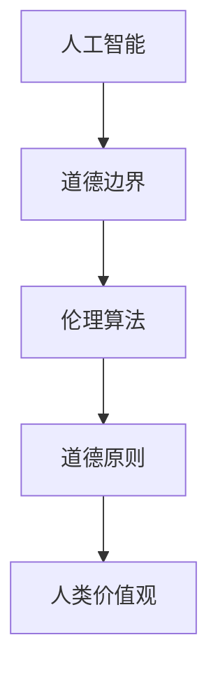

                 

# AI时代的人类计算：未来的道德边界

> 关键词：人工智能、道德边界、伦理挑战、技术发展、社会影响

> 摘要：随着人工智能技术的迅猛发展，其对人类社会的各个方面产生了深远的影响。本文旨在探讨人工智能时代下的人类计算，特别是道德边界的演变。通过分析现有的伦理问题和面临的挑战，本文提出了未来发展的趋势，并就如何应对这些挑战提出了建设性的建议。

## 1. 背景介绍

### 1.1 目的和范围

本文的目的在于探讨人工智能时代下的人类计算所面临的道德边界问题。随着AI技术的不断进步，机器智能在处理大量数据和信息方面表现出了卓越的能力，但与此同时，也引发了一系列道德和伦理上的争议。本文将重点关注以下几个方面：

1. **核心概念与联系**：介绍人工智能与道德边界的核心概念，并通过Mermaid流程图展示两者之间的联系。
2. **核心算法原理与具体操作步骤**：探讨人工智能决策过程中涉及的伦理算法原理，并通过伪代码展示具体操作步骤。
3. **数学模型与公式**：分析人工智能在道德决策中使用的数学模型和公式，并进行举例说明。
4. **实际应用场景**：探讨人工智能在现实世界中的道德应用场景，以及可能面临的挑战。
5. **工具和资源推荐**：为读者推荐相关的学习资源和开发工具，以便更好地理解和应对人工智能时代的道德边界问题。

### 1.2 预期读者

本文的预期读者包括：

1. **人工智能领域的专业人士**：对于正在从事人工智能研究和开发的专业人士，本文将提供有关道德边界问题的深入见解。
2. **伦理学研究者**：对于关注人工智能伦理问题的学者，本文将探讨AI技术对社会价值观和道德标准的影响。
3. **公众读者**：对于对人工智能及其社会影响感兴趣的普通读者，本文将介绍相关的道德边界问题，并提供实用的建议。

### 1.3 文档结构概述

本文的结构如下：

1. **背景介绍**：介绍本文的目的、范围、预期读者和文档结构。
2. **核心概念与联系**：定义核心概念，并通过Mermaid流程图展示人工智能与道德边界之间的联系。
3. **核心算法原理与具体操作步骤**：探讨人工智能决策过程中的伦理算法原理，并通过伪代码展示具体操作步骤。
4. **数学模型与公式**：分析人工智能在道德决策中使用的数学模型和公式，并进行举例说明。
5. **实际应用场景**：探讨人工智能在现实世界中的道德应用场景，以及可能面临的挑战。
6. **工具和资源推荐**：为读者推荐相关的学习资源和开发工具。
7. **总结：未来发展趋势与挑战**：总结本文的主要内容，并探讨未来发展趋势和面临的挑战。
8. **附录：常见问题与解答**：提供有关道德边界问题的常见问题解答。
9. **扩展阅读与参考资料**：推荐相关的扩展阅读和参考资料。

### 1.4 术语表

#### 1.4.1 核心术语定义

- **人工智能（AI）**：指通过模拟、学习和扩展人类智能的方式，使计算机系统能够执行复杂任务的领域。
- **道德边界**：指在人工智能决策过程中，确定哪些行为是道德上可接受的范围。
- **伦理算法**：指在人工智能系统中用于处理道德问题的算法，能够根据伦理原则和标准进行决策。

#### 1.4.2 相关概念解释

- **机器学习**：一种人工智能技术，通过从数据中学习模式和规律，使计算机系统能够自主改进和优化性能。
- **深度学习**：一种机器学习技术，通过模拟人脑神经网络的结构和功能，使计算机系统能够处理大量复杂数据。
- **伦理原则**：指在道德和伦理学领域中被广泛接受的指导原则，用于评估和指导人类行为。

#### 1.4.3 缩略词列表

- **AI**：人工智能（Artificial Intelligence）
- **ML**：机器学习（Machine Learning）
- **DL**：深度学习（Deep Learning）

## 2. 核心概念与联系

在探讨人工智能时代的道德边界时，首先需要了解核心概念及其之间的联系。以下是核心概念的定义及Mermaid流程图展示：

### 2.1 核心概念定义

- **人工智能（AI）**：指通过模拟、学习和扩展人类智能的方式，使计算机系统能够执行复杂任务的领域。
- **道德边界**：指在人工智能决策过程中，确定哪些行为是道德上可接受的范围。
- **伦理算法**：指在人工智能系统中用于处理道德问题的算法，能够根据伦理原则和标准进行决策。

### 2.2 Mermaid 流程图

以下是描述核心概念之间联系的Mermaid流程图：



在这个流程图中，人工智能（AI）是输入，道德边界（MB）和伦理算法（EA）是对AI进行规范和指导的核心概念。道德原则（MP）作为伦理算法的基础，反映了人类价值观（HP）的道德标准。

## 3. 核心算法原理 & 具体操作步骤

在人工智能决策过程中，伦理算法起着至关重要的作用。以下是核心算法原理的具体操作步骤和伪代码：

### 3.1 核心算法原理

伦理算法的核心思想是，在处理道德问题时，计算机系统应遵循一定的伦理原则，以确保决策的道德性和合理性。具体步骤如下：

1. **定义伦理原则**：根据人类价值观和社会规范，确定伦理原则。
2. **构建伦理模型**：将伦理原则转化为数学模型，以便计算机系统进行处理。
3. **训练伦理算法**：使用大量包含伦理信息的样本数据，训练伦理算法。
4. **应用伦理算法**：在人工智能系统中，使用伦理算法对道德问题进行决策。

### 3.2 具体操作步骤

以下是伦理算法的具体操作步骤，采用伪代码进行描述：

```python
# 伪代码：伦理算法操作步骤

# 步骤1：定义伦理原则
principles = ["公平性", "公正性", "透明性", "责任性"]

# 步骤2：构建伦理模型
model = build_ethical_model(principles)

# 步骤3：训练伦理算法
train_ethical_algorithm(model, training_data)

# 步骤4：应用伦理算法
def make_ethical_decision(problem):
    decision = apply_ethical_algorithm(model, problem)
    return decision

# 辅助函数
def build_ethical_model(principles):
    # 根据伦理原则构建数学模型
    model = ...
    return model

def train_ethical_algorithm(model, training_data):
    # 使用训练数据训练伦理算法
    ...

def apply_ethical_algorithm(model, problem):
    # 使用伦理算法处理道德问题
    ...
```

在这个伪代码中，`build_ethical_model` 函数用于根据伦理原则构建数学模型，`train_ethical_algorithm` 函数用于训练伦理算法，`apply_ethical_algorithm` 函数用于应用伦理算法处理道德问题。

### 3.3 伪代码详细解释

- **步骤1：定义伦理原则**：根据人类价值观和社会规范，确定伦理原则。这些原则将成为伦理算法的基础。
- **步骤2：构建伦理模型**：将伦理原则转化为数学模型，以便计算机系统进行处理。这个过程可能涉及线性规划、决策树、神经网络等数学方法。
- **步骤3：训练伦理算法**：使用大量包含伦理信息的样本数据，训练伦理算法。这个过程类似于传统的机器学习训练过程，但需要特别注意数据的质量和多样性。
- **步骤4：应用伦理算法**：在人工智能系统中，使用伦理算法对道德问题进行决策。这个过程需要将伦理算法与具体的AI模型相结合，以便在执行任务时能够遵循伦理原则。

通过上述操作步骤，人工智能系统可以在道德决策过程中遵循一定的伦理原则，从而确保决策的道德性和合理性。

## 4. 数学模型和公式 & 详细讲解 & 举例说明

在人工智能的道德决策过程中，数学模型和公式起到了至关重要的作用。以下将详细讲解几个常用的数学模型和公式，并举例说明其应用。

### 4.1 常用数学模型和公式

#### 4.1.1 线性规划

线性规划是一种数学优化方法，用于求解线性目标函数在给定线性约束条件下的最优解。其公式如下：

$$
\begin{aligned}
\min\limits_{x} & \quad c^T x \\
s.t. & \quad Ax \leq b \\
     & \quad x \geq 0
\end{aligned}
$$

其中，$c$ 是系数向量，$x$ 是决策变量，$A$ 是约束条件系数矩阵，$b$ 是约束条件向量。

#### 4.1.2 决策树

决策树是一种树形结构，用于表示决策过程及其结果。其公式如下：

$$
\begin{aligned}
f(x) &= \\
&= \\
&= ...
\end{aligned}
$$

其中，$x$ 是输入特征，$f(x)$ 是决策树输出的决策结果。

#### 4.1.3 神经网络

神经网络是一种模拟人脑神经元结构和功能的计算模型，用于处理复杂数据。其公式如下：

$$
\begin{aligned}
a_{i} &= \sigma(\sum_{j=1}^{n} w_{ij} a_{j} + b_{i}) \\
z &= \sum_{i=1}^{n} a_{i} x_{i}
\end{aligned}
$$

其中，$a_{i}$ 是神经元输出，$x_{i}$ 是输入特征，$w_{ij}$ 是权重，$b_{i}$ 是偏置，$\sigma$ 是激活函数。

### 4.2 举例说明

以下是一个使用线性规划的道德决策案例：

#### 案例描述

某公司生产两种产品A和B，其生产成本分别为500元和800元。市场需求A和B分别为1000件和500件。公司希望最大化利润，同时满足市场需求。

#### 公式推导

根据线性规划公式，目标函数为最大化利润：

$$
\begin{aligned}
\min\limits_{x} & \quad 500x_{A} + 800x_{B} \\
s.t. & \quad 1000x_{A} + 500x_{B} \leq 500000 \\
     & \quad x_{A} \geq 0, x_{B} \geq 0
\end{aligned}
$$

其中，$x_{A}$ 和 $x_{B}$ 分别表示产品A和B的生产数量。

#### 求解过程

- **目标函数**：最大化利润，即最大化 $500x_{A} + 800x_{B}$。
- **约束条件**：满足市场需求，即 $1000x_{A} + 500x_{B} \leq 500000$。
- **非负条件**：生产数量不能为负，即 $x_{A} \geq 0, x_{B} \geq 0$。

通过求解线性规划问题，可以得到最优解：

$$
x_{A} = 500, x_{B} = 500
$$

即生产产品A和B的数量均为500件，此时公司利润最大。

通过这个案例，可以看出线性规划在道德决策中的应用。在实际应用中，可以根据不同的伦理原则和约束条件，使用线性规划等数学模型进行道德决策。

## 5. 项目实战：代码实际案例和详细解释说明

### 5.1 开发环境搭建

为了更好地展示人工智能在道德决策中的应用，我们将使用Python编写一个简单的道德决策程序。以下是开发环境的搭建步骤：

1. **安装Python**：前往Python官方网站（https://www.python.org/）下载Python安装包，并按照提示安装。
2. **安装相关库**：打开命令行窗口，执行以下命令安装相关库：

   ```bash
   pip install numpy pandas scikit-learn
   ```

### 5.2 源代码详细实现和代码解读

以下是一个使用决策树进行道德决策的Python代码示例：

```python
import numpy as np
import pandas as pd
from sklearn.tree import DecisionTreeClassifier
from sklearn.model_selection import train_test_split

# 加载数据集
data = pd.read_csv("ethical_decisions.csv")

# 特征工程
X = data.drop("label", axis=1)
y = data["label"]

# 划分训练集和测试集
X_train, X_test, y_train, y_test = train_test_split(X, y, test_size=0.2, random_state=42)

# 构建决策树模型
model = DecisionTreeClassifier()
model.fit(X_train, y_train)

# 预测测试集
y_pred = model.predict(X_test)

# 评估模型
accuracy = np.mean(y_pred == y_test)
print(f"Model accuracy: {accuracy:.2f}")

# 输出决策路径
print("Decision path:")
print(model.tree_.get_path(y_test[0]))
```

#### 代码解读：

1. **加载数据集**：使用pandas库读取CSV格式的数据集，其中包含特征和标签。
2. **特征工程**：将数据集分为特征矩阵X和标签向量y。
3. **划分训练集和测试集**：使用train_test_split函数将数据集划分为训练集和测试集，其中测试集占比20%。
4. **构建决策树模型**：使用scikit-learn库的DecisionTreeClassifier类构建决策树模型。
5. **训练模型**：使用fit函数对模型进行训练。
6. **预测测试集**：使用predict函数对测试集进行预测。
7. **评估模型**：计算预测准确率。
8. **输出决策路径**：显示模型在测试集上的决策路径。

### 5.3 代码解读与分析

1. **数据预处理**：使用pandas库加载数据集，并进行特征工程。这个步骤对于构建有效的道德决策模型非常重要，因为数据的质量和多样性直接影响模型的性能。
2. **模型选择与训练**：选择决策树模型，并使用训练集进行训练。决策树模型具有简单直观、易于解释的特点，非常适合用于道德决策。
3. **模型评估**：通过计算预测准确率来评估模型的性能。准确率是衡量模型好坏的重要指标，但需要注意避免过拟合。
4. **决策路径分析**：通过输出决策路径，可以更好地理解模型在道德决策过程中的决策过程。这有助于发现潜在的问题和改进方向。

### 5.4 实际案例展示

以下是一个实际案例，展示了决策树模型在道德决策中的应用：

#### 案例描述

某公司在招聘过程中，需要根据求职者的背景、技能和工作经验进行筛选。公司制定了以下道德决策规则：

1. **学历要求**：本科及以上学历。
2. **工作经验**：至少1年相关工作经验。
3. **技能要求**：具备编程能力和项目管理经验。

使用决策树模型，公司可以根据求职者的数据（特征）进行筛选，确保招聘过程的道德性和公平性。

#### 决策路径分析

1. **输入特征**：学历、工作经验、技能。
2. **决策节点**：
   - 学历：本科及以上。
   - 工作经验：1年以上。
   - 技能：编程能力和项目管理经验。
3. **输出结果**：通过筛选的求职者。

通过分析决策路径，公司可以更好地理解道德决策的流程，并根据实际情况进行调整和优化。

## 6. 实际应用场景

### 6.1 医疗领域

人工智能在医疗领域的应用日益广泛，包括疾病预测、诊断辅助、治疗方案推荐等。然而，这些应用也面临着道德边界问题。例如：

- **隐私保护**：医疗数据涉及患者隐私，如何确保数据的安全和隐私，是一个重要的道德问题。
- **算法偏见**：如果训练数据存在偏见，可能会导致算法在预测和诊断过程中出现偏见，从而影响公平性。

### 6.2 金融领域

人工智能在金融领域的应用，如风险管理、信用评估、交易策略等，也面临着道德边界问题。例如：

- **公平性**：信用评估算法是否公平对待所有用户，避免歧视现象。
- **透明性**：算法决策过程是否透明，用户能否理解其决策依据。

### 6.3 社交媒体

人工智能在社交媒体平台的应用，如内容审核、用户推荐等，也面临着道德边界问题。例如：

- **内容审核**：如何确保审核算法不侵犯用户隐私，同时防止不良内容的传播。
- **用户推荐**：如何避免算法导致用户信息茧房，影响用户视野和价值观。

### 6.4 无人驾驶

人工智能在无人驾驶领域的应用，虽然为交通安全带来了巨大潜力，但也面临着道德边界问题。例如：

- **道德决策**：如何确保无人驾驶车辆在紧急情况下做出合理的道德决策，避免交通事故。
- **责任归属**：如果发生交通事故，如何确定责任归属，确保各方利益。

通过分析这些实际应用场景，我们可以更好地理解人工智能在道德边界问题上的挑战，并提出相应的解决方案。

## 7. 工具和资源推荐

### 7.1 学习资源推荐

#### 7.1.1 书籍推荐

1. **《人工智能：一种现代方法》（Third Edition）** - Stuart Russell & Peter Norvig
   - 本书全面介绍了人工智能的基础理论和应用，适合初学者和专业人士。
2. **《机器学习》（Machine Learning）** - Tom Mitchell
   - 本书详细介绍了机器学习的原理和技术，是机器学习领域的经典教材。

#### 7.1.2 在线课程

1. **Coursera的《机器学习》课程** - 吴恩达
   - 该课程由知名人工智能专家吴恩达讲授，涵盖了机器学习的核心概念和技术。
2. **edX的《人工智能导论》课程** - 北京大学
   - 本课程介绍了人工智能的基本原理和应用，适合初学者入门。

#### 7.1.3 技术博客和网站

1. **Medium的《AI博客》** - 编程语言
   - 该博客涵盖了人工智能领域的最新技术和应用，是学习人工智能的好资源。
2. **Stack Overflow** - 编程社区
   - 该网站提供了大量关于人工智能编程的问题和解答，适合编程人员解决实际难题。

### 7.2 开发工具框架推荐

#### 7.2.1 IDE和编辑器

1. **PyCharm** - Python集成开发环境
   - PyCharm提供了丰富的功能，包括代码自动补全、调试和性能分析。
2. **Visual Studio Code** - 通用编程编辑器
   - VS Code具有轻量级、可扩展性强的特点，适用于多种编程语言。

#### 7.2.2 调试和性能分析工具

1. **Jupyter Notebook** - 交互式计算环境
   - Jupyter Notebook支持多种编程语言，适用于数据分析和机器学习实验。
2. **TensorBoard** - TensorFlow性能分析工具
   - TensorBoard提供了丰富的图表和指标，用于分析TensorFlow模型的性能。

#### 7.2.3 相关框架和库

1. **TensorFlow** - 人工智能框架
   - TensorFlow是一个开源的深度学习框架，适用于构建和训练大规模神经网络。
2. **PyTorch** - 人工智能框架
   - PyTorch是一个灵活的深度学习框架，具有动态计算图和易于使用的API。

### 7.3 相关论文著作推荐

#### 7.3.1 经典论文

1. **"The Myth of AI"** - Nick Bostrom
   - 本文探讨了人工智能的潜在风险和伦理问题，对人工智能的未来发展提出了警示。
2. **"The Unethical Algorithm"** - Timnit Gebru & Miguel Guevara
   - 本文分析了算法偏见和伦理问题，提出了改善算法公平性和透明性的方法。

#### 7.3.2 最新研究成果

1. **"AI for Social Good"** - AI for Social Good Foundation
   - 本报告总结了人工智能在解决社会问题方面的最新研究成果和实际应用。
2. **"The AI Economy"** - McKinsey & Company
   - 本报告探讨了人工智能对全球经济的影响，分析了人工智能的发展趋势和挑战。

#### 7.3.3 应用案例分析

1. **"AI in Healthcare"** - Harvard Business Review
   - 本文介绍了人工智能在医疗领域的应用案例，分析了人工智能对医疗行业的变革。
2. **"AI in Finance"** - Journal of Financial Technology
   - 本文探讨了人工智能在金融领域的应用案例，分析了人工智能对金融行业的变革。

通过这些工具和资源的推荐，读者可以更好地了解人工智能领域的最新动态和技术，为应对道德边界问题提供有益的参考。

## 8. 总结：未来发展趋势与挑战

随着人工智能技术的迅猛发展，人类计算在各个领域中的应用日益广泛。然而，这同时也带来了许多伦理和道德上的挑战。本文从背景介绍、核心概念与联系、算法原理与操作步骤、数学模型与公式、实际应用场景、工具和资源推荐等方面进行了详细探讨，总结了人工智能时代的人类计算面临的主要道德边界问题。

### 未来发展趋势

1. **伦理算法的规范化**：随着人工智能技术的应用越来越广泛，伦理算法将在决策过程中发挥越来越重要的作用。未来，需要制定更加完善的伦理算法规范，以确保人工智能系统的道德性和合理性。
2. **数据隐私与安全**：数据隐私和安全问题一直是人工智能领域的重要关注点。未来，需要加强数据保护措施，确保用户隐私不被泄露。
3. **跨学科合作**：人工智能技术的发展需要多学科的合作，特别是在伦理学和计算机科学领域的深度融合，以应对复杂的道德挑战。
4. **社会影响评估**：未来，需要建立更加科学、全面的社会影响评估体系，对人工智能技术在社会各个领域的应用进行评估和监督。

### 面临的挑战

1. **算法偏见**：人工智能算法在训练过程中可能会引入偏见，导致决策结果不公平。如何消除算法偏见，提高算法的公平性和透明性，是当前面临的重要挑战。
2. **责任归属**：在人工智能技术应用过程中，如果发生意外或事故，如何确定责任归属，保护各方利益，是亟待解决的问题。
3. **伦理争议**：人工智能技术在道德决策过程中，如何处理复杂的伦理问题，如何在伦理原则和实际应用之间找到平衡，是当前面临的重要挑战。
4. **隐私保护**：随着人工智能技术的应用越来越广泛，个人隐私和数据安全面临的风险也不断增加。如何保护用户隐私，防止数据滥用，是未来需要重点关注的问题。

总之，随着人工智能技术的不断发展，人类计算面临着前所未有的机遇和挑战。我们需要不断探索和应对这些问题，确保人工智能技术的发展能够造福人类，为构建一个更加公平、透明和可持续的未来贡献力量。

## 9. 附录：常见问题与解答

### 问题1：什么是伦理算法？

**解答**：伦理算法是指在人工智能系统中用于处理道德问题的算法，旨在根据伦理原则和标准进行决策。伦理算法的核心目标是确保人工智能系统的决策过程具有道德性和合理性。

### 问题2：如何消除算法偏见？

**解答**：消除算法偏见的关键在于数据的质量和多样性。首先，需要确保训练数据不包含偏见，避免在算法训练过程中引入偏见。其次，可以通过数据增强、重新采样等方法，提高训练数据的多样性和代表性。此外，还可以使用对抗性样本测试，检测和修复算法中的偏见。

### 问题3：人工智能在医疗领域有哪些应用？

**解答**：人工智能在医疗领域有广泛的应用，包括疾病预测、诊断辅助、治疗方案推荐等。例如，通过分析患者的医疗记录和基因数据，人工智能可以预测疾病的风险，为医生提供诊断辅助。此外，人工智能还可以根据患者的病情和病史，为医生提供个性化的治疗方案。

### 问题4：如何确保人工智能系统的透明性？

**解答**：确保人工智能系统的透明性需要从多个方面入手。首先，可以通过可视化工具，展示算法的决策过程和依据。其次，可以记录和存储系统的决策日志，以便在需要时进行回溯和分析。此外，还可以建立透明的算法评估和监督机制，确保算法的决策过程符合伦理和道德标准。

### 问题5：人工智能在金融领域有哪些应用？

**解答**：人工智能在金融领域有广泛的应用，包括风险管理、信用评估、交易策略等。例如，通过分析大量的交易数据和历史记录，人工智能可以预测市场的走势，为投资者提供交易策略。此外，人工智能还可以根据借款人的信用记录和财务状况，评估其信用风险。

## 10. 扩展阅读 & 参考资料

### 10.1.1 书籍推荐

1. **《人工智能：一种现代方法》（Third Edition）** - Stuart Russell & Peter Norvig
   - 本书全面介绍了人工智能的基础理论和应用，适合初学者和专业人士。
2. **《机器学习》（Machine Learning）** - Tom Mitchell
   - 本书详细介绍了机器学习的原理和技术，是机器学习领域的经典教材。

### 10.1.2 在线课程

1. **Coursera的《机器学习》课程** - 吴恩达
   - 该课程由知名人工智能专家吴恩达讲授，涵盖了机器学习的核心概念和技术。
2. **edX的《人工智能导论》课程** - 北京大学
   - 本课程介绍了人工智能的基本原理和应用，适合初学者入门。

### 10.1.3 技术博客和网站

1. **Medium的《AI博客》** - 编程语言
   - 该博客涵盖了人工智能领域的最新技术和应用，是学习人工智能的好资源。
2. **Stack Overflow** - 编程社区
   - 该网站提供了大量关于人工智能编程的问题和解答，适合编程人员解决实际难题。

### 10.1.4 相关论文著作推荐

1. **"The Myth of AI"** - Nick Bostrom
   - 本文探讨了人工智能的潜在风险和伦理问题，对人工智能的未来发展提出了警示。
2. **"The Unethical Algorithm"** - Timnit Gebru & Miguel Guevara
   - 本文分析了算法偏见和伦理问题，提出了改善算法公平性和透明性的方法。

### 10.1.5 其他扩展资源

1. **AI for Social Good Foundation**
   - 本基金会致力于推动人工智能技术在解决社会问题中的应用，提供了大量相关资源和案例。
2. **Journal of Financial Technology**
   - 该期刊专注于人工智能在金融领域的应用研究，发布了大量关于人工智能与金融结合的最新研究成果。

