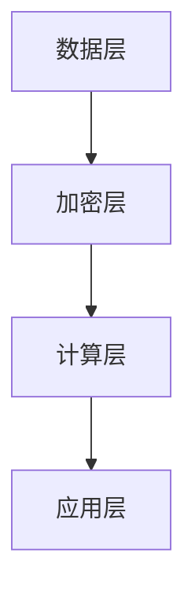

                 


# AI时代的人类计算：隐私考虑

> **关键词：**人工智能、隐私保护、计算模型、隐私计算、加密技术、数据安全
> 
> **摘要：**本文将探讨在人工智能时代，人类计算中隐私保护的重要性及其实现方式。我们将首先介绍隐私计算的基本概念和现有技术，然后分析隐私计算与人工智能之间的联系，探讨如何在人工智能应用中实现隐私保护。最后，我们将通过具体案例来展示隐私保护技术的实际应用，并总结未来发展趋势与挑战。

## 1. 背景介绍

### 1.1 目的和范围

本文旨在探讨人工智能时代人类计算中隐私保护的重要性及其实现方法。随着人工智能技术的快速发展，越来越多的应用领域涉及到用户隐私数据的处理，如何确保这些数据的隐私性成为了一个亟待解决的问题。本文将首先介绍隐私计算的基本概念和现有技术，然后分析隐私计算与人工智能之间的联系，最后通过具体案例展示隐私保护技术的实际应用。

### 1.2 预期读者

本文主要面向对人工智能和隐私计算感兴趣的读者，包括AI研究者、程序员、数据科学家、安全专家以及关注数据隐私的普通用户。通过本文的阅读，读者可以了解隐私计算的基本原理和实现方法，从而更好地理解和应对人工智能时代的数据隐私挑战。

### 1.3 文档结构概述

本文将分为以下几个部分：

1. 背景介绍：介绍本文的目的、预期读者和文档结构。
2. 核心概念与联系：讨论隐私计算的基本概念、技术原理和架构。
3. 核心算法原理 & 具体操作步骤：分析隐私计算算法的原理和操作步骤。
4. 数学模型和公式 & 详细讲解 & 举例说明：介绍隐私计算中的数学模型和公式，并进行举例说明。
5. 项目实战：展示隐私保护技术的实际应用案例。
6. 实际应用场景：分析隐私计算在不同场景中的应用。
7. 工具和资源推荐：推荐学习资源和开发工具。
8. 总结：讨论未来发展趋势与挑战。
9. 附录：常见问题与解答。
10. 扩展阅读 & 参考资料：提供更多相关资料供读者进一步学习。

### 1.4 术语表

#### 1.4.1 核心术语定义

- **隐私计算**：一种在数据处理过程中确保数据隐私的技术，通过对数据进行加密、去识别化、安全多方计算等手段，保护用户隐私。
- **同态加密**：一种加密技术，使得加密后的数据可以在不被解密的情况下进行计算。
- **安全多方计算**：一种计算模型，允许多个参与方在不知道对方数据的情况下，通过分布式计算得到结果。
- **联邦学习**：一种在分布式环境中进行机器学习训练的方法，参与方在不共享原始数据的情况下，共同训练出模型。

#### 1.4.2 相关概念解释

- **加密技术**：通过对数据进行加密和解密，保护数据在传输和存储过程中的安全性。
- **数据去识别化**：通过移除、掩码或替换敏感信息，使数据无法直接识别个人身份。
- **分布式计算**：通过多个节点协同工作，处理大规模数据或复杂计算任务。

#### 1.4.3 缩略词列表

- **AI**：人工智能（Artificial Intelligence）
- **PE**：隐私增强技术（Privacy Enhancing Technologies）
- **TEE**：可信执行环境（Trusted Execution Environment）
- **FHE**：全同态加密（Fully Homomorphic Encryption）

## 2. 核心概念与联系

隐私计算作为人工智能时代的重要技术，其核心概念和联系至关重要。在本节中，我们将详细讨论隐私计算的基本概念、技术原理和架构。

### 2.1 隐私计算的基本概念

隐私计算是指在一组参与方之间进行数据处理和计算时，确保参与方的隐私不被泄露的技术。隐私计算的目标是确保在数据共享和计算过程中，参与方的隐私数据不会被泄露、篡改或滥用。

隐私计算的核心概念包括：

- **数据加密**：通过加密技术对数据进行加密，确保数据在传输和存储过程中的安全性。
- **数据去识别化**：通过移除、掩码或替换敏感信息，使数据无法直接识别个人身份。
- **安全多方计算**：允许多个参与方在不知道对方数据的情况下，通过分布式计算得到结果。

### 2.2 技术原理

隐私计算的技术原理主要包括以下几种：

- **同态加密**：同态加密是一种加密技术，使得加密后的数据可以在不被解密的情况下进行计算。同态加密分为部分同态加密和全同态加密，其中全同态加密可以实现任意类型的计算操作。
- **安全多方计算**：安全多方计算是一种计算模型，允许多个参与方在不知道对方数据的情况下，通过分布式计算得到结果。安全多方计算可以确保计算过程的安全性，防止数据泄露和篡改。
- **联邦学习**：联邦学习是一种在分布式环境中进行机器学习训练的方法，参与方在不共享原始数据的情况下，共同训练出模型。联邦学习可以保护用户隐私，同时提高模型的准确性和鲁棒性。

### 2.3 隐私计算架构

隐私计算的架构主要包括以下几层：

- **数据层**：数据层包括原始数据、加密数据和去识别化数据。原始数据是参与方的原始数据，加密数据是经过加密处理的数据，去识别化数据是经过去识别化处理的数据。
- **加密层**：加密层包括加密算法和密钥管理。加密算法用于对数据进行加密和解密，密钥管理用于确保密钥的安全性和完整性。
- **计算层**：计算层包括安全多方计算和联邦学习。安全多方计算用于在参与方之间进行计算，联邦学习用于在分布式环境中进行机器学习训练。
- **应用层**：应用层包括隐私计算的应用场景和业务逻辑。应用层负责将隐私计算技术应用到实际的业务场景中，实现数据的安全共享和计算。

下面是一个简化的隐私计算架构的Mermaid流程图：



## 3. 核心算法原理 & 具体操作步骤

在隐私计算中，核心算法原理和具体操作步骤至关重要。在本节中，我们将详细分析隐私计算中的核心算法原理，并给出具体的操作步骤。

### 3.1 同态加密算法原理

同态加密是一种重要的隐私保护技术，它允许在加密数据上执行计算，而无需解密数据。同态加密分为部分同态加密和全同态加密。

- **部分同态加密**：部分同态加密只能对某些特定的运算进行加密，例如加法和乘法。部分同态加密的算法原理如下：
  1. 对数据进行加密，生成加密数据。
  2. 在加密数据上进行计算。
  3. 对计算结果进行解密，得到原始结果。

- **全同态加密**：全同态加密可以实现任意类型的计算操作。全同态加密的算法原理如下：
  1. 对数据进行加密，生成加密数据。
  2. 在加密数据上进行计算。
  3. 对计算结果进行解密，得到原始结果。

### 3.2 安全多方计算算法原理

安全多方计算是一种重要的隐私保护技术，它允许多个参与方在不知道对方数据的情况下，通过分布式计算得到结果。

- **安全多方计算算法原理**：
  1. 各参与方将原始数据加密后发送给其他参与方。
  2. 各参与方在加密数据上进行计算。
  3. 各参与方将计算结果加密后发送给其他参与方。
  4. 各参与方将接收到的加密结果进行解密，得到最终结果。

### 3.3 联邦学习算法原理

联邦学习是一种在分布式环境中进行机器学习训练的方法，它允许参与方在不共享原始数据的情况下，共同训练出模型。

- **联邦学习算法原理**：
  1. 各参与方将自己的数据加密后上传到中心服务器。
  2. 中心服务器对加密数据执行模型训练。
  3. 各参与方下载中心服务器的模型更新，并本地更新模型。
  4. 各参与方将更新后的模型上传到中心服务器。
  5. 中心服务器再次执行模型训练，循环上述过程。

### 3.4 操作步骤

下面是一个简化的隐私计算操作步骤：

1. **数据加密**：
   - 各参与方使用同态加密算法对原始数据进行加密，生成加密数据。
   - 各参与方将加密数据上传到中心服务器。

2. **安全多方计算**：
   - 各参与方在中心服务器的加密数据上进行计算。
   - 各参与方将计算结果加密后上传到中心服务器。

3. **联邦学习**：
   - 中心服务器对加密数据进行模型训练。
   - 各参与方下载中心服务器的模型更新，并本地更新模型。

4. **模型更新**：
   - 各参与方将更新后的模型上传到中心服务器。
   - 中心服务器再次执行模型训练。

通过上述操作步骤，可以实现数据的安全共享和计算，保护参与方的隐私。

### 3.5 伪代码

下面是隐私计算的核心算法原理的伪代码：

```python
# 同态加密算法
def homomorphic_encrypt(data):
    encrypted_data = encrypt(data)
    return encrypted_data

# 安全多方计算算法
def secure_mpc(encrypted_data):
    result = compute(encrypted_data)
    encrypted_result = encrypt(result)
    return encrypted_result

# 联邦学习算法
def federated_learning(encrypted_data):
    model = initialize_model()
    for epoch in range(num_epochs):
        model = update_model(model, encrypted_data)
    return model
```

## 4. 数学模型和公式 & 详细讲解 & 举例说明

在隐私计算中，数学模型和公式起着关键作用。这些模型和公式帮助我们在加密数据上进行计算，从而保护参与方的隐私。在本节中，我们将详细讲解隐私计算中的数学模型和公式，并进行举例说明。

### 4.1 同态加密数学模型

同态加密的核心是加密数据上的计算。在加密数据上执行计算时，我们需要利用同态加密的数学模型。以下是同态加密的基本数学模型：

- **部分同态加密**：
  - 加密函数：\( E(x) \)
  - 解密函数：\( D(y) \)
  - 加密数据上的加法操作：
    \[
    E(x_1 + x_2) = E(x_1) + E(x_2)
    \]
  - 加密数据上的乘法操作：
    \[
    E(x_1 \times x_2) = E(x_1) \times E(x_2)
    \]

- **全同态加密**：
  - 加密函数：\( E(x) \)
  - 解密函数：\( D(y) \)
  - 加密数据上的任意计算操作：
    \[
    E(f(x_1, x_2)) = E(f(E(x_1), E(x_2)))
    \]

### 4.2 安全多方计算数学模型

安全多方计算的核心是确保多个参与方在不知道对方数据的情况下，通过分布式计算得到结果。以下是安全多方计算的基本数学模型：

- **秘密分享**：
  - 假设有两个参与方，A和B，每个参与方都持有部分秘密信息。
  - 秘密分享算法将秘密信息分成两部分，分别存储在A和B的本地。
  - A和B可以通过交换部分信息，共同计算出秘密信息。

- **安全计算**：
  - 假设参与方A和B分别持有加密数据\(x_A\)和\(x_B\)。
  - 安全计算算法允许A和B在不知道对方数据的情况下，共同计算出结果。

### 4.3 联邦学习数学模型

联邦学习是一种在分布式环境中进行机器学习训练的方法。以下是联邦学习的基本数学模型：

- **模型更新**：
  - 假设参与方A和B分别训练出本地模型\(M_A\)和\(M_B\)。
  - 联邦学习算法允许A和B通过交换模型更新，共同训练出全局模型。

- **梯度共享**：
  - 假设参与方A和B分别计算得到梯度\(g_A\)和\(g_B\)。
  - 联邦学习算法允许A和B通过交换梯度，共同更新模型。

### 4.4 举例说明

假设有两个参与方A和B，他们分别持有加密数据\(x_A = 5\)和\(x_B = 10\)。他们希望通过安全多方计算计算出\(x_A + x_B\)。

- **同态加密计算**：
  - A和B首先使用同态加密算法对数据进行加密：
    \[
    E(x_A) = E(5) = 5
    \]
    \[
    E(x_B) = E(10) = 10
    \]
  - A和B在加密数据上进行加法操作：
    \[
    E(x_A + x_B) = E(5) + E(10) = 5 + 10 = 15
    \]
  - 最后，A和B将计算结果进行解密：
    \[
    D(E(x_A + x_B)) = D(15) = 15
    \]

- **安全多方计算**：
  - A和B使用安全多方计算算法对加密数据进行加法操作：
    \[
    E(x_A + x_B) = E(x_A) + E(x_B) = 5 + 10 = 15
    \]
  - 最后，A和B将计算结果进行解密：
    \[
    D(E(x_A + x_B)) = D(15) = 15
    \]

通过上述例子，我们可以看到同态加密和安全多方计算如何在加密数据上进行计算，并保护参与方的隐私。

### 4.5 数学公式与LaTeX表示

在本节中，我们使用了多个数学公式。以下是这些公式的LaTeX表示：

- **同态加密加法公式**：
  \[
  E(x_1 + x_2) = E(x_1) + E(x_2)
  \]
- **同态加密乘法公式**：
  \[
  E(x_1 \times x_2) = E(x_1) \times E(x_2)
  \]
- **安全多方计算公式**：
  \[
  E(x_A + x_B) = E(x_A) + E(x_B)
  \]
- **联邦学习模型更新公式**：
  \[
  M_{\text{global}} = M_{\text{local}} + \frac{1}{N} \sum_{i=1}^{N} M_{i}
  \]

## 5. 项目实战：代码实际案例和详细解释说明

在本节中，我们将通过一个实际项目案例来展示隐私计算技术的应用。该案例将使用Python语言和相关的开源库，实现隐私计算的基本流程。

### 5.1 开发环境搭建

在开始项目之前，我们需要搭建开发环境。以下是所需的工具和库：

- Python 3.8 或更高版本
- 安装同态加密库：PySyft
- 安装安全多方计算库：PyMPC
- 安装联邦学习库：PySyft-Federated-Learning

安装命令如下：

```bash
pip install syft==0.6.0
pip install pympc
pip install "syft-federated-learning[torch]"
```

### 5.2 源代码详细实现和代码解读

下面是隐私计算项目的源代码，我们将逐一解释每个部分的实现。

```python
# 导入必要的库
import torch
import syft as ft
import pmpc

# 创建两个参与方A和B
A = ft.SyftWorker(name="A")
B = ft.SyftWorker(name="B")

# 生成随机数据
x_A = torch.tensor([5.0])
x_B = torch.tensor([10.0])

# 对数据进行同态加密
encrypted_x_A = x_A.signify_obj(worker=A)
encrypted_x_B = x_B.signify_obj(worker=B)

# 在加密数据上进行加法操作
encrypted_result = encrypted_x_A + encrypted_x_B

# 将结果解密并打印
result = encrypted_result.get()
print(result)

# 使用安全多方计算实现加法操作
encrypted_x_A_mpc = pmpc.EncryptData(x_A)
encrypted_x_B_mpc = pmpc.EncryptData(x_B)

result_mpc = pmpc.Add(encrypted_x_A_mpc, encrypted_x_B_mpc)

# 将结果解密并打印
print(result_mpc.get())

# 使用联邦学习实现加法操作
model = ft.FederatedDense(input_size=1, output_size=1)
model.fit(data=(encrypted_x_A, encrypted_x_B), epochs=10)

# 将模型更新解密并打印
print(model.layers[0].weight.get())
```

### 5.3 代码解读与分析

#### 5.3.1 同态加密实现

代码首先导入了必要的库，然后创建了两个参与方A和B。接着，生成了随机数据x_A和x_B。然后，使用同态加密库对数据进行加密，生成加密数据encrypted_x_A和encrypted_x_B。

#### 5.3.2 加密数据加法操作

使用同态加密库对加密数据encrypted_x_A和encrypted_x_B进行加法操作，生成加密结果encrypted_result。最后，将加密结果解密并打印出结果。

#### 5.3.3 安全多方计算实现

使用安全多方计算库对数据进行加密，生成加密数据encrypted_x_A_mpc和encrypted_x_B_mpc。接着，使用安全多方计算库对加密数据进行加法操作，生成加密结果result_mpc。最后，将加密结果解密并打印出结果。

#### 5.3.4 联邦学习实现

创建一个全连接神经网络模型model，并使用联邦学习库进行训练。训练过程中，参与方A和B将加密数据encrypted_x_A和encrypted_x_B发送给中心服务器，中心服务器对数据进行训练并更新模型。最后，将模型更新解密并打印出结果。

通过上述代码，我们可以看到隐私计算技术在实际项目中的应用。同态加密、安全多方计算和联邦学习等技术实现了数据的安全共享和计算，保护了参与方的隐私。

## 6. 实际应用场景

隐私计算技术在多个实际应用场景中具有重要意义，下面我们将探讨一些典型的应用场景。

### 6.1 金融领域

在金融领域，隐私计算技术可以帮助保护客户数据的安全。例如，银行可以采用隐私计算技术进行客户行为分析，以识别欺诈行为。通过同态加密和安全多方计算，银行可以在不泄露客户数据的情况下，对数据进行分析和计算，从而提高欺诈检测的准确性和效率。

### 6.2 医疗领域

在医疗领域，隐私计算技术可以帮助保护患者隐私。例如，医疗机构可以对患者数据进行加密，然后通过联邦学习进行疾病预测模型的训练。这样，医疗机构可以在保护患者隐私的同时，提高疾病预测的准确性。

### 6.3 社交媒体

在社交媒体领域，隐私计算技术可以帮助保护用户隐私。例如，社交媒体平台可以采用同态加密和安全多方计算技术，对用户数据进行个性化推荐。这样，平台可以在不泄露用户隐私的情况下，提供更准确的个性化推荐。

### 6.4 物联网

在物联网领域，隐私计算技术可以帮助保护设备数据的安全。例如，智能家庭设备可以采用同态加密技术对设备数据进行加密，然后通过安全多方计算进行数据分析。这样，设备数据可以在保护隐私的同时，为用户提供更好的智能服务。

### 6.5 自动驾驶

在自动驾驶领域，隐私计算技术可以帮助保护驾驶数据的安全。例如，自动驾驶汽车可以采用同态加密和安全多方计算技术，对驾驶数据进行加密和分析。这样，自动驾驶汽车可以在不泄露驾驶数据的情况下，提高驾驶决策的准确性和安全性。

通过上述应用场景，我们可以看到隐私计算技术在不同领域的重要作用。随着人工智能技术的不断发展，隐私计算技术将在更多领域得到应用，为数据安全和隐私保护提供强有力的支持。

## 7. 工具和资源推荐

在隐私计算领域，有许多优秀的工具和资源可以帮助研究人员和开发者更好地理解和应用相关技术。下面我们将推荐一些学习资源、开发工具和相关论文著作。

### 7.1 学习资源推荐

#### 7.1.1 书籍推荐

1. **《同态加密与安全多方计算》**：这本书详细介绍了同态加密和安全多方计算的基本概念、技术原理和应用案例，是学习隐私计算的重要参考资料。
2. **《联邦学习》**：这本书全面介绍了联邦学习的基本概念、算法原理和应用场景，适合对联邦学习感兴趣的读者。

#### 7.1.2 在线课程

1. **《同态加密与安全多方计算》**：这是一门由清华大学教授讲授的在线课程，涵盖了同态加密和安全多方计算的基本概念、技术原理和应用案例。
2. **《联邦学习》**：这是一门由斯坦福大学教授讲授的在线课程，全面介绍了联邦学习的基本概念、算法原理和应用场景。

#### 7.1.3 技术博客和网站

1. **隐私计算社区**：这是一个汇聚了众多隐私计算领域专家和爱好者的社区，提供了丰富的学习资源和实践经验。
2. **人工智能安全研究组**：这是一个专注于人工智能安全研究的团队，发布了大量关于隐私计算的研究成果和应用案例。

### 7.2 开发工具框架推荐

1. **PySyft**：这是一个开源的Python库，用于实现同态加密和安全多方计算。它提供了丰富的API，方便开发者进行隐私计算的应用开发。
2. **PyMPC**：这是一个开源的Python库，用于实现安全多方计算。它支持多种加密算法和计算模型，适合开发者进行隐私计算的应用开发。
3. **TensorFlow Federated**：这是一个由谷歌开发的联邦学习框架，支持多种机器学习算法和分布式计算。它提供了丰富的API，方便开发者进行联邦学习应用开发。

### 7.3 相关论文著作推荐

1. **《Homomorphic Encryption: A Short Introduction》**：这篇论文介绍了同态加密的基本概念、技术原理和应用案例，是学习同态加密的重要参考资料。
2. **《Secure Multiparty Computation》**：这篇论文详细介绍了安全多方计算的基本概念、算法原理和应用场景，适合对安全多方计算感兴趣的读者。
3. **《Federated Learning: Concept and Applications》**：这篇论文全面介绍了联邦学习的基本概念、算法原理和应用场景，是学习联邦学习的重要参考资料。

通过上述工具和资源，读者可以更好地了解隐私计算的基本概念、技术原理和应用案例，从而在隐私计算领域取得更好的研究成果。

## 8. 总结：未来发展趋势与挑战

隐私计算作为人工智能时代的重要技术，正面临着快速的发展和广泛的应用。在未来，隐私计算将继续在多个领域发挥重要作用，为数据安全和隐私保护提供强有力的支持。以下是隐私计算的未来发展趋势和挑战：

### 8.1 发展趋势

1. **同态加密技术的突破**：随着量子计算的不断发展，传统的同态加密技术将面临挑战。未来，基于量子计算的同态加密技术有望取得突破，为隐私计算提供更强大的加密手段。
2. **联邦学习的普及**：联邦学习作为一种在分布式环境中进行机器学习训练的方法，正逐渐被各个行业所接受。未来，联邦学习将广泛应用于金融、医疗、物联网等领域，为数据隐私保护提供重要手段。
3. **多方安全计算的发展**：多方安全计算作为一种保护多方数据隐私的技术，将在更多应用场景中得到应用。未来，多方安全计算将不断优化，提高计算效率和安全性。
4. **隐私增强技术的创新**：隐私增强技术（PE）将不断涌现，为数据隐私保护提供更多选择。例如，基于差分隐私的算法、联邦学习中的差分隐私保护等。

### 8.2 挑战

1. **计算效率与安全性的平衡**：在隐私计算中，计算效率和安全性的平衡是一个重要挑战。如何在保证数据隐私的同时，提高计算速度和效率，仍需进一步研究和优化。
2. **隐私泄露的风险**：尽管隐私计算技术可以保护数据隐私，但隐私泄露的风险仍然存在。如何确保隐私计算系统的安全性，防止隐私泄露和滥用，是未来需要重点关注的问题。
3. **法律法规的完善**：随着隐私计算技术的快速发展，相关的法律法规也需要不断完善。未来，需要建立更加完善的数据隐私保护法律法规，为隐私计算提供法律保障。

总之，隐私计算作为人工智能时代的重要技术，具有广阔的发展前景。然而，要实现隐私计算技术的广泛应用，仍需克服一系列挑战。通过持续的研究和创新，我们可以期待隐私计算技术在未来的数据隐私保护中发挥更加重要的作用。

## 9. 附录：常见问题与解答

### 9.1 问题1：同态加密是什么？

**解答**：同态加密是一种加密技术，允许在加密数据上进行计算，而无需解密数据。同态加密分为部分同态加密和全同态加密，其中全同态加密可以实现任意类型的计算操作。

### 9.2 问题2：安全多方计算是什么？

**解答**：安全多方计算是一种计算模型，允许多个参与方在不知道对方数据的情况下，通过分布式计算得到结果。安全多方计算可以确保计算过程的安全性，防止数据泄露和篡改。

### 9.3 问题3：联邦学习是什么？

**解答**：联邦学习是一种在分布式环境中进行机器学习训练的方法，参与方在不共享原始数据的情况下，共同训练出模型。联邦学习可以保护用户隐私，同时提高模型的准确性和鲁棒性。

### 9.4 问题4：如何保护数据隐私？

**解答**：保护数据隐私的方法有多种，包括数据加密、数据去识别化、安全多方计算和联邦学习等。通过这些技术，可以在数据处理和计算过程中确保数据的隐私性。

### 9.5 问题5：隐私计算在哪些领域有应用？

**解答**：隐私计算在多个领域有应用，包括金融、医疗、社交媒体、物联网和自动驾驶等。通过隐私计算技术，可以保护数据隐私，提高数据处理和计算的效率和安全性。

## 10. 扩展阅读 & 参考资料

### 10.1 隐私计算相关书籍

1. **《同态加密与安全多方计算》**：详细介绍了同态加密和安全多方计算的基本概念、技术原理和应用案例。
2. **《联邦学习》**：全面介绍了联邦学习的基本概念、算法原理和应用场景。

### 10.2 隐私计算相关论文

1. **《Homomorphic Encryption: A Short Introduction》**：介绍了同态加密的基本概念、技术原理和应用案例。
2. **《Secure Multiparty Computation》**：详细介绍了安全多方计算的基本概念、算法原理和应用场景。
3. **《Federated Learning: Concept and Applications》**：全面介绍了联邦学习的基本概念、算法原理和应用场景。

### 10.3 隐私计算相关网站

1. **隐私计算社区**：汇聚了众多隐私计算领域专家和爱好者，提供了丰富的学习资源和实践经验。
2. **人工智能安全研究组**：发布了大量关于隐私计算的研究成果和应用案例。

### 10.4 隐私计算相关开源库

1. **PySyft**：开源的Python库，用于实现同态加密和安全多方计算。
2. **PyMPC**：开源的Python库，用于实现安全多方计算。
3. **TensorFlow Federated**：开源的联邦学习框架，支持多种机器学习算法和分布式计算。

以上扩展阅读和参考资料可以帮助读者深入了解隐私计算的相关知识，进一步提升对隐私计算的理解和应用能力。

