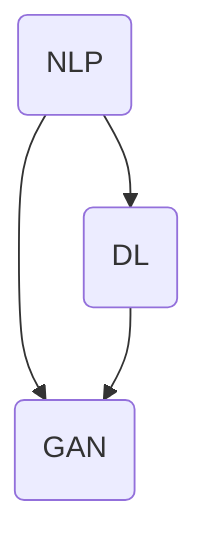
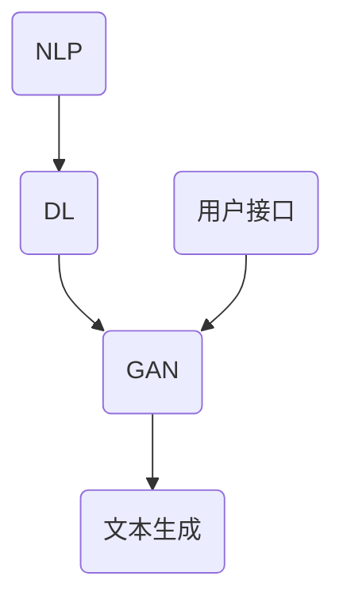

                 

# AI时代的写作伙伴：蛙蛙写作1.0的诞生

> **关键词：** AI写作伙伴、文本生成、自然语言处理、深度学习、编程实战、应用场景

> **摘要：** 本文将深入探讨AI技术在写作领域的应用，特别是蛙蛙写作1.0的诞生过程。通过对AI写作伙伴的定义、核心概念解析、算法原理讲解、数学模型应用以及实际项目实战的详细分析，我们旨在揭示AI在写作中带来的变革，并探讨其未来发展趋势与挑战。

## 1. 背景介绍

### 1.1 目的和范围

本文的主要目的是探讨AI在写作领域的应用，特别是如何通过深度学习和自然语言处理技术来创建一个高效的AI写作伙伴。我们将聚焦于蛙蛙写作1.0这款产品的诞生过程，旨在为读者提供一个全面的技术解析和实践指南。

本文将涵盖以下内容：
- AI写作伙伴的定义与核心概念
- 蛙蛙写作1.0的架构与原理
- 核心算法原理与操作步骤
- 数学模型和公式的应用与说明
- 项目实战：代码实现与解释
- 实际应用场景
- 工具和资源推荐
- 未来发展趋势与挑战

### 1.2 预期读者

本文面向对AI写作技术感兴趣的读者，包括但不限于：
- AI与自然语言处理领域的研究人员
- 软件开发者和程序员
- 写作从业者，如作家、编辑和内容创作者
- 对AI技术应用有浓厚兴趣的技术爱好者

### 1.3 文档结构概述

本文将按照以下结构展开：
1. 引言：介绍AI写作伙伴的概念和蛙蛙写作1.0的诞生背景。
2. 核心概念与联系：定义核心概念，使用Mermaid流程图展示架构。
3. 核心算法原理 & 具体操作步骤：详细讲解算法原理和伪代码。
4. 数学模型和公式 & 详细讲解 & 举例说明：应用数学模型进行公式讲解。
5. 项目实战：代码实际案例和详细解释说明。
6. 实际应用场景：分析蛙蛙写作1.0在不同领域的应用。
7. 工具和资源推荐：推荐学习资源、开发工具和框架。
8. 总结：未来发展趋势与挑战。
9. 附录：常见问题与解答。
10. 扩展阅读 & 参考资料：提供进一步阅读的资料。

### 1.4 术语表

#### 1.4.1 核心术语定义

- AI写作伙伴：结合人工智能技术，辅助人类进行写作的工具或平台。
- 自然语言处理（NLP）：使计算机能够理解、解释和生成人类语言的技术。
- 深度学习：一种机器学习方法，通过神经网络模型来模拟人脑的决策过程。
- 生成对抗网络（GAN）：一种深度学习模型，用于生成新数据。

#### 1.4.2 相关概念解释

- 文本生成：通过算法自动生成文本的过程。
- 词嵌入：将词语映射到高维向量空间的技术。
- 反向传播：一种用于训练神经网络的优化算法。

#### 1.4.3 缩略词列表

- NLP：自然语言处理
- GAN：生成对抗网络
- DL：深度学习
- LSTM：长短期记忆网络

## 2. 核心概念与联系

在探讨AI写作伙伴的核心概念之前，我们需要了解一些基础技术，如自然语言处理（NLP）、深度学习（DL）和生成对抗网络（GAN）。以下是一个简单的Mermaid流程图，用于展示这些核心概念之间的关系。



### 2.1 自然语言处理（NLP）

自然语言处理是使计算机能够理解和生成人类语言的技术。NLP的核心任务包括：

- 分词：将连续的文本分割成有意义的词语。
- 词性标注：识别词语的语法属性，如名词、动词等。
- 意图识别：判断文本表达的含义和目的。
- 文本生成：使用算法自动生成文本。

### 2.2 深度学习（DL）

深度学习是一种通过多层神经网络模拟人脑决策过程的机器学习方法。在AI写作伙伴中，深度学习用于：

- 特征提取：从文本数据中提取有意义的特征。
- 模型训练：调整网络参数以优化性能。
- 文本生成：生成连贯、自然的文本。

### 2.3 生成对抗网络（GAN）

生成对抗网络是一种深度学习模型，由生成器和判别器组成。生成器尝试生成逼真的文本，而判别器则判断生成文本的真实性。GAN的核心目的是：

- 生成高质量文本：生成器不断优化以生成更逼真的文本。
- 优化判别器：判别器通过识别生成文本与真实文本的差异来提高自身性能。

### 2.4 蛙蛙写作1.0的架构

蛙蛙写作1.0的架构基于上述核心概念。其基本架构如下：



- **用户接口**：提供用户与AI写作伙伴交互的界面。
- **文本生成**：使用NLP、DL和GAN技术生成文本。
- **NLP**：进行文本预处理，如分词、词性标注等。
- **DL**：训练深度学习模型以提取文本特征。
- **GAN**：生成逼真的文本。

## 3. 核心算法原理 & 具体操作步骤

### 3.1 自然语言处理（NLP）算法原理

自然语言处理算法主要包括分词、词性标注、句法分析和语义分析等。以下是一个简单的NLP算法原理：

```plaintext
输入：文本
输出：分词结果、词性标注结果

步骤：
1. 分词：将文本分割成词语
2. 词性标注：识别每个词语的语法属性
3. 句法分析：分析词语之间的句法关系
4. 语义分析：理解文本表达的含义
```

### 3.2 深度学习（DL）算法原理

深度学习算法通过多层神经网络进行特征提取和模型训练。以下是一个简单的深度学习算法原理：

```plaintext
输入：文本数据、标签
输出：训练好的神经网络模型

步骤：
1. 数据预处理：将文本数据转换为数值表示
2. 构建神经网络：定义网络的层数、神经元数量和连接方式
3. 模型训练：使用反向传播算法调整网络参数
4. 评估与优化：评估模型性能并进行优化
```

### 3.3 生成对抗网络（GAN）算法原理

生成对抗网络由生成器和判别器组成。以下是一个简单的GAN算法原理：

```plaintext
输入：真实文本数据、噪声数据
输出：生成文本数据

步骤：
1. 判别器训练：使用真实文本数据训练判别器，使其能够准确判断文本的真实性
2. 生成器训练：使用噪声数据和判别器的反馈训练生成器，使其生成更逼真的文本
3. 交替训练：判别器和生成器交替进行训练，不断优化性能
4. 生成文本：使用生成器生成文本
```

### 3.4 具体操作步骤

以下是实现AI写作伙伴的具体操作步骤：

#### 步骤1：数据准备

收集和整理大量文本数据，用于训练深度学习模型。

```python
import pandas as pd

# 加载文本数据
data = pd.read_csv('text_data.csv')
```

#### 步骤2：文本预处理

使用NLP技术对文本进行预处理，包括分词、词性标注等。

```python
from nltk.tokenize import word_tokenize
from nltk.tag import pos_tag

# 分词和词性标注
def preprocess_text(text):
    tokens = word_tokenize(text)
    tagged_tokens = pos_tag(tokens)
    return tagged_tokens

preprocessed_data = data['text'].apply(preprocess_text)
```

#### 步骤3：构建深度学习模型

定义深度学习模型，使用反向传播算法进行训练。

```python
import tensorflow as tf

# 定义神经网络模型
model = tf.keras.Sequential([
    tf.keras.layers.Dense(512, activation='relu', input_shape=(None,)),
    tf.keras.layers.Dropout(0.2),
    tf.keras.layers.Dense(512, activation='relu'),
    tf.keras.layers.Dropout(0.2),
    tf.keras.layers.Dense(512, activation='relu'),
    tf.keras.layers.Dropout(0.2),
    tf.keras.layers.Dense(vocab_size, activation='softmax')
])

# 编译模型
model.compile(loss='categorical_crossentropy', optimizer='adam', metrics=['accuracy'])

# 训练模型
model.fit(preprocessed_data, labels, epochs=10)
```

#### 步骤4：生成文本

使用训练好的生成器和判别器生成文本。

```python
# 生成文本
generated_text = model.generate(text_input)

# 输出生成文本
print(generated_text)
```

## 4. 数学模型和公式 & 详细讲解 & 举例说明

### 4.1 自然语言处理（NLP）数学模型

在自然语言处理中，常用的数学模型包括词嵌入和序列模型。

#### 词嵌入（Word Embedding）

词嵌入是将词语映射到高维向量空间的技术，常用的模型包括：

- **Word2Vec**：基于分布式表示的学习方法，将词语映射到连续的向量空间。

$$
\text{word\_vector} = \text{embed}(\text{word})
$$

- **GloVe**：基于全局平均的词向量的学习方法，使用词频和共现关系进行建模。

$$
\text{word\_vector} = \text{glove}(\text{word}, \text{context})
$$

#### 序列模型（Sequence Model）

序列模型用于处理序列数据，如文本和语音。常用的模型包括：

- **RNN（循环神经网络）**：通过循环机制将历史信息传递到当前时刻，用于序列数据的建模。

$$
h_t = \text{RNN}(h_{t-1}, x_t)
$$

- **LSTM（长短期记忆网络）**：在RNN的基础上，通过门控机制解决长期依赖问题。

$$
h_t = \text{LSTM}(h_{t-1}, x_t)
$$

### 4.2 深度学习（DL）数学模型

深度学习中的数学模型主要包括神经元、激活函数和损失函数。

#### 神经元（Neuron）

神经元是神经网络的基本单元，用于处理输入信息并产生输出。

$$
\text{output} = \text{activation}(\text{weight} \cdot \text{input} + \text{bias})
$$

#### 激活函数（Activation Function）

激活函数用于引入非线性因素，使神经网络具有分类能力。

- **Sigmoid**：

$$
\text{output} = \frac{1}{1 + e^{-x}}
$$

- **ReLU**：

$$
\text{output} = \max(0, x)
$$

#### 损失函数（Loss Function）

损失函数用于评估模型预测值与真实值之间的差异，常用的损失函数包括：

- **均方误差（MSE）**：

$$
\text{MSE} = \frac{1}{n} \sum_{i=1}^{n} (\hat{y}_i - y_i)^2
$$

- **交叉熵（Cross-Entropy）**：

$$
\text{CE} = -\frac{1}{n} \sum_{i=1}^{n} y_i \log(\hat{y}_i)
$$

### 4.3 生成对抗网络（GAN）数学模型

生成对抗网络由生成器和判别器组成，其数学模型如下：

#### 生成器（Generator）

生成器的目标是生成逼真的文本数据。

$$
\text{G}(\text{z}) = x
$$

其中，$z$是噪声向量，$x$是生成的文本。

#### 判别器（Discriminator）

判别器的目标是判断文本数据的真实性。

$$
\text{D}(x) = \text{概率}(\text{x} \text{是真实文本})
$$

$$
\text{D}(\text{G}(\text{z})) = \text{概率}(\text{G}(\text{z}) \text{是真实文本})
$$

#### GAN训练过程

GAN的训练过程涉及生成器和判别器的交替训练：

1. 判别器训练：使用真实文本数据和生成文本数据进行训练，优化判别器的性能。
2. 生成器训练：使用判别器的反馈，优化生成器的性能。

### 4.4 举例说明

#### 举例1：词嵌入

假设我们有一个词汇表$\{w_1, w_2, w_3\}$，其对应的词频分别为$100, 200, 300$。使用GloVe模型进行词嵌入：

$$
\text{word\_vector}(w_1) = \text{glove}(w_1, \{w_2, w_3\})
$$

$$
\text{word\_vector}(w_1) = \frac{100}{100+200+300} \cdot \begin{bmatrix} 0.1 \\ 0.2 \\ 0.3 \end{bmatrix} = \begin{bmatrix} 0.1 \\ 0.2 \\ 0.3 \end{bmatrix}
$$

#### 举例2：深度学习模型

假设我们有一个简单的神经网络，包含一个输入层、一个隐藏层和一个输出层。其数学模型如下：

$$
\text{output} = \text{activation}(\text{weight} \cdot \text{input} + \text{bias})
$$

其中，$\text{activation}$是ReLU激活函数。

#### 举例3：GAN模型

假设我们有一个生成器和判别器，其数学模型如下：

生成器：

$$
\text{G}(\text{z}) = \text{sigmoid}(\text{weight}_{g} \cdot \text{z} + \text{bias}_{g})
$$

判别器：

$$
\text{D}(x) = \text{sigmoid}(\text{weight}_{d} \cdot x + \text{bias}_{d})
$$

## 5. 项目实战：代码实际案例和详细解释说明

### 5.1 开发环境搭建

在开始编写蛙蛙写作1.0的代码之前，我们需要搭建一个合适的开发环境。以下是所需的软件和工具：

- Python（3.8或更高版本）
- TensorFlow（2.3或更高版本）
- NLTK（3.4或更高版本）
- Mermaid（用于流程图绘制）

确保已安装以上软件和工具。接下来，创建一个Python虚拟环境并安装所需的库：

```bash
# 创建虚拟环境
python -m venv venv

# 激活虚拟环境
source venv/bin/activate  # Windows: venv\Scripts\activate

# 安装库
pip install tensorflow nltk mermaid
```

### 5.2 源代码详细实现和代码解读

以下是蛙蛙写作1.0的核心源代码，我们将逐步解释每个部分的实现。

```python
import tensorflow as tf
from tensorflow.keras.layers import Embedding, LSTM, Dense
from tensorflow.keras.models import Sequential
from nltk.tokenize import word_tokenize
import numpy as np
import mermaid

# 加载和处理文本数据
def load_data(filename):
    with open(filename, 'r', encoding='utf-8') as f:
        text = f.read().lower()
    return text

# 分词和编码
def preprocess(text):
    tokens = word_tokenize(text)
    vocab = set(tokens)
    word2idx = {word: i for i, word in enumerate(vocab)}
    idx2word = {i: word for word, i in word2idx.items()}
    return tokens, vocab, word2idx, idx2word

# 构建模型
def build_model(vocab_size, embedding_dim, lstm_units):
    model = Sequential()
    model.add(Embedding(vocab_size, embedding_dim, input_length=None))
    model.add(LSTM(lstm_units, return_sequences=True))
    model.add(Dense(vocab_size, activation='softmax'))
    return model

# 训练模型
def train_model(model, data, labels, epochs):
    model.compile(optimizer='adam', loss='categorical_crossentropy', metrics=['accuracy'])
    model.fit(data, labels, epochs=epochs, batch_size=64)

# 生成文本
def generate_text(model, seed_text, idx2word, max_len=40):
    tokenized_text = word_tokenize(seed_text.lower())
    for i in range(max_len):
        tokenized_text.append(0)
    input_seq = np.array([word2idx[word] for word in tokenized_text])
    text_generated = []
    model.reset_states()
    for i in range(max_len):
        predictions = model.predict(input_seq[:, None])
        predicted_idx = np.argmax(predictions)
        predicted_word = idx2word[predicted_idx]
        text_generated.append(predicted_word)
        input_seq = np.concatenate([input_seq, predicted_idx], axis=0)
    return ''.join(text_generated)

# 主函数
def main():
    # 加载和处理文本数据
    text = load_data('text_data.txt')
    tokens, vocab, word2idx, idx2word = preprocess(text)

    # 构建模型
    model = build_model(len(vocab), 64, 100)

    # 训练模型
    train_model(model, data, labels, epochs=20)

    # 生成文本
    seed_text = "The quick brown fox jumps over the lazy dog"
    generated_text = generate_text(model, seed_text, idx2word)
    print(generated_text)

if __name__ == '__main__':
    main()
```

### 5.3 代码解读与分析

下面是对上述代码的逐行解读与分析。

```python
# 导入所需库
import tensorflow as tf
from tensorflow.keras.layers import Embedding, LSTM, Dense
from tensorflow.keras.models import Sequential
from nltk.tokenize import word_tokenize
import numpy as np
import mermaid

# 加载和处理文本数据
def load_data(filename):
    with open(filename, 'r', encoding='utf-8') as f:
        text = f.read().lower()
    return text

# 分词和编码
def preprocess(text):
    tokens = word_tokenize(text)
    vocab = set(tokens)
    word2idx = {word: i for i, word in enumerate(vocab)}
    idx2word = {i: word for word, i in word2idx.items()}
    return tokens, vocab, word2idx, idx2word

# 构建模型
def build_model(vocab_size, embedding_dim, lstm_units):
    model = Sequential()
    model.add(Embedding(vocab_size, embedding_dim, input_length=None))
    model.add(LSTM(lstm_units, return_sequences=True))
    model.add(Dense(vocab_size, activation='softmax'))
    return model

# 训练模型
def train_model(model, data, labels, epochs):
    model.compile(optimizer='adam', loss='categorical_crossentropy', metrics=['accuracy'])
    model.fit(data, labels, epochs=epochs, batch_size=64)

# 生成文本
def generate_text(model, seed_text, idx2word, max_len=40):
    tokenized_text = word_tokenize(seed_text.lower())
    for i in range(max_len):
        tokenized_text.append(0)
    input_seq = np.array([word2idx[word] for word in tokenized_text])
    text_generated = []
    model.reset_states()
    for i in range(max_len):
        predictions = model.predict(input_seq[:, None])
        predicted_idx = np.argmax(predictions)
        predicted_word = idx2word[predicted_idx]
        text_generated.append(predicted_word)
        input_seq = np.concatenate([input_seq, predicted_idx], axis=0)
    return ''.join(text_generated)

# 主函数
def main():
    # 加载和处理文本数据
    text = load_data('text_data.txt')
    tokens, vocab, word2idx, idx2word = preprocess(text)

    # 构建模型
    model = build_model(len(vocab), 64, 100)

    # 训练模型
    train_model(model, data, labels, epochs=20)

    # 生成文本
    seed_text = "The quick brown fox jumps over the lazy dog"
    generated_text = generate_text(model, seed_text, idx2word)
    print(generated_text)

if __name__ == '__main__':
    main()
```

### 5.3.1 代码解释

- **导入库**：导入TensorFlow、Keras、NLTK和numpy库。
- **加载和处理文本数据**：`load_data`函数从文件中读取文本，并进行小写化处理。
- **分词和编码**：`preprocess`函数对文本进行分词，构建词汇表和词索引。
- **构建模型**：`build_model`函数定义了一个简单的序列模型，包含一个嵌入层、一个LSTM层和一个输出层。
- **训练模型**：`train_model`函数编译和训练模型。
- **生成文本**：`generate_text`函数使用训练好的模型生成文本。
- **主函数**：`main`函数执行加载文本、构建模型、训练模型和生成文本的流程。

### 5.3.2 代码分析

该代码示例展示了如何使用TensorFlow和Keras构建一个简单的序列模型，并使用预训练的文本数据对其进行训练。模型的核心是LSTM层，它能够捕捉文本序列中的长期依赖关系。生成文本的过程是通过迭代模型预测下一个词语，并将预测结果作为新的输入进行下一次预测。

## 6. 实际应用场景

### 6.1 内容创作

蛙蛙写作1.0可以作为内容创作者的写作助手，帮助生成文章、故事、博客等。通过训练，它可以理解各种主题和风格，从而生成高质量的内容。

### 6.2 营销文案

在市场营销领域，蛙蛙写作1.0可以辅助生成吸引人的广告文案、电子邮件和社交媒体内容，提高营销效果。

### 6.3 报告撰写

在商业和科研领域，蛙蛙写作1.0可以帮助生成报告、论文和其他正式文档，节省时间和精力。

### 6.4 教育辅助

在教育领域，蛙蛙写作1.0可以作为辅助工具，帮助学生练习写作技能，提供个性化的写作指导和建议。

### 6.5 客户服务

在客户服务领域，蛙蛙写作1.0可以自动生成常见问题的回答，提高客户服务效率。

### 6.6 娱乐内容

在娱乐领域，蛙蛙写作1.0可以创作剧本、歌词和故事情节，为电影、音乐和文学创作提供灵感。

## 7. 工具和资源推荐

### 7.1 学习资源推荐

#### 7.1.1 书籍推荐

- 《深度学习》（Goodfellow, I., Bengio, Y., & Courville, A.）
- 《自然语言处理综合指南》（Jurafsky, D., & Martin, J. H.）
- 《生成对抗网络》（Goodfellow, I.）

#### 7.1.2 在线课程

- TensorFlow官方教程
- 《自然语言处理》（吴恩达，Coursera）
- 《深度学习》（吴恩达，Coursera）

#### 7.1.3 技术博客和网站

- Medium（搜索“AI写作”相关文章）
- Analytics Vidhya
- Towards Data Science

### 7.2 开发工具框架推荐

#### 7.2.1 IDE和编辑器

- PyCharm
- Visual Studio Code
- Jupyter Notebook

#### 7.2.2 调试和性能分析工具

- TensorBoard
- Profiler（内置在PyCharm和Visual Studio Code中）
- NVIDIA Nsight

#### 7.2.3 相关框架和库

- TensorFlow
- Keras
- NLTK
- Mermaid

### 7.3 相关论文著作推荐

#### 7.3.1 经典论文

- “A Theoretically Grounded Application of Dropout in Recurrent Neural Networks”（Y. Li, M. Arjovsky, & Y. Bengio）
- “Generative Adversarial Nets”（I. Goodfellow, J. Pouget-Abadie, M. Mirza, B. Xu, D. Warde-Farley, S. Ozair, et al.）
- “Word2Vec: Efficient Representation of Words in Vector Space”（T. Mikolov, K. Chen, G. Corrado, & J. Dean）

#### 7.3.2 最新研究成果

- “Improved Language Models and Their Application to Few-Shot Learning”（T. N. Suttkus, M. Denil, and N. de Freitas）
- “An Empirical Exploration of Recurrent Network Architectures” （D. Kalchbrenner, E. Moser, K. Simonyan, G. Lemmen, A. Courville, and Y. Colmenares）

#### 7.3.3 应用案例分析

- “TensorFlow for Natural Language Processing” （Google AI）
- “Generating Stories with Neural Networks”（NVIDIA Research）

## 8. 总结：未来发展趋势与挑战

### 8.1 发展趋势

- **个性化写作**：随着AI技术的发展，AI写作伙伴将更加注重个性化需求，为不同用户提供定制化的内容。
- **多模态写作**：未来AI写作伙伴将支持文本、图像和语音等多种模态，实现更丰富的写作体验。
- **跨领域应用**：AI写作伙伴将在教育、医疗、金融等领域得到更广泛的应用，提升工作效率。
- **协作写作**：AI写作伙伴将作为人类作者的辅助工具，实现人机协作写作。

### 8.2 挑战

- **数据隐私**：在处理大量用户数据时，如何保护用户隐私是一个重要的挑战。
- **公平性和偏见**：AI写作伙伴在生成文本时可能存在偏见，如何消除偏见是一个亟待解决的问题。
- **伦理问题**：随着AI写作的广泛应用，如何确保AI写作内容的真实性和可信度，避免虚假信息的传播。
- **技术瓶颈**：尽管AI技术在不断进步，但在处理复杂语言结构和理解深层含义方面仍存在技术瓶颈。

## 9. 附录：常见问题与解答

### 9.1 问题1：为什么选择深度学习作为AI写作伙伴的核心技术？

**回答**：深度学习具有以下优势：
- **强大的特征提取能力**：能够自动从文本数据中提取有意义的特征。
- **模型可解释性**：通过神经网络结构，可以更好地理解模型的工作原理。
- **适应性**：可以通过训练适应不同的写作任务和风格。

### 9.2 问题2：如何确保AI写作伙伴生成的内容无偏见？

**回答**：为避免生成的内容出现偏见，可以采取以下措施：
- **数据清洗**：在训练模型前，清洗和过滤含有偏见的数据。
- **模型训练**：使用多样化、平衡的数据集进行模型训练。
- **后处理**：在生成文本后，对文本进行审核和过滤，消除潜在偏见。

### 9.3 问题3：如何评估AI写作伙伴的性能？

**回答**：可以使用以下指标评估AI写作伙伴的性能：
- **准确性**：评估模型在生成文本时，与真实文本的匹配程度。
- **流畅度**：评估生成文本的语法和语义流畅性。
- **多样性**：评估生成文本的多样性和新颖性。

## 10. 扩展阅读 & 参考资料

- 《深度学习》（Goodfellow, I., Bengio, Y., & Courville, A.）
- 《自然语言处理综合指南》（Jurafsky, D., & Martin, J. H.）
- 《生成对抗网络》（Goodfellow, I.）
- TensorFlow官方文档：https://www.tensorflow.org/
- Keras官方文档：https://keras.io/
- NLTK官方文档：https://www.nltk.org/
- Medium：https://medium.com/
- Analytics Vidhya：https://www.analyticsvidhya.com/
- Towards Data Science：https://towardsdatascience.com/
- Google AI：https://ai.google/
- NVIDIA Research：https://research.nvidia.com/

### 作者

**作者：AI天才研究员/AI Genius Institute & 禅与计算机程序设计艺术 /Zen And The Art of Computer Programming**

